# 拒绝电池思维 课程01：知识付费会在下一个经济周期衰败吗？ 🤔


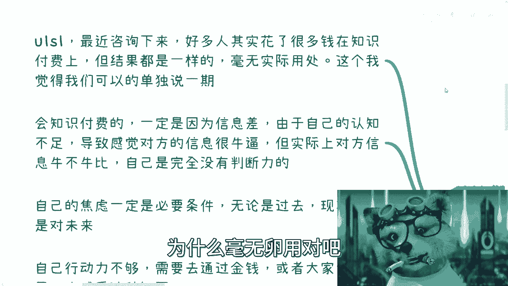

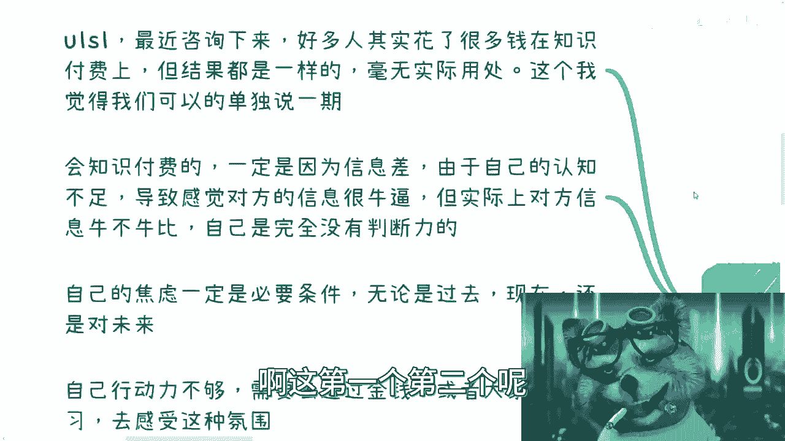

在本节课中，我们将探讨一个核心问题：知识付费模式是否会在下一个经济周期中衰败？我们将从多个角度分析知识付费的底层逻辑、用户心理和商业模式，帮助你理解其本质和未来走向。

## 为什么需要知识付费？ 💡

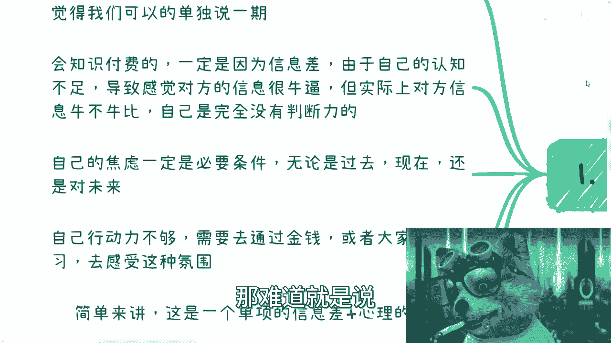

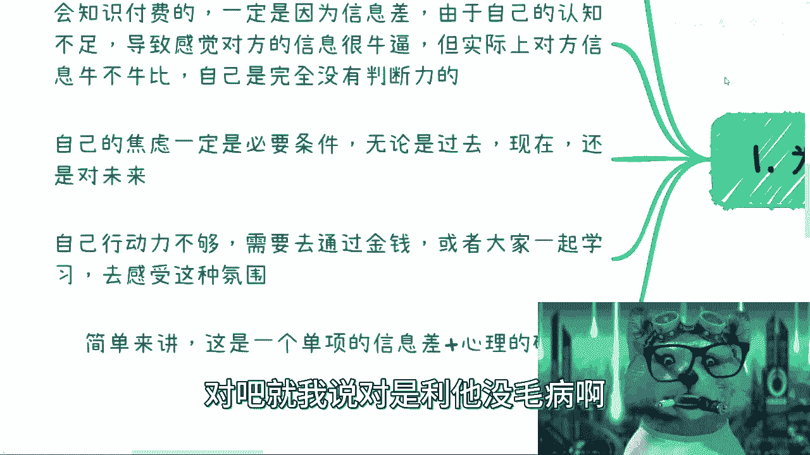

上一节我们提出了核心问题，本节中我们来看看人们为什么会为知识付费。根据观察和咨询案例，许多人投入了大量资金进行知识付费，但结果往往收效甚微。这背后有几个关键原因。


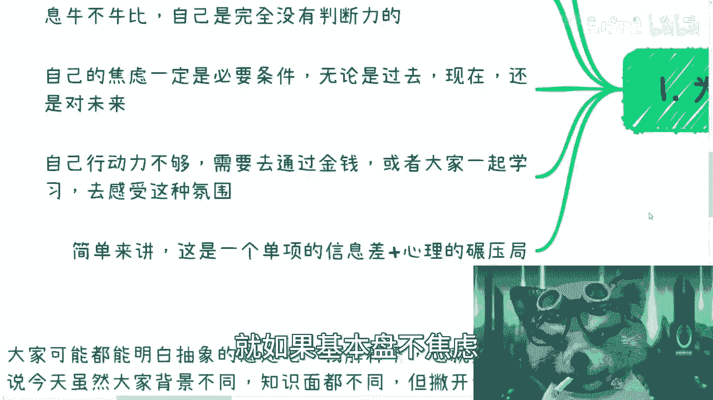

以下是驱动知识付费的几个核心因素：

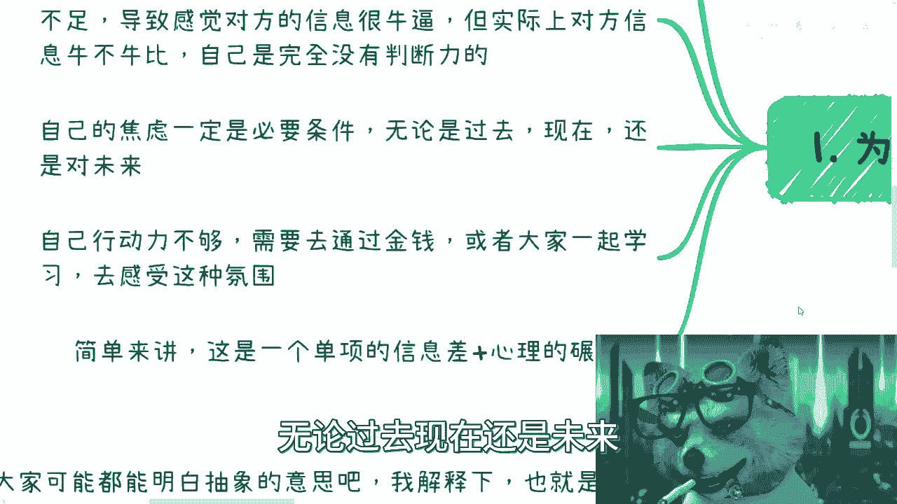


*   **信息差与认知不足**：用户由于自身认知局限，无法判断对方提供的信息是否真正有价值。这就像网络诈骗中，受害者因为无法验证对方身份（如是否是“美女”），仅凭感觉就相信了对方。
*   **焦虑情绪**：焦虑是促使人们进行知识付费的必要条件。从人性角度看，基本盘人群的焦虑是普遍且持续的，这与经济周期无关。
*   **行动力不足与寻求监督**：一些人希望通过支付金钱来“刺痛”自己，从而驱动行动，或希望融入一个共同学习的氛围来获得监督感（例如“付费早起群”）。
*   **单向的心理碾压**：本质上，许多知识付费场景是“收割者”对“韭菜”的单向局，融合了**信息差**、**心理优势**和**PUA技巧**。

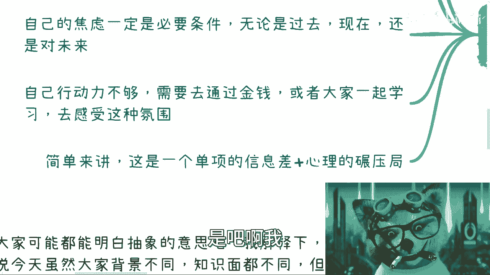

## 个人如何看待知识付费？ 🤨

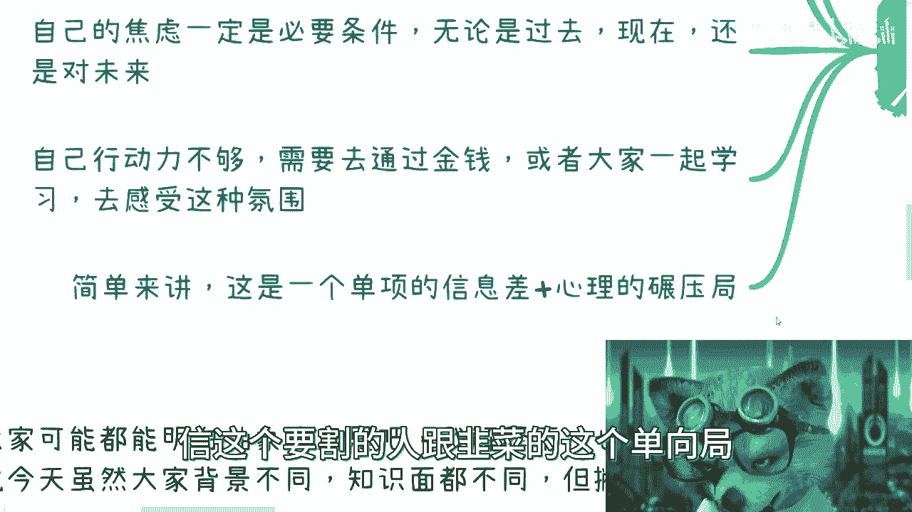

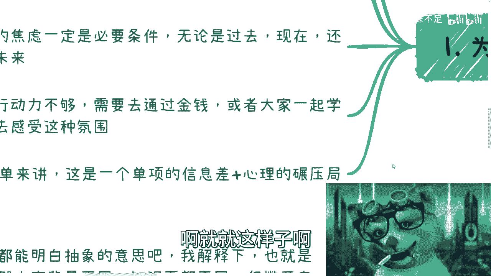


在了解了普遍动机后，我们来看看一个更实际的视角：个人应如何对待知识付费？作者分享了自己的看法和经验。


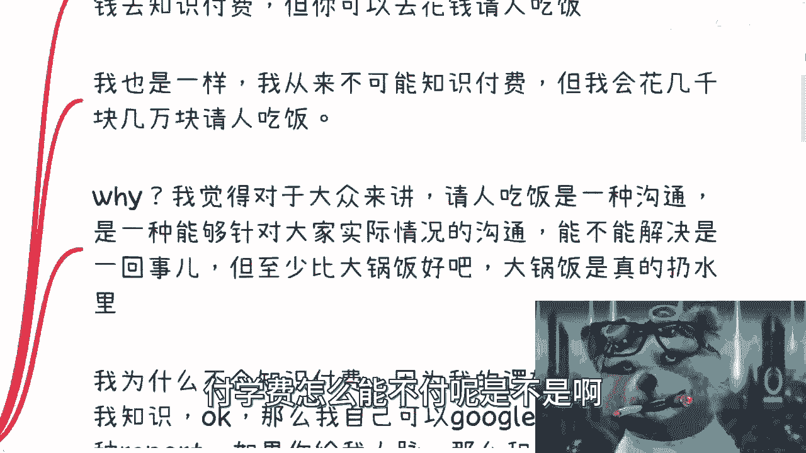


作者坦言自己也交过“学费”，但目前的观点是：不建议大众盲目进行知识付费，更建议将钱用于“请人吃饭”。原因在于，点对点的沟通能更针对个人实际情况，比标准化、单向的“大锅饭”课程更有效。


一个简单的逻辑是：如果一个能让人普遍成功的“通用方法”能以低价（如999元）大规模售卖，那么社会早已实现“均富”，这显然不符合现实世界的运作规律。


作者进一步解释了自己为何不再进行知识付费：
1.  **知识获取**：真正有价值的知识可以通过阅读行业报告、咨询专家学者等免费或低成本方式获得，无需通过付费课程。
2.  **人脉搭建**：通过付费获取的“人脉”，其价值存疑。世界上有类似资源的人很多，并非不可替代。真正稀缺、有价值的合作机会，不会以公开付费的形式大规模兜售。


**核心公式**：`付费可得的资源价值 ≈ 该资源的稀缺性成反比`

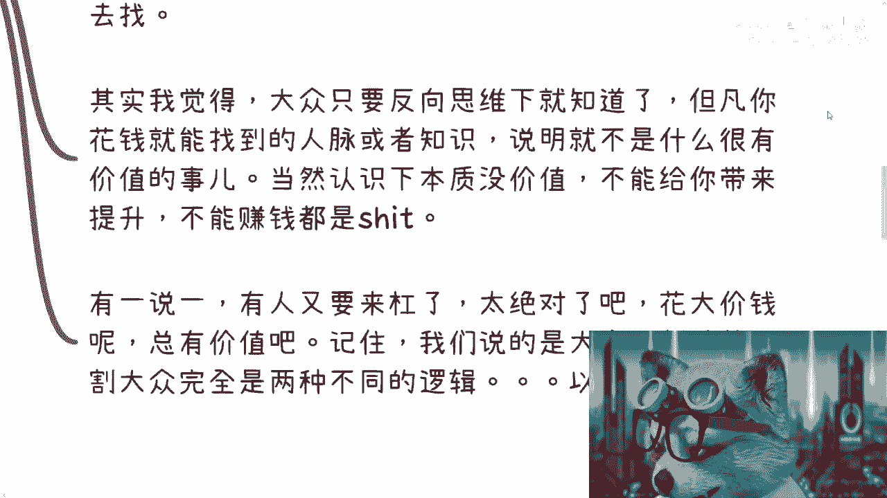

需要强调的是，以上讨论主要针对“基本盘”大众。针对高净值人群的“知识服务”是完全不同的商业模式和逻辑。

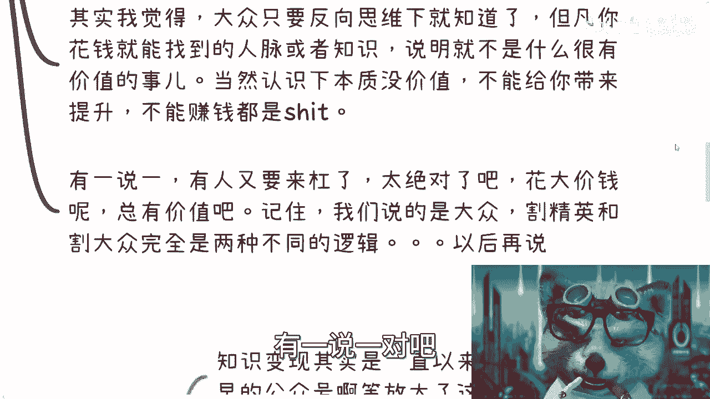

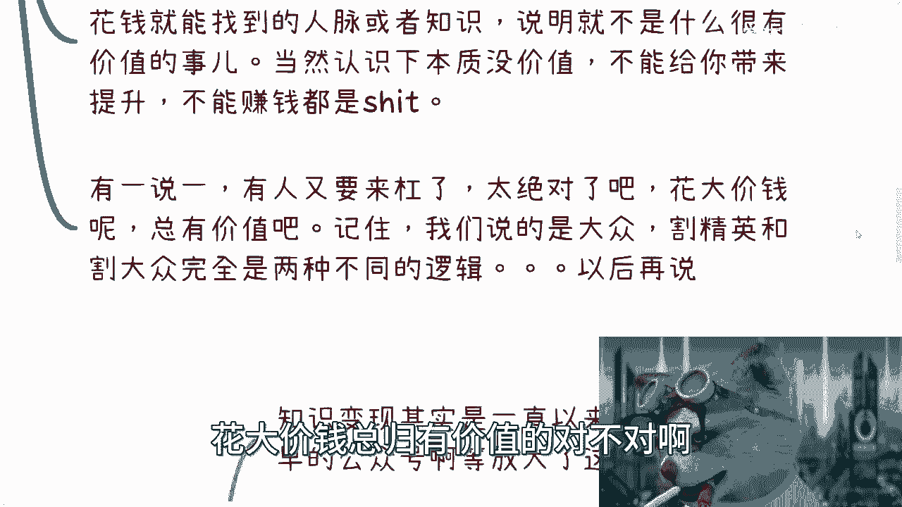

## 商业模式的抽象与通用性 🔄

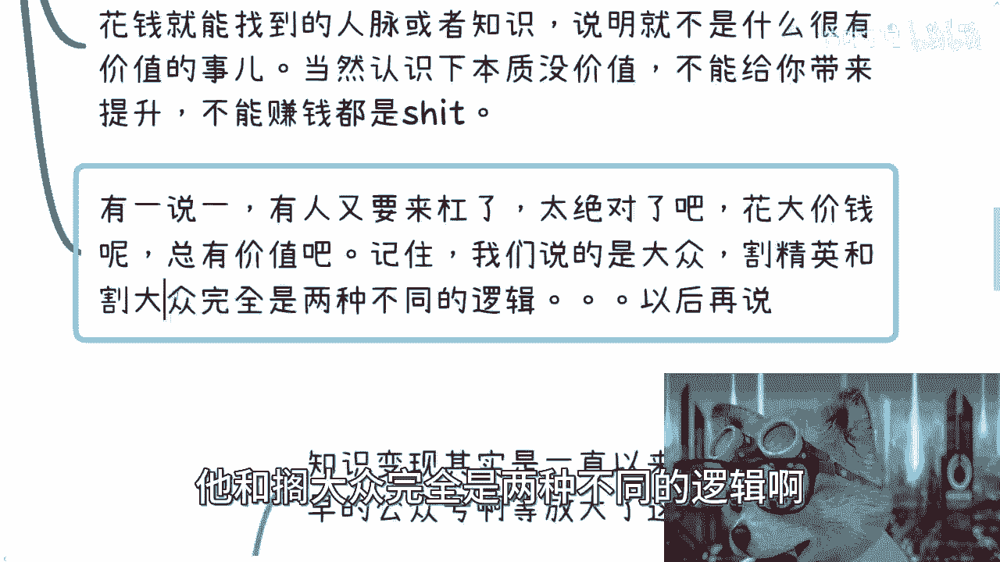


上一节我们讨论了个人策略，本节我们将视角提升，看看知识付费背后的商业模式逻辑。理解这一点，就能明白其为何难以衰败。

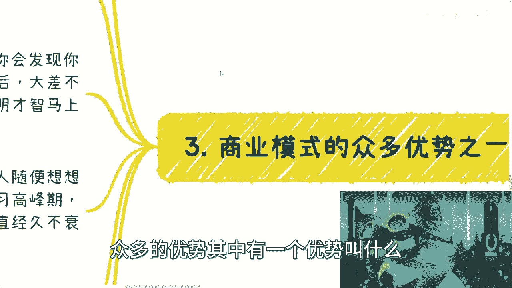

商业模式的核心优势之一在于“**抽象**”。即撇开特定行业、专业知识和复杂关系，用通用的、对方能理解的逻辑来阐述商业本质。例如，将复杂的政府合作项目，抽象为A、B、C、D几个角色之间的关系来解释。

对于基本盘而言，在商业模式上“**不要重复造轮子**”，最好的方式是“**Ctrl+C, Ctrl+V**”（复制成功模式）。关键在于摸清任何一个微小商业模式的“0到1”闭环，包括：
1.  **谁买单**（目标客户）
2.  **怎么营销**（获客方式）
3.  **如何打通关系**（人脉与执行）

**核心代码**：
```plaintext
商业模式成功 = 抽象出通用逻辑(目标客户 + 获客方式 + 关系网络)
```

一旦掌握了这种抽象的通用模式，无论从事哪个行业（卖粉、大数据、AI甚至其他），其底层运作逻辑都是相通的。这解决了人们害怕“换行业等于从零开始”的焦虑，因为技能可能过时，但通用的商业操盘能力不会。

## 知识付费会衰败吗？ 📈📉


基于前面的分析，我们现在可以正面回答最初的问题：知识付费会不会在下一个经济周期衰败？


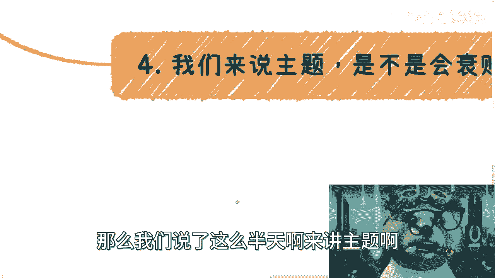

答案是否定的。知识变现的需求自古有之，互联网只是放大了这种模式。其形式从过去的K12等“刚需”，扩展到如今众多“非刚需”但能制造“需求感”的领域。

知识付费的模式极其多样化，面向普罗大众、中小企业、特定机构等不同群体，每个细分领域都有其独特的玩法和很深的“水”。因此，**无论时代、内容、热点如何变化，知识付费作为一种“通用商业模式”永远走得通**。

其与经济周期的关系，类似于二级市场：
*   **经济不好时**：人们渴望“以小博大”和寻求心理安慰（抓住救命稻草），知识付费能满足后者。
*   **经济好时**：热点频出，媒体放大，人们更容易头脑发热，为更高的溢价（如9999元课程）付费。

**核心总结**：`知识付费的兴衰 ≠ 经济周期的函数`，它更像是一种基于人性弱点（焦虑、希望、认知差）的恒定商业模式。


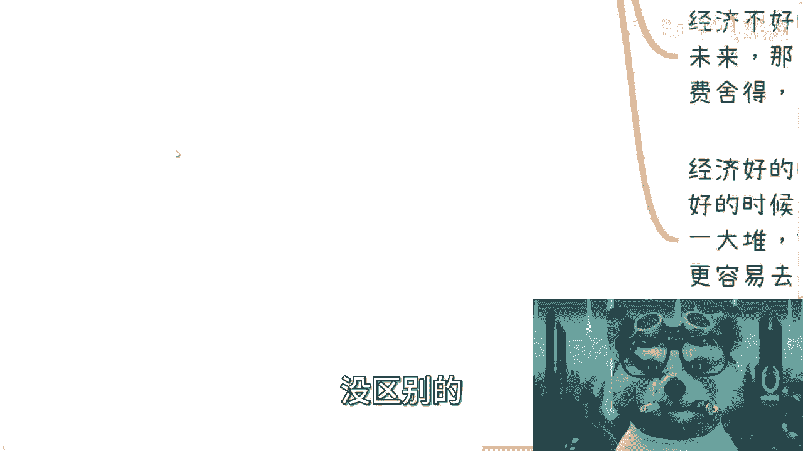

## 为什么这么多人投身知识付费？ 🏃‍♂️💨


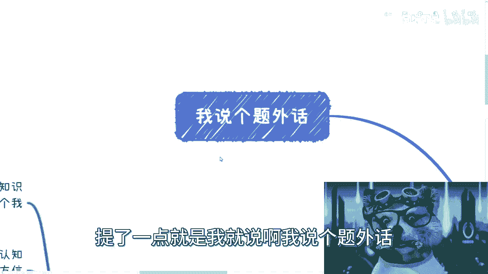


最后，我们探讨一个衍生问题：为什么各行各业的人都涌入知识付费领域？


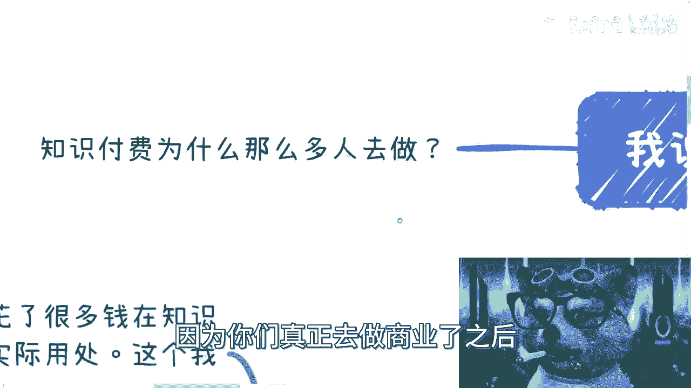

从商业实践角度看，原因如下：
1.  **高投入产出比**：相对于许多实体或复杂关系型生意，知识付费的启动和运营门槛相对较低。
2.  **强可插拔性与结合性**：知识产品很容易作为其他产品或服务的“售前”环节，与多种商业模式结合。
3.  **低法律风险**：只要不涉及金融诈骗等，纯粹的知识分享模式在法律上风险极小。
4.  **看似美好的前景**：“宇宙的尽头是带货”，而“课”本身就是一种虚拟的“货”。

但需要清醒认识的是：**单纯的培训或咨询很难赚到大钱**。它们往往需要作为“组合拳”的一部分，为后续更深入的服务或实体产品引流。如果缺乏后端转化，仅靠前端课程走量，利润空间也会被营销等成本大幅侵蚀。

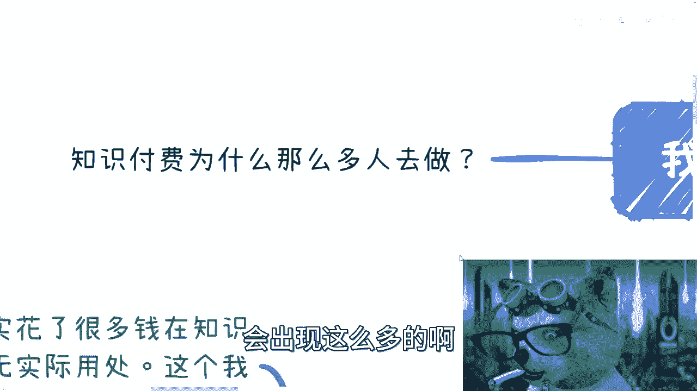

---


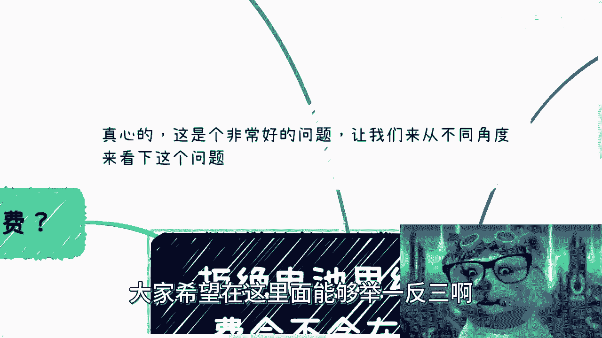

本节课中我们一起学习了知识付费不会在下一个经济周期衰败的根本原因。我们剖析了其背后的用户心理、抽象的通用商业模式本质，以及其与经济周期的独特关联。关键在于理解，知识付费贩卖的往往不是“知识”本身，而是针对焦虑、信息差和希望的心理解决方案。对于个人而言，比起购买标准化课程，针对性的沟通（如“请人吃饭”）和掌握抽象的通用商业逻辑，可能是更有效的成长路径。