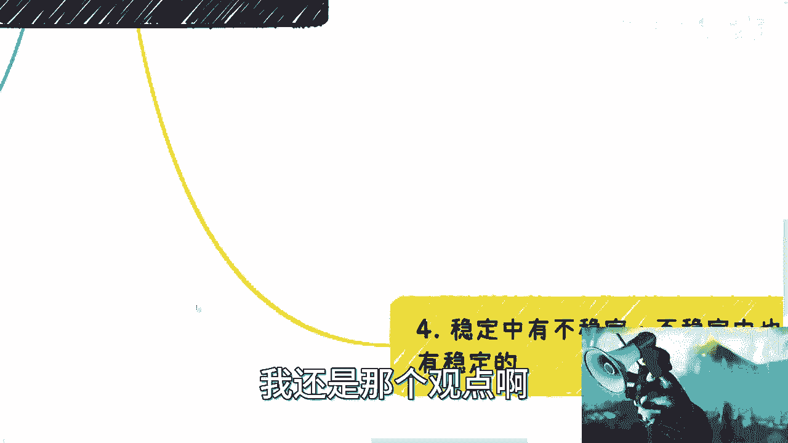
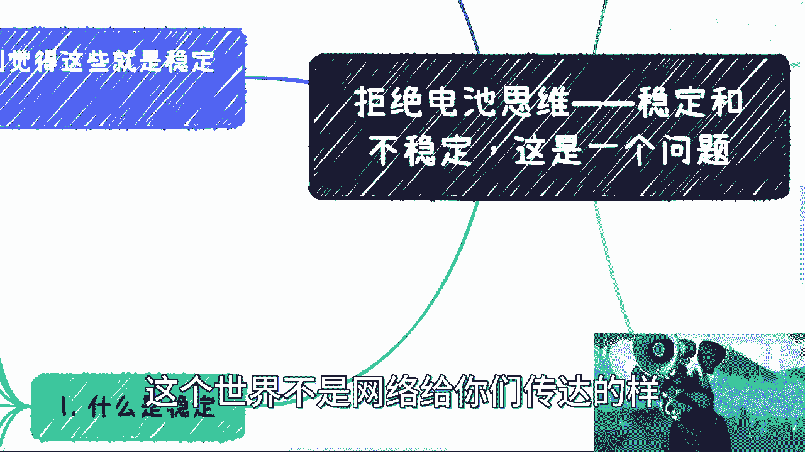
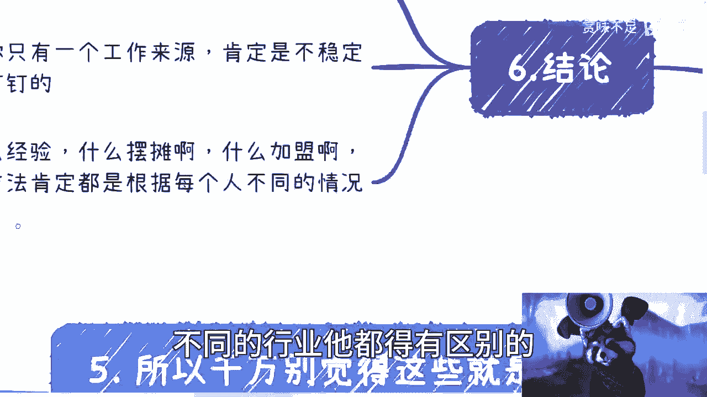

# 拒绝电池思维——稳定和不稳定，这是一个问题 - P1 - 赏味不足 - BV1Sz4y1q7hU

啊大家好啊，日日更区博主是吧。

我最近咨询做的老多，老多了就非常多差，有的多的时候一天要做个8~10个都有，其中呢就是关于这个问题就特别多，就是稳定更不稳定啊，然后我觉得嗯反正今天可以聊一下吧。

我把它列的已经蛮细了，就是大家可以看一下，我靠今天这个我真的是裂的老细了对吧。

写小作文来了就行，首先是这样子的啊对吧，这个嗯没有没有骂人是吧，我还是比较温和的，什么是稳定对吧，首先呢我现在看了一下，我觉得大部分人跟我聊呢，都说稳定这个东西呢他们是没有认知的，呃认知都是来源于父母。

来源于学校对吧，来源于比如说周边环境啊，但是呢本质上来讲，我觉得现在大部分的年轻人对稳定这个东西呢，还是有一定的，就虽然他不知道啊，但是呢他抱有一定的质疑啊，就是说父母现在讲的那些稳定的。

本质上到底稳定不稳定，咱咱不知道对吧，打个问号好，这是第一个，第二个呢最近啊这个聊下来了，跟我说要稳定的越来越多，但是问题来了，什么是稳定对吧，什么是铁饭碗，我觉得啊就是说直白一点，你要说解放了对吧。

可以你就是给我一个工作，我也不说收入啊，我就不说收入，你让你让我做到个就是说这个退休对吧，就可以了，但是呢就是说虽然说是这么说啊，但是你至少得要保障我的基本的生活吧对吧，你比如说打个比方。

你说我现在有的东西对吧，你得维持我有对吧，你总不能说哦，你现在有的好，全部你回头就都没有了对吧，你该睡桥洞睡桥洞，该该该睡那个这个这个路边睡路边对吧，那不行啊对吧，那对我来讲。

所谓稳定就是或者我觉得对大部分人来讲，这个稳定的点是在于说你可以降低生活品质，可以降低生活要求，但是你不能说有质变对吧，你不能说就是直接跨阶层的那种变化，然后你跟我说哦，你能做到呃这个退休。

那那这种稳定我要他干嘛呢，对不对，那我觉得这个也不是说大部分人想要的稳定吧，对吧，那么这是第一个，第二个呢，我觉得稳定呢这个一方面指的是说所有的事情，或者说部分事情，他都是能够自己可控的。

而不至于说第二天请起来，比如说别人说不要你就不要你了对吧，然后说倒闭就倒闭了对吧，说怎么样怎么样就怎么样了对吧，那好同样的呢，我觉得啊在这个上面啊。

稳定呢，还有就是你要有多个plan哦，也就是我们称之为不能有单个的收入啊，你但凡今天只要有单个收入来源，这个肯定是不靠谱的，就是从目前的整个全球跟整个经济形势来看，只要你是单个收入的，肯定是不稳定。

你别想都别想，我可以告诉你这板上钉钉的事情啊，那么所谓稳定就是说你得有多个收入来源，也就是我这边写的多个plan，那plan a b CD f g对吧，你这样你心理才会踏实，你才会有所谓的稳定啊。

或者我们才会有所谓的相对的稳定，对不对，然后这一点我觉得是很重要的，那么稳定呢其实核心啊，我觉得就是说稳定的这个根源啊，就是比如说我们我们把这些表面现象都抛开，对吧，稳定的根源。

其实是你知道有一套或者多套抽象的方法论，这个方法论是什么呢，就是说就是说首先因为没有一个行业，一个热点是永久的对吧，没有一个技术是永久的，你当然我们指的永久是说你能够去赚钱了。

因为很多技术是发展到今天也很多年了对吧，但是他的蛋糕被分的差不多了，那你进去其实你也没什么蛋糕可以分是吧，所以说这套方法论是在于说，无论你今天在什么行业，无论你今天做什么，无论你今天卖什么东西对吧。

或者说是什么方式赚钱啊，用什么却不重要，重要的是这套方法论对你来讲，你是可以把任何东西，就像一个抽象模型一样往里面去套的，那么我们简单来讲是什么，你就像我说到现在跟你们说，比如说你认识人啊对吧。

积累关系啊，然后合作啊对吧，包括就是说呃赚甲方的钱啊，赚乙方的钱啊，或者说赚服务方的钱啊，赚政府的补贴啊，政策啊对吧，其实整个这一套它同，其实都是一套成熟的方法论，但是这套方法呢得要你每个人去悟。

或者得要每个人去实践去去总结对吧，因为这套东西今天还是那句话，今天你们不管是做外贸对吧，还是做做做供应链还是做，比如说那个电商啊，还是做嗯，甚至啊比如说你们去做一些实验或者做些什么。

其实这些方法论在过程当中，无论你做什么，你都是可以往上套的，因为你你心理知道就是你去认识了，你要比如说你去认识人了，或者你要去合作了，或者你要去商业了，你自己知道你想要的是什么对吧。

只不过就是说你在不同的行业，可能就是说里面的一些业务细节啊，或者说技术细节啊，或者说合作的这个准则规则大家不一样，但是从商业本质你走到哪都是一样的，没有区别的对吧，这就像以前我跟呃，以前我早早期吧。

我做过一个视频，就是说你要去赚钱的，前提是你得让店铺对方先赚钱对吧，那这个事情你无论跑到哪都是一样的啊，包括就是说你去呃，我们刚刚说的，你去赚别人甲方的钱啊，你去拿政策补贴啊，拿些什么东西啊。

这些东西只不过是细节，我们叫做战术上面可能会有些区别，但是战略层面没有任何区别对吧，但凡你要有但凡你要有一定的这个经验，其实真的就是你完全就是，你心里面其实是知道的，就是你哪怕今天去了一个这个。

这个完全零起步的，就是零起点的对吧，完全白手起家的一个行业，你也不慌，为什么，因为你有自己的一套，就是这种叫做啊开拓市场啊对吧，或者认识人的方法，方法论和模式，那其实在你去哪都一样。

所以我觉得这个其实是一个稳定的核心啊，那么包括呢就是这边我又提了一点啊，就是说很多人其实沟通到现在呢，他们还觉得考研对吧或者对吧，什么什么是最稳定的对吧，我就不方便说了是吧。

我跟你讲这些就属于梦没有醒过来，但是呢我也可以明确告诉你们，反正也没几年可以做了啊，也没几年可以做了，反正就是对吧，后面几年大家自己也都知道啊，到时候就看就好了啊，反正还是那句话对吧。

出来混总归要还的对吧，早晚都要还，同样的，就是不是每一个人都是能够过上好日子的，也不是每一个人都能够啊，这个这个相对自由的时间又能够赚到钱，不是的对吧，那本来就是一个比例问题，所以对吧。

那个越是这么想的人呢，反正唉自己看着办吧，嗯我的二呢222222在这啊，那么我们讲完稳定对吧，什么是不稳定不稳定啊。

首先嗯从上一辈来讲对吧，只要觉得你不上班就是不稳定的啊，反正你只要有地方交无线已经就是稳定的啊，无论你干什么，反正他们也不关心你干什么对吧，那当然啊这个我不是说这个这个吐槽父母啊。

就是啊就大部分是这样子的对吧，就没办法教育就是这么样子的是吧啊，这第一个第二个呢我觉得对于大局来讲呢，你只要不闹，你就是稳定的啊，什么意思呢，就是说你只要吃他上午饭对吧，你只要能够在网上键盘喷喷对吧。

满足你内心的一些小需求啊，小小情绪，你只要不闹啊，都是稳定是吧，这是第二点啊，第三点呢就是说啊，你只要一份收入来源就是不稳定的，这个我刚才是说的很清楚的，就是我不管你现在在什么地方。

我也不管你现在赚赚多少钱，我一点都不关心啊，你跟我说你年薪500万，我也就是哦结束了又怎么样呢，对不了，就说白了对吧，就是薪资低的，薪资高的我也都看过对吧，大起大落也都看过是吧。

你你什么两周内妈的身价几个亿，跌到几百万的，我也看过，这都算什么事情，无所谓的呀，是不是，所以我跟你们讲，就是你跟我说，你有一只要单份收入，我觉得都是不稳定的，我不管你多高，而且你越高你越不稳定。

就这么简单，对不对，就很多人就是很很搞笑，你知道吗，就是那种感觉，就就我只活这一个月啊，我这一个月薪资很高，我就很爽是吧，未来好像不活了一样啊，然后这是一个对吧，那另外一个你说不稳定是什么。

就是所有的未来他都是不稳定的对吧，你你你就是可能我觉得很多人啊，就理论上来讲啊，他都懂对吧，你问他，你说你能不能预测未来啊对吧，你尼古拉斯凯奇是吧啊你你不能预测对吧，那你问他未来稳定不稳定啊。

他也知道不稳定的，但问题是他不会把这种不稳定因素考虑进去，对吧，然后他还要PUA自己，哎我觉得我现在蛮稳定的对吧，肯定没有意义啊，对不对啊，就是你就想嘛，大家都知道对吧，你你都知道未来发生什么。

你你是肯定不清楚的对吧，包括看看你看看过去10年的历史，你就知道了，所谓不稳定，所谓变化就是常态，哪来的稳定啊对吧，而且在这个地方我也得说啊，就是如果真的大家标榜普通人啊，我跟你们讲。

最近还有很多人跟我提到过别的一些up主对吧，所提到的一些观点哈，真的是吐槽无力啊，我待会待会回来说我就不点名了对吧，这个不要制造矛盾是吧啊，如果真的说普通人呢，我跟你主播只跟你们讲。

只有相对波动大的时候才有机会，否则没有机会了，就这就就这么简单啊，你没有波动对吧，你你你你蛋糕分的给分光了，我就请问问你，你又说你是个普通人，哪来了哪他妈来的机会是吧，好第三个啊，第三个是什么呢。

就是稳定也好，不稳定也罢，我跟你们讲这些都是相对的啊，这就跟几天前几天我们说什么读书有没有用，是一样的，我也看到了呀，就五五开嘛，对不对，有的人觉得有用，有的人觉得没有用，那都对对不对。

因为大家切入点不一样，是不是，那那那当然了，你切入点如果不能切入点，如果非常的反人类对吧，或者来说反客观的情况，那就很不对了，你比如说有些人说读书有用的对吧，我陶冶情操对吧，我自己觉得我读的能吸收。

那没毛病啊，那有些人觉得哎我读了没有用对吧，读了我也看不懂对吧，读了好像对我也没什么帮助，也不能增加我收入，那他觉得没有用，那也没毛病对吧，但是但凡你今天有一个人跟我说，诶我觉得这个读书非常没有用啊。

我觉得就一刀切就是没有用，为什么，因为我的逻辑就是读书就应该给我赚钱，如果读书不能给我赚钱，那大家就是垃圾，那我觉得你就不对，对不对，你要辩证的客观的看这个东西是吧，那你说那个稳定都不稳定也是一样的。

就是你需要有足够的认知，你才能做出正确的选择对吧，那我们来看啊，比如说我举些例子，比如说啊这个有很多人也会看到啊，什么什么建议开药房对吧，开药店，然后还要下沉城市，你知道吗，就就就什么三四线城市啊。

做医医药供应链，我我跟你们这么说啊，就是我为什么在这个地方说，很多人认知有问题呢，就是因为首先第一点啊，中国是一个各个城市，各个地方它都是很好区分，有很大区别的一个一个国家啊。

这第一点第二点是越往下沉市，其实越是有地头蛇的对吧，大家都知道，就是很多产业它是被分割的很清楚的对吧，就你你我们活到今天，今天大几乎所有，我们说99。9%，99999999的产业都是被分割清楚的。

然后就像我们之前说的，如果你发现一个没有被分割，甚至没有人做的，那你就应该去考虑可能是不是触碰红线了，或者是不是说被人垄断了，只不过你不知道对吧，而不要像一个这叫什么，就是就是小朋友一样说哎这个东西好。

别人都没想到，我是最牛逼的对吧，我是天才对吧，就怎么死的都不知道啊对吧，所以你你不要说，你不要说到下层市场去做电了对吧，你更不要说开药房了，你就算开个人何东西，你去看看啊，你怎么切你，你你相对下沉市场。

你就属于一个外来病毒啊对吧，我不是说城市歧视啊，这本来就是你人生地不熟，水土不服，各个东西都不熟哦，你说开就开啊，啊哎这莫名其妙了，你说是吧，哦这么这么这么差的经济环境对吧，这么样子啊，说开就开啊。

都能赚钱，那全那全中国老百姓全部都那个脱贫致富是吧，那这怎么可能呢，你说是不是对吧，然后还有说什么说摆摊实体店的，哎呦我真的是服了对吧，摆摊我跟你们讲，先不说城管对吧，先不说这些管理上面，你摆摊。

你去摆摆摊，你看看你投入产出比有几个人坚持了下来对吧，然后有有多少人是有深意的对吧，实体店就更不要说了，前两天陈赫对吧，这个这个火锅店陈赫是退出的，下面加盟店呢对吧，鬼哭狼嚎，我就请问吧，有人来管不来。

有有人有人关心，来了，对不来了，那那些那些说哎呀，你们去摆摊，你们去加盟对吧，然后你们一年多少多少万对吧，那些人站站着说话不腰疼的，有用吗，没有用的啊，剩下不是还是还不是老百姓被割吗，对不对啊。

然后还有什么，还有之前小伙伴哎，我跟你们讲还很好笑啊，好玩嘞，创业跟我说做眼镜的哎，这个如果你们看到这个做眼镜小伙伴，看到我这个视频，我不是吐槽你们啊，我客观的说啊，就还有创业去做眼镜的，你们想想看啊。

眼镜这个东西是一个暴力行业对吧，所谓暴力行业是什么，就以它的水很深，也就意味着他背后一定有他的利益团体，这个东西是一个老百姓能切就去切的嘛对吧，这是第一点，第二点是眼镜这个东西，我就请问他有什么痛点。

你跟我说啊，是个人都戴眼镜，说没毛病啊，那世界上能做眼镜多了，中国人做眼镜多了这么多品牌了对吧，小到几百块，多到几千块，都多到几万块，怎么了呢，你你你现在做一个，你是切了什么痛点还是什么东西呢。

我也不明白对吧啊，白手起家做眼镜哎，就吊也是吊的是吧啊，然后还有什么呢，就是我这地方说得很清楚，就我们做事，我跟你们说啊，就你们现在做一件事情啊，我不管你们是上班也好，还是做别的东西很好。

我觉得很多人他就没有思考过，他做这件事情意义是什么，就是就是我一直说商业逻辑，什么叫商业逻辑，就是你做这件事情，你要想明白你到底缺的是热点的这个流量，还是切的是人性的弱点，还是缺的是政治。

还是切的是行业的痛点对吧，还是切别人不要的，你一个都没切，然后就那边说啊，我我我要做电商，我要做自媒体，我要做什么东西，有用吗，没有用的呀，这就跟病急乱投医生一样的，没有意义的呀对吧。

然后做了两年之后就开始说哎呀吕老师，我觉得我没有积累对吧，我没有沉淀，我又赚不到钱，这不屁话吗，开始之前就没想好，你要做什么，对不对，我给你举个例子啊，比如说切热点对吧，你跟我说，你要去卖GPT的课。

卖AI的课，我觉得没问题啊，但是你要想好啊，你可能就一卖一两个月对吧，卖了之后被人家骂，但是你别管对吧，你要想好，你就切这点你想清楚吗，就跟我前两天说的对吧，你要么就想清楚做做做慈善。

要么想就是赚钱结束了呀，对不对，你要么就切人切人性是什么，那风水对不对，信仰玄学对不对，要要要要么就是那个卖卖那个贩卖焦虑，对不对，然后麦克你不切人性嘛，对不对，你要么切政治，切政治是什么，切政治。

你就像我现在一样的对吧，我我去给企业做咨询，给政府政府做咨询对吧，你你说我切的痛点吗，我不觉得有什么痛点，那我缺的是什么，我切的就是政治，切的政治，政治里面政策对不对，你要么切痛点。

那痛点现在是很难找到，我跟你们讲，因为痛点这个东西很多时候还是那句话，你觉得是痛点，但是行业不觉得对吧，你永远是YY的一个痛点出来，那你真的能解决它吗，你解决他前期都要投入很大的钱和精力。

那这个东西对于很多普通人来讲也是做不到的，对不对，还有一个要么你就切别人不要的，什么叫别人不要的，OK我给你们讲一个，比如说啊大公司做销售，现在销售类项目的，低于100万或者低于150万都不做的。

为什么，因为销售没有提成就这么简单，那你们去做呗，你们就去签那些小小呃小收入的kiss，对不对，没人做，而或者是没大厂做，对不对，要么就是要么就是那个那个区分分一些什么，分一些就是犄角犄角旮旯的对吧。

边角料的一些业务也可以啊对吧，但是你们得找得到啊对吧，但是现在很多人不找啊，他上来就在那边说我要做这个对吧，就说我要摆摊对吧，我要我要干嘛对吧，我要我要怎么样子，就是就是怎么说呢。

因为因为我毕竟在上海对吧，我在上海新天地对吧，就是在我的认知里面，你能赚钱，只要赚的钱量不是特别大，只要那种小钱对我来讲就跟没赚钱没有区别，你知道吗，所以说我是觉得就是说既然大家付出努力，付出时间了。

那自然而然要把一些就是商业逻辑想清楚，否则这投入进去时间没有用啊，对不对，啊那么这个是三对吧，还有四呢，哎呀是啊，四四在这对吧，四就是说我们稳定中有不稳定啊。

不稳定中有稳定对吧，这个就是屁话啊，那我们来看啊，首先你比如说看似稳定的东西是什么，其实我跟你们说看似稳定的，它就收入属性就是这种角色，你比如说举个例子，比如说你父母觉得稳定那些工作，OK我们来看啊。

这些工作稳定吗，也许是相对稳定的，我觉得没毛病对吧，很多人说做工作，公务员，做医生对吧，做做教师编制的教师对吧，但是我跟你讲，很多东西你看似稳定，就是所有事情都是两面形态，有有利有弊嘛，对不对。

那你比如说很有可能他是内耗的，那我就说每个人情况不一样，有的人他是不关心的，他说影响不到我对吧，我的精神很强大是吧，无所谓啊，那但有的人呢就容易精神了很好，有的人容易情绪波动，那我就问嘛。

最后你做事做一个稳定工作，但是你的精神状态很差，请问到最后我就问你们这个算稳定还不稳定呢，对不对，这第一点就在第二点，你就比如说我们现在收入经常说那句话，我说我们现在收入可能还不够，你以后付医疗费的。

对不对，那那那那我就问了很多人，其实在我现在这个年龄已经医生病了，对，就各种各样的什么什么什么吃药啊，各种各样的复查怎么样，我就请问你们觉得这叫稳不稳定吗，对不对啊，那么看似不稳定的是什么呢。

就是我跟你们讲看似不稳定的，并不是说你有没有工作，这个不重要，重要的是你没有多条收入的来源，或者当下你没有没有问题，但是更深层次的不稳定，就是你自己对行业，对这个世界的认知太肤浅啊。

就是这就好像我这边写的，就像好像我们以前打星际，打魔兽争霸对吧，你一开始就都要看地图啊对吧，你全地图全部都是迷雾，你全地图是全部都是黑的行为，你自己也觉得荒地，这就是所谓的不稳定啊，对不对。

那其实我跟你讲，你放大了去看啊，你放大了去看你每个人对吧，我也好，你们也好，大家都是很渺小的，你们去看看学校，看看企业，看看地方政府，看看地方政策，看看产业对吧，你不要看10年嘛，就看近5年。

我觉得你们去看哪他妈有稳定的啊，哪儿有稳定这个东西的，没有打啊对吧，而且我跟你们讲，你真正只要赚过钱的，他都明白，所谓稳定的东西就是蛋糕越来越小，就是没有东西可以封了，他一点都不刺激对吧。

什么叫一点都不刺激，就是你没有赚钱的渠道，而且稳定的东西也不能真正的刺激经济发展，就这么简单，对不对，就是唉呀就是就是就是怎么说呢，就是说我们不能完全从我们的视角去出发，地球不是围着围着我们转的啊。

商业不是围着我们转的啊，然后就是因为现在很多年轻人，我还是那个观点啊。

就现在很多年轻人被网络实在是PUA太严重了，就是这个世界不是网络给你们传达的样子。

那个样子你们得要自己去看，你知道吗，所以就说啊千万别觉得啊嗯我在这个地方列了。

你千万别觉得这些知识稳定的什么呢，比如说啊我今天拿了多少多少package的offer对吧，你收入200万300万啊，吃了什么公司对吧，什么摆摊位对吧，什么躺赚多少多少，你问我这些是不是真的。

我跟你们讲，可以是真的没问题，但是我只关心你能持续多久，对不对，在我看来，这些东西没有一个能持续多久的，就是看上去昙花一现又如何呢，你能赚到钱是我承认，但是又如何呢，你把你把时间线只要放长。

这点钱对你来讲有什么意义，没有意义的呀，对不对，你但凡没有一个核心，你但凡没有掌握核心，没有任何的一些那个知识点，或者没有任何的一些自我傍身的，或者说呃护士有护城河的这种方法，方法论。

我们行业那句话说的很对啊，就是你凭运气赚到钱，回头全都会凭实力亏回去的，就这么简单，我不管你什么形式，亏回去都都会还回去的，你知道吧，所以我跟你们讲说一下结论啊，结论就是首先没有东西是绝对的。

你要选择稳定，不稳定取决于你的性格，我就这句话就是你要觉得你是图四级的，你是觉得能闯的，你就选择不稳定，你要觉得不能闯的，你就选择相对稳定，但是你心理要稳定，有一个这个树。

有一个有有一个有一个就是要有条线，有一根筋是什么，就是所有东西都是不稳定的，就这么简单啊，不管你选的是什么，都是不稳定的对吧，这是第一点，第二点是你从宏观角度来讲，你只要有一个，只要你只有一个工作来源。

肯定是不稳定的，这个是板上钉钉的对吧，我再强调第三遍了啊，然后还有一个是什么呢，就是别去套用什么经验，比如说人家说的摆摊啊，加盟啊对吧，这些怎么样，就是很多方式方法他也许成功过。

但是这个成功是跟时代跟时间都不一样的啊，他不是说你放到2000年成功的，你放到2023年还能成功，没有达对吧，而且很多东西它是有有客观因素的对吧，就是说哪个阶段到底做什么对吧，哪个阶段都有怎么样。

它是有不同的情况的，对吧，你说任何东西生搬硬套，比如说就像我们说的对吧，你们想想看吧，你们任何一个东西生搬硬套，如果你能成功，那不得了了，那全全球所有人都成功了，有点不现实的呀，对了。

就是所谓天时地利人和，这是有道理的，对不对，所以说呢就是说你方法也好，方法论也好，方式也好，你是根据每个人不同情况。

不同当下的局势对吧，不同的行业它都得有区别的。

所以说呢就是说我们在这地方提一点，就是我为什么今天要提这一点，是因为呃我希望大家能明白，从现在往后对吧，无论你们做什么，你不要再去追求所谓的稳定不稳定，而心理面得要明白，所有东西都是不稳定的啊。

从而要花时间得要花得，要尽快的去积累自己的那些所谓的plan，A b c d e f g，那么这个才是相对稳定的，而且在所谓不稳定的环境当中，你才能就是说立于不败之地，就这么个情况，好吧行。

那就这么着吧，然后反正你们有任何细节啊，有任何细节跟你们个人有关的吧，或者跟行业有关，跟什么有关的，反正你们都可以私信我好吧，私信来，我们可以来做这个付费的咨询好吧。

