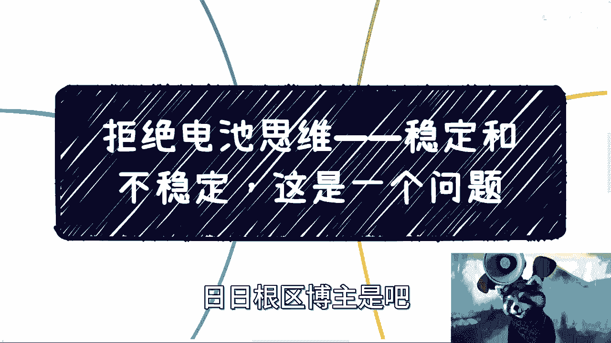
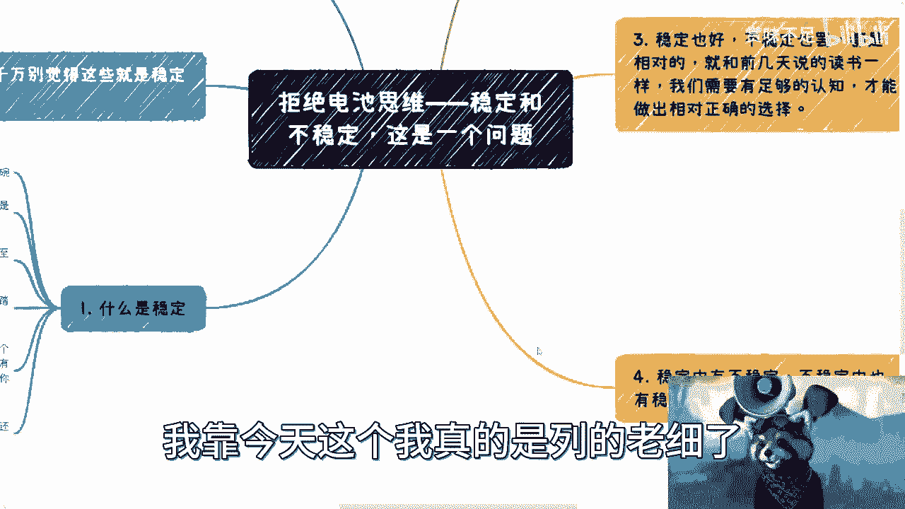
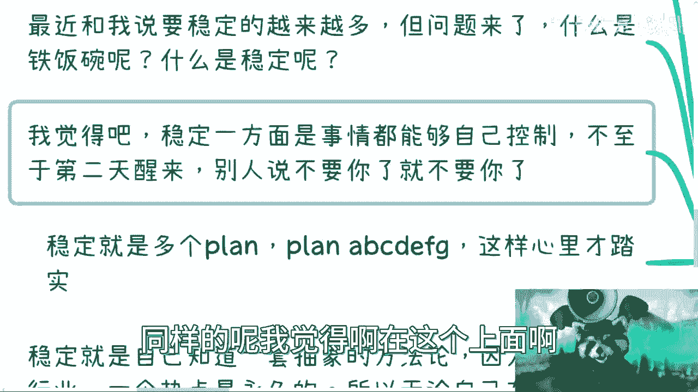
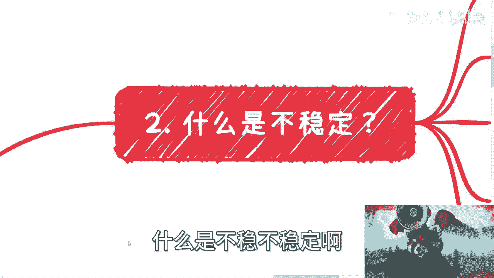
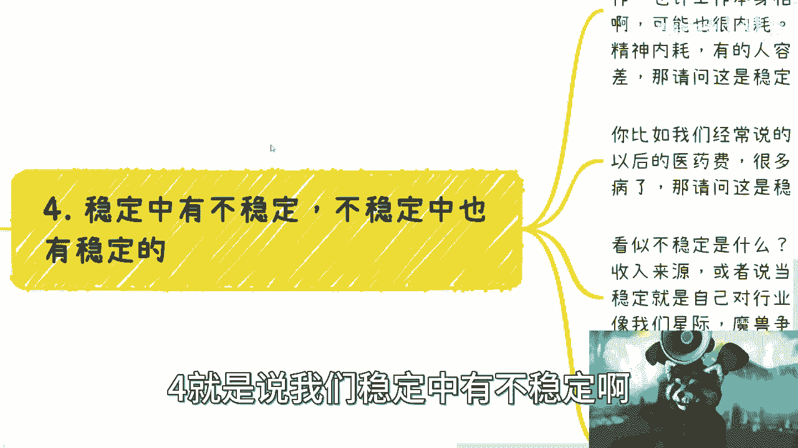
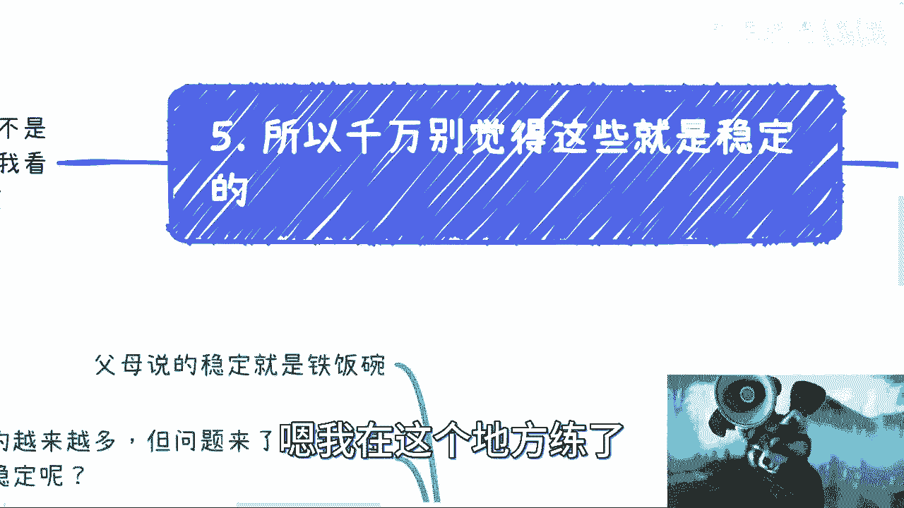

# 职业规划课程 P1：拒绝“电池思维”——深入探讨稳定与不稳定 📊

在本节课中，我们将深入探讨一个核心的职业与人生议题：什么是真正的“稳定”？我们将拆解常见的认知误区，分析稳定与不稳定的本质，并为你提供一套构建个人“相对稳定”系统的方法论。

---

## 一、 什么是“稳定”？🤔

上一节我们提出了核心问题，本节中我们来看看“稳定”的常见定义及其局限性。

许多人对于“稳定”的认知来源于父母、学校或周边环境。然而，年轻一代开始质疑这种传统定义的“稳定”是否真的可靠。

所谓“稳定”，通常被理解为一份可以做到退休的工作。但这远远不够。真正的稳定需要满足以下条件：

以下是构成“稳定”的几个关键要素：

1.  **保障基本生活底线**：稳定意味着生活品质可以有量变（如下降），但不能有质变（如阶层滑落）。一份工作若无法保障基本生活，则无稳定可言。
2.  **对事务有可控性**：稳定指大部分事情的发展在个人可控范围内，而非完全受制于外部环境（如突然失业、公司倒闭）。
3.  **拥有多个收入来源（Plan B/C/D...）**：在当今经济形势下，**单一收入来源绝对是不稳定的**。真正的稳定来自于构建多个收入渠道，即拥有多个“Plan”。
4.  **掌握可迁移的抽象方法论**：这是稳定的核心根源。行业、技术会过时，但一套成熟的商业与方法论是永恒的。这套方法论可以抽象为：
    *   **核心公式**：**稳定 = 可迁移的方法论 × 多元收入渠道**
    *   这套方法论包括：积累人脉关系、促成合作、理解甲方/乙方/服务方的盈利模式、利用政策等。无论进入哪个新行业，这套战略层面的思维模型都适用，区别仅在于战术细节。

许多人仍将考研、考编等视为最稳定的路径。需要清醒认识到，任何依赖单一系统且缺乏自身核心竞争力的“稳定”都是脆弱的，且环境正在变化。

---

## 二、 什么是“不稳定”？🌪️

理解了“稳定”的多元定义后，我们再来剖析“不稳定”的常见表现与深层原因。

“不稳定”同样需要从多个层面来理解：

以下是“不稳定”的几种典型认知和表现：

1.  **上一代的单一标准**：在上一辈看来，只要不上班、不交社保，就是不稳定的。他们往往不关心工作的具体内容。
2.  **系统层面的定义**：从大局看，只要个人不制造社会矛盾，能够维持基本生活与情绪宣泄（如在网上发表意见），就被视为“稳定”。
3.  **单一收入来源**：再次强调，**无论薪资多高，只要收入来源是单一的，就是不稳定的**。薪资越高，可能意味着风险越集中。
4.  **忽视未来的不确定性**：从本质上讲，未来本身就是不确定的。许多人虽然理性上承认这一点，但并不会将不确定性纳入人生规划，并常常自我安慰现状很稳定。
5.  **对普通人而言，没有波动就没有机会**：一个完全固化、蛋糕分完的市场，对普通人意味着没有上升通道。**机会往往蕴藏在市场的波动和变化之中**。

稳定与不稳定是相对的，关键在于个人认知。缺乏足够的认知，就无法做出明智选择。例如，盲目听从“下沉市场开药店”、“跟风摆摊加盟”、“白手起家做眼镜”等建议，而没有分析其商业逻辑，就是认知不足的表现。

做任何事之前，必须思考其商业逻辑：你切入的是**热点流量**、**人性弱点**、**政策红利**、**行业痛点**，还是**别人不要的边角料市场**？如果都没有，那么努力很可能无法积累有效沉淀。

---

## 三、 稳定与不稳定的辩证关系 ⚖️

上一节我们分别定义了两者，本节我们来看看它们如何相互交织、相互转化。

世界不是非黑即白的，稳定中蕴含着不稳定，不稳定中也存在着稳定的内核。

以下是两者辩证关系的具体体现：

*   **看似稳定中的不稳定**：
    *   **精神内耗**：一份体制内工作可能稳定，但复杂的人际关系与内耗可能严重损害心理健康，这何尝不是一种不稳定？
    *   **健康代价**：长期高压工作换来的稳定收入，未来可能不足以支付健康透支带来的医疗费用。
*   **看似不稳定中的稳定**：
    *   **不稳定不在于没有工作，而在于认知肤浅**。这就像打游戏时地图全被战争迷雾覆盖，自然觉得危机四伏。
    *   **真正的稳定内核是认知与方法论**。当你掌握了可迁移的认知框架和方法论（即“点亮了地图”），即使身处变化的环境，内心也是安稳的。
*   **宏观视角下的真相**：放大视野看，企业、行业、地方政策，近五年都充满变数。绝对的稳定并不存在。所谓“稳定”的领域，往往也意味着增长停滞、机会稀少。

当前许多年轻人被网络信息过度影响。需要警惕那些宣扬“高薪Offer”、“躺赚项目”的片面信息。关键问题是：**你能持续多久？** 没有核心方法论和护城河，凭运气赚的钱，最终常会凭实力亏掉。

---

## 四、 核心结论与行动指南 🎯

综合以上讨论，我们可以得出以下结论与行动方向。

**核心结论**：
1.  **没有绝对的稳定**：选择稳定或动荡的路径，应基于个人性格与风险偏好。但无论选择哪条路，都必须清醒认识到：一切都不稳定。
2.  **单一收入等于不稳定**：这是铁律，必须致力于构建收入多元化的“反脆弱”系统。
3.  **拒绝生搬硬套**：别人的成功经验受特定天时、地利、人和影响。方法必须结合个人情况、当下局势和行业特点进行调整，不可盲目复制。

**行动指南**：
从现在开始，停止追求虚幻的“绝对稳定”。你应该做的是：

**快速积累你的 Plan A, B, C, D...**。将时间精力投入到构建多元收入渠道和提升可迁移的核心认知与方法论上。**这才是你在一个本质上不稳定的世界中，能建立的、最可靠的“相对稳定”**。

---

本节课中，我们一起学习了稳定与不稳定的多维定义，辨析了常见的认知误区，并理解了构建个人稳定系统的核心在于**多元收入**与**可迁移的方法论**。希望你能打破“电池思维”，主动规划，在不确定中建立属于自己的确定性。