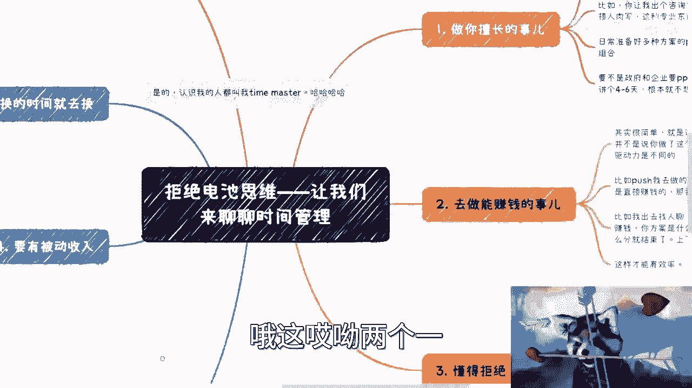
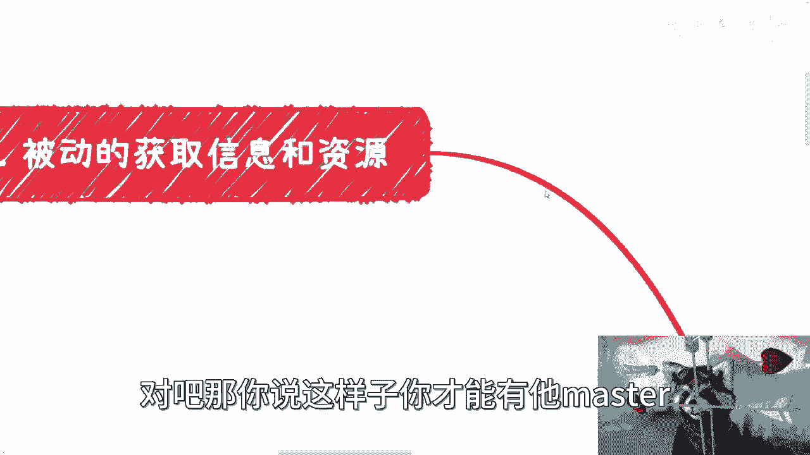

# 时间管理核心思维课 - P1 🕒

在本节课中，我们将要学习一种不同于传统认知的时间管理思维。很多人认为时间管理就是制定计划、按时完成任务，但我们将探讨几个更本质、更有效的核心原则，它们共同作用才能真正提升你的效率和生活掌控感。

## 概述：重新定义时间管理

很多人认为时间管理是关于规划和执行。但根据我的经验，这并非核心。我认为时间管理的本质在于一系列思维和生活方式的调整，而不仅仅是技巧。

上一节我们概述了传统认知的误区，本节中我们来看看我认为真正重要的几个核心点。

## 核心原则一：做你擅长的事 🎯

做你擅长的事情能极大提升效率。如果你做的是不擅长的工作，即使为了薪水勉强去做，心情和效率都会很低。

**核心逻辑**：`效率 ∝ 擅长程度`。你越擅长，单位时间内的产出越高。

例如，让我撰写一份专业咨询方案，我几乎不需要查阅资料，可以直接完成。因为这是我擅长的领域，知识储备充足。

日常工作中，我会提前准备好许多PPT和文档模板。当需要交付成果时，我只需进行排列组合，这比从零开始节省大量时间。录制这个视频也是如此，构思脑图十分钟，录制二十分钟，总耗时很短。如果一件事需要我花费半天甚至一天，而我又不从中获利，我根本不会去做。

## 核心原则二：做能直接赚钱的事 💰

所做之事能否直接转化为金钱，是驱动力的关键。这不同于只为了一份固定月薪工作。

驱动力因人而异，可能源于金钱、精神追求或成就感。驱动力不足，往往是因为所做的事情没有触及你的核心需求。

推动我高效行事的，常常是一份份明码标价的合同。直接的经济回报是强大的动力。在商业洽谈中，我也会直截了当：讨论如何赚钱、方案是什么、如何分工。上下文和铺垫并不重要。

**核心逻辑**：`动力强度 ∝ 价值转化直接性`。回报越直接、越清晰，动力越强。

单纯有规划（原则一）不够，加上直接的经济驱动（原则二），效率才能叠加，实现真正的时间管理。

## 核心原则三：懂得拒绝 🚫

懂得拒绝是保护时间的关键。我不会承接我不懂、做不了或纯粹浪费时间的事情。

以下是拒绝的几个层面：

1.  **拒绝不擅长的机会**：即使报酬丰厚，如果我不懂某个领域（如AI专题演讲），需要大量时间调研学习，投入产出比过低，我会拒绝。
2.  **拒绝无效社交**：我几乎不主动进行社交，也不参加无意义的会议活动。这节省了大量时间。当然，对于需要积累人脉的初学者，适当社交是必要的，但这与无目的的社交不同。
3.  **拒绝情绪内耗**：不要为与己无关、不能赚钱且消耗时间的事情浪费情感。许多焦虑源于认知不足将问题放大，而非事实本身。关注自身，减少外界无关信息的干扰。

## 核心原则四：建立被动收入 💎

拥有被动收入不只为了钱，更是为了心态。当你有稳定的额外收入，面对房租、贷款等生活压力时，思维不会陷入“穷人模式”。

没有经济压力，你的心态会更平稳，思考会更理性、更有远见，不会因焦虑而失去判断力。心态好，效率自然高，做事也更有底气。

**核心影响**：`心态稳定性 ∝ 财务安全性`。财务安全是良好心态和高效决策的基础。

## 核心原则五：用金钱换取时间 ⏳

在许多事情上，能用钱解决就不要浪费时间。纠结于细节（如设计Logo、制作小动画）往往得不偿失。

**决策公式**：`IF (时间成本 > 金钱成本) THEN 付费解决`。

例如，能外包的任务就外包，只要不亏本，可以当作积累资源和经验。出行时，打车比地铁贵，但可能为你换来更好的心情、状态以及用于思考或休息的时间，价值可能远超差价。

核心在于，除非非你不可，否则尽量让别人去做。事必躬亲是打工者思维，善于利用资源和生态才是高效的赚钱方式。

## 核心原则六：被动获取信息 📡

我主动搜索信息只在必要时进行，例如感到重大危机需要深入了解市场时。

日常的行业信息和动态，我依靠一个网络：许多朋友、伙伴会主动分享一线信息给我。我几乎不看朋友圈，因为网络信息多经过加工和美化。

**信息获取模式**：`信息流 = 主动挖掘（低频，深度） + 被动接收（高频，广度）`。

同样，我80%的业务机会也是别人主动找上门的。这让我的时间利用率极高，不必主动推销，只需筛选和响应。

## 总结与综合视角 🔄

本节课我们一起学习了时间管理的六个核心思维原则：

1.  **做擅长的事**：提升单位时间产出。
2.  **做能赚钱的事**：强化直接驱动力。
3.  **懂得拒绝**：保护有限的时间精力。
4.  **建立被动收入**：保障心态与决策理性。
5.  **用金钱换时间**：追求更高的投入产出比。
6.  **被动获取信息**：高效利用信息网络。

时间管理并非一个独立的技能或工具，而是上述原则综合作用的结果。它关乎你如何选择事项、分配资源、调整心态和构建系统。将这些思维融入生活，你才能更从容地掌控时间，实现真正的效率与自由。