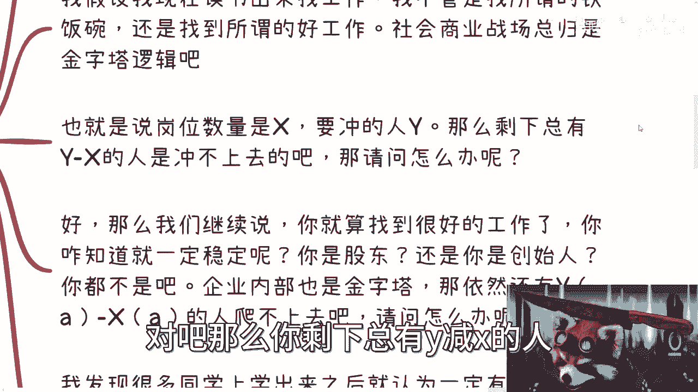
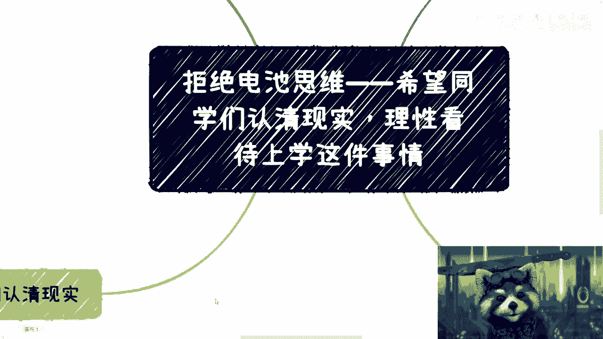

# 拒绝电池思维——认清现实，理性看待上学和找工作 - P1 - 赏味不足 - BV1aV411u7mA

啊大家好是吧，呃之前这个考研啊，然后炸了是吧，被很多人喷啊，但我头铁啊，这个照样还是要想来再说一下啊，首先这个我还是要来再说一下。

这个读书这个事情对吧，其次呢就是呃最近呢还是有小伙伴来问我，志愿的事情，我一律都拒绝了啊，这个东西我不懂啊，就不班门弄斧了，没什么好弄的对吧，虽然对我来讲不是什么很重要的事情，但对于很多人来讲。

可能是对他们来讲吧，可能是一辈子的事情对吧，所以我就不多说了啊，这个事情嗯，同样的在之前这个系列里面呢，我觉得给大部分的同学最后再提一点啊，就是不管你们现在是刚高中毕业啊，还是本科毕业。

希望同学们认清现实，理性看待上学这件事情，为什么呢，那我们来看啊，首先如果你很清楚自己要什么。

自己喜欢什么，自己未来想要做什么方向。

那么啊我觉得一切都好说啊，但是记住一点什么意思呢，就是说你清楚指的是你真的去了解过，这比如说啊你说你要选机械对吧，或者你要选计算机啊，你要怎么样子啊，选什么化工啊，那么我就问你。

你有没有到产业里面去看过，你有没有去跟从业者去聊过，对你有没有怎么样，你别跟我说，你没有渠道，他妈的互联网到现在这么发达，怎么会没有渠道呢，对不对，懒就是懒，就是没有就不想动就不想动对吧。

没有什么没有渠道的都能找得到的。

你你在这个地方，我说的清楚是指你有没有自己真的清楚了解过，不要听别人讲，也不要听家长讲，也不要听所谓的专家。

老师说什么那种清楚没有用的，你明白吗，就不知道多少人已经吃过多少亏了，有意义吗，没有意义啊对吧，人类发展就是不要老师在同一个坑上面踩坑，对不对，这才叫发展啊。

哦你说这么多本科，这么多研究生，这么多博士，每一年的应届生在都在同一个坑上面去踩。

那这叫什么进步啊对吧，第二点，如果你真的清楚，我觉得你就好好读对，就好好上学，别的你就不用去想了，就什么乱七八糟的东西都不用去想是吧，我觉得你但凡有好的，有清楚方向。

你一定会有明确自己的这个方向跟驱动力，根本不需要外人给哪些建议。

而且我相信你也不会去在乎外界的眼光，对吧好。

那么我们再继续往下去讲，诶这谁呀。

啊那么再往下去讲啊，就是说你我就这么问啊，就是所有的人大家在那边说我要卷对吧，我要这个卷这个学历，我要卷什么东西啊，我就问吧，就算你卷，你觉得你你你这这这这少了个字啊对吧。

对吧，就算你卷你卷得过别人吗对吧，就是除非你是有很清楚的方向，你有很强的驱动力对吧，你不会被外界的信息所影响，你卷的过别人，但是剩下你卷的过吗，你卷不过啊，其实大部分对吧。

那么这两天还有他妈的SB说什么，他说根本没有多少人，我我我我我我又少字了是吧，就有多少人上大学研究生的时候想的清楚，我跟你讲屁话，这种话没有意义，你知道吗，你管别人想不想得清楚，干嘛来啊，对吧啊。

别人想不清楚，我们也想不清楚对吧，那他妈所有人吃屎，你也吃屎对吧，那莫名其妙嘛，这不是，而且另外一方面，你说呃没有多少人上大学，研究生奖励输入，那有多少人呢，有多少比例呢，你知道吗，你也不知道呀。

所有东西都是道听途说，有意义吗，没有意义的呀，对不对，你懒对吧，你不想去做对吧，你不行，你就承认你不行，就就就结束了对吧。

就这么简单啊，那么我觉得这是一二是什么呢，关于找工作这个事。

我不讨论大家找不找到的工作啊，我希望大家百分之百都找得到啊，都无敌啊。

那年年薪100万好吧啊，我就假设我自己啊，首先我假设我现在自己读书啊。

读书来了，找工作啊，我头铁啊，我头铁，我不管找所谓的铁饭碗啊。

还是找所谓的好工作，我告诉你们，商社会商业的战场总归是金字塔逻辑，这点你们对吧，这点不是我说啊，这点你们总归应该相信吧对吧。

他总不是一个正方形逻辑吧，它总归是个金字塔逻辑吧，对不对啊，那么也就是说啊，金字塔逻辑是什么，也就是说上层的岗位总是越来越少的对吧，而且你从当下的整个数量上来讲，你整个金字塔的岗位是X。

你要去冲的人有Y对吧。

那么你剩下总有Y减X的人是冲不上去的。

啊那我就请问怎么办，你就跟我说，如果你是Y减X你怎么办，你赌博了对吧好，那么我们继续来讲啊，就是说就算你能找到好的工作，你咋知道一定稳定呢，你是股东还是你是创始人，你你你是怎么能保证稳定的。

我也不太明白，其实对吧，你都不是吧对吧，企业包括另外一点，企业内部也是金字塔啊，那么也就是说在企业内部依然有Y1撇，减掉ax1撇，因为这个一撇我打不出来了，所以我只能用A表示对吧。

就Y1撇减到X1撇的人爬不上去吧，那我就请问怎么办嘛对吧，那么我们再回过头来讲啊，你们很多学生现在是年轻人，你们就是冲着要找工作没毛病啊，那我就问啊，等你们30岁了，是不是到那个时候。

依然有你们这样的一群年轻人要冲啊，那他们是不是得要把你们冲掉才有岗位啊，啊我就问你们是不是这样子，你总不能跟我说，企业岗位是无限在那边扩大的吧，啊你是无限可往上升的，有不然没有的呀，对不对。

就当下经济情况，你告诉我岗位置往往这个一直延展可以，那我就问你们钱哪里来啊，难道就我跟你讲很多逻辑都想得清楚的，我觉得就是就是大家不愿意去想清楚，就是为了逃避对吧，他逃避了还不承认。

然后呢我发现很多同学上学出来之后呢，就认为就会有一种误误误会啊啊错觉啊，就说我这个读了之后呢，就一定有工作，怎么说呢，我跟你讲，工作来了，总归的确是有的，这句话没有错啊，但多数并不是你们想要的。

也不是你们想要的那些薪资，而且你大部分人眼高手低也看不上对吧，那我就问怎么办嘛，纯赌博了，你就赌你是那个X你就不会是那个Y减X，那所有人都读，那那我就问吧，读书的怎么办怎么办啊，跳楼忘了呢。

这莫名其妙嘛，对不对，就是本来这种就是不不是一件赌博的事情，非要被大家完成赌博的事情。

我也不知道为什么对吧，也就是说本来人生规划就会有，就是就是要多条线去规划的，包括就是说你的发展啊，你的要赚钱啊，你的这个叫什么啊，思想的成熟啊对吧，包括技能成熟，本来就是多条线是锻炼的。

从来没有人说过人要赚钱，人要实现自己的想法，人要独立，只有读完书去打工这一间这一条路吧，没有人说过吧对吧，就也许你们听到过，但是听到过一定是那些人PUA你，而不是说没有出现一个真理。

没有一个没有出现任何一个什么国国世界规律，对吧，这个宇宙规律说只有这一条路没有吧对吧。

那说到底还是懒呢。

啊而且我跟你们讲最神奇的是什么，就是当然我不知道这些人，这个这些人到底是大学生啊，还是说是这叫什么这个竞争对手对吧。

还有很多呢是二极管啊，我跟你们讲，就现实，如果大学生跟研究生出来都是二极管呢，我真的也是绝望了，你知道吧啊就是我说未来不稳定吧，他们会说啊，那么读书就没用了对吧，自己花这么多钱读书干嘛对吧啊。

他而且最神奇的是什么，你你问他未来稳不稳定，他也会说没人能保证稳定的对吧，但是呢他回过头也会告诉你诶，我找到一份工作，这工作很稳定，能做到我退休，就我也不知道这个逻辑是怎么出来的。

你知道吧啊就就就很奇怪啊。

我表示这个逻辑我理解不了啊，然后呢我说要寻找自己价值对吧，要去真正了解行业啊，他们就要说了，那你那按照你这么说吧，别读书了啊，小学就辍学对吧，还是那句话啊，我跟你讲，还是那句话，自己你找不到自己的价值。

你找不到就是你不知道自己要什么对吧，你不愿意思考，就是不愿意思考，说到底大家念出来也无非就是这样。

二极管的思维有意义吗，没有意义的呀。

对不了，就还不愿意承认，唉，我跟你讲，所以呢我觉得核心啊就是这个，我相信你们如果工作了啊。

你们都能明白我讲的东西，就怕呢就怕大家还没开始工作啊，所以呢我觉得最后再提一点，就是希望大家能够认清楚这个事实。

这个事实是什么呢，是这样子的啊，大家呢其实心里面都明白，未来是不稳定的，都有可能第二天起来了，企业就让我们滚蛋啊，这不是不可能，没有什么东西不可能的啊，你你我就这么问你们，你们想想看。

是不是你们扪心自问一下，哪件事情是肯定的，没有的啊，对吧，你就别去想稳定一辈子的事了，这更不可能了，是不是我跟你讲，你要是懒就是懒，要是没能力就没能力，我之前有一期视频说的很清楚。

就认清楚自己什么样的人就结束了，别去抱怨啊，也别去杠别人，没有意思对吧，而且我觉得但凡认清楚了，你从现在开始就自己去看更多的东西，去了解自己的行业，而不是听别人去说，就是我一直跟大家说。

不一定要扬长避短嘛对吧，你不是说一定要把你的短板都补齐，但是你要学会去扬长不避短，而不是跟着大这个这个这个叫什么的，这个随大流就在那边说啊，这个不行对吧，大家可以给我喷，你说啊怎么样子是没没问题的。

你可以喷啊，我觉得没有问题，你可以喷，到时候我跟你说，等你30岁的时候，你，你你也会被这个，到时候的那一批的本科跟研究生喷。

我跟你讲啊一样的啊，没什么区别喷呗，另外呢就是所谓的卷啊，大家其实都知道读书很卷，找工作也很卷，那我就奇怪了，路不是只有这一条的，为什么非要卷呢对吧，也就是说我们可以稍微退而求其次的，我个人觉得。

我们可以退而求其次的去找一份工作，同时我们可以去了解别的一些东西，我们开开拓我们别的实现自己的这个这个理想，或者实现自己去赚钱的这个渠道的，这种方法有很多，不是说只有找和不找对吧。

你可以相对来讲降低一点要求吗，非要去卷，为什么对吧，那么好。

那么问题来了对吧，就是说是自己不知道有别的路径呢，还是说找不到别的路径呢，还是根本不想去找别的路径呢对吧，我觉得作为一个正常人，作为一个大学生，作为一个硕士，风险均摊难道不是一个基本操作吗。

如果连这点理念都没有，那还读什么书呢，对不对啊，然后还有一点就是什么呢，就千万不要爱去二极管，也不要去羡慕别人，嫉妒别人，没有意思的，你知道吗，就是你二极管啊，当然了，也有人说的很清楚对吧对吧。

但凡二极管也听不清我说的事对吧，就每个人管好自己就好了啊，我觉得年轻人啊有羡慕别人的心理，和嫉妒别人的心理很正常啊，但是还是那句话，别人怎么样跟我没有关系，我们管好自己就可以了，对不对啊。

那么最近张雪峰对吧，这两天住院了对吧，我觉得是这样子的，就拿张雪峰张雪峰建议填志愿来讲啊，包括我给大家做一些副业的建议来讲啊，其实第一优先级都是，我们会默认大家想清楚自己要什么。

你就好像你就说比如说有些人啊来找我说，陈老师，我们这个我想做金融啊，这个你给我一些建议啊，那么我会给他告诉他哎你有哪些赚钱方式对吧，怎么样子啊，然后回头啊，等到过了两三年对吧。

他觉得二金融这行业怎么做垃圾对吧，怎么跟我想的完全不一样，到时候他来喷我对吧，他说按照程老师建议，这好像不合适吧对吧，因为我给建议，我总会默认你自己觉得这个方向好啊对吧。

那我怎么知道你你你喜不喜欢这个方向哦，我还能摸，我还能觉知道你喜不喜欢这方向啊，这方向可能你不喜欢啊，我们换个方向来谈啊，那这不是我就不是给你咨询职业发展了，我可能得要给你咨询心理。

就先先咨询一下心理的问题了，对不对，所以说你所有的东西，包括像张雪峰那种那种填志愿是一样的哦，你一个家长就问他啊，我我今天要到什么高校对吧，这个高考填填什么专业比较好，你没有任何上下文，你问他填专业。

谁他妈知道怎么填，对不对，那他也只能大锅饭的宏观的跟你说呀，对吧哦回头你说哎我们可能小朋友不喜欢，我们孩子不喜欢对吧，那家长也不喜欢，那怎么怎么早不说的呢，对啦就是很多事情都是一样的。

就是所有东西填志愿什么东西，你就大家付钱去咨询也好，不付钱去了解也好，一切东西总归都是以自己为主为优先级，最高的吧对吧，你总不能说哦，今天张雪峰说填计算机好对吧。

好那个我我们比如说你孩子特别喜欢跳舞对吧，特别喜欢艺术，你就跟他说，套的不能做，做不了你计算机必须计算机，妈死也给我弄计算机，那他妈不是你吗。

对不对，唉。

所以呢我最后啊我最后提一嘴，我觉得呢到今天为止啊，我们的这个教育体系啊，我们的家长，我们的老师，所有的教育的逻辑其实都是扭曲的啊，那么我们的学生啊，从小到大所受到的教育也是扭曲的啊。

但是我在这里只能这么说啊，我为什么在这个合集里面做了这么多期，我衷心的希望啊，就是说能有一部分人，从扭曲的环境当中解脱出来，能寻找到自己真正的价值，而不是活在别人所制定的整个规则里面。

甚至这个规则非常的不合理，好吧，就这么简单，OK我最后提一嘴啊，有很多人也会说啊，我说了所有东西是为了让别人咨询我，我还是那句话，自信咨不咨询随便你们无所谓，爱咨询不咨询，对不对，你从来没有哪把刀。

像现在这把刀架在我头上一样，架在你们头上，是不是随意啊。