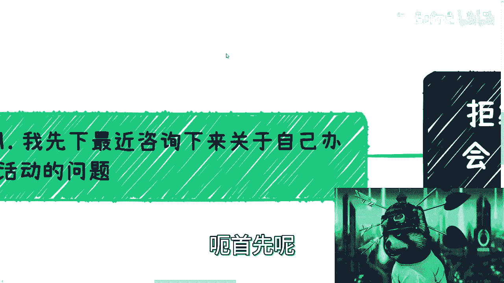
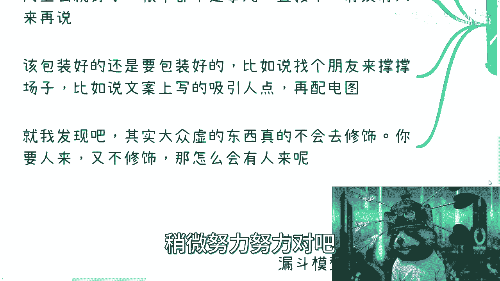
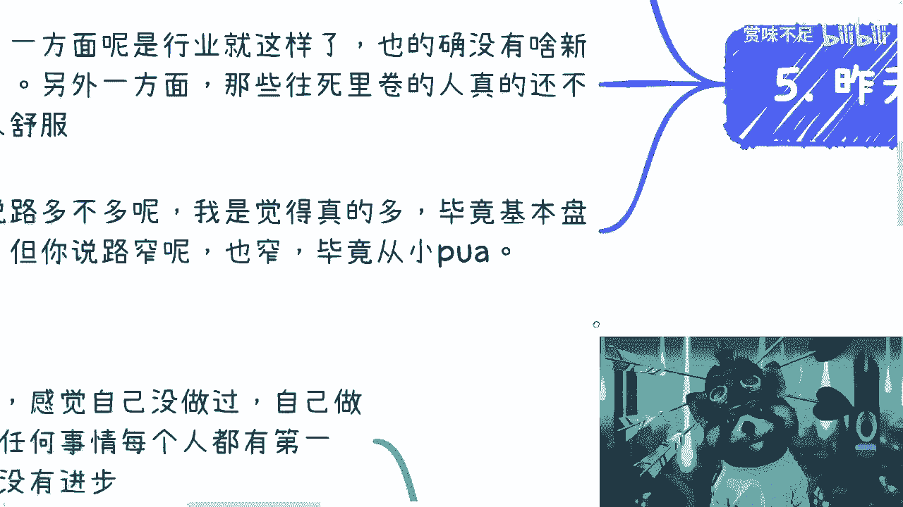

# 课程01：拒绝“电池思维”——如何理性看待行业会议与活动 🧠



在本节课中，我们将探讨一个普遍现象：面对层出不穷的行业峰会、论坛和沙龙，我们应如何判断其价值并采取行动。课程将剖析这些活动的本质目的，并指导你如何超越表面信息，从中发掘真正的机会，避免陷入被动接收信息的“电池思维”。

---

## 一、关于自己举办活动 🎯

上一节我们概述了课程主题，本节中我们来看看如何迈出第一步：自己举办活动。

许多人对于自己组织活动感到犹豫，主要问题在于想得太多，担心能力不足。实际上，行动本身比空想更重要。你没有做过，所以做不来，这很正常。但如果不开始行动，就永远无法进步。

操作逻辑其实很简单：确定一个活动主题，例如“一起探讨副业机会”或“同行交流认识会”。当前市场对线下社交活动仍有需求，大型会议往往令人不知所措且费用高昂，而过于专业的活动又会将人拒之门外。因此，门槛适中、旨在连接的轻量级活动很有市场。



以下是举办活动的具体步骤：


1.  **确定主题与名称**：想清楚活动能为参与者带来什么价值，并据此起一个吸引人的名称。
2.  **选择发布平台**：将活动信息发布到“活动行”、“互动吧”、小红书等平台。
3.  **优化活动包装**：文案要吸引人，可以配图。如果条件有限，适当修饰或寻找朋友支持以活跃气氛也是可行的方法。
4.  **立即执行**：发布活动几乎没有成本，最大的障碍往往是“想太多”而不行动。关键在于迈出第一步。

当下的竞争环境已与十年前大不相同，不进行适当的包装和努力，很难吸引他人参与。

---

## 二、剖析会议的本质目的 🔍

在了解了如何发起活动后，我们进一步分析：为什么市场上会有如此多的会议？我们又该如何看待它们？

面对各种会议邀请，首要原则是：优先参加免费会议，谨慎对待付费门票。更重要的是，我们需要探究会议举办方的真实目标，而非仅仅关注其表面主题。

会议的目的多种多样，仅关注其宣传的议题是典型的“电池思维”——被动接收信息而不思考其背后的商业逻辑。你需要关注的是内核。

以下是几种常见的会议类型及其真实目的：

1.  **产品/服务推介会**：核心目标是销售公司产品或服务。例如，科技公司的技术峰会。
2.  **完成行政KPI**：某些由政府或协会主办的会议，其首要目的是完成年度活动指标，规模和实际效果可能并非首要考量。
3.  **商业漏斗中的一环**：会议作为整个商业链条的“售前”环节，为后续更高价值的服务（如培训、认证、评测）做铺垫。例如，许多“标准发布”会议的真正目标可能是销售相关的评测或证书。

这些背后的商业模式往往利润丰厚，且与个人技术或学历关联不大，更多依赖于资源整合与市场包装能力。理解这一点，才能避免被表面光鲜的议题所迷惑。

---

## 三、如何有效参与并寻找机会 🤝

既然我们明白了会议背后的逻辑，那么如何才能有效参与，并从中找到属于自己的机会呢？

关键在于转变角色：从“听众”或“学习者”转变为“机会发掘者”和“潜在合作者”。不要只关心会议内容，要思考如何与会议背后的各方建立联系。

一个有效的切入点是关注会议的“执行方”。许多会议的主办方是挂名单位，实际操办工作往往外包给第三方公司。与这些执行方接触，门槛相对较低。

以下是几种可能的合作切入点：

*   **成为活动的执行或宣传合作伙伴**。
*   **作为其服务或产品的渠道合作方**。
*   **提供相关的配套资源或服务**。

合作的核心是共赢，为对方带来流量或价值，而非抢夺现有蛋糕。商业合作没有想象中复杂，关键在于主动沟通，不要因害怕被拒绝而止步不前。尝试的成本很低，但成功连接的潜在收益很大。

---

## 四、理解背后的通用模型 📊

无论是行业会议、知识社群还是其他商业产品，其底层逻辑往往是相通的。理解这个模型，能帮助我们更清晰地看待许多商业现象。

这个模型就是 **漏斗模型**。它通过层层筛选，将广泛的目标人群逐步转化为核心用户或客户。

```
潜在关注者 -> 免费参与者 -> 低价产品用户 -> 高价服务客户 -> 核心合作伙伴
```

在这个模型中，每一层都对应不同的产品和服务，用于测试用户的付费意愿和能力。最终目的是筛选出高价值用户。你的产品体系必须是多元化的，不能在所有层级都提供同质化的东西。

同时，我们要客观看待“割韭菜”的说法。如果将所有商业盈利行为都视为“割韭菜”，那么整个社会经济活动便无法成立。我们更应关注的是，如何在这个模型中，找到自己的位置并创造价值，无论是整合资源搭建平台，还是提供专业服务。

---

## 总结 📝



本节课中，我们一起学习了如何理性看待和参与各类行业活动。

1.  **对于办活动**：克服“想太多”的障碍，明确价值，简单包装，立即执行。
2.  **对于参会**：要穿透表面主题，分析会议背后的真实商业目的（销售、KPI、漏斗环节），避免“电池思维”。
3.  **对于寻找机会**：主动与会议执行方等环节接触，寻求共赢的合作可能，从“参与者”转向“连接者”。
4.  **对于底层逻辑**：理解 **漏斗模型** 是许多商业设计的核心，建立多元化的价值体系是关键。

核心在于，对于任何事物——不仅是会议——都要努力了解其内核与本质，主动思考其运行逻辑，并勇敢地采取行动去链接资源、创造机会，而不是被动地等待被筛选或被灌输。