# 拒绝电池思维——需求永远都是甲方爸爸的脑（pi）袋（gu） - P1 - 赏味不足 - BV1bM4y1Y79z

好啊大家好啊对吧，这个更几期这个是看缘分看缘分的啊，嗯正好做ppt，这个做的比较累，所以我就想着要不再写一个啊，这一期呢还是在于电池思维啊，然后讲的是需求永远都是甲方爸爸的脑袋啊，脑袋啊跟着我读。

唉脑袋对吧啊啊，这个本期呢就全部以故事来展开啊，大家对吧。

就听故事蛮开心的是吧，呃第一个呢是这样子的啊，故事一故事一。

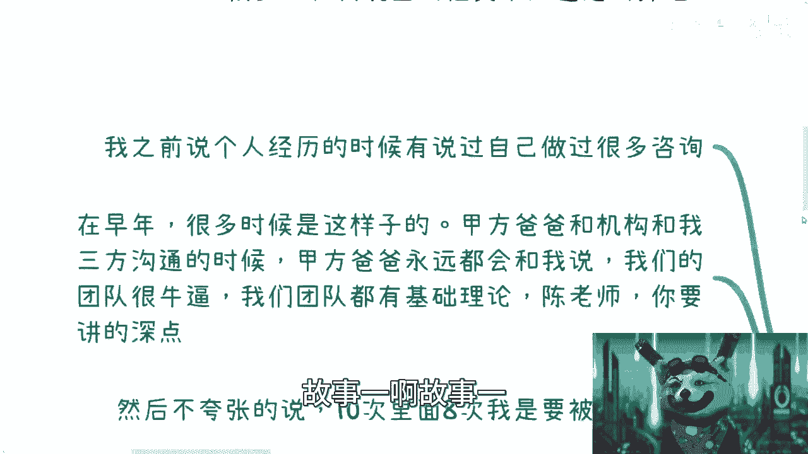

我说我之前呢其实做过蛮多的这种咨询，对不对，然后在早年呢很多时候是这样子的啊，三方开会对吧，甲方爸爸和机构和我马三方沟通。

我当时不是一开始说嘛，我说我这个这个拎不清对吧，我搞不清楚这个对方要什么，然后就很多时候导致机构不找我合作是吧，但是呢有些时候呢是这样子的啊，然后甲方爸爸呢永远都会跟我说啊，我们的团队很牛逼啊。

我们的团队很有理论基础啊，陈老师，你要讲深一点对吧。

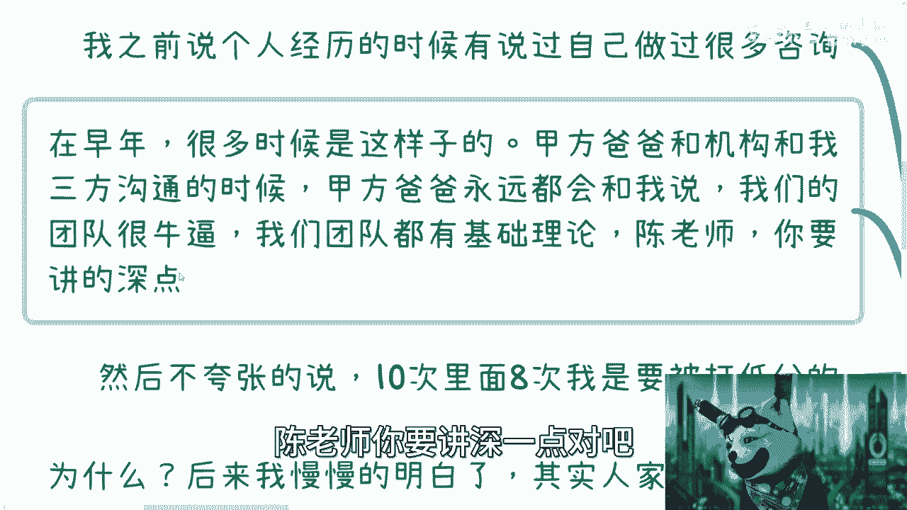

什么意思呢，就是说每次啊我们一开始三方沟通的时候呢，都是为了对需求的，那比如说啊这个讲什么jb啊，大数据啊对吧，以前就是做技术的，然后呢他们就会跟我们说啊，就是那个他们的领导。

或者啊他们就是说也不见得领导吧，就是三方沟通的时候，跟我们就负责培训的这部分人对吧，你们可以认为像培训经理啊，或者什么培训团队啊对吧，甚至还有些hr团队，对吧，这个诶我的微信呢。

对吧，然后呢这个我就听我就信了，你知道吗，就信了，那回去我就准备嘛对吧，p p t啊，内容啊，然后就把这个东西往深了准备嘛。

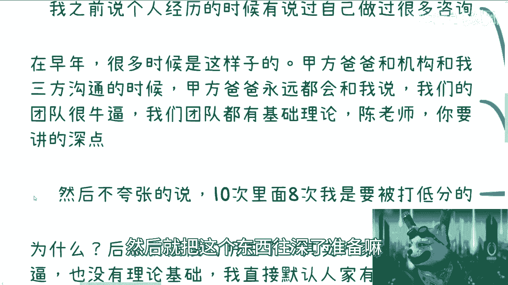

然后不夸张的说啊，就是很多时候池子里面八次，我肯定是要就是培训完了，人家不要打分嘛，对吧啊，打分人家给我打的嘛很低啊，然后就说陈老师啊，陈老师这么讲课讲不来人啊，什么什么，这个课上的非常的不好。

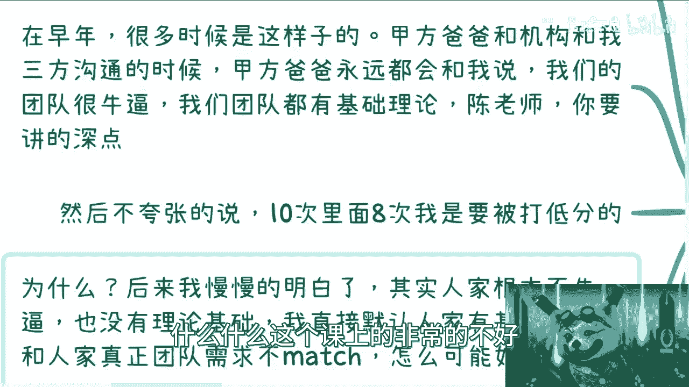

我们就完全不贴合我们的需求对吧，陈老师很不接地气是吧，反正就是各种各样的，你知道吧。

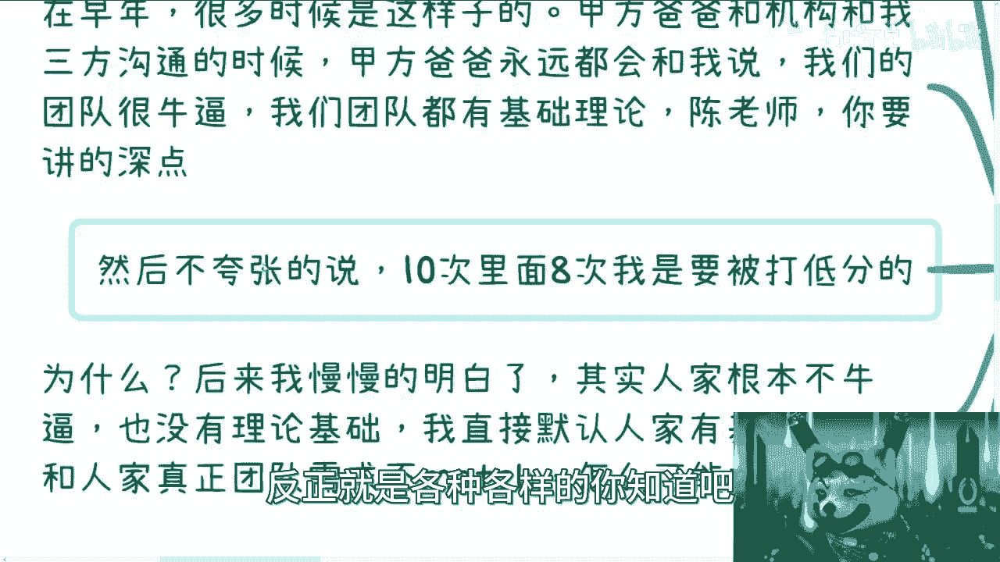

哎为什么呢啊我一开始还是很纳闷的，你知道吗，我就就虽然我上课的时候也觉得吧。

其实有那么些这个这么就是违和啊，但后来发现呢，为什么呢，后来我就慢慢明白了呃，为什么，是因为其实人家的团队根本不牛逼，也没有理论基础，我直接默认人家是有基础的对吧，那么你做出来的课程。

跟人家真正团队需求是不match对吧，就这你需求是不匹配的，你怎么可能好评呢，对不对。

那好了，那又要又要同学要问了，他说哎那甲方爸爸当时不是这么说的呀对吧。

那这个团队也是甲方爸爸，那怎么弄呢，对不对，你们想想看啊，我要做这个生意，我怎么弄啊，那这个后来我不就学会了嘛是吧。

那很简单啊，三方沟通时候，甲方爸爸说啊，你要讲深一点，我们团队牛逼啊，好牛逼牛逼牛逼对吧，牛逼三连啊，你们有理论基础，好好理论基础牛逼牛逼牛逼。

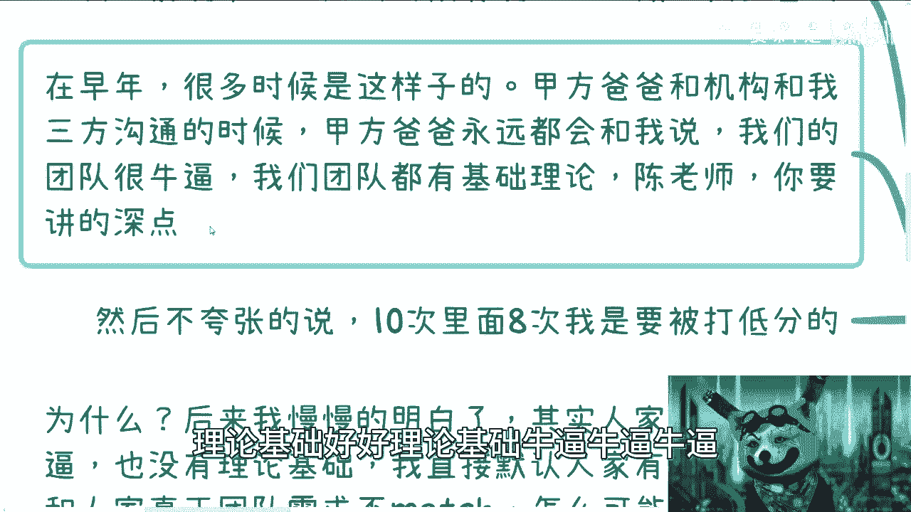

好好好做做做好，然后啊我准备课程准备ppt还是全部以最基础的。

就是那种从0~1的对吧，就是那种零基础啊。

扫盲式对吧，很牛逼啊，哎甲方爸爸的这个培训负责人诶也很开心，那甲方爸爸的这个真正上网课的前人也很开心。

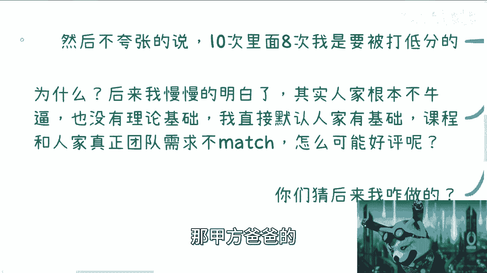

这才叫真正意义上的三赢，对不对，那好啊，可能又有小伙伴要问了。

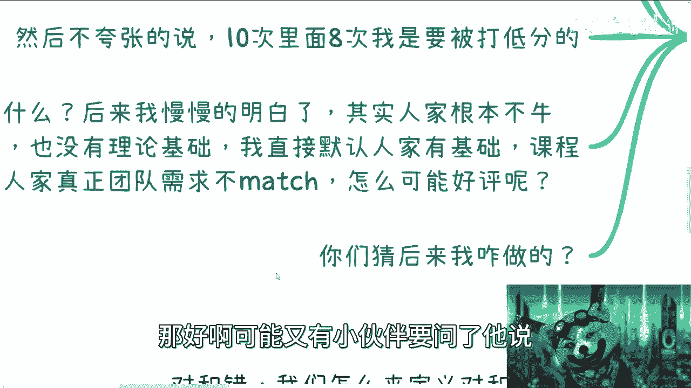

他说他说你这样也不行啊，他说哎呦喂呀。

我怎么又咬到我了，就是他说你这样也不行啊。

他说为什么哎你这样的话，你老是做出来的这个东西都是入门级的啊，那人家团队万一不要入门级了，好可以啊，我这我这么跟你讲这个问题啊，你要这么想，企业端培训为什么要培训，有两种可能性。

第一种可能性是他们真的有需求要培训，对不对，第二种可能性是你们但凡去问问看，只要有培训需求的企业，他们每1年的经费都有一个规定，什么规定呢，就是你这个经费当年用不掉，第2年就归零了，什么叫归零。

就是你提不出来的，就这笔其实就没有了，是不是好，那么我们反过来说啊，你对一个团队来讲，无论你今天去讲任何的东西，对不对，好，然后呢，你讲0~1，你讲任何的就是叫什么，就是扫盲线，这东西至少大家从感官上。

从沟通上，从听课上面，大家不会觉得有违和感吧，就是说懂的人，他最多觉得哎呀这个东西我听过对不懂的人，人家至少觉得我能听懂，那你的平均分至少还是能有个七八分吧对吧，所以这才叫是一个万金油方式。

你明白吗啊当然了，这个真正的，因为我们今天讲的叫做拒绝电池思维嘛对吧，那么在这个时候，就真正的工程师思维是怎么想的呢，就是说不行啊，我有洁癖啊，他妈的我就得跟他们pk啊，你这个让他们觉得我很牛逼。

我跟你讲没问题。

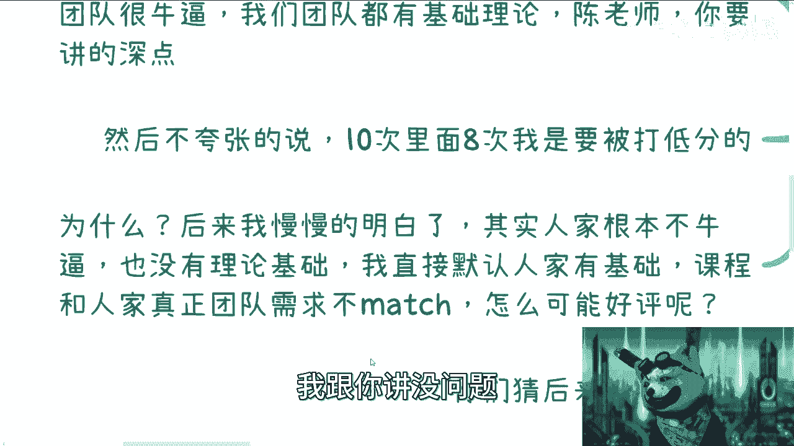

哎你去做吧，哎你去做吧，你做这样你就做不好，你赚不到钱，随便你爱咋地咋地是吧。

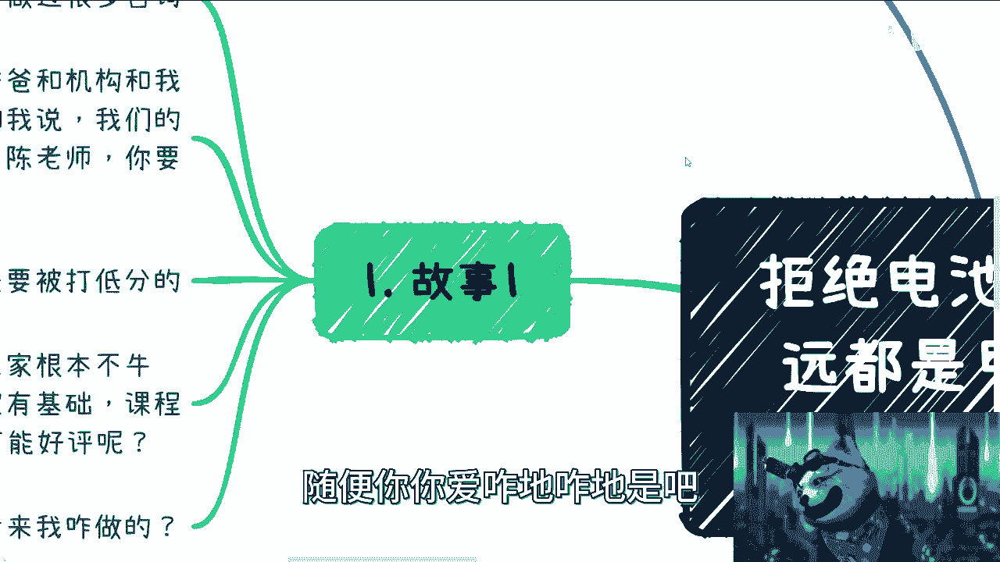

我我就随便你啊，好故事二嗯。

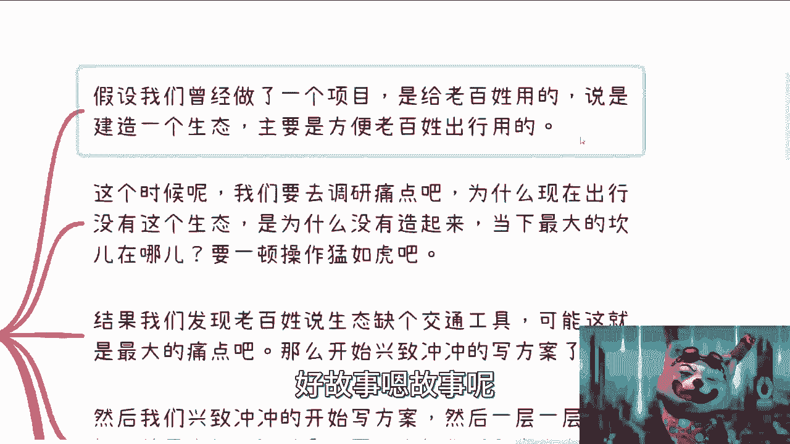

故事二呢哎就比较抽象了啊，这个我不敢不抽象了，对不对，懂得自然懂。

假设我们对吧，曾经做了一个项目啊，给老百姓用的说，那是建设一个生态啊。

主要是方便老百姓出行，这个时候呢你想啊，我们要去调研痛点吧对吧。

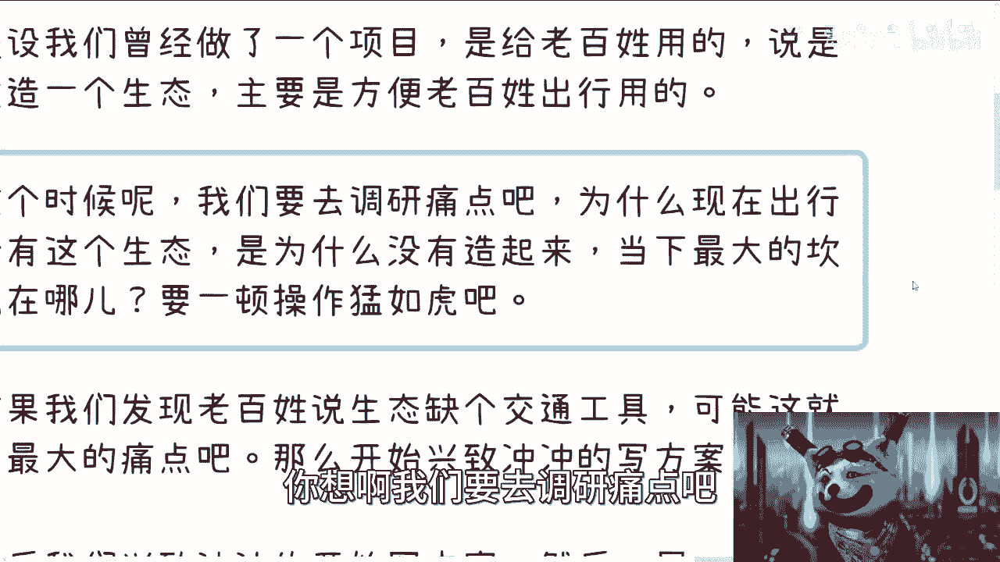

什么叫痛点，就我们认为啊这个客户啊是老百姓，那我们要去调研吗，那为什么现在没有这个生态呢对吧。

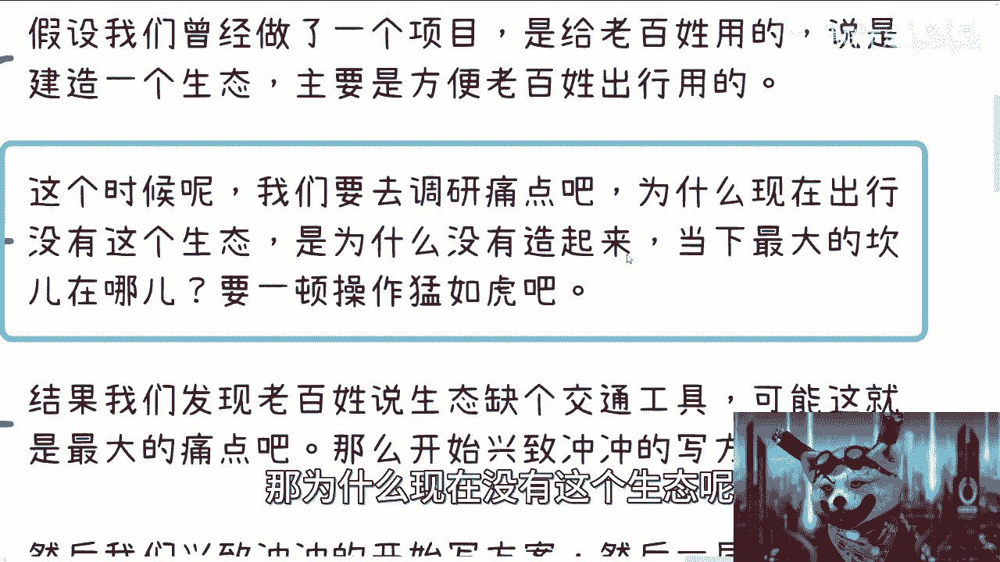

为什么没有造起来呢，当下最大的坎在什么地方呢。

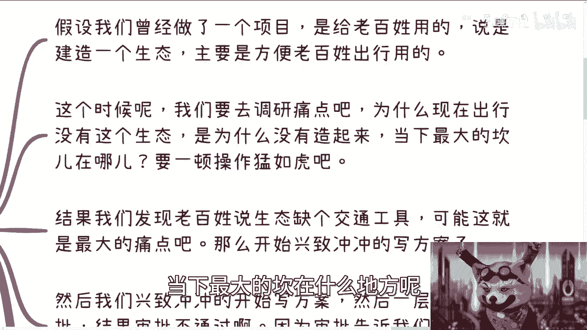

对不对，要不要一顿操作猛如虎呢对吧，那么接下来经过我们的不懈努力啊。

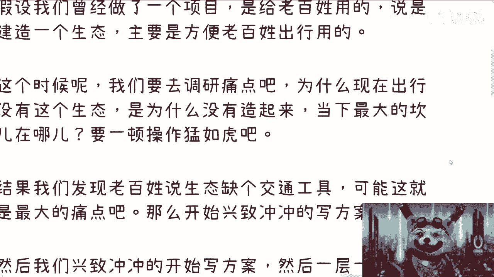

我们发现啊，老百姓说生态啊，缺一个交通工具，可能就是最大的痛点啊，那么我们在这边想，那以我们的认知和水平，我们可能想出来这个交通工具叫什么叫车，对吧好。

那我们开始兴致冲冲地写方案了啊，写方案了，然后呢我们兴致冲冲写方案之后啊，我们发现诶诶。

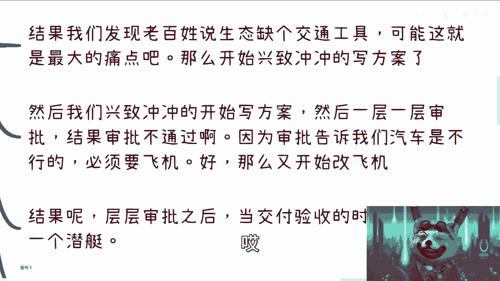

这个层层审批啊，结果审批不通过啊，不通过，为什么呢，因为审批的反馈告诉我们汽车不不行，必须要坐飞机啊，你们太low了啊，你们这个old fashion是吧，好那没问题啊啊你说造什么就造什么嘛，对不对。

好，那我们开始造飞机，造飞机。

那开始改飞机的方案对吧，好改完pg方案呢，层层审批之后。

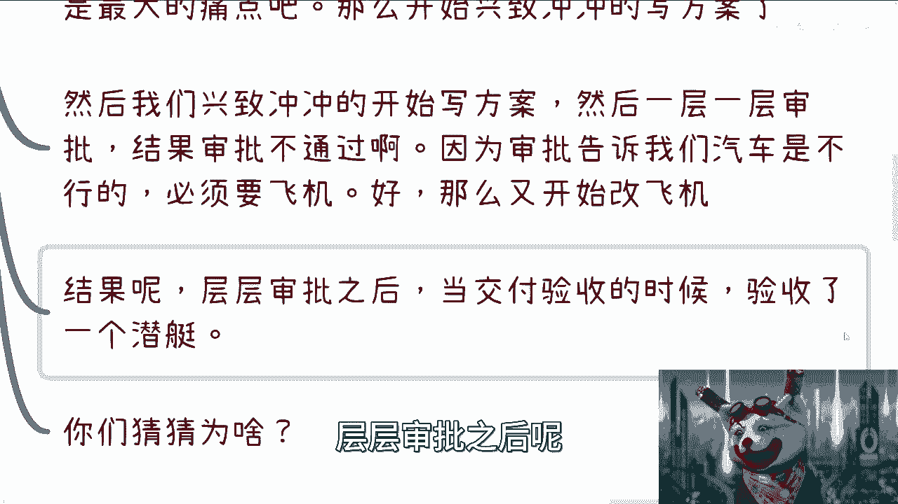

嗨大家都很开心是吧，然后呢你们就比如说我是审批，我是申请人对吧，你们可能是外面的观众啊，或者是我的合作伙伴啊，你们可能不知道当初发生了什么啊，然后呢就到了验收对吧，就大家蛮开心的，要分钱了嘛。

对不对啊，你到验收的时候呢，你就发现哎诶为什么验收了一个潜艇，就哎既不是车，也不是飞机，为什么验证了一个潜艇。

你们想看诶，你们猜猜为什么对吧。

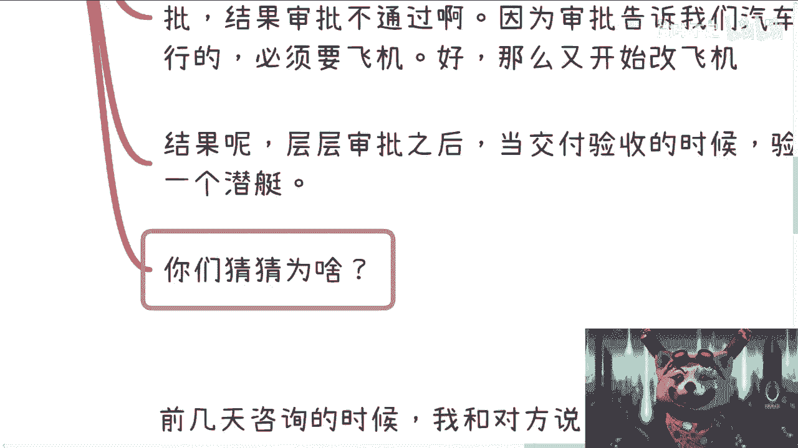

很简单嘛啊因为在这个故事当中对吧。

真正审批前的人啊是上面的，我们叫做a对不对，a在他的知识范围内和他的认知里面，他认为交通工具只有潜艇，别的他不懂啊。

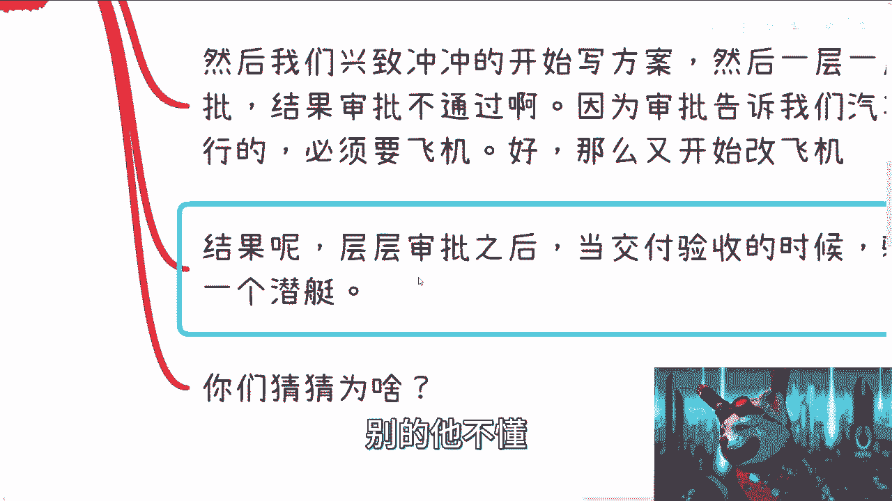

别的他不懂啊，什么审批过程的建议啊对吧。

这个我们调研出来的结果都他妈放屁对吧，为什么，因为a才是真正能掌握这个项目批钱的，懂了没有啊，对吧啊，你们自己想开。

举一反三啊，那故事三啊，故事三呢就前两天是这样子的，这个咨询的时候呢，我和对方说，我说往往做到金字塔最顶层呢，或者说我们不能称之为最顶层，就是曝光量最大的那些人啊，如果在你行业里面一定会有这些人呢。

那么你发现他是一个top，或者是一个曝光量top的人呢，你要明白一点，往往他的能力或者说往往啊他的专业能力，专业能力不是最强的啊，你一定要有这个认知，一定要明白，因为我发现很多人他不明白啊。

那么因为我们要明白啊，专业能力是专业能力，专业能力并不代表能做到曝光量最大对吧，因为专业能力强的人多了去了，我不管你在什么行业，专业能力强的人多了去了，直播你不认识啊，对不对。

那默默在那边做事情也多了去了，能做到曝光量最大，要么就是他自己有很强的营销能力，要么就是有营销团队，对不对，好，我不管他是哪一个啊，我不管他是哪一个，无论他是自己牛逼啊，还是营销团队牛逼。

至少证明这个人不管他的专业能力多强，因为我不否认他的专业能力啊，我我先不否认他的专业能力，因为但是也有很多人的确没有什么专业能力啊，说实话都是靠包装出来的啊，那么我们至少说他懂得营销。

或者说懂得如何跟营销的团队去合作对吧，也就是说我可以说他自己懂或者他自己不懂，但是他至少懂得商业啊，我觉得就这么个逻辑。

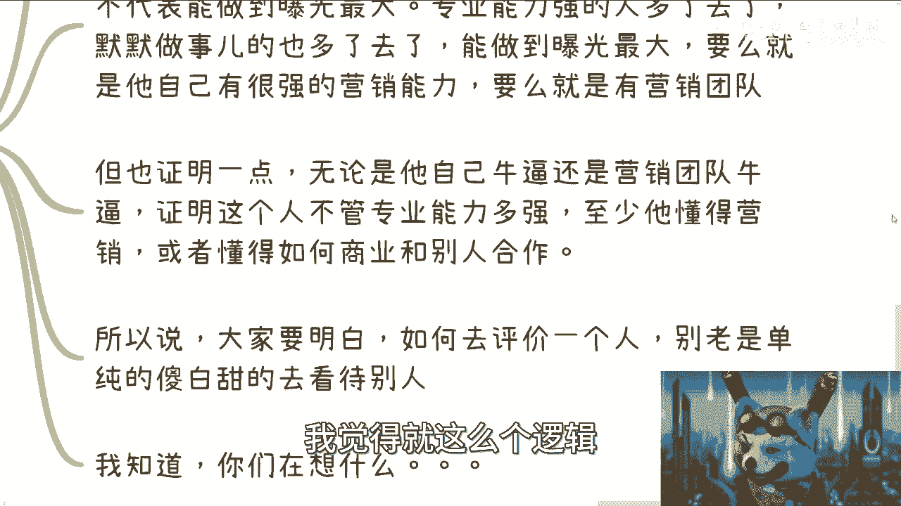

也就是说什么呢，也就是说大家都要明白如何去评价一个人对吧，你别老单纯的傻白甜的去看待哦，这个人什么，今天新闻报道了，明天那个人说什么专家，后天那个人怎么样，你就觉得卧槽这个人很牛逼是吧，不是啊。

你只能认为这个人营销很牛逼，这个人是否专业能力牛不牛逼，你要打无数个问号啊，一定要记住哦，一定要记住啊，所以呢这个时候我知道你们在想什么啊，啊别否认，我知道你们在想什么，你们就在想是吧。

吕老师属于哪一方是吧，哈哈前两天咨询我的时候，加有那个咨询我的人加我微信啊，是这么，我是这么跟他讲的，我说你就这么理解我吗，我是在虚的里面最实的那一个啊，然后呢在十的里面比较虚的啊，我不能说最虚啊。

我虚不过人家啊，就这么个逻辑啊，懂得自然懂是吧，那个人我还那天咨询我那个人，我是那个的，我我是怎么说呢，蛮认可的，我把我简历都发给他了啊，我说我给你看一下啊。

你可以参考参考对吧，以后就往我这个方向发展。

然后第四个故事啊，我说对和错啊，对和错，我们怎么来定义对和错啊。

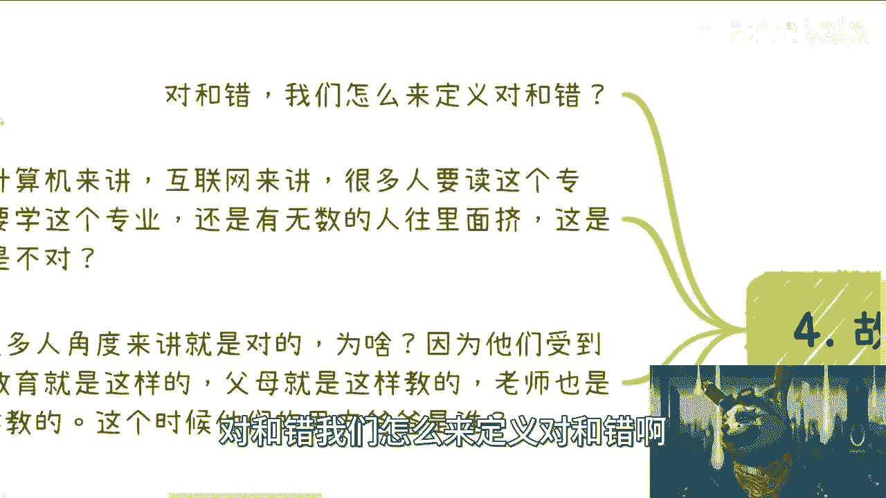

你比如说就拿计算机来讲对吧，互联网来讲，很多人要读这个专业，是不是啊，然后呢这个要学这个专业对吧，还有很多无数人呢往里面挤，对不对，那么这个时候就就问题就来了，你说哎。

那我们怎么去判断这个东西对还是不对呢。

对不对，就这件事情本身没有对和错，为什么，因为你从很多人自己角度来讲，他就是对的，为什么呢，因为他们受到的教育就是这样子的，父母就是这样教的，老师也是这么教的对吧，社会也是这么教的。

就告诉他们哎呀互联网好啊对吧，高兴啊，岗位多啊对吧，怎么样怎么样啊，然后呢包括就是媒体舆论也这么告诉大家啊，这个年薪百万是吧，怎么样怎么样啊，好那这个时候你们想想看，对于这些人来讲，他们的甲方爸爸是谁。

虽然我们说甲方爸爸，但是并不是说只有给钱的才叫甲方爸爸，而是你做这件事情，你做一件事情的根据和你最终的目的是什么，因为很多人的根据亨和很多人的目的，他的他的目标并不是说他去做互联网，或者说学计算机。

而是说他是满足父母的一种要求，以及觉得老师说的是对的，就是老师和父母和社会，这个时候就是他们的甲方爸爸，你知道吧。

那对吧啊这是一方面嗯，那你从我呢或者来说从其他人的一部分角度呢，我们就会觉得这个就是不对的，或者来说并不是说不对，而是思维不对，就是说你要去学这个专业，可以，你进去也可以。

但是你得找到自己的切入点和方向，你得找到你与别人与众不同的地方对吧，那么你想想看，我们这么思考，我们的甲方爸爸是谁对吧，那说白了我们的甲方爸爸是，一切能够让我们变现，一切能够让我们去学习啊。

不一切能够让我们去赚钱的那些人，或者说企业或者政府或者机构对吧，那你只有这么去想，你才能够去明白你要往哪个方向切啊对吧，或者说你不知道你就会去探索我哪个风向前，你不会说只做一个电池对吧。

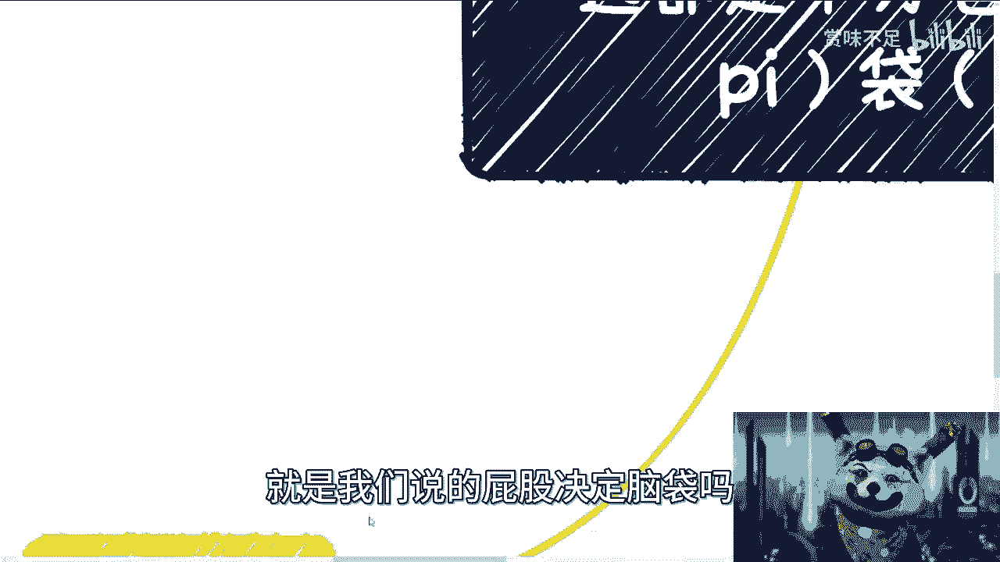

那那那哎脑袋跟着我读脑袋对吧。

那还有第五个，第五个呢，我这个懒得写了，我就一边跟你们说，一边写第五个啊，很多人跟我说呢，出去社交不知道怎么介绍对吧，我呢啊前两天这个打了个比方，我错了，打了个比方啊，什么意思呢。

就是说你说哎你说你要出去社交啊，你和别人介绍，那么首先问题来了，别人关心什么，对不对啊，那么你想想看啊，你出去社交，我们不能说百分之百吧，99%，你在一个社会上社交，你基本上都是商业社交啊。

但凡我跟你说，对方不是商业社交，只能说明你社交圈太low啊，只能说明你社交的没在点子上，那如果商业社交对方关于什么，对方就关心你能不能给他赚钱，对不对，对方关键是你有哪些资源和哪些。

这个这个东西是他没有的，然后又能跟他结合去赚钱，对不对，好那么我们就说啊，我们呃这么说自我介绍啊，你会怎么介绍，你会怎么对，怎么介绍对吧，好，我就不打了，我给你们举个例子啊，你会怎么介绍。

哎你比如说你说爱我呢，今天是想创业的对吧，我想做一家公司啊，嗯我做什么，比如说医疗或者农业的解决方案啊，然后呢我这个在里面用到了什么技术，一般反正牛归炸大的吹嘛对吧，张口就来啊。

一般来讲按照你们第一次社交，别人也不可能来给你做背调，也不可能问哎，你这个你这个这个什么那农业啊，或者什么东西啊，用什么技术啊对吧，怎么样怎么样，他不会问的啊，大家就寒暄几句就过去了，你说是不是。

但是哦但是问题在哪呢，问题在于很多人他不知道怎么介绍的时候呢，哎你们要去再往下深深入再想，就说你到底会什么，因为你介绍这个东西，你要包装嘛，对不对，但是你现在到底会什么，有些人他过于就是这样的时辰啊。

然后呢我就跟他说，我说那你跟别人介绍，你总不能这么说吧，你说诶那谁啊，我自我介绍一下啊，我是这个啊，这谁谁谁啊，我是这个专门做假问的啊，专门专门做什么写代码的啊，然后我代码写了十多年啊。

我是专业这个这个负责打个比方，负责什么什么，类似于像双11这种高并发的对吧，或者说啊这个写前端的或者写后端的，写服务器的对吧，好一顿操作猛如虎，那我就问嘛，你这么介绍，我不管你做了十几年还是几十年。

对方会关心吗，根本不关心，为什么，因为你的这种介绍跟他完全不在一个频道上，面，对不对，那么我们就说嘛你你在做很多事情的时候，你得明白对吧，就是有的人是直接给你能带来钱的，有的人是间接的给你带来钱的对吧。

那么从商业上来讲，你要去想你的甲方爸爸是谁，或者说你介绍的时候，你得你得想好对方要的是什么对吧，所以说你有很多时候做事情啊，是这样子的，就是呃找我咨询人，其实当中也有些人跟我说嘛。

就是说他们慢慢慢慢就明白一件事情，就是以前啊他们去做一件事情的时候，想的是自己能有什么对吧啊，但是你从现在往后，你要去做事情，你要想的是什么，不是你有什么，是别人要什么，对吧好。

你所有东西全部是从你有什么处罚，有用了没有用的呀，就是我只能说我只能告诉你，你活在自己的世界里面，你很自我感动，但是没卵用。

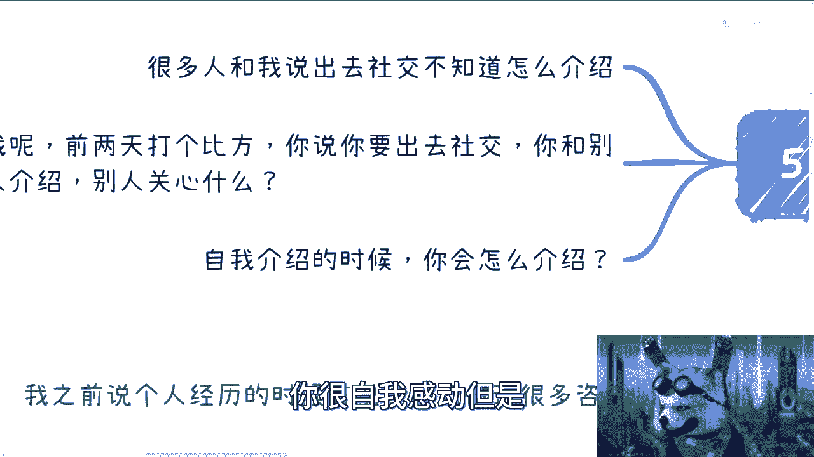

对不对，好那么所以说啊我们说拒绝电池思维，这边啊，不管是我们今天讲的这些故事，还是说你们现在在打工，面对你们的leader，面对你的mental，面对你们的manager对吧。

还是说啊这个你们在各种各样的环境里面，你们要明白一点是什么，就是你们的需求也许叫需求，你们认为的那些需求和痛点，也许也是需求跟真正的痛点，但是你们要往上走，你们要往上爬，你们就必须去满足甲方爸爸的。

这个甲方爸爸有可能是你的领导，也有可能是你的老板，有可能是你的商业合作伙伴，有可能是你的资本对吧，你得满足他们的呢，跟我读脑袋脑袋对吧，所以呢这就这就是我们说你们得要去思考的，所有的这个出发点要改变。

一旦改变不了，一旦一天不改变，你会发现就我们一直说的努力是没问题的，但你们的方向是不对的，哎呀我只能说到这了是吧，再说下去要被举报了，怎么样，我今天这个造型帅的一批，哎，怎么识别不了我了，怎么回事啊。

一结束就识别不了我啊，行好吧，就这么着吧，反正有啥就有啥要咨询的，私私信私信啊，私信那个付费咨询啊。