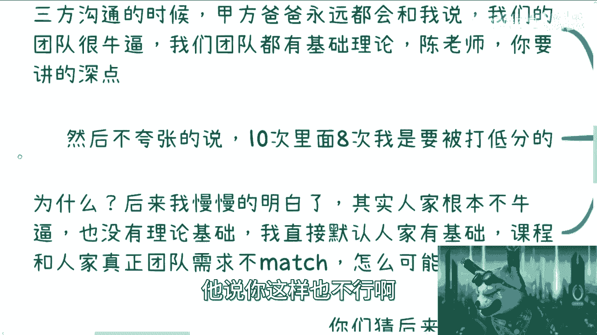
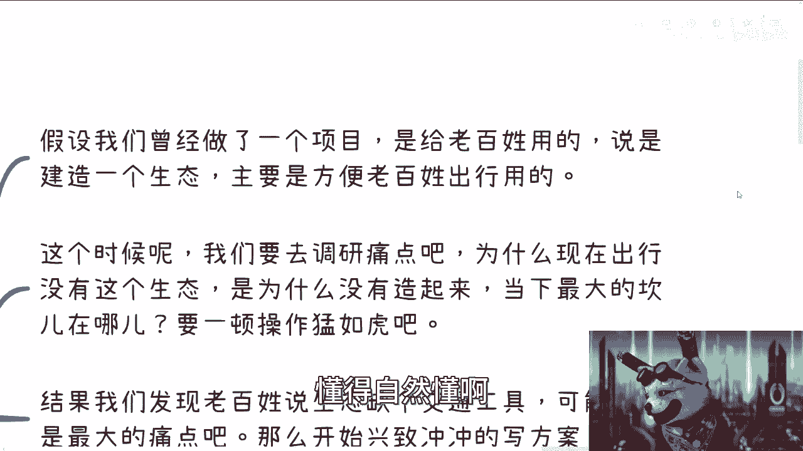

# 拒绝电池思维 课程01：需求永远来自甲方爸爸的“脑袋” 🧠

在本节课中，我们将通过几个真实的故事，深入理解“拒绝电池思维”的核心——即你的工作成果必须满足“甲方爸爸”的真实需求，而非你或他人表面陈述的需求。我们将学习如何识别真正的需求方，并调整自己的工作方法以实现共赢。

---

## 故事一：培训需求的“深浅”陷阱

上一节我们提到了要拒绝电池思维，本节中我们来看看一个关于企业培训的常见误区。

我曾从事过多项咨询工作。早年经常需要参与甲方、培训机构和我的三方会议，目的是对齐培训需求。

当时我经验不足，常常搞不清对方的真实需求。甲方负责人总会强调：“我们的团队很厉害，理论基础扎实，陈老师，你要讲得深一点。”

我信以为真，回去便准备了深度、专业的技术内容，例如大数据等主题。

但培训结束后，学员评分往往很低。反馈通常是：“陈老师讲得不接地气，完全不贴合我们的实际需求。”

后来我明白了问题所在：甲方的团队实际并不具备所说的理论基础。我按照“他们很牛”的假设去设计课程，与团队的真实水平（**真实需求**）严重不匹配。

那么，当甲方明确要求“讲深一点”时，我该如何应对？以下是解决方案：

在会议中，我会完全认可甲方的说法：“好的，明白，团队很牛，有理论基础。” 但在实际准备课程时，我全部按照**最基础的、从零开始的扫盲级别**来设计。

结果如何？培训负责人（汇报方）满意，实际听课的学员（使用方）也能听懂，从而实现了**三赢**。

可能有人会问：如果团队真的需要深度内容怎么办？以下是企业培训的两种核心动机分析：

*   **真实技能提升需求**：团队确实需要学习新知识。
*   **预算消耗需求**：许多企业的培训经费有“当年不用，次年清零”的规定。为了消耗预算，培训本身就成了目的。

在这种情况下，提供“从0到1”的扫盲课程是一个**风险最低的“万金油”策略**。懂的人觉得是复习，不懂的人能跟上，从而确保平均分不会太低。这才是满足“甲方爸爸”（在此场景下，是决定付费和评价的负责人）真实需求的做法。

而固执的“工程师思维”则会坚持与甲方PK，证明自己的专业，但这往往导致合作失败，赚不到钱。

---

## 故事二：生态项目中的“交通工具”之谜

理解了如何应对表述不一的需求后，我们来看一个更复杂的项目决策案例。

假设我们承接一个项目：为老百姓建设一个方便出行的“生态”。

按照流程，我们需要调研痛点。我们认为客户是老百姓，于是努力调研，发现最大的痛点是“缺少一个交通工具”。

基于我们的认知，我们认为这个交通工具应该是“汽车”。于是我们兴致勃勃地制定了造汽车的方案。

但方案在层层审批中被否决了。审批反馈说：汽车不行，太落伍了，必须造“飞机”。

没问题，我们修改方案，开始设计飞机。经过审批，各方都很满意，项目得以推进。

到了项目验收阶段，大家准备分钱时，却发现最终验收的产物既不是汽车，也不是飞机，而是一艘“潜艇”。

为什么会这样？原因很简单：

在这个故事里，真正掌握项目审批权和资金的人（设为人物A），他的认知和知识范围里，认为“交通工具”就等于“潜艇”。至于下面调研的“老百姓痛点”或“汽车/飞机方案”，都不是他关心的重点。

**核心公式：最终产出 = 掌握资源者（甲方）的认知**

你必须满足那个能拍板、能批钱的“甲方爸爸”脑袋里的想法，而不是表面上的用户需求或你自己的专业判断。

---

## 故事三：曝光量Top者的“专业能力”滤镜

在商业和社交中，我们如何评估一个人的价值？本节将打破关于“专业能力”的常见迷思。

我经常在咨询中强调：在一个行业里，曝光量最大、站在金字塔顶端的人，往往**并非**专业能力最强的。

你一定要建立这个认知。因为专业能力强的人很多，但曝光量最大，意味着他要么自身拥有强大的营销能力，要么背后有专业的营销团队。

也就是说，你可以认为他**懂得商业运作和营销**。至于他的专业能力究竟多强，你需要打一个问号，不要被“专家”、“网红”等标签轻易迷惑。

评价一个人，尤其是商业伙伴时，逻辑应该是：
**商业价值 = 专业能力 × 营销（或资源整合）能力**

很多人是后者远远大于前者。所以，当你在寻找合作伙伴或评估他人时，你的“甲方爸爸”（即能为你带来商业机会的人）看重的往往是对方的**资源整合与商业变现能力**，而非单一的专业深度。

---

## 故事四：“对错”之争与你的“甲方”是谁

我们常常争论选择的对错。本节将探讨，判断对错的标准取决于你的“甲方爸爸”是谁。

以很多人选择计算机专业为例。你说这个选择是对是错？

对于遵从父母、老师、社会舆论教导而做出选择的人来说，**这是对的**。因为他们的“甲方爸爸”就是父母和社会的期望，满足这个期望就是他们的目标。

公式：**决策正确性（对个人A） = 是否符合其核心驱动力的期望**

而从我的或另一部分人的视角看，盲目跟风可能“不对”。我们认为，选择专业可以，但必须找到自己独特的切入点和方向，以满足未来市场（真正的甲方）的需求。

这时，我们的“甲方爸爸”变成了**能为我们提供变现机会的企业、机构或市场**。我们的决策围绕如何满足这些“甲方”的需求展开。

你的“甲方”决定了你判断对错的坐标系。明确你的“甲方”是谁，是摆脱盲从、进行独立思考的第一步。

---

## 故事五：商业社交中的自我介绍

最后，我们来看一个实用场景：商业社交中如何自我介绍。这直接体现了你是否理解对方的“需求”。

很多人出去社交，不知道如何介绍自己。99%的社会社交本质都是**商业社交**。对方关心的是：你能给他带来什么价值？你有什么资源可以与他结合赚钱？

错误的介绍方式是只说自己“有什么”：
> “我是做Java开发的，写了十几年代码，擅长处理高并发……”

这种介绍，对方根本不关心，因为与他没有利益连接点。

正确的思路应该从“别人要什么”出发。你需要包装自己的技能，使其与对方的商业利益挂钩。

例如，你可以这样说：
> “我目前专注于智慧农业/数字医疗领域的解决方案，利用（某某技术）帮助客户提升效率。正在寻找有行业资源的伙伴一起开拓市场。”

这样的介绍，直接将你的能力（技术）包装成了对方可能需要的“解决方案”和“合作机会”，瞄准了对方“赚钱”或“获取资源”的需求。

**核心转变：从“我有什么” → 到“你要什么”**

无论你是面对领导、客户还是合作伙伴，你的出发点都应该是满足他们的“脑袋”（真实意图和需求）。不完成这个思维转变，你的努力很可能方向错误，事倍功半。

---

## 课程总结 🎯

本节课中，我们一起学习了“拒绝电池思维”的关键一课：**需求永远来自甲方爸爸的“脑袋”**。

我们通过五个故事明白了：
1.  表面需求与真实需求可能不同，要识别真正的决策者和受益方。
2.  项目最终产出取决于资源掌控者的认知。
3.  评估他人要超越“专业能力”滤镜，关注其商业与资源整合能力。
4.  判断对错的标准取决于你的服务对象（甲方）是谁。
5.  商业社交与自我展示，要从“对方要什么”而非“我有什么”出发。

始终牢记，你的工作是否有效，取决于是否满足了那个能决定你成败的“甲方爸爸”的真实意图。改变思维起点，你的努力才会产生真正的价值。