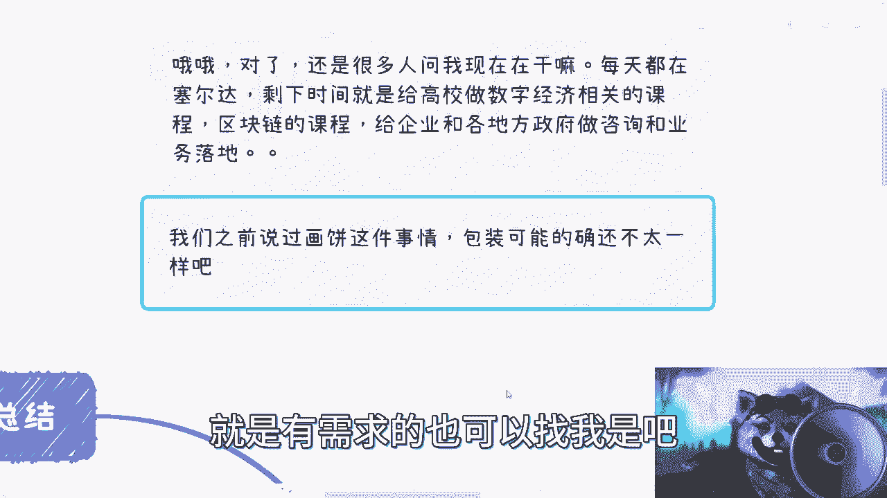
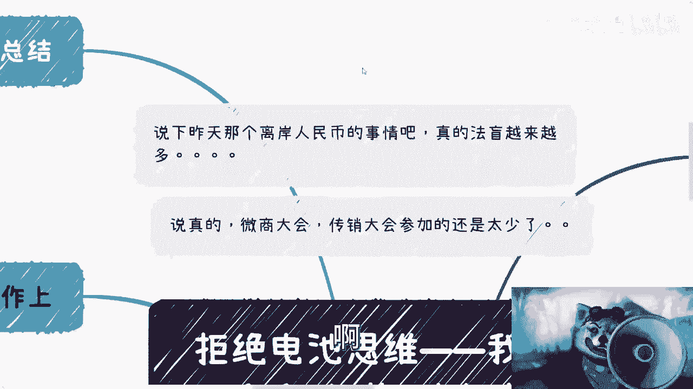
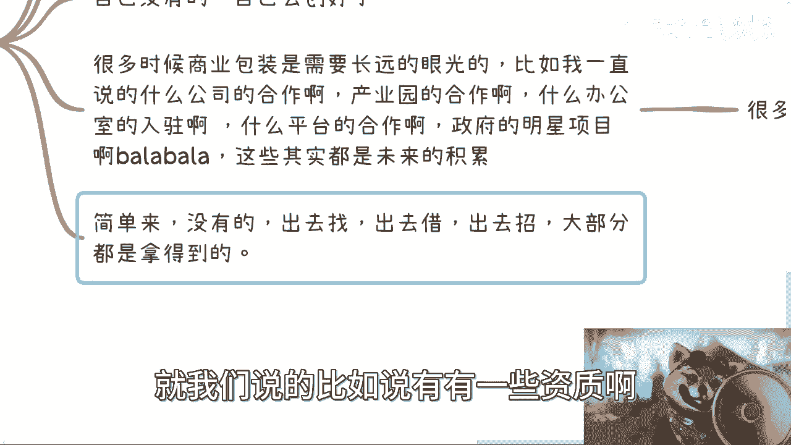
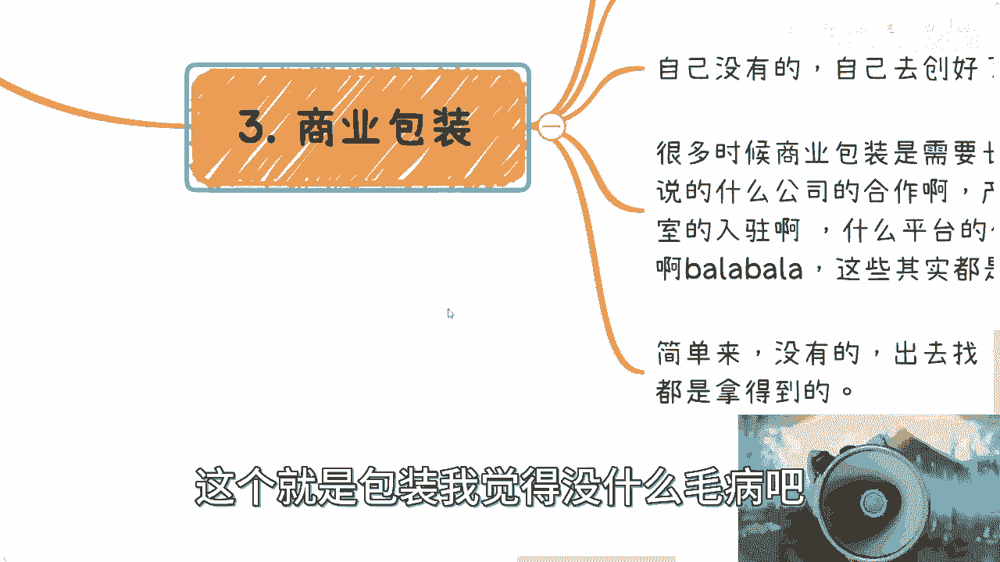
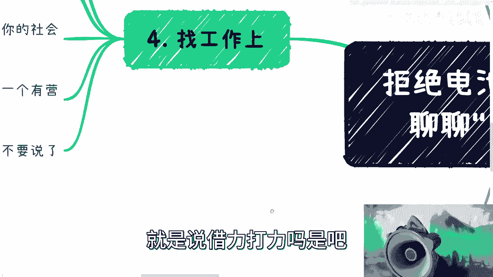

# 拒绝电池思维，我们来说下”包装” - P1 - 赏味不足 - BV1Ko4y1u7ob

好啊，这个儿童节快乐是吧，哎呀我这个早上起来头疼，真的是，对然后这两天呢这个小伙伴跟我说，聊一聊包装这个事儿是吧，我想了一下啊，之前应该是有这个画饼啊，但是我后来想了一下。

这个画饼这个事呢跟包装也的确不太一样啊，所以我就觉得还是单独再说一下，把这个小浣熊放大一点，对吧，然后我觉得这不是小熊猫是吧，嗯对然后这是第一个啊，第二个呢就很多人还在问我在干嘛对吧。

呃我现在自由职业者是吧，然后每天就在塞尔达，当然可能不定期，每天不知道在干什么是吧，就塞尔达打完我就可以打别的东西去了，呃，剩下时间呢就是给高校这边做数字经济，这个相关的课程啊。

然后可能会给高校里面老师上上课，然后区块区块链的课程，然后给这个企业啊，还有各地政府做咨询和业务落地就没了嗯，嗯基本上就这些吧，然后就是有的没的参加一些活动对吧，这个怎么样，反正就这么个情况啊。

然后呃反正大家要是比如说高校啊或者企业啊，或者哪里啊，就是有需求的也可以找我是吧。

我觉得现在就是法盲越来越多对吧，越来越可怕了，真的是啊，就是先不说到底什么情况啊，这个我也没什么好说的，关键是什么呢，就是啊中国跟某些很多国家是不一样的啊，你作为一个主权化国家，你法币你随便怎么样。

你无论人在什么地方，无论怎么说，你都不可能你有这个权利去做对吧，就比如说某一个某一个某一个主权化国家的，法币的一个CTRLCCTRL意义对吧，或者说一个一个主权化国家，一个法律的一个对应的业务业务。

这怎么可能呢，对不对，这竟然还有人还有人会说，哎这个做这个东西怎么对吧，不在某某地方做对吧，怎么什么没有什么牌照是吧，我在想这个东西，你别说在地球，你居然到火星去做，你也是不合法，你知道吧。

啊啊啊啊牌照你去看看牌照是个什么东西啊，牌照是最多，你能够允许你进行一些所谓的啊金融行为对吧，而不是说你能够去能够，一比一的去复制法币好吗，你再有牌照会有这种行为吗。

真的是我他妈绝了，你知道吗，然后说包装这个事，说真的我跟你们讲，太简单了，我就大家还是微商大会，传销大会参加太少啊。

真的，我们先来说一个说对吧，那么首先现在最大的问题是很多大学生表示啊，他说大学生对吧，我是大学生对吧，打钱是吧，哈哈啊，呃这个一一穷二白对吧，他说我怎么包装对吧，我跟你讲啊，我首先呢有一说一啊。

我在国内外碰到过一些大学生呢是很会来事的，就是人家大一就可以拿出一大堆有的没的对吧，虽然从我角度来讲，我会觉得啊还是这些都是垃圾是吧，但是没有关系啊对吧，就这些东西其实对外还是能忽悠的啊。

就是你这个本质上跟你大学，大学大学生没有任何关系，就说白了，说白了对吧，就是你能借力打力，你就去借力打力，没有，你就自己自己变成那个利，什么意思呢，你比如说啊大学这个这个叫什么主体里面对吧。

其实你要去弄些活动，参加一些东西，我真比你在社会上容易的多了，对不对，你要社区活动啊对吧，协会啊，不管民间不民间的，你去参加一下，你随便怎么参加，当然就说你们也不要太觉得就是说哎呀，我好像第一次怎么样。

第二次怎么样，你这些事情你总会持续性参加，你大家从这个不认识到认识你得有个过程吧，对吧，你总不能说啊，我第一次过就好，给我个给我给我个什么title对吧，给我个给我个什么什么什么嘉宾是吧，给我什么。

这不可能的呀，你说是不是啊，然后呢你比如说这个你是一个艺术家对吧，那至少你打个比方，你至少得要告诉我们你有什么作品对吧，你说这个作品是不是德国奖，我无所谓是吧，然后你比如说参加过什么活动对吧。

出去过什么演讲，你该有的都得有啊，对吧就是就是我我在这里面你们也看到了，就是我们不去纠结啊，就是说啊你这个说活动多么大，还出席过什么很重要的演讲，还怎么说没有呀对吧，你有就可以了，这是个0~1的事情。

对不对，然后呢你你你说你都没有对吧，那你自己创业可以啊对吧，你弄几个活动对吧，拍拍照啊，对我觉得弄个一两期对吧，大家合个影对吧，你你你再没有找些托来行不行，是不是哈哈啊，我跟你说，你介绍的时候。

没有人会去纠结你这个组织是什么，你就比如说你跟我介绍，我会第一反应知道啊，这是个野鸡组织对吧，这个不靠谱对吧，但无所谓啊对吧，但很多人不知道，那不就你就可以忽悠了吗，是吧。

然后呢我觉得呃本质上还是那句话，就是我们要去拒绝哎呀，为什么我现在看着这个头像，就总感觉喊核酸了呢，真的是我靠我我我被PV了，就我们要拒绝电池跟工程师思维对吧，别任何事情都去思考我能不能做，我跟你讲啊。

你但凡做任何事情去思考你能不能做，基本上你就是赚不到钱的，我给你打保票，你就赚赚不到钱的啊，就是说你要去思考什么呢，你要去思考啊，我需要什么样的资源，或者我需要什么样的人来做成一件事情。

这个是你要去想的事情对吧。

第二个呢就是说啊，我们说我们去这个认识一些人啊。

不如让别人来认识你们，什么意思呢，就是首先自媒体也好，或者网络上你写写文章也好，怎么样也好，就是你留下你的一些痕迹跟一些tag，就是别人能够去知道啊，就是啊做什么什么，我第一时间就找到你对吧。

我也或者说我不找到你，我也知道你你日常是做什么的，你就像我朋友圈对吧，我认识我的人都知道啊，这个这个吕老师对吧，这个基本上就是区块链元宇宙啊，数字经济对吧，日常活动对吧，比如交大华师大对吧，什么人大。

什么各各种地方是吧，然后这个做的内容对吧，要么就是做课程，要么就做教材对吧，要么就是在网上给别人瞎BB是吧，那他们就知道这些情况了对吧，那他们就会回头会有需求啊，他说啊，比如说某某某东西跟这个有关啊。

那他们就算不找我干活吧，那可以找我咨询，是不是中间这低点，第二点是你比如说有些什么公开类活动对吧，什么电视采访啊，或者别的，他觉得啊陈老师可以比比，那能找我去也行啊。

对但是你得让别人先得有这么一个认知嘛，是不是啊，那么很多人就纠结说认识人怎么去包装对吧，这个跟刚刚大学生这个建议是一样的，但是更便捷的呢是让别人来认识自己，就是我之前其实一直说嘛。

就大家可以自己去组织一些活动啊，或者什么东西啊，那很多人又要说了，他说哎呀，我不知道说啥对吧，组织不来，我社恐对吧，哎我跟你讲，唉这些都不是问题，就是你还是要远离工程师思维，什么意思呢。

就是说你只要是一个组织者，你去你就是提供个平台，就说白了就是说你今天对吧，取一个主题对吧，比如说什么什么生物医疗啊，然后呢你就找个咖啡馆或者找个we work，或者找个anyway，任何一个东西。

对不对，你你就把这个信息告诉大家，发到网上，发到哪里，总不会有人来的，不会没有人来的，对不对，那么你一个方向让你来，来了之后让大家文白问嘛，就一个一个自我介绍嘛对吧。

相互交流嘛啊你在这里面不管你社不社恐，你在这里面稍微引导引导对吧，大家自我交流熟络熟络之后总归可以聊的呀，就是人多一点嘛，就是可能稍微官方一点对吧，大家提提提提问对吧，大家相互聊聊，你人少一点。

比如说六七个人，七八个人十个人，那大家就就当这个陌生人聊天了是吧，因为你要这么想嘛，所有来的人他一定需求跟你是一样的，对不对，就是他如果有自己的圈子，有自己的一些叫什么拓展。

很熟熟练的或者说很成熟的拓展方向，他也不会来，对不对，就来的人跟你一定会有同一个诉求，那么大家既然相互都有诉求，那大家聊一聊呗，又你又不少块肉，是不是啊，所以说本质上来其实每个人都可以share是吧。

所以说你会发现啊，你不你不要去想，你会不会根本就不是问题啊，这个事很简单，就是你坚持我跟你讲，你坚持做个，比如说每周做一次，打个比方，你每周做一次，你坚持做一个月，你基本上就会脸，有什么不会呀。

哎简单的很，你知道吗，就很多不会，都是就你们不愿意做，好核酸来了，核酸来核酸了是吧，哎呦我靠这个真的是绝了哈，我下次拉两个喇叭是吧啊，然后第三个是商业包装，商业包装这事儿吧就更简单，我跟你们说啊。

我我我跟很多咨询我的人，我会说这合作方的故事是这样子的，就是当时是什么情况呢，是这样子的，就好像你们今天认识我对吧，线下见了个面，然后呢我就跟你说啊，我不啊，打个比方，我说啊我给这个，那我现在怎么讲呢。

就是啊这么说吧，就我以前做了一张证书对吧，然后呢这个我是没有资质的啊，我是问别人要的资质，而且通过个人关系要的资质，你知道吧哈，然后呢啊这个我就给你讲了对吧好，那我那个合作方就就我那个合作方呢。

讲完之后半个小时不到半个小时不到，他那见了他那甲方，那我也在旁边嘛对吧，那我在想你跟你甲方聊，你就聊呗对吧，我就听听学习学习啊，然后他很牛逼的，就是我跟他讲，我借别人资质做了一个东西对吧。

然后半个小时不到，他直接就跟他甲方怎么说的，他说啊这个东西就是我们做的啊，这个东西从头到尾什么标准，什么什么里面的各种细节对吧，什么现在老师什么乱七八糟，都我们培训的都是我们做的，卧槽我就懵了啊。

都给我们做的，我们不就借了个资料吗，我们甚至自己资料都没有啊，都我们做的，你咋这么牛逼呢，是吧啊，但是我跟你们讲，就是真的接触下来，你们不是很多人不是这样，你们赚不到钱啊，呃然后这个地方也写了啊。

你们没有的呢，给出去找战略合作啊，你比如说你说没有案例没关系啊，你出去找战略合作啊，找一些企业把它案例牛过来嘛，对不对，然后你说我没有什么什么什么软软住啊，或者别的一些东西啊。

或者一些一些一些一些什么专利啊，对吧，那你去找嘛，你找了找战略合作牛过来嘛，对不对，那那那那很多人又要说了，他说他说哎呀，那那我们没有对吧，那你去找别人，别人为什么鸟你呢，对不对，哎呀我跟你说。

商业合作不是那么复杂的事情，你知道吗，就是你首先先去了解对吧，了解之后呢，你可以先从小公司开始牛对吧，你比如说这个小公司唉，我们天天战略合作对吧，那真正合作的由头是什么呢，你就跟他说，我帮你拓展业务。

我就是你兼职的一个一个BD对吧，一个销售有什么不愿意的啦对啦，然后你从小公司牛牛了，大概一些小公司之后，那你再去找一些中中型公司嘛对吧，你你总归就是打打游戏，就你一个个谈嘛，对不对，然后你没有的。

你就出去战略合作，把他的东西寄过来，对吧，我跟你讲，很多时候商业上的包装是需要很长远的眼光的，什么意思呢，就是说因为商业上的包装，很多时候是集中在你这个人身上，或者集中在你这样公司身上的对吧。

但是你这个人跟公司很多东西你是需要积累的，你不是说啊今天你要出来做商业活动啊对吧，然后什么就就就什么两三个月啊，你能够把你身上的光环套满，概率不大了，当然就是说你说有吗，有是有的。

但是这这肯定不属于普通人的范畴了嘛，对不对，那么我们说在这里面，你比如说什么公司合作啦，产业有合作啦，什么办公室入驻啦对吧，什么平台合作啦，政府的明星项目啦，巴拉巴拉巴拉，你就是你去找啊对吧。

你能找到多少算多少啊，能能去签多少战略合作，签多少战略合作嘛，对不对，我跟你讲这个地方我写了一点，就很多时候是钱的问题，什么意思呢，就是说就很多时候就是那种项目，比如说给什么聘书的啊，给什么明星项目的。

给什么名头的，很多东西都是钱的问题，就比如说啊你可以申报对吧，你只要这个东西看上去写上去不是那么的呃，这个离谱对吧，那么你再交点钱，比如说交个两三万块钱，基本上很多东西是可以下来的，你能明白我意思吧。

知道吧，哼就是就是明着说，就是说你花了钱买了个荣誉对吧，你就这就这么回事啊，很多地方都这样买啊，那么简单来讲呢，就是没有的，你出去找出去借对吧，你比如说找找你找什么呀，找合作伙伴对吧。

你比如说找什么找什么这个这个技术提供方，因为你不可能养技术，你养不起嘛对吧，你们找找什么解决方案，提供方一般找嘛对吧，你没有的出去借对吧，借什么呢，就是我们说的比如说有有一些资质啊对吧。

有一些有一些什么专利啊，一些别的东西出去借嘛。

哎呀完了完了是吧，然后还有没有呢，你就出去招对吧，比如说你说他他要多少个博士对吧，怎么样子，那你去招啊，不行，你就找外包公司啊，把人头扭过来，对不对，哎呀方式方法多如牛毛，你知道吗啊。

就是除非是一些很硬性的东西，大部分你其实要拿都拿得到的，这个就是包装。

我觉得没什么毛病嘛对吧，你也不能说你骗人家，只不过就是说就是说借力打力嘛是吧啊。

然后找工作这事呢，我觉得包装也是很有用的对吧，你比如说简历包装这东西，我觉得很多人就不会包装，你简历包装的东西过于简单了，就是你没项目，对不对，那你比如说很多开发对吧，你没项目。

那你到GITHUB上面去做个开源项目，也是也就项目啊，对不对，你再没有，你问别人借一个项目来怎么滴了呢，哎呀这不是问题啊，你问题是要找到工作，你问题不是要把这简历写的多么真实，你说对不对。

你除了该不造假的地方不造假，那剩下的包装包装怎么了呢，怎么了呢，对不对，你你包括你包括什么，有很多人做什么市场营销对吧，做做做什么啊，市场运营的哦，你这简历拿出来对吧，除了以前工作内容。

自己毫无市场营销和市场运营的案例，那你还做个屁呀，你说是不是对吧，那你自己可以搞一些啊对吧，你你你你比如说搞个公众号，搞个视频号，搞个小红书都是搞啊，你搞啊，倒是，是吧啊。

然后呢你比如说包括啊就是技术岗对吧，你不说不管你什么岗位，其实你要告诉别人，你的社会地位和资源，也就是说你你会不会来事，你会不会折腾，你会不会造，你知道吧，你会发现哪怕是技术岗位，很多技术团队也是需要。

有一个有有营销或者社会属性的人，同时还能干活的工程师，真的我跟你讲，真的需要的，因为因为你我不知道，大家可能以前没经历过，就是你们会发现2015年16年，那个时候就是就是中国很多的这种企业啊。

他其实会要求就是技术团队去销售，也不叫去销售吧，就是说会会要求技术团队做出来的产品，自己去卖，你知道吧，就是那个时候就是因为啊，企业会觉得你们得要带来营收益啊，而不是说只是做一个什么软件产品或者怎么样。

就是给企业带来价值的不行的，那这个时候你想嘛，你让一个纯技术团队啊，在那边说哎呀我今天做了一个平台，这平台还要还要销售数据对吧，这个比登天都难啊对吧，所以其实他们是需要有这么一个营销或者。

社会属性的这么一个人的好，那么你比如说别的市场啊，营销啊，授权啊对吧，这个各种各样的岗位就更不要说了，就是这什么意思呢，就是说你拥有一定的社会资源啊，社会地位和资源，这个不不是说多么高的地位啊。

不是说也不是不是说多么高的资源啊，就是说你有一定的积累，其实相当于你就是多一个筹码去跟企业去谈好，那么也就是说你在大家同样找工作很难的时候，都大家同样的做事情，就是大家拿同样相对薪资水平情况下面。

那么你肯定是比别人来的有优势对吧，因为说到底企业不是一个让你打工的地方，你知道吧，就说到底企企业是一个你必须要被压榨的地方，但是问题在于你被压榨，就是你你你同样被压榨，你怎么拿到更多的薪水对吧。

那么自然而然对企业来讲，只有一件事情，你能打的打动，打动得了他的对吧，不是说你有多大的学历，不是说你有多多多以前在哪些大公司做过，不是说你做过哪些东西，这些都不重要啊，这这些对企业来讲，我听过拉倒。

但是有一件事情对他来讲是百分之百有诱惑的，是什么，就是我能够给你赚钱就结束了对吧，你哪怕就是对企业来讲，哪怕说哦，因为你利用我，你能够帮你赚钱也没有关系，我可以被你利用，但是你至少该给我分润，给我分润。

该给我这个多一点薪水，多一点薪水对吧，这就很简单的事情，大家就是所谓在商言商，就是谈商业的，不是说啊你在这边打个比方，你你在这边这个学历很高，或者包包装的花里胡哨，这些其实本质上都是锦上添花的对吧。

它核心就是你要让别人觉得你能够给他赚钱，对吧总结对吧，总结是什么呢，就是说包装跟画饼啊，本质上还是不一样的，包装呢是借力打力，最终呢就是说在一个四两拨千斤，什么叫四两拨千斤呢。

就是你你你可能现在就像你说的，你没有人脉没有关系，你没有很多积累，那你你你有什么稍微讨巧的方法呢，有那就是我们说的包装对吧，就是说当你在什么都没有的时候，能不能达到一个呃这个某一些。

就比如说在你level1的时候，能不能达到一个level5的效果或level10的效果，那就靠包装对吧，那而且另外一方面是什么呢，就是说包装并不是去骗啊，也不是去造假哦。

它其实更像一个就是说啊把你的优势放大，把你的就是说啊商业就是就整合资源，然后把每个个体做不到的事情啊，整合之后就能够做到的这么一个过程，所以说你好的包装呢其实是一个有计划，有有有计划，有预期性的。

并且是一个长期持续性的一个过程，因为你要知道啊，你所有的包装其实都是持续性的啊，都是需要就是说有积累的。

哎呀我这么跟你们讲吧，就是很多时候我我那天我记得我跟谁说的，我忘记了呃，应该也是某个咨询我的人，就是我当时刚才说的很清楚啊，我说很多人为什么觉得自己没有积累，为什么很多人会觉得自己好像。

比如说做了这么多年对吧，然后一天到晚说自己普通人，说自己怎么样怎么样，我跟你们说，很多时候是这样子的，是因为大家没有坚持，就是就是太多人去纠结于哎这行业好不好，这东西赚不赚钱，这个东西里面啊。

有没有我一席之一席之地，你知道吧，然后就可能比如说隔个一两年换个方向，隔隔335年换个换个方向怎么样，但是你会发现没有用的，你知道吧，真的没有用的，就是因为我们要积累的是什么，我们要积累的是0~1。

你知道吗，就是今天比如说你在再差的一个行业里面，你积累出0~1的这些经验，你可以在别的任何行业，CTRLCCTRLV的，你知道吧，这个对你是很宝贵的，但是很多人他不明白，你知道吗，他也没有0~1的经验。

没有1~100的经验，他就是到处道听途说，所谓的纸上谈兵，网络学习对吧，那你这样的话，你你你短时间内你说能不能赚钱，能你能不能有些成就感也能，但是你时间一长，你就会很迷茫，因为你没有积累，你知道吗。

你不知道应该自己怎么做，你永远都是那种就要么跟着别人走，要么被被趋势牵着鼻子走，没有用的，你知道吗，你看我做这么长时间，我到现在为止，我以前做开发做了7年对吧，我到现在为止，其实我就走过两条路。

一移动互联网，二区块链，数字经济没了，就这两条路，移动互联网我是从它那个那个头，就是从开始到整个衰败，我经过完整的一个周期，所以我很清楚在这个周期当中，我应该怎么去认识人，我应该怎么去积累关系。

我怎么我我应该怎么赚钱，那么这套逻辑我把它抽象出来，在区块链这个行业里面也一样可以做，你哪怕今天把我扔到新能源里面，我也可以这么做，为什么，因为我知道怎么做啊，你明白吗，好吧行，那就先这么着吧。

然后有那个啊，反正有各种问题，随便你们啊什么问题都可以呃，呃创业对吧，或者什么职业发展啊，或者来说这个未来未来计划规划的好吧，然后呃有的啊，我跟你讲，有的人呢是都想的很清楚了，来找找我。

double check也可以啊，都无所谓好吧，反正你们有啥，你们整理好。