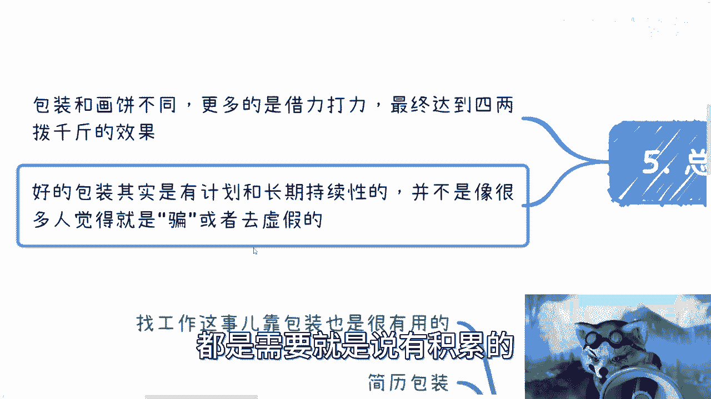

# 拒绝电池思维-我们来说下-包装----P1---赏味不足---BV1Ko4y1u7ob

在本节课中，我们将探讨“包装”这一概念。我们将了解包装与画饼的区别，并学习如何在个人发展、社交、商业及求职等不同场景中，通过有效包装来整合资源、放大优势，从而实现目标。

---

## 概述

包装的核心在于**借力打力**和**资源整合**。它不是欺骗或造假，而是一种策略，旨在将个人或项目的现有优势放大，或通过合作弥补短板，以达到更高的效果层级。我们将从几个具体场景入手，解析包装的实践方法。

---

## 个人背景与包装起点

很多人，尤其是大学生，常感到自己一穷二白，不知如何包装。关键在于转变思维：不要总想着“我没有什么”，而要去想“我能整合什么”。

以下是针对个人起点的包装思路：

*   **参与活动，积累经历**：大学或社区里有大量活动、协会。积极参与，从陌生到熟悉是一个过程。初期不必追求重要头衔，关键是迈出从0到1的第一步，留下参与记录。
*   **展示作品与成果**：如果你是创作者，务必展示你的作品。无论是否获奖，有作品就是基础。参加过演讲或活动，也应留下证据。
*   **主动创造平台**：如果什么都没有，可以自己组织小规模活动。例如，定一个主题，找个场地，邀请同好交流。作为组织者，你自然获得了关注度和连接资源的机会。

**核心思维转变公式**：
`从“我能做什么？” (工程师思维) → 转变为“我需要什么资源/人来做成这件事？” (整合者思维)`

---

## 社交网络与个人品牌包装

在社交中，与其费力去认识别人，不如打造个人品牌，让别人来认识你。这能更高效地建立认知和吸引机会。

以下是建立个人品牌的方法：

*   **留下数字痕迹**：通过自媒体、文章、朋友圈等渠道，持续输出与你专业或兴趣相关的内容。让别人能通过搜索特定的标签（Tag）找到你，并了解你的专长领域。
*   **组织或参与公开活动**：主动组织线下沙龙、分享会，或争取参与行业访谈、公开演讲。这能大幅提升你的能见度和专业形象。
*   **持续经营**：个人品牌建设贵在坚持。例如，每周组织一次交流活动，坚持一个月，你的社交能力和圈子都会有质的提升。

**关键点**：所有参与你活动的人，本质上与你有相似诉求。大家是互相需要、共同成长的伙伴，交流本身就能创造价值。

---

## 商业项目包装策略

商业包装的核心是“整合资源，讲述故事”。许多你缺乏的要素，都可以通过合作“借”来。

商业包装的实践路径如下：

*   **寻找战略合作，补齐短板**：没有成功案例？去找有案例的公司谈合作，以帮助他们拓展业务（如成为其兼职BD）为交换，将他们的案例“嫁接”为自己的背书。缺乏技术、专利或资质？同样去寻找拥有这些资源的合作伙伴。
*   **用钱购买“荣誉”或资质**：对于一些政府明星项目、行业聘书或认证，很多时候只要项目本身不离谱，缴纳一定费用（例如几万元）即可获得。这是一种明确的“购买荣誉”式包装。
*   **“招”与“借”结合**：需要高端人才（如博士）装点门面？可以去招聘，也可以找外包公司“借用”人头。方式灵活多样。
*   **长远眼光与持续积累**：商业包装往往附着于个人或公司，需要时间积累。它是一个有计划、有预期的长期过程，而非临时抱佛脚。

**核心逻辑**：商业世界看重的是你**创造价值（赚钱）** 的能力。包装的目的就是让合作方或客户相信你具备这种能力，无论这些能力是自有的还是整合而来的。

---

## 求职中的简历与能力包装

在求职中，包装能让你在同等条件下脱颖而出。企业最终关心的是你能为其带来多少价值。

求职包装的要点如下：

*   **丰富项目经历**：对于开发者，若缺乏商业项目，可在GitHub创建或参与开源项目。必要时，甚至可以借鉴他人的项目经验进行包装。关键在于获得面试机会。
*   **创造个人案例**：对于市场、运营等岗位，如果简历只有工作描述，没有成果案例，可以自己运营一个公众号、视频号或小红书账号，用实际数据说话。
*   **展示社会属性与资源**：即使是技术岗位，一个兼具技术能力和一定社会资源（会来事、能折腾）的工程师也更具吸引力。企业需要能直接或间接带来收益的员工。
*   **突出价值创造潜力**：包装的终极目标是让企业相信，雇佣你能帮助他们赚钱或节省成本。这是谈判薪水的最大筹码。

**总结**：求职包装是在不造假的前提下，最大化展示你的技能、经验和潜在价值，特别是你**整合资源解决问题**的能力。

---

## 总结与核心思维

本节课我们一起学习了“包装”的艺术。

1.  **包装的本质**：包装是**借力打力**和**资源整合**，旨在用四两拨千斤的方式，在资源有限时达到更好的效果。它与虚假的“画饼”不同，是一个有计划、长期持续的优势放大过程。
2.  **核心思维转变**：要**拒绝“电池思维”**（只关注自身放电能力）和**“工程师思维”**（只思考自己能否独立完成）。应转向**“整合者思维”**——思考需要什么资源和人来达成目标。
3.  **关键在于积累与坚持**：有效的包装建立在真实的0到1的经验积累之上。最忌讳频繁更换赛道、纸上谈兵。在一个领域内深度积累，抽象出的方法论可以复用到其他领域。
4.  **最终目的**：无论是个人发展、社交、商业还是求职，包装的最终目的都是向外界清晰传递你**创造价值的能力**，从而获得更多的机会和资源。

包装不是捷径，而是更聪明的努力方式。它要求你更具策略性地看待自身和周围的世界，并通过持续的行动和积累，将点滴优势汇聚成强大的个人品牌与实力。