# 拒绝电池思维，拒绝工程师思维和优柔寡断 - P1 - 赏味不足 - BV1SV4y1U7h5

咳咳咳，各位小伙伴大家好啊，今天周几啊，周周六对吧，周六啊对，然后继续我们来说这个问题啊。

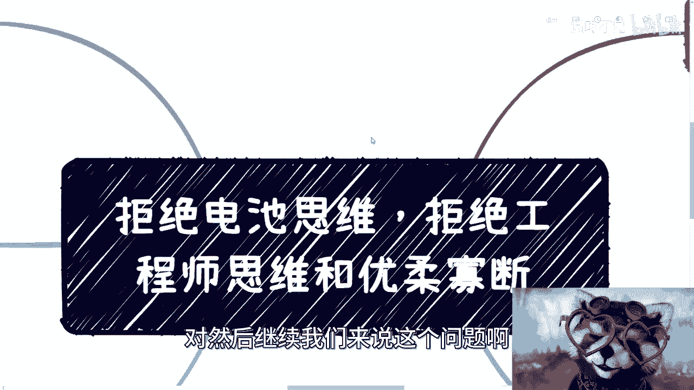

就是这个电池思维对吧，然后这一期呢我这个总结了一下啊，也是最近聊的比较多呢，是工程师思维跟优柔寡断。

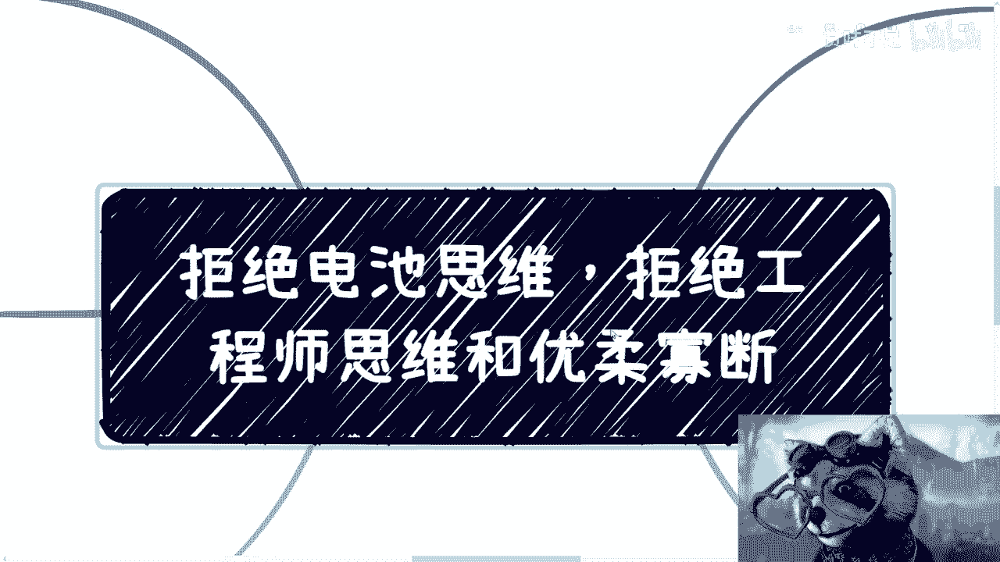

你们看啊这个东西首先是这样子的啊，就是我觉得大部分人除了行动。

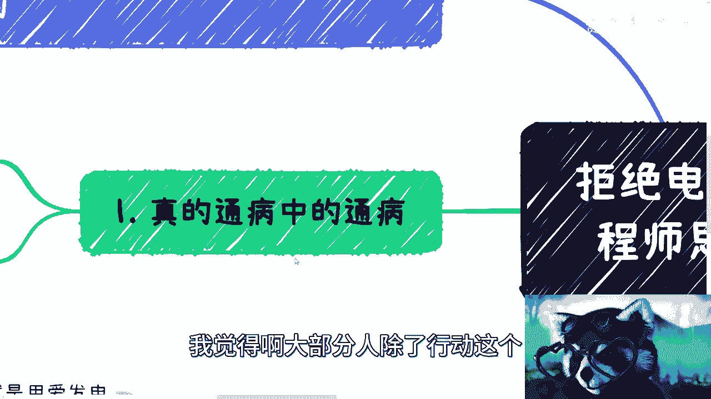

这个这个比较难啊，比较拖延以外呢。

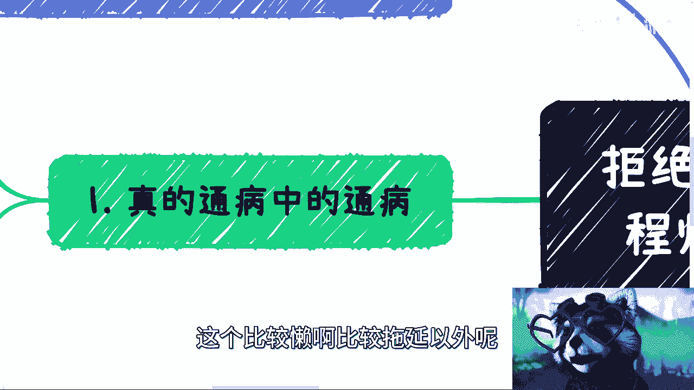

的确这个问题也是比较，这个问题其实才是最重要的一个问题，就是说通病中的通病就想法。

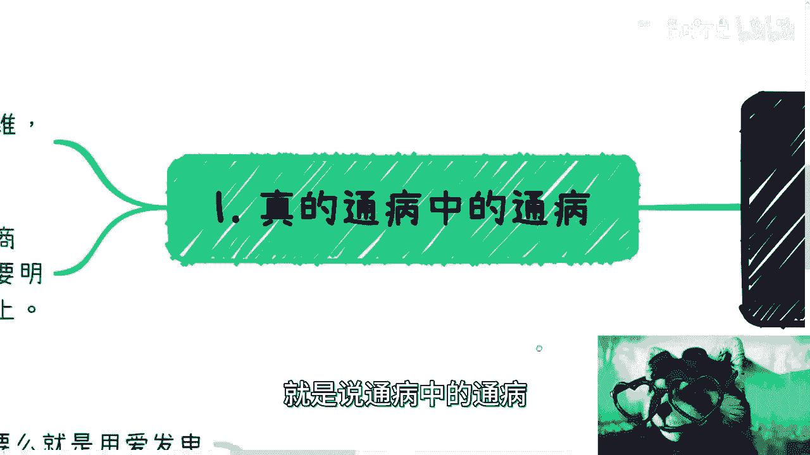

什么叫想法呢，工程师思维其实是说的比较好听的啊，其实就是打工人思维，电池思维，劳动命思维，这是第一点啊，第二点呢就是我们来说这个优柔寡断，优柔寡断这个东西呢，我觉得你们看啊。

无论是在你们工作时候还是商业的时候，还是你们谈朋友谈恋爱，哎我搞得我像一个八十七八十年代的人，真的是呵呵是吧啊，谈恋爱对吧，感情上这个各个方面其实都是通用的，核心呢你就是说自己要明白做什么哦。

就是别浪费时间在任何无用的事情上面，就是什么意思呢，就是说你们在做任何的事情的时候，你比如说看书也好对吧，包括啊你们平时就是内耗对吧，或者说其他各个方面，就是就你得有根弦，这个弦是什么呢。

就是就是脑子里面第五根筋，就这个筋就是说你得不停的去反问你自己，你现在就是浪费时间也好，或者说是内耗也好，或者想事情也好，就是各个方面这些事情是不是在浪费你的时间，就是你只要去想，就是一你有没有成长。

二你有没有赚钱，你说我既没成长，也没有赚钱，那我不就在浪费时间，但是你浪费时间有意义了，没有意义的对吧，所以说其实你会发现啊，就是不管你做什么，如果你们现在想法是说啊，我就是想脱离做电池的对吧。

就是想赚钱的，那你这两个东西必须要改变，你这两个东西不改变，你永远是走不上去的。

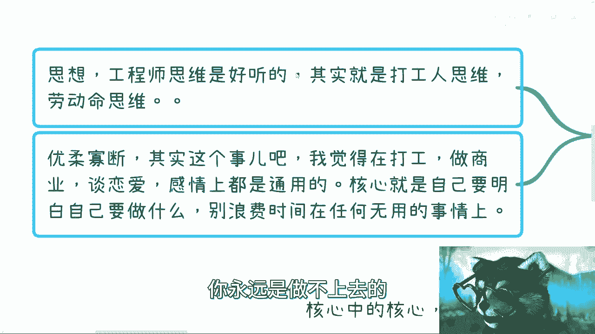

这没有办法的，你知道吧。

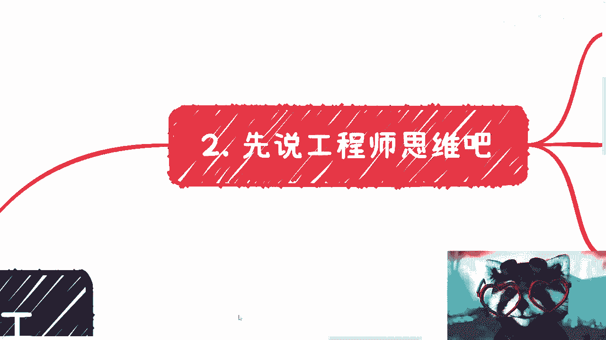

这是第一点啊，那第二点呢某细分开来说对吧，先说工程师思维啊，嗯为啥叫工程师思维呢，就简单来讲就是说所有事情都是想着怎么做，你明白吧，就是比如说你在碰到任何一个事情啊，你想的是哎你现在想的是哎我怎么做。

怎么落地，怎么执行啊，这个东西里面有哪些细节对吧，然后考虑细节问题，其实这个东西吧，我觉得也是跟我们教育是有关系的，因为大部分人啊从小到大受到的教育，就是要去啊考虑问题，全面的考虑考虑问题对吧。

怎么样怎么样，就是你会发现大部分的教育，给予我们的是什么呢，就是你怎么去做好一件事情，而不是你怎么去赚钱，就是或者说你怎么去赚钱，这件事情其实从从9年制义务教育的吧，一直往上走，往上走。

就是包括呃可能你你未来去读NBA，Nba，其实你会发现很多课程里面他也是没有的，因为他给你的是，就是比如说一个产业链的逻辑对吧，他给你的是一个就是说某一个行业的运作逻辑，但是他依然不会告诉你。

你到底应该怎么去赚钱，你知道吧，所以说呢其实你会发现工程师思维呢，就是第一个就是考虑细节，你知道吧，第二个呢就是说他还有个很直接的表达方式，就是他从来不考虑赚钱，就是我跟你们这么说。

就是所有的人你们去问啊，你问他你想不想赚钱，想对吧，想啊你就问他这个，但是呢就是说他考虑问题的时候，包括你们很多自己人啊，自己考虑问题的时候，你就会发现你们从来不考虑问题，怎么赚钱，就是你们就想嘛对吧。

这就好像就是说啊，你你你有很多人就说他说我要做这个，就是叫什么跨境电商对吧啊，直播带货对吧，或者做自媒体对吧，好没问题，这些都没问题啊，都没问题啊，好但是呢你们想想看核心逻辑是什么。

就是你做那个直播间直播带货或者做跨境电商，做安全，做医疗，做自媒体对吧，你要想的是你赚钱啊对吧，就很多人就说啊，我要做这个东西做没问题，那我就问你们，你有没有想过你怎么赚钱，你怎么变现对吧。

其实你不考虑为什么，因为你你你的工程师思维已经根深蒂固了，已经是深入骨髓了，你知道吗，然后然后还有很多人我跟你们讲，就是我也很焦虑，就是还有很多人就是说哎我不思考的，他说他还要PV自己说自己不擅长。

因为这句话有很多人跟我说过，你知道吗，就是就是就是你跟他讲讲了，讲完之后他就说啊，这个事情，这个事我不太擅长的这个东西交给别人了，你知道吧，他说我就擅长做什么工程落地对吧，做这个解决方案对吧。

好我就这么跟你们讲，你们想想看这个事儿，我们说直白一点，今天如果是我，比如说吕老师，我去谈钱啊，你跟我合作，你永远肯定就你肯定都是永远被压榨的那一方，为什么，因为你不谈钱，你不知道多少钱对吧。

我谈了30万，我就给你3万啊，你还要回头跟我说谢谢啊，是吧啊，就是当然你要说你，你你肯定也会反问我，你说哎我能不能，我我就难道不可能碰到一个为自己考虑的对吧，那我就说嘛，我可以为你考虑。

那请问这是多大的概率啊，就今天这个市场今天这种经济情况对吧，而再加上人性是吧，哦你说你要在商业层面碰到一个，碰到一个还为你考虑的，我就问吧，是我欠你的还是怎么滴的，我凭什么为你考虑啊对吧。

我他妈我我说不好听点，我我今天也假设谈了一个30万的case，我给你3万，已经我都觉得他妈的一仁至义尽了，我跟你3000差不多是吧，你不做好了，你不做他妈外面排队多的屎，是不是，是吧。

然后我觉得这个是那个工程师思维啊。

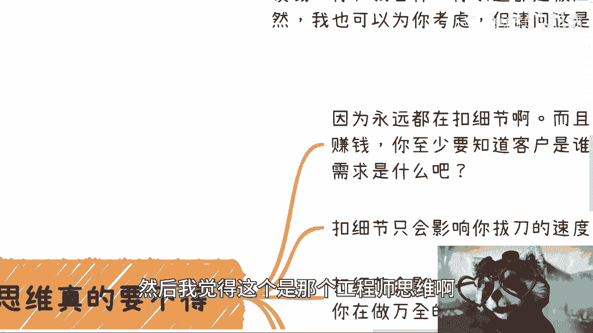

然后第三个呢就工程师思维本身，我觉得嗯肯定是有问题的，而且就是你千万不能有啊，这个地方我也列出来，第一呢就是说你会发现你永远都在扣细节，你永远都在YY细节，因为你要赚钱，你至少得要知道客户是谁，对不对。

用户画像是谁，需求是什么，其实很多时候你会发现，你考虑细节这件事情有错吗，也没有错，但是你考虑细节这件事情，你考虑的细节都是自己YY出来的，很多人都老是说别人不接地气，其实自己也很不接地气，你知道吗。

这是第一点，第二点是你要明白扣细节你只是在浪费时间，你知道吗，扣细节只会影响你拔刀的速度，真的就人家说这个快刀斩乱麻就斩乱麻了，谁他妈在那边扣细节啊，这就是吃饱了撑的马，你说是不是对吧。

第三个就是我跟你讲，扣细节会影响你做事情的效率，就说白了就是你觉得你你其实啊你觉得哎呀，我要考虑全局对吧，你受到的教育就是要考虑各种细节对吧，但其实你只是在浪费时间跟机会。

因为很多时候机会窗口就那么些时间，窗口就那么些没有啦，你在那边扣细节，你自己觉得卧槽我很牛逼，你知道吧，怎么样怎么样对，但是你赚不到钱有卵用啊，是不是啊，而且呢我跟你讲啊，工程师思维。

这是一个潜移默化的，很多人他自己还感受不到，就是我一直说啊，我说有非常多的人，比如说问我问题对吧，私信我咨询对吧，他问题也没问到点子上，他比如说他今天让我给他介绍一个资本，对资方我也给他介绍对吧。

但是你问题问不到解点子上，你考虑考不了，考虑不到点子上，那我请请问嘛，你问出来问题，比如说你今天花了1000块钱去请别人吃饭，你觉得哎我请她吃饭可能有价值，但是你问的问题不在点子上。

我请问你这个钱跟扔在水里有什么区别，对不对啊，然后就最后就有人说了，他说那怎么改，我跟你们说，这玩意儿不是靠你们每天在那边抱怨，不是靠你们在那边看书，不是靠你们看一些视频就能改变的，改变不了的。

不是靠送亲念佛就能改变的，靠自己冥想不可能的，你就是我为什么一直跟你们说，迈出第一步，就是因为你只有卖出去了，你只有做产品了，做商业了，也不叫做产品，就是做商业做服务来对吧，就是走商业化了。

你才会明白自己的思维跟别人到底有什么区别，而不是说活在自己的世界里面，你知道吗啊，那么那么第四个我们就要来说优柔寡断是吧，优柔寡断呢这是什么呢，就是说核心中的核心就是你要么就用爱发电，什么叫用爱发电呢。

就是你别内耗啊，你也别去想赚钱，你就想着说我怎么为人民服务啊，你就想着我怎么做好一个产品对吧，就是怎么帮助别人，你就是帮助到别人了，哪怕你每天吃土，你也很开心对吧，我觉得你要么就选择这个啊。

这个A叫A对吧，好我们选择要么就BB是什么呢，要么就是在不违法的前提下面，你不伤天害理，不不不杀人放火是吧，宁王斯里格什么意思呢，就是你看啊，最近有很多小伙伴跟我说，他以那个之前卖过GPT的账号对吧。

我跟你们说，什么叫商业思维，商业思维就是你得先去评估你的受众有多少，你能卖掉多少钱，比如说你今天一个账号卖20块钱对吧，好，你跟我说哎呀吕老师，我没什么积累的对吧，我能卖掉一个是一个对吧好。

你但凡这么跟我讲的，我就会告诉你，你还不如往死里搁，什么叫往死里搁，就是你去看看市场上平均价格，打比方4000块钱，对不对好，那你就定3800，你就定3700就不概率啊，怎么了，有买就买。

卧槽3700不比你20块钱来，你20块钱得妈卖到死去啊，啊对不对，就是就是我跟你们说，做任何事情都是一样的，你必须要有这种思维，你知道吧，不要去想呀，你们想想看，我但凡如果我们私下我怎么跟你们讲。

你们又要说了，哎呀吕老师不行啊，这个东西这个卖太贵了对吧，这个东西也没什么技术含量，人才骂我的，喷我的人家怎么样呢，那我就问问你有什么好讲的，我就问你，你要想赚钱想不想想啊，你就往死里卖，结束了呀。

有什么好想的啦，你知道吗，就是就是我在这地方，你们看完写的很清楚，但凡你不走这两个极端，你走中间状态是什么概念啊，就是你就赚不到钱，然后不停的内耗呀，对不对，然后你们要我跟你说，有很多人要跟我讲。

哎我不行了，我有底线的，哎，我道德准则很高的，哎我怎么样怎么样，那你去道德准则高考了，你不要赚钱啊，你别又道德准则高，又在那边抱怨说哎呀为什么赚不到钱对吧，为什么我我我我我就发现我很内耗对吧。

我每天精神很抑郁对吧，那你怪谁了，你明白我意思真的就是就是很多时候啊，问题是出在我们自己身上，但是呢你我不管你是自己解决，还是找心理医生给你解决，我不care这件事情，但是但凡你不解决，你就是又要计较。

没有办法的，你知道吗，就是我为什么一直说，就是很多人没有明白这个商业的本质，商业的本质就是残酷的，商业的本质就是残忍的对吧，你别看现在哪家企业这么风光也好，做这么大也好，哪家企业如果能活到现在。

他一开始哪家不是吸血吸出来的啊，哪家不是踩着员工的尸体出来的，唉真的你们怎么说呢，因为有很多东西吧可能都美化了，你知道吗，但是如果你们真的经历过，你们会发现，可能你们就会说。

哎呀这老板怎么这么没人性对吧，这老板怎么这么残忍是吧，怎么样子，那怎么办呢，你对敌人的同情就是对自己残忍啊，对不对，你就像为什么最近岗位这么少，就我一直说，因为企业家自己都活不下去了。

他如果来说对你们的仁慈，就是比如说哎呀按时发工资对吧啊，不降薪对吧，然后不裁员就是对你们的仁慈，这对你们仁慈，那其实就倒闭了，那我就问嘛，你换位思考一下，如果你是资本家。

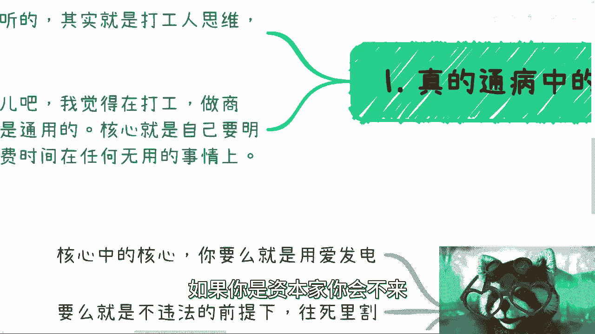

你会不会你不会的呀，是不懒啊。

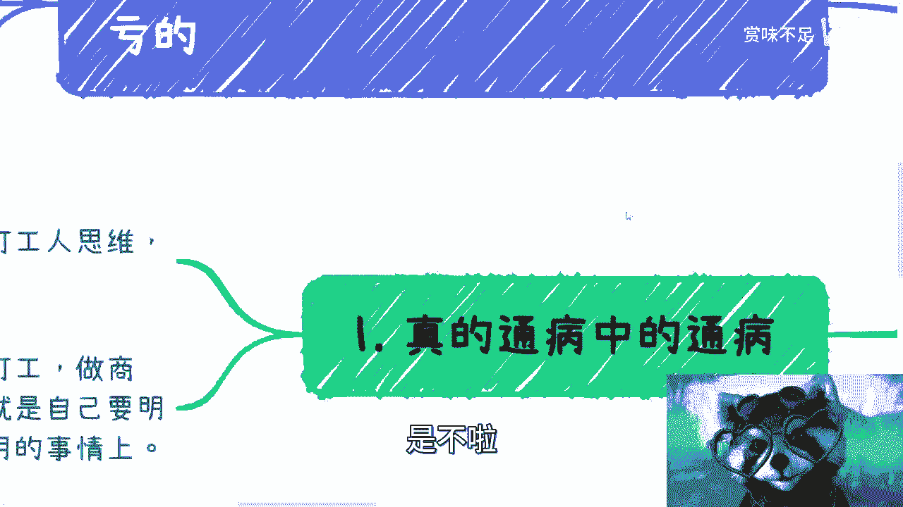

第五点就工程师思维呢，包括这个优柔寡断，你到哪都是吃亏的。

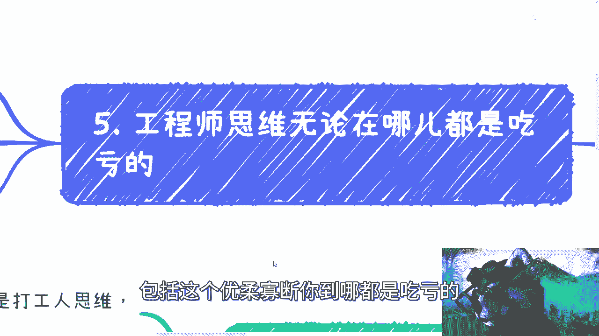

你明白吧，这不仅仅是商业的问题，你比如说我们打个比方，比如说你在工作当中，你领导看到你工程师思维，那我就那句话呀，就是哎你是个很好的劳动者，你是个很好的落地者，蛮好的呀，每个人做好自己的角色呀，对不对。

那蛮好的，你就好好打打工呀，有什么不好的，对不对，但是他可以给你，比如说他可以给你这个价值A，他可以给你KPI高，可以给你优，但是你就不可能做管理，你也不可能做更大的事情，为什么，因为你是工程师死亡。

你是有局限性的，你明白吗，你知道吗，就是很多人是这样子的，他就在那边想哎呀，我做的蛮好的对吧，我辛辛苦苦做，为什么最后得不到重用，得不到重用，不是因为你活儿干得好，哥哥们是不是姐姐们，爷爷们。

奶奶们是吧，你活该脏活没有用啊，你得有格局啊，你格局不够，他能怎么办呢，对不对，这是第一点，第二点是你在外面对吧，看你工程师思维，你比如说你说哎，你说今天对吧，我我组织个饭局啊，这个我给你个机会。

你过来对吧，我靠我被蚊子咬了，我靠这么大一块，唉妈的真的是作孽，就是就是看你工程师思维对吧，那你想看吗，在外面看你工程师思维，其实大部分的人也不会合作，为什么呢，或者退1万步来讲。

就是他合作也是把你当成外包，你明白吧，就是很多时候呢是这样子的，就是你像非常多人也在问我，他说哎我们出去沟通，怎么让别人觉得自己有价值，我跟你说啊，让别人觉得你有价值，不仅仅靠包装，是从你的谈吐。

从你的思维当中就能看得出来的，就基本上可能跟你聊2分钟，聊5分钟，就能够知道你这个人到底是个什么思维，你知道吗，因为比如说我抛出一个问题对吧，你你就这个问题回答我也好，包括包括你去思考一个问题也好。

你说出来的话，跟你抛出来的问题，我就能知道你的思维到底是工程师思维，还是一个商业思维，还是一个具有格大格局的思维对吧，就是你今天可以是个大学生，你今天可以是一个没有学历的人。

你今天可以是个就什么都不懂的，但是但凡你的思维不是工人思维，我跟你讲，就我说实话，我就会觉得，包括大部分人会觉得你是个很有潜力的人，你知道吧，你是一个值得培养，你是一个就说值得去锻炼的人。

但是你要是是个工程师思维，你再聪明没有用的，你你们明白我意思啊，包括那个商业看你工程思维是一样的，商业当中啊，如果你是个工程师思维，我跟你说就是合作也不要合作，因为合作到最后你就是大家都会心里明白。

就会被你拖死的，你知道吧，就明明我们举个例子啊，明明比如说这件事情两个两个月对吧，报报一个项目，做个项目，大家就是你好我好大家好，就是整个流程都很好走的两个月，比如说赚100万，对不对。

你但凡出来个工程师思维好了，你不但钱赚不到，说不定到最后还被人抓到把柄，你知道吗，就这个事儿我可能不能再往西了说了，但是你们品品我刚刚说的这件事情，你们明白吗，对吧，就是说很多时候屁股决定脑袋。

这件事情是对的啊，那么这个时候我就跟你们说，你们就得去改变。

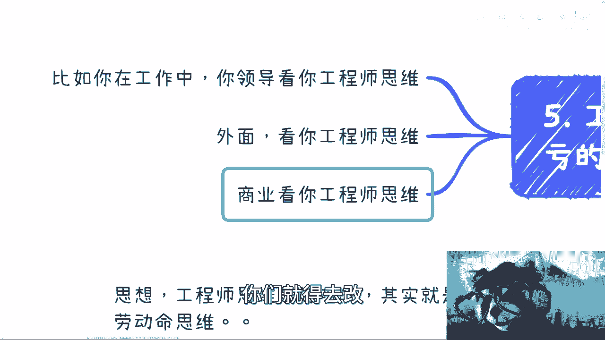

什么叫改变，就是你们要么就像我刚刚说的，你们就走两个极端，你要么就告诉我，你不想赚钱，你用爱发电对你要么就告诉我，你想赚钱，那你就改变你自己，首先先从你的想法，从你的性格，从你的各方面改变，你不改变。

你做不了的，真没法做啊，而且你不改变，你是很难看到事情本质的，因为因为你就像啊很多人还问我，他说吕老师有什么书可以看，我跟你们说，就像我们说很多人读那个九阳真经是一样的，为什么张无忌对吧，练乾坤大挪移。

它可以在短时间内练成，而在羊皮书上，羊皮卷上写的很清楚对吧，就是就是那个悟性高者对吧，多少年次折多少年，对不对，但是你想想看，同样读一本书，不是你们去读书啊，而是你们得要有足够的思维。

足够的认知去把书里面所讲的东西明白，就好像我今天跟你们讲这个视频一样的，就是有些人他可能能明白，有些人他可能得过两年才明白，有些人可能过5年才明白，对不对，就这个不重要，重要的是你们要把这个就是走出去。

第一步，同事把自己的这个这个商业上也好啊，包括各个方面经验先积累起来，然后再来思考问题对吧，你说你你从小到大受到的都是电池的教育，受到都是优柔寡断的，这种都是就工程师的这种执行力的教育。

你突然之间跟你说好，你要自我冥想哦，把你的想法改过来，可能了不可能的呀，对不了，你就靠我这个这个视频能改吗，也改不了，没有办法的，你知道吗啊但是我跟你讲，这个是非常重要的，我知道有很多人都在想着。

这个眼镜为什么不掉下来，我跟你讲，我也在想这个问题，我一边讲一边就在看这眼镜凭什么不掉下来啊，他怎么这么吊呢，是吧嗯行吧，反正就是一样的啊，就大家有什么职业规划对吧，有什么副业。

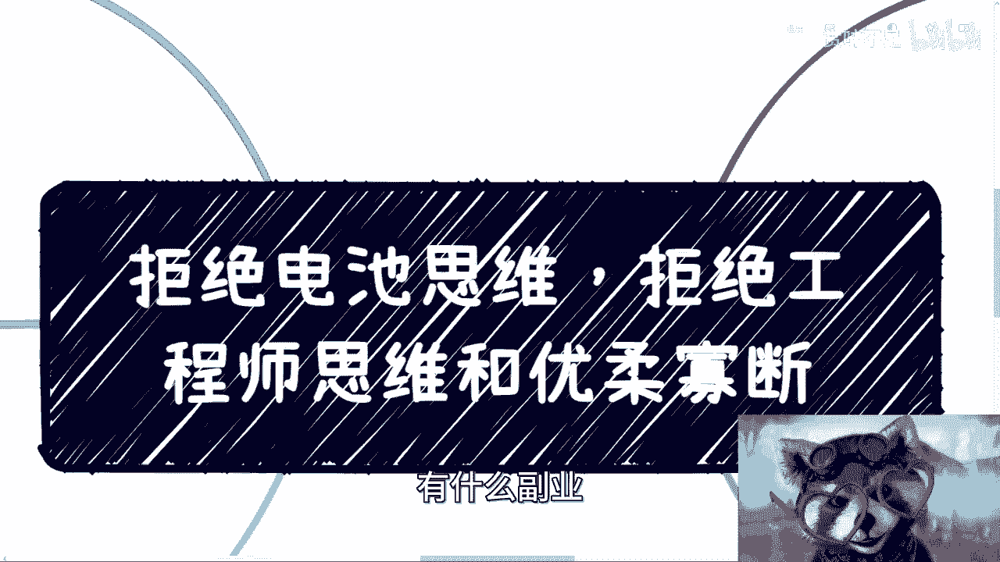

或者有这个对于未来有什么想法的，想找我double check的好吧都可以，反正你们就是列好question list呃，Question list，列好这个背景好吧。

