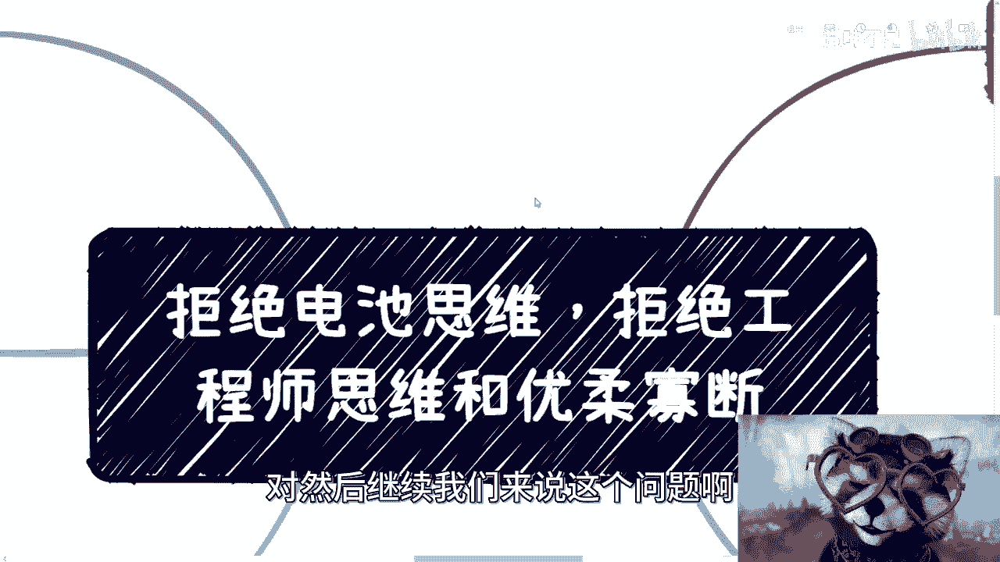
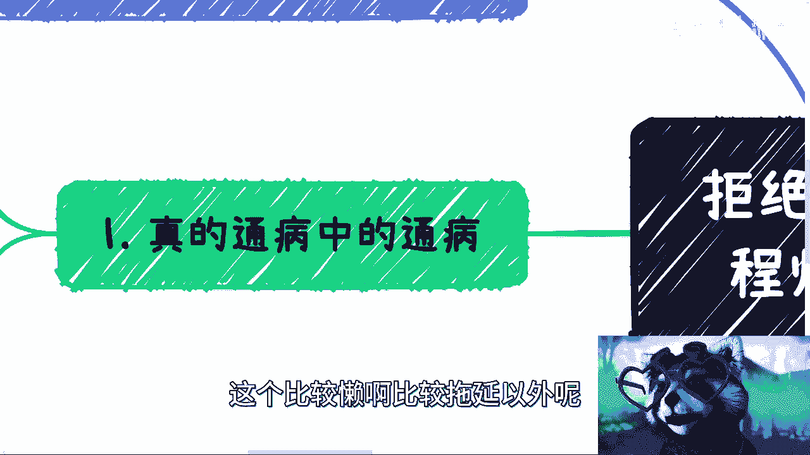
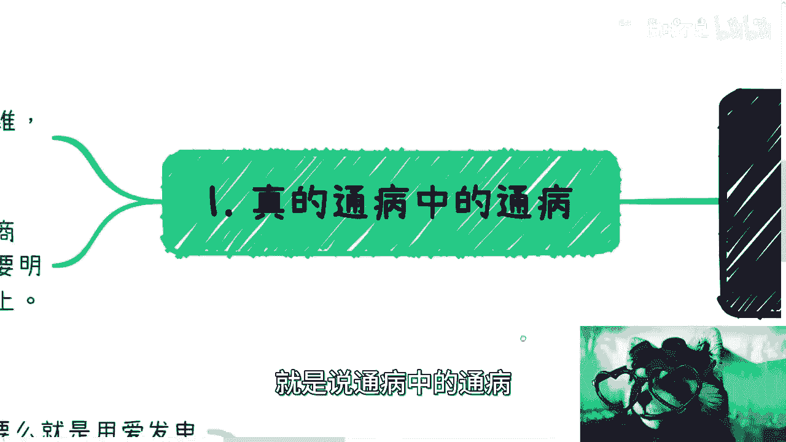
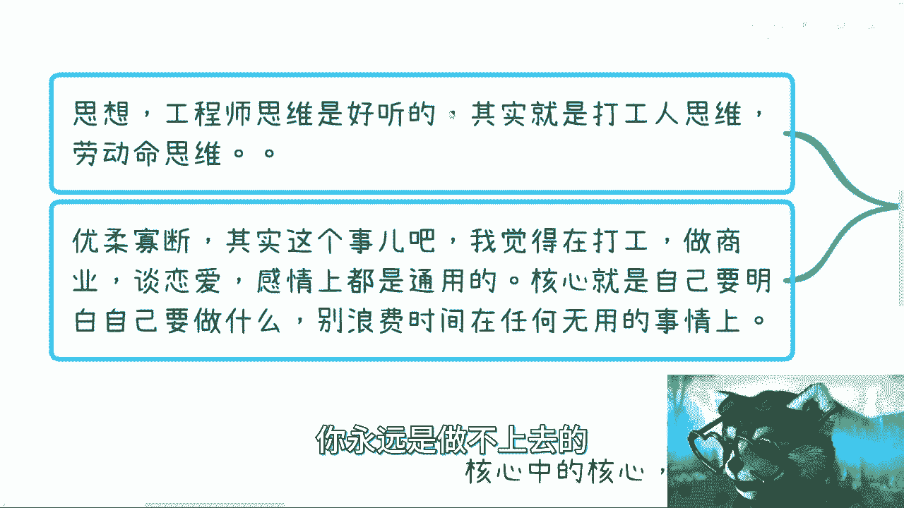
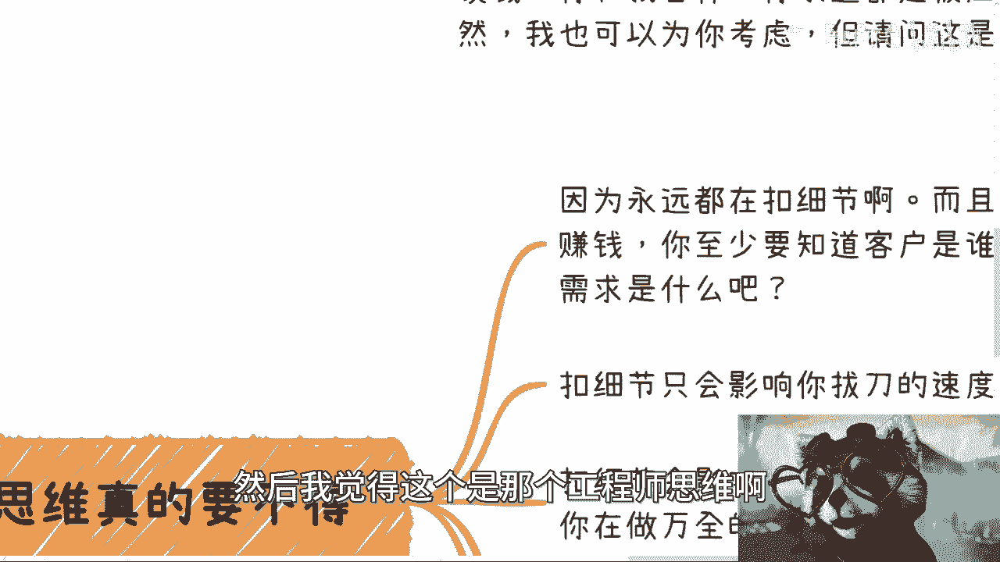
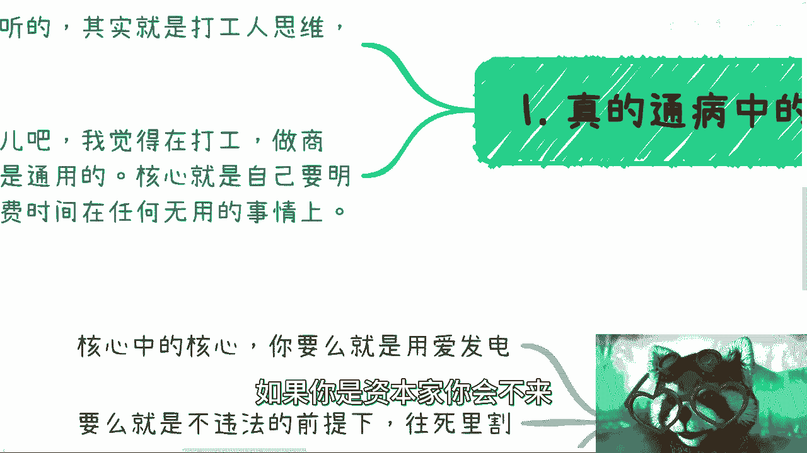
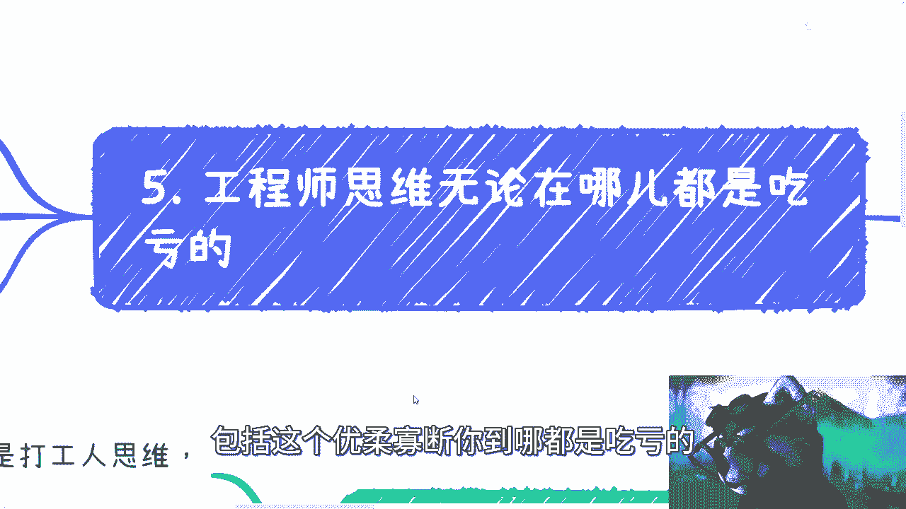
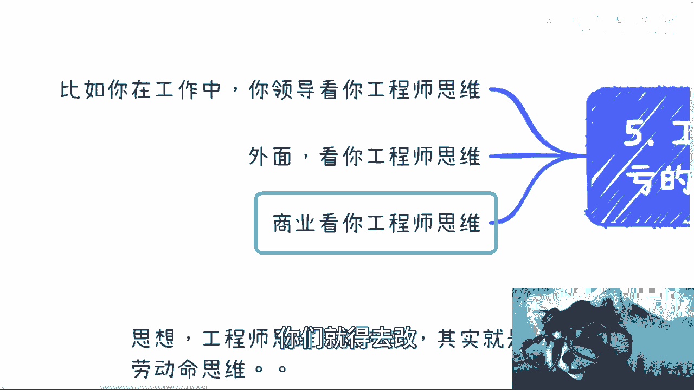

# 拒绝电池思维-拒绝工程师思维和优柔寡断---P1---赏味不足---BV1SV4y1U7h5_not

在本节课中，我们将要学习三种阻碍个人成长与商业成功的常见思维模式：电池思维、工程师思维和优柔寡断。我们将逐一剖析它们的特征、危害，并提供清晰的转变路径。

---

## 概述：问题的核心

许多人除了行动拖延，更根本的问题在于思维模式。这些思维模式是阻碍进步的通病。

电池思维，或称打工人思维、劳动命思维，是第一种需要警惕的模式。工程师思维是其一种较为“好听”的表达。第二种则是优柔寡断。

无论是在工作、商业还是感情中，核心原则是相同的：必须明确自己要做什么，避免将时间浪费在任何无用的事情上。

你需要建立一种持续的自我反问机制。这个机制的关键在于审视你的每一个行为：**一、你是否在成长？二、你是否在赚钱？** 如果两者皆否，那么你就是在浪费时间。若你的目标是脱离“电池”身份并赚钱，就必须改变这两种思维。

---

## 第一部分：剖析工程师思维 🔧

上一节我们概述了核心问题，本节中我们来看看第一种具体思维：工程师思维。

工程师思维的本质是，面对任何事情时，首先且主要思考“如何做”。这包括如何落地、如何执行以及考虑所有细节。这种思维模式与我们的教育体系密切相关。从义务教育到更高阶的教育（如MBA），大部分教育教导我们如何做好一件事，而非如何赚钱。它们可能传授产业链或行业运作逻辑，但很少直接教授盈利方法。

因此，工程师思维有两个直接表现：
1.  过度关注细节。
2.  思考问题时从不考虑如何赚钱。

许多人声称想赚钱，但在具体思考问题时，却从不将“如何赚钱”、“如何变现”作为核心。例如，决定做跨境电商、直播带货或自媒体时，只考虑“做”这件事本身，而非其盈利模式。这种思维已根深蒂固。

更严重的是，有些人会以此自我安慰，声称自己不擅长思考商业和赚钱，只擅长工程落地和解决方案。这在商业合作中将使你处于绝对劣势。如果你不谈钱、不懂定价，那么掌握资源的一方（例如，合作方）就可能以极低的成本（例如，3万元）利用你的劳动完成一个高价值项目（例如，30万元），而你甚至可能心存感激。在当下的市场环境和人性面前，期待商业伙伴主动为你考虑是不现实的。

### 工程师思维的三大危害

以下是工程师思维带来的具体问题：

1.  **陷入自我臆想的细节**：你思考的细节往往是脱离实际的YY。许多人批评他人不接地气，但自身同样如此。赚钱需要了解真实客户、用户画像和需求，而非空想细节。
2.  **浪费时间和机会**：扣细节只会影响你行动的速度。商业机会的窗口期往往很短，在细节上纠缠会让你错失良机。你认为自己考虑周全，但若赚不到钱，一切毫无意义。
3.  **难以自我察觉，阻碍有效学习**：这是一种潜移默化的思维，很多人无法感知。这导致他们即使寻求帮助（如咨询），也问不到点子上，浪费资源和时间。例如，花费金钱请客吃饭，却问不出关键问题，这等同于将钱扔进水里。

### 如何改变工程师思维？

改变不能依靠抱怨、看书、看视频、冥想或空想。唯一的方法是**迈出第一步，真正参与商业实践**。无论是做产品、提供商业服务还是尝试变现，只有通过实践，你才能切身体会到自己的思维与商业思维的本质区别，从而跳出自我世界。

---

## 第二部分：克服优柔寡断 ⚖️

分析了工程师思维的局限后，我们来看另一个致命问题：优柔寡断。

优柔寡断的核心在于，你无法在两种极端状态中做出清晰选择，从而陷入内耗。你必须二选一：

*   **选项A：用爱发电**。彻底放弃对赚钱的执念和内耗，纯粹思考如何做好产品、服务他人。即使没有物质回报，也能从中获得快乐。
*   **选项B：在合法合规前提下，追求利润最大化**。商业思维要求你评估市场、受众和利润。例如，销售GPT账号时，不应只考虑“卖一个是一个”而定低价（如20元）。而应研究市场均价（如4000元），然后制定有竞争力的价格（如3700元）。不要顾虑“技术含量不高”、“被人骂”等问题。你的目标是赚钱。

**关键在于，你必须选择A或B。若徘徊在中间状态，结果就是既赚不到钱，又持续内耗。**

有些人会以“道德准则高”、“有底线”为由，却又抱怨赚不到钱、精神抑郁。问题出在自己身上。商业的本质是残酷和现实的。成功的企业在早期发展阶段，往往经历过严峻的竞争和压力。在商业环境中，对竞争对手或市场环境的过度“仁慈”，有时可能意味着对自己的残忍。企业家若无法生存，就无法保障员工。你需要进行换位思考。

---

## 第三部分：综合影响与改变之道 🎯

了解了两种独立思维的问题后，我们来看看它们的共同危害及根本的解决之道。

### 工程师思维与优柔寡断的普遍危害

这两种思维模式不仅影响商业，也让你在工作和社交中处处吃亏。

1.  **在职场上**：拥有工程师思维的员工可能是一个优秀的执行者，能获得好的绩效评价（`KPI = 优`）。但正因为其思维局限性，通常不会被提拔至管理岗位或承担更核心的职责。格局决定位置。
2.  **在社交与合作中**：外界通过短暂交流就能判断你的思维模式。别人会根据你的谈吐和思考问题的方式，判断你是“工程师思维”还是“商业/格局思维”。即使你聪明，但若是工程师思维，他人也只会将你视为外包执行者，而非有潜力的合作伙伴。在商业合作中，工程师思维可能导致项目延期、失败，甚至引发纠纷，拖累整个团队。

### 根本的改变方法

改变的前提是做出明确选择，并付诸行动：

1.  **明确选择**：如之前所述，要么选择“用爱发电”（A），要么选择“追求盈利”（B）。没有中间道路。
2.  **从思维到性格的全面转变**：如果选择B（想赚钱），你必须主动改变自己的想法、性格和处事方式。不改变，就无法触及事情的本质，也难以成功。
3.  **通过实践提升认知**：改变不能仅靠阅读或思考。就像读《九阳真经》，悟性（认知）不同，领悟的速度和深度也不同（`领悟效率 = f(认知水平, 实践经验)`）。你需要先积累商业和实践经验，再结合反思，才能实现思维升级。指望通过冥想或观看一个视频就改变几十年教育形成的思维模式，是不可能的。

---

## 总结 📝

本节课中我们一起学习了三种阻碍成功的思维模式：
1.  **电池思维/工程师思维**：表现为过度关注执行细节、忽视盈利本质，导致浪费时间、错失机会，并在合作中处于劣势。
2.  **优柔寡断**：表现为无法在“为爱发电”和“追求利润”间做出极端选择，导致持续内耗和一事无成。

核心解决之道是：**首先，明确你的目标是A（不求回报）还是B（追求盈利）。如果选择B，则必须通过真实的商业实践迈出第一步，在实践中颠覆旧有思维，积累认知，最终实现从“执行者”到“思考者”的转变。** 改变始于一个清晰的选择和一次果断的行动。