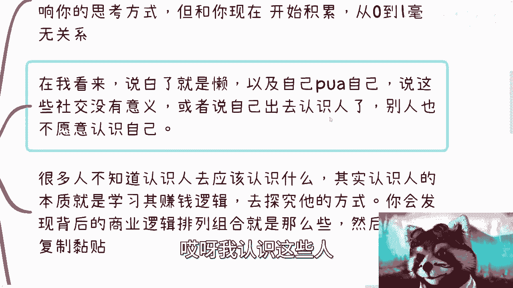

# 拒绝电池思维，没有钱是不是束缚我们的唯一原因？ - P1 - 赏味不足 - BV16h4y147LJ

好好大家好啊，今天礼拜天是吧啊，我这个正好从华师大刚回来，好今天继续啊，我还是把这个口号喊出来对吧，就是拒绝电池思想啊，呃跟上次不一样对吧，我觉得很多人觉得有误会啊，不是说大家不能做电池对吧。

谁都是电池无所谓啊，但是我们做什么不重要，我们得要有清醒的认知啊，不要有这种思想对吧，那么这一期呢就前两天评论区有人说的啊，就是说这个很多事情都是钱的问题啊，我来谈一下这个事情。

首先啊是不是说没有钱或者来说比较拮据啊，是束缚我们唯一的原因对吧，好，首先第一点啊，我再强调一下这个获取信息啊。

获取信息，获取信息是这样子的啊，就是我们如果要获取有效的信息。

或者提前获取有效的信息，我总结出来就那么几个，一个是什么企业家，他可能是房地产，它可能是这个电商，它可能是互联网不重要啊，垂直领域的信息。

投资人投资行业的信息对吧，因为基本大家都知道嘛，投资人都比较敏感嘛对吧，就像很多人跟我说什么，自己要是知道互联网走下行，他就不会选这个专业，那我就告诉他，2017年就下行了，但你们不知道。

但是那个时候谁知道，我告诉你们，2017年知道互联网不行的，最最早知道的就两类人，一类政府，一类vc，一类就是投资人，为什么，因为2017年到2017年开始吧，它有非常明显的预兆是什么呢。

就是政府跟投资人已经不愿意投互联网了，这就是个最大的信号，但是你从面上面不知道对吧，甚至到现在才知道，那怎么可能来得及呢。

对不对，那么第三类就是政府或者办政府机构的人员。

对吧，政府信息我跟你讲，结合这三个信息，对我来讲，我根本就不care那些别的有的没的信息，网络上的信息更不要讲了，没有任何意义的对吧，我要去获取，我就找这三类人，而且我多找一些，比如说企业家。

我找五个资本，资本家我找五个对吧，政府我找十个，我就问对吧，然后我管他们讲的真的假的。

我综合下来总归是真的，对不对啊，然后最后就是我跟你讲这三个就够了啊，不认识我跟你讲就是认识你，别老说自己没有信息，也别去老看互联网。

互联网的信息，但凡只要有的都是滞后的，我说不好听点，今天我跟你们讲这些信息也是滞后的。

有什么区别，对不对，那我就算跟你们说数字经济是增量市场，我就算告诉你们，互联网三点是增量市场又怎么样呢，等你们看，我说可能是有一定前瞻性的，但是等你们看到这个视频可能就已经滞后了，谁知道呀。

对不对，而且你从我这边获取没有用的对吧，我毕竟这个给你们信息是有限的。

是不是啊，这是第一个，那么我们接下来说这个核心问题啊。

没有钱是不是核心问题，那我们来看啊，是这样子的，首先你是一个人啊。

什么叫是一个人，就是你所有的行为是可以并行的对吧。

我就说啊，你现在比如缺缺钱，或者你工资低，或者你比较拮据啊，这跟你出去社交这件事情不冲突，你知道吧，就我发现很多人啊，他是一个高材生，我不说高材生吗，他是个大学生，或者说他是一个就说就是很有想法的人。

但是他给我的问题跟他问出来的问题啊，就就有种感觉是什么，就是诶你看啊这个吕老师，我只能a和b当中选一个，我我其实很多时候就不明白，就是很多时候的问题。

这两者不冲突啊，你知道吧，就是就是你说啊，我又想这个自己学习，我又想出去社交，我又想怎么样，那都是这么并行的对吧，你要这么想，你人就一辈子，你活你有精力去学习，你有精力去奋斗，你有精力去闯。

可能就那么十几年甚至几十年对吧，哦你说我就串行的去学啊，我要么今天学习，要么今天社交，那你你能学到个啥，你告诉我是吧，你能学到个啥，那按照这么个说法，我现在还在互联网被骗钱呢，是吧啊。

你说我跟你讲没有钱，本质上是会影响你的思考方式的，就是我以前说过啊，很多人很穷，或者很多人当下就很很急于用钱。

那么他很容易被骗，你知道吧，他很容易就是说看到一个信息呃，就是盲目的去相信他是真实的，然后就被骗，但是这个事情他会影响你的判断，没有错，但是他跟你是不是出去社交没有关系啊对吧，你说你没有没有就没有了。

我你现在开始开始积累了，怎么了怎么样了呢，对不对，从0~1毫无关系啊，我毕业的时候我出去认识人，我一个人都不认识，我也身无分文，我就出去办活动，然后我就跟咖啡馆说，我欠着怎么了呢，这不冲突啊。

哦然后很多人还是觉得哎呀我没有钱对吧，我好像怎么样，我就有种自卑感或者怎么样。

我跟你讲很多东西，还是那句话，外界根本不是这么看你们的，你们都是自己这么看你们自己的，你知道吧，所以说诶我靠，今天为什么直播互动区还有人打卡的，我都没点直播，还能打卡的，就是就是你知道吗。

就很多东西都是自己pua自己对吧，你说你pua你自己说哎呀，这个社交没有意义，pua你自己哎呀，我认识这些人。

这些人也不想认识我，不是你能不能认识你，能不能愿不愿认识你，这不是一个节点的事情，很多事情就是要去踹的嘛，就是要去尝试的嘛，对不对，你就好像你今天如果有个目标哦，你跌倒一次失败一次就不做了。

那不可能的呀，你说对不对，你这就就就是说你当中肯定会有很多的挫折。

这是正常的，但是你连一次都不去愿意做。

然后就说好这件事情没有意义，那你怪谁呢。

要怪你没有钱是吧啊，那然后第三点，很多人不知道应该去认识，应该认识什么对吧，我告诉你啊，你们认识人的本质就是学习其赚钱的逻辑，什么叫赚钱逻辑，就是你比如说你就去问他，你说你你现在是靠什么赚钱呢对吧。

那么你可能得到答案了，比如说是说哎我做快递电商了对吧，我做这个这个叫什么，这个这个这个直播带货的对吧，我做这个软件外包的对吧好，但是这些话都是屁话，你知道吧，你不需要知道这些，你要知道的是，你去问他。

你做软那个软件外包，你做幻境电商，那你到底背后你是有什么样的商业逻辑，为什么这件事情你能做，别人不能做，或者这点钱是你能赚到，不是赚到别人口袋里的，你们要去明白这件事情，你知道吧。

然后你会发现他背后一定是有很多，不是表面上就能够聊得出来的东西的，所以说这些事情就是你得循序渐进嘛对吧，不是说你一开始说啊，我就认识一次，他妈的屁都没跟我讲是吧，那他妈很正常。

人家为什么第一次见面就跟你讲呢，对不对是吧，就我就觉得就是很多人三四十岁了，就搞得跟三四岁一样，你知道吧，哎我就跟你们说啊，你会发现背后的商业逻辑排列组合就那么些，你知道吧，就是你有可能认识1万个人。

但是你会发现背后排列组合的商业逻辑，就那么20种。

然后你想看你能干嘛，那不是很简单吗，既然他们都是成功的案例，那我就去ctrl c ctrl v啊对吧，我不需要去创新，我不需要我在商业模式上面。

只要造轮子就可以了，因为商业逻辑是什么东西，商业逻辑是经过了验证能够赚钱的，别人如果能赚，那你也肯定能赚，只不过就是赚多赚少的问题，对不对，那一种商业逻辑走不通就走，另外一种怎么了呢，对不对是啊。

所以你跟我说，你说啊这个核心逻辑是钱对吧，我跟你讲，你要是这么讲啊，我就告诉你钱永远是问题，你没个头的，没有投的呀，有抵不了没底的呀，对不对，我跟你说，这不是永远都就是这。

是不是说我们永远思考过这个问题，然后就不走出这第一步，你想想看有意义，本来没有意义的呀，啊，我就发现有很多人就朋友，朋友圈评论区那么一说啊，就说哎呀对吧，这个我们现在温饱都活不下去啊，我们没有钱。

我们不考虑这个问题，那怎么改变，哥哥们啊，姐姐们，对不对，你这不是就是就是自己在那边，就是跟自己过不去嘛，有意外了没有，这是就是死，你明知道这是个死循环。

你还往里面钻对吧，然后还要抱怨外界对吧，跟你说的人唉，他妈的没有意义的。

你们跟我讲都没有意义的，是的是的没有意义，没什么好说的是吧啊，然后还有呢第三点就是关于钱和薪资的问题啊。

就我看到一些小伙伴说呢，他说我薪资高了，我就躺平了啊，他说我跟你讲啊，我跟你讲不可能，为什么，因为人啊，你们但凡对人有认知，你就会发现人一定是会改变的，无论你现在是怎么样子的啊，人是会膨胀的。

人是会炫耀的，人是会攀比的，这才叫冤，不会这些，你就当当和尚去了啊。

明白吧啊你的欲望跟你的收入永远是成正比的，你知道吧，而且这种欲望你往往是没有感觉的。

因为你那个时候很上头，而且钱花起来，我跟你讲其实是很快的，我这里这里是写错了啊对吧，其实是很快的，你可以去投资，你可以去浪对吧，你可以去亏你，而且你可以用各种方式花样去亏，你知道吗。

你知道在我们行业有一句话怎么说来着，道叫做你凭运气赚的钱，都会凭实力亏回去。

就这么简单，你懂吗，因为你对太多很多人对太多东西没有认知，所以他就会亏，但是那个时候他已经没有感觉了，为什么，因为你膨胀了，你知道吧，所以说我跟你讲本质的核心问题在哪里，在你的薪资相对高的时候。

那么你其实要考虑的不是说哎呀，我就躺平了也好，或者我就出去挥霍也好，不是的，你得考虑的是什么，你但凡有脑子的人，他就会考虑的说，我抗风险能力一定要对你的加强，因为什么，因为你的薪资高了。

意味着你的很多消费，你的家庭，你的很多东西都上去了对吧，那我就问嘛，万一失业了，万一你生病了，万一你比如说暂时的失去，失去了你工作的时间或者能力，问，那我请问你怎么办嘛，你总不能到处说怨天尤人。

卧槽我哎呀，我到上面水滴筹水滴筹了对吧，我这个天塌下来了，那怪谁啊，真的我跟你讲，有很多时候我跟你们说啊，我现在越来越觉得可怜之人必有可恨之处，你知道吧，就这么简单，你不能说你顺的时候，你就在那边。

哎呀，我牛逼对吧，我浪的很对吧，然后一下子不行的时候，哎呀我可怜的很，哎呀，我怎么我这个不行，大家帮帮我对吧，我跟你讲啊，很多时候都是要自己去做的，不管是主要的计划或者是备选方案，这都是自己要做的。

没有人天生欠你的，你说是不是包括你爸妈是吧。

你然后第四个你比如说所以我在评论区也说了。

我说思想才是最重要的，为什么呢，你看啊几个事情啊，一个是你得客观的认清楚自己对吧，你别老是去说，或者老师告诉自己，哎呀这些问题我知道的对吧，这个问题我自己有什么毛病，我也清楚的，不用你跟我逼逼对吧。

我改不了的，那你自己都这么讲了。

那那那那那指望啥呢，我就问你自生自灭不好了，你说是吧，就是哦你自己认清楚了，然后又铁板上钉钉，说我改不了了，然后还怨天尤人，每天抱怨，那你你要干嘛呢，到底对不对，那除了在网上充斥着一些利器以外。

还还能干嘛对吧，这是第一个。

第二个就是说你别去老想那些不确定的事情，你知道吗，就比如说你说我有个朋友怎么样怎么样，我有个朋友很牛逼对吧，比如说我今天去了一个很好的公司，我有一个很好的offer，为什么这些事情都不确定。

因为你今天去一个很好的公司，跟你拿到一个很好的offer又怎么样呢，因为这些事情你你的确ok你的能力得到了确定，你的能力得到了认可，但是也保不准你明天就失业了，因为不是你能控制点，对味了啊。

老板说你是爷，你敢不吃吗啊，你敢跟他pk，这跟你有什么关系啊，对不对，所以就是说很多事情啊是这样子的，好也好不好也好，我们得客观的看待他，就是你我就这么说，你可以高兴，你说我去吃一顿肯德基。

我去吃顿好的，这都没问题，而且你无论啊，我就说你表面上怎么去表现出来，你的心里一定要明白自己几斤几两，自己做成一件事情到底是因为运气原因，还是因为天时地利人和，还是因为自己到底在这当中摸到了什么门道。

你明白吗，就是我给你们举个例子啊，这就好像我我就这么跟你们说，比如说我说数字经济是未来的一个发展方向，我现在在b站，在其他地方我也都会讲数字经济，你们想想看，我为什么这么的。

肯定说我今天做的这些事情虽然不赚钱，但是我能够相信在1年半2年后，3年后我能赚到钱，你们想想看为什么对吧，就这是因为我在上一个时代，我有完整的一个经验，我有完整的从他鼎盛时期到衰败时期过程当中。

我知道从哪些口子能赚到钱，我走过这些路，所以我很清楚这个路应该怎么走对吧，因为这些事情不管趋势好不好，我都会肯定，因为这些事情跟整个趋势好坏没有关系，它只是一个每一个时代，每一个风口。

或者来说每一个不同的东西的一个发展方向，因为以就是所有的你比如说正正政府口，企业口或者说高校口或者个人口，很多东西你会发现它的逻辑是一样的，只不过它子弹不一样对吧。

换的弹药不一样，对不对。

好，那么最后一个啊，我们说啊这是这句话，我跟你讲真的，这句话你们能能想明白，最好就是你们考虑任何问题的时候啊，别老觉得老觉得老觉得觉得没有用，你明白吧，就是你要买，就是你可以说你觉得好没问题啊。

这个话你说啊没问题啊，你要么就是回头私下里你去找数据，用数据说话，你要么就自己去探索，去考证。

怎么探索怎么考证呢，那看我这边写的企业家投资人政府。

对不对，你是考证啊，哦你既没有数据支撑，也不考证，你老师那边觉得觉得觉得我没有用，你知道吗，就因为我现在过渡下来，我发现大部分人都觉得是没有意义的，而且大部分人觉得是错误的。

然后你们用一直用一种错误的认知，来引导自己前进，是怎么会在一个正确的道路上面，你们想想看，对不对。

真的我跟你们讲啊，这个这个但凡咨询过我的人啊，其实我觉得他们自己也会明白的，就是我有时候真的他们说到一半我就打断了，我说你别老觉得你觉得有什么用啊，你要么拿出证据，你没证据，不要觉得对吧。

包括包括你们其实跟我聊过程当中，你们也会发现我一直跟你们讲的，别来跟我说他妈的赚了多少钱，我不关心的，因为什么，因为你只要不是跟我签合同，我只要看不到你账户流水，赚几个亿，几十个亿跟我有什么关系啊。

这我来看你都是吹吹水，有什么区别的，是不是，当然你们也可以认为我在吹谁无所谓，但是我讲的东西你们可以自己去考证，你们可以自己去思考对吧，至于你说哎呀这个人赚多少钱，这个人这个人好像哎呀做做的很好怎么样。

这个内心好像有一丝羡慕的吧，我没有，为什么，因为我甚至都不觉得他是真的，who care该谁care，谁care，跟我没有关系，就是你会发现我心中没有任何一丝波动，为什么。

因为我从来不会觉得这些是真的眼见为实，我他妈看都没看到，为什么是这样，对不对，哎呀反正就这么回事啊，呃这个感谢今天对吧，这个要线下来到华师大啊，这个这个面积的小伙伴啊，我觉得还是特别开心的呃。

然后另外一方面呢就是说一样的啊，就是呃大家在上海的呢，你们可以线下找我，我觉得也蛮好的啊，然后不在上海的呢，你们可以总结好这个question list对吧，就这个问题的列表发给我好吧。

然后我们这个加个微信来约这个咨询的时间，好吧，就是关于主业副业啊，这个创业对吧，各种各样的，反正就是得把问题列清楚啊，包括职业规划，当然了，这个包括如果有些小伙伴就觉得哎呀，我对整个趋势不太了解。

对整个整个发展不太了解，也没关系啊，也可以聊，反正就是走正常的咨询流程就可以了，好吧行，就这么着啊，我没被警察带走好吧。

