# 拒绝电池思维——为什么现在”那么“的卷，国内外一样么？ - P1 - 赏味不足 - BV1Do4y1N78Y

好啊大家好，今天礼拜四是吧，疯狂星期四啊，VIVO50是吧啊这个，这两天啊这个评论区啊还是有蛮多的，这个问题提到了卷啊，提到了现在的现状，提到了海内外是吧，今天呢这个抛出来的是个问题，是这样子的啊。

我说的这个问题呢叫做为什么会这么卷啊，国内外是不是一样对吧，这是这个卷的问题啊，但是个问题呢是这样子的，呃我在这个地方强调一下啊，我觉得从我的认知来讲呢，我觉得卷是必然的，但是我的问题是为什么这么卷好。

那么首先第一个啊。

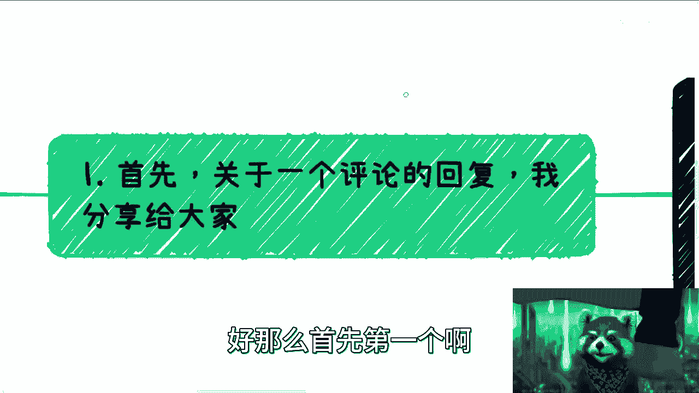

首先关于一个评论的回复啊，我得去share给大家是什么呢，就是说大家一定要明白啊，我们做什么根本改变不了大环境，这句话是对的啊，毫无疑问啊，但是我们并不需要去改变大环境，我们要做的是从现在开始积累。

从现在开始不受环境影响，不要去受短视频影响，不要受周围的人的影响，自己给你自己做好规划，不要每天PV你自己说自己是个普通人，然后就这样一天一天过去了，这件事情毫无意义，你知道吗。

我不管你现在是读本科还是要去考研，还要怎么样子，没有任何意义，这件事情啊，你单纯所有做的东西都是这个世界，都是一些就是说流程上的东西，就像我问很多人，你去考研，然后呢你考研能直接变现吗，不能啊对吧。

你跟我说你先去做什么，我就问你能不能直接变现，跟我说考一个证能不能直接变现，不能啊，所以这件事对我们没有意义，有意义的是你要去探究你到底怎么才能变现，怎么才能赚钱对吧，这就好像你如果想出来说唉。

我今天考了个研，这个数考出来之后对吧，我因为这个数我能够有哪些渠道，直接能够赚到钱，如果没有，我就赚不到，你的逻辑，如果清晰了，那你就去读，如果没有，你就在浪费时间，就这么简单的事情。

你明白吧啊所以说我们不要想着去改变什么，我们什么都改变不了，我们只能改变的只有我们自己对吧，在这世界上找到一个自己能赚钱，我不管是摆摊也好，这个修修东西也好，怎么样也好，不重要啊，不重要。

我们不要去分369等，没有任何意义，因为我们就是老百姓，没什么好分的，对不对，好，第二天不会因为别人看不惯你，或者举报你而被开除的，这种赚钱的一亩三分地，属于你自己的就可以了，这就是我们现在要做的好吧。

所有的什么打工也好，考研也好，什么干嘛，乱七八糟鸟毛玩意儿好，不要去问这些问题，有意义没有意义，你明白吗啊就思维哦，要打开啊，思维对吧啊，这是第一个就是我要去强调的一个问题啊，看一下微信啊。

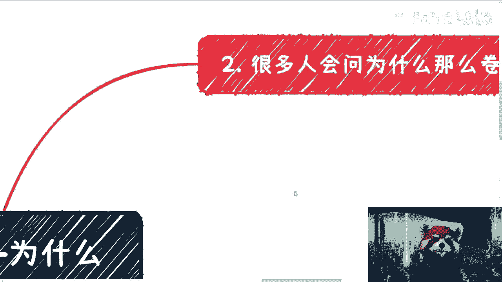

好吧，然后嗯很多人问呢，为什么会这么卷，对吧好，首先是这样子的。

首先呢我会觉得啊，社会本来就这样子，世界也本来就这样子。

只要是经济导向呃，资本导向，就资本导向，市场其实都是这样子的啊，我跟你讲这个事情全球都一样啊，全球一盘棋没什么区别的，你跟我说哪个地方不是这样子的，那那那基本上是不可能的，因为否则的话就是这件事情。

不符合整个资本市场的一个发展，不符合一个主权化国家的发展。

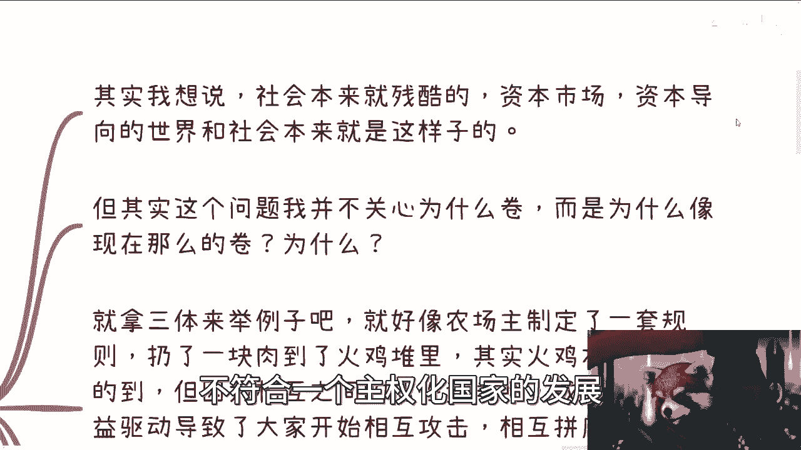

你知道吧，所以说本身他就这样子，但是问题是什么，就像我一开始说的，我并不关心为什么会卷，因为卷很正常对吧，人类本性就这样子，必然是卷的，但是为什么像现在这么卷啊，这个我觉得其实是有不正常的地方啊。

那么我跟你们说，首先就拿三体来举个例子啊，三体里面有提到过对吧，有农场主有一火鸡对吧，在我感觉里面，这就好像什么，这就好像农场主制定了一套规则啊，然后呢他朝着火鸡堆里面扔了一块肉啊，肉扔了一个吃的。

或者你们认为扔了一个任何一个，比如说资源也好，任何一个东西啊，其实这些东西是够所有的火鸡去评分，或者去做分配的啊，但是由于火鸡之间相互之间的这个恶性竞争，或者恶性的利用呃，利益驱使导致大家相互开始攻击。

这也是我为什么一直问大家，我们的敌人到底是谁对吧，我后来或者来说我们的卷到底是谁造成的对吧，然后开始相互攻击，相互拼底线，而不是说去跟农场主商量，或者去跟农场主要更多的东西。

或者来说是大家齐心协力去争取一些，就比如说开辟一些新的一些，就是说获取食物啊，或者去获取资源的方式，而达到共同利益，我不一定说基本盘都共同利益，你比如说有人就要来说了啊，刘老师。

你说他妈中国14亿人都共同利益吗，不可能，但是你至少在一定范围内，比如说你现在找那么两三个人，你要去共同利益都难对吧，这个就是最大的问题啊是吧，所以我跟你们讲，其实每个不同阶层时间都很绝。

你们去看那些家族产业，一个亿的对吧，十个亿的或者那些这个基金对吧，比如说几10亿到几百亿的时间也很卷啊，大家一你也打来打去，也举报来举报去很正常呀，但是问题在哪里呢。

你知道问题在哪里，问题在于上层或者说非底层阶级的那些卷，是赚多赚少或者亏多亏少的问题，但本质上没有影响最最核心的根本问题，也就是说生存，但是老百姓身上就不一样了，在我现在看来。

老百姓身上的卷是直接可以影响到生存的，这是没有办法的啊。

毫无疑问，就就现在就这么一个情况，你知道吗，那么所以说呢就说在我看来，从某种角度就是大家不要以偏概全啊对吧，从某种角度来讲，我觉得现在的卷其实是因为我们自己造成的啊。

或者来说是因为我们这么一个底层的基本盘，造成的，为什么呢，你就这样，好像我去做视频，竟然还会有人来问我为什么要做对吧，那我就要告诉你们，其实像我这样的人很多很多对吧，或者说能够像我这样。

就就我不说能看到多么上面的东西嘛对吧，就能看透一部分东西的人很多很多，但我就问，为什么这些人不愿意去做出自己的改变对吧，为什么不愿意去改变身边的人呢，是因为大家害怕，是因为我们的看我们的看法。

我们的观点，我们的正常在现在这个社会就他妈是不正常的，你知道吗，因为举报无处不在，你们想想看，这是为什么，这种扭曲是处在什么地方，这种扭曲就是处在基本盘里面对吧，我们就说为什么会变这么卷啊。

如果我就说如果大家对吧，都一定范围内的加班，如果大家不相互举报，如果大家都能够正确地看待每一个人，也就每一个人吧，就是比如说买四五十%的，这些人的这个价值产生，会每天在那边大家去卷年龄对吧。

卷薪资卷学历对吧，卷卷这个有的没的会吗，不会的，之所以这么卷，就是因为今天我去想，我去，比如说我去面试，我跟对方说我会什么对吧，我跟对方说我的价值是什么对吧，然后剩下除了我以外。

剩下100个人过去都跟他说，来啊，那个那个谁那个驴老师要1万好，我只要5000，那下面个人我只要4000，那这个工作我也能做啊，这个我晚上多加点班对吧，我可以他妈24小时加班，就这样子呀。

就因为这种无就是就是底层相互之间的攻击，底层相互之间的卷，导致现在这个样子怪谁呢，怪我们自己，我就这么告诉你们，对吧，这才是现实。

好那么有的小伙伴又要跟我说了，他说呃那个评论区前两天也有人说。

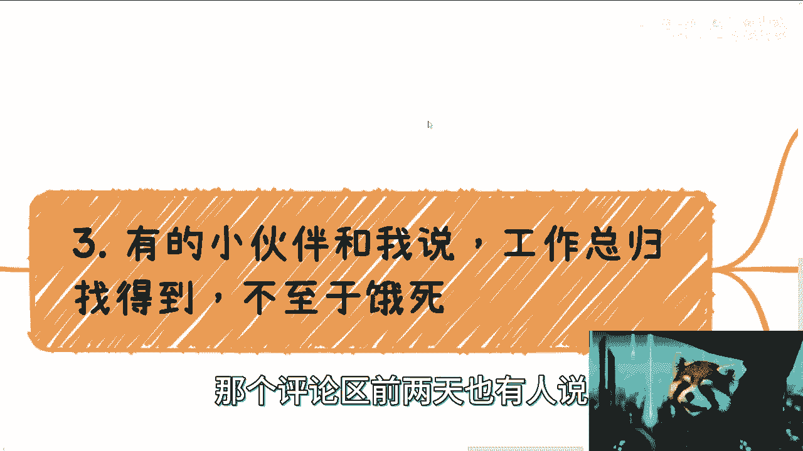

他说工作总归是找得到的，不至于饿死，这句话呢我觉得有点站着说话不腰疼啊，为什么啊，因为首先中国是一个，就是非常多元化的一个国家，也就是说城市与城市之间，省与省之间的差别，比他骂人与猪的差别都大对吧。

那么所以说呢，首先我要告诉你们，工厂现在裁员也很厉害，外卖等各个方面各个东西都很卷啊。

不要站着说话，不要谈自己去问问自己去面试。

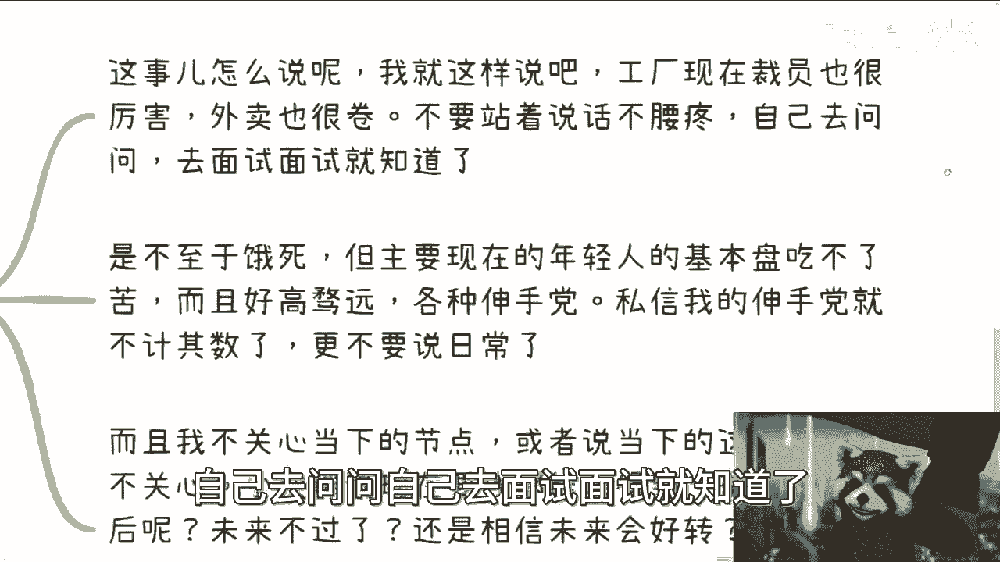

面试就知道了对吧，至于你说是不是饿死，我觉得当下的年轻人基本盘吃不了苦，而且好高骛远，而且啃老，而且各种伸手党，私信我的伸手党就他妈不计其数了，更不要说日常对吧，所以说你说话能不能饿死。

那我就这么跟你讲，你但凡很多人靠自己的，他他妈就可能饿死，为什么，因为他他好高骛远啊对吧，他不愿意去做那些那些他看不起的东西啊对吧，而且他还有父母可以啃，就这么简单，你但凡没有呢，你看看是不是。

而且另外一点从我角度来讲，我根本就不关心当下的节点，我也不关心当下，这些年我都不关心，为什么，因为你说有些小伙伴也说了，他说找工作找不到，对谁找得到呀，我没说找不到呀，对不对。

但问题呢未来呢未来不过了吗，还是说你们相信未来会好转，未来经济会好，这是肯定的，为什么，因为人类社会要发展啊，你不能这样一直往下滚的呀对吧，但是卷是越来越卷的，人口是越来越多的呀。

啊你你们别来说什么哎呀生育率降低，不好意思，生育率降低跟我们有什么关系啊，啊生育率降低跟我们有什么关系，好像能拯救我们一样，是不是对吧，而且你要明白当下当下你们很多人对吧，不去做准备，不去做积累。

就找个工作熬，好像觉得卧槽，我他妈超越了99%的人了，然后呢，你要职业发展没职业发展，要未来竞争力没竞争力，你未来只会被当做电池扔掉，替换掉，有意义的有意义的。

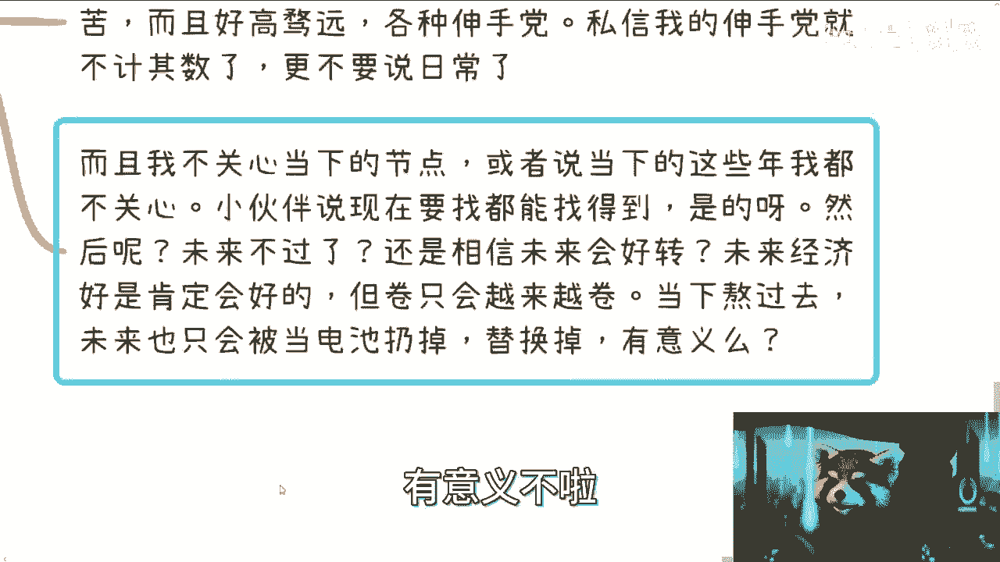

我们这卖要卖的门槛到底是什么，我们要解决问题到底是什么。

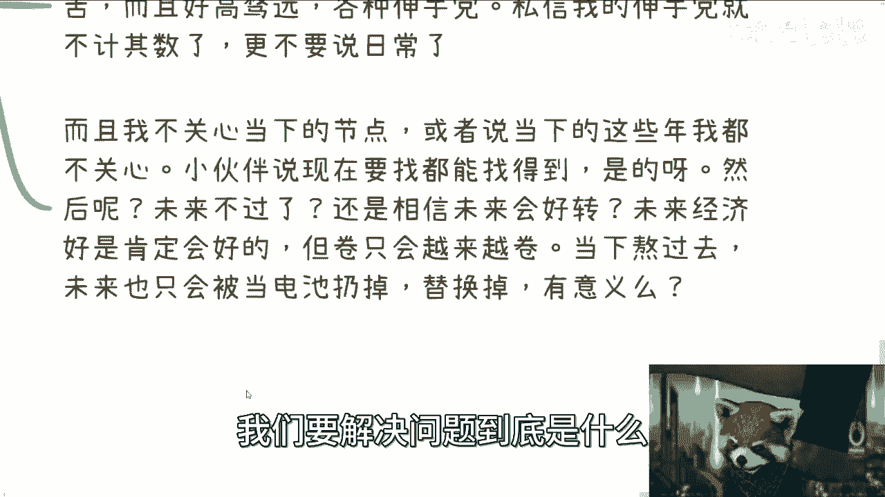

是当下三到5年吗，当然不是，对不对。

好那么第四点啊，我顺便要来提一下35岁这个事情。

好哎呀，这个事情我跟你讲牛逼了，回头我看看是不是单独开一期啊，这事儿呢其实在我看来，年龄呢在未来只会越来越提前，没有办法的，我跟你们讲这个事情在国内就这个样子啊，避无可避的以后呢就是33岁啊。

32岁30岁啊，反正就他妈的，嘿嘿我也不知道怎么讲对吧，就讲了，妈的视频都没了，为什么呢，因为人太多啊，因为太卷，就因为多卷，所以在而且呢另外一方面就像我刚刚说的，大家都在往不应该卷的地方卷对吧。

你拼实力啊，拼价值啊，拼产出啊，不拼了，唉，我拼年龄啊，拼底线啊，拼薪资啊，大家卷呗，看谁卷得过谁，是不是，那很简单啊，那他妈的你年龄越大，你越越没有优势啊，结束了啊，这才叫普通人啊，你别跟我说，卧槽。

我他妈做个管理岗，管理岗，管理岗他妈有几个人对吧，而且另外一方面管理岗，现在你管理岗也有年轻人了呀，也容易被替换掉的，一样的，有什么区别呢，都是电池，何必看不起谁，看不起谁呢。

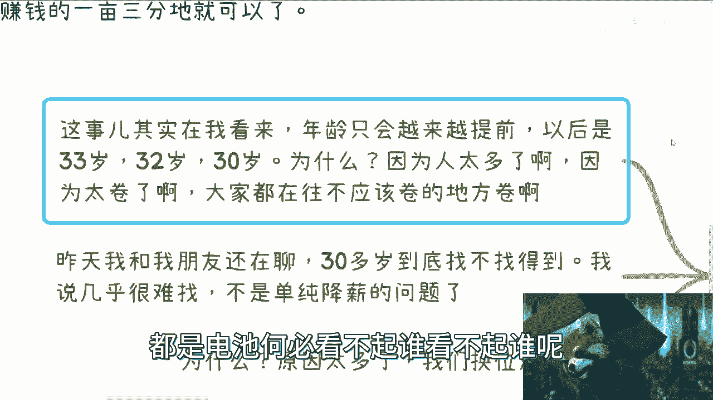

对不对啊，昨天我晚晚上出去吃饭，就就那个微博上，微博上我就是个美食博主对吧，每天晚上出去浪，昨天我跟我朋友还在聊，我说这个30他就问我，他说三十三三十多岁到底能不能找得到，我说几乎很难啊。

而且这不是降薪的问题，为什么，那我在这个地方，我来给你们列啊，就我来给你们他妈直播练，对不对，原因态度，我们换位思考一下啊，如果今天你是资本家，我就问你啊，我就问你，30多岁啊，事啊叫什么叫什么。

使唤不动对了，毫无疑问啊，手腕不动，脸皮厚的呀，基本盘就这样子呀，你有什么好说的了，对不对，第二，薪资低了呢，别人不敢要，为什么我使唤不动啊，谁他妈知道他妈的跟让你做个事情，比如说要做到90分的。

做到60分怎么办，资本家跟你扯皮吧对吧，我就问你，你是老板，你会招这种人吗，你敢吗啊，你当然是多一事不如少一事啊，对不对，好，第二个30多岁啊，事多BB多，对不对啊，一天到晚跟你比比啊，我要加薪啊。

我上有老，下有小，我就问你烦不烦嘛，是企业家，你要你招不招啊啊你同样新资金，你招个应届生不好吗，你同样的新资金，招个应届生，要招个实习生不香吗对吧，你30多岁，然后薪资又要的高啊，然后事儿多逼逼事儿多。

你要不然对不对，是是有那些能力很强的幸存者偏差呀，你相对整个基本盘才他妈几个人啊，对不了，所以说这就是问题啊，但是问题在哪里啊，问题就像我们刚刚说的，这核心问题到底在30多岁人逼事多呢。

还说是30多生一个人使唤不动呢，并不是啊，是因为它的本身的价值没有被正确地看待呀，对吧，这就是为什么我们刚刚说的，就是说这个地方的卷根本就没有港，往该卷的地方卷啊，都在卷的，有些没的。

那人家怎么会买账的，肯定不买账的呀，对不了。

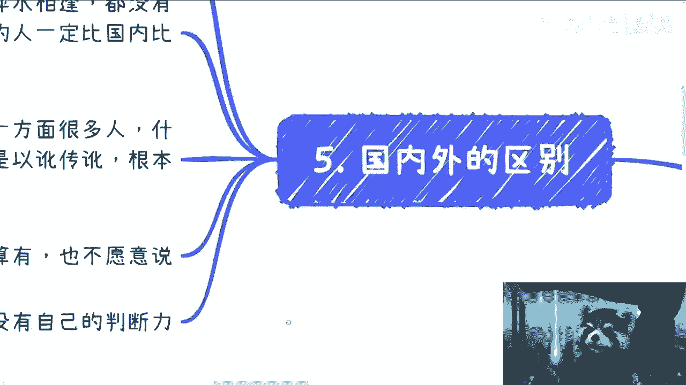

那么第五点我们来说国内外对吧，首先啊不得不承认一点啊，教育跟思维方式的确很不同，而且从小就不同啊。

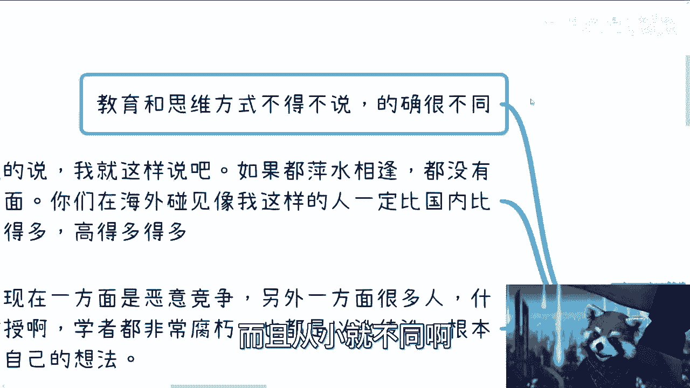

过程当中也很不同，这一点我就还是那句话，大家别杠啊，要承认我们的不足，对不对啊，第一点第二点呢客观的说我就这样讲啊。

所有咨询我的人，我都会跟他们说一句话，我说我跟你们讲的话，我跟你们都不认识对吧，我跟你们就那么一个小时沟通对吧。

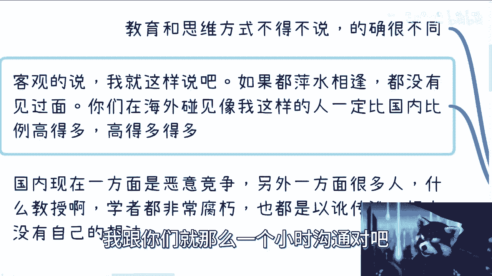

我说大家都是萍水相逢，都没有见过面，你们在海外能碰见，像我这样的愿意跟你们去讲的人，一定会在比国比国内比例高得多，高得多得多得多得多，这他妈就是国内外的区别，你们明白了吧对吧。

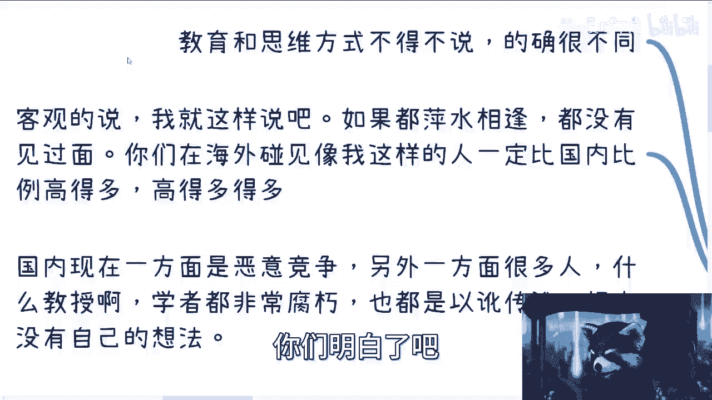

国内现在一方面是什么叫做恶意竞争，另外一方面就是人多。

什么教授啊，学者啊，导师啊，都他妈非常腐朽，我当然我不是说一棒子打死啊，多数都很腐朽，而且商业化很重对吧，一天到晚就想着自己出去怎么爬分啊，上海话爬分爬分意思就是怎么赚外快。

对不对，不忿啊，也就是说以讹传，而且更多的他们的东西是没有自己想法的，很多都是以讹传讹，但是年轻人不懂啊对吧，就容易被忽悠啊对吧。

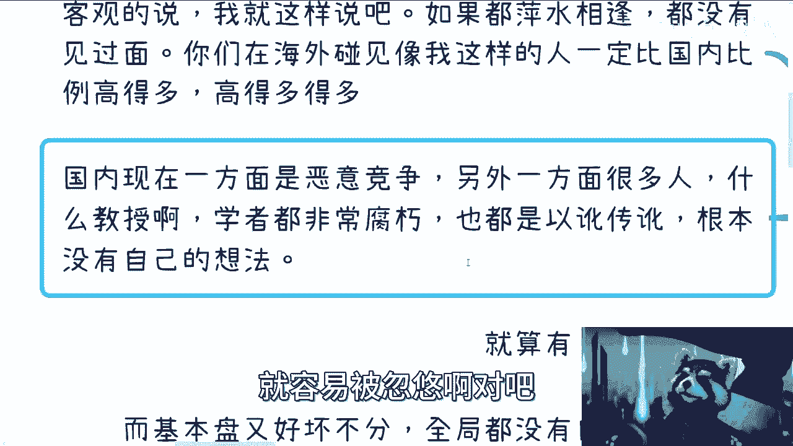

而且就算有的教授，有的学，有的年长的人，他就算明白。

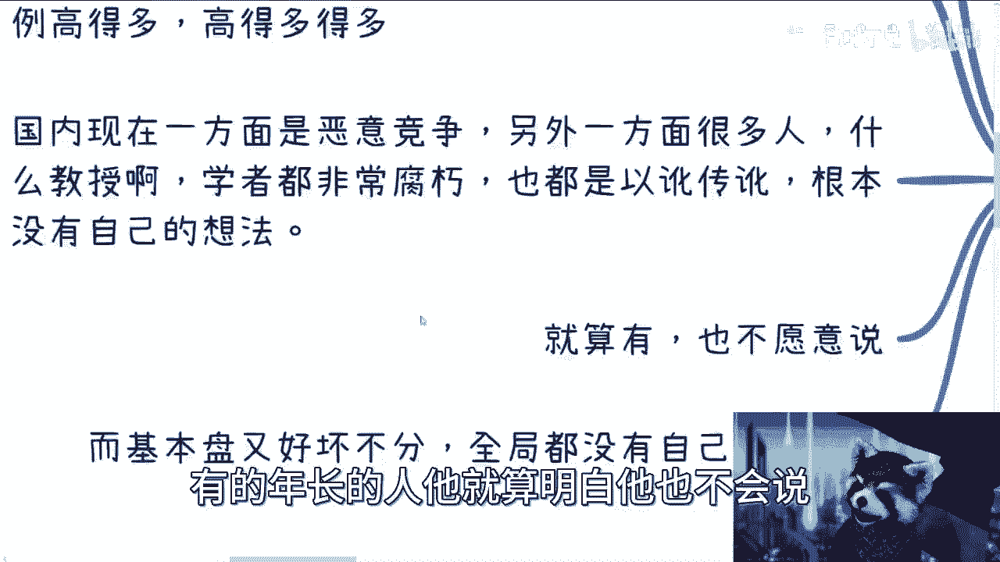

他也不会说为什么呐呐，这不又回到我刚刚这边说的嘛呢。

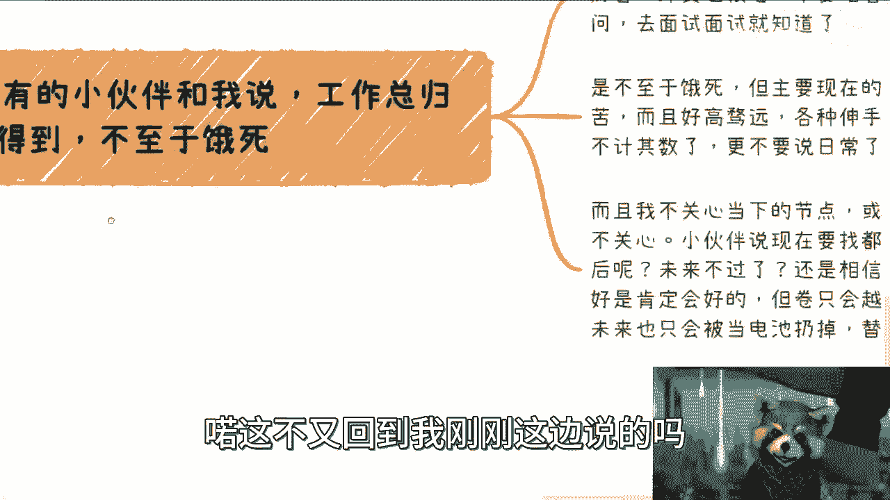

为什么，因为这个世界太扭曲了，因为这个社会太扭曲了对吧。

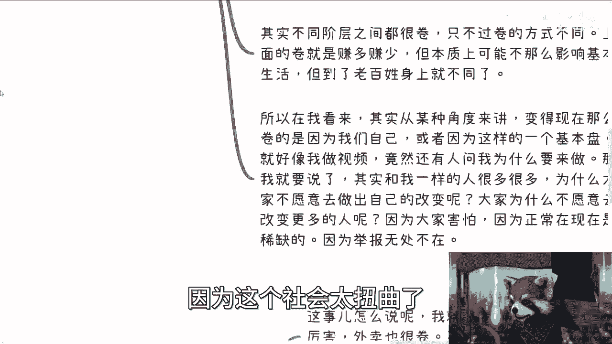

他敢说吗，他不敢对吧，而且现在的基本盘又好坏不分，根本没有自己的判断能力，他妈黑白颠倒，谁敢讲啊，我敢说我的认知，我的各方面的判断已经是很正了，我他妈还要被喷成狗啊，你们想想看，他妈的还有人会来讲吗。

对吧，反而那些营销号对吧啊。

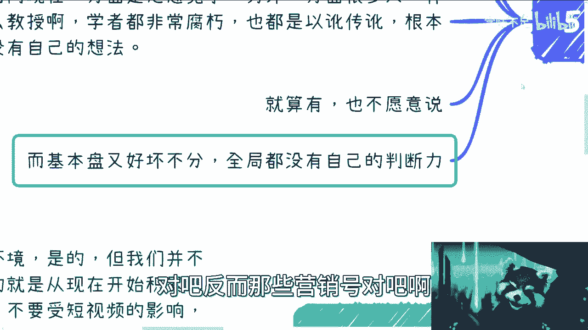

动不动来跟我创业，我的跟我创业。

每个月保大家5000块钱，卧槽你会发现基本盘当当当当在那边交钱，你怎么搞得好呢，怎么搞得好，你告诉我，对了是，所以说回到那个问题，我们改变不了大局，是改变不了，我们也改不了环境，改变不了环境。

我也没想改变，对不啦，但是我从头到尾只告诉大家，就是说自己对自己负责就好了，我们已经被PUA20多年30多年了，别再被他妈的PUA下去了对吧，就这么简单，好吧啊行吧，那就这么着吧。

有任何这个变现或者说赚钱的，或者说副业，这个相关的职业规划，要细节沟通的。