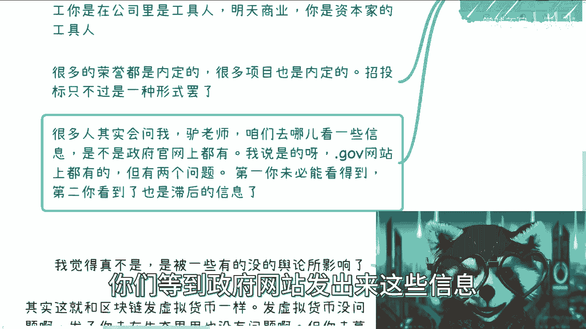
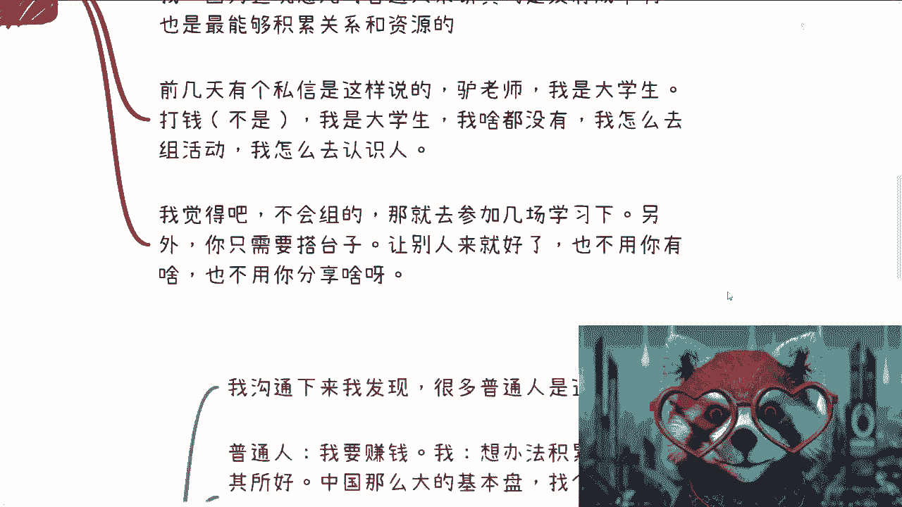
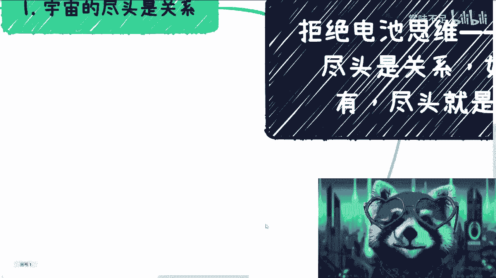
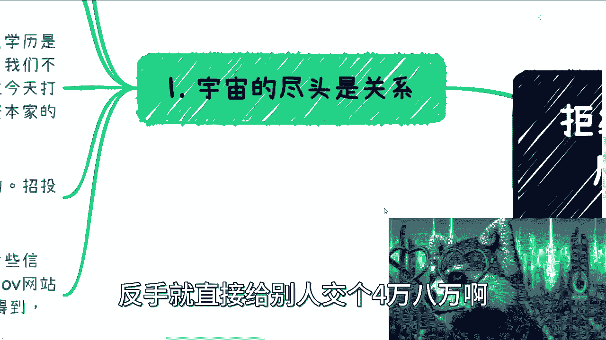

# 拒绝电池思维——宇宙的尽头是关系，如果没有，尽头就是营销 - P1 - 赏味不足 - BV16N41167qi

好啊大家好啊，今天礼拜一是吧，我明天要去杭州，后天要给那个杭州师范啊，然后讲那个课嗯，所以后面几天那个咨询我就都往后排了，反正大家有什么就是我们尽量往那个，但我觉得后面排吧好吧，那这一期呢是这样子的。

因为最近聊下来很多啊，我觉得总结出来就这么一个点，然后这个点呢在所有咨询里面，我也会跟大家提出来是什么呢，就是呃大家一定要明白啊，就宇宙的尽头是关系啊，如果宇宙的尽头你们没有关系啊。

那么这个宇宙的尽头就是营销啊，那可能我说的还是含蓄了一点，就是宇宙的尽头是传销，好吧啊，这个不要看不起人家啊，为什么我的这个小浣熊不是小熊猫，这个眼睛老是闭着呢，老不开心了，好然后我们来看啊。

第一宇宙的尽头是关系对吧，首先呢是这样子的啊，很多我觉得很多小伙伴呢误解了这件事情啊，就是这里的关系并不是仅仅是说什么，很高大上的对吧，比如说政府关系啊，或者什么很很多什么很牛逼的对吧。

怎么样的关系其实并不是啊，就是他很多这种叫做什么，这里的关系，其实本身更多的就是说别人只要有赚钱的机会，你比如说今天啊，我说我这边有一些赚钱的机会对吧，我能想到对吧，找找谁对吧。

找哪些人或者能够和你合作，那就是关系对吧，就是说说白了就是整个的面上面，比如说有14亿人对吧，那么你要做的是什么，就是嗯咱不要把一件事情就一下子想着说哦，我小小的钱我不赚的对吧，我要赚就赚一个亿。

这种都是被p u a出来的，就是说我们要做到的就是说自己的一亩三分地，也就是说自己做一件事情给别人，让别人对自己有一个认知，别人但凡有机会，他能想得到你对吧好，那么这个是一个。

那么第二个呢就是说那个在商业上啊，你懂商业，你懂变现，那么学历这个东西对你来讲就是加分项对吧，就比如说你自我介绍啊，或者你去参加一些校友会啊，或者什么东西，你是加分项，但是否就是如果你不懂商业。

你也不懂变现，因为现在很多人他其实就是不懂商业，不懂变现嘛对吧，所以说无论你是什么什么学历啊，就我身边我看到过的，我接触过的，包括我们在政府啊，在在企业对吧，在高校碰到过的一些大部分啊，我这里就不当了。

不一棒子打死是吧，就是大部分你还是别人的工具人，就是你是整个商业产业链里面的一个环节哦，但是你不是赚钱的那个人，因为你不懂商业，你都你不懂变现，你只能是下游，你不能是上游对吧。

所以说你觉得你这个学历对你有重要嘛，就是对大部分人来讲，你先去卷学历有意义吗，我为什么说没有意义，就是这个道理你知道吗，你就像这两天张雪峰对吧，就上热搜，然后大家说啊，因为要选什么专业，学什么专业对吧。

但是你在我看来，在整个商业层面选什么专业，你做什么方向毫无意义，为什么，因为你不懂变现，你最终还是工具人啊，我不是说你赚不到钱啊，但是你虽然都是辛苦钱，你图什么呢，对不了啊，所以说你要明白一点。

就是但凡你不懂商业，你不懂变现，只不过今天你打工是在工具里呃，在公司里面做工具人，明天你在商业里面，你是资本家的工具人，你没有办法，就是就是站在一个整个商业的这个，产业链的上游对吧。

那那你赚什么钱呢对吧，因为我们什么叫赚钱啊，你今天付出一份努力值1万块，这不叫赚钱，你知道吗，你今天付出一份努努力，其实应该值1万块，但是你拿到10万块，那这叫赚钱啊，那么好，那么很多荣誉呢。

嗯当然这个我也只能提一笔啊，就是很多荣誉呢也都是内定的对吧，很多项目也都是内定的，就你们所看到的招投标只不过是一种形式，你明白吧，包括陪标啊对吧，包括中标啊，包括其他东西都一样的对吧。

就是就大家都要去明白这些这个道理啊，不是说就是因为我也发现很多人来问，我说会说嘛，就说啊我们我们这个要要要要要什么，这个观观观察一些信息对吧，然后去找图标，然后干嘛干嘛，我就说我说你们但凡这么做。

你们就根本就是赚不到钱的对吧，你们可能更像一个陪标的这种感觉，啊那么好那么好，我们再来看啊，就是说很多人问我呢，他说啊吕老师啊，咱们去哪看一些相关的信息对吧，尤其是政府相关的啊，我说对啊。

点government的这个网站上可能都有对吧，但是你你明白吗，就是这当中有两个问题，第一个问题是就government的很多这个网站，它里面的信息非常的杂，你知道吗，就是说你们但凡去看过。

你们就会明白，每一个城市，每一个省省市区的那种网站都很杂，里面信息你未必就能找得到，你除非就是很闲对吧，每天下午花很长时间去找对吧，那这是第一点，第二点是你看到的信息也是滞后的，你明白什么意思吧。

就是说真正的东西该去合作的，该去，比如说找供应商该去怎么样子，第一时间大家线下就去找了，这也是为什么我跟你们说，真正的信息不会在网上的，因为你们等到政府网站发出来。

这些信息其实人家早就已经找到合作方来，跟你没有蛋关系，你知道吧。

哦首先是第一点，第二点是什么呢，就是三个臭皮匠顶一个诸葛亮对吧，这个大家大家大家都懂对吧，但是问题是你会发现啊，其实经过了这段时间我算明白了对吧，因为我是就是嗯三就一直在做嘛。

但是3月份其实就是b站给了我一波流量之后，就大家比如说关关注我嘛对吧，然后我留了这么长，就我跟大家沟通下来这么长时间呢，我就觉得大家也许的确都不是诸葛亮，但是大家也不愿意去认识臭皮匠，你知道吗。

就说这个当中有很多原因啊，就是一方面是很多人他不觉得自己是臭皮匠，他觉得自己是诸葛亮，哼你知道吧，这是第一个，第二个是第二个，就是说他也许觉得他自己是臭皮匠，但是他也不愿意踏出第一步。

去认识别人的臭皮匠对吧，那当然在这个地方，我觉得就是说这个一开始我的确没想明白啊，可能这个的确我太穷了对吧，大家太富有了，没有这么大的驱动力啊，那么第二点呢，就是我呃这个这个这个脑图其实是昨天做的。

所以就不是今天啊，就是说呃我昨天晚上啊，还跟之前咨询过我的一个小伙伴，在聊活动的事情，他的执行力就很强，就已经去了很多活动了，然后再自己总结，再准备自己去攒个局，你知道吧，然后呢我今我昨天也跟他说嘛。

我说我要不是现在有事情忙，比如说各个高校啊对吧，各个政府啊，或者各个的一些这个这个单子啊，要不是说，要不是说我有事情在忙啊，我说我肯定每天办啊，我我我可以每天早上班一个。

下午半个晚上办一个我办的起飞对吧，为什么，因为我至少因为这个玩意对普通人来讲，是真的没有成本对吧，而且是最能够积累关系和资源的，没有就是没有比这个性价比更高的了哦，那么前几天也有私信这样说，他说刘老师。

我是大学生啊，打钱啊，不是吧，他说我是大学生，我啥都没有啊，我怎么去组织活动对吧，然后我怎么去认识人，我跟你讲，我觉得啊你不会组没有关系，你多去参加这场活动，你ctrl c ctrl v。

你会不会对不对，这第一个第二个很我跟你们说，很多的时候你们只需要搭台子，不是说你们就要去分享，你知道吧，就说就说你们不会没有关系的，你让别人来分享好对吧，你一开始稍微装装可怜对吧，就说现在经济不好对吧。

这个我也没钱给大家对吧，我就想大相当于搭个台子给大家这个展露，展露自己的能力对吧，怎么样怎么样，对吧就是就这个事情有什么难度的。

没有难度的呀，我跟你们讲啊对吧。

这第二点第三点，如果你没有关系啊，那么宇宙的终点终点是什么，就是营销呃。

就是传销，你知道吧，我跟你们讲，真的不要看不起传销，不要看不起资金盘，你们但凡去做商业，你们自己去看看真正赚钱的，然后跟别人合作的大部分都是以前的传销盘，跟资金盘有什么关系呢，对不对啊，然后我跟你讲。

我沟通一下啊，我来沟通一下，我发现啊，我说我很多普通人是这样子的啊，普通人跟我说呢，他说我要赚钱啊，我他说我说我我跟他怎么说，我说你想办法激烈流量对吧，你要去投其所好啊，不要说你不要去看你会什么。

你要去看别人要什么，对不对啊，然后我说中国这么大的基本盘，找个切入点去积累流量，几年后哪怕是一坨屎，你也是能赚到钱的，对吧好，然后普通人会怎么跟我说呢，all对吧，然后括号他心里面os就是不太行哦。

做不了啊，那为什么做不了呢，其实很多人对所谓的自媒体或者粉丝经济，是排斥的，你知道吧，这个问题就是说就是说很多人他并不了解，但是他以讹传讹，道听途说，他就觉得诶好像叫自媒体的，都是这个贬义词对吧。

就是粉丝经济都是割韭菜对吧，好也没有付出啊，但是你要明白啊，就是我为什么一直跟大家说这件事情，是因为这个事情除了办活动以外，也的确对普通人来讲是没有门槛的，也没有任何付出金钱的方式，对不对，然后呢。

我跟你们说，我姨曾经1度不支持大家去做自媒体的，原因是什么，是因为很多人去做，他根本做不到投其所好啊对吧，我跟你们说了，我说你们要你们真的要去做自媒体，你们就要去贴合别人的焦虑对吧。

你们要去贴合用户的东西啊，你不贴合用户，你自己在那边说啊，我会什么，你会什么，别人他妈鬼他妈管你啊，对不对，然后就闷头做，或者就是直接他自己说我要做了，对吧好，怎么办呢，他先付钱去当别人的韭菜。

那你说说看，从我角度来讲，我怎么会支持你们去做呢，对吧哦，到时候我支持你们做了，你们回头做了三个月，阿刘老师说的，这做作业很好的，怎么我我一点起色都没有的，那么屁话，对不对啊，所以我跟你讲赚钱这个事情。

无论是to see个人，to b企业去继政府都是离不开营销的，你不会营销，你咋赚钱，你跟我说，现在市面上你看到任何一个什么新东方啊，就这个原题库啊对吧，这个什么乱七八糟的，哪个不营销啊。

啊哪家公司每1年我跟你讲，很多公司每1年最大的费用就在营销上面啊，不营销怎么赚钱啊，对不对，两周前我跟你讲，我朋友去参加了一个活动对吧，就是真的有大冤种啊，大冤种就是几个呃，那个活动是什么呢。

就是弄了几个开源项目啊，拼起来做了一个产品的一个培训啊，两天200个人，一个人2万，不开心吗，我就问你们不开心吗，对吧啊，那么问题来了，这是普通能做吗，能吗，我就问你们这是有什么难，有什么门槛吗。

啊是有什么造火箭，你造不出来有什么材料，你没有什么元素，你没有吧，那没有呀，对不对，你不过就是找一些老师对吧，包装包装，然后找个传销盘，或者找个培训公司给你做做做，做渠道分销不就结束了吗，难的难在哪。

你告诉我对吧，你就跟我讲的是难在我不认识这些人，那你去认识啊，对不对啦啊，我不相信我不相信一个普通人在那边说哦，你连续参加了，比如说两三个月的活动，你你这样这种人，你有针对性的去认识这些人。

然后你要去传个局，传不出来吗，这不可能的呀，你就不想传，你就不想动。

你知道吧，对吧。

这个是三四对吧，就在这个地方要说了，是不是长沙的关系，我跟你们讲过，我仔细想了一想啊，我觉得真不是为什么呢，我跟长沙没有关系，最终还是跟我跟你们讲的，给我就是被那些网络上有的没的，那些舆论所影响的。

其实这个就跟我前两天说，区块链里面这个虚拟货币是一样的，就是你发虚拟货币没有问题啊对吧，但是发了你去生态里面去用也没问题啊，但是你去用这个东西募资，你觉得有问题啊对吧。

你就说自媒体说那些那个流量也一样的，你积累积累自己的影响力，积累自己的关系链，或者说做自己的自媒体有什么问题呢，没有问题啊，对不对，你提供符不符合别人付出的价值，也没有问题啊，对不对。

就是你比如说我现在给你们咨询，我有开多高价格吗，我说好，一个小时1万，那你们肯定捧我家窗老师割韭菜，是不是，那我觉得我提供的东西一定是，大于你们付给我的钱，那我觉得就没问题啊。

也没有任何就不是任何事情都是割韭菜的，你你要觉得任何交易就是割韭菜，你平时别交易，那你买买菜别买，上学也别上，什么东西都不要做了，对不啦，我就说我就说咱是普通人，对不对啊，咱是普通人，什么意思呢。

就是咱只能用普通人的方式对吧，那咱又不能去拒绝那些适合普通人的方式对吧，那我就问你这还咋搞对吧，就是我已经跟你们讲了对吧，就是给了很多建议，我说啊普通人应该做什么做什么，然后你们都说哎我不做对吧。

我就做不了唉。

我觉得这个东西割韭菜，我觉得这个东西就就就就就点包袱对吧，就负面影响，那我还能说什么对吧，然后然后我跟你们讲，很多人就是什么，就是反手就直接给别人交个4万 8万啊。

这个东西好，我要去学这个，我真不知道，就是就是我我说实话我还是那句话，我真的觉得大家蛮有钱啊，就是该有钱的时候没有，不该有钱的时候特别有钱，那最后我再提醒一句呢，就是别老去关心别人在干什么啊。

也别去老去吐槽别人去割韭菜，这句话我已经提到过，是什么意思呢，你要有这个空，你就多研究研究，凭啥别人格得到，你割不到。

对不对，你就像昨天还有个评论，很搞笑的，就跟我说。

他说宇宙的尽头是麦克，我说没问题啊，我说没有问题啊，你有本事卖不卖，你有本事卖也行啊，你管他这么多呢啊我说你活在世界上，你不先管自己，你管别人管这么多，管你管的宽呢，真是是不是，你除了口嗨。

你还会干嘛呢，没有意义的呀，对吧，所以我跟你们讲啊，就是嗯我们如果真的这个定位的对吧，咱也不是清华北大，咱也不是藤校对吧，咱也不是什么很高的学历对吧，咱也不是咱双非对吧啊，甚至咱没有读过大学。

咱没有读过大专对吧，或者怎么样没有关系的，你一定要明白，无论你是谁，无论你今天手上有什么牌啊，学历这个东西以及方向，这个东西并不是最重要的啊，最重要的是就是宇宙的尽头是关系，如果没有宇宙尽头就是营销啊。

就是如果来说张雪峰今天我要跟他讲的话，其实更多的是什么，就是他讲的是对的，我讲的也是对的，但是我们是站在不同的维度上面去讲，你知道吗啊，就像很多人在微博上也会说嘛，他说对于普通人来讲，选择一个好的专业。

选择一个好的学校，唯一是唯一的出路，那你就要去看怎么定义这个出路了，你要说原本在农农村里面对吧，大家就是什么都没有的对吧，就靠你一个人就是发家致富的，那没问题，你是应该去往清华北大考啊对吧。

但是但凡你说你本来对吧，就是这个生活还可以一般般的对吧，不是说农村出来的，但是呢你也很缺钱，你也很想赚钱，那么你单纯靠一个这个叫什么学历，或者单纯靠一个所谓的未来可以发展的方向，没有用的啊。

你是赚不了钱，你只能有一个温饱，好吧行，那就这么着吧啊有什么问题，或者你们还有什么就是觉得我漏掉的啊，这个想了解的想想需要我补充的。

