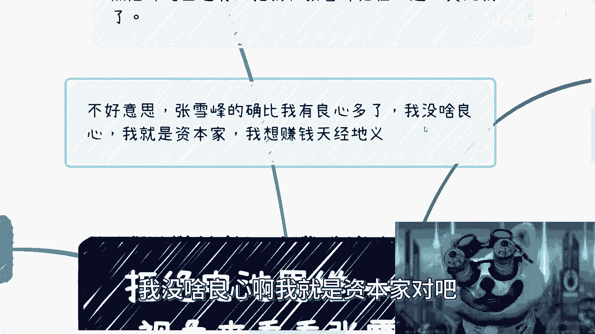
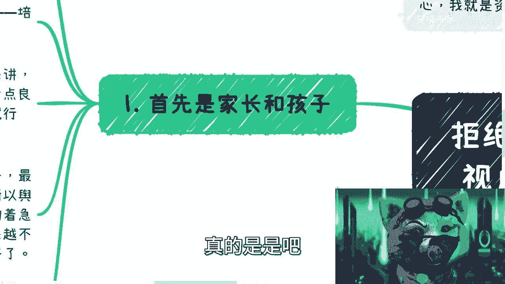
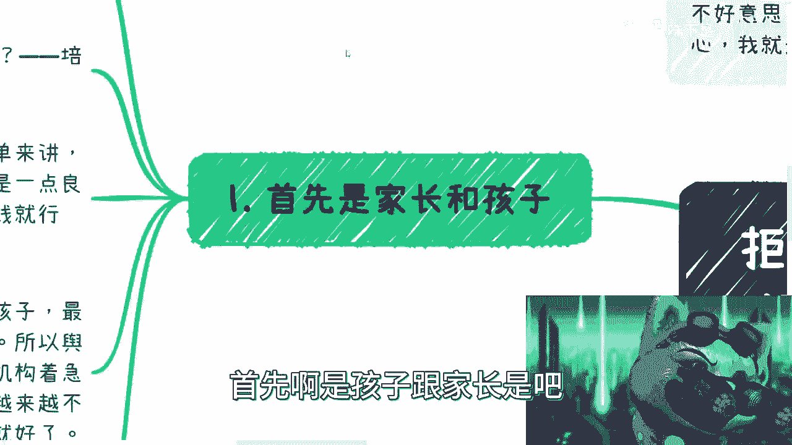
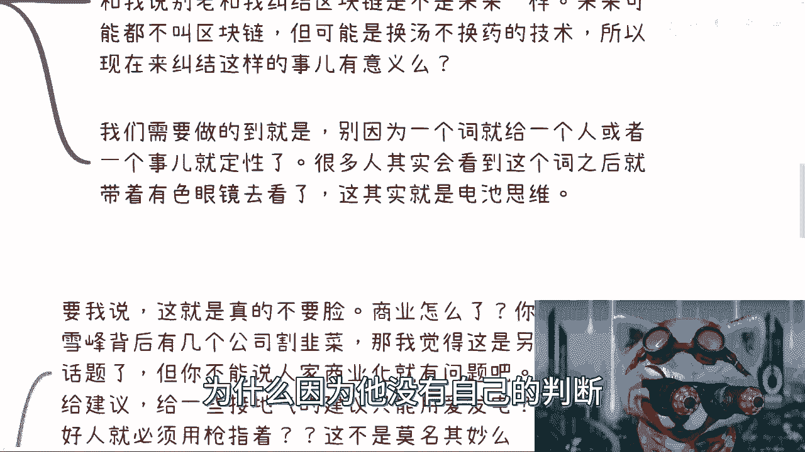
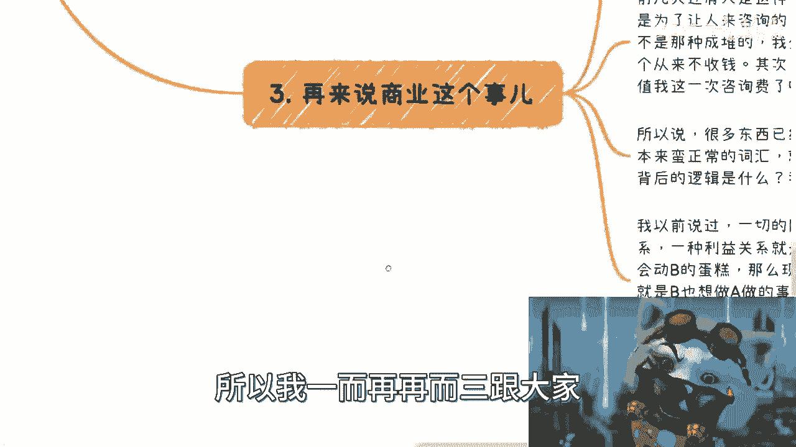
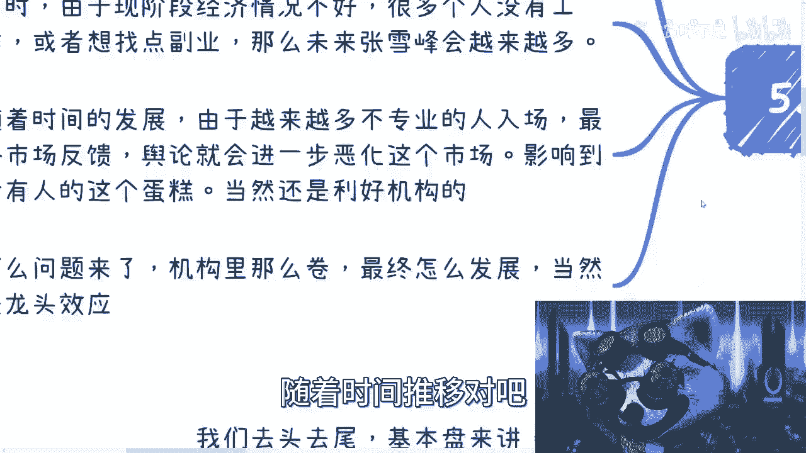
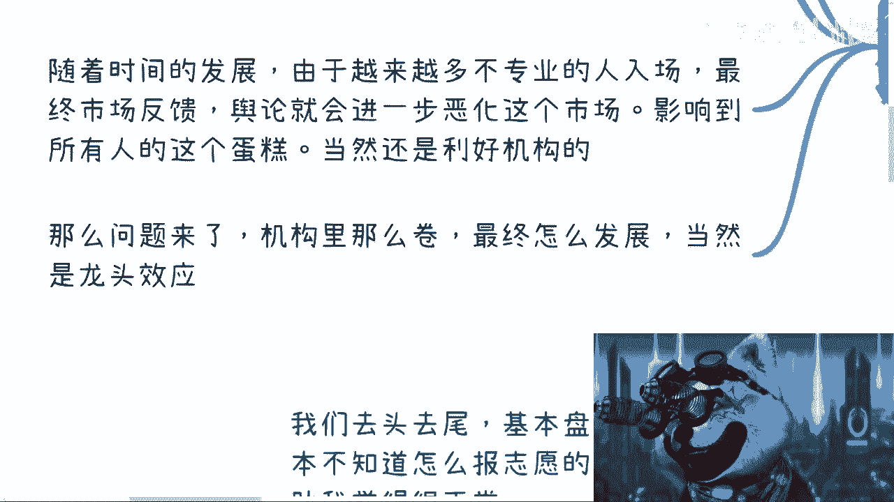
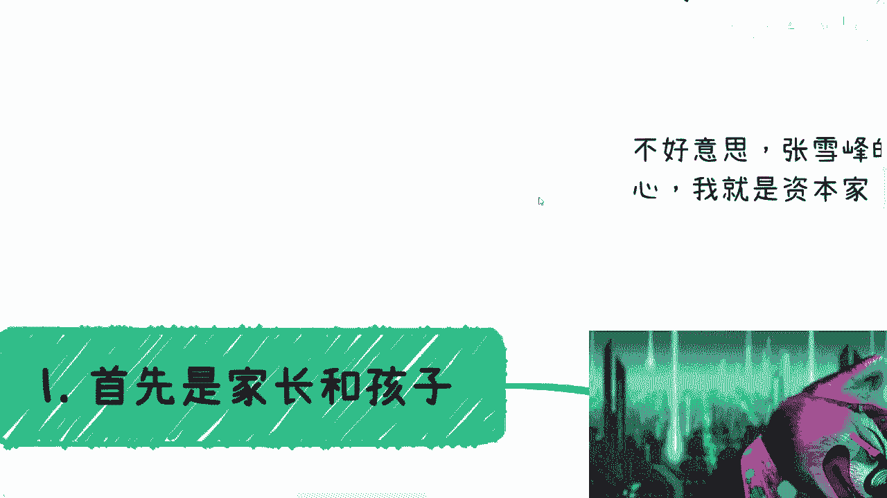

# 拒绝电池思维——我们一起来看看“张雪峰”事件带给我们的思考 - P1 - 赏味不足 - BV1EM4y1J7sf

好啊，各位小伙伴大家好，今天今天今天礼拜一啊，昨天是礼拜一吧，嗯好啊，我决定要蹭一下这个热点啊，这热点不蹭实在说不过去是吧，我呢给拒绝电池思维开了个新的合集啊，大家可以订阅一下啊。

呃首先呢是这样子的对吧，因为今天呢舆论上又开始讲了啊，那我觉得这个舆论既然要讲对吧，那我作为舆论的一份子，我也得讲一下啊，最近张雪峰这个风口浪尖对吧，大家也看到了舆论这个媒体舆论怎么说的对吧。

反正就是各种贬义词啊，能上全部用就该能上的全部上啊，比如说网红啦对吧，这个网红的言论呃不能听了，哎我这个这个写错了对吧，还不能停可还行是吧，不能停蛮好的啊，不能听了对吧，今天又开始说网红商业化对吧。

赚钱啊，然后说什么呃，说什么评论区啊，说什么评论区也有人这个啊，然后说网红商业化赚钱，然后呢评论区也有人说啊，把我这个归到跟张永峰一起是吧，我觉得受宠若惊啊，我我就是个渣渣是吧啊，笑死我了。

然后不好意思啊，就是张雪峰呢的确比我有良心，我有一说一啊，我没啥良心啊。

我就是资本家对吧，我我就跟你们说，我就是要赚钱的天经地义，这怎么滴了呢，怎么滴了呢，啊我违法了吗，真的是是吧。

我这个主题啊叫做从不同角度来看张雪峰对吧，但为什么放到拒绝电池思维里面呢，你们听了你就知道了是吧，首先啊是孩子跟家长是吧。

我觉得啊我们去头去尾对吧，把基本盘里面特别懂的啊，把基本盘里面特别不懂的啊全部去掉，那基本盘来讲呢，其实家长跟孩子根本就是不知道，怎么报志愿的啊，因为大部分都不懂啊，这次谁懂啊，是不是我说我说直白点。

你们来问我，我为什么不接啊，我也不懂啊，这个我怎怎么敢说啊，对吧对吧，这就是现状啊，所以说呢你去寻求帮助，我觉得也是很正常的对吧，首先首先就是说这是个刚需啊，这没毛病啊，那么问题来了对吧。

那么他们从老百姓角度来讲，当下寻求最多的帮助，就是寻求能够寻求帮助的是谁啊，机构对吧，没了那还能寻寻求谁啊，他中介机构是不是啊，然后呢我有一期这个说机构的，大家自己去看是吧，就简单来讲就是说我呗。

我觉得呢机构本来就是一个商业组织，他就是在哪的啊，存在即合理，这没毛病啊，但是呢机构以前呢我觉得是这个还是有良心的，但现在呢真的是一点良心都没有了，呃我觉得呢啊这个事情就是说这个叫什么。

就是内因外因都有啊，你说外因来讲呢，就是说这个基本盘啊，我说实话基本盘实在太大了啊，这基本盘里面的比例也实在太大了，你知道吗，就是就是就就你知道吗，你们但凡回头去做了，你们就会有种什么感觉。

就是不割都对不起自己，你知道吗对吧，那么这个外因是什么，外因，就是说经济情况不好对吧，你经济经济情况不好，那么整体来讲就是企业现要活下去，资本家先要活下去，那资本家先要活下去怎么办呢。

那不是不是只能割了嘛，对不对，那说白了呢就为了赚钱对吧，连哄带骗啊啊这个打个比喻啊，就是说以前呢呃，就是比如说咱不把你，不把大家往这个粪坑里坑对吧，不把大家往死路上坑啊，但是呢就是也不会是个最优解对吧。

就比如说是个五六十分的解，就这么个情况对吧，反正就是你交钱就行了啊，你孩子以后咋发展，反正跟他们也没关系对吧，这不就是这个样子嘛是吧，我再跟你们说啊，前两天啊还有这个小伙伴私信我说啊。

我们这个有一个培训班啊，交多少钱之后叫什么就业对吧，你觉得靠不靠谱，我还是那句话啊，你们可以对任何人抱有幻想，千万不要对资本家抱有幻想，你知道为什么吗，因为嗯因为资本家是只要赚钱的，别的不管的。

而且资本家有个核心的点，是不可能做亏本买卖的，你明白吧，就说你今天交2万块钱，对不对，好，他说能保你就业，那我就这么跟你讲，你交2万块钱我可以保你，比如说2万是吧，我算算啊，25000块钱的话。

对我就这么说吧，比如说2万块钱，2万块钱，对不对，我可以帮你有多少多少时间的就业，对吧好，但是呢你这个实践就业，其实一方面是羊毛插在羊身上，也就是说我会把你的钱还给你，这是你的钱，对不对。

第二点就是说你其实去了别的公司，我会问别的公司再要服务费对吧，也就是说总体来讲你你作为一个电池，你不但给外包公司产生的效益，你还让我从外包公司上面能薅到羊毛，我也产生效益，就是说白了资本家多方受益。

唯独亏的只有你自己，就这么回事，对不对，你相当于拿那2万块钱，肯定2万块钱便宜了点啊对吧，你相当于拿那拿那4万块钱，拿那七八万块钱养活了你自己，其实就这么回事啊，然后叫包就业，那那那我还能说什么呢。

是不是啊，那张雪峰呢，我觉得就是说不单单是他哦等对吧，之类的人或机构呢，应该是目前最接近家长跟孩子的，是绝最接地气的，而且呢是愿意从学生跟家长角度出发的人了，所以说呢就是说啊。

我不能我不能说他们完全是很有良知的对吧，但是它相对有良知是吧，所以说舆论这个调性我觉得很简单，要么就是培训机构着急了，要么就是对应的学校召集了，要么就是大环境越来越不需要，接地气的人存在了，对不对。

就舆论告诉你们啊，我们只需要大家做好电池，只需要大家这个叫什么什么言听计从对吧，不需要你们有别的想法是吧好，那么结论就是反正电池是越来越多越来越好，就越多越好的对吧，这就是结论啊。

其实你会发现很多事情不是说很好解决啊，我觉得说一件事情不好没问题，你知道吧，就是你拿出解决方案来，你比如说你说那那那填志愿，你就说不需要张雪峰，不需要这些机构，好不啦，好的呀，没问题的呀，那你弄弄你。

你把那个填志愿很多东西你把透明化呢，也不叫透明化吧，你把信息尽可能的给出来呢对吧，你把前2年大数据给出来，那大家自然就知道怎么选了，对不对，你信息很多都不透明，你告诉我怎么选嘛。

哦大家两眼一幕会开开盲盒吗，难道对不对啊，就像我这个地方说的，不是没有解决方案对吧，事情本身有很多种解决方案，报志愿本来就是老百姓的痛点，那你现在不透明，你也不让别人说，那我就请问嘛，你让老百姓怎么办。

对不对对吧。

这个首先是从家长和孩子的角度来出发啊，好那第二个我们来从这个网红的这个事情来讲。

为什么会说网红，因为网红这个词给很多人感觉，就是不干正事的啊，没有积累，因为中国的基本盘放在这个地方，什么意思呢，就是很多人是只看舆论的，别的东西不管了，他没有基础认知的，你跟他讲讲再多没有用的。

因为他听不懂，你知道吗，这就是为什么我不推荐书给大家读，你知道吗，是因为大家还没有足够的内，就是内功去读这些书啊，没有意义啊，你知道吧啊就是你比如说网红，很多人听到网红就是卖脸卖服务对吧，没有积累。

就是一个他妈的小丑，那就跟我现在这个嗯那这样子一样的对吧，那简单来讲就是很虚，没有实际的东西对吧，这些是舆论需要告诉大家的，他也其实间接的想告诉大家，张雪峰是这么个定位，你知道吗。

或者张雪峰之类的人是这种定位，你知道吗，那我觉得互联网大项谁都可以成为网红，谁也都可以，不是网红，网红这个词叫什么并不重要，重要的是，其实老百姓心里面已经给他做定义了对吧，这就好像有和我跟很多人都说。

别老是跟我纠结，这个区块链这个技术未来怎么样，未来可以不叫区块链，它可以叫任何一个别的技术，但是你换汤不换药啊，你知道吗，所以说我们大家千万不要去背某一个词所洗脑，就好像听到这个词就感觉哦好很不好对吧。

或者怎么样子没有意义的，你知道吗，没有意义的啊，我们需要做的是什么，就是你别被一个词所洗脑，很多人看到这个词之后啊，就是他可能会去了解哦，张雪峰是谁，对吧哦张雪峰做了些什么事情，但是他看这件事情的时候。

已经因为这个词给了他定义，已经给了他带带有偏见的有色眼镜去看的，那其实这就是电池思维，为什么。

因为他没有自己的判断，它甚至会被一个词所带偏，你知道吗，那这就是二啊，三那么我们再来说说商业化这个事情啊，要我说这就真的不要脸，就真的不要脸到极点了，你知道吗，什么意思，商业化怎么了呢。

他妈的到现在哪个东西不是商业化，所有学校还是商业化呢，对不对，你现在哪个公立学校，哪个四级学校不是商业化，你哪个组织不是商业化的，商业化怎么了呢，我真奇了怪了，你媒体不商业化吗，对吧。

你要说你要真的有说拿出十真凭实据对吧，你要说张雪峰背后有多少公司，他割韭菜了对吧，他就是说哎这个明明就是两块钱的服务，他非要卖用户两两万块钱，200万，对不对，那我觉得这个是另外一个话题，没问题。

我双手双脚赞成对不对，但是你不能直接说人家商业化就有问题啊，那他妈谁没有商业化对吗，哦难道说你去给建议，给一些接地气的建议，或者说我们说呃讲一部分的真话，只能用爱发电，不能收钱啊，你收钱就是对吧不行。

所以说什么意思啊，所以说就说好人就必须用枪指着是吧，这不莫名其妙吗，那他妈我还说你们与那个媒体，这个这个叫什么煽动群众呢，啊这不就是煽动群众吗是吧，前几天还有人这么说我啊，说我什么呢。

他说我说考研没有用啊，就是为了让很多人来咨询，我跟你们讲，我话就扔在这，我要但凡跟你们说考研没用，是不是让你们来咨询，我跟你讲，我就不开500块钱了，我他妈不能帮我5000开吗，我说不好听点。

总有人会上钩脚，怎么那基本盘放在这个地方对吧，我跟你们说，到今天为止，你们所有人私信我的对吧，你们自己知道，但凡有问题的，不是那种什么4545个成堆的，我都回答的，我哪个不回答对吧。

你要说我现在发我私信的，我都不的那好，你们批判我也就另外就另外一回事情，对不对啊，来一个我答一个，我从来没有说哦，因为我答这个东西，你们要不哎打发我个红包是吧，再发我个咖啡钱有吗，没有的对吧。

而且我真的我我我今天也跟你们讲对吧，实事求是，今天还有个曾经咨询过我的人对吧，这个再再问我问题，写了个word对吧，然后有很多问题我也就直接说的呀，我也没有说哦，因为你写了个word里面有很多问题。

我就问你收钱也没有呀，我觉得没有关系，随缘嘛，对不对，而且就我目前所出的所有的视频总总额，难道不值这点钱吗，啊没有意义的呀，你知道吗，就是我一直在说不要底层去攻击底层，你们要明白。

包括我觉得所有的人要明白，张雪峰是站在是是站在哪一边的，媒体是站在哪一边，对不对啊，所以我就说了很多东西，已经被舆论被二极管妖魔化了，本来很多很正常的词汇就变得非常的十恶不赦，但这背后的逻辑是什么。

ok我来告诉你逻辑是什么，逻辑就是一切网络信息的舆论跟背后，它就是利益关系没有了，你知道吗，其实就是利益关系，就是要么就是说是a动了b的蛋糕，或者可能未来他b感受到了，可能未来会被动蛋糕。

这种叫什么风险对吧，那么先进行舆论的铺垫，先进行舆论的攻击，还有一种是什么呢，就是b也想去做a的事情对吧，就有很多人也想做装修工事情，但是做不了对吧，那怎么办呢，攻击他，为什么。

因为现在人主打的就是一个嫉妒，主打的就是一个自己过不好，别人也不能过得好对吧，主打的就是说我做不到，你也不能做，唉就这么简单对了，这是个基本盘，所以我一而再再而三跟大家讲的是什么呢。

就是大家顾好自己就好了，你知道吧，是吧就是所谓不以恶小而为之对吧，你自己你你管别人干嘛呢。

是吧啊对吧，那我们再来来说啊，就张雪峰就算赚钱了才几个钱，你想想看啊，你算算他的投入产出比有多少，咱们别的不说，这些知识星球他妈的赚了多少钱啊，他们投入产出比是多少，你想想看，就在我看来。

这两者完全不在一个档次上面对吧，你这我靠知识性就那么割起来效率多高啊，啊那怎么没人攻击这些知识星球呢，怎么没有媒体跳出来说呢，有不赖，没有从来没看到过，对吧啊，所以说呢我跟你讲，还有一句话。

在之前北大我去北大的时候，我也看到了对吧，未来是年轻人的什么意思啊，也就是说我们可以赚钱对吧，尤其是我们在赚年轻人的事钱的时候，或者我们去做那些k 12教育的时候，我们得要有一定的良知，你知道吗。

就是在赚钱的时候，至少我们都要告诉对方实际情况，你知道吗，要从对方去考虑，而不是像知识星球一样去交付一些标品啊，然后就跟着所有人说，你们都能赚钱对吧，你想想看一个给c端的产品，一个给用户老百姓的产品。

它是个标品，这东西怎么可能靠谱呢对吧，你想这东西怎么可能靠谱，怎么就就随便怎样，从这个出发点就不可能靠谱啊对吧，那么你再反过来想，我就问张雪峰，这这类人要去走量赚钱容易吗，容易的很啊对吧。

你为什么就他为什么还要走出，现在这种抛头露面的，还走直播，还走性价比很低的这种模式呢对吧，还要这个说的很多，还留下把柄呢，你们想想为什么是他不懂吗，不是我他妈想，怎么可能不懂呢，对不对。

我只能说是他还想做点事情对吧，可能还想尽尽自己的一份力对吧，那么这种人就容易被幸存者偏差被放大，什么意思啊，就是他一旦被媒体攻击，一旦被媒体放大，他就容易在老百姓心里面造成一种什么。

就说哦这种做什么志愿的啊，这种做做这种志愿个人的网红都不靠谱啊，都不靠谱，我们就要怎么样怎么样，我们要另另辟新蹊径，你知道吗，就会有这种感觉，但是事实是什么，事实是就是这是一个幸存者偏差。

但是是被一个放大了无数倍的幸存者偏差，而且还是一个嗯，就是还是一个就是说好的幸存者偏差对吧，好那么我们继续来讲啊，第五点对吧，当然很多事情就是大家要举一反三嘛。

对不对，很多东西呢它就是这么发展的，什么意思呢，老百姓的这么一个群体，本来就是没有分辨能力的啊，所以机构这种是会很会营销的商业化组织，其实是很方便去营销骗老百姓的啊，我跟你们讲，毫无疑问啊，毫无疑问啊。

呃这第一点，第二点同时呢，由于现阶段的经济情况不好啊，很多人没有工作或者想找点副业，那么未来张雪峰只会越来越多，为什么，因为大家没有事情做，大家觉得诶这块东西能赚钱，诶这块东西是刚需，哎我也要去做好了。

阿猫阿狗都去做了对吧，那么你想想看接下来怎么发展，随着时间推移对吧。

越来越不越来越多不专业的人入场了，但是老百姓没有分辨能力，最终市场反馈舆论就会进一步恶化，这个市场就会说啊，这个人做的不好对吧，到最后媒体你讲比如说假以时日对吧，媒体就开始说了啊。

这个禁止严禁听从这种相关的啊，为了自己的孩子负责，为了未来负责对吧，再放大无数倍，好了，一下子就是那种叫什么一朝被蛇咬，10年怕井绳啊对吧，影响到这个人这所有人的这个蛋糕了。

当然有一类不会影响到是什么龙头对吧，就是所有的这类事情发展到最后是什么，就是还是集中化的，中心化的受益对吧。

本来大家能够吃到蛋糕的，本来大家能够赚到钱的地方好，随着这一系列的骚操作。

最后好诶，没事谁都吃不到啊，就就中心化啊，龙头化啊，就是那种上游的这种，这个金字塔顶部企业又来做，但是我们想想看，他们真的做得好吗对吧，他们真的会从你们角度去想，他们真的会从老百姓角度去想。

他们真的能有张飞雪峰做得好吗，我跟你们讲，不用打问号，我可以他妈的2000%，10000%，他妈给你们打保票，绝对不可能，为什么，因为一个东西一旦商业化了，一旦趋于垄垄断了，做的好个屁呀。

对不了，有个词叫蛇鼠一窝啊，你们自己想。

啊所以啊我在这个地方再跟你们讲一遍啊，就是拒绝电池思维，不是说我们要去反对所有事情，也不是我们一定要去质疑所有事情，而是说我们不能带有是非黑即白的眼光，去反对和质疑所有的事情对吧，就我们得要辩证的去看。

我们要去不同的角度去明白，到底怎么去看待这件事情，然后也要去想跟自己到底有什么关系对吧，因为有很多人其实都明白，就是工作是不是唯一的出路，但是他并不知道，其实很多时候潜移默化的很多事情。

是会影响到未来自己去做副业，或者未来自己的这个这个赚钱的方式对吧，就是我就这么说，所有的路越走越窄，越走越窄，越走越窄，而老百姓能选的方式越来越少，越来越少，那我就请问嘛，大家都知道工作不稳定。

那如果别的路也越来越窄之后，那请问我们的出路在什么地方对吧。

