# 拒绝电池思维——打工和商业是两个平行世界 - P1 - 赏味不足 - BV1yu411W7NM

哈喽大家好啊，礼拜五人，大家可以摸鱼了，是吧啊，同样的啊，这个这次这个主题啊说的是工作跟商业啊，这个区别嗯，我先说一下一些前期前情提要啊。

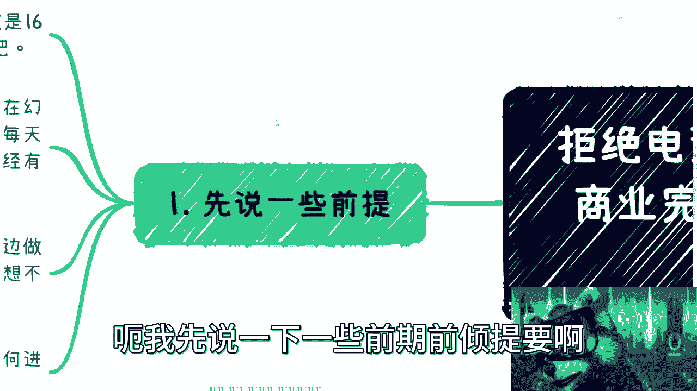

前情提要是这样子的啊，今天这个这个小熊猫啊。

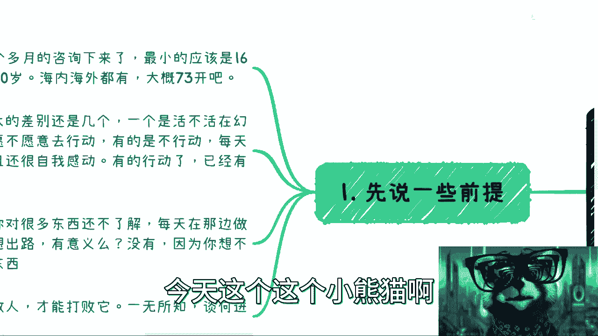

帅的一匹是吧，嗯首先呢也做了快两个多月咨询了啊。

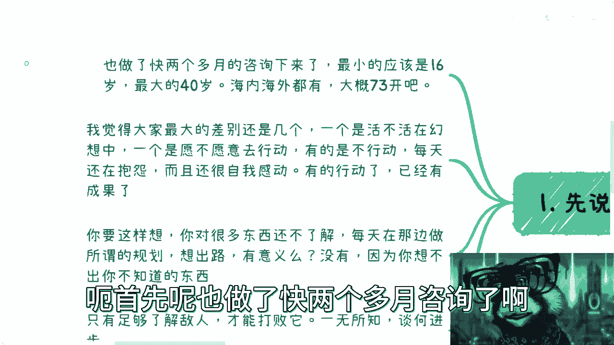

然后现在最小的是16岁，最大的40岁啊，海内外都有，我跟你们汇报一下，问题不大啊，第二呢就是说我觉得大家最大的区别啊，就聊下来还是有那么几个，一个呢就是说活不活在幻想当中对吧。

就是有的人呢其实对现实认识的蛮清楚的，知道自己的不足，知道世界是什么样子的，但有些人呢是知道自己的不足，也不知道世界什么样子，然后呢就活在他自己的幻想里面啊，然后呢就在那边想说哎呀我应该怎么改变。

哎呀我应该怎么规划，你有卵用啊，没卵用，是不是啊，然后第二个呢一个是愿不愿意去行动啊，然后呃有的那是肯定是不行动的。

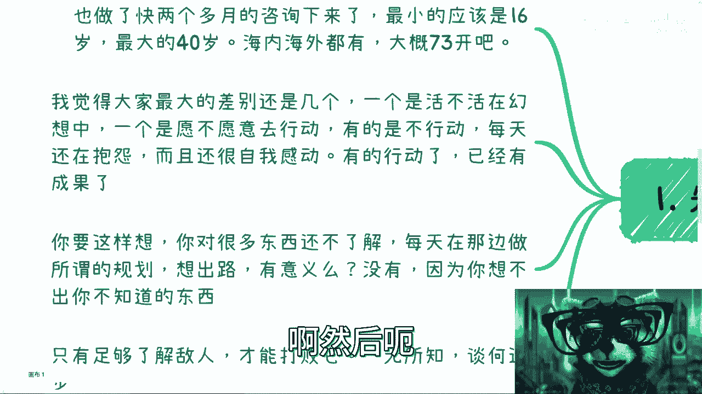

但是每天还在抱怨啊，无论在我评论区还在别的地方嗯，而且还自我感动，我觉得就没啥必要，有的那是已经行动了，而且已经有成果了，怎么说呢，就是说还是那句话，就是不要急于求成，没有任何东西可以急于求成的呃。

欲速则不达是吧，就是说你只能慢慢慢慢去积累，不要去就是想那些有的没的对吧。

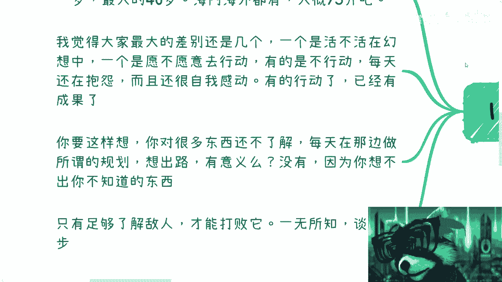

然后另外一方面呢，我一直跟你们说，为什么要去了解，要走出去要干嘛干嘛，因为嗯大部分大部分人对吧，包括我以前都是一样的，就是我们对很多东西不了解对吧，每天在那边做规划，想出路没有意义的，因为我们没有。

我们都不了解我们怎么去做规划呢，对不对，你就是我们做出来很多规划，自以为很牛逼，但其实就很不接地气，你知道吗，就我们一天到晚说别人不接地气，但其实自己才是不接地气的，你知道吧，就是就是就是我说直白一点。

你就像很多人在那边喷专家对吧，喷喷资本家对吧，喷怎么样，那你要从我角度来讲，我觉得人家专家跟资本家比你们接地气得多，比老百姓接地气的多，为什么，因为人家至少知道世界怎么运作的对吧。

至少知道这里面很多条条框框怎么运作的，老百姓都在yy，你知道吗，就是都在意淫啊，所以说呢就是说你你你单纯在里面想没有用，你知道吗，你想不出你不知道的东西，这是不可能的嘛，对不对，然后呢。

就是前两天还有个小伙伴私信跟我聊的时候，我就问他，我说你想这么多，就他跟我说了一大堆嘛，我说你想这么多，你有没有你有没有问过你自己，你的敌人是谁对吧，就你们想想看是吧，就是什么意思。

就是说比如说你现在要赚钱，或者你现在觉得就是啊你工作不满意对吧，或者你又觉得就是说啊这个未来这个叫什么，不清楚对吧，不知道未来的路在什么地方对吧，那这个时候你要去想啊。

你的敌人有的时候你的敌人是你自己对吧，有的有的时候你的敌人是你很多未知的东西，对吧，有的时候你的你的敌人对吧，可能是一些就说啊这个阻碍你赚钱了，或者阻碍你每天在那边迷惑你，或者pua你的一些信息。

那关键是你得了解他，就像我们一直为什么我做那个视频，做到现在跟你们讲的时候，一直说啊，不要去看网络信息啊，不要去嫉妒人家对吧，不要去看那些有的没的，不要想有的没的，为什么。

因为这些其实归根结底是阻碍大家前进的东西，对吧，你但凡走出第一步来。

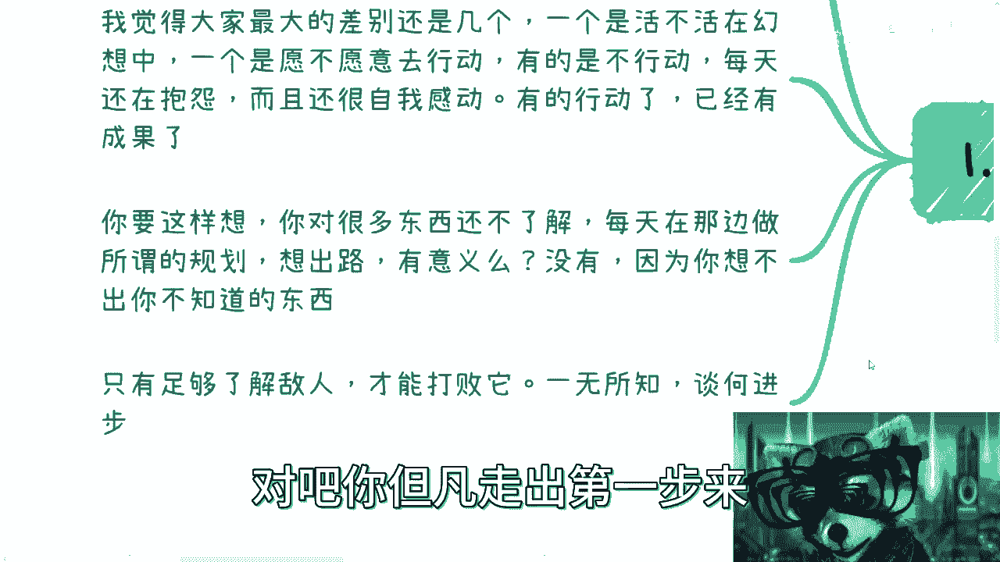

你就会发现其实这些东西没有用啊，对吧啊，这先说说一些前提啊。

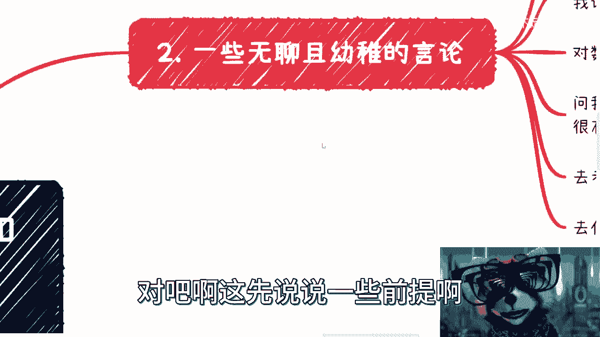

二呢我觉得我也跟大家说一下，一些无聊且幼稚的言论啊，这个也再次证明了就是说嗯怎么讲呢，就是不管你年纪多大，也不管你工作多久，在我看来幼稚就是幼稚的，这个跟你工作多久，年龄多久没有用，你知道吗。

就有很多东西不了解，就真的就是哎呀，就感觉就是说嗯很多人觉得自己很了解。

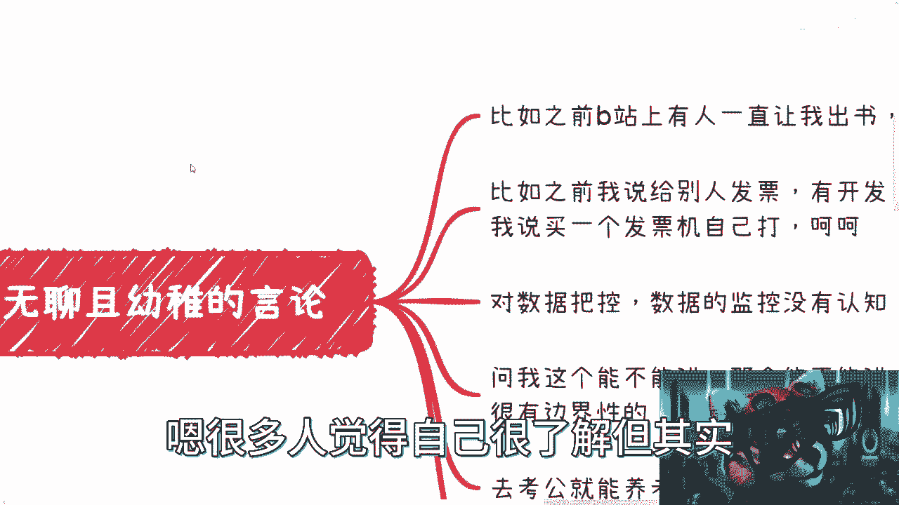

但其实就我只能呵呵，你知道吗，哎你看到没有，哎哎哎呵呵。

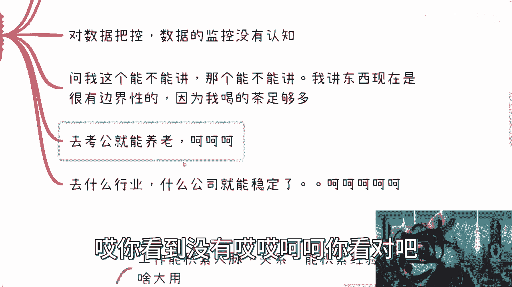

你看对吧，呵呵啊，就首先呢你比如说之前b站上啊，比较早的223块钱吧。

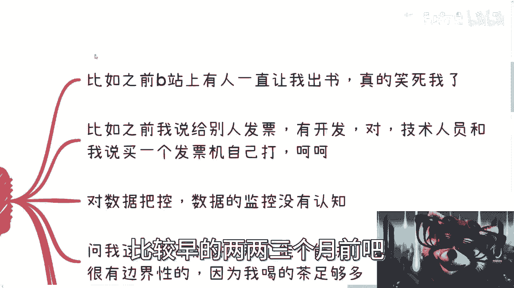

就评论区一直有人让我出书，然后那个人被我拉黑了，还是那句话对吧，我以前呢我我也跟大家讲过了，我以前是一个很叫什么，就是唉我们昨天怎么说来着的啊，就是哎呀就是很care别人眼光对吧，肯去叫什么啊。

讨好型人格是吧，我现在呢就很简单，第一呢我就不想废话啊，我直接拉黑，我管你是谁，你是谁跟我都不care，跟我也没关系，你管你，你就算今天给我，你就算你现在能给我赚100万，我也不关心。

为什么世界上能给我赚100万的多的是人，而非你不可对吧，拉黑拉倒，那这是第一点，第二点是啊，叫什么啊，就是你说出书这个事是吧，那你从我角度来讲，你就就很搞笑，你知道吗，第一是我去写书，我花这么多时间。

我图啥图，你不洗澡吗了呢啊，这我就不明白了对吧，图你幼稚嘛是吧，这第一点第二点是你说我出这个书，我能在书里面写什么东西呢对吧，我写任何我觉得有价值的东西，出版社都不过审，你都不过审，你让我出出干嘛呢。

这这是不是我就哎呀，我就觉得就是嗯那好啊，再再华话又说回来，那我是欠你的吗，还是怎么说呢，我就你就是你说个一遍两遍我就算了对吧。

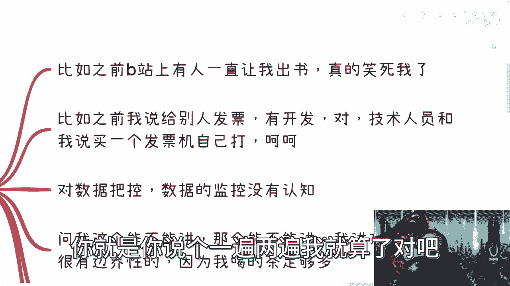

你就是跟他妈的说个十遍八遍就有什么意思呢。

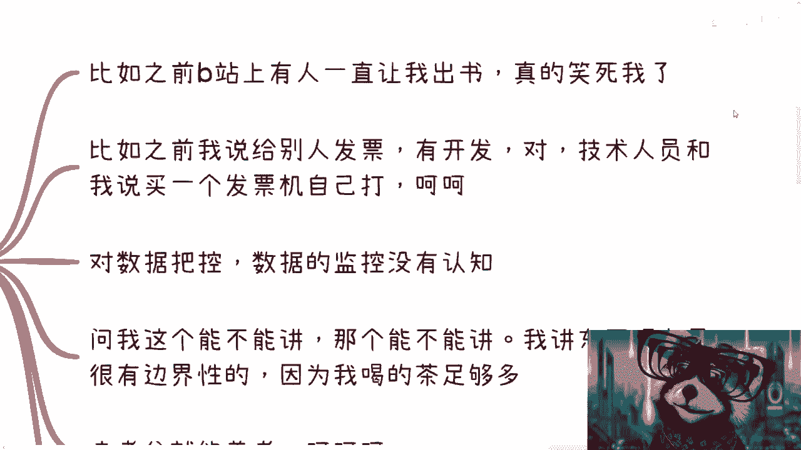

对吧，我就我就觉得很搞笑，你知道吗，这是第一个，第二个就是你比如说之前我给我，哎呀我跟你们讲，你牛逼的啊，一些大厂的一些开发，哎呦卧槽不要太牛逼啊，跟我说什么，你知道吗。

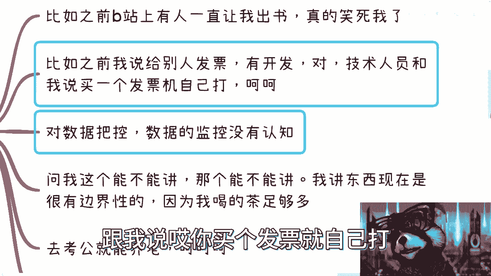

哎你咋这么吊呢啊我跟你们讲，真的就就很多人啊，就是就是活在这个世界上就越来越法盲，你知道吗，越来越就是，就他不但不了解这个世界运作规则对吧，法律也不了解，什么也不了解，财务也不了解，就法盲。

你知道各种盲啊，然后就觉得自己很牛逼，我哎呀，那就叫呵呵是吧呵呵。

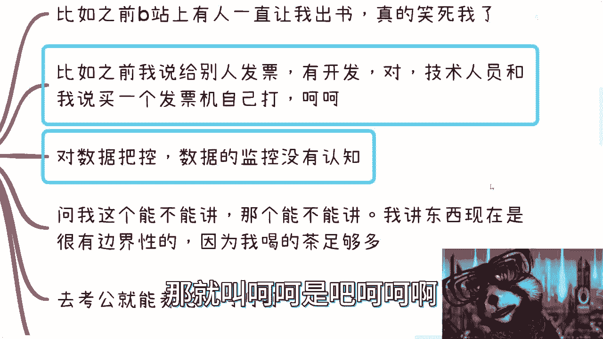

还有呢就对数据把控，数据监控，你知道吧，就是就是你你在一个主权化国家，你难道自己没点逼数吗，啊你没点逼数，你去翻法律啊，啊你没点逼数，对不对，你这就是就是很多东西都是明文规定的。

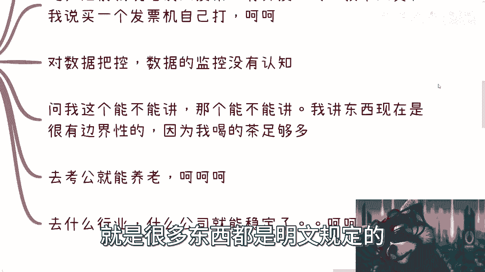

你自己去看呐对吧，我就觉得很很搞笑，你知道吧，还有什么还有问我哎这个能不能讲的，那个能不能讲呢，我跟你们讲，我这么多年到现在，我讲的东西是很有边界性对吧，包括微博啊，有朋友圈啊对吧。

很多东西又有很多小伙伴跟我说，哎呀你这个不能讲的，你号保不住了，我根本就不care为什么，因为边界性我很清楚为什么，因为我喝的茶足够多，就这么简单对了，你按前2年的说法，我我他妈平均一个月可以去四次。

去个4645次，我很清楚边界性在什么地方对吧，所以你们别去想太多对吧，你但凡要想的，那你就你就你就你就那个私信咨询，对不对啊，然后就是也不要录音对吧，就这么简单，你要录音不征得我同意的。

那我们法庭上见是不是就结束了啊。

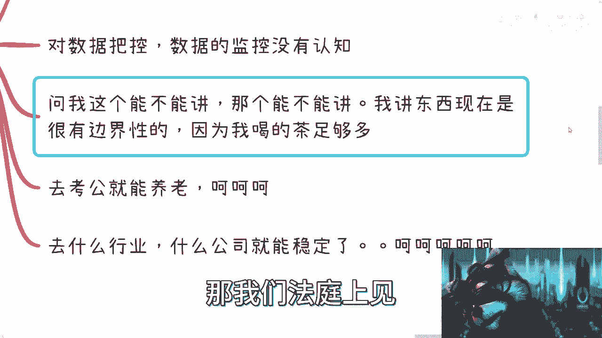

这个事情就这么简单，我现在没什么好逼逼的，你说是吧。

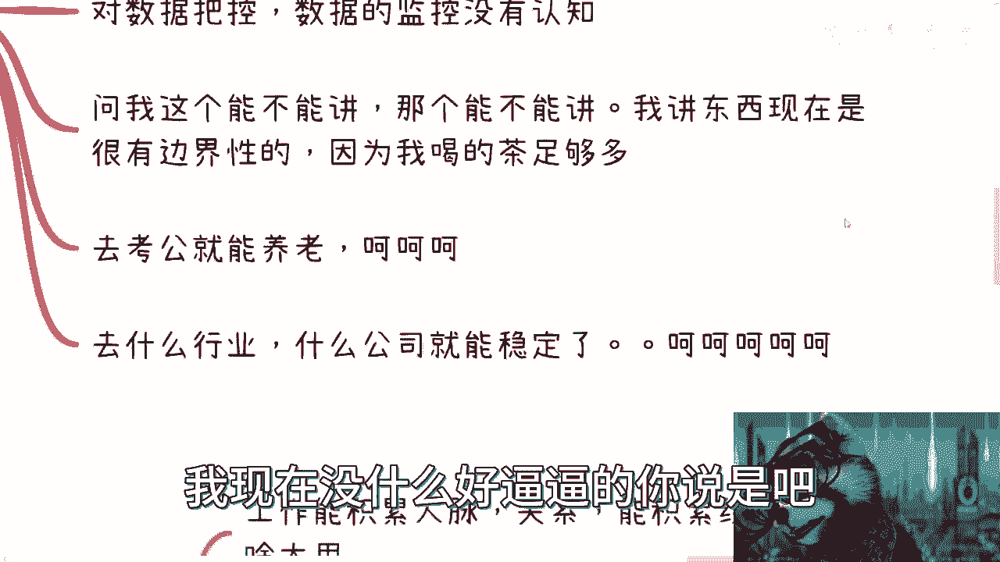

还有什么，还有就是还要去考公就能养老了对吧，去什么公司，什么什么行业就能稳定了，哎你看到没，有用了没有用的呀。

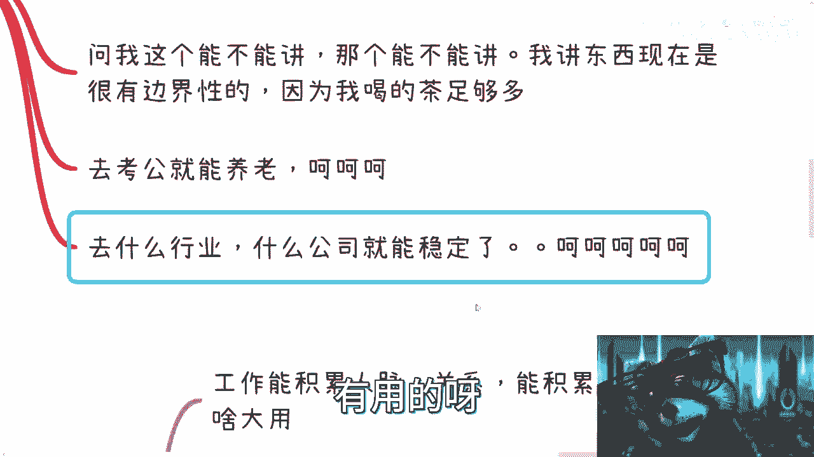

就活在自己的yy世界当中，又有什么意义呢，对不对。

就但凡我跟你们讲，就是下下到基层对吧，了解了解行情，你但凡但凡了解你就不会这么说啊对吧。

而且最搞笑，你知道是什么，就是就是很多人吧，他自己就是别人家里有矿啊，别人上面有人，他这么说，这很多人普通人什么都没有，哎他也这么讲，哎跟风哎呀，人家这样，我也这样对吧，人家躺平我也躺平，没事。

我跟你讲啊，好日子在后头是吧。

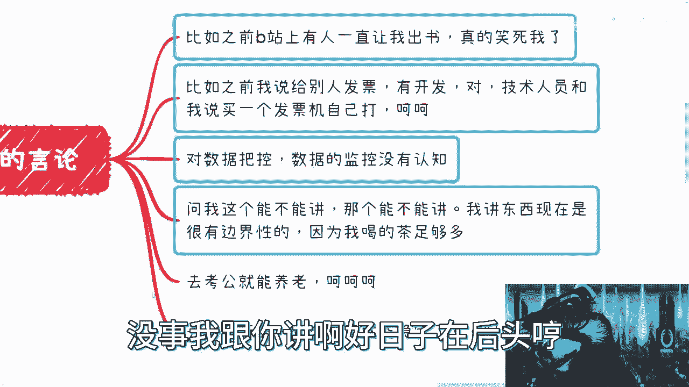

然后呢这个说正题，说正题。

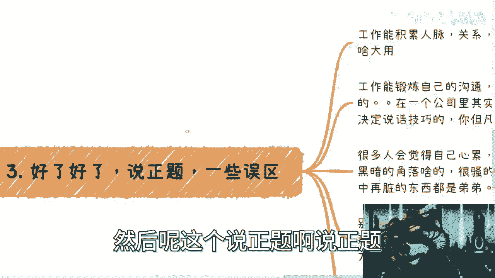

一些误区啊，误区是什么呢，就是啊这个工作呢。

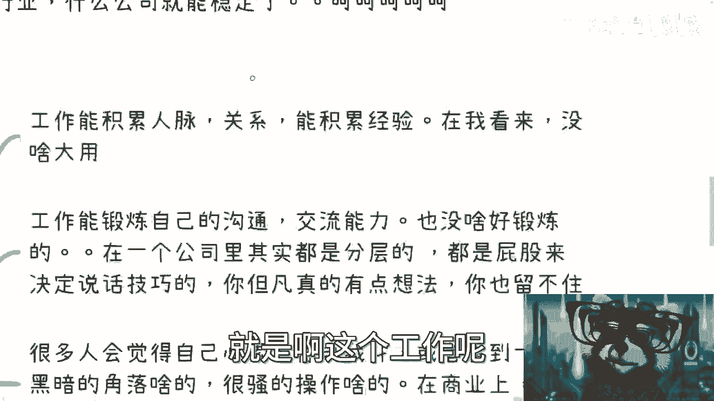

有很多人会觉得工作能积累人脉啊，能积累关系，能积累经验啊。

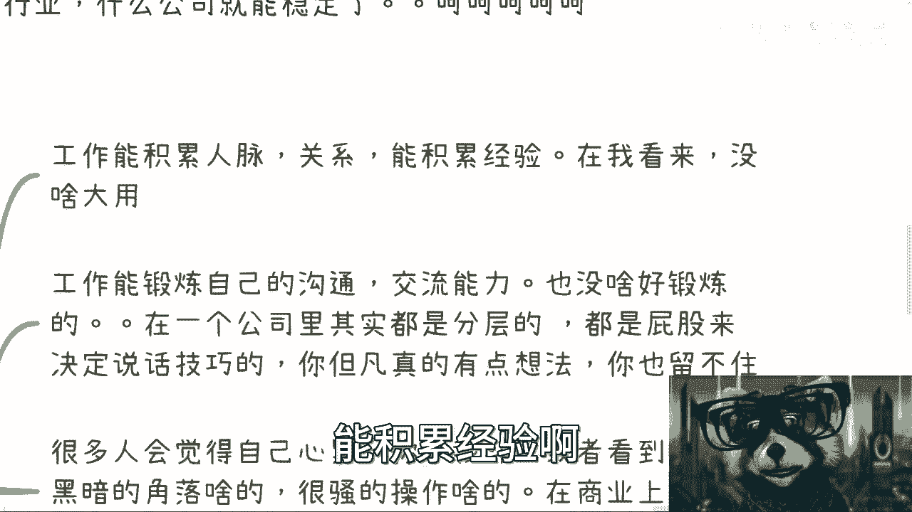

这个东西呢我在这里强调一下啊，就是在我看来没什么卵用，为什么啊。

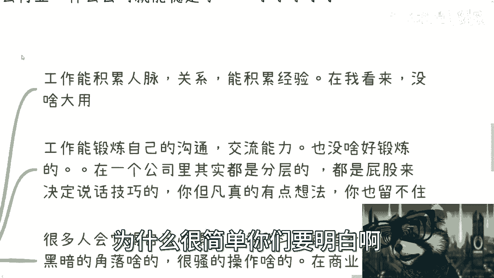

很简单，你们要明白啊，你们所积累的人脉是公司的，你们所做出来的成就也是公司的，你们所做的做出的关系还是公司的，你们所能积累的经验无非只是在打工这个层面，你知道吗，这就好像什么我给你们随便举个例子对吧。

七龙珠知道吧对吧，孙悟空知不知道超级赛亚人知不知道，对不对，这就好像你在变成超级赛人之前，你所积累的经验有卵用吗，没有卵用，为什么，因为他他你有这个层次上的一个，就你有一个境界上的一个瓶颈。

你永远住在这个地方，没有办法的，这不是你能控制，这是这个工作，这个公司打工这件事情所给予的瓶颈，没有用的，你别觉得就是说啊这些东西跟商业是能挂钩的，或者说跟商业很多人没能平移的，平移不了的。

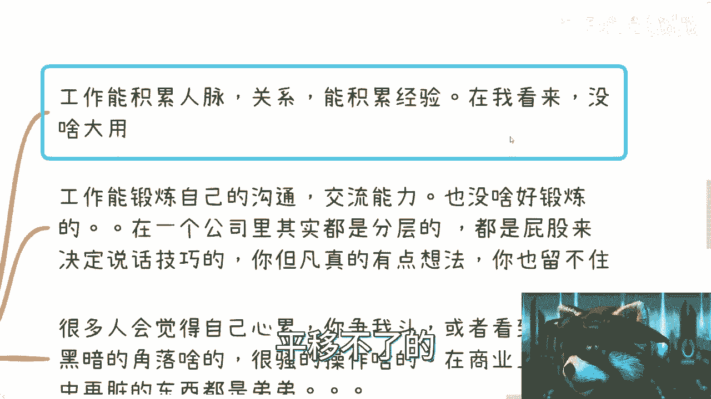

你知道吧，对吧。

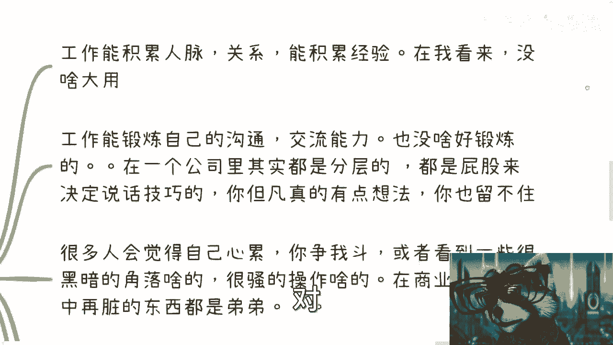

第二点你工作能锻炼自己的沟通，能交流能力，我跟你讲也没啥好锻炼的。

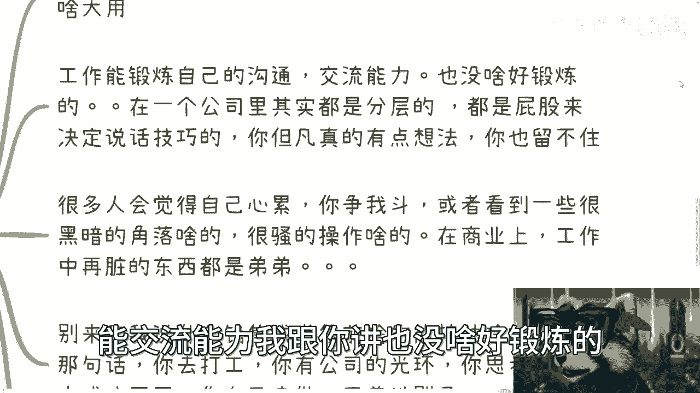

为什么你在一个公司里面其实都是分层的对吧，你跟我说说话技巧有什么技巧啊，我请问有什么技巧，不就是跪舔吗，这他妈能叫技巧吗，对吧啊，我跟你讲，你但凡有点想法，你但凡还受制于人，什么叫受制于人。

就是你每个月还要拿工资，你每个月只要拿别人给你的钱，你但凡就是受制于人，就这么简单，对不对哦，你但凡在这种地方下面有点想法的，你也留不住啊，别人也不会让你留，你跟我说这种这种环境下面，你去沟通啊。

所谓的沟通锻炼沟通锻炼交流有什么好锻炼的，对吧，然后还有一点是什么呢，很多人还觉得啊说这个啊觉得很心累啊，你你你争我斗的对吧，pua的，或者看上去有一些很黑暗的什么操作对吧，很骚的操作，我跟你讲啊。

在商业上，你们在工作上，工作的场合里面，所看到再脏的东西都他妈是弟弟懂吗，就这么简单，你知道吗，就用我的话来讲，你们在工作里面看到任何东西都是过家家，没有意义的。

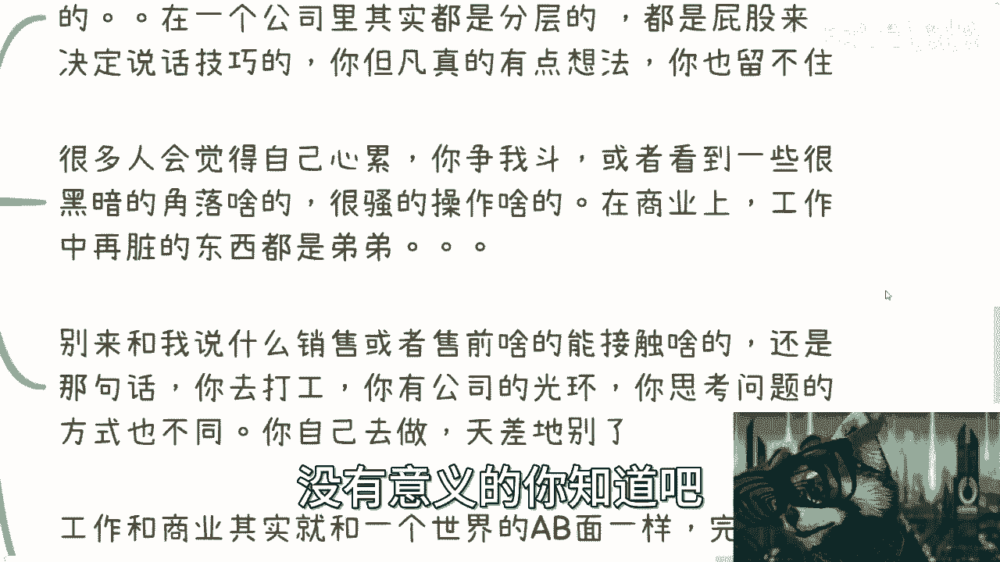

你知道吧，别自我感动啊，就这些这些就是时间长了，只会让你们止步不前，你知道吗，就像打游戏升级一样的，只会让你们卡在lv 2 lv 3，没办法到lv 20 a lv 31。

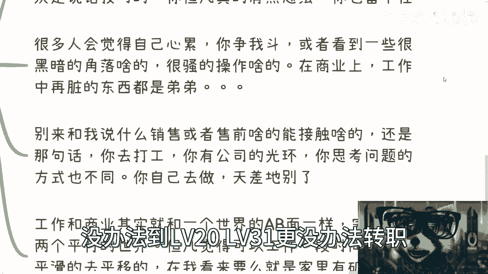

更没办法转职，就这么简单，对不对啊，你别来跟我说，什么销售或者售前或者啥都能接受啥的，还是那句话，你去打工，你有公司的光环，你思考问题的角度都不一样啊，你能锻炼出什么东西啊，你去接触别人。

别人看你的是你的公司啊，别人不是看你啊啊你售前做的解决方案，他妈的不是你啊，是公司提供出来的啊，你提供的只不过是一个产出的一个工具人啊，啊对不对，你思考方式整个这个做事情都不一样。

你自己去做的时候就天差地别了，你想看会一样吗，你能积累出什么东西来，对吧，那么到这个时候还有人跟我讲了，又有人要说了，他说哎吕老师，你这样讲不对啊，这个啊你但凡到这种大公司啊，做得更高层了。

你肯定是能有学习的，哎呀不是我跟你们讲这句话，你对我觉得你们讲出来有意义吗，我想问对吧，我就这么说，大部分的人你们认识的高层多，还是我认识高层多，对吧啊，在以前互联网鼎盛时期。

在以前就叫做叫做互联网加是吧，或者说制造业传统行业鼎盛时期，这些以前的总监，我身边多的是啊，到现在有几个混的好的。

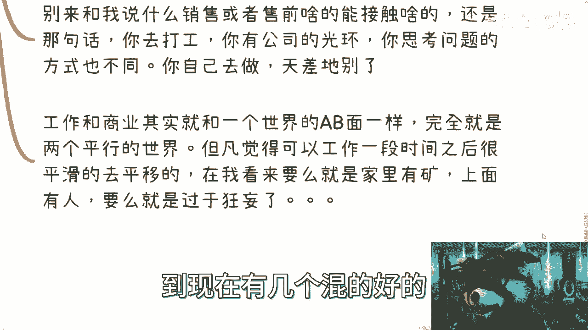

没有的呀，为什么，是因为你有你的瓶颈了，你你不是创始人，你不是股东，没有用的，你该接触的东西你还是接触不到。

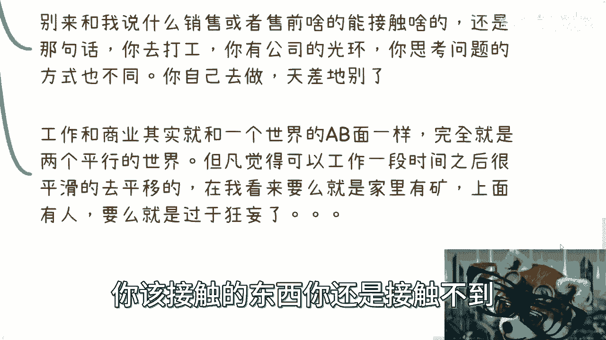

对不对，就就这么简单，更不要说你现在这种环境。

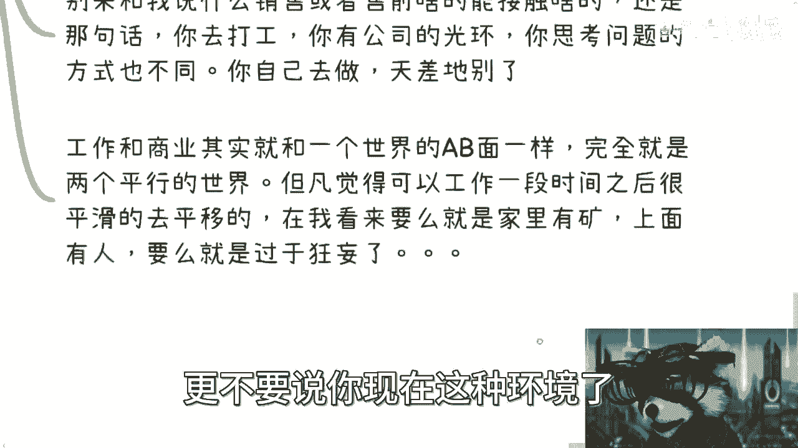

就跟现在这种环境比较，比前面20年恶劣的多了对吧，所以我跟你们讲。

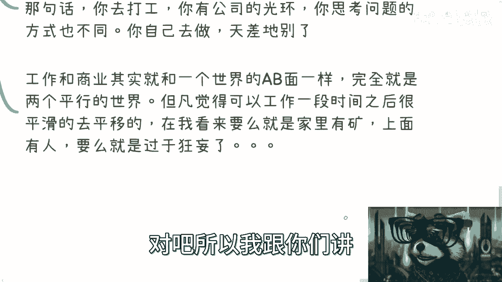

工作跟商业，其实就是和一个世界的a b面是一样的，就是它完全是两个平行的世界啊，这这两边就是相当于是说，你的技能点都是不一样的，你你你你为什么我一直跟你们说，要保持空杯心态对吧，甚至你说喜点。

你要洗点才能去商业战场对吧，你不要把你以前的那种，我们一直说的什么工程师思维啊，什么什么什么，比如说一些认知啊，就就是说拒绝工程师思维也好，拒绝那些认知也好，前提就是其实它的根本本质是什么。

就是你们要放弃你们所有在工作上的认知，投入到商业战场里面，然后去学习对吧，去去滚一圈，在这个泥潭里面去滚。

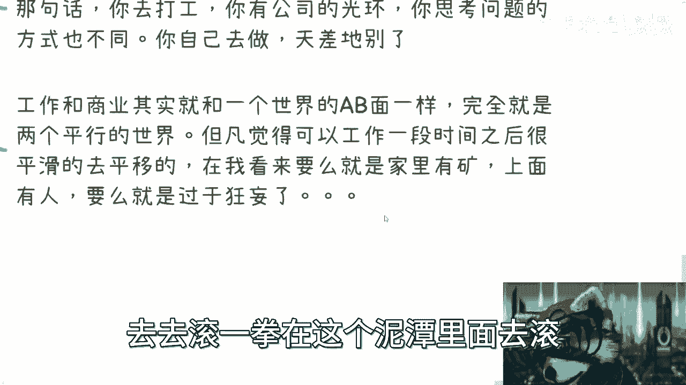

对吧，我给你们讲，但凡你们觉得工作一段时间之后，就能够很平滑的去平移的对吧，就是说工作一段时间，到到什么商商业里面去平移的，在我看来，你们要么家里就是有矿，要么就上面有人，要么就过于狂妄。

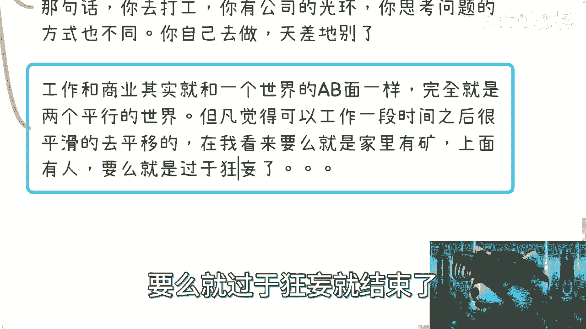

就结束了，就这么简单，这个事情。

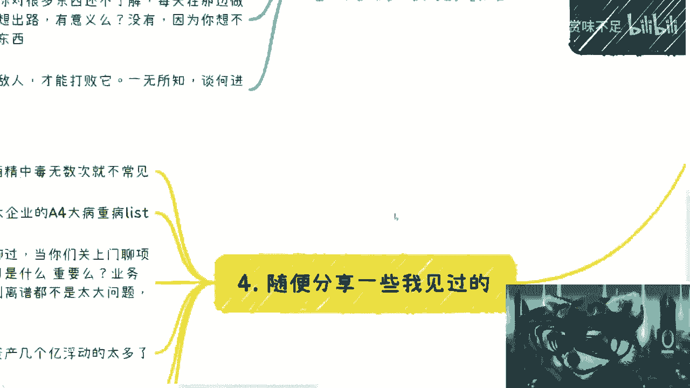

对吧，对吧。

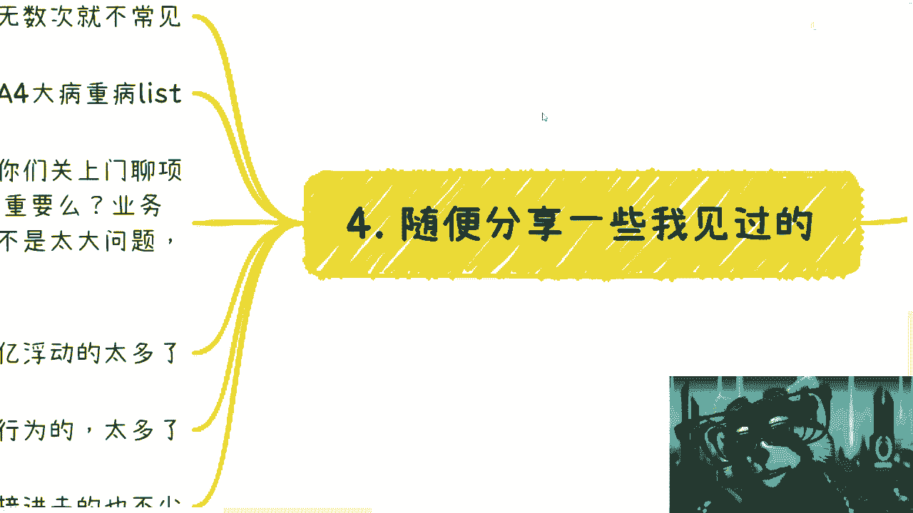

然后呢这个说到这个，我随便跟你们一起分享一些我见过的，或者我自己做过的对吧，比如说喝酒大家也都知道对吧，之前我们谈喝酒文化也说过啊，喝酒呢是常见的，但我跟你讲，1年当中酒精注读无数次。

可能对大家来讲也不常见，但在商业里面很常见，为什么，因为你要跪舔，因为你要拿单子，对不了，怎么办呢。

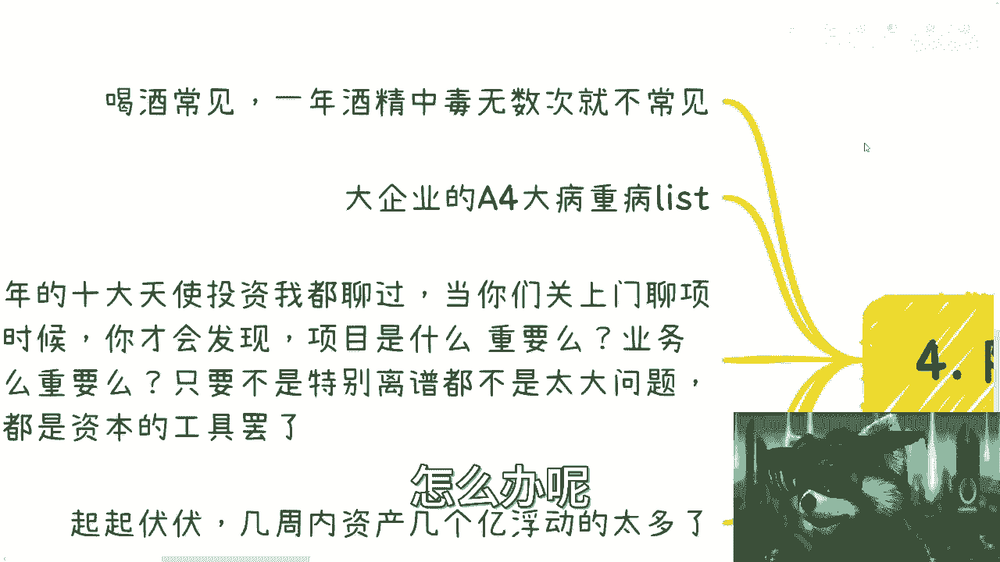

作为普通人不就是这样子吗对吧，然后是大企业里面那种a4 纸对吧，八九页，十几页的大病重病list，谁看到谁他妈的都，对吧就很共情，但是这就是事实，但是资本家关心嘛呢，不关心你，对不对。

他可以给你们一些企业医保，或者给你一些企业保险，又怎么样呢。

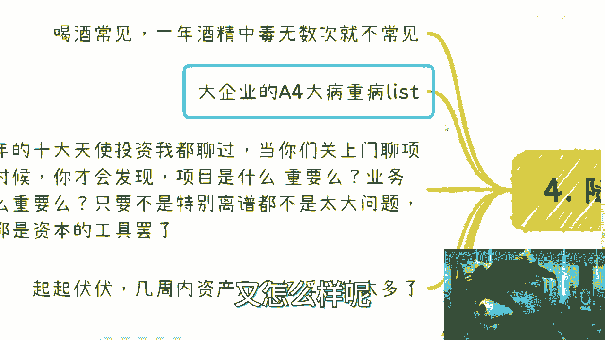

又怎么样呢，对不对，然后前几年18181919年的时候吧。

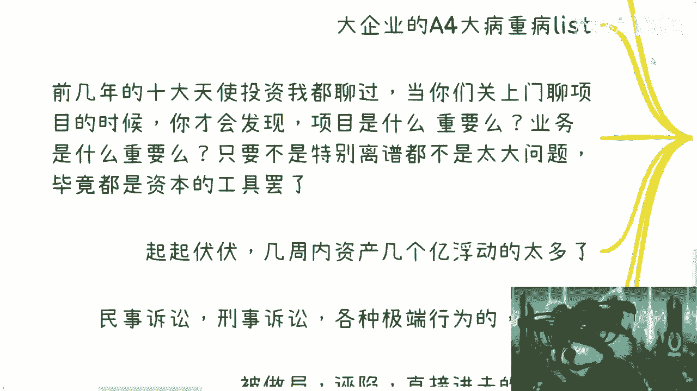

我把中国前十大天使投资我全部聊过一遍啊，当时因为做项目对吧，我跟你们说，当你们关上门去聊项目的时候，你会发现项目是什么重要吗，不重要啊，业务是什么重要吗，也不重要，你是谁重要吗，也不重要对吧。

只要不是特别离谱，都没有什么很大的问题，你知道吗，就相当于说你但凡各个角度，比如说什么业务逻辑啊，流流量逻辑啊，盈利逻辑啊对吧，商业逻辑各个方面你只要满满足60分结束了，那接下来你就是工具人，为什么。

因为接下来资本要跟你谈的就是，怎么帮他们赚钱对吧，怎么变相的帮他们赚钱，你会发现他妈的自己赚不到几个钱，还要背风险，这不就是资本吗。

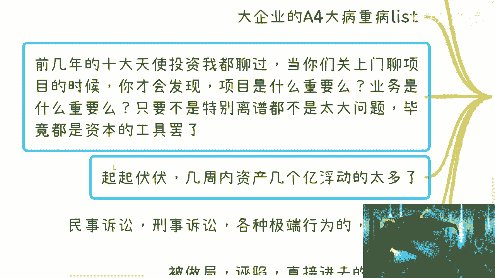

你那那那那话又说回来了对吧，有人要说了，于老师，你不是说你这个对吧，不行就拒绝对吧，或者怎么样对，没毛病对吧，但是你面对这种整个大框架的时候，你可以啊，你要么就选别的方向，你别你不要去融资，对不对。

你去别的方向也可以，但是你但凡选择某一个方向的时候，你还是要去遵循这个规则，因为你没有能力改变这个规则对吧，但是问题在于，我觉得就是说这种时候你是有选择性的对吧。

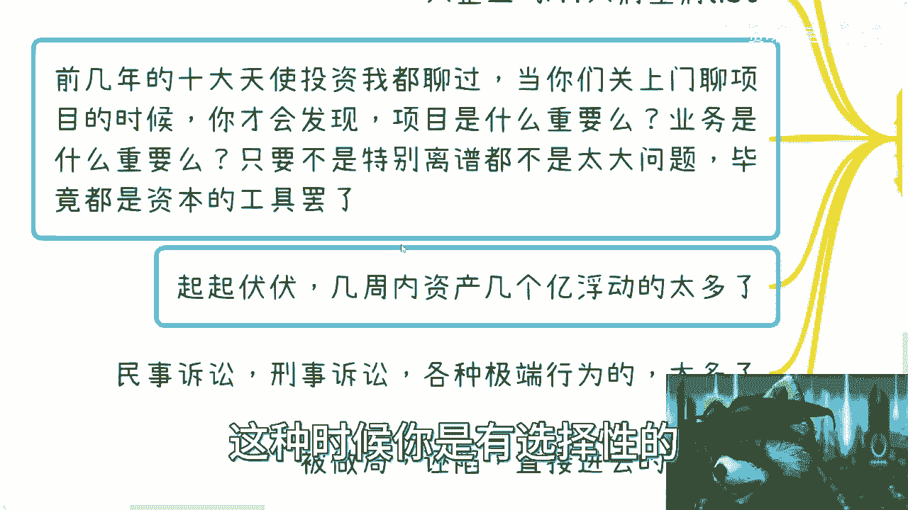

你不要说你在一个打工做电池的层面说，哎我现在没有拒绝选择对吧，我就不拒绝。

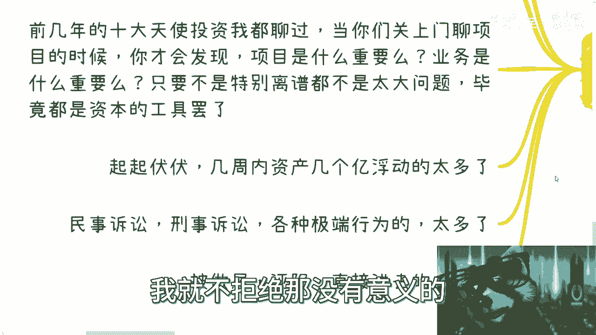

那没有意义的，那你永远就在那个地方对吧，然后还有什么。

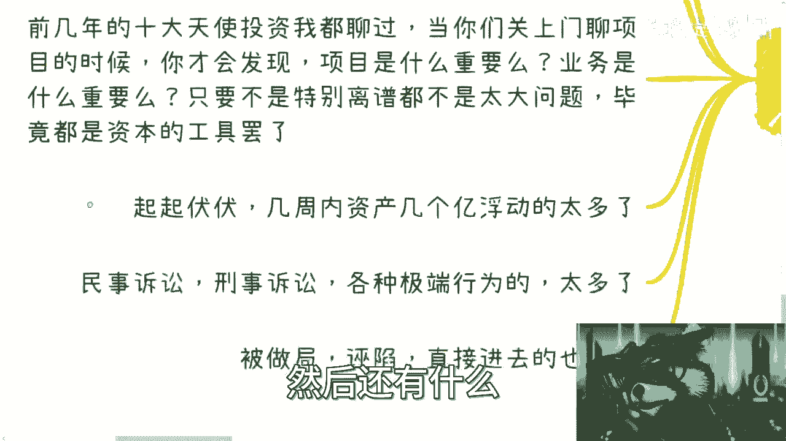

还有我们这种身边起起伏伏对吧，几周内资金资金资金资金量对吧，几个亿上下浮动的也很多，就这这周可能几百万，下周几个亿，再下周几10万。

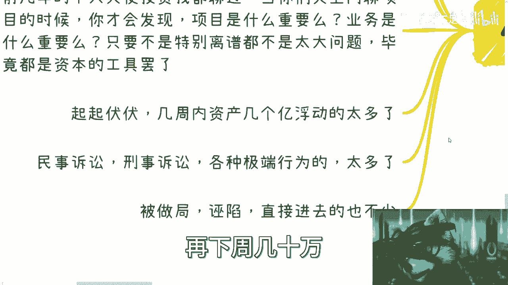

就这个样子的，这算什么呢，对吧。

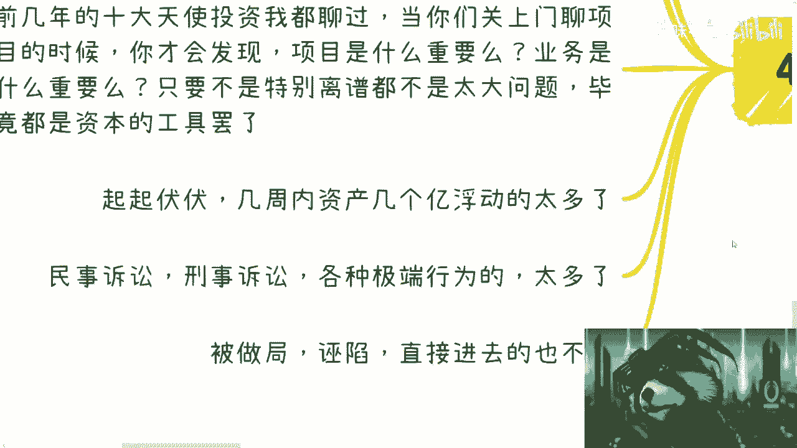

那当然我不是想告诉你们资金量，我想告诉你们这背后这背后有多少对吧，抑郁有多少，精神崩溃有多少对吧，还有什么，还有还有我们我们进来之后，商业里面你碰到最多的是什么呢，民事诉讼，刑事诉讼。

各种极端行为多了去了，我这边就不方便展开了，展开视频都没了，对不对，这叫世界啊，你啊你每天在那边说啊，我每天在那边加班，明白吗，每天这个和同事你来我往啊对吧，这个貌似过招对吧，这个这个你来我往对吧。

一顿操作猛如虎对吧，每个月稳定的拿份工资，这他妈叫什么啊，这这叫幸福的生活，对吧，还有什么，还有就是被做局诬陷的对吧，直接进去，我身边也不少。

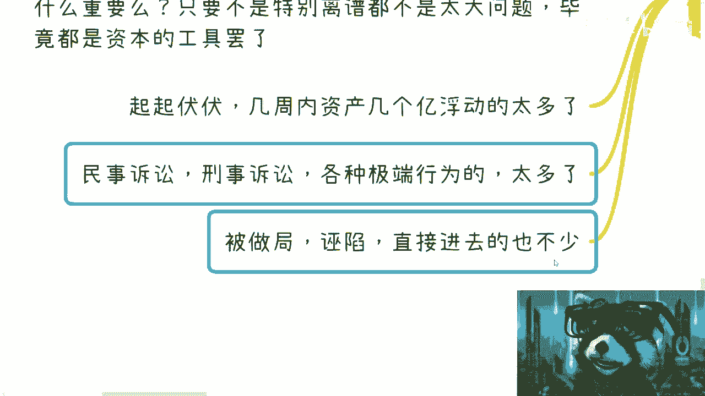

就其实是就是这个样子的情况。

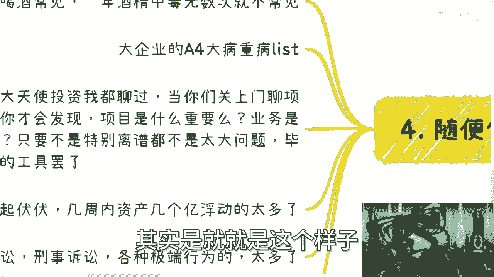

就是我还是那句话啊，所有的人啊，我我觉得大家在沟通问题的时候，不要去过于的解读啊。

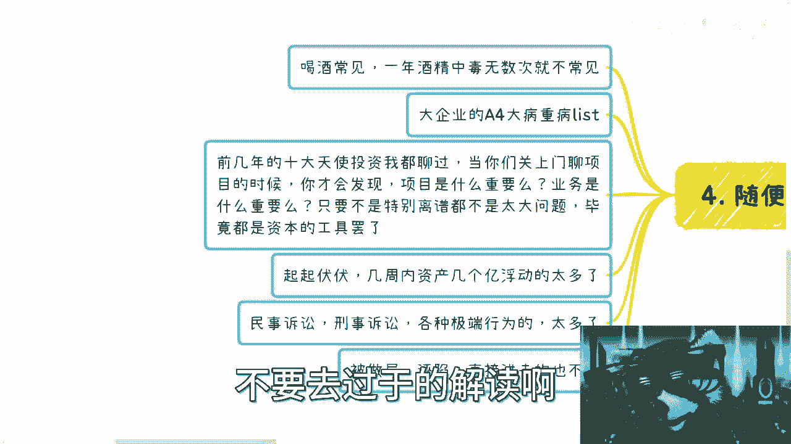

这到时候又要说了，哎刘老师跟我们说了半天对吧，这个这个要跟我们说一些有的没的对吧，要说这个黑暗的故事是吧，没有呀，我只是很客观的告诉你们，商业是什么样子的，你会碰到什么事情对吧。

包括大家对很多东西没有认知，过于幼稚对吧，这跟你的年龄，跟你的工作年限没有关系，就这么简单。

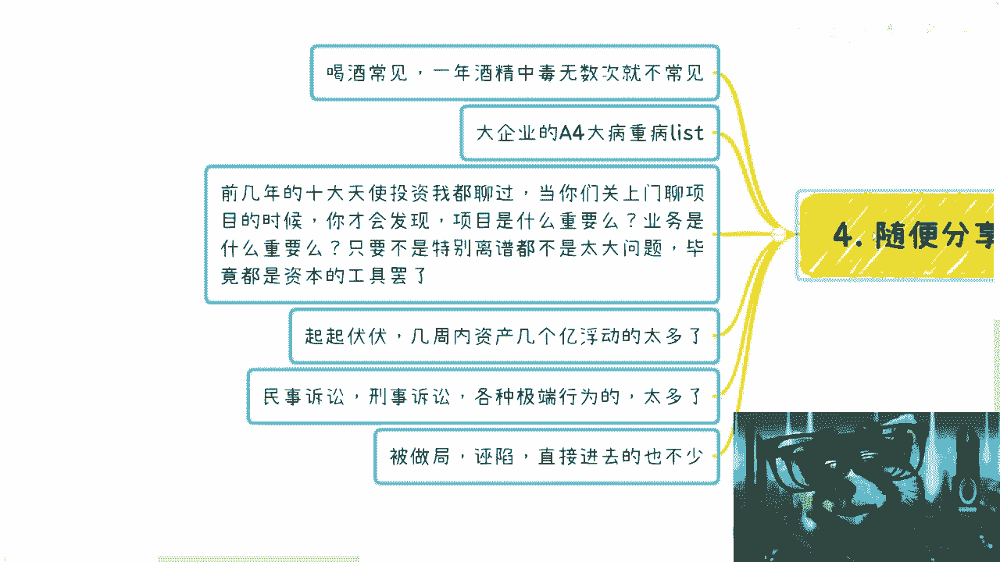

你说你说你是提前对这些中学有认知呢对吧，有些心理准备呢，回头不至于被坑呢，还是说啊非常天真无邪的傻白甜的。

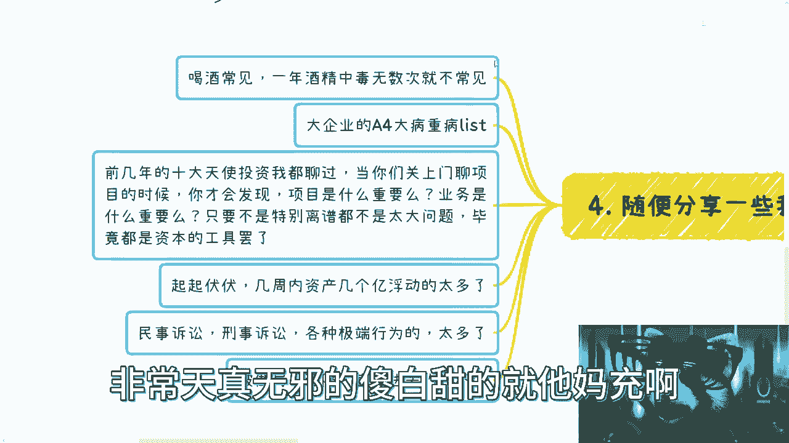

就他妈冲啊，all in对吧，然后被坑在家里不认识，你选择哪一个呢。

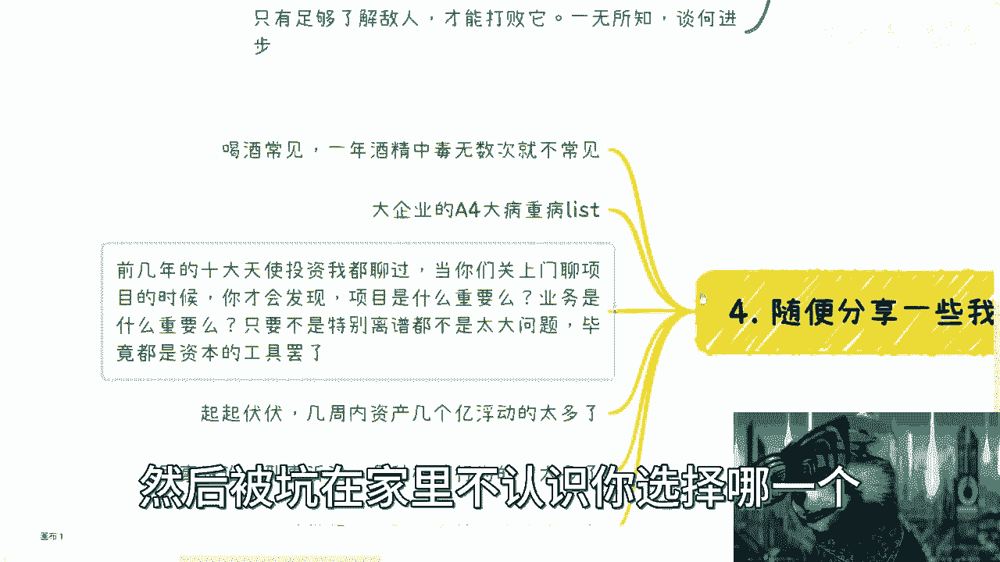

是不是，所以啊所以我这个地方早就说了，为什么就说商业这边如果大家要去做对吧，包括大家很多人说哎我不是要做兼职，我要做兼职啊，我要做别的东西，我不管你做什么，其实都是商业行为，对不对，你但凡要去做。

你就尽早去做，不管是从你的这个时间，时间成本也好，精力也好，包括你的这个这个学习能力也好，你肯定是越年轻做越好，年纪大了，你你去做怎么做法，你折腾得动吗，对吧啊，所以我跟你们说，尽早你要去接触三角。

接触三教九流，尽早的各个城市，看看中国每个城市，我跟你讲都不一样的做事情方式，无论是活动，政府企业，大家的爱好都不一样的，尽早去看看，尽早去看看大家的操作手法，尽早尽早去看看别人怎么包装的。

你才知道怎么做，你知道吗，你对吧，你说你说你整个地图都不打开，你你你都你都不去了解你。

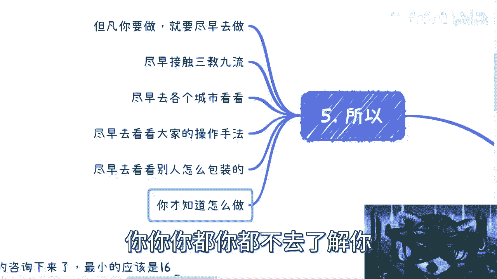

你就在那边yy时候怎么做，没有意义的呀，你知道吧，工作这个东西没有用的啊，你也别指望你们工作上的所谓的leader，所谓的manager，所谓的mental能给你们说，他们也不懂啊。

他们能跟你说什么对吧，但凡我跟你们说，你们在工作当中碰到一些人，他们如果懂的，他也不会来跟你讲，就这么简单，因为世界规则运作规则就是这个样子的，谁会来跟你说对吧，你们关注我的时候，我都会有一条自动回复。

叫什么叫做我的确认为我从很多年前就说过了，我就是一个比较少数的对吧，愿意来跟你们去做这么一个，客观分享的这么一个人，当然我不能说之一啊，我不能说唯一的一个，那肯定是之一对吧。

我给你们的自动回复里面写的很清楚之一对吧，其实本质上是什么，我相信这类人还是很多的，但是问题在于，第一大家一生当中能不能碰到这类人，第二这类人能活多久，第三这类人的信息发出来能不能真的被发出来。

无非就这么一些，都是天时地利人和对吧，别去不要把很多东西想的太美好，也别把很多东西想的太，就说就是太极端，那我觉得就是要客观的去看待了解，然后看待，而不是说自己在那边想想是没有用的。

因为想只会无限的放大美好和邪恶，没有用的，哎呀我今天这个眼镜戴的有点多，有点晕是吧，差不多差不多我出出门吃饭啊，这个出门赴约就这样好吧，有啥这个你们反正私讯在咨询我呗，啊，走付费流程。

