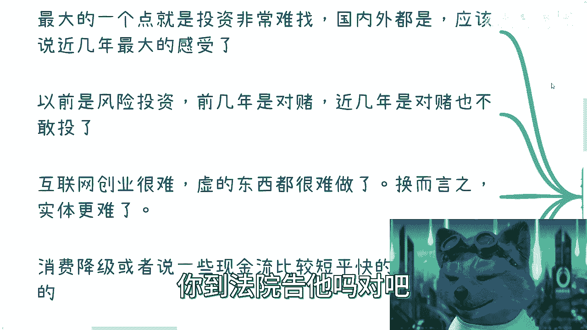
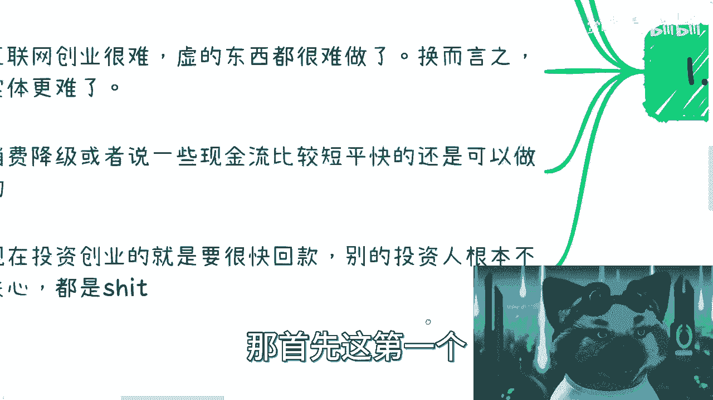
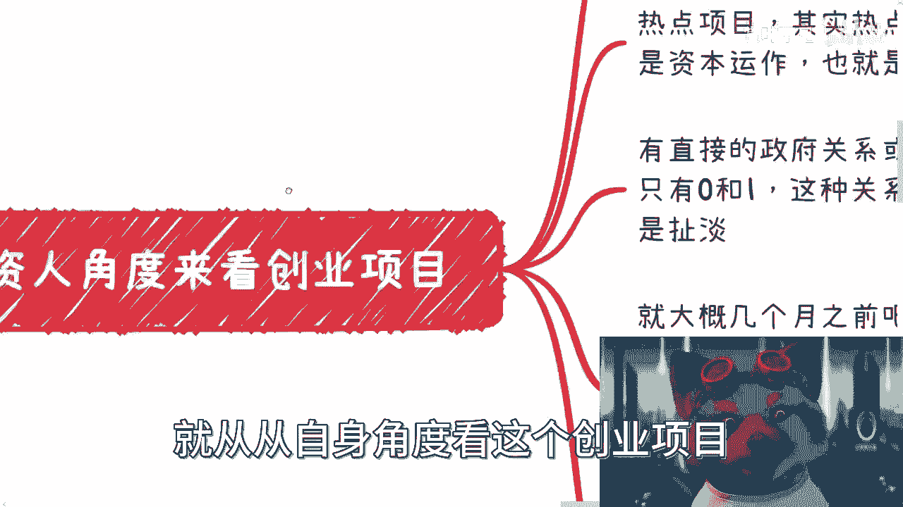
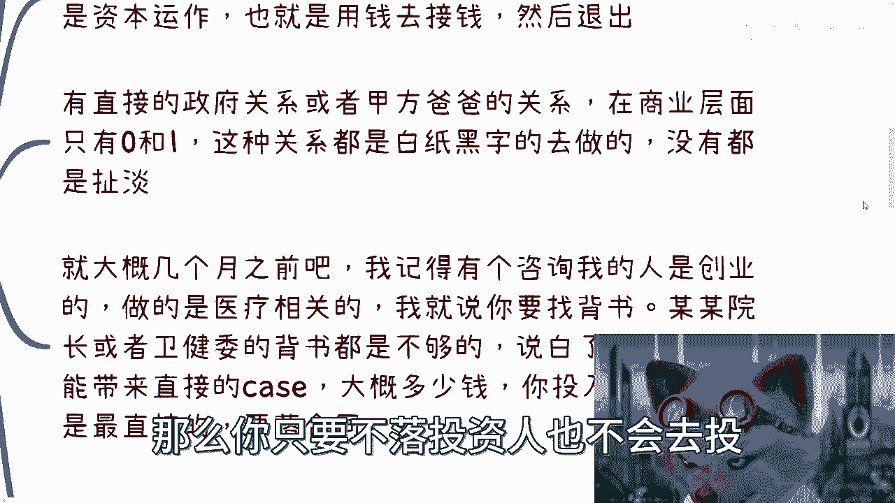
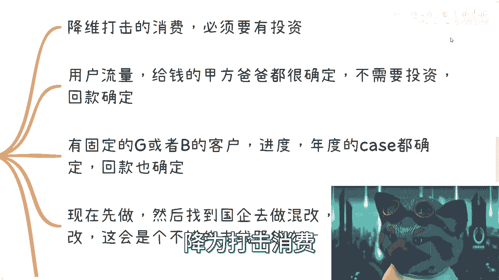
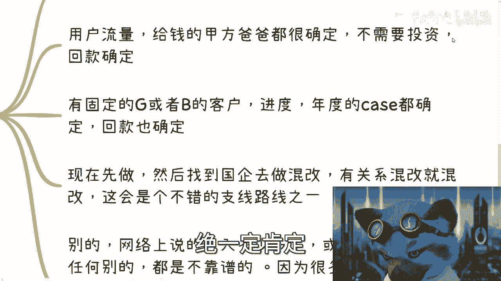
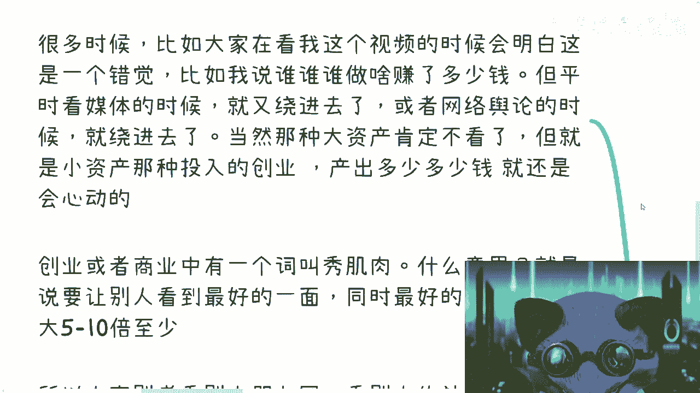
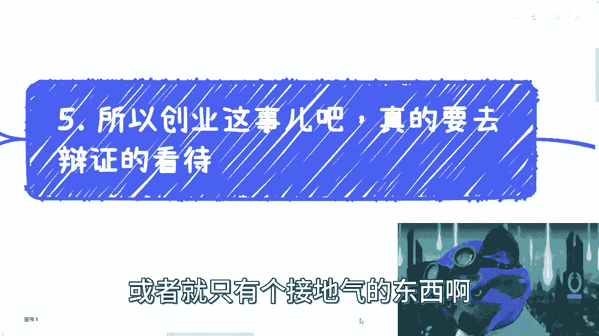

# 拒绝电池思维——来正面的聊聊创业这个事儿 - P1 - 赏味不足 - BV1As4y1c7KG

啊啊大家好啊，这个7月9号晚上直播，现在跟现在这里跟大家说一下啊，别到时候这个这个叫什么，首页上面的这个内容没看到啊，呃昨天晚上有小伙伴啊也提到了，说我们一直说不要创业，不要创业是吧。

就跟三体里面说不要回答是一样的啊，呃但是没有正面的去说过对吧，那我觉得是需要单独说一下啊，就创业这个事情呢，呃在这个地方我写的很清楚，就很绝对对吧，就是说你家里没有矿，没有关系，你就别去做啊。

就这么简单，就是你死活，无论你说就是无论对方跟你说的多么好，反正就别去做，而且大概率你也没这个能力做啊，为什么呢，我们来看啊，首先创业跟前2年的这个区别啊，第一个就是啊最大的这个点呢。

就是说投资特别难找啊，就国内外都是一样的，就我最近了解下来。

基本上就是近1年啊，近1年多2年时间都很难找，这个应该说近几年最大的感受啊，呃而且呢是这样子的，就是呃我就这么跟你们讲，就是学历啊，各个方面啊，就是说我可以这么说，处在不同阶层的啊。

就不同阶层学历的这些人，或者怎么样，就给给予我现在的这个反馈都是一样的，就不是说大家觉得啊，这个呃我好像啊，这个这个这个因为学历不够对吧，或者怎么样子，不是的，就是整个的一个面。

我了解下来，不管你多高都一样啊，这是第一个，第二个呢就是说以前都是风险投资，这里啊前2年是对赌对吧，这2年是对赌，也不敢偷了啊，那么什么叫对赌呢，就是说呃这个他跟你签这个投资协议的时候，他会跟你说对吧。

你比如说几年内达成怎么样的一个目标，如果达不成，你是需要啊连本带利还还钱呢对吧，或者怎么样子，但是为什么近几年对赌也不敢投了呢，是因为呃投资人也明白一点，就是对赌签了之后没什么卵用，因为什么呢。

因为就就是没钱啊对吧，那你能怎么样呢，你到法院告他嘛对吧。

没有意义的对吧，然后这是第二点，第三点呢就是说互联网创业现在很难是啊，互联网创业很难，其实间接的说明了一点事情是什么，就是虚的东西很难做的，你知道吧，就之前为什么说很多人说哎呀创业好像很好做。

或者创业很多人去做对吧，全民创业是因为你只要不跟实验有关的东西，它其实里面的这个水分其实是很多的，但是一旦这个东西的东西很难做了之后呢，换而言之对吧，就是说呃现在就整体都很难做对吧。

那实际就更别说了对吧，实体其实一直是很难的哦。

那么目前来看呢，就是说呃一部分的消费降级，或者说一部分这个现金流比较短，平快的其实还是可以做的啊，还是可以做的，但是这个东西也是取决于你到底家里有没有矿，你取决于你有没有关系对吧，你没有的话。

那那你很难做对吧，你现在投啊投资创业这件事情是这样子的，你们嗯就是别去想着说要找投资人，就像前2年说啊，他说他说很多，因为现在很多学生出来嘛，他其实就是对呃很多就是不太了解啊，他就觉得就是说啊。

我的模式就是我要去创业对吧，我要这个拉拉投资对吧，或者这个我导师怎么样怎么样，我跟你讲，你们现在但凡去找投资人没有用的，为什么，因为现在投资人也没有钱，政府也没有钱，就都没有钱，那么都没有钱。

他的本质是什么呢，就是说你做什么，我根本就不关心你哪里毕业的，我也不关心我，只关心就是说你的资源跟你的这个定位，能不能很快回钱，对啊，能不能给我赚钱，那换而言之是什么意思呢，就是说我投你100万。

你就告诉我我半年内能不能出200万，能出不了，那滚吧对啊，就结束了，那不关心你啊，就就有什么别的，有什么好关心的，就实践很宝贵对吧，他你要但凡我跟你讲，你现在跟投资人去聊，我就这么说吧。

你但凡什么一聊也聊一两个小时的，什么聊聊天，按照上海话来讲，嘎嘎三古代对吧，没有用的，我跟你讲，就就这种，你心里面要明白，就是他也没有真心实意想要投你就结束了，就大家就当喝个茶对吧。

聊个天，聊个八卦，那首先这是第一个。

第二个呢就从投资人角度看，这个创业项目我们要要怎么来看呢。

是这样子的，以前呢都说要背书对吧，要这个有人站台，要有明星团队，现在没卵用啊，因为你现在有背书，有站台，有明星团队嗯，很简单，你这个赚不赚得到钱是核心对吧，你先占占，就是就是退1万步来讲。

你有这些东西你也赚不到钱的话，那没有人会来管你，你知道吧，这是第一点。

第二点是你要么就是一个热点项目，要么就是一个那个炒作项目啊，也就是说其实本质上热不热点并不是很重要，就是整个这个资本这边他如果去投入热点项目，或者要去做一些炒作项目，他的目标就是资本运作。

所谓资本运作就是用钱去借钱对吧，也就是说我就是要就是进来进来之后，比如说我a轮我就退出了，哎别我不跟你bb那些对吧，我要是a轮进来，我就b轮退出对吧，你就告甚至是这样子的，你知道吗，就是你要去谈投资。

他会问你就说你接下来就是从你的关系链里面，他能就是它从你的关系链里面能不能看得到，比如说如果他现在投你天使轮对不对，那么他要去看的是你的关系链里面，有没有有那种资，就是就是叫什么资本。

或者来说这个能力的，来来接他a轮或者接他b轮的，如果都没有，那他没人会投的对吧。

然后要么是什么呢，就是你有非常直接的政府关系，或者甲方爸爸的关系，什么意思呢，就是说在商业层面本质上只有零和一，也就是说这种关系都是必须落合同，白纸黑字去做的对吧，别就是任何的那种什么哎。

我跟他关系很好对吧，我这边这个我跟他一起合作的对吧，我跟他什么什么样子的，包括包括就是说你的合伙人，你的那个就是说啊上级也好或者怎么样，我不关心他们是谁啊，那么听听局什么我都不关心的，你知道吗。

就是所有这些东西，你只要不落合同，不落白纸黑字，都他妈是假的，你知道吧，那么你只要不落投资人也不会去投。

因为你就扯淡了对吧，我就说你骗人，我就说你骗人了，你又你又你你没本事的呀，对不对，然后大概几个月前呢，其实有人咨询过我，就是他是一个创业的嘛，做这个医疗相关的啊，当时就说要嗯就是我当时给他建议啊。

就是说是要找那个背书嘛啊，然后当时说找那个背书呢，其实一开始沟通的时候呢，还不是沟通的那么顺畅，当时怎么说呢，呃当时是我的意思是说呢，你要去找一些这个院长或者说卫健委背书，这个东西是不够的。

说白了你要看的是这个院长或卫健委，能不能直接带来case，而这个case多少钱，多少时间回款对吧，然后他是怎么一个这个这个这个给你钱的对吧，然后你要投入多少成本对吧，你所有全部算清楚。

然后这些东西要落合同，这件事情如果弱完了对吧，包括你跟卫健委能签个战略合作对吧，这些东西全部合同漏完了，我知道ok你基本上就是背书这个东西，你说ok了，或者说你有你开始有至少有这个资本去。

可以找投资方要钱了对吧，否则你说啊我们这个什么，比如说我那个合伙人啊，是什么什么地方，以前院长退下来的对吧，然后我这个人呢，可我这个合伙人呢，可能以前是在这个卫星伟大对吧。

或者现在在卫健委的武术又怎么样呢。

你跟我说，别说魏军人，你现在跟我说，为什么，因为你你要跟你这个项目有什么关系呢，到你到时候他屁拍屁股屁股走人了，然后呢，如果我投你钱，我他妈日了狗了，对不对，我造的什么孽，对不对。

就商业层面永远都是只有零跟一的，也就是说你的合作，你就是要这个切切实实的其实非常坚定的对吧，就是这个东西在法律层面是落定的啊，你别老是靠感觉，靠感觉没有用，哪来靠关系更没有用，你知道吗。

这个关系要落到合同上，你才叫关系，你否则你这叫什么关系啊对吧，我们一直说商业闭环，商业闭环，什么叫闭环，就是你的受众哪里来，你要确定这件事情你要落到合同上，你的钱从哪里来，你也得确定要落到合同上。

就是你会发现你不管是去创业还是做副业，你都是要确定这种东西的，我给你们举例子，就像你们要跟我说，你们要做自媒体是一样的，你知道吧，你要去做抖音，做快手，做什么东西都可以，你知道吧，你跟我说。

你要去摆摊也可以，无所谓，我就问你嘛，你的受众哪里来，你确不确定你，你你要量化，你比如说你告诉我哎，我一个月能来多少人对吧，每个人消费大概多少多少钱，我大概投入多少，我毛利大概多少，你要有数据的呀。

哦你现在什么都没有对吧，你说我就要去做自媒体对吧，哦我我我我就要去做做做某个生意了对吧，哦上游下游都不确定你做什么东西啊。

对不对啊，那么三现在创业项目当中真的你全职啊。

我建议啊就是那么几种，一种是什么，就是降维打击的消费，可以的啊，比如说什么什么什么三四块钱的咖啡对吧，四五块三四块钱太便宜了，四五块钱的美食对吧，七八块钱的拿铁可以的啊，然后要往下沉一，下沉市场去做。

而一线市场做不了的啊，往下城市场去做降维打击消费。

但这件事情必须要有投资啊，没有投资，你别做做不了的呃，做的就是砸钱对吧，没有意义的表示第一点，第二点是你的用户流量，给钱的甲方爸爸都很确定，同时这种情况下你不需要投资，回款的周期，你也很确定。

那你就去做没问题的，你要很确定你就去做这个东西，就一定肯定肯定比你那个打工赚钱。

对不对，好，然后第三个有固定的g或者b的客户，他的对我这边写错了，他的这个季度啊，不是你进度啊，比如说季度对吧，或者月或者年度的case都确定回款，也确定对吧。

回款多少钱，也确定，那你就做啊，然后你这2年做准备做做积积电，做做积累，做做准备什么，你后面2年肯定是能厚积薄发的对吧。

然后还有什么呢，就是说你现在做一件事情，你们自己去查啊，这会是未来不错的一个支线路线好。

另外所有其他的啊，网络上说什么你做什么东西啊，月入多少多少，或者自媒体或者任何别的东西，都是不靠谱的对吧，包括那包括就是又回到我们说就说知识付费啊，就是那些什么什么什么什么。

你们家的小那个知识星球或者别的东西，你们自己想想看，所有家的东西为什么说不靠谱，是因为他就算给你完整的方法论，他就算给你完整的这个这个东西，对你自己来讲，你的流量跟付钱的甲方爸爸，你还是不确定的。

没用的呀，对不对，你知道吗，就是说你整个商业闭环是不闭环的对吧，就是我这边写的很多人做业务，它的上游也不确定，下游也不确定对吧，你你你空有自己的东西，那我就说嘛，你能做到地球上他妈这么多人都能做。

那凭什么你能做出来的，没有道理的呀，对不对，包括你自己商业思路也不清楚对吧，也不果断，所以说很多事情做呢，你从一开始做就注定是失败和要被割的，你知道吗啊这个是三四呢。

就是有哪些错觉啊，这个地方我也写，就很多时候呢，比如说大家你们在看我这个视频的时候，你可能会明白啊，比如说这是一个错觉，比如说我跟你们讲，我说谁谁啊做什么赚了很多钱啊，你们肯定就觉得啊这个不屑一顾对吧。

而且这个假的啊扯淡啊，但是你平时看媒体对吧，或者说看舆论的时候，你就会被绕进去，为什么呢，因为你你就没办法嘛，因为很多思维没有，就大众是没有深入到自己的，这个这个这个这个默认的潜意识当中呢对吧。

也就是说那种大资产，我相信大家不会去看对吧，就告诉你什么啊，今天这个人投了一个亿，什么赚了500万对吧。

你们不会看的，哎但是反过来说，如果今天舆论或者今天这些知识星球告诉你们，哎这个人比如说投了2万块钱啊，学了个什么东西啊，然后以后月入2万对吧，那哎我跟你讲，很多人还是会心动的。

你别管这个东西听上去多么假，他还是会心动的，就这么简单对吧，这是第一点，第二点是创业或者商业当中有一个词叫秀肌肉，什么意思呢，就是说你要让别人看到最好的一面，同时可能在最好的一面。

还是放大了五到十倍的对吧，也就是说不是说所有的东西都是假的，而是说啊就是就是就是包装嘛，你知道吧，就是包装就是修饰，就是用各种擦边的这种手段。

我给你们举个例子，你就像你就像我跟很多人说，做活动啊，你怎么宣传，比如说今天这个活动你就来了20个人对吧，好就20个人啊，然后呢你宣传的时候你可以这么说，你说哎通过了这个网络的手段啊，通过了营销。

我们这活动呢啊今天覆盖面覆盖了1000多人，覆盖2000多人，对不了，那覆盖多少人，谁知道呢，反正你现在就来了20个人，但是你给别人效果觉得卧槽你牛逼啊，对不对啊，就这个样子的。

所以呢就是我在这地方也写了，就是大家别老去看别人朋友圈，别老去看别人社交，发什么没有用的，因为所有的社交所有的东西啊，在在商业层面它都是包装，就他都是带有目的性的啊，除了你会让自己焦虑跟嫉妒。

没有别的作用，其实咨询到现在也有很多人跟我说过，就是身边的同学怎么样怎么样啊对吧，这个就好像就感觉就说别人都很成功，自己好像就很失败，你知道吧，但是没有意义啊，你知道吗，就是首先别人成不成功。

你也不知道，对你单靠，别看单靠别人的一个朋友圈，单靠别人的东西，你能判断吗，你也不能判断我单靠，你跟我讲，我就更不能判断对吧，我就觉得一切都是假的啊，但是呢你跟我说你很失败，这件事情我觉得你也不好判断。

为什么呢，因为其实咨询下来，我发现很多人的手上的牌是不错的，你知道吗，但是就是我我觉得，其实很多人对整个基本盘了解不够，同时呢也不接地气，其实就是说本来他是过得蛮好的，他非要觉得自己过得不好。

还有一种人就是说他其实手上牌不错呢，他非要觉得自己好像手上没什么牌，你知道吗，就很奇怪啊，那么这个呢也是，其实也是这个就我咨询的时候，能够给他们带来的，就我相信相对来讲。

我要告诉他们你们这些牌怎么去打嘛，对不对，那么还有一点呢也是非常奇怪的，就是比如说nba能给我带来人脉啊，大公司能给我带来人脉哦，他是什么某某某什么活动，某某什么东西能给我带来很多关系，对吧，没有用的。

你知道吗，没有用的，就是这些东西就是我们说怎么说呢，就是比如说nba其实也是个商业性on商业行为，大公司要去招人，对不对，那么某某某这些活动啊，或者大会，他也是个商业行为，他之所以要去散播很多这种消息。

就是为了要让自己的这个商业行为，进一步的去招生和进一步的扩大对吧，但是为什么我说都扯淡呢，是因为你会发现，就是这两件事情有没有直接关系有啊，不是有没有关系有，但你说有没有直接关系没有，你知道吗。

这就好像什么，这就好像张雪峰，前两天我记得他举过一个例子，我觉得蛮对的，是什么呢，就是我给你举打个比方，比如说我就告诉你，我说你买这个彩票啊，能这个有机会啊，能中五个亿，这句话有错误了，没有错的啊。

你是有机会中五个亿啊，但你觉得你中得到不了，不就一个道理嘛，我就跟你说，哎你来读我们这nba，你能够认识谁谁谁某某某啊，你带来人脉，你能不能认识啊，能对吧，有没有机会也有机会对吧，但是你说他对你的商业。

对你的这个未来赚钱能有没有影响吗，我只能说有，但是这概率极小对吧，因为很多人你们认识的，你们就会发现其实很多人是认识的吧，认识的他也就是躺在你朋友圈，躺在你的联系通讯录里面，一个一个一个一个丧尸。

有用了没有用的呀，啊你你到时候就说好，我花了二三十万，二三十万便宜了点啊，你花了四五十万对吧，读了个nba哦，然后呢就说好，我认我能带来人脉，你带来个啥是吧，还有呢，就最终呢。

我觉得这个世界每分每秒都有很多事情在发生，只不过我们不知道啊，而且95%以上的事情呢，哪怕是现在也是不透风的，就什么叫现在就哪怕是互联网发达的，今天也是不透风的，所以说呢就是说呃。

这个那个而且那95%的事情，多数可能都是负面的，或者说就是失败的案例啊，也是真正能给大家敲响警钟的，但是大家看不到啊。

所以说呢，就是说我们不能拿那5%的东西来去。

觉得啊，这就是一个呃基本盘，或者就是个接地气的东西啊。

那么最后一个呢就是说所以创业这个事儿吧，什么意思呢，就是说我知道啊。

现在很多人这个比如说b站的用户对吧，包括可能看我视频的小伙伴都很年轻啊，你包括这两天这个咨询我的，基本上也就是10 19 20岁左右的啊，我觉得呢大家都很年轻气盛，但一方面呢你如果没有足够的商业经验。

再加上对于现在的整个大的局势不了解的话，我可以这么告诉你，我可以就这个地方我可以很绝对的跟你讲啊，因为商业层面没有这么多的美好的事情，就是无论你什么学历，无论你有什么合作伙伴，无论你有任何的能力。

我可以说你都是失败的，你是不可能成功的，我可以打保票啊，这是第一点，第二点是我觉得啊我也是普通人，我跟大家都一样，我们不适合创业，我们一开始就要看清楚这件事情，我们没有这个能力啊，我们没有这个叫什么。

就是啊这个把这公司做大对吧，或者说怎么样做的，做的多多多么牛逼对吧，这个这个嗯我们还能把业务扩出去，很难啊，我觉得我要从毕业到现在，但凡去创业了，基本上就属于倾家荡产，就就这么简单。

因为这个东西很靠天赋的啊，真的很靠天赋的，很靠经商的头脑，很靠家庭的影响，你们要知道，如果你们家里面是已从小父母经商的，你会发现你们自己十几岁跟别人，十几岁很不一样的啊，同样的你们家里面父母都是公务员。

你们的十几岁跟别人十指也很不一样。

你知道吗，就现在咨询我的人，我发现，其实家里面就多多少少都还是有点背景的啊。

就是比如说要么就是小县城的公务员啊对吧，要么就是小领导啊啊，要么就是说是那个这个爸妈从小经商的，做跨境的，做外贸的对吧，很多很多是有的，其实我沟通下来，我也觉得就是说很多人，就是就是你不说他多有天赋吧。

但是他从小的耳濡目染这个出来，解释结果就很好，就他的思维就非常的怎么说呢，就是哪怕就是说他思维当下不够开阔，但是他是有意识明白说自己可能是不够开阔的，不像很多人就是属于那种，他既不知道自己不开阔。

还不愿意去承认啊，所以说呢我觉得就是这个事儿啊，啊这个事啊，基本上就是这么一个情况，而且不是短期，我觉得35年创业这个东西蛮直接的，我觉得35年这种时间都是一样的啊，好吧然后行就这么找吧好吧。

然后最后再提醒一下7月9号晚上那个直播啊，就我定了八点半，我怕八点太早了，八点半好吧，然后这个ok啊，反正大家同样的大家是这样子的，大家可以把手上的牌就自己有的技能啊，自己有的关系啊，自己有的东西啊。

就盘一下，盘一下之后呢，你们可以私信来跟我聊好吧，就是大家约这种呃，就约我这个线上的叫什么咨询服务好吧，因为我觉得很多牌对你们来讲，你们觉得有用的，但其实没有用，但反而有很多你们觉得没有用的。

其实很有用，但这个其实也是商业层面的信息差。