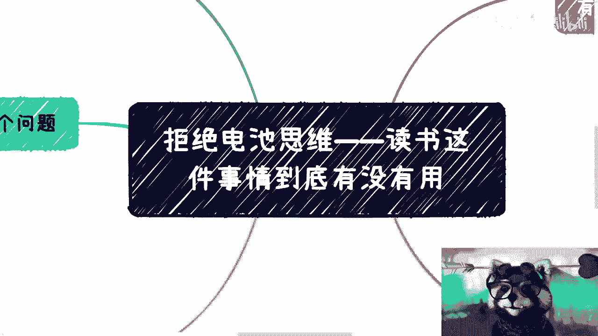
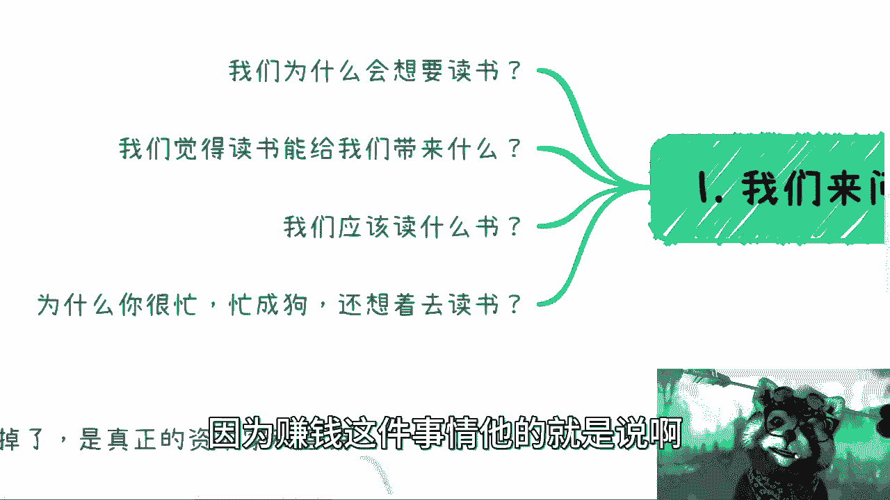
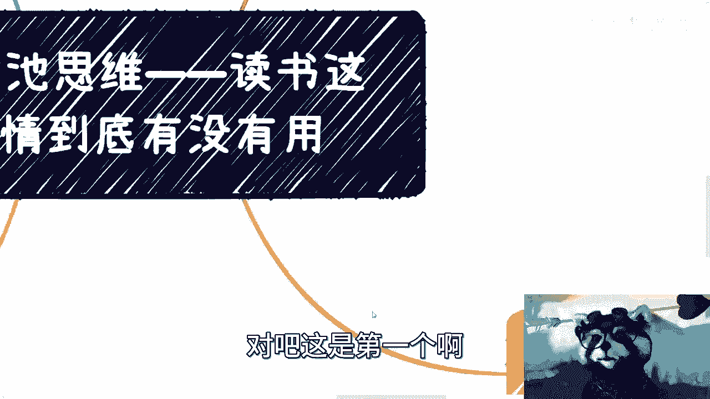
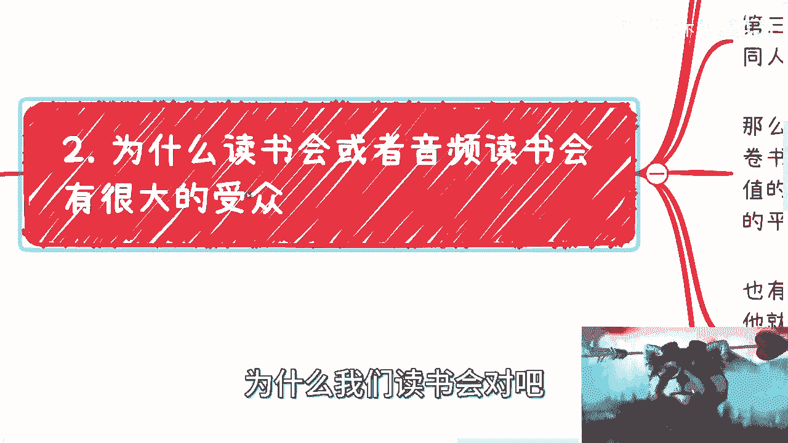
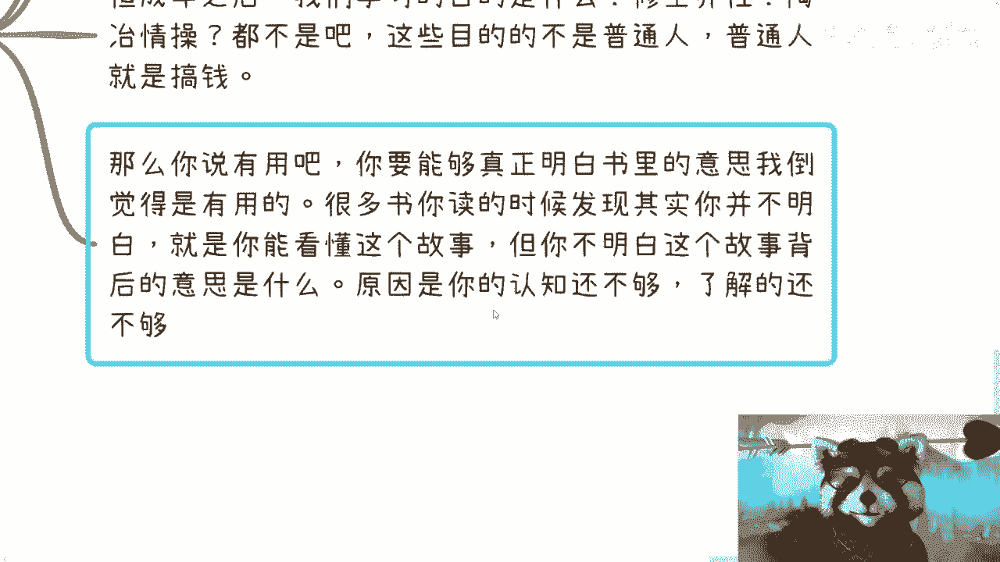
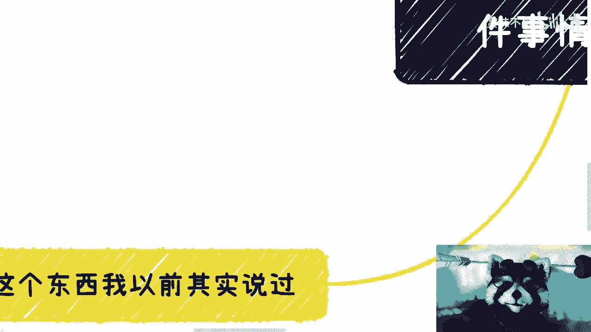
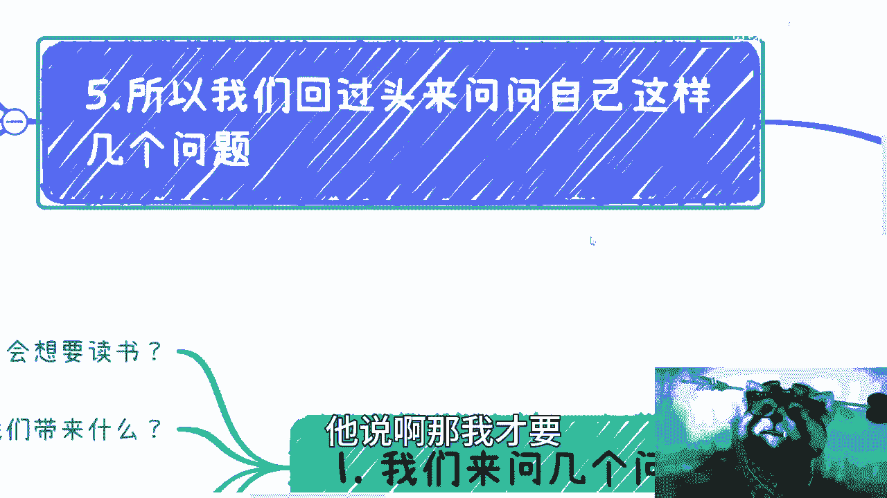

# 拒绝电池思维——看书阅读到底有没有用 - P1 - 赏味不足 - BV1dk4y1H72s

好大家好啊，礼拜天是吧，我今天麦克风没带，所以就反正这个收益大家这个见谅一下啊，啊继续来说啊，就是最近好多小伙伴都跟我说，这个读书这个事儿啊，然后私信的时候也在问我，他说哎我现在不知道怎么提升。

是不是我读书比较好是吧，这边的读书呢并不是说要去读个NB啊，或者NBA，更多的是指说一些啊这个书籍啊，首先我们先来问几个问题啊，就是第一我们为什么想要读书哦，就是比如说毕业之后对吧，你们为什么想要读书。

那很多人读书呢，你说读的是什么书对吧，到哪里去读书啊，读了之后想想要干嘛，对不对，第二就是说我们觉得读书能给我带来什么，那当然了，这个书中自有黄金屋，书中自有颜如玉是吧。

那很多人也会觉得读书啊能给我们带来知识，但是哎怎么说呢，就是我觉得大部分应该是90%，9。99999的，读不完之后其实并没什么卵用啊，那么同样的，也有很多人会觉得读书给我们带来平静对吧。

带来带来心理上的安慰啊，呃但是从我资本家角度来讲，我觉得不挣钱都是屁话是吧，那这是第二点，第三点是我们应该读什么书是吧啊，第四个就是说啊，为什么你很忙，忙成狗啊，还想着吃读书，这句话什么意思呢。

就是说为什么996007大家很忙，那空下来难道不应该娱乐一下吗，不应该，就是说去这个做一些人类应该做的事情嘛对吧，为什么说哦我已经忙成狗了，当然了，狗比我们幸福是吧，狗每天还能躺着晒太阳啊。

那为什么还要躺着读书对吧，我觉得其实首先先来问这么几个问题，我记得在之前所有的内容当中，我都提到过一点是什么呢，就是我们得要先尊重我们自己，我们得要先认为自己的时间是有价值的对吧。

那如果说你觉得啊我就是每天可以内耗，我每天在那边，就是就为了一些有的没的事情对吧，为了别人的，为了周边的事情而烦恼对吧，而内耗，那其实我觉得本质上是你自己，不尊重你自己的时间。

那么你就更别去谈赚钱这个东西，因为挣钱这件事情，他的就是说啊你得要非常高的自律性。

好合资趋利对吧，这是第一个啊。

第二个，那么问题来了，嗯读书对吧，我们也都知道，我就不点名了对吧，为什么我们读书会对吧。

或者说音频读书会啊，为什么，或者说很多平台出音频读书会有很大受众，我们来看一下啊，第一就是自驱力不够啊，简单来讲，就是说有很多人花个45万块钱去报个培训班，唉你说他能学到东西吗。

我可以告诉你肯定学不到啊，他能给到什么呢，就是一个大锅饭，就是就相当于是你的老师对吧，每天早上啊来催你一下啊，这个上课了，你要读书啊，你每天干嘛啊，然后他就觉得很很爽是吧，但我也不明白。

你觉得这个东西很爽，同时自己又不挣钱，还要给别人捐钱，我也表示不明白啊，给别人送钱是吧，这是第一点啊，第二点是的确很忙，没空读啊，所以就参加读书会呃，看到其他人读后感就或者说就是听书对吧。

那这种就是说啊就是那种书呢也没空读书啊，感觉听了读书感就是读后感就是读过了啊，这就好像我去买一个游戏对吧，一直说我买都买了，我哪里有空玩呢对吧，根本不需要玩，买了就是玩过的是吧，嗯吊也是吊啊。

这第二点第三点呢就是说这是一种大锅饭啊，这个就就跟很多人吃饭是一样的，他说哎我就觉得大家一起学比较爽是吧，那一个群400个人对吧，跑进去399个人都是托是吧，那他不但能看到不同人的读后感。

还能够快速的去阅读这本书是吧，这是他的目标啊目标，那么问题来了啊，嗯我表示我不太能理解，因为我作为一个资本家啊，这些东西对我们的价值是什么，我表示我非常不理解哦，你所谓读万卷书，你不会变现。

我请问你有什么意义，好，那有的人就跟我说了，他说啊这个呃吕老师，你这样说不对的对吧，你这种属于没有人生这个什么心理上的追求，精神上的追求，那我想告诉你是不好意思，我觉得当下这个社会对吧，生存都很难了。

你跟我说精神追求，除非你除非你就是财务自由，别的你别跟我逼逼，对不对，也别来跟我，我跟你说啊，就是有很多人也很搞笑的，就是那种哎呀我不追求这么多的对吧，我就我就追求心理上的平静，哼我就想说，人生在世啊。

你可以不结婚，你可以不买房，你可以不买车，你有父母要养吧对吧，你父母未来生病了怎么办，你自己生病怎么办，我跟你们说啊，很多时候对吧，你们没什么事，大家没什么事，站着说话都不腰疼，但是我可以告诉你们。

很多时候人生的这个过程当中，你一定会有一个瞬间一定会明白，你如果不是说你没有钱会怎么样，而是说你会觉得有钱会能够避免非常多的矛盾，避免非常多的消耗，非避免非常多的这种情绪，我就问嘛，你活着是为了什么。

难道不就是为了让自己开心一点嘛对吧，你说很多人跟我说，哎呀怎么我就我就现在蛮好的，怎么样，你现在蛮好，是蛮好，以后呢对吧，唉真的，我就觉得这是大部分人脑子啊，单细胞生物啊啊我们继续来说啊。

其实有的人真的是有价值的，比如说什么，比如说他们会把读后感写下来啊，然后就放到不同的平台去拿评论激励，唉我觉得这个人价值挣钱是吧，没毛病啊，第二个呢就是说也有的呢，他们就是拿读后感来变现。

比如说呢比如说打个比方啊，比如说某某某他做的是精读啊，但他自己的确没空，怎么办呢，他就到H到观点钱，打个比方四五百块钱啊，拿大家的读后感，然后呢自己再做个短视频啊，告诉大家这是我读的。

那这个时候他有可能就是说，在这个视频里面再带点货，那么他就可以把A渠道这边，花的钱远远都赚回来，对不对，我觉得没什么毛病啊，在商业战场上面没有什么对和错的事情，我跟你们说，哎呀道德观太高没有卵用。

我告诉你们，所以说呢你要有模式啊，没有模式其实都是假的啊，那我觉得这个是第二啊，三那么核心来了，读书真的有没有用，好在这个地方再三强调啊，我不是说9年制义务教育和高等教育的，这种读书啊。

我指的是毕业之后的啊，你们去读一些商业的，或者说啊看点书啊，那么肯定有人要有人要问了，他说吕老师你敢说没有用吗对吧，你敢说读书没用吗，是吧啊啊咱们来看啊，成年之前的教育，我觉得更多是一些技能类思维类啊。

养成你的一些这个方式方法的啊，呃资本技能类的一些教育，这些书呢我觉得是有用的啊，这个毫无疑问啊，呃你说有多大用，咱不去说他，因为每个人情况不一样吧，有的人读的很好，有的人不足不足的不好，那这个是第二点。

但成年之后呢，我就问嘛，我们的学习目的是什么，你跟我说休闲养性，陶冶情操，这些是有钱人的事情啊，这些是对生活不那么这个叫什么，就是焦虑的人啊，但这些人我相信我们不是这些人对吧，你就算我的。

你就算我在上海新天地这边买好房，我到现在都很焦虑，是不是啊，都不是，这些目的不是普通人，普通人就是搞钱对吧，你别跟我逼逼，别逼逼别的，有什么意义呢，没有意义的对吧，我跟你说，但凡现在很多人跟我逼逼别的。

我觉得你只有两种目的，第一种就是你就是在是那个站着说话不腰疼，那你就是对吧，就就就就反正想法就不成熟，第二种就是我感觉你要割我是吧啊，那么我说你你说有用吧，你能够真正明白书里面的意思，我觉得倒是有用的。

但是很读书，我跟你们讲，比如说你们很多人都会去读什么啊，富爸爸穷爸爸对吧，然后看看一些东西啊，很多书我跟你讲，你读的时候，其实你能够看明白它里面所讲的故事，但是你不明白这个作者当时讲这个内容。

他想表达的深意是什么对吧，就但凡你不你不明白背后的深意，其实没有用啊对吧，这就好像你看过故事会，那我还不如看故事会呢，你说是吧啊，我跟你讲，很多时候我们读书，不是说我不告诉你们读书没有用。

而是你们的认知不够，你知道了解不够，对这个社会，对这个世界就了解不够。

你知道吗，你看书没有用啊，你看了不明白啊。

对吧啊，那这个时候又有人又有人说了，他说啊，那我才要嗯嗯我五了六了哦。

这里那这个时候就有人要说了，说啊那我们才要去参加读书会呀，什么东西啊，哎呀真的是绝了，你以为读书会真的是给你读书用的吗，读书会不就是他妈商业行为给出来割你的吗，啊哥哥们姐姐们啊，我跟你讲。

出版物这个东西早就烂了，你知道吗，就就我觉得很多人吧就是被父母啊，被被老师啊，被高校啊，PUA的啊，出版物这个东西早就烂了，是真正的资本家跟营销的工具，你知道吗，你们就大部分人，如果你们到现在还觉得。

书是一个非常牛逼的东西，我跟你讲，你们就等着被割啊，呃然后第二点我们来说一下原因，一方面近10年以来审核其实越来越严，你明白审核越来越严越严，什么意思吗，就是说真正的东西是很难在书里面体现出来的。

你明白吧，因为省份是不过认知第一点，第二点是营销越来越重，但凡你们能买到的书啊，基本上你们在看里面内容时候，你们已经被PUA了，因为它能出版出来，这个东西一定有它的商业价值没了啊，你说有一个人啊。

这个写写一个这个唐僧一样的去取经吧，取出来普渡众生，有了没有的呀，不好意思，不存在的啊，这出版社他妈的要活着，出版社要赚钱的，你以为呢啊做慈善是吗，出版物这个东西现在就是越来越商业化的对吧。

我告诉你们就这样一句话，只要你们有钱，只要你们愿意出钱，一个月可以出十本，出他妈100本，作者都是你爽不了爽的呀，有卵用不了啊，我指的是对用户有卵用啊，对你当然有卵用啊，那当然那么很多人又要说了。

那我们读老读书可不可以可以，那么问题又回到那个来那个点子上面，你读的懂吗对吧，另外书中很多东西其实的确跟现在，因为社会是在发展，世界是在发展的，的确很多东西跟现在是有些脱节的，所以参考性是有的。

但可能已经不是那么大了，你明白吧，所以说啊我们回过头来啊，来讲这么一个几个问题，第一书，这个东西其实很多时候是一边读一边思考的哦，你有空有钱有钱对吧，那你一边读一边思考，一边去得出结论，这个得出结论。

需要需要结合你自己的经历跟认知的，你知道吧，他不是说别人讲什么东西就讲什么，这些没有用的，对吧啊，这就好像这就好像我今天就说，我说我作为一个资本家，我他妈就搞钱要你挑出来，王思聪跑出来说，你妈你对吧。

他妈钱不重要，那没毛病，对他来讲前世不足要对不对，那你每个人情况不一样啊对吧，你不能一棒子打死啊，所以说你看别人的东西有用了，没有用的呀，对不对，每天在那边刷短视频，刷刷刷那些有的没的，然后每天说哎呦。

我办公室办公室这边闹对吧，办公室这边同事很让我这个什么心烦心累对吧，有用没有用的，你所有纠结的东西跟你挣钱有关系吗，没有关系，那你在那边纠结干嘛呢对吧，包括这个读书也是一样的。

你书读了每每每一年读100本，然后呢，我请问你读出来什么东西来，你知道吗，第二点就是别人读书感对吧，读读后感，你听上去很有道理，你听上去很有道理，没有用啊，然后就没然后了，你知道吗。

这个事情我跟你讲这个事情，就好像我以前说朋友圈呢对吧，抖音啊，然后别的地方包括哔站，现在你首页刷到什么月入三四千啊对吧，躺赚对吧，别人跟你说，哎呀我们做电商很牛逼的啊对吧，我们做什么直播带货很赚钱的。

没有用的，真的我就觉得很好笑，你知道吗，第一呢这个事跟自己没有关系，第二呢我们都没看到对方的银行账户，都没有看到银行流水，你怎么就信了呢，信了之后又怎么样呢，这钱是你的嘛对吧，我不管你是焦虑也好。

嫉妒也好，还是怎么样也好，有用了没有用的呀，对不对，就是就是你的情绪每天在消耗你，然后过了5年，过了10年后，你还是一事无成，没意义的呀，所以说我才告诉你们，就不是说我要跟你们讲，你们不要去在乎网络。

不要去在乎读书，不要去在乎这个这个短视频，这不是我要告诉你们不在乎，是你们就应该不要去在乎，在乎他干嘛呢，没有任何帮助的对吧，包括我跟你们说啊，最近还有一些咨询人问我。

他说他说你觉得加一些这种大佬群有用吗，我说哥哥们姐姐们，你们可能不太明白所谓的大佬是什么意思，我说你可以加到一个群啊，我可以把你们加进去都可以，但问题是人家根本不会讲话的，人家也不会来跟你聊的。

你加进去干嘛呢，你是觉得你花了2000块钱加进去很有成就感吗，是吧，你这2000块钱捐给山区小朋友不好吗对吧，我就不明白了，你知道吗，就是这种就有种什么感觉，就是说最后我们刚刚说的花2000块钱。

就好像我跟大佬建立联系了，就约等于我是大佬，就约等于我赚钱了，但但是你赚了吧啦，没有呀，对不啦，这就是我们刚刚说的哦，我花了500块钱买了塞尔达，如果我不打，约等于我打了，我打了没有吗，没有呀对了。

我得到了精神上的愉悦吗，没有呀，对不对，就好像你跟我说，你一年读了100本书，对吧，哦买了100本书不读啊，阅读我读了100本书，蛮难的啊，嗯今天微博上说了一句话，我觉得真的蛮认同的。

他说很多普通人你知道吗，普通人最大的那个嘛就是这个阻碍的点，包括很多普通人最大的痛点，你知道在哪吗，就不愿意听真话，你知道吗，就明明已经是一个底层劳动人民了，明明是一个普通人，他还是不愿意听真话。

他还是愿意活在童话世界里面，然后拿着这个微薄的薪资，拿着父母的钱去被割，讲不听的，我跟你们讲讲不听的。

好吧，然后就是我们回到核心啊，所以我觉得回到核心是什么呢，就是说读书这个事情啊，我觉得你觉得有没有用，我觉得有用的对吧，你说读什么书，我觉得大同小异，但是前提是什么，前提是你得要有足够的经验。

足够的经历，足够的认知，足够的人生的阅历，你才能读出来的东西，而且一定要去读老的，新的，没什么好读的，所以说归根结底你跟我说，你说有什么书可以学习吗，或者怎么样，真没有啊，然后还有人问我。

他说他说啊有没有什么就咨询。

我说也问我，他说我讲的很多东西，有没有哪些地方是我写blog或者写什么东西，写出来的，我说咱们于情于理来说，我说你作为一个资本家，你会把你赚钱的逻辑写出来吗，没有吧对吧。

能写出来的肯定不是非常核心的逻辑对吧，这是第一点，第二点是你写出来就代表这个东西没有价值，对吧，因为免费的东西很多东西他和收费来讲，或者说他跟赚钱逻辑来讲，它就是不一样的，再加上商场。

商业战场这个东西它是一个就为什么叫战场呢，就是因为你做很多东西，背后有非常多的人在看着你，做很多东西，你其实动了很多人蛋糕对吧，然后你做很多东西，别人还会来举报你，我何必节外生枝呢对吧。

我给高校给政府讲讲课不好嘛。

是吧好吧，那我觉得所有东西呢都跟思维有关啊，就是跟你们的想法有关系，其实跟大家所说的学历啊，跟你们所说的那些什么技术好不好啊，我觉得其实关系真不是那么大哦。

你们觉得大的，只是因为你们对这个社会没有了解，对这个是对对对对，很多人怎么赚钱不了解，你知道吧行吧，就这么着吧，然后那个嗯对吧，同样的啊就是副业创业对吧，或者来说这个职业规划。

或者你们现在呃对未来的一些发展啊，有自己想法的，也可以找我这个确认或者怎么样，大家沟通沟通好吧。