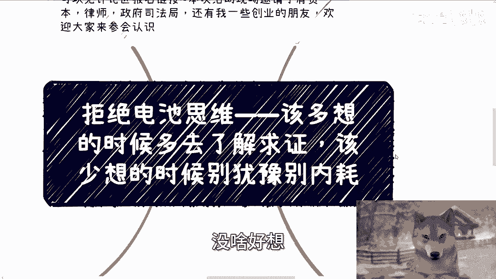
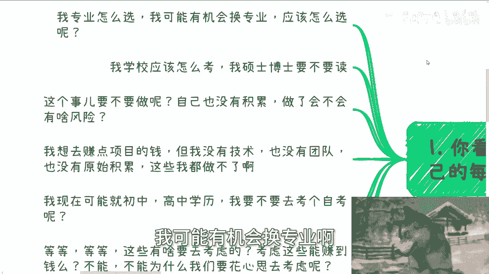
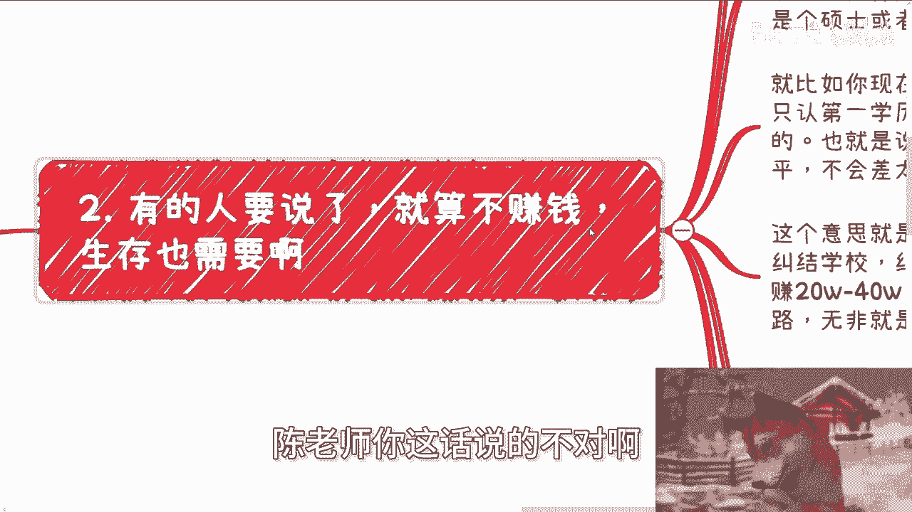
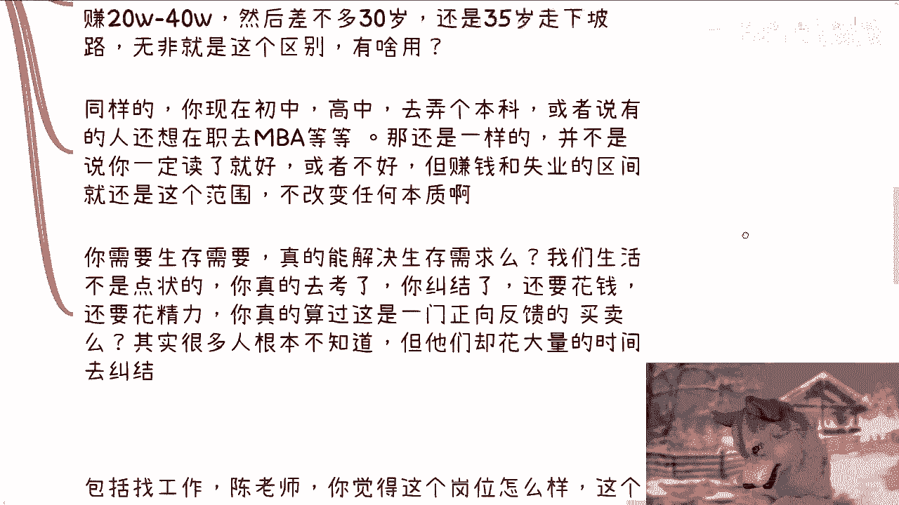
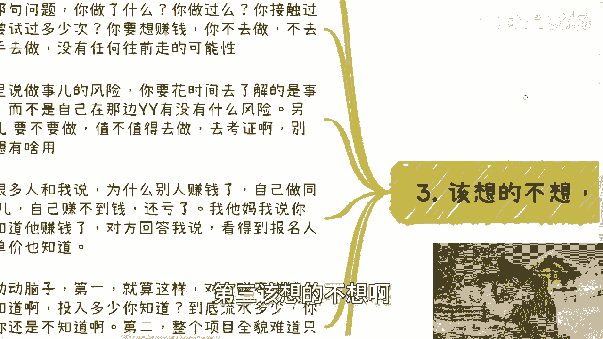
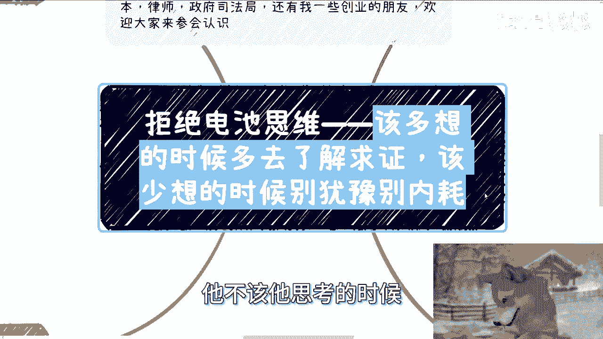
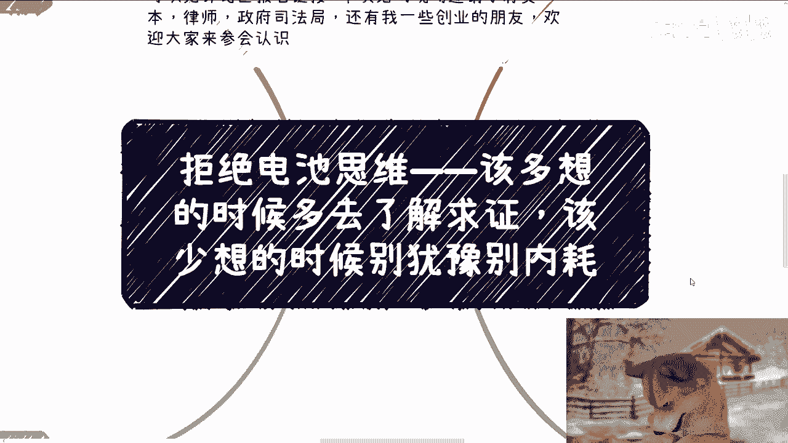

# 拒绝电池思维——该多想的时候多求证，该少想的时候别瞎内耗 - P1 - 赏味不足 - BV18bHqeNEF2

啊大家好，今天我们来，我来继续给大家增加一个拒绝电池思维啊。

也希望更多的人能看到之前这个专辑里面，其他的那些内容啊，今天我们来讲的呢是该多想的时候呢，多去了解求证啊，该少想的时候呢，别犹豫，别内耗，没啥好想的。

首先下一期活动已经定了啊，9月8号在上海，本期呢是2024年的这个第二期，数字经济大会，详细的话可以在评论区建这个报名链接呃，所有的议程嘉宾都在里面了啊，那么本次活动呢现场邀请了有资本律师呃。

还有我的一些创业的小伙伴好吧，欢迎大家过来多这个认识认识，首先第一个啊我觉得很简单，你看啊，所谓一直用普通人套自己的人啊。

每天在纠结什么，比如我专业怎么选啊，我可能有机会换专业啊。

我应该怎么弄呢，对吧啊，第二我学校应该怎么考啊，我硕士博士要不要读啊，第三这个事要不要做呢对吧，我自己也没有积累啊，做了会不会有什么风险啊，第四我想去做做点赚钱的项目，但是我没有技术，也没有团队。

也没有原始资本的积累啊，这那就说明这个事我做不了啊，第五呃也是很多人这个私信问我的，他说我现在可能就是个初中高中的这个学历啊，我要不要去考个自考等等等等等等啊，你要我说这些有啥要去考虑的。

你考虑这些能赚到钱吗，不能那既然不能，为什么我们要花心思去考虑呢。

哎我就不明白了，对吧啊，那有的人要说了，那陈老师。

你这话说的不对啊，就算不赚钱，生存也是要的对吧是吗，真的吗，是你们认为的生存还是真的生存，需要你们仔细想想看，我这样说啊，我不管你们现在是什么样的学历，也不管怎么样的一个一个专业。

我们假设是一个可量化的一个数据，你总归是有个分值的对吧，我们我我在这里先说啊，咱们不是说啊有什么学历歧视啊，或者别的东西啊，我们就客观地说，比如说你今天是个本科对吧，你说啊我可能学校不好啊。

或者说我想换个好的学校，你说我想去考个硕士，或者你是个硕士，你说我想去考个博士，你就算去了一个好的学校，你说有没有区别有的，但这区别能有多大，能有多大。

你明白吗，也就是说你无非就是假，打个比方，你本科如果是30分，那你考到硕士无非就40分，或者说35分能有多大区别，你也许你觉得区别很大，但不好意思，社会上没这么大区别啊。

就再比如你现在比如说初中高中学历对吧，你说自考对吧，好我就这么跟你讲，中国都是只认第一学历的啊，你别说你自考了，就算那些是第一学历，都是本科硕士博士的，他们本身做到30岁，35岁也他妈大差不差了。

更更别说你初中高中了，你们在搞笑嘛，对不对，也就是说就算你往上考了，你也是差不多的水平，不会差太远的，什么意思，意思就是说你在本质上是改变不了的，就我们刚刚说的，你纠结那些东西，比如说你纠结学校。

纠结专业，纠纠结学历，我们就这么说，如果今天有个有个区间，你一年可能你的左区就是开那个左区间，到右区间对吧，我们算你这个20万到40万，或者来说在区间大一点，比如说20万到60万。

然后你差不多整个薪资对吧，包括稳定性也好，不稳定性也好对吧，你的这个薪资走下坡路，我们就这么说，差不多左闭环，比如说呃呃左区间，再比如说28岁对吧，右区间可能35岁走下坡路，无非就这么个区间。

区别有什么用呢，我就问有什么用呢，你难道认为你到28岁到35岁，你你就算所有的区间全部拉满了，你后半辈子钱不赚啦，啊还是说你后半辈子吃喝不愁啦，对不对，还是说你后半辈子你你你等你走下坡路之后。

你后面有能有更多自由吗，你没有啊对吧，同样的，你现在初中高中去弄个本科，或者说有的人说哎我想在职弄个NBA对吧，在职弄个别的东西，那他妈不是一样的道理吗，并不是说你一定读了就好，或者说一定读了不好。

我我还是那句话，一定是有就是给你带来加分项，这没毛病，但这加分能加多少呢，你明白吗，也就是说你赚钱的区间跟你失业的区间。

还是在这个范围，你不会有任何改变，你说要需要生存对吧。

那我就问你真的到了30岁，35岁之后，你生存解决了吗，你真的解决了吗，怎么解决呢，啊你难道告诉我说爱上老师，我现在从本科变成个硕士就解决了，真的吗，真的吗，啊你你或者说你告诉我，我初中高中这个学历啊。

我现在就说啊，那个去自考一个本科或者自考那个那个专升硕，对吧，或者怎么样子，然后你就解决啦，真的吗，你这不叫解决，你无非就是多苟活几年，这叫什么，这叫做鸵鸟对吧，这叫什么，这叫只看着眼前的。

我能过一天是一天，这叫什么，这这就叫敷衍，得过且过，你这叫解决吗，不叫解决，无非就是说在那边用这种所谓的话术，在PUA自己有什么用呢对吧，但是你有没有想过，你真的去考了，真的去纠结了，你还要花钱。

你还要花精力，你这门买卖不是一门你不用花时间，不用花精力的买卖啊，你有没有真的算过正版买卖，真的是正反馈的买卖吗，其实很多人根本就没算过对吧。

但是他们花会花大量时间去纠结，甚至会认为这个纠结是正确的，我也不知道为什么对吧，然后一边在那边纠结这些，有的没的根本没有东西，一边在那边说我赚不到钱，那不搞笑吗。

对吧好，第三，该想的不想不该想的他妈的乱想。

诶我看一下我是不是打错了。

啊对是的啊，你看啊大家讲的最多的就是什么。

就是哎那我不知道怎么赚赚别的钱了，我也不知道怎么去接触关系，怎么领到一啊对吧，那我还是那句话，你做了什么，你做过没有啊，你接触过没有啊啊然后每次他们都跟我说，爱川老师，我感觉这东西很难，我说你感觉很难。

你做过没有，你别感觉很难呀对吧，你不清楚去做有卵用啊对吧，包括我第一点里面说的这个做事的风险，你要花时间去了解的是什么，是事实真相，而不是自己在那边YY有没有的没的风险，另外一件事情要不要做。

值不值得去做，去考证啊，你别想啊，你想那么有个屁用啊，你想的出来啥，你告诉我啊，这就是好像之前还有一些人很搞笑的，自己投钱去做业务，然后跟我说，哎陈老师，我不明白为什么。

就是他说我有一个这个那个老大对吧，大哥他说他在那边就在杭州做一个业务，跟我做的一样，那为什么他在杭州杭州赚钱呢，他说我为什么自己在武汉，在成都这边做，我自己赚不到钱呢，哎我他妈我说我也搞笑嘞。

第一你怎么知道他赚钱了呢。

那对方跟我说，那看报名人数啊，看单价都知道了呀，哎呦我真的我我有时候想想，骂他笑也是蛮好笑的，我都不知道大家读书，读脑子到底读在了什么地方，哎你动动脑子好吗，第一就算你看得到报名人数和单价。

对方赚不赚钱，你还是不知道啊，第一对方投入多少，你知道吗，你不知道吧，对方到底流水多少，你知道吗，你也不知道吧对吧，你知道个啥，第二整个项目全貌，从头准备到最后的落地到最后盈利。

难道只有你看到的报名人数跟单价吧，没有别的吗，怕不是不是没有别的，是他妈你不知道吧对吧，然后很多人还在那边想。

我说你怎么想个屁呀，你要真想做，你不咱先不管他说的真不真，你有东西你去问他沟通啊对吧，你流水多少，有没有别的成本。

你去聊啊，在这边想有什么好想的啦，而且很多人还不想，还默认默认啊，他是没有成本的，就跟我说，哎，我就从他的这个这个报名人数跟单价，能看得出流水，你看得出个屁对吧，第四啊，然后真的好多事我都不知道。

他妈的大家读书到底脑子读在什么地方啊，包括找工作，他说厂商，我觉得你你觉得这个岗位怎么样。

这公司怎么样，稳不稳定，你不去问公司hr，你问我有用啊，哎奇了怪了对吧，还有是什么说某某某项目也是的啊，你去我说你去问对方啊，你去问项目方啊，你去问当事人啊对吧，我不知道大家什么原因在逃避。

但是反正都是在逃避，哎你当事人不问，你问别人，别人有当事人了解的啦，你问啊，你对方但凡藏着掖着给你画饼，那就代表不靠谱，对方但凡回答不下来哦，回答不上来，那就是画饼有什么不能问的了，哎我奇了怪了哦。

情愿每天在那边在那边想啊，有什么风险，哎呀又又会不会被警察喝茶对吧，或者怎么样子，唉每天在那边想的，有的没的，不去问干嘛呢，又为他妈奇了怪了，哎所有事情几乎所有的事情不去问自己，内耗在那边想。

或者在那边找找你朋友。

找我东问西问，有卵有卵用啊对吧。

这就好像什么你知道吗，这就好像几乎所有的人对整个社会一无所知，但是反而在那边默认说唉我觉得学历是有用的，哎我觉得这个专业是好的，哎我觉得我读个硕肯定比我现在好一点，好什么东西啊，好什么东西。

你知道好在哪里啊，就好了啊，哎我觉得做这种东西能赚钱，能赚什么钱，赚多少钱，你啥都不知道，你就能赚钱啊。

所有东西沟通下来啊，真的我跟这么多人沟通下来，就是他该想的时候从来不想，真的你该去思考的时候从来不思考的，但不该他思考的时候。

他妈乱思考，有什么好思考的，那奇了怪了对吧哦，一个一个20多岁，30多岁的人，一个所谓的高学历的，甚至为了说自己读书读得很，读得很好的人，一点思维都没有，一点任何的思想都没有，所有东西都是别人灌输的。

你不是个电池，谁是电池。

行吧就这么着啊，然后那个呃活动大会这次报名好吧，评论区继续报，然后有任何疑问的，你们可以私信来问我啊，然后剩下的话就是说呃职业规划，商业规划啊，你们在职业上面。

商业上面有任何问题的，你们希望通过跟我的一些沟通，给你们带来一些更接地气的规划跟建议，或者说让你们少走点弯路的话，你们可以整理好对应的问题跟个人背景好吧。

