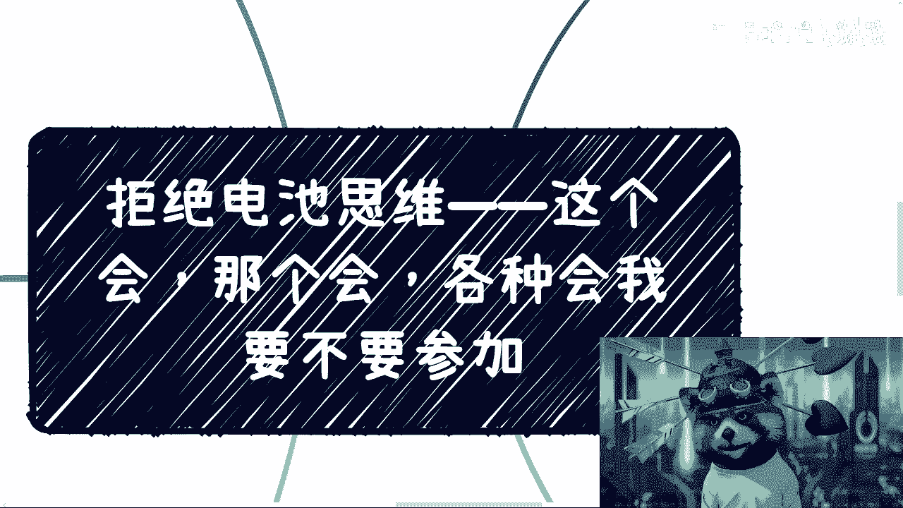
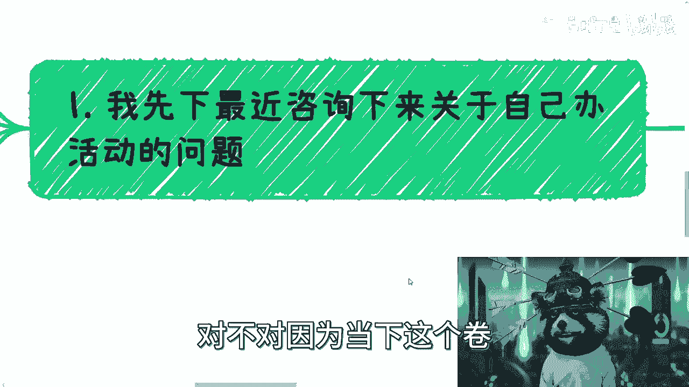

# 拒绝电池思维——这个峰会那个论坛我们到底要不要去 - P1 - 赏味不足 - BV1fV4y1y767

哈喽大家好，今天礼拜礼拜几啊，今天是礼拜四啊，今天上海这个温度啊简直是炸了啊。

这个这两天啊这个会议也比较多对吧，然后这个咨询当中也提到了啊，就关于我之前说大家去办会啊，啊去办活动啊，办沙龙啊一些问题啊，我就这个地方顺便提一嘴啊，首先呢我先说一下最近咨询下来。

关于自己办活动的这个问题啊，嗯最大的问题呢我觉得还是在于想的太多啊，就是说很多人呢觉得自己没有做过的啊，自己做不来，其实没什么好想的，你没有你没有做过，做不来，每个人这个做都是自己做，做不来的对吧。

你就干你不干，你永远没有进步，对不对，然后我跟你讲这个逻辑很简单，就是你取一个活动名称对吧，你比如说你比如说大家一起来赚来来赚钱，或者大家一起来做副业，或者说大家一起来认识一下，其实现在我就跟你们讲吧。

就现在其实大众还是蛮需要线下的这种活动的，因为你但凡那种大的活动吧，很多人去了也不知道干什么对吧，你然后他可能几千块钱对吧，就就也不愿意付钱，那小的活动呢，可能很多人这个这个比如说太专业的怎么样。

他也不愿意去对吧，其实很多人他其实是需要那种，就是说哎门槛不是很高，但是大家认识认识有什么不好呢对吧，你就像比如说我回头弄个线下上海的沙龙，那大家有空来玩玩，这个也蛮好的，对不对，发到网上对吧。

其实你写清楚大家能得到什么，写清楚这个活动的名称对吧，你你你直接去干，发到我们活动型啊，互动吧啊什么小红书啊，你就去发好了，对不对，你你对你来讲也没成本，你又没损失是吧，我跟你讲真的，我就发现吧。

很多人是这样子的，就是想嘛想半天对吧，但是呢你让他做一些没成本的事情嘛，他也不愿意做对吧，但是你跟他说，哎你你要不付钱对吧，给个呃付个什么什么，加个知识星球会是什么样子啊，他老起劲了，你知道吧。

但是我就不明白了，就是你明明目的是要去赚钱，但是你一开始非要去被割，要割了之后呢，你其实也没有什么很很很大的进步，那我就不知道为什么，对不对啊，那么所以说呃这一方面啊，第二方面呢我觉得该包装包装好呢。

还是要包装好的，就比如说你你你找些就是你在再怎么样，再怎么样，你找个朋友或者找几个朋友过来撑撑场子嘛，对吧，大家活跃活跃气氛嘛，就是俗称你找几个托嘛，对不对啊，你比如说文案上写的吸引人一点嘛。

再配点图嘛对吧，我觉得这些大家要像小红书那个博主学习，对不对，就就你实在不行，你p一点图上去也行啊对吧，我跟你讲就是就我发现啊，其实大众对于很多虚的东西他是不会去修饰的，但是你要明白。

你要你要有人来参加，你要去打品牌，你想在当下的这种环境里面，冲出一条属于自己的路，你不修饰，你怎么会有人来呢，你不去你不去做一些，就是说啊就是稍微努力努力对吧。

找些找些人啊，找些怎么样的你，你怎么会有人来呢，对不对，因为当下这个卷已经不是10年前的这种卷法了。

嘛，对吧，的确卷啊啊然后这是第一点啊，嗯所以就是说操作我也跟大家说怎么操作了，你们别再说不会操作了，没有什么不会操作的，就是唉就是想太多了，你知道吗，就是想太多没别的了啊，然后这是第一点。

第二点呢就是为什么开这么多会啊，这个也是很多人在问的啊，包括就是发给我最近呢很多人给我发微信啊，就是说这个会那个会啊，各种会啊，问我知不知道，我跟你们讲，我最近忙成狗啊，没根本没空知道啊，然后要不要去。

我一律都不知道啊，我我但是话又说回来，我的确推荐大家去，但是我不会去啊，啊当然我也不推荐大家去买那种，就是说付费的票对吧，你免费的票参加参加就好了对吧，那你第二点，比如说会议本身呢。

我跟你们讲目的是非常多的，我们需要探究其本身的目标，你知道吗，你就就我跟你们讲啊，很多人给我发这个会啊，是因为他感觉诶这个会的topic不错对吧，这个会的这个立足点不错，你知道吧。

这个会的怎么怎么样不错，你知道吧，就我就觉得很神奇，因为会这个东西啊，你不要去看它的表面，看表面是没有用的，你知道吧，就是说你要去看的，你要去看的是他的这个呃就是内核对吧，你越是去看它本身表面内容。

看它是就是表面只是包装出来的那一层内容啊，那这个东西其实是最电池的思想，因为嗯怎么说呢，就是说呃别人伴奏活动目标也不在于此对吧，别人办这个活动的内核也不在于此，但是呢你关心的东西呢。

却不是别人办东西的这个目标，那南辕北辙之后，你怎么可能会有，就是说就是你既抓不到未来的方向，你也没办法跟别人合作，你知道吗，那有的有的会呢，就是是自己公司要去售卖产品跟服务对吧。

你比如说最近的亚马逊峰会，就在我家隔壁嘛对吧，就在我家旁边，然后办个亚马逊峰会，然后你比如说呃其实从一方面来讲呢，他是要售卖产品，卖服务，没毛病啊，没毛病，而且亚马逊很多小小小姐姐的确很好看啊。

业务也非常牛逼啊，那其实呢从另外一方面来讲呢，其实他也是说在世博馆这边搭了个台子，让同行来聚聚对吧，那我觉得也没毛病啊，而且他的票是免费的对吧，那我觉得这一方面，第二方面呢就是有的会呢你要记住。

有的会呢是政府的kpi，就比如说区政府啊，管委会啊，或者说一些些省省市区政府啊，就是他其实就是为了满足开会的，因为你们但凡跟区政府，跟各个这种管委会，跟这种协会合作过，你们就会明白。

就是他每1年都有要求的，比如说你1年必须办十几场小活动，两场大活动，你知道吗，就他就是个kpi啊，你哪怕下面找来500个人都是托他也不管，你知道吗，没有毛病，你能怎么办对吧。

就是说他就是为了满足这个需求，没有别的目的的啊，那么还有呢就有的会呢，只不过是一整套kp当中的一部分，什么意思呢，就是说你今天11年，你的一个目标是为了售卖一个产品对吧，或者售卖一个服务。

那么你售卖一个产品，售卖一个服务，从政府跟企业角度来讲，最好的方式是什么，就是办会，因为会其实他是一个售前的角色啊，就是产出就是就是变成了授权的一个角色，也就是说他是为了后续的服务去做，做的一个铺垫啊。

包括一些某些标准对吧，那就说你会发现这些东西，比如说啊什么什么什么web 3啊对吧，互联网三点啊对吧，数字经济啊对吧，农业啊对吧，大数据啊，云计算啊，就等等，标准发布，对不对，我跟你讲。

标准发布是这样子的，有很多人，这就很多人发给我的，他的感觉是哇这个东西好吧，有标准发布了对吧，我去学习一下，你知道我看到这个东西反应是什么哦，要卖评测了哦，要卖证书了哦，要卖培训了，就这样子的呀。

你问我感兴趣的，我不感兴趣呀，反正我又我又买不了，我又赚不了这个钱跟我有什么关系啊，难道我你还让我付钱去买吗，那这个更不可能啊，你说对不对哦，所以说其实本质上这些是最赚钱的，什么部门我就不说了对吧。

各种各样的跟你们代码去接触，你们就知道了啊，没什么好说的对吧，就这个吊样子啊，就吐槽已经吐的不想吐了啊，就是说难听点对吧，十几年前就他妈开始这样割了，他妈到现在还是这么割啊，你一个评测对吧。

一个一个什么证书，什么性能评测，什么功能评测对吧，然后给个什么证书，十几几10万十几万的不香吗，啊我就问这不比那些去卷研卷，考研卷他妈的那些岗位的人不香吗，啊真的是。

所以说呢这个啊当然这个地方也有人会说啊，也有人会说他说那吕老师你这样说就不对了啊，能割的人毕竟是少数，非也啊，我还是那句话，能割的人一定是读书啊，就看你们有没有这个底线。

就看你们远这个敢不敢向外向上去包装对，就这么简单，中国一线城市到五线城市，我跟你们讲，这个城市与城市之间的差距，比城比国家与国家之间的差距都要来得大，你懂吗，也就是说那些下线这个这个这个二二线到五线。

或者三线到五线城市，你问他们去用同样的方式去割，他们懂了不懂的呀，啊你以为你以为都是一线城市啊，动不动就金信为，动不动什么什么各种研究院有吧，那你到下面随便去包装，有人有谁懂啊，对不对，我说不好听的。

每年他妈的这么多钓鱼网站都能都能搁那骂你，你包个证书不能割对吧，所以说啊你要明白会的背后，它其实都有其本身的逻辑，也就是说如果我们去参加，那就去挖掘其背后的逻辑，去参与景区，而不是去了解，你知道吗。

就是比如说哎哎我去看哇，这个标准真不错，这个话tp真不错，你知道吗，这个技术真不错，这个真的韭菜思维，n的电池思维，你懂吗，这是第二点，第三点呢就是说这些会的参与方啊，你怎么参与进去。

你比如说我们虽然说啊办证会是企业办啊，是政府办，但是啊包括还有管委会对吧，办的什么，但是你要明白这些地方他们说是说怎么办，但是他们往往都是挂名啊，你知道吧，不是什么指导单位啊对吧。

什么什么什么主办方啊对吧，但是你会发现他们不是执行方，你知道吗，就是你如果觉得你跟主办方跟所谓的挂名单位，你可能觉得啊我不太好接触，那你跟执行方去接触呗，有什么不好接触的对吧。

就是有很多基本上他们都是外包的，因为他们没有空，或者他们也也不愿意办，或者他们也不懂怎么办，对不对，这第一点第二点是我们其实的切入点对吧，很多人就会觉得哎那跟我们有什么实际的关系，那关系大了去了啊。

你可以做执行方啊对吧，我说不好听的，执行方还能有什么资质吗，还能要你什么证书吗，没有了呀，那不就是执行方法，对不对啊，你可以单纯做传宣传方法，你可以单纯做他们背后服务的合作方法，做服务的渠道方法对吧。

你切入点很多很多了，商业上你知道吗，你只要跟他们是共赢的对吧，你不是去切他们的蛋糕，你你只要是能给他们带来更多流量的，你不是抢别人生意的，本身合作很简单，没这么复杂，你知道吗，没这么条条框框。

但是你得你就是有一点就是你别多想，你得冲，你知道吗，你就上去聊，怎么了呢，他还能把你吃了不成对吧，就说你任何合作你不要多想，你就上，因为你你你比如说跟别人做合作坊，做渠道房做什么，这有什么问题呢。

没有问题的呀，对不对，你最多就被拒绝，又怎么样呢，哎你你反正会这么多了，你你左边那个会不行，右边那个会对不对，有什么关系啊，没有意义点，你想这么多对不对啊，那么这个是三四呢，其实本质上会跟很多别的东西。

就比如说你们家的知识星球啊，或者别的东西其实都一样的，就是说它本质上都是一个漏斗模型，就是所谓漏斗模型，就是说它会一层一层去漏，就是看比如说哎对这个东西感兴趣的人先来，来了之后呢，比如说有个99块钱的。

比如说再有个1999的，再有个19999的对吧，再有个109999的对吧，他就是一层层去做收费，然后做过滤，因为这样的话才能把整个用户留存下来，而且知道哪些用户的收费能力，就付费能力在什么地方。

你知道吗，其实这个是一层一层去筛选自己的最终用户，当然你的产品模型一定是不一样的，你不能是单一模式，什么意思呢，就比如说你今天99卖一个产品，是一个活动，对不对，你11999 1999卖一个产品。

你还是个活动啊，你19999还没个活动啊，你109990还没个活动，那怎么可能呢，对不对，你的产品一定是多元化的啊，当然这个产品不一定是你的，我说了无数遍了无数遍了，就是你别老想着你能做什么。

你要想的是整合资源，搭一个台子，你知道吗，哦那么大家还是要客观的去看，别老觉得你所有的就是商业模型跟经济模型，都是割韭菜，因为如果按照这么个说法，那你什么都是割韭菜，有什么好说的呢，没有意义了呀。

对不了啊，那你照照你这说法，那你现在去打工也是给韭菜，你也是被割的呀，当然事实也是被割对吧，你叫五险一金也是被割，你什么东西不被割了，对不对，你整个社会就是漏斗模型呀，有什么问题呢，对不对，我跟你讲。

不用去关心这些，我们就关心自己怎么赚钱就好了，你关心这些干什么呢，对不对，那这是一方面，然后还有那个一方面呢，就是昨天我发布过一条微博啊，我说什么呢，我说我昨天看到个海报啊，看到n张海报啊。

出品人呢还是几年前啊，就是我还在那个行业时候看到的啊，这个甚至十几年前一些老人，说白了这些人呢在我看来跟骗子就是一样的，因为本质上这些人年纪很大了，技术量肯定也没什么成长，一天到晚就是就是做这个出品人。

那个出品人的，说白了他也不会给别人带来什么价值，就都是浮于表面的，就是比如说45分钟一个小时，你听上去很有道理，但是没卵用啊，但他既不给你带来实际的一些技术，他也不给你，就是说思维上面带来什么改变。

没有东西的，就除了就是要刷脸熟啊，熟了除了就是未来这个要去要去让别人花钱，请他对吧，没没了呀，就这些用处对吧，就是所以说呢其实我觉得一方面啊，很多行业就是都是这样子的，也的确没有什么新人辈出，说实话啊。

可能现在的这个年轻人冲劲也不够，或者都去卷卷卷学校了和卷卷大厂了，反正也没什么意义啊，另外一方面呢，就这些往死里卷的人呢，就是真的是不如这些这种人舒服，真的人家也自由对吧。

人家人家他妈的就就在那边刷刷脸对吧，刷刷关系啊，就既没有人，这唉怎么说呢，就是中国嘛其实就这么一个样子，就是很多呢表面上很多人不是不懂，你知道吗，大家心里都懂，只不过呢大家就觉得哎你好我好，大家好。

我也不愿意去做这个坏人对吧，我也不愿意去打破这种，就是说哎这种这种环境对吧，这种这种就是说骗子横行的情况对吧，你说也没有人会冲出来说，指着他鼻子就说哎这个人是个骗子，或者怎么样也没有意义，你知道吗。

所以说就是就是的确需要改革，真的的确需要改革，各行各业各层面都需要改革，但是没有人啊，你知道吧，就没有，就是说就根本看不到这种新人出来，就是把真正的，比如说把一些有价值的东西说出来，很少很少对吧。

所以说呢你说这个这个有时候就是大四嘛，大三嘛很多学生就问我，他说他说哎呀我觉得路很窄对吧，就出来要卷，但是你说你说路多不多难，我觉得是真的多，你知道吗，就各种各样的路啊，野路子不要太多，你知道吗。

而且很赚钱对吧，嗯毕竟基本盘在这个地方，但是你说路窄吧也窄，就毕竟从小pua就是就是我跟他们讲，很多人，你一句两句讲不通的，他们脑子里就觉得我要进大厂，我要去卷，我要去读博，我要去读硕。

就从来不考虑以后，你知道吗，就感觉就是好像我只要读出来我就稳了啊，我一辈子就稳了，就没有意义。

对面，那所以说呢就是说嗯今天啊这个内容呢，主要是我希望大家能够明白，就是说所有的东西不单单是会啊，所有的东西其实都是一样的，你知道吗，就是就是你要去参加也好，不参加也好，这个无所谓，就是你但凡去参加。

你就要想办法去了解它的内核，了解它的本质啊，就是在整个这个行业里面，不管是什么，比如说我跟你们讲，只要我跟你这么说吧，只要有标准的啊，所谓的国标团标呃，这个国际标对吧，还有什么行标对吧，只要有标准的。

只要有这种评测的，你去看好了，就那赚的就不不想转了，就转的已经翻过来了哦，那我就问嘛，你去反过来说，我就问嘛，那那这些东西跟学校跟学历，跟跟你技术会什么有关系吗，怎么半毛钱p什么都没关系对吧。

人家做一个评测几10万，我真的我也是服气的，你知道吧，没办法，就这个样子啊，对了啊，唉行吧，就这么着吧啊我下午再看吧，我下午因为要去要去给学校出课了啊，到到时候再看嗯，反正大家有什么细节啊。

跟自己有关的，我靠我跟你们讲，最近咨询我的问题越来越神奇了啊，越来越神奇好吧，有什么，反正细节问题跟个人发展有关的。

