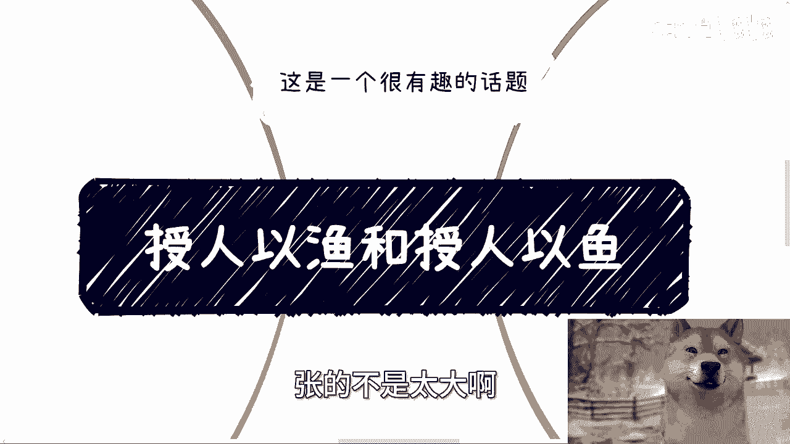

# 课程 P1：授人以鱼与授人以渔的思考 🎣


在本节课中，我们将探讨“授人以鱼”与“授人以渔”这两种不同教学或帮助方式的本质区别、各自的优缺点以及适用场景。我们将通过简单的例子和类比，帮助你理解在学习和实践中如何平衡具体操作与核心方法论。

---


## 课程概述



“授人以鱼不如授人以渔”是一句广为人知的谚语。本节课程将深入分析直接教授具体操作（授人以鱼）与传授底层方法逻辑（授人以渔）之间的核心差异。我们将探讨为何在不同情境和人生阶段，人们对这两种方式的需求和评价会截然不同。


---

## 两种教学方式的定义与对比

上一节我们介绍了课程的主题，本节中我们来看看这两种方式的具体含义。

“授人以鱼”指的是直接给予对方具体的解决方案、操作步骤或现成资源，使其能立即获得结果。例如，直接告诉某人一个可以赚钱的项目。


**公式表示**：`结果 = 执行(给定操作)`

“授人以渔”指的是传授对方背后的思考逻辑、方法论或原理，使其具备自己分析和解决问题的能力。例如，教授市场分析的方法或产品设计的底层逻辑。


**公式表示**：`能力 = 理解(核心方法论) + 应用(具体环境)`

---

## “授人以鱼”的利弊分析


以下是直接教授具体操作的优点与面临的挑战。

*   **优点：见效快，门槛低**。学习者无需深厚积累，按步骤执行即可快速看到成果，适合追求即时反馈的场景。
*   **挑战：可持续性与口碑风险**。并非所有执行者都能成功，结果具有不确定性。失败者可能归咎于教学者，导致口碑受损。这更像是一次性交易。
*   **挑战：依赖性与焦虑**。即使成功，学习者也可能因未掌握核心方法而感到焦虑，担心无法复制成功或应对变化。


---

## “授人以渔”的利弊分析

上一节我们探讨了直接操作的局限性，本节中我们来看看传授方法论的特点。

以下是传授核心方法论的优点与面临的挑战。

*   **优点：培养底层能力，适应性强**。掌握了方法论，学习者能够举一反三，应对不同领域和变化的环境，价值更持久。
*   **挑战：理解门槛高，见效慢**。方法论通常是高度抽象和浓缩的，需要学习者具备一定的实践经验和思考能力才能消化吸收。
*   **挑战：被认为“不实用”**。在追求快速结果的环境下，方法论容易被批评为“空虚”或“不接地气”，难以满足部分学习者立即变现的期望。

---

## 现实中的类比：应试教育的两派

为了更具体地理解，我们可以观察教育领域的一个经典例子。

在国内的应试教育中，同样存在“操作派”与“方法论派”的区分。

*   **操作派（实践派）**：核心是**题海战术**与**押题论证**。其逻辑是放弃泛化的思考，完全以考试结果为导向进行重复训练。
    *   **代码模拟思路**：
        ```python
        for 历年真题 in 所有考题：
            反复练习(历年真题)
        预测考点()
        最终分数 = 参加考试()
        ```
*   **方法论派**：核心是**教授学习与思考的方法**，如知识体系构建、解题思维模型等。目标是提升学生的核心学习能力，使其在考试之外也能受益。
    *   **代码模拟思路**：
        ```python
        构建知识体系()
        掌握分析问题模型()
        举一反三能力 = True
        最终分数 = 应用模型(考试题目)
        ```

两种方式各有支持者，也很难简单评判优劣。操作派在特定目标（如高考）下效率可能更高；方法论派则着眼于更长期的个人发展。


---

## 核心结论：情境与阶段决定选择

那么，究竟哪种方式更好？关键在于上下文和对象所处的阶段。

*   **没有绝对的好坏**：不能因为存在失败案例就全盘否定一种方式，也不能因为成功就将其神化。需要辩证地看待。
*   **与人生阶段相关**：同一个人，在缺乏经验、急需建立信心的阶段，可能更需要具体的“鱼”（操作指南）；而在具备一定积累、寻求突破或转型时，则会更渴望“渔”（方法论）。
*   **沟通与教学的建议**：选择与值得的对象进行深度沟通，传授“渔”；对于追求短期“鱼”的对象，可以提供操作建议但不必强求理解内核。避免非此即彼的“二极管”思维。


---

## 课程总结


本节课我们一起学习了“授人以鱼”与“授人以渔”的深刻内涵。
*   “授人以鱼”提供即时结果，但可持续性差且依赖性强。
*   “授人以渔”培养底层能力，价值持久但理解门槛高、见效慢。
*   在现实中，如同应试教育的不同流派，两种方式并行存在，满足不同需求。
*   最终，最佳选择取决于具体的目标、情境以及学习者所处的人生阶段。明智的做法是根据对象和时机，灵活平衡“鱼”和“渔”的给予。

---


**附注**：深圳活动定于30号下午（本周日），详情可私信咨询。早鸟票已下架，但咨询过的人仍可按早鸟票价格报名。另，关于职业规划、商业规划等问题，可整理好具体问题与个人背景后进行沟通。