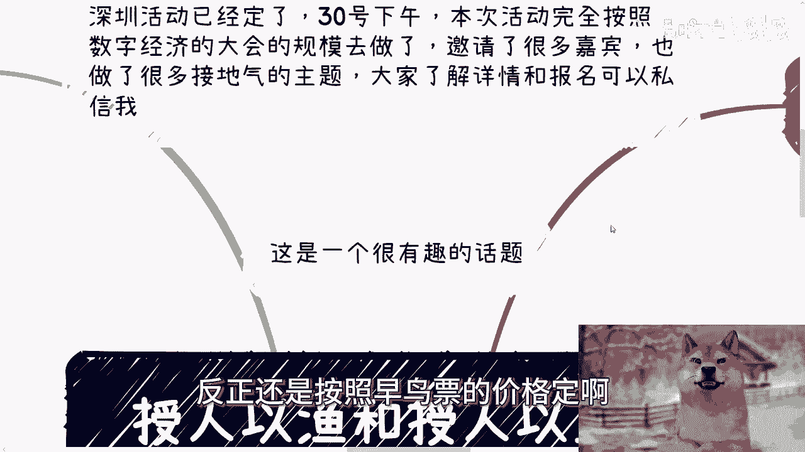
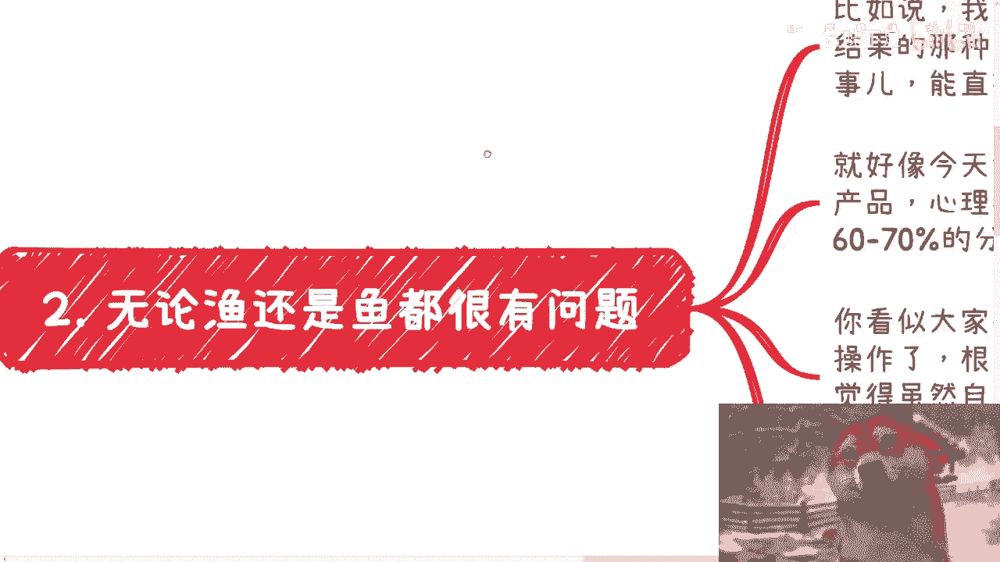
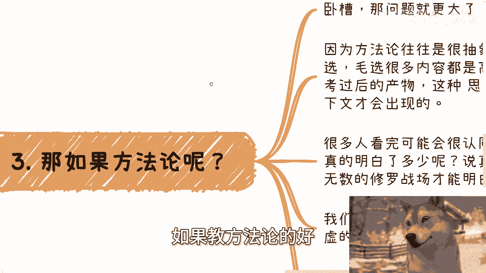
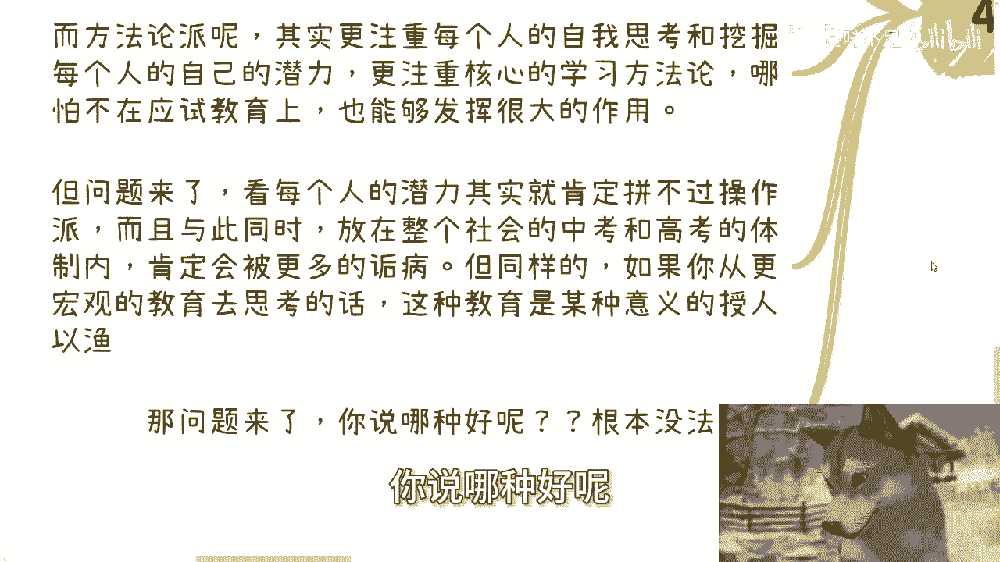
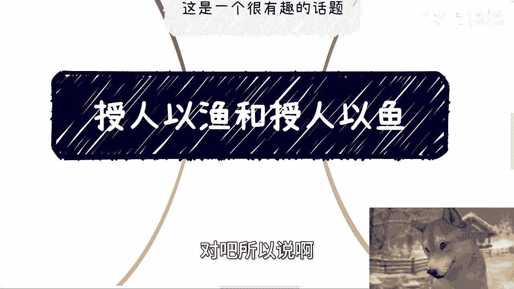
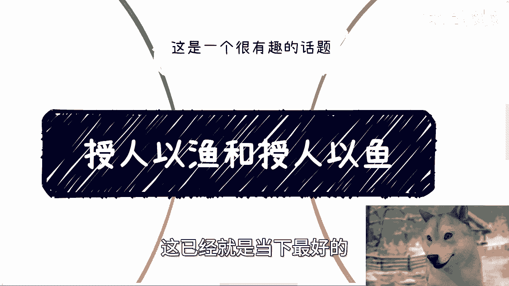
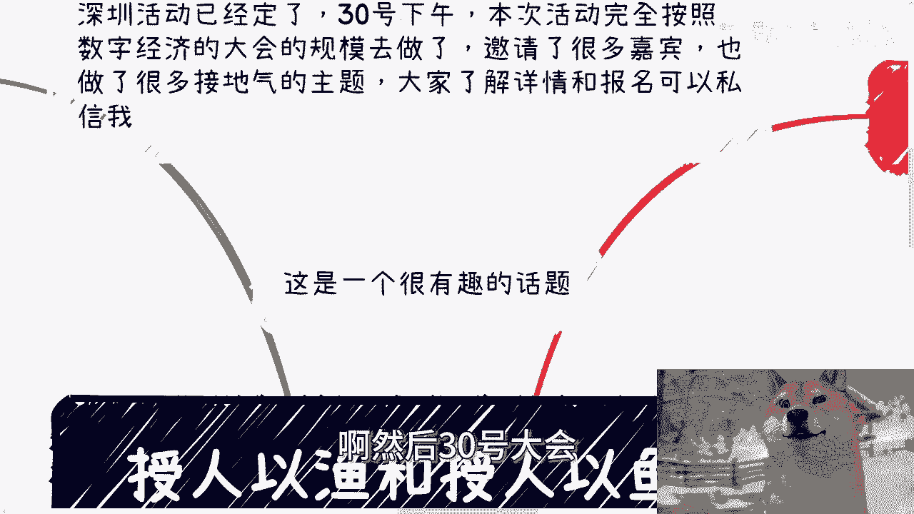
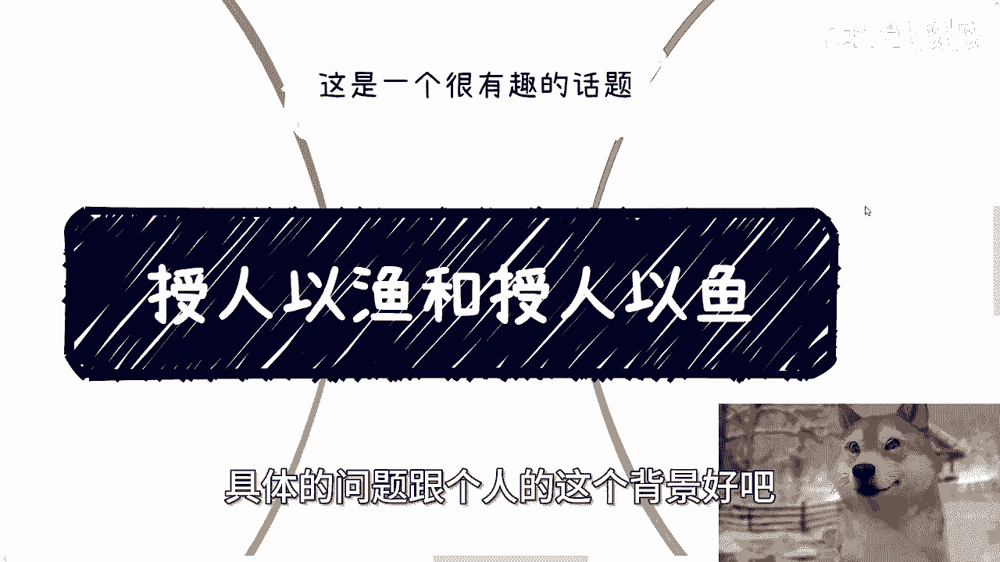

# 授人以鱼和授人以渔，你觉得哪个好 - P1 - 赏味不足 - BV1BE421N7nx

好大家好，今天我们来讲的是这个授人以渔跟授人以渔啊，对吧，就是你们单纯听语音，我如果把我这个视频转成语音，怕不是你们听不出我在讲什么啊，哼不是我很伤心啊。

我我我换了一只汪对吧，这没有人这个夸我这个汪好看啊。

那这所以我打算今天继续用这支网啊，嗯首先这样子的深圳活动定了对吧，30号下午就本周日啊，呃本次活动呢，我完全按照数字经济大会的这个规模去做了，邀请了很多嘉宾啊，也做了很多这种主题。

反正大家了解详情或报名，反正继续私信我好吧，然后咨询过我的人呢，反正还是按照早鸟票的价格定啊。

因为现在早鸟票已经下架了啊，那么我们来说这个授人以渔和授人以渔啊，这个是一个很有趣的话题，因为今天我跟一个小伙伴吧，就是白天反正聊了也聊了这个话题，诶为什么我这只汪不能张嘴呢，啊啊啊可以张啊。

张的不是太大啊。

呃首先啊是这样子的，呃一直说啊授人以鱼不如授人以渔对吧。

那么我们就这么说，他很多人问我，他说陈老师我们现在去看书，或者说看一些呃高额去去读一些高客单价的，比如说ENBA啊对吧，NBA啊这些东西啊合不合适啊，我就这么说啊。

我们假设大家看的书都是教大家方法论的啊，或者说都是呃告诉大家具体的一些，这个这个背后的这个方法逻辑的，那么问题来了，很多时候这个方法或者这个方法论是需要啊，大家拥有比较强的这种实践和阅历。

才能够来支撑的啊，你们才会明白，因为表因为书也好，很多别的东西也好，它都是一个高度浓浓缩的东西，他不可能里面给你讲一些非常细的东西，因为讲非常细的东西本身这件事情的怎么说呢，它的普适程度就不高。

那么我们放到嗯书籍里面，或者放到这像这种NBANBA的课程里面，它其实就意义不大，你知道吗，他就因为你从宏观的价值来讲，它的宏观价值就不高啊，那么这个事就像我们一直说的。

这个1000个人眼里有1000个哈姆雷特对吧，我我就就比如说我一直平时跟你们讲的话，我同样一番话出去啊，我就跟你们这么讲，有的人啊他就能明白我想表达的意思，那有的人觉得我就是50万。

那你怎么办呢，对不对，你你你怎么办，你说啊，所以说这个事啊，我跟你讲，你是教觉得啊，我们先抛出个问题啊，你们抱着这个问题，你们继续听我讲啊，就是说你们觉得是教人真正的方法好呢，还是说是就是说呃是教人。

这就是背后的这种方法论好呢，还是说是直接叫他现在的这个操作论好，对你你觉得哪个好啊，好那么我们往下讲啊，呃比如说啊。

我比如说我现在直接教你们，现在就是执行的和操作的，然后呢你们操作执行就能够看到结果的那种，或者说我让你们站在巨人的肩膀上去做一些事，然后能直接看到结果这种啊，好那么我们举个例子。

比如说就好像今天我说来啊，我说我这里有一些小红书的这个，这个这个积累啊，或者有些什么玄学的产品啊，心理疗愈产品啊，大家帮我推广一下啊，每个人比如说推广完了，能够有60%到70%的这个利润啊。

大家肯定能赚到钱，那么你想想看啊，你看似大家很开心，但其实马上问题就来了，为什么呢，有的人操作了他根本赚不到钱，因为你不可能每个人炒作都赚到钱，我都赚到钱，那还了得啊，对不对啊，然后他根本赚不到钱。

他开始过来转过来骂你啊，有的人呢觉得自己虽然赚到了钱，但是没有掌握核心的方法啊，然后开始焦虑，开始担忧，甚至会觉得你是不是不顾故意，不教他们核心的方法啊，那么你会发现教现成的这种操作。

其实对你来讲能够短期的赚到一笔钱，在我看来，这就是一笔快钱，但是几乎是无视所有口碑跟反馈的，因为这个事情就是个悖论，因为你如果能教所有的人都能赚到钱，这件事情不可能发生，如果你交的人不可能都赚到钱。

那么基本上就总有人会来骂你，那么这个东西口碑就会变烂啊，那么他就是一个一次性买卖对吧，所以说就是说本质上这个事情，他从现实角度出发，他就不可能啊，好那么我们再来说啊，如果教方法论的好。

如果教方法论的话会怎么样啊，我跟你讲教方法论，卧槽他妈这这问题就更大了，为什么，因为方法论往往是很抽象的，我说难听点，可能是跟风看啊，我也说直白一点啊，它是高度抽象和浓缩的，为什么。

因为它是一个思考后的产物对吧，那么这种思考是要放在当时的那种环境，跟上下文，包括整个比如说呃呃党的建设啊，包括就整个这个发展过程当中，他才会有的这种思考，那么很多人看完他可能会认同。

因为他碍于什么爱于这个伟人的这个身份，碍于很多的一种原因，他可能会认同，但是你说他真正有多少吸收了，真正有多少是从内心去明白的，说真的我觉得很难，因为这些东西他就是需要有非常多的实践，非常多的修罗战场。

非常多的这种，怎么说呢，就是就是呃就是痛苦和非常多的这种这种，这种坑你才会明白的，那么我们现在给人方法论，可以说大部分人肯定会反馈说哦，这个东西虚的很啊，虚成狗啊，你别跟我讲他妈这种方法论。

我就要那种他妈操作就要看到钱了啊，别的别跟我逼逼对吧好，那么我们就这么来讲，嗯如果啊我们今天是一个商业合作，你跟我这么说完全没问题，因为大家商业合作就是为了奔着钱去的对吧，这没错啊。

但如果来说一是一个培训，或者来说一个是教，一个是学的这种关系的话，那么我只能说方法论是内核，同一个方法论，1000个人实践会有1000种结果对吧，甚至2000种结果，因为每个人理解都不一样。

你不能因为有人不成功就去质疑这个方法论，对不对，当然啊我们反过来说，你也不能因为有人成功，就把这个方法人视为视为天神，都不可能都不行，因为你你要的是一个辩证的一个逻辑，对吧好。

那么我们就拿国内最最直接的一个东西，来举例子，比如说应试教育对吧，因为你总不能因为说你中考高考考的不好，就质疑你的老师，至于你的学校吧对吧，那么人家老师跟学校也会说，那我们总有考的好的，那你怎么说呢。

对不对，好，那么但是你真的去了解学校跟老师的教学啊，你从本质上会明白，就是它会有分成两两派，一种叫做操作派，也就是实践派，一种叫做方法论派对吧，那么操作派是什么意思，其实就是题海战术加押题论证。

说白了就是说放弃了所有的思考跟方法论啊，纯粹的完全以中考跟高考，或者说完全的以应试为导向的教育，那么你从整个那个社会的体制来讲，这个方法一点都没有问题，而且会得到大量的家长的支持，也会得到大量学生支持。

但如果你从一个更宏观的教育去思考的话，你就会觉得TMD这就是在纯粹的培养考试机器，对不对好，那么而方法论派呢，其实更关注每个人的自我思考跟挖掘，每个人的呃这个这个个人的潜力，他会更注重核心的学习方法论。

哪怕你不在应试教育上面，在别的呃呃呃呃行业，或者在你未来的这个人生当中，他都能发挥巨大的作用，那么但是问题来了，你看每个人的潜力其实就肯定拼不过操作牌，而且与此同时，你如果真的放在整个社会中的。

高考跟中考的这种体制内的话，那么肯定会被很多人诟病，会被很多人骂，对不对，那么同样的，如果你从更宏观的教育去思考的话，那么这种教育从某种意义上来讲，他是真正的授人以渔对吧好，那么我们就说问题来了。

你说哪种好呢。

他根本没法去判断你怎么判断对吧，我只能说就是啊就是就是就是呃婆说婆有哦，公说公有理，婆说婆有理，就是每个人想法不一样，有的人就觉得就是每个人在人生的不同阶段，觉得他想有的时候他想要操作牌。

有的时候他想要呃，这个叫做方法派，为什么，因为这个跟人的经历有关，跟人的年龄有关，跟人的阅历有关，你不能说一个东西呃叫什么，就是特别好，然后他就能这个贯穿你一辈子，不可能。

所以说你你说很多人啊就是就是去怎么说呢，去去看一个问题，或者去去讨论一个问题的时候，他就很容易就是啊呃呃就我们说的二极管，就是他会去判断哎这个东西好或这个东西不好，然后拿出非常多反面例子，那我就这么说。

你有不同的上下文的情况，下面你永远找得到反面例子来反驳一个东西，但是你不能因为能有反面例子，你就去否定它，对不对对吧，所以说啊。

就是唉，所以说就是说大家跟别人沟通上也是一样的啊，你们沟通什么东西不要太过，就是说怎么说呢，把自己当成一个菩萨，或者当成一个一个一个一个一个一个一个，一个一个一个普度众生的人对吧，怎么样子。

就是我觉得那句话就是这样子的，就是选择那些值得你去讲的人去沟通，然后选呃对于那些你觉得不值得的对吧，就对你来讲不值得的人，你就无视也不要去攻击，也不要去落井下石，这已经就是当下最好的了啊。

好那么就这么着吧啊然后30号大会好吧。

继续报名，然后剩下的话就是职业规划，商业规划啊，股权期权合同呃，叫什么，就是呃这个商业计划书啊，白皮书，包括你们手上有什么牌，你们没有什么牌啊，你们希望通过跟我的沟通。

能够让我给你们一些更接近于当下呃社会发展，或者当下这个整个的一个呃接地气的，这么一个规划或者建议的话，那么你们可以整理好呃，具体的问题跟个人的这个背景好吧。

