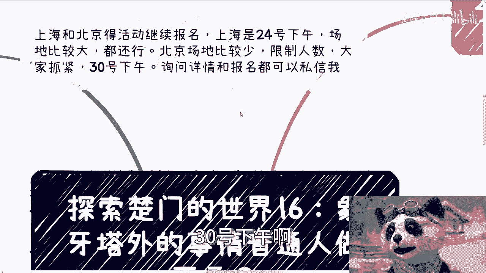
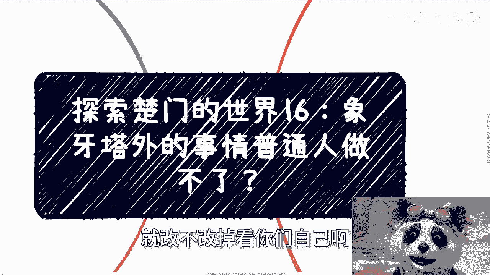
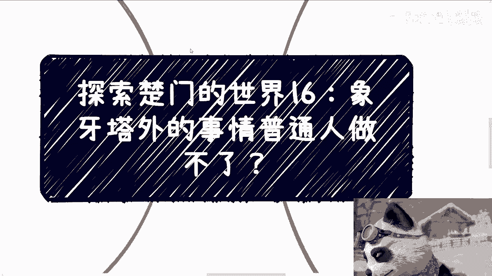
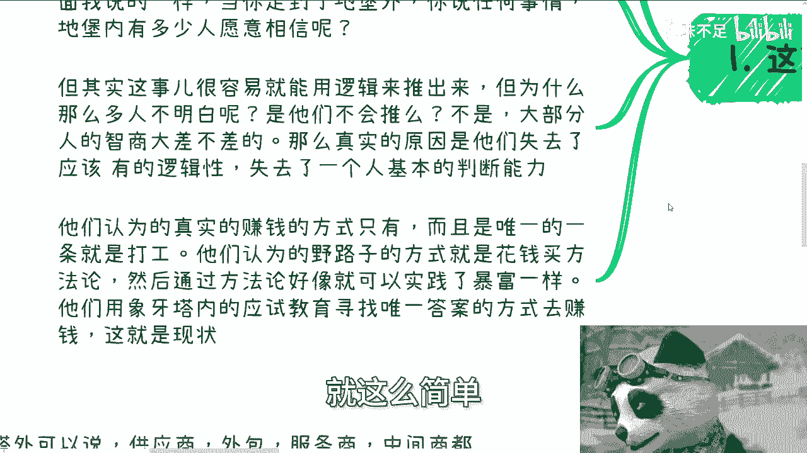
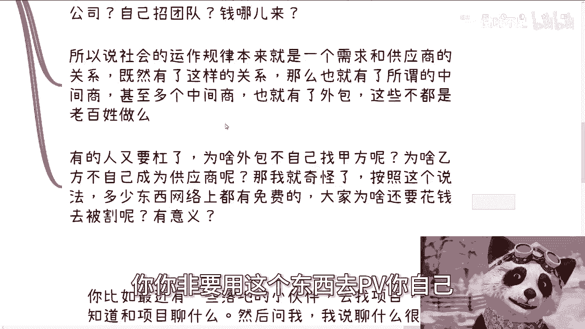
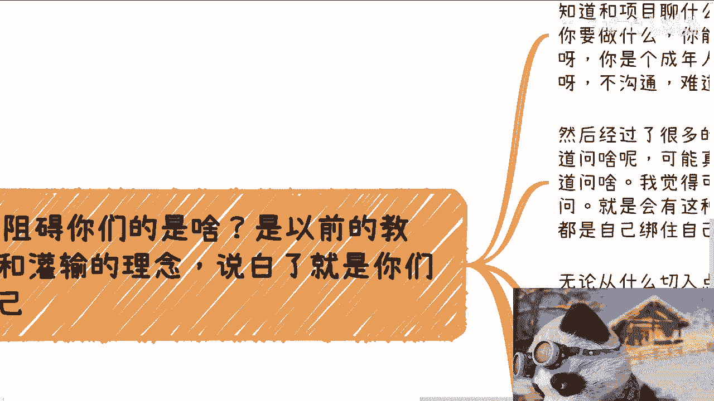
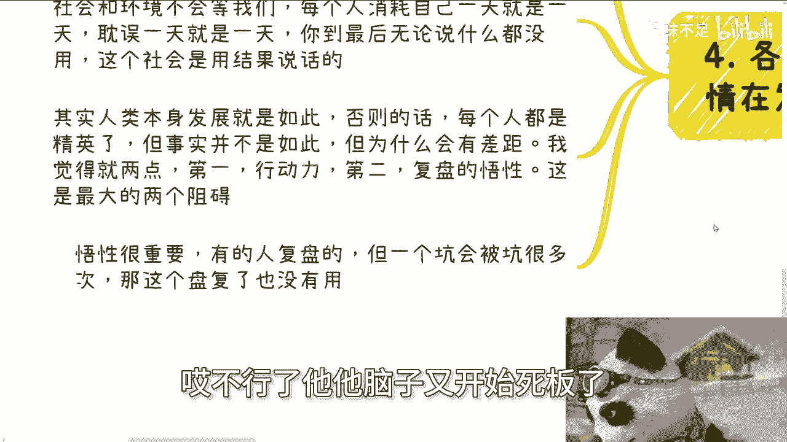
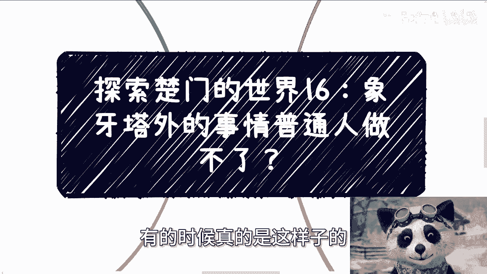

# 探索楚门得世界16：象牙塔外的事情普通人到底能做多少？ - P1 - 赏味不足 - BV19i42197Mw

好大家好，呃首先上海北京的活动还继续报名啊，上海是24号下午啊，这个场地比较大，就还都还行，还能继续报啊，北京场地就比较小，然后限制人数啊，大家抓紧好吧，30号下午啊。

嗯反正有啥你们私信我好吧，嗯然后今天的话是探索楚门的世界16啊，那么这个东西呢也是很多人唉，就就我可以说95%的通病真的是通病，而且改不掉，也不能说改不掉吧，就改不改。

就看你们自己啊，就是说呃象牙塔内的人，他都会认为象牙塔外的事情跟业务，普通人是做不了的。

就这么简单，你们自己想想看，就这样子的，而他默认做不了啊，然后我觉得这个就是最大的一个论调啊，就无论是日常的视频还是咨询啊，我们说了很多种方法或者渠道，或者说很多种案例对吧，然后呢我可以说不管对方。

他到底是就是就是表达出来还是不表达出来，我相信九成甚至9。5成的人心里正在想，就是啊陈老师说的很多事老百姓做不了啊，但是呢你只要比如说我再问他一嘴，我说那你为啥觉得做不了，他，百分之百我可以。

我真的可以棒子打死啊，他百分之百不知道为什么，但是他会告诉你，我就觉得做不了，那怎么办呢对吧，一般面对这种我跟你讲，我只能这么说啊，尊重他人命运，放弃助人情结是吧，那咱们的教育呢，让大家在没有任何实践。

和没有任何依据的情况下，他就完全放弃挣扎，然后拒绝所有的可能性啊，这就跟羊毛战记里面说的一样，就是当如果你未来有机会走到地堡外的时候，你说任何地堡外的事情，地堡内能有多少人愿意相信你呢对吧。

但其实这种这事啊，真的很容易就用逻辑推断出来，但为什么这么多人不明白，是因为他们不会推吗，我跟你讲，不是你但凡引导他们，他也推得出来，你说大部分人智商没你高吗，那我也不相信的啊。

那么你说真实的原因是什么，真实的原因，在我看来是他们失去了原有的逻辑性，就是你我这么说，你你你们但凡去接触现在的这个本硕博，这些学生出来，你跟他讨论问题，你看看他有没有逻辑性，没有的，他没有逻辑性的。

你知道吗，就在我看来，他失去了一个正常人基本的判断能力，没有的啊，他们他们认为真实的赚钱方式只有一种，而且只有唯一的一种，那就是打工啊，那么他们认为的野路子的方法也只有一种，那就是花钱买方法论没了。

我跟你讲就这么简单啊，然后通过方法论好像就能够实践实践了，好像就能够暴富一样，就这么简单。

这就是他们的逻辑，你问他有你，你跟他讨论的事情，没有别的逻辑性的啊，然后他们用象牙塔内的应试教育的方式，去寻求唯一的答案，然后去赚钱，然后想要在象牙塔外去赚钱，这就是现状，那你赚的到不了。

你赚得到他妈的才他妈怪了啊。

然后第二我们就来说啊，用膝盖都能想得出的这个他妈的答案啊。

一个个来说，首先你说花钱买方法论就能赚钱，那么我就这么说，除非啊你觉得你的智商高于其他所有的人啊，或者说你觉得中国人就他妈你聪明，其他人都啊，那么如啊如果不是这样的话啊。

我们今天说如果花钱买方法论就能赚钱，你花了45万，花了十几万怎么了呢，哦中国其他的人难道花不起十几万吗，呃呃你是太看得起自己，还是看不起人家对吧，那今天你说花钱买方法论，但凡能赚钱。

那今天理论上这么多人财富就均分了，而不是5%的人，掌握95%的财富啊，对吧哦，你在我看来，我跟你们这么说，中国人在那个国际上，在全球上是什么概念啊，都是很聪明的，很小聪明的哦，你今天知道个东西。

你以为别人不知道对吧，哦你花5万买这个东西好像能赚钱，马上就赚，然后别人就不知道吗，而且你自己想社会发展规律是什么，任何一个行业一旦你知道能赚钱，别人知道能赚钱，人一旦多了，他还能赚钱吗，一个道理呀。

对不对，就这逻辑，我他妈真的就觉得不知道，你想想看，为什么这么多人会这么想，那还不是因为他没逻辑性吗，啊再来说啊，象牙塔外的人事情普通人根本做不了，好好好好好好，对对对啊，假设我假设这句话是真的。

那么整个社会上这么多赚钱的事情，或者这么多要落地的事情，谁来做哦，不落地了，按你这个说法，不用落地了，就整个社会都是空的，假的对吧，还是说你觉得所有的落地人都关系或亲戚，我就这么问你们。

第一哪来这么多关系户和清晰，第二我退1万步来讲，你今天要是真的是关系户和惊喜，你会做吗，会做个屁，为什么，因为能躺着赚钱，你看到过谁他妈的皇皇帝也好对吧，或者说什么以前地主家的亲戚他妈来干活的。

有吗啊你们自己仔细想还有吗，真的是笑死对吧，我们继续来说，学校也好，协会也罢，政府也好，我就问你们这些地方有落地能力吗，你要说做点小活动，小沙龙对吧，今天比如说里面的老师过来讲讲课，那没问题的。

但凡涉及到一些大一点的活动，或者说软硬件的这种东西的落地，甚至比如说实体东西落地，以及一些新兴产业的东西，他们有能力落地吗，去找找看，你就算今天去找清华北大，他们也没有能力落地啊，落落啥玩意儿啊。

啊落个鸡儿对吧，你而且另外一方面他怎么录，他是自己组公司，自己招团队，那钱哪来钱哪来，对不啦，一样的呀，我不是说他们不能落啊，我指的是整个盘子非常大，他就算自己能做一点东西，可能也就占了100%分之二。

那剩下还有这么多呢，哦全部自己吃掉吗，他怎么吃啊，你吃一个，我看看对吧，所以说社会上的规律运作规律，它原本就是一个供需对吧，就是需求跟供应商的这个关系，既然有这么个关系，那么也就是有了所谓的中间商。

甚至多个中间商，自然也就会有外包对吧，那这些谁做，这些不还是老百姓做吗，那有的人要来杠了，他说那外包为什么自己不找甲方呢，那为什么乙方不自己成为供应商呢，那他妈我也奇怪了，那按照你这个说法。

这么多东西网上都是免费的，那他妈的为什么身边这么多人，还要花钱去被割呢，我也搞不懂呀对吧，你能解决不了，所有的事情都是一样的呀，你你非要用这个东西去PUA你自己。

那还能怎么说呢，对吧，我又要说那句话了，尊重他人命运吧。

好第三啊，组你们想想看啊，所有的事情我聊下来，包括就是说最近还有些小伙伴已经在实践了，然后聊那个坐下来也会碰到各种各样的这个呃，怎么说呢，碰到各种各样的坎儿啊，然后怎么样，那我跟你讲，阻碍你们的是什么。

是以前的教育和灌输的理念。

说白了就是你们自己没有别人，外界是干涉不了你们的啊，你比如说最近有些落地的小伙伴去找项目，然后不知道跟项目聊什么，然后就来问我，我说聊什么很简单，就是你要做什么，你能得到什么，他同不同意对吧。

唉那你不清楚啥，你就问哎你你你不清楚啥，你不问，你是个成年人，对方也是个社会组织，大家要沟通，你跟别人不怎么地啊啊三体人对吧，你这不是这么个逻辑啊，啊然后经过很多的沟通啊，我明白了。

我觉得啊其实大部分的人啊，他心里面不是不知道问什么，他知道的啊，啊我我我觉得他可能知道啊，但是他问题不是说他不知道问，而是说他害怕自己能不能问啊，就是就会有非常多，比如说他害怕自己能不能问啊。

害怕自己问了之后怎么办啊对吧，害怕害怕，比如说别人回他了之后怎么怎么再回复啊对吧，就是他会有非常多的这种非常莫名其妙的，根本就不存在的这种束缚，然后你绑住你自己啊，他妈也奇了怪了是吧。

那么无论从什么切入点，你比如说做活动，他们就会担心自己能不能做啊，做项目担心自己什么都没有啊，那个做了万一落不了地怎么办啊，然后做沟通，担心自己不会说话是吧，拿补贴，感觉这事跟自己没什么关系。

那他妈我就不明白了，你我觉得大部分人给我这种想法，或者给我这种说法，意思是什么意思，就是说啊你们除了死读书以外，除了他妈应试教育以外，别除了别人设定好一步一步一步怎么走以外，他们的生命没有意义了。

是这意思吧，那活着干嘛干嘛，奇了怪了对吧，就是如果啊如果你们觉得就是只有独木桥，那么你们去看看社会上，是不是都只是在这根独木桥上，都只是在本硕博打工上面去赚钱，是不是，那当然不是嘛，那既然不是。

也就意味着有很多别的东西，那为什么不去试呢，对吧，你情愿相信几万几10万的课程能告诉你怎么做，也不愿意自己去实践，那我能说什么，那只能说你懒，说你吃动力不强，那我还能说啥呢，那么第四就。

各个行业每天都有无数的事情在发生，你们看啊，呃首先象牙塔外可以说啊。

就比如说供应商啊，外包服务商，中间商啊，其实都是老百姓，都是所谓的普通人，然后随着经济不好，随着很多人走投无路，越来越多的人会开始探索新的商业机会，那么这根赛道也开始越来越卷。

这也是为什么我跟你们说时间越来越短，那么很多人他不明白他为什么他会觉得爱成熟，为什么一直在说这个这个门门要快关了吧，哼一个我能割，我就算想割你们，我能给你们几个钱啊，然后我之前和咨询一些小伙伴说说。

无论大家怎么想，社会和环境不会等我们的，你每个人消耗自己一天就是一天，你消耗一分钟就是一分钟，耽误一天就是一天，你到最后无论说什么都没用，就现在有很多咨询的时候，我也会告诉他们，我说你们跟我说的。

比如说父母怎么样，家庭怎么样，你们以前读书怎么样，你们以前的认知怎么样，以及你们以前甚至被坑了对吧，被被骗钱了怎么样子，我说这些东西没有用，就我说这个东西你跟我讲，你可以有情绪上的缓解。

但是本质上对你对我没有用，你告诉我我也不会同情你，你告诉我你也不会进步，你告诉我也不会影响你赚不到钱，或者说也不会影响你没有成长的结果，有用吗，你到社会上只会用结果，是这个社会只是用结果说话的。

谁关心以前发生过什么事情对吧，就是本身人类社会的发展就是这样子，你否则的话每个人都是精英了，但事实并非如此嘛，但是你想想为什么会有这么大的差距，我觉得就两点，第一执行力，第二悟性没了对吧。

我觉得悟性其实很重要，因为呃你比如说做的做的人很多对吧，然后总结的人也很多，但是一个坑会被坑很，就是有的悟性低的，它有可能一个坑虽然复盘了，但是会会被坑很多次，就是我真的发现了。

就是沟通的时候有非常多人做事情了，他太死板，我还是那句话，就是太死板，就是你跟他讲道理吧，他懂的，就比如说你不要，你不是每个人都能相信的对吧，然后，然后你不是说每件事情都能做的对吧，或者怎么样他都懂的。

但是当他真的实践的时候，你就会发现哎不行了。

他他脑子又开始死板了，就这样子的，这种就是在我看来就是说就不太行，真的就是咕咚时候有，有的时候真的是这样子的。

我而且我会告诉他们，就说你们你们真的是适合海外，你们不适合中国，就这个样子，没办法呀，就是整我早就说过了嘛，就是中国的整个商业它非常的地域模式，而且而且非常的怎么说呢，就非常的模式非常多，非常多样化。

你你要用你要用乐观的角度来讲，就是那种就是说条条大路通罗马，你要用悲观的角度来讲，就是说就非常扭曲，那就看你怎么看啊，好，所以啊我们来讲，就是说你说这些东西有没有什么做得了，做不了的。

你要么就先去做过一遍，要么就去实践一遍，要么就去了解一遍，然后你再来说啊，我是不是能做或者怎么样，你不要用这个东西呃，做还没做呢，就开始PUA自己对吧好。

那就这么着啊，然后活动继续报名好吧，然后就是说职业规划，商业规划啊，然后什么融资啊，什么什么股权啊，然后你们的商业计划书啊啊，然后你们比如说自己有些什么牌啊，结合当下的这个经济情况或者全国的情况对吧。

全国的发展你不知道未来怎么走的对吧。

那么你可以整理好背景，整理好一些问题好吧。

