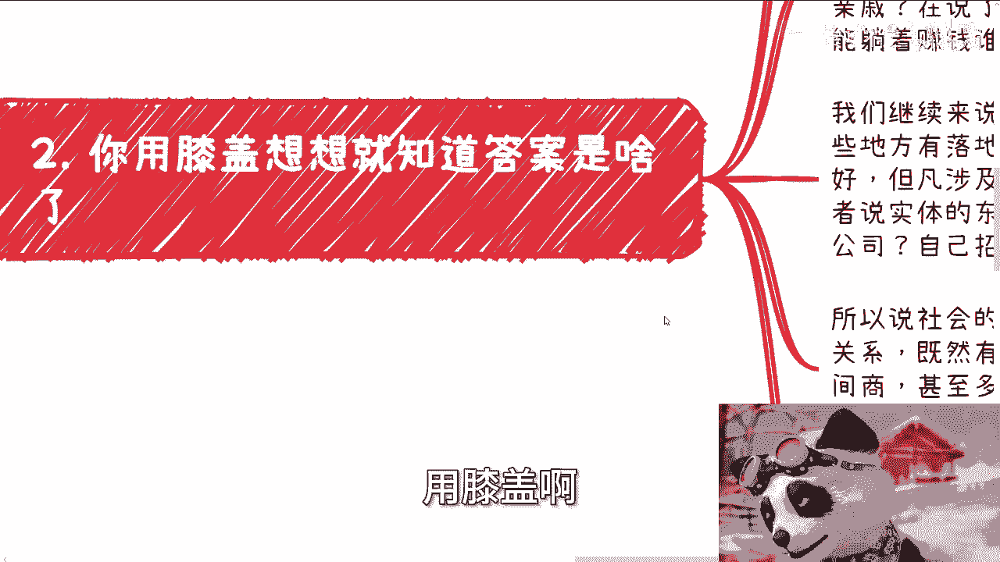

# 探索楚门的世界 16：象牙塔外的事情普通人到底能做多少？ 🏛️➡️🌍


在本节课中，我们将探讨一个普遍存在的认知误区：许多人认为象牙塔（如学校、体制内）之外的事情，普通人是无法参与和完成的。我们将通过逻辑分析，拆解这种想法的根源，并说明社会实际运作的规律。


---

上一节我们介绍了课程的主题，本节中我们来看看这种“普通人做不了”论调的具体表现和内在逻辑。

许多人，尤其是长期接受传统教育的人，内心默认象牙塔外的商业或实践事务与自己无关。他们常常在听到各种方法或案例后，下意识地认为“这些事老百姓做不了”。然而，当被问及原因时，他们往往无法给出有依据的解释，只是一种根深蒂固的感觉。

这种思维模式，本质上是**长期应试教育导致逻辑判断能力缺失**的体现。他们认为世界上只有一种“正确”的赚钱方式：


**公式：他们认知中的赚钱路径 = 打工 或 花钱购买“暴富方法论”**




他们认为，只要购买了某种课程或方法论，就能像解题一样获得财富。这种追求“唯一标准答案”的思维，试图用在象牙塔内应付考试的方式，去解决象牙塔外复杂多元的现实问题，这显然是行不通的。

---

既然我们分析了问题的表现，接下来就用简单的逻辑来检验这些想法是否站得住脚。

以下是两个核心谬误的逻辑拆解：

**1. “花钱买方法论就能赚钱”**
如果这个命题成立，那么所有能拿出几万、十几万的人都将获得均等的财富。但现实是，社会财富遵循**二八定律**甚至更极端的分布。任何一个被广泛知晓的“赚钱门路”，一旦涌入大量参与者，其利润空间就会迅速被摊薄。这符合基本的市场供需规律。

**2. “象牙塔外的事普通人做不了”**
如果这个命题成立，那么社会上大量的项目落地、活动执行、产品供应由谁来完成？难道全部由“关系户”完成吗？这显然不符合事实。社会的运作基于**供需关系**，产生了大量的中间商、服务商和外包环节。这些角色的主体，正是所谓的“普通人”。

**代码示例：社会运作简化模型**
```python
# 社会需求是广泛存在的
social_demands = [“项目落地”, “活动执行”, “产品供应”, “技术服务”]


# 满足需求的主体是多元的
suppliers = [“大型机构”, “专业公司”, “中小企业”, “个人/团队(普通人)”]


# 普通人通过成为供应商或中间商参与价值分配
for demand in social_demands:
    for supplier in suppliers:
        if can_fulfill(supplier, demand): # 判断是否具备能力
            participate(supplier, demand) # 参与其中
```
这个模型说明，只要有能力满足某一环节的需求，普通人就能参与其中。


---

理解了社会运作的基本逻辑后，我们来看看阻碍大家迈出第一步的真正原因是什么。

真正的阻碍并非来自外部，而是**内心被灌输的固有观念和自我设限**。许多人在尝试实践时，会陷入各种不必要的担忧：
*   害怕主动询问。
*   害怕被拒绝后不知如何应对。
*   害怕自己资源不足无法启动。
*   害怕失败和担责任。

这些恐惧束缚了行动力，让人宁愿相信付费课程提供的“虚幻捷径”，也不愿亲身试错。这本质上是一种逃避，将生命的意义局限于他人设定好的“独木桥”上，而忽视了桥外广阔的天地。


---

最后，我们来总结一下现状并给出行动建议。

当前，象牙塔外的商业生态正由无数普通人在支撑和推动。随着经济环境变化，探索新机会的人越来越多，竞争也在加剧，这意味着行动窗口期不会永远敞开。

决定一个人能否突破局限的关键在于两点：
1.  **执行力**：想都是问题，做才有答案。
2.  **悟性/灵活性**：能够举一反三，在实践中灵活调整，而非死板套用理论。

社会只用结果说话，过去的经历和情绪不能成为停滞不前的理由。正确的做法是：**在行动前，不要用不存在的困难“PUA”自己；在行动中，保持开放和学习的心态，不断试错和调整。**


---

### 本节课总结 🎯


本节课我们一起学习了：
1.  **识别了误区**：剖析了“普通人做不了象牙塔外的事”这一普遍但无根据的认知。
2.  **运用了逻辑**：用简单的市场规律和供需关系论证了普通人参与社会分工的必然性与可行性。
3.  **找到了根源**：指出阻碍行动的核心是内在的恐惧和自我设限，而非外部条件。
4.  **给出了关键**：强调了**执行力**与**悟性**是突破困境、在实践中成长的核心要素。


请记住，判断一件事能否做成的唯一方法，不是空想，而是先去了解、尝试和实践。