# 探索楚门的世界（一） - P1 - 赏味不足 - BV1uW421N7w1

好大家好啊，这个标题看着就很不简单是吧。

嗯呃我首先先说一点啊，就是我表达的不仅仅只是我想表达的啊，我没有表达的，也不代表我不想表达啊。

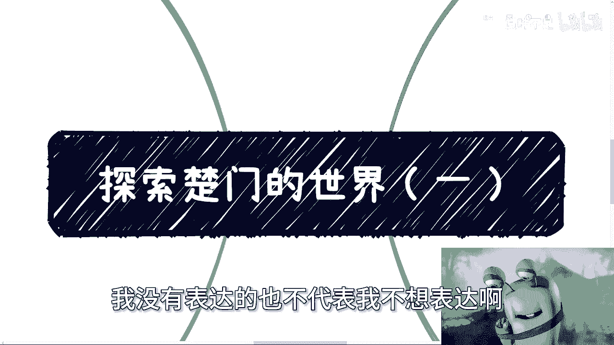

一定要记住这两个前提啊，首先我们先说第一个问题啊。

就是如果你今天管理一家企业或者一个组织啊，比如说我今天给你两个人创业对吧，我们创业做一个公司啊，呃你这个公司呢不仅仅要在本地做对吧，你可能要跨地狱作啊，你有可能跨国家做对吧啊。

很多可能性妈的这个眼睛能不能朝上一点啊，大哥等一下啊，哎怎么回事啊啊行吧，就这样吧对吧，然后呢，你说你要你要往前推进，你要发展，你靠什么。

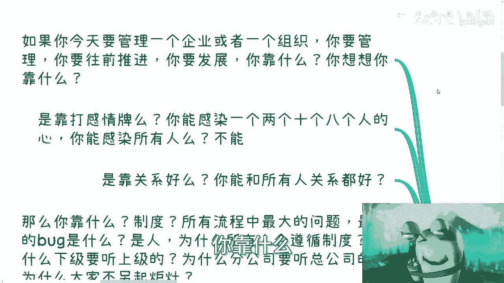

你想想看你靠什么，就是你怎么稳步的往前推进，就是你靠他感感情牌吗对吧。

你今天能感染一个两个十个八个人的行。

你能感染多少人对吧，你不可能感染所有的人，你难道靠关系吗，你能跟所有人关系都好吗对吧，你想想看会吗。

也不会，那么你靠什么靠制度吗，啊所有流程当中最大的问题是最大的bug是谁，是人对吧，就是人啊，那你为什么觉得所有人都会遵循制度，你为而为什么大家也会觉得下集要去听上级的。

就是这些东西不是这个世界的真理对吧，但是为什么它会存在呢，你们想过没有对吧。

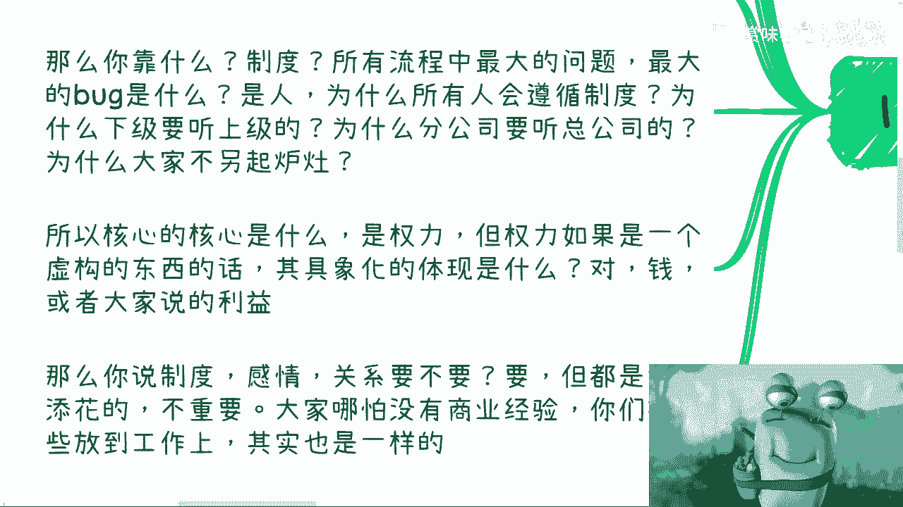

好那么我们哎等一下啊，那么我们继续来看啊，那么那为什么分公司要听总公司的，以及大家，比如说你分公司的那些人，你的员工为什么不另起炉灶呢，对吗，这些都是问题。

所以说啊我们话又说回来，所以说你说这些东西核心是什么，核心是权利是吧，核心是权利啊，那么但权利如果只是一个虚构的东西，其具象化的体现是什么，是钱，或者也就是大家所说的利益对吧好。

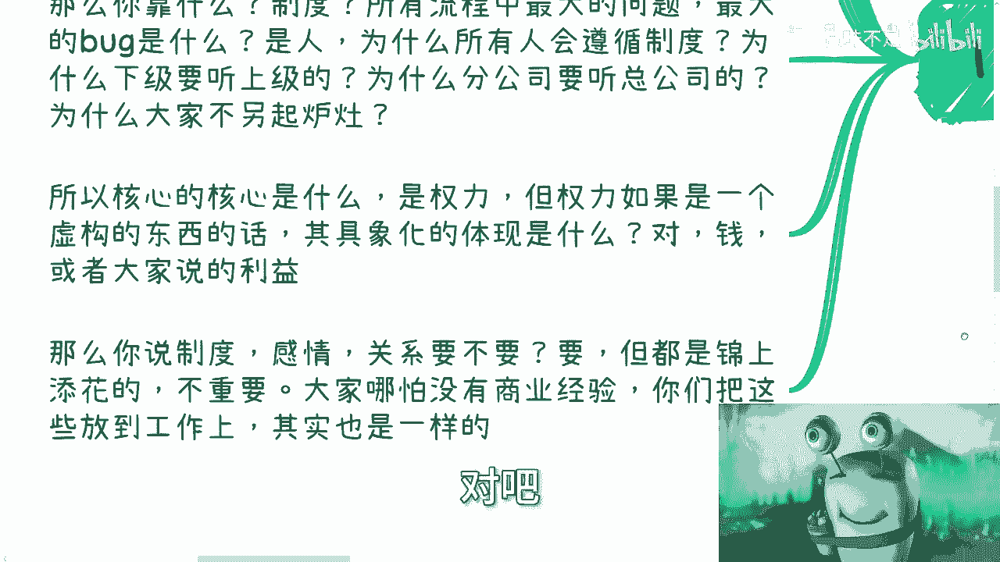

那么你说我们上面说的制度，感情关系重不重要重要，但其实都是锦上添花的，就是要不要要，但是并不是必须的啊，缺了啊，可能会效果差一点呃，有了那就更好一点，但是不会影响其根本，那么大家哪怕没有商业经验。

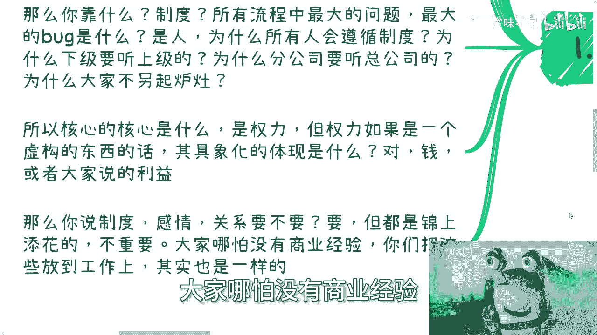

你们把这些东西放到工作上，你们去想想看对吧，比如说关系。

比如说打感情牌，对hr来PUA你的领导PUA对吧。

包括制度，但这些东西很重要吗，你自己想想看，有了他能让员工更好的去干活，没有也可以干活。

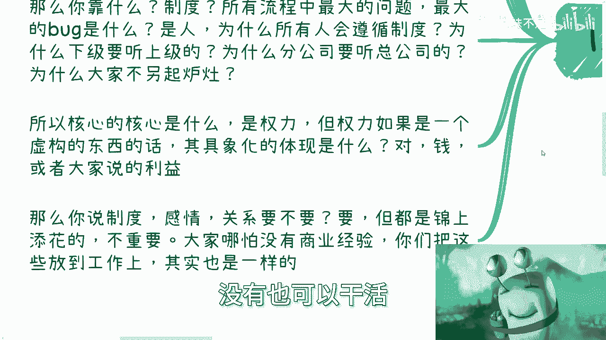

对不对，你说它本质上有多大的影响，它它都影响不大啊，那么这个问题啊，那么所以说我们来想想看啊。

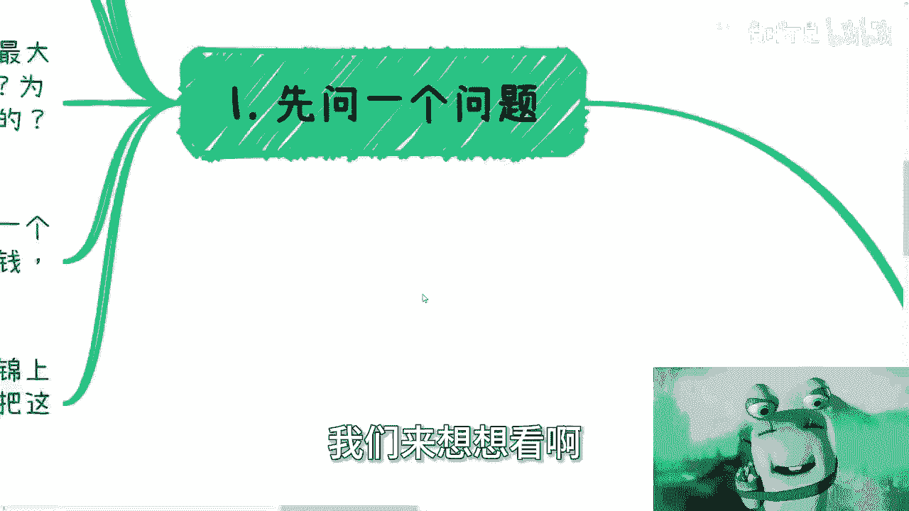

有实的也有虚的，就说一个公司人太多了，你不可能每个人都有权利，都有利益关联，对不对，好，如果每个人都有那么美，就没有人干活了，那就变成了一个空壳子是吧，而且你会发现没有人干活，不是说空壳子这么简单啊。

呃这家公司就会失去实际的价值，没有实际的价值，它就无法去支撑虚的东西，这两者其实是说关联的，也就是说其实权利跟利益和最终的执行方，和最终的下面干活的人，他是息息相关的，你看似无关，其实有关，是吧啊。

那么问题来了，其没有直接权利跟利益关联的人，他可以是谁，可以是中层管理，也可以是高层管理，也可以是下面的高级技术人员，也可以是下面的初级技术人员啊，Anyway，那么他们你说有没有权利作为这些管理者。

他有没有权利有，但是这些权利相比上面的实的权力来讲，他只不过都是虚的，是由于制度而带来的权利，而不是因为他原本有权利而带来的权利，对吧啊，那么而且这些权利他是没有真正的利益关联的。

那么所谓没有真正利益关联，就是说他不能分润，他没有股权，他没有真正的分红，或者说就算有股权，也都是一些怎么说呢，就是分出来很少的那种，叫什么激励古驰啊，那么这些权利本质你会发现啊，就算是这些虚的权利。

它本质是看制度，看权而不看人，也就是说这个权今天在谁手上并不重要，人都是可以换的，这个权总有人能够拿到他，但这个人是谁一点都不重要。

因为他是虚的啊，那么我们来想一个问题，你作为没有利益关联的人，你想通过干活或者执行或者努力去切换，从一个无利益关联的切换到有利益关联的，这可能性有多少，你自己去想啊，那么另外我得问一句，为什么要让你切。

凭什么你去切，别人不许切，好吧啊，那么第三点，所有人关注的挣钱跟职业发展到目前为止啊，其实只不过都是在一个象牙塔内。

什么意思啊，这里有两层屏障，第一层是其实所有人从现在到以后，这他这辈子关注的点都是在所谓的公司里，或者说所谓的行业里，那么问题来了，就如上面说的，大部分人都是普通人，你想通过努力去切换，怎么切怎么切。

你切开我看看是不是啊，那么你所谓的发展，无非都是虚构的权利的一部分啊，或者说是公司股权值稀释出来的一部分，占整个比例非常小的离谱的那部分，所以难道说我们出生以后，这辈子追求的就是那么一块小的豆腐干。

或者说是别人已经制定好的这块豆腐干吗，凭什么呢，那么第二层是什么，就是问题又来了，为什么是在公司里面，为什么是在行业里面，诶，奇怪了啊，公司外难道活不下去了，公司外的人都死光了啊。

公司外人赚不到钱了对吧，你就如昨天评论区有人问我，他说陈老师，我也感觉我貌似貌似不能打死工对吧，不能就是打工以后肯定是没有出路的。

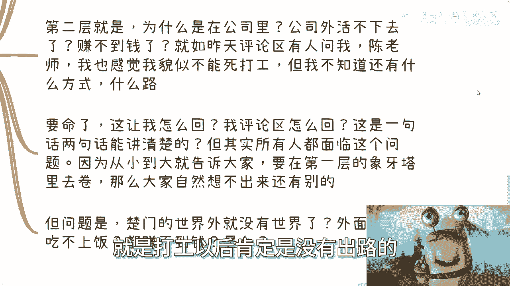

但我不知道还有什么方式，什么路，哎我跟你讲，这要命了，你让我怎么回呢，我评论区怎么回，这是一句两句话，我能给你讲清楚的啊，但其实你会发现所有人都面临这个问题，因为你从小到大，所有所有的地方。

所有的信息都在告诉大家，要在第一层象牙塔里面去卷。

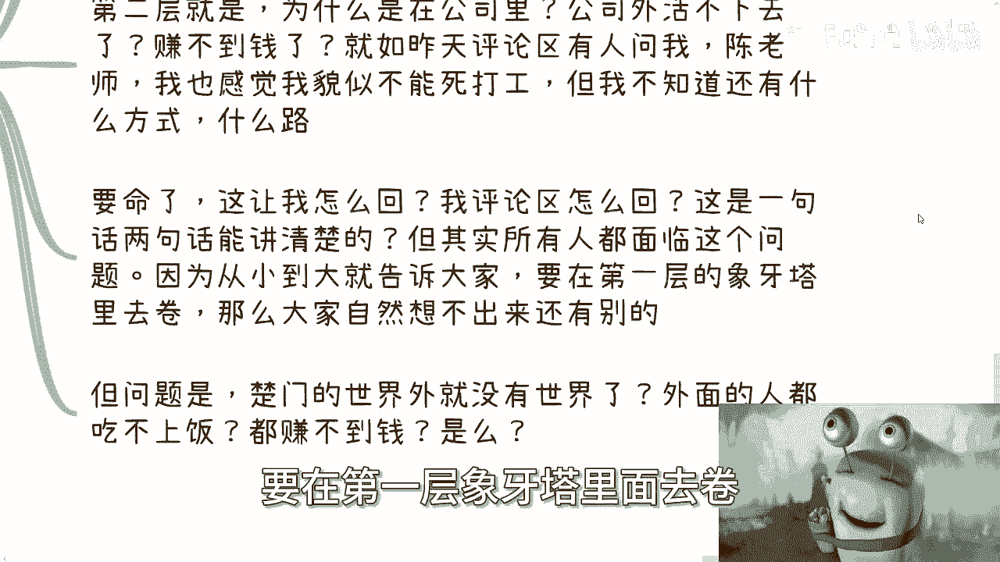

就是我们刚刚所说的公司内内部去卷，那么一样的嘛，人是想不出他不知道的东西的啊，那你让大家怎么去知道外面的路呢。

他不知道，那么问题来了，我们如果在一个楚门的世界里面对吧，那么难道说楚门的世界外就没有世界了，而这些人外面的人就不赚钱了，吃不上饭了，都都都都都乞讨，不是吧对吧。

然后那好那我们再往下讲好。

那么我们再问最后一个问题，维持这样一家公司运作的，是我们说的这些真正有权利的人，有利益关的人呢，还是说那些拥有虚的权利，跟下面执行的人呢，你简单，你但凡有点脑子，你肯定是显而易见的，对不对。

好那么虚的权利人其实是啊。

虚的权利其实是制度的一部分。

就是就像我刚刚说的，跟人是没有关系的，这个权力落到谁手上，其实并不重要，执行人是谁也不重要，都是可替换的，因为年轻人是源源不断的，那么既然如此，你从学校出来的那一刻。

其实就要去思考你到底未来要什么样的生活，要什么样的人生，要怎么样的追求，因为你即便今天卷出花来，你拥有了其虚拟的权利，你最终还是会被替换的对吧，因为你在你，你你你所有的卷。

都是把自己束缚在了第一层象牙塔里面是吧，因为你不是维持这个公司运作的关键，那么我们来想想看。

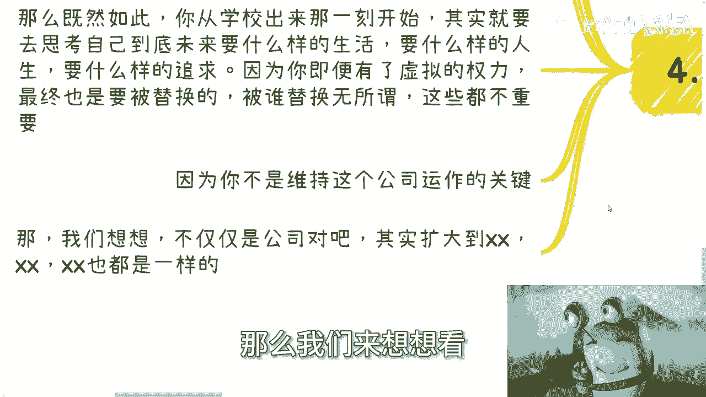

不仅仅是公司，其实你把我们今天讲的这一套东西。

放到任何地方，其实都是一样的对吧，但是唯独有一个区别，你知道在什么地方，就是每一层象牙塔，它的上下关系链其实是差不多的。

就是它的上下层级，它的上下运作模式，跟我今天跟你们讲的都差不多，但是你越往外的象牙塔去冲的时候，去突破的时候，你的自由度是越大的对吧，因为你公司层面我们可以这么说，你公司层面其实是最最小范围的。

因为制度写得很死，你没有什么空间，你能怎么滴没了，你只能按照制度来没有了，但是你到外面那层象牙塔不一样，它的自由度就很高，就是你也许一样的。

就是我们今天这个问题，也许你一样的，是，无法切换到真正的拥有实权的那些利益链当中，但是你依然能够去在所有的产业链，就所有的这个上下链路里面取得一杯羹，就是或者说你在中中高层管理。

或者你在一些执行层上面能产生呃，能获得一杯羹，而这杯羹远远比你在最里面的那层象牙塔。

所要获得的利益或者获得的权力要大得多，或者获得的自由都要大得多，好吧，就是说你们想想看，再回想一下，我今天这个视频一开始讲的那句话啊，就是我们只能讲到这，只能讲到这啊。

但是我觉得我已经把我想表达的表述清楚了啊，你们能不能听得明白，这个就看你们自己了，好吧行啊，就这么着，杭州活动好吧，25号的周周日好吧，呃要报名的继续报名，然后呃叫什么，就是剩下的呃不管是什么方向的啊。

职业也好，商业也好，或者股权也好，融资也好，各方向的啊。

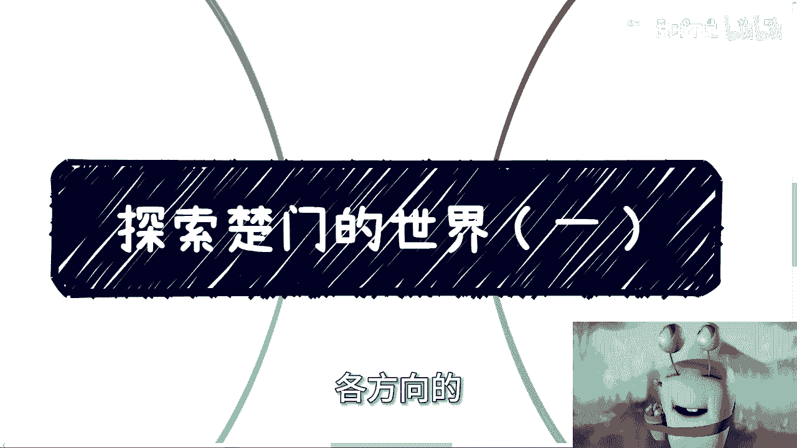