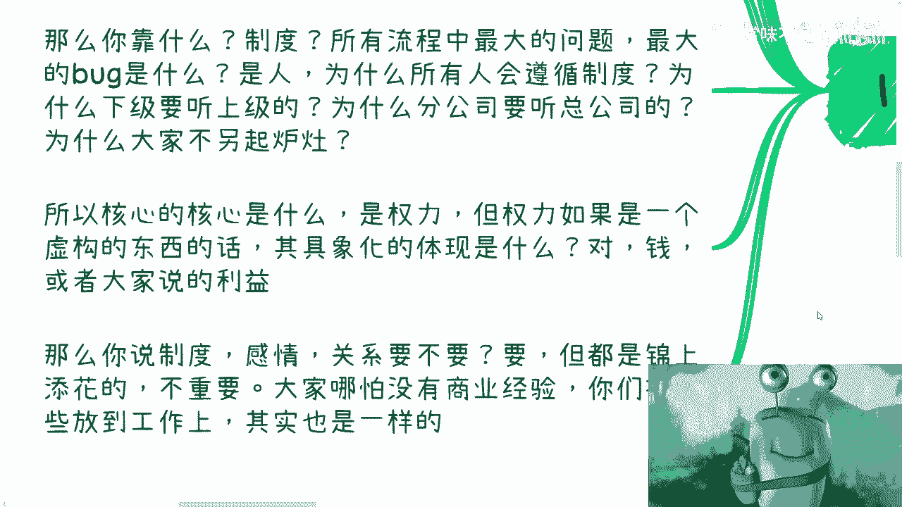

# 课程一：探索楚门的世界（一） - 组织、权力与象牙塔 🧱

在本节课中，我们将探讨组织运作的核心逻辑、权力的本质，以及个体在既定结构中的位置与局限。我们将分析为何大多数人被限制在特定的“象牙塔”内竞争，并思考突破的可能性。

---

## 课程概述

本节内容将围绕一个核心问题展开：一个组织（如公司）如何维持其运作与扩张？我们将从权力、利益和制度的角度进行分析，并揭示大多数个体所处的结构性困境。

---

## 权力的核心：利益与制度

上一节我们提出了组织如何发展的问题。本节中我们来看看其根本驱动力。

组织稳步向前推进，不能仅依靠情感或关系。情感能感染的人数有限，关系也无法覆盖所有人。制度本身也存在漏洞，因为执行制度的是人。

那么，组织运作的核心是什么？核心是**权力**。权力是一个抽象概念，其具体化的体现是**利益**（通常指金钱）。

感情、关系和制度重要吗？它们重要，但只是锦上添花。有了它们，效果可能更好；没有它们，也不会动摇根本。它们并非必需品。

---

## “实权”与“虚权”的区分

在组织中，权力分为“实”与“虚”。

*   **实权**：与核心利益直接关联的权力，例如股权、分红权。它决定了组织的根本。
*   **虚权**：由制度赋予的权力，例如中层管理的职位权。它不直接关联核心利益分配。

一个组织不可能让每个人都拥有实权。如果每个人都有，就无人愿意执行具体工作，组织会失去实际价值，从而也无法支撑那些“虚”的东西。

虚权的本质是看制度而非看人。这个权力今天在谁手上并不重要，因为人是可以替换的。年轻人总是源源不断的。

---

## 个体的困境：象牙塔内的竞争

基于上述区分，我们来审视个体的处境。大多数人从学校毕业后，其职业发展与挣钱目标都被限制在两层“象牙塔”内。

以下是构成这两层屏障的核心问题：

1.  **第一层屏障：公司/行业内的局限**。大部分人的视野和竞争都被限定在特定的公司或行业内。普通人想通过努力从“无利益关联者”切换为“有利益关联者”（即获得实权），可能性极低。你所追求的职业发展，可能只是庞大利益蛋糕中极小的一部分。

2.  **第二层屏障：思维的限制**。为什么我们默认只能在公司或行业内发展？公司之外难道没有生存空间和赚钱方式吗？不是的。但从小到大的信息环境都在教导人们在第一层象牙塔内“内卷”，导致人们无法想象“外面的路”。

这就如同生活在“楚门的世界”里。楚门的世界之外，并非没有世界，外面的人同样在生活和赚钱。

---

## 谁是组织的维持者？

我们再来思考一个问题：维持一家公司运作的，是拥有实权（利益关联）的人，还是拥有虚权及具体的执行者？

答案显而易见，是前者。拥有虚权的管理者及其下属的执行者，都是制度的一部分，是可替换的要素。他们并非维持组织运作的关键。

因此，从离开学校的那一刻起，你就需要思考：你未来究竟想要什么样的生活与人生？即便你在当前的象牙塔内“卷”到极致，获得了虚权，你最终仍可能被替换，因为你并非那个不可替代的“关键”。

---

## 突破思维：寻找更大的自由度

我们今天的分析框架不仅适用于公司，也适用于许多其他组织。但有一个关键区别：**越往外层的“象牙塔”突破，个体的自由度就越大**。

*   在公司层面，制度往往规定得很死，个体的操作空间很小。
*   但在更外层的领域（例如整个行业、跨领域生态），虽然你可能依然难以进入最核心的实权利益链，但你却有机会在更广阔的产业链或价值网络中分得一杯羹。

这杯羹所带来的利益、权力或自由度，很可能远大于你在最内层公司象牙塔中所能获得的。

---

## 课程总结

本节课我们一起学习了组织权力的“实”与“虚”，剖析了大多数个体被困于“象牙塔”内竞争的深层原因。我们认识到，制度赋予的“虚权”是可替换的，而真正的核心是利益关联的“实权”。最后，我们提出了突破当前思维限制、向外层空间寻找更大自由度和可能性的方向。理解这些结构性的设定，是思考个人出路的第一步。

---
*注：杭州活动将于25日（周日）举行，涵盖职业、商业、股权、融资等多个方向，报名持续开放。*