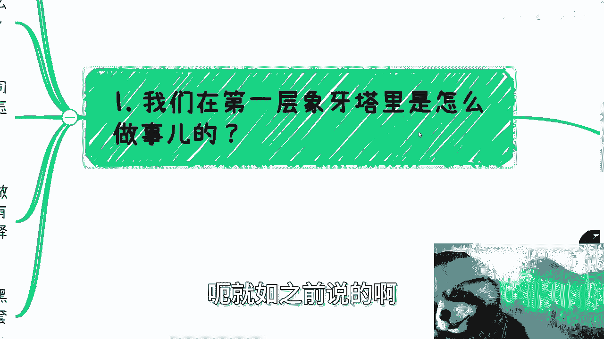
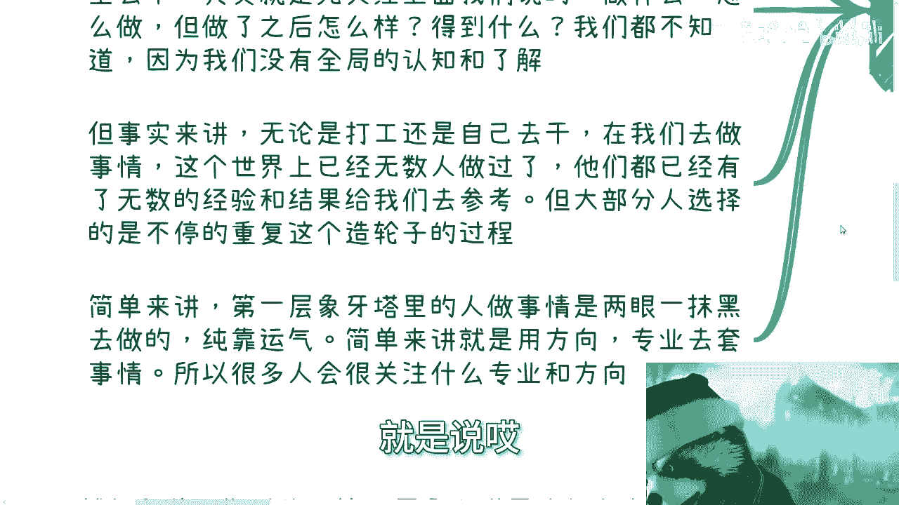
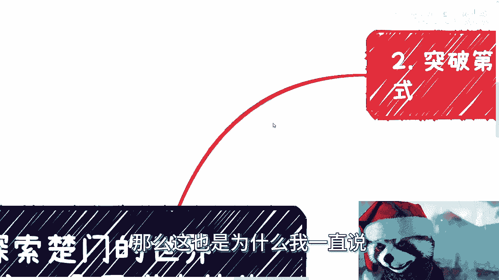
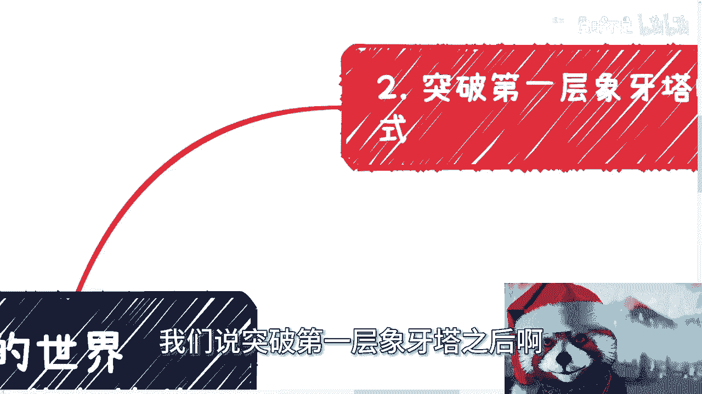
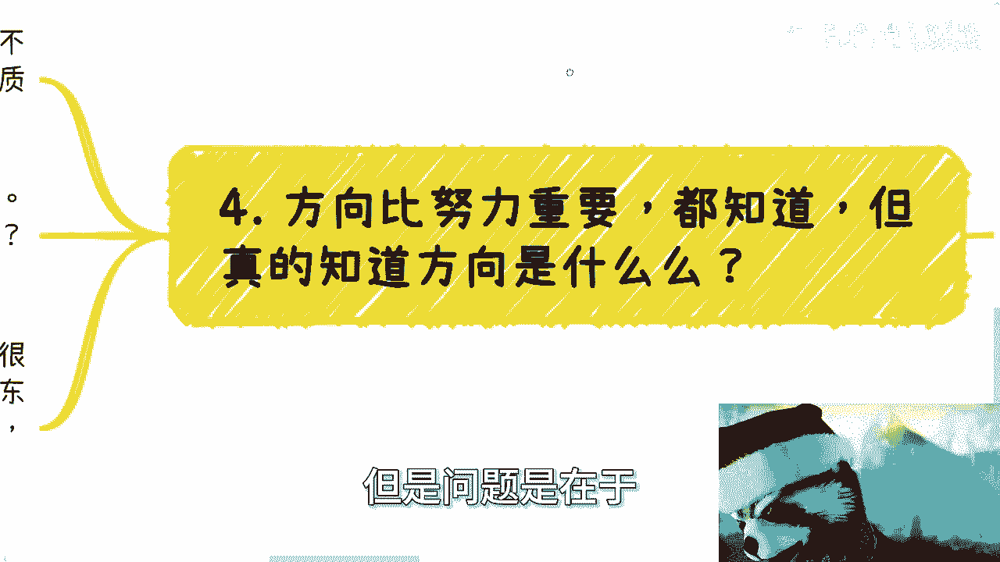
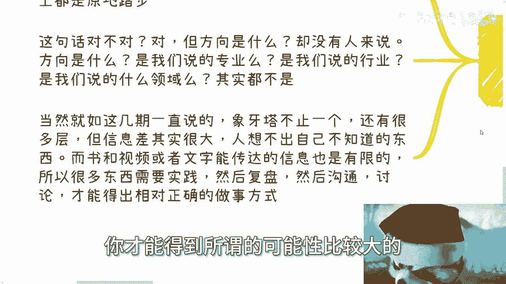
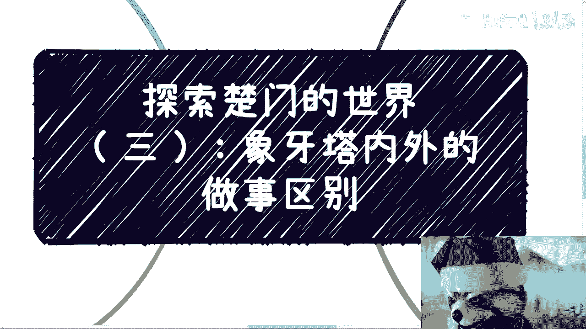

# 课程三：探索楚门的世界（三）：象牙塔内外的做事差别 🏛️➡️🌍

在本节课中，我们将要学习“象牙塔”内外两种截然不同的做事逻辑。我们将分析第一层象牙塔内的思维模式，并与塔外的实践方式进行对比，帮助你理解为何“方向比努力更重要”以及如何找到正确的方向。

---

## 概述：两种做事逻辑

上一节我们探讨了信息差与认知层级的概念。本节中，我们来看看这种差异如何具体体现在“做事”的方式上。我们将对比第一层象牙塔内（如校园、标准化职场）与塔外（真实商业社会）的思维和行动模式。

---

## 第一层象牙塔内的做事方式：关注“如何做”

在第一层象牙塔内，人们做事的核心焦点是“如何做好一件事”。这种思维模式关注执行层面。

以下是其主要特征：

*   **目标在于成为“工具人”**：关注点在于掌握技能、寻求一技之长、选择专业和学校。其根本目标并非直接为了赚钱或创造价值，而是为了成为一个更高效、更专业的执行者。
*   **遵循标准化流程**：每个人经历的培养流程高度相似，产出的是“标品”。为了区分这些“标品”，便产生了学历、学术成就等评价体系。其公式可以概括为：
    **输入（标准化教育） -> 处理（固定流程） -> 输出（标准化人才/标品）**
*   **依赖“方向”与“专业”赌博**：在选择做什么时，往往追逐热门“方向”（如AI、元宇宙）或依赖自身“专业”，但对全局缺乏认知。不清楚做一件事具体能得到什么（除了固定薪资），也无法评估回报周期。这本质上是在**搏概率、靠运气**。

简单来说，第一层象牙塔内的做事方式是**用方向和专业去套事情**，但由于商业逻辑不完整，成功概率很低。

---

## 过渡：从执行思维到全局思维

理解了塔内“如何做”的局限性后，我们自然会问：那塔外成功的人是如何做的？本节中我们来看看突破第一层象牙塔后的做事逻辑。

---

## 象牙塔外的做事方式：关注“模式与流程”

与塔内相反，塔外的人做事逻辑是反过来的。他们不依赖单一方向，而是先建立可复制的模式。

以下是其核心方法：

*   **用“模式与流程”套事情**：他们不是先看方向，而是总结或寻找已验证能赚钱的**合作模式与业务流程**。找到模式后，再为这个模式匹配所需的方向和专业人才（即“工具人”）。
*   **追求“稳定的不稳定”**：单个客户、单个项目看似不稳定。但通过拓展多个合作渠道，当基数足够大时，就能通过量变达到整体结果的稳定。这可以用一个简单模型理解：
    **总利润 ≈ Σ(项目1收入 - 成本) + Σ(项目2收入 - 成本) + ...**
    当项目数量（n）足够多时，总收入会趋于一个可预测的稳定区间。
*   **关系的动态构建**：关系是“走”出来的，需要不断维护和开拓新的合作。核心在于将能赚钱的新合作，其模式固定下来，然后不断复制。
*   **流程抽象与复制**：一旦一个赚钱路径走通，就将其抽象为可复制的流程。例如：
    1.  通过关系链/招投标获取项目（输入）。
    2.  找到执行层（工具人/团队）完成项目（处理）。
    3.  计算利润：**利润 = 项目总收入(X) - 执行总成本(Y)**。
    4.  固化此流程，更换不同行业内容（如AI、零售、农产品）进行复制（CTRL+C, CTRL+V）。

因此，塔外的逻辑是**全局逻辑**，关注的是构建和运营一个可持续的系统，而非仅仅精通某个单点技能。

---

## 过渡：重新理解“方向”

我们常听说“方向比努力更重要”。但通过以上对比，我们需要重新审视这个“方向”究竟指什么。

---

## 何为真正的“方向”？

“方向”并非指选择一个热门行业或坚守自己的专业。

真正的“方向”在于：

1.  **理解塔外的游戏规则**：明白做事应遵循“模式先行，内容填充”的逻辑，而非“专业先行，碰运气”的逻辑。
2.  **摆正自身位置**：不要过分高估个人独特性。在绝大多数情况下，我们都是在现有体系内优化和组合，而非从零创造。创新也需建立在吃透现有规则的基础上。
3.  **实践出真知**：由于信息差巨大，书本和视频能传递的认知有限。真正的理解来自于**实践、复盘、沟通与讨论**。只有亲身参与一个完整的项目流程，才能体会塔外的运作规律。

所以，“方向”指的是**选择并掌握一套在真实世界中行之有效的做事模式与规律**。

---

## 总结与回顾

本节课中我们一起学习了：

*   **第一层象牙塔内的做事逻辑**：聚焦“如何做”，目标是成为高效“工具人”，依赖标准化流程和学历区分，通过追逐“方向”和“专业”来赌博，成功概率低。
*   **象牙塔外的做事逻辑**：聚焦“模式与流程”，先建立可复制的赚钱模式，再匹配内容与人才，通过扩大基数实现稳定，并动态构建关系网络。
*   **“方向”的真正含义**：不是选择热门行业，而是理解并掌握塔外做事的全局规律和有效模式。这需要持续的实践与复盘才能获得。

跨越认知层级并非易事，核心在于跳出执行层面的思维，开始用构建者和运营者的视角看待问题。

