# 课程二：探索楚门的世界（二）🚪——我们能自己走出去吗？

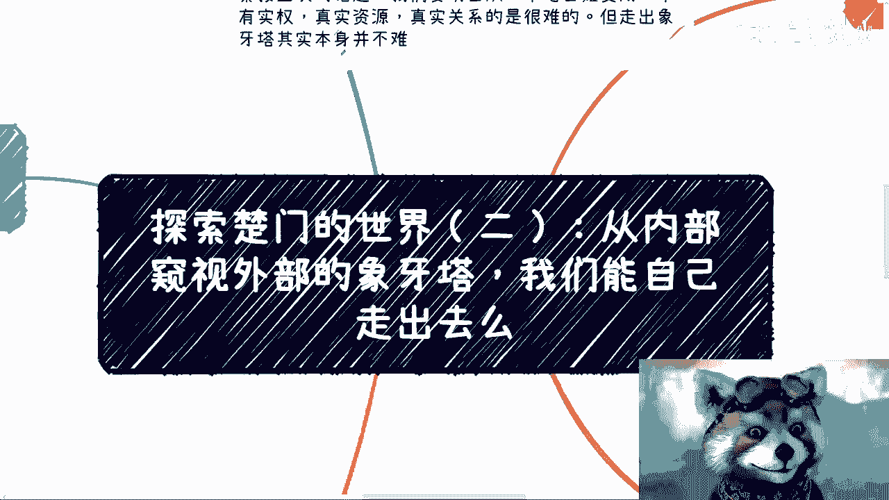

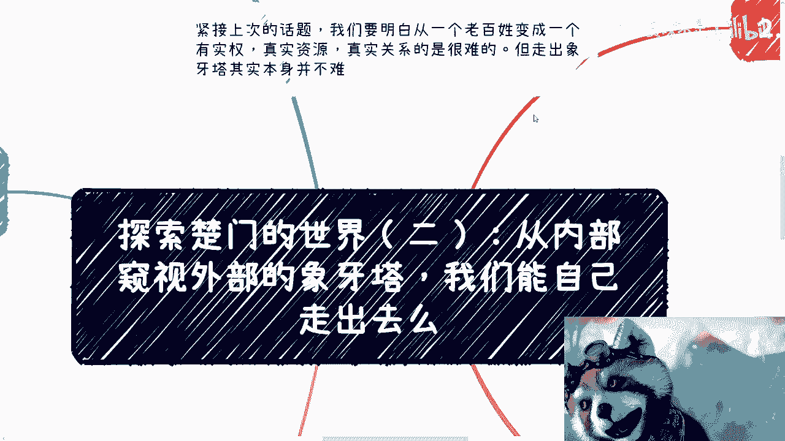

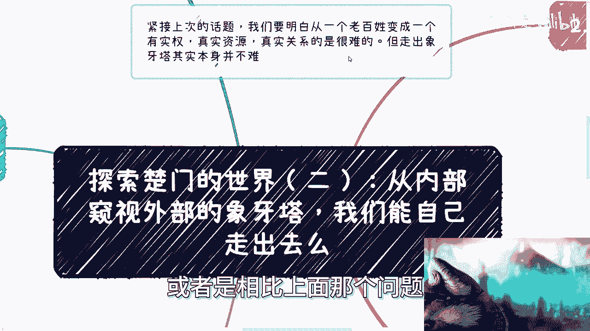

在本节课中，我们将探讨一个核心问题：当我们身处“象牙塔”内部，仅能通过有限的窗口窥视外部世界时，我们能否依靠自己的力量走出去？我们将分析内部视角的局限性、突破的难点，以及实践的关键作用。

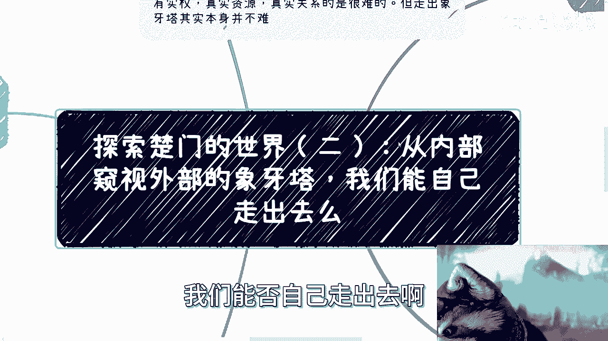

---

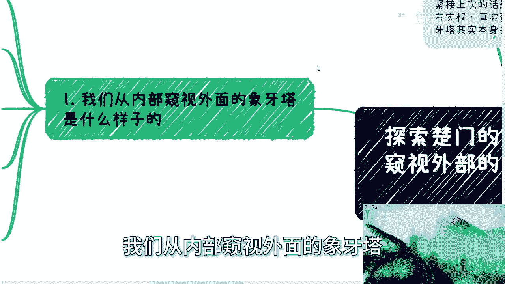

## 从内部窥视外部：我们看到了什么？👁️

上一节我们定义了“象牙塔”的概念，本节中我们来看看从内部向外窥视时，我们究竟能获得什么样的信息。

我们的信息来源主要依赖于网络、老师、家庭和朋友。在2024年，绝大多数人接触信息的主要渠道就是网络。然而，网络的本质是**幸存者偏差**。

当我们从内部窥视外部社会时，通常只能看到两种极端结果：

以下是窥视结果的两个典型特征：
*   **极致的成功**：例如网络上充斥的财富自由、创业神话。
*   **法律的威慑**：关于违法后果的警示与案例。

这种窥视带来两个心理幻想：对成功的向往和对法律的恐惧。但你依然不清楚成功的具体路径，也不真正理解法律的边界。你所看到的，只是被筛选和展示的冰山一角，甚至是人为营造的**信息差**。

虽然社会在物理上是开放的，但每个人受限于自身的成长经历（如教育、家庭环境），形成了对成功与法律的**认知偏差**。

---

## 能否走出去？这取决于天赋与实践 🧗

那么，我们能否依靠自己突破这层认知壁垒，走出象牙塔呢？答案是：这极具挑战，且高度依赖个人特质与行动。

突破的关键不在于物理位置的改变，而在于**心态、认知和工作状态的转变**。所谓的“象牙塔”可以存在于任何环境，无论是学校、公司还是某种思维定式中。

以下是实现突破所需的几个核心特质：
1.  **保持质疑与空杯心态**：你需要对一切信息保持怀疑，多问“为什么”，并且不能自负。必须持续放空自己，接受新信息。
2.  **认知到象牙塔的多层性**：你要明白，突破一层之后，外面可能还有新的“象牙塔”。真正的成长是认知层级的不断跃迁。
3.  **核心方法：实践**：空想毫无用处。唯一的方法是**实践**。无论是花钱买课，还是与名人交流，都无法替代亲身实践带来的认知改变。公式可以概括为：**真实认知 = 理论 × 实践**。

实事求是地说，依靠自己打破认知壁垒的难度**极高**。因为人容易被环境驯化。例如，刷社交媒体容易让人产生“人均富豪”或“遍地土味”的错觉，这些都是**幸存者偏差**的体现，是我们通过错误方法窥视到的扭曲景象。

---

## 为何无人告知？环境的束缚 🤐

你可能会问，既然内部视角如此局限，为什么那些可能知道更多的人（如老师、前辈）不告诉我们真相呢？

原因在于，他们大多也身处同一个或类似的“象牙塔”体系中。即使有人经历过外部世界，选择不说往往是因为：

以下是保持沉默的几个主要原因：
*   **不符合主流价值观**：揭示真相可能挑战现有的、被广泛接受的规则和观念。
*   **个人生存压力**：每个人都需要“吃饭”，揭露信息差可能带来风险，如被投诉或排斥。
*   **环境的同化力量**：在强调“团队合作”、“服从”的主流氛围中，倡导“特立独行”或“早点下班”都可能被视为异类。

因此，不能简单认为他人不告知就是对的。这本身反映了某种扭曲的价值观。理解他们的处境，但不要认同这种“沉默即合理”的逻辑。

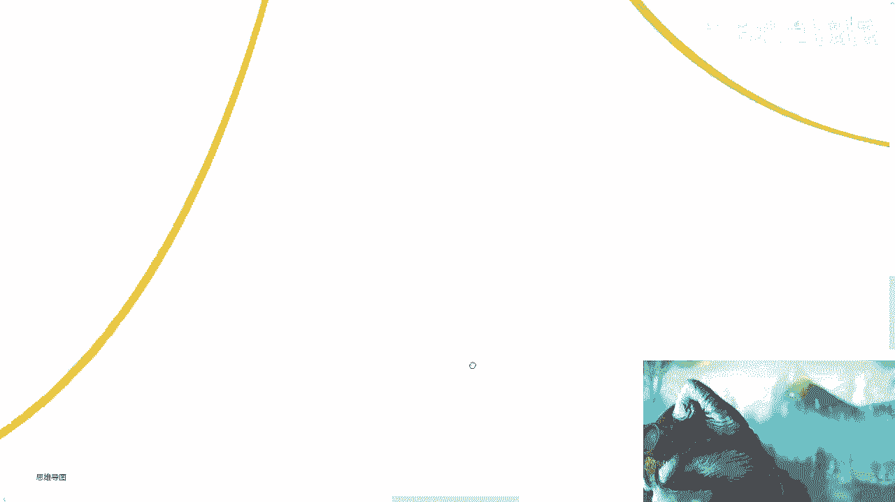

---

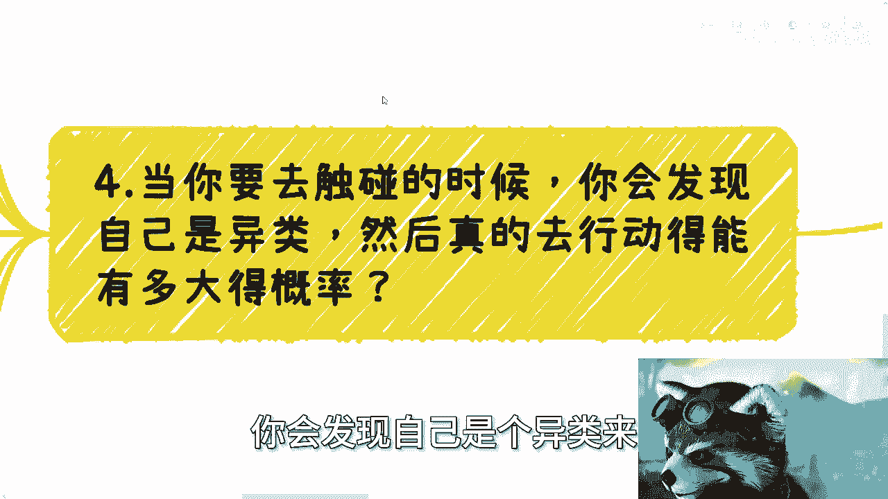

## 触碰边界：成为异类与克服恐惧 😨

当你真正开始尝试触碰并突破第一层“象牙塔”的边界时，你会立刻发现自己成了一个**异类**。

无论你通过何种方式窥视过外部，最终带来的核心情绪只有一个：**恐惧**。这是对未知的恐惧，对巨大成功或严厉惩罚这两种极端结果的恐惧，也是对周围人劝阻的恐惧。

要走出去，你需要：
1.  **克服恐惧**：直面未知，管理情绪。
2.  **坚持逆行**：当周围人都劝你留在“舒适区”时，你需要逆流而上。

这需要巨大的勇气和强大的执行力。这不是任何“知识付费”课程能简单解决的。许多商业课程鼓吹的“突破”和“前进”，其本质依然是在最内层的象牙塔规则里打转（例如，教你如何在大厂内升职、如何做副业），并未触及真正的认知边界突破。

在这样的大环境下，一个人能成功走出去的概率**很低**。更何况，即使最终走出，也可能耗费大量时间，错过最佳时机。

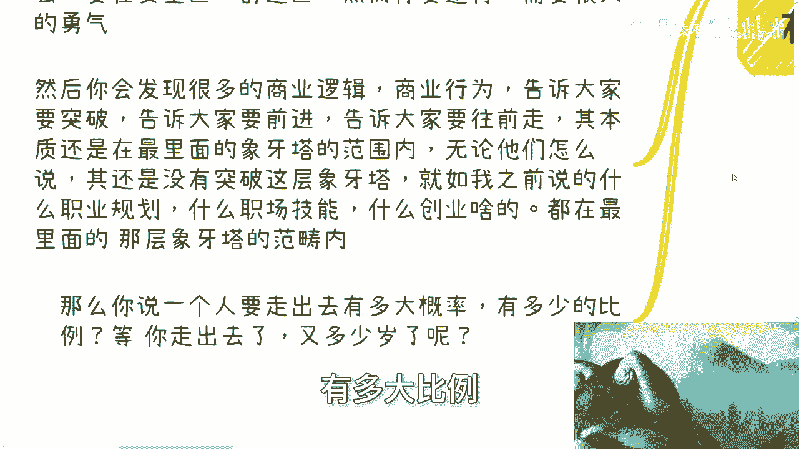

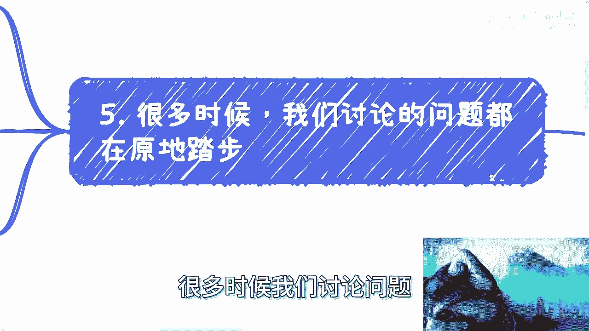

---

## 原地踏步的讨论与个人的追求 🎯

很多时候，我们的讨论其实是在“原地踏步”。例如，争论“好学校资源多”、“大厂薪资高”是否有意义？

如果这些讨论始终局限于最底层的“象牙塔”逻辑内（即如何成为体系内更优秀的“电池”），那么30分和40分并无本质区别——都不及格。重要的不是在一个封闭体系内做到相对优秀，而是能否看到并走向体系之外。

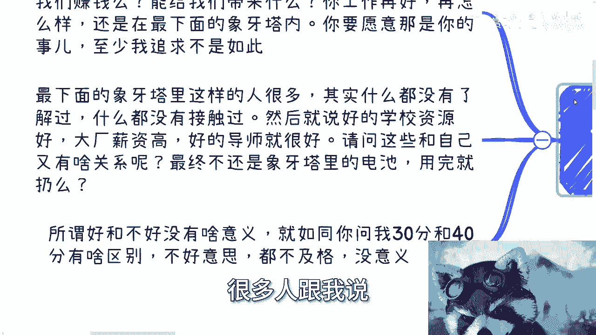

每个人都有自己的追求。有人追求年薪从20万涨到30万，这没有问题。但这与追求**突破认知层级、探索更广阔可能性**是两种不同的路径。两者没有高下之分，但不必相互争论。关键在于认清自己的追求，并为之负责。

直白一点：不要用“生活艰难”作为安于现状或掩饰真实追求的借口。追求稳定改善是一种选择，追求突破蜕变是另一种选择。

---

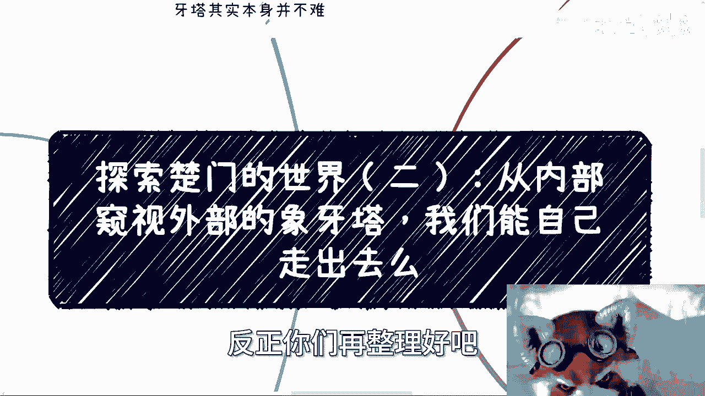

本节课中我们一起学习了从“象牙塔”内部窥视外部的局限性，分析了依靠自身力量走出去所需的特质（质疑精神、空杯心态、实践）与面临的巨大阻碍（环境束缚、成为异类、恐惧心理）。最后，我们区分了在体系内优化与突破体系这两种不同的追求。理解这些，有助于我们更清醒地看待自身处境，并做出更自主的选择。