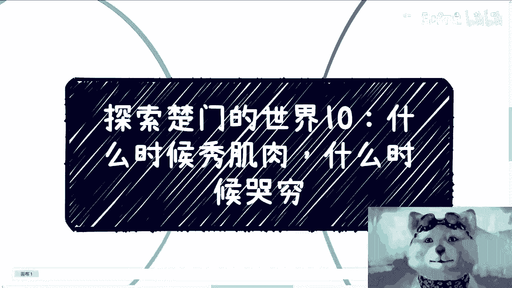
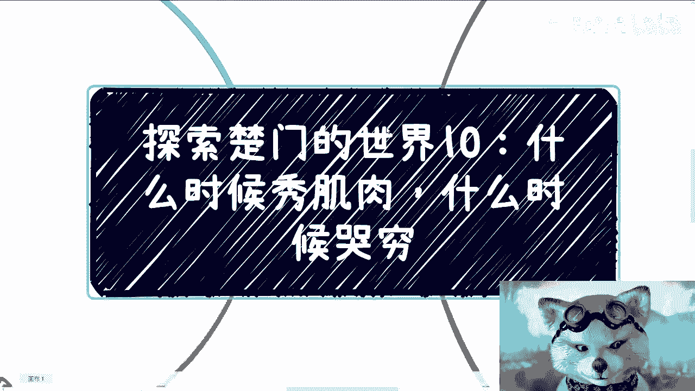
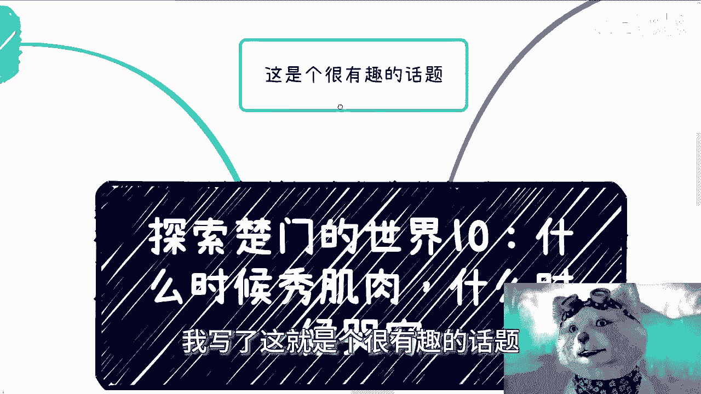
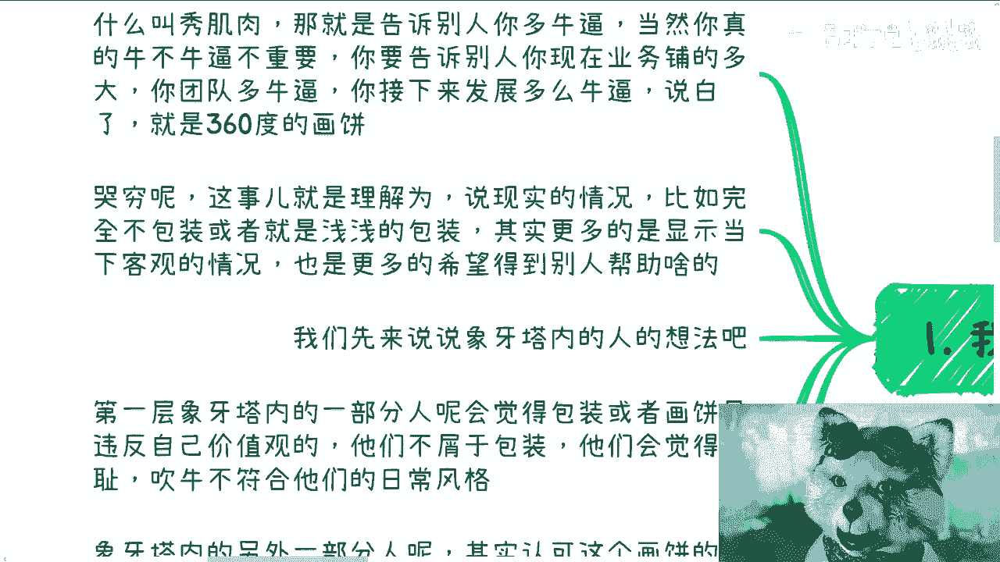
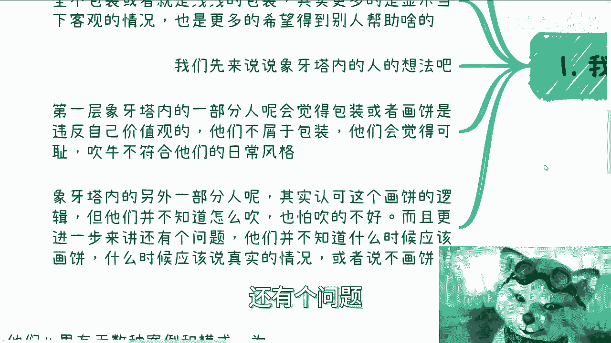
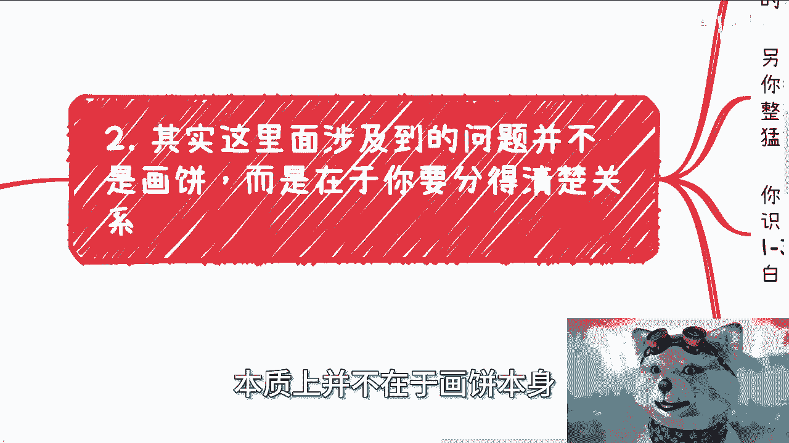

# 探索楚门的世界10：什么时候秀肌肉，什么时候哭穷 - P1 - 赏味不足 - BV1LC411Y7nR

我跟你们讲啊，真的我他妈从来没有想到过。

这个系列能他妈讲到十，我他妈我也蛮佩服自己啊，你好成狗了啊啊真的成狗了啊。

呃呃对，然后那个南京活动继续报名啊，大家这个有兴趣报名的继续找我啊。

然后今天讲的这个话题对吧，我写了啊，这就是个很有趣的话题。

就是什么时候秀肌肉，什么时候哭穷对吧，哎就很很好玩啊。

我们首先翻译一下啊，什么叫秀肌肉，秀肌肉就是告诉别人你多牛逼啊，当然你真的牛不牛逼不重要啊，你要吹的很牛逼啊，你要告诉别人，你现在业务铺的很大，你团队很牛逼啊，那么你接下来发展多牛逼啊，说白了我跟你讲。

说白了就是海陆空360度，你得跟别人去说啊，我他妈多牛逼。

然后我觉得那个很多人可能不屑一顾，但是我可以告诉你们下牙塔外的人都这么干，都这么干，我可以告诉你们他妈是个人都这么干啊，他不这么干，我觉得他就不是个人啊，那首先这第一个第二个呢哭穷呢。

这个事就理解为就是说啊说现实的情况，比如说啊它完全不包装或者就浅浅的包装啊，甚至就是说显示啊，当下客观的，就是跟别人讲了一些当下更更多客观的情况啊，同时就说他认为他跟别人讲，当下更更多客观情况。

是为了能够得到更别人的一些帮助啊，就是他可能会有一种想法，就说哎可能别人觉得我好像现在比较惨，或者比较可怜啊，那那对方可能愿意带带我啊，他往往有这种心态啊，好那么我们先来说象牙塔内的人的想法啊。

我觉得第一层，象牙塔内一部分人会觉得包装或者画饼，他是违反自己价值观的啊，他们不屑于包装，同时他们会觉得可耻，吹牛不符合他们的日常风格啊，好这是第一部分啊，另外一部分呢。

其实认为这个画饼的逻辑呢没什么问题啊，认可，但是他们也并不知道怎么吹也吹不好，而且进一步来讲，还有一个问题。

他们并不知道什么时候应该画饼，什么时候应该说真实情况，或者说画饼到底画多少，因为呃我给你们举个例子，比如说今天这张饼是百分之百对吧，那你到底遇到谁花20%，遇到谁画画40%，遇到谁花60%。

或者说你要花20%，那你画哪20%对吧，其实这都是问题啊，那么其实第二点啊，我在你说啊，其实这里面涉及到的问题呢，本质上并不在于画饼本身。

而是在于你得要分得清楚你跟对方的关系啊，西安塔内的人啊，他往往分不清楚关系，就是他的关系，就好像什么，我就问他，我说比如说你觉得世界上存在的关系是什么，他说好人和坏人啊，你再问他，哎。

你觉得还有什么朋友跟不是朋友，这样分关系，你还怎么过，还怎么玩啊，我跟你们讲啊，任何一个东西，只要你们是二极管，也不用说二极管，三极管，四级管区分，我跟你讲都不靠谱啊，为什么。

因为人类社会关系哪里这么简单啊，没有啊啊那么我这边随便举几个例子啊，我说第一你比如说关系有这么几个方面，一个是他跟你算不算合作关系，是深的合作关系还是浅的合作关系，一个对方啊。

另外一个就是说对方是不是你希望合作的，还是说你希望跪舔的啊，然后你们两者的level到底差距多大，有多大有多小，你都得去判断，另外画饼这个事也是的，一个饼，百分之百并不是每次都要画的，我跟你讲啊。

我到现在沟通到现在，我发现很多人大家是这样子的，整理好一套话术，卧槽尼玛哎，就是无论问碰到谁，他都是一顿操作猛如虎，这样不行啊，你比如说你比如说你说你说我做电商，也做教育啊，也做培训啊，然后知识变现啊。

好没问题，然后呢你你你可能就是说在这个单子当中呢，跟那个政府啊，跟其他的可能也有些关系好，那么一般来讲你要想想看，你跟别人沟通，我不管今天这个人level比你低也好，比你高也好。

你介绍你最多也就一到3分钟嘛，不可能在那边讲10分钟嘛对吧，那我就跟你讲，你怎么说，你报流水账吗，我跟你讲，你报完，我跟你这么说，无论对方是谁，对方多牛逼多聪明，你报完流水账，对方一定是抓不住重点的。

就是他对方心里面现在就一种想法，就是妈的这人到底是干嘛的对吧，所以说你碰到一个人，不是先想着怎么画饼，而是你要先评估好你们双方之间的关系，你线下碰到一个人，你今天政府第一次见到一个领导。

比如说跟这个领导吃饭，喝酒和一个创业者第一次见面，和一个商会的领导第一次见面，跟一个高校老师第一次见面，或者跟一个呃，比如说什么什么协会的秘书长，第一次见面等等等等等，我可以告诉你们。

每一个人他们的定位都是不一样的，那么这些东西是需要细节去判断的，而不是说你一概而论，上去一顿操作猛如虎啊，那么第三我们来说一下关于这个主题的结论，先说结论，结论是什么，通用点来讲啊，就是说面对合作伙伴。

或者你希望合作的，或者你跪舔的啊，你需要秀肌肉，而且要收的到位，修的快，秀的切中重点，明白听得懂吗啊，然后面对自己人，什么叫自己人，就是你觉得比如说合伙人对吧，就是说大家都是占股权的。

当然啊我指的合伙人是指真的那种合伙人啊，不是说现在有很多小伙伴诶，他他说哎陈老师啊，我们今天几个人合作啊，他是我的合伙人，这种都是双方都没有合作过，都没有磨合过，都没有赚过钱，你就用合伙人定义它。

这不是我说的那种合伙人啊，我说的那种合伙人，就说是那种大家已经一起战斗过，一起赚钱，一起背靠背信任的这种人啊，你可以真实一点，你需要有啥说啥，你需要告诉他，你真实的资源是什么，关系是什么，不要添油加醋。

不要去包装，你包装就等于害了自己人，你明白吗啊，那么而另外一方面，我补充一点，就是说，如果以上我说的两者那个那个关系都不是的话，那么剩下的所有的人你记住哭穷啊，哭穷很简单，就哭穷结束了。

因为他们对你没有帮助吗，你跟他们秀肌肉干嘛呢，你跟他们秀肌肉只会引起他们的眼红，只会引起他们的嫉妒没了，那对吧，那么很多人分不清楚，就跟我说的，要么就是对外秀肌肉秀的不对，对内呢又对自己画饼，我跟你讲。

这两者是他妈的致命伤，你比如说啊，你说今天跟高校老师第一次合作，我随便打个比方，跟高老师打那个合作啊，然后吃饭喝酒，你秀肌肉，你说哎那个某某老师啊，这个我们很牛逼啊，我们名校毕业。

我们之前做了什么业务啊，做了什么案例啊，我们之前跟别人合作做了些什么东西，比如说电商啊对吧，或者说我们刚刚说的那个那个呃呃呃，有达成战略合作对吧，我们跟这个团委对吧。

各种各样的你你你说一大堆很多东西没有用，为什么，因为你不符合他的痛点，我跟你讲，象牙塔外的人就是这样的，你可以认为他很牛逼，你也可以认为他很，为什么呢，因为牛逼是牛逼，在他们知道做实验方式，是。

在大部分人格局是不大的，就是他一定只会满心满足自己的屁股啊，你跟他讲这么多有什么用呢，你跟他说哎，我以后能给你们高校带来什么东西啊，比如说他就是我举个例子，比如说他就是个院长。

你跟他说哎我能够给你们学校带来什么合作，我能给你们学校比如说颁个什么奖，你觉得他关心我了，他又不是校长，他关心什么东西啊，他又不是党执委，他关心什么东西啊，关他吊事啊，对不对，就是你秀要秀的恰当好处。

你不要用力过猛，你也不要不用力对吧，或者用力错误啊，我不是在开车啊，对吧啊，就是说你需要修计算的同时，去摸清楚对方的痛点不一样怎么摸，你比如说你一定要让对方做选择题，而不是填空题。

你比如说啊我们跟高校做，第一你可以跟他说，我们跟高校做了校企合作啊，这个是选项一，第二我们给高校做了创业大赛，这是选项二，第三我们给高校做了师资培训者选项三，为什么你给他三个选项。

是因为这三个选项分别对应的是产品交付，会议交付和培训交付，同时这三个东西又是不同的切入点，就是呃呃那个创业大赛，校企合作以及培训都是他三个，相当于是有六个不同的维度，你想想看。

你基本上相当于是做了第一次，非常粗的一个漏斗，然后你就看对方怎么回，因为对方回对哪个东西感兴趣，他一定会多了解，那么你再往这个下面再深入，你一定要让对方做选择题，你懂了吗啊这个我跟你讲啊。

这个是非常重要非常重要的啊。

那么第四个，所以其实上一场外的人啊，你要明白在这方面都是老手，就是他们属于已经刻入DNA了，属于不需要思考的，他们心里有无数种案例跟模式，就说白了啊，如果两个人都是象牙塔外的。

你会发现这两个人可能都是在讲一些有的没的，但是他们相互之间是知道对方表达什么东西的，他们也是相互之间知道，就是说对方表达的东西之后，其实想表达什么样的意思，你知道吗，就我还是那句话，不是说他们多牛逼。

而是说这就是大家就就怎么说呢，就是有很多东西，你就是可能在象牙塔内的人来讲啊，但你们可能觉得很虚啊，卧槽怎么这么虚伪对吧，怎么怎么这么那个叫什么假大空对吧，没有办法呀，就是你我我说不好听点。

你觉得打大空难，其实对别人来讲，他背他能明白背后意思，你要我说其实是因为你太low，你不明白它背后表达的意思，所以你只认为他假大空，那怎么办呢对吧，那么在象牙塔外，其实大家都很清楚，就是什么人说什么话。

遇人说人话，遇鬼说鬼话，目的是什么，我给你讲怎么说啊，就说可能总有人要想啊，他说那按照你这个说法，人情味真情实感就没有了，我跟你讲啊，这个事就是两方面，要么就是真的自己人，大家一起他妈的战斗过。

失败过的合伙人可以的，要么就是大家赚到钱之后，说白了优先级真情实感，这东西永远低于赚钱的，你不用想了，你想都不用想，人类社会就这么一个样子啊，所以你们会发现，为什么很多家长老师从小到大会告诉大家。

你们一定要察言观色，一定要学会察言观色，一定也有很多人会说情商高不高，因为为什么，因为你一旦进入社会，脱离了打工这个体系之后，你就会发现所有东西都跟你情商有关，没有办法的，说什么微表情啊对吧。

什么什么察言观色啊，为什么，因为你需要很短时间内去看明白，或者说你要很短时间内想清楚，接下来你该怎么发言，怎么去套话，怎么去摸清楚对方痛点，甚至摸清楚对方有没有预算，你我跟你讲。

真正的沟通绝对不是说你普通话去问他，因为你问他，你没有资格问他，你懂吗，你比如说你今天来问，我，对你说陈老师，我想了解一下吧，你比如说你说陈老师，你做什么业务的对吧。

或者说你这个业务里面大概大概大概赚多少钱，我直白跟你们讲，除非你们走的是我咨询的业务对吧，我是有一手啊，你咨询业务你问我，我会想你，但凡白手，但凡这个这个这个萍水相逢，你说啊，私信问我，或者下见面问我。

那我就奇怪我为什么要回答你啊，你谁啊，你是你算老几啊，对不对，不可能的呀，你你直白点，我怎么问的，你问了对方会回答你们，你想用你的，用你的膝盖想都知道他不会回答你嘛，对不对，所以说你其实要去摸啊好吧。

所以我觉得这个事情是，也是两者里外差别很大的，好吧，哎呀没想到啊，他妈竟然能做到第十期啊，匪夷所思好就这么着吧啊，然后那个反正有什么规划，或者其他的这个呃要咨询的，你们反正整理好好吧。

