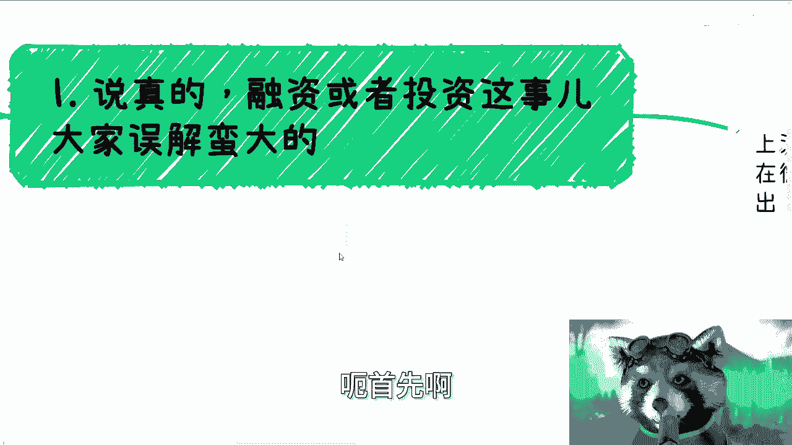

# 探索楚门的世界12：象牙塔内对于融资的误解 - P1 - 赏味不足 - BV1Hx421172D

好好大家好啊，今天我们继续来讲探索楚门的世界，12卧槽居然能到12。

我都震惊了，必须叼根烟是吧啊，对于这个融资的误解啊，首先是这样子，上海活动我也定了，本月24号北京的我也定了，在微软，就上次那个场地，本月30号啊，都要刷身份证的好吧，就是说反正报名的话。

私信我报名详情还没有出来啊，但是大差不差的啊，有些细微的内容我会调整，但是整个流程反正跟以前都差不多的啊。

啊首先我说真的啊。

我觉得融资或者投资这个事，我觉得大家误解蛮大的，夏日塔内的小伙伴，对于这个融资或者自己投资这个事啊，要么就是想的太简单，要么就是想的太复杂了啊，这事呢本来就不是这样一个看法，咱就这么说。

十到15年前风投就是VC，风投对于很多人来讲是什么，说的好听一点啊，就是自己要去赚钱啊，就VC啊，就是对于风投来讲啊，他自己要赚钱，顺便来帮大家实现实现所谓的梦想啊，所以说啊你如果还认为你想做个事。

别人投资你或者说资本本身的存在啊，比如说什么基金啊，啊什么什么什么国投啊，对吧啊，是为了实现你的梦想，那我跟你讲，你的确可以继续做这个梦想啊，那么另外正常来讲呢，合伙去做一个项目，这么说啊。

不是说大家不能投钱啊，你们要投可以投，而是说大家投降的前提，要么就是说这个钱比如说是你的闲钱，只就占你的资产呢呃10%或20%，要么就是大家已经是很熟悉的商业合作伙伴了，对吧。

那你说我们在一起去投点钱对吧，可以没毛病，但现在我发现不是的，就大家跟陌生人啊，或者说根本不熟的人啊啊被移动忽悠啊，然后呢就好像就是说创业或者做一件事情啊，别人投了钱，然后自己也要投，就是就你知道吗。

就是他们跟我讲的逻辑是什么，我问他，我说你为什么要投钱呢，他说哎那我们一起合伙，他投钱我也得投，我说我的，这是什么因果关系，对吧哦，那我这样说，我说人家自己投钱可能是富二代，有可能是。

那如果你不是钱多割得慌啊，钱多到割得慌，那至少不能做个吧，是吧啊，那我觉得这是第一点，第二点融资看的是什么，十到15年前啊，看的是背景，看的是项目包装，看的是团队，看的是未来的饼，为什么。

因为那个时候其实是一个可以陪跑的时代，是一个项目真的可以IPO的时代对吧，那大家看中的是团队的耐力，实力以及未来的发展，就说白了就是说你饼要不要画，要画的，你要是要不要实力要的啊，然后在移动互联网时代。

就是差不多2011011左右啊，那么虽然来说虚的越来越多，IPO的难度也越来越高，但是呢投资呢也就是从以前的这个风险投资呢，也转变了变成对赌投资啊，就不再是所谓的风险投资。

所谓对赌投资以前在视频里面我也讲过对吧，也就是说啊，资本跟项目方双方都得承担一定的风险啊，我们会签一个所谓的对赌协议啊，呃但是正常的投资呢在路演之后呢，也是需要进行滴滴的啊，也就是所谓的B调啊。

那么很多不靠谱的东西呢，你们哎我就这么讲吧，就大部分东西呢滴滴都能滴滴的出来啊，所以说就不要去抱有这种幻想对吧，或者怎么样啊，那么现在当下这个情况呢就更现实了，就别的先不管啊，你作为项目方。

你先给我看到现金流，看不到现金流的，那么大概率这个VC已经呃就不太会出手，毕竟现在这种情况谁敢陪跑，谁敢去投资啊，对吧啊，不过说到路演这个事啊，我觉得很多人也有个误解，就觉得呢路演讲PPT。

这个PPT要讲的高大上啊，这个饼要画的大，但我就这么说啊，呃PPT的水平其实大家大差不差的，你忽悠的水平，我觉得去的人也大差不差的，因为但凡你要是在PPT上面不行，忽悠的上面不行，我跟你讲。

你就别融资了，也就是说你连那10%你都比不过人家，你还融什么资啊，你还去录什么眼，对啊，那么剩下90%大部分是什么呢，其实是接下来的这个沟通跟提问啊，那么第三点啊，我们来说这个投资人的思路。

投资人从投资人本身来讲，思路其实很简单啊，那么圣牙塔内的很多人呢，他我后来发现了，他不是逻辑不对，而是他们认为自己的逻辑很对啊，就是说你跟他讲不对，必须是有人有事实来证明他不对了，他知道了。

但但凡没有人去跟他讲，他永远会觉得他逻辑是对的，但是呢这个逻辑呢仅仅是象牙塔内的逻辑，这种逻辑啊，你稍微提高啊，就稍微放大一些这个高label一点的地方，你就走不通了啊，那么我们回答问题的逻辑啊。

我们回你们记住我们回答问题的逻辑，绝对不能是这样子的，也就是说比如说别人问你蛋怎么来的，你为什么有这个蛋啊，你就跟别人说，你先给我只鸡啊，那么简单来讲就是说哦那我问你，你为什么能做出来。

你跟我说的是我需要你一笔钱要命了，那那我操，我他妈欠你的，我为什么捅你啊，那么奇了怪了对吧，哦上天注定你要去做的，那肯定不是啊是吧，所以说简单来讲是什么呢，就是说你一定要告诉别人，如果今天假设啊。

如果今天有100个团队在这个地方，你们做的事情都是相同的啊，你也要做什么互联网金融，他也要做互联网金融，大家都做差不多的这个方向，那么你要你其实本质上告诉投资人的是什么。

就你跟别人到底哪哪哪的地方是不一样的啊，你比如说如果别人问你留在哪来，你说我去投流，那他妈下面下面100个团队都给我去投流，然后呢哦哦我钱是多了，闲得慌是吧，还是说投资人吃饱了撑的。

就是所有的人都说头牛，那那那有什么医药，你们有卵用啊，啊对不对，就说你说头牛要不要要的啊，包括其他营销要不要也要的，但是头牛跟营销有技术含量吗，没有啊，有门槛吗，也没有啊，那你告诉你要告诉投资人。

是你的门槛在什么地方啊，你总不能跟别人说哦，我的门槛是头牛对吧，哎这就很奇怪啊，然后还有说什么说解决客户什么痛点啊，就比如说昨天南京活动，有个小伙伴说，他说要做一个数据搜集的CM系统啊，那他就问我。

他说现在推广出去很难啊，那这个东西怎么推，我说首先第一点你推广出去很难，如果事实角度它的确很难，我们不要硬推对吧，你比如说你问我，你不能说哦，哦陈老师，我们今天有个问题一定能解决。

谁跟你讲一定能解决的是吧，然后另外一方面是，客户需不需要这个数据搜集呢，或者说需不需要这个CIM系统呢，或者需不需要这个可视化平台呢，要的啊，但是很多时间你要这么想啊，他免费要跟收费要是两码事哦。

你今天做了个东西，你问他要不要我都要我都要对吧，但你跟我说，哎我一年收你10万啊，不要不要不要不要不要一定是这样子的呀，所以说你真的要去摸摸需求，你要用一个收费的东西先去把需求摸一下啊。

而不是说你说哦当下这个情况卖不好，我们怎么把它卖的更好，这不这不是一个正确的逻辑啊对吧，因为我在去年的3月份，我其实就跟大家讲过了，在当下中经济情况下，只要不是痛点的，基本上都不要能节省的都节省。

而换言之，就是说所有锦上添花的产品和服务都是虚的，你不要再跟我讲，你也不要跟投资人讲，你也不要跟客户讲，为什么，因为我们没有钱，就这么简单。

对吧啊，那么第四就是你要融资呢，本质上就是帮融投资人，帮那个投资人赚钱啊，呃首先这这里还有一点就是我还得提一点，就是千千万万万万千千不要说出这样一句话，就是昨天南京线下活动也有出现过，就是什么呢。

就是说啊说什么啊，老百姓需要什么啊，企业需要什么什么来增加效率啊，政府需要什么什么什么来来保护隐私，或者说来来来增加信任感啊，或者增加什么信用背书，怎么样怎么样怎么样，我这么跟你讲啊，舆情来讲。

如果我是资本，我只关心赚钱啊，你跟我讲的那些吊事关我吊事，对吧啊，那于理来讲啊，就我再增加一句，就是你说老百姓企业政府重视吗，好好重不重视，我不知道，我就问他们给不给钱，给钱，他们就重视。

不给钱就不重视对啊，那么于理来讲是什么，大部分人的level，真的了解所谓的需求和痛点是什么吗，他不都是自己YY出来的吗，对吧，你别骗自己啊，你像我昨天线下跟他们讲什么，我说你跟我讲老百姓要什么。

你问过老百姓没有对吧，企业要什么，你问过企业没有，政府要什么，你也别用，不要问了，政府要什么，跟我们也没什么吊关系对吧，那么你现在说赚C端的钱，我跟你讲啊，你可以去借助各种平台呃。

做各种各样的事情已经很完善了，它不像比如说10年前15年前很多东西没有啊，你说赚多赚钱，我要融资，我要怎么样子，现在你要去做，有什么不能做的哦，你总不可能跟投资方说啊，因为我要做一个跨境电商。

我现在缺一笔启动资金，要命了，那投资方是你爸啊，是不是啊，你说我需要融资赚C的钱，我个人是觉得基本上只有胖十啊，就基本上只有就是说呃资本运作对吧，就是就是就相当于是让老百姓。

或者让C端这边来做这个击鼓传花，那肯定是有的啊，你但凡正常的业务，你说融比资去赚C的钱，我哼，我还真没想出来对啊，那么所以接下来说你说赚企业赚的钱，那么企业端的生意我们打个比方啊，比如说什么无人机啊。

工业互联网啊，什么技术服务啊对吧，什么东西啊，无论你做哪个企业服务，我就跟你说两点啊，你要么就告诉我你技术哪独一无二，要么就是你关系上有哪些呃，可以确定甲方对吧，也就是说你有哪些关系积累，你很简单。

你比如说我对吧，做企业那个政企的咨询，我也可以问投资人要钱，那投资人问我了，那创老师，你做这个企业政企咨询，你跟别人相对来讲，你有哪些门槛是别人没有的，对不对啊，那我们就回到这个地方，别人讲不出来。

那不好意思，我没有啊，我没这个能力对吧，要么我就跟他说，哎你看我以前积累的有ABCDEFG，我给他全部列出来啊，然后这些人每一年能给我带来多少单单子啊，每一年的怎么样子，你给我钱之后。

这个钱我用在什么地方，我能够把它扩展扩展成多么大，多么大多么大对吧，你后面给他适当的画饼，这个逻辑可以走的，但是你绝对不能跟他走的，是说啊，因为我现在有一个有一个大纲，有一个产品，然后呢你给我钱了之后。

我可以通过打广告，通过这个SEO的排名，通过别的东西来吸引更多的客户，要命了，这不还是空对空吗，对吧，所以说其实你做的项目，哪怕是最简单的项目，项目里面本身你也得去分，就是哪些那个业务线是短线赚钱的。

哪些业务线是长线赚钱的，那么相当于就是说投资人投资你，或者说别人跟你合作，它有多种方式退出，而不是说把风险压在一个地方，这个是投资人或者合伙人喜闻乐见对吧，那这就像什么，这就像你跟我合作。

你说陈老师我们合作对吧好，那么我一定会跟你讲，哎我现在手上有三根是短平快的线，我需要合作的，有一根是常见的线，我需要合作的对吧，哦我总不可能跟你说，来我们就合作一个这个东西，周期两年，卧槽谁合作啊。

啊对吧，一定是这样子哦，两年你看不到钱，你还跟我合作，你心里熊老师，对不对，一定是这样子的啊，所以说啊我跟你们这么讲。

就是说融资这个事情啊啊你要融，如果就我以前其实也说过你，但凡要融，你一定要想好资本运作怎么运作，而不是说这个产品怎么做好，产品怎么做好，不是当下最大的问题，因为产品做好跟你最终能不能赚钱。

跟客户是不是接触它没有因果关系，或者没有直接的因果关系，你觉得好，别人觉得不好，这么低了呢，跟人家打一架没有用的，最终是要资本运作，最重要，大家赚到钱，这才是核心啊，你换位思考想想看，你手上有笔钱。

比如说呃你手上啊那个那个叫什么，就是比如说5500万，1000万吧对吧，你要去投，你怎么滴，人家给你画个一两年的饼，你说好，我投，我跟你讲，你上来100万可能会这么投，等投到你手上只剩下100万了。

你看看还会这么投吧，对不对，一个道理啊啊啊OK然后从本系列从此往后啊。

我是会越来越在细化，就是之前的话相当于是整个面好象牙塔内外哦，然后我会再往细了再去说，往下面再去说，好吧啊呃行好吧，就这么着，然后那个活动本身反正详情还没定，但是你们可以先报名，反正时间还早好吧。

然后剩下的话就是职业规划，商业规划啊，然后什么融资啊，合同啊啊，然后其他的东西啊，包括个人的职业发展啊，包括就是结合你们想了解当下更多的一些信息，或者什么东西啊，你们可以整理好问题列表好吧。

