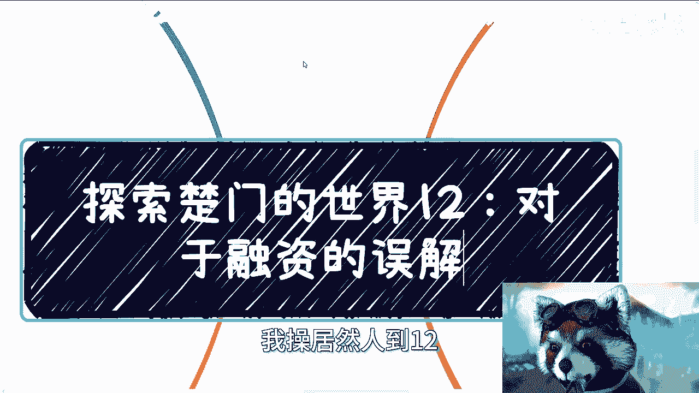
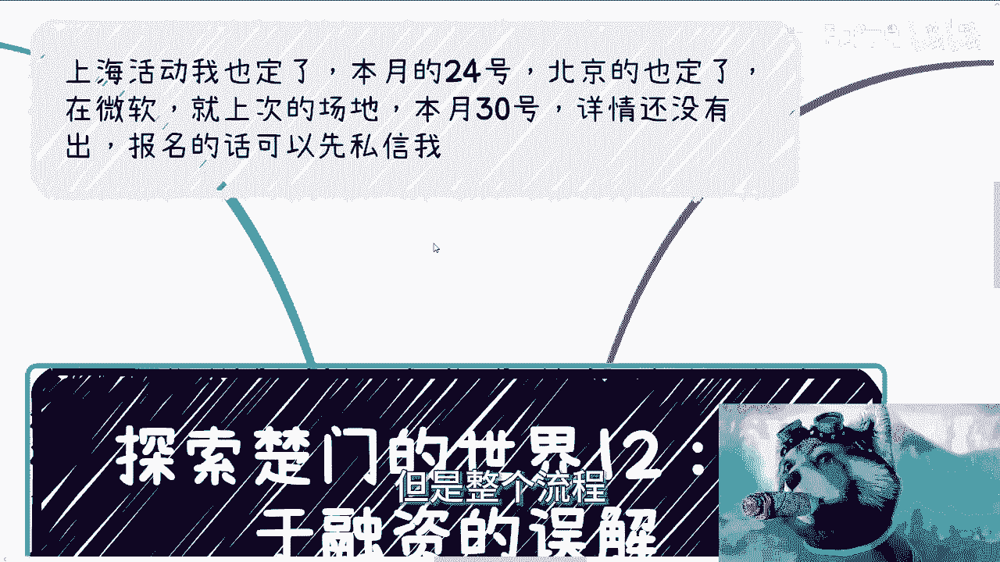
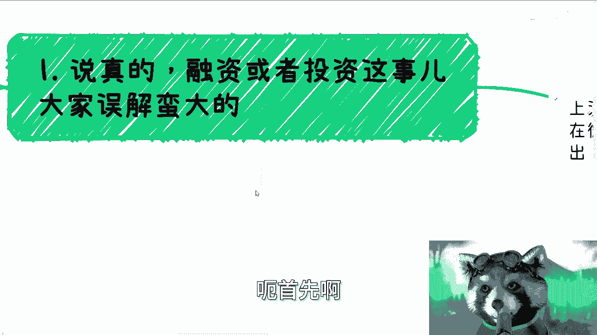
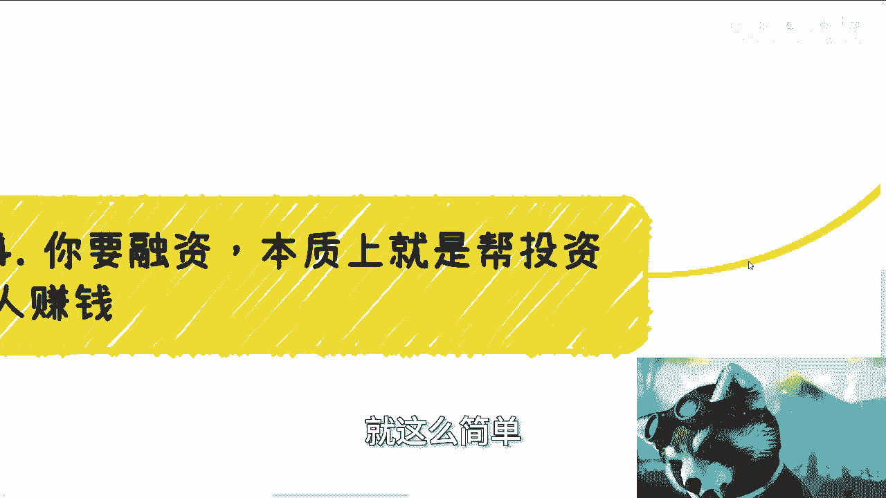
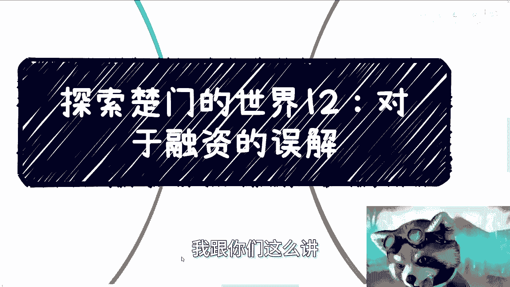
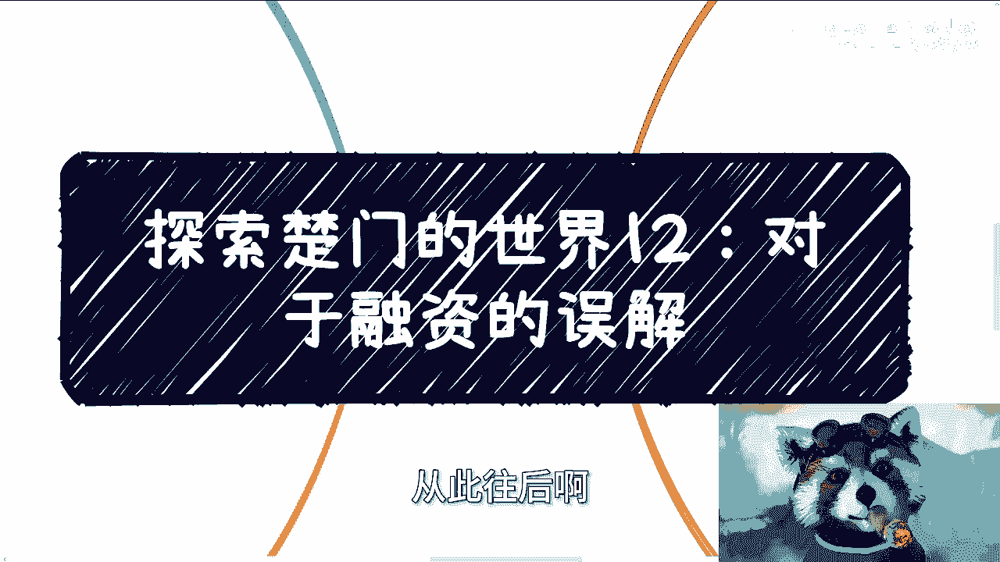
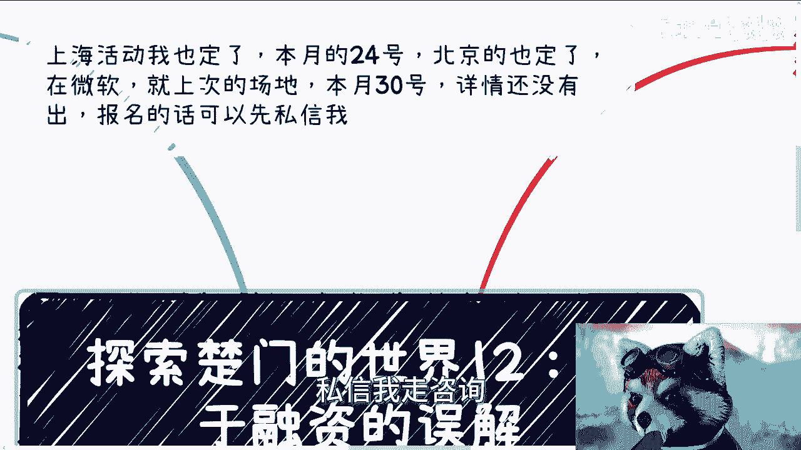

# 探索楚门的世界 第12课：象牙塔内对于融资的误解 - P1 💰

在本节课中，我们将要学习关于融资的核心误解，并澄清象牙塔内（指脱离实际商业环境）对于投资、路演和商业逻辑的常见错误认知。我们将从投资人的真实视角出发，分析一个项目如何才能获得资本的青睐。

---

## 课程活动通知 📅

本月将举办两场线下活动。上海活动定于24号，北京活动定于30号，地点在微软（与上次场地相同）。活动均需刷身份证入场。

报名详情尚未完全确定，但整体流程将与以往活动类似。有兴趣者可私信报名。

---

## 融资的核心误解 🤔

上一节我们介绍了课程安排，本节中我们来看看关于融资的第一个核心误解。许多人对于融资或投资这件事，要么想得过于简单，要么想得过于复杂。正确的看法并非如此。

风投（VC）的本质是**赚钱**。十到十五年前，风投在赚钱的同时，或许会帮助创业者实现梦想。但如果你至今仍认为资本的存在（如基金、国投）是为了实现你的梦想，那你可以继续保留这个幻想。

关于合伙投钱，前提应是：投入的资金是你的闲钱（例如仅占资产的10%-20%），或者合作方是彼此熟悉的商业伙伴。然而现实中，许多人被陌生人或并不熟悉的人鼓动，在对方投资后自己也跟着投资，这种因果关系并不成立。

别人投资可能是因为他是富二代，或者钱多。如果你并非如此，至少不应盲目跟投。

---

## 融资的评估标准演变 📊

上一节我们讨论了跟投的逻辑问题，本节中我们来看看融资的评估标准是如何随时间变化的。

**十到十五年前**，融资看重的是：**背景、项目包装、团队实力和未来的蓝图（画饼）**。那是一个项目可以长期陪跑并最终IPO的时代，资本看重团队的耐力、实力和发展潜力。

**移动互联网时代（约2011年左右）**，情况开始变化。虽然虚的成分增多，IPO难度加大，但投资模式从“风险投资”转向了“对赌投资”。双方需共同承担风险，并签订对赌协议。正常的投资在路演后，会进行**尽职调查（DD/B调）**，大部分不靠谱的项目在此环节会被筛除。

**当下环境**则更为现实。项目方必须首先展示**现金流**。看不到现金流的项目，风投大概率不会出手。在当前环境下，无人敢轻易陪跑或投资。

---

## 关于路演与沟通的误解 🗣️

上一节我们了解了融资标准的演变，本节中我们聚焦于路演环节的常见误解。

许多人认为路演就是讲PPT，并且PPT要做得高大上，饼要画得大。但事实是，PPT水平和画饼能力，大家相差不大。如果你在这方面的能力不如前10%的人，那基本不用考虑融资。

路演中更重要的部分是**接下来的沟通与提问**，这占据了90%的权重。你的临场反应和逻辑说服力至关重要。

---

## 投资人的核心逻辑与常见错误 💡

上一节我们指出了路演的重点在于沟通，本节中我们来剖析投资人的核心思路以及创业者常犯的逻辑错误。

象牙塔内的许多人，其问题不在于逻辑错误，而在于**坚信自己错误的逻辑是正确的**。这种逻辑只在封闭环境中成立，一旦进入更高层面或真实商业世界，便完全行不通。

**回答问题的逻辑绝不能是循环论证**。例如，别人问“蛋怎么来的？”，你不能回答“你先给我一只鸡”。同理，当被问及“你为什么能做出来？”，你不能说“因为我需要你一笔钱”。这种回答毫无意义。

你必须向投资人证明你的**独特性与门槛**。假设有100个团队做互金，你要说明你与其他99个有何不同。如果说你的门槛是“投流”（买流量），那毫无意义，因为投流没有技术含量和门槛，人人都能做。

---

## 如何验证真实需求 🔍

上一节我们强调了证明独特性的重要性，本节中我们来看看如何验证一个需求是否是真实、付费的痛点。

许多创业者声称要解决客户痛点，例如做一个数据搜集的CRM系统。但当被问及如何推广时，他们才发现困难。

首先，推广困难是客观事实，不应硬推。其次，关键在于区分“免费需要”和“付费需要”。客户可能口头表示“都要”，但一旦提及收费（例如每年10万元），态度立刻转变。

因此，正确的方法是**用收费产品去试探真实需求**，而不是在卖不好的情况下，一味思考如何卖得更好。

自去年3月起我便强调：在当前经济环境下，只要不是痛点需求，客户基本不会付费；所有锦上添花的产品和服务都是虚的。原因很简单：大家都没钱。

---

## 融资的本质：为投资人赚钱 💸

上一节我们探讨了需求验证，本节中我们触及融资最核心的本质：**帮投资人赚钱**。

千万避免对投资人说：“老百姓需要…”、“企业需要…来提高效率”、“政府需要…来保护隐私”。作为资本，**我只关心如何赚钱**。你所说的那些“崇高目标”，与我无关。

从道理上讲，你所谓的需求和痛点，有多少是经过实际调研的？大部分只是自己的臆想（YY）。例如，你说老百姓需要某物，你问过老百姓吗？企业需要某物，你问过企业吗？

**关于To C（面向消费者）业务**：现在借助各种平台，很多事情已经可以完成。如果你对投资人说“我要做跨境电商，缺一笔启动资金”，投资人不是你爸，不会为此买单。当前，纯粹的To C业务想靠融资成功，除非涉及资本运作（如击鼓传花式的金融游戏），否则极其困难。

**关于To B（面向企业）业务**：无论是无人机、工业互联网还是技术服务，你必须向投资人证明两点之一：
1.  **技术独一无二**。
2.  **拥有确定的客户关系或资源积累**。

例如，我做政企咨询，如果投资人问我门槛是什么，我必须列出积累的客户资源（ABCDEFG），证明他们每年能带来多少订单，并说明融资后如何利用资金扩大规模。绝不能空谈“有了钱后，我可以通过打广告、SEO吸引客户”，这仍是空对空。

---

## 项目规划：风险分散与退出机制 📈

上一节我们明确了融资是为投资人赚钱，本节中我们学习如何规划项目以吸引投资。

你的项目规划必须清晰区分**短线赚钱的业务线**和**长线赚钱的业务线**。投资人投资或与人合作，希望有多种方式退出，而不是将所有风险压在一处。

这就像合作：我会告诉你，我手上有三条短平快的业务线可以合作，也有一条长期业务线可以合作。我绝不会只说“我们就合作这个，周期两年”。两年看不到钱，谁还会合作？

---

## 核心总结与后续安排 🎯

本节课我们一起学习了关于融资的多个核心误解。

首先，融资的本质是**帮投资人赚钱**，而非实现个人梦想。其次，评估标准已从看背景、画大饼，转变为**首要关注现金流**。路演的重点在于**深度沟通**，而非华丽的PPT。回答投资人问题时，必须展示项目的**独特门槛**，避免循环论证。验证需求时，要用**付费意愿**来测试，而非空谈痛点。规划项目时，要设计**多元化的业务线与退出机制**，分散风险。

**最关键的一点是**：融资前，必须想清楚**资本运作的路径**，而不仅仅是产品如何做好。产品好与最终赚钱没有直接因果关系。大家最终能否赚到钱，才是核心。

换位思考：如果你手上有1000万，初期可能会投一两个画饼的项目。但当资金只剩100万时，你绝不会再这么投。

从本系列课程开始，后续内容将更加细化，从宏观的“象牙塔内外”对比，深入到更具体、更底层的商业逻辑分析。

关于职业规划、商业规划、融资、合同或个人发展等问题，大家可以整理好问题列表。活动详情虽未最终确定，但可提前报名。