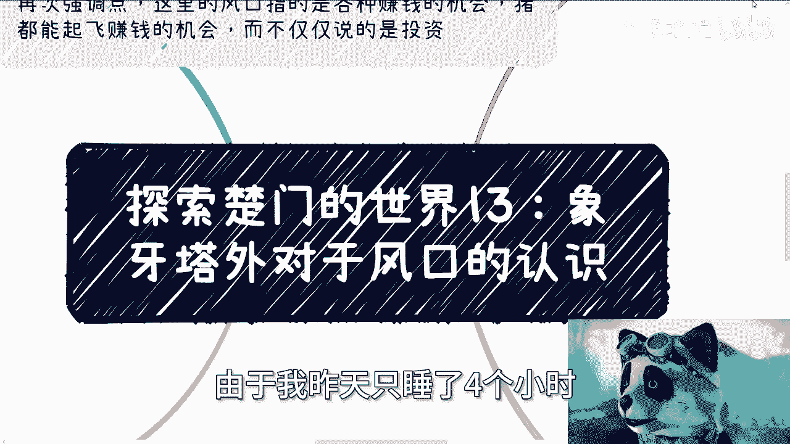
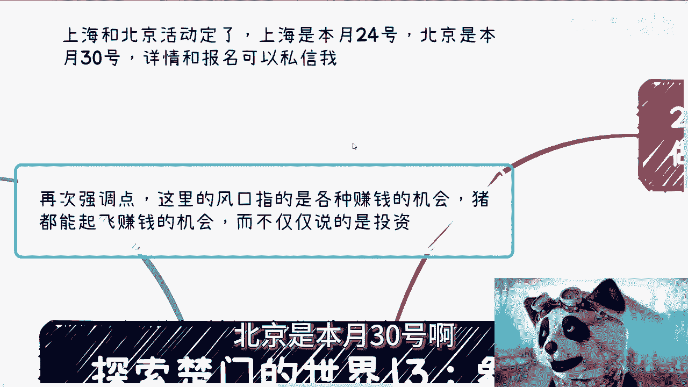
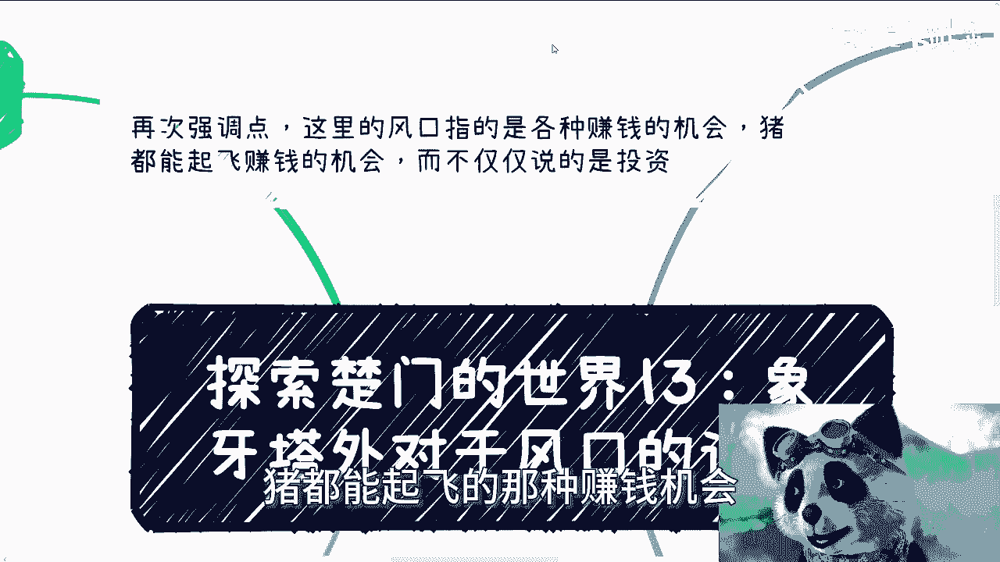
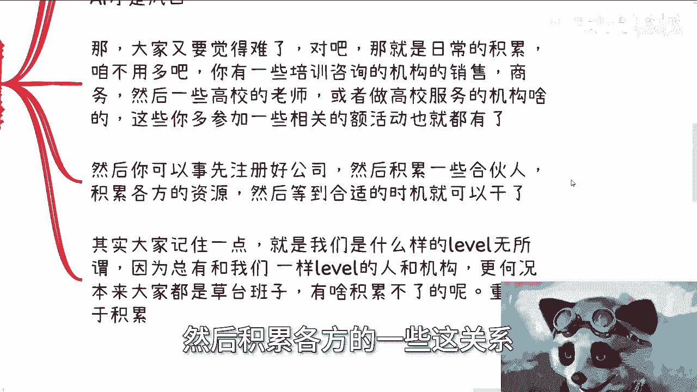
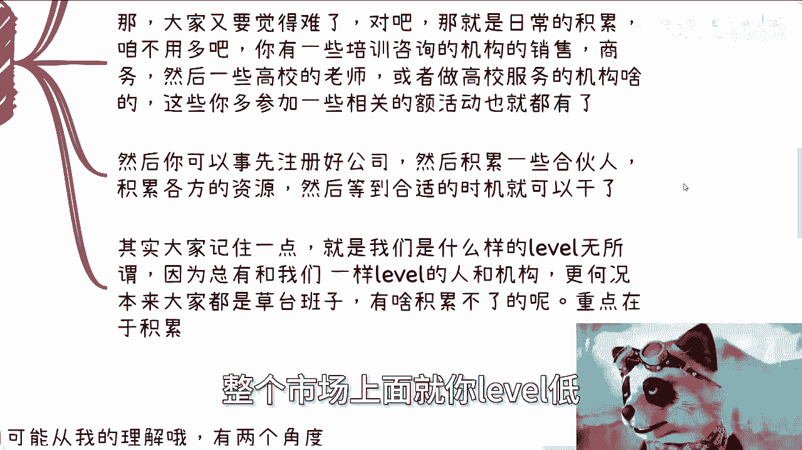
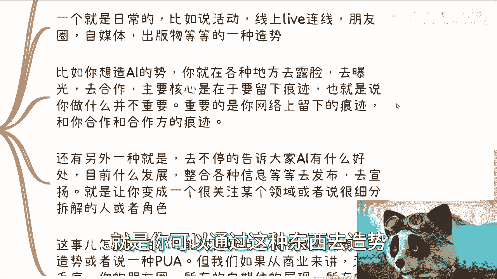
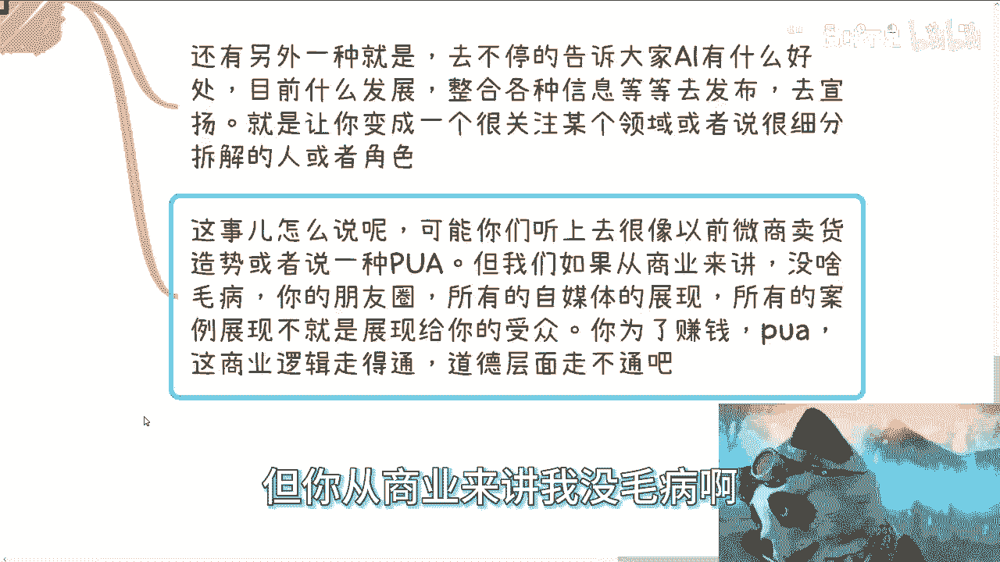
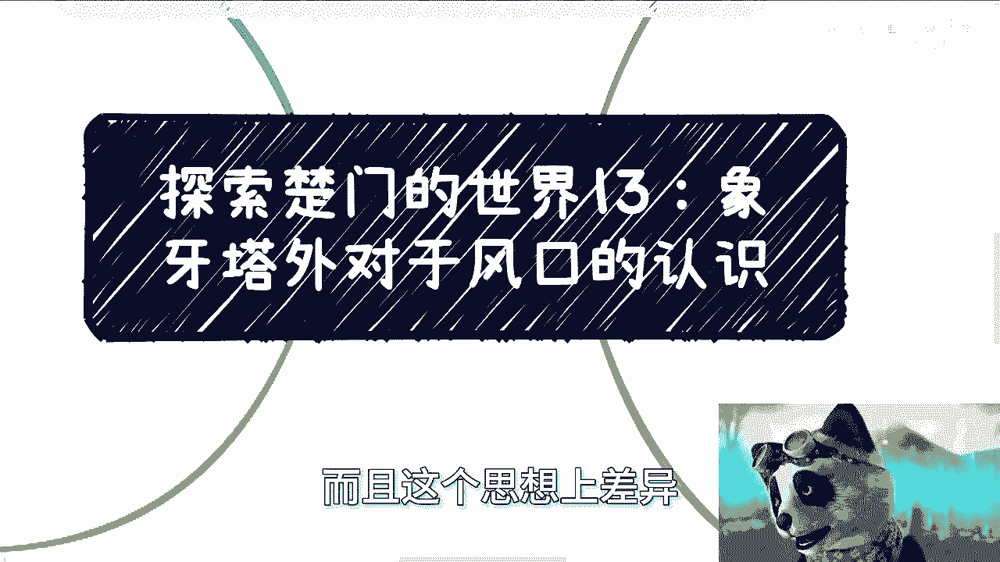
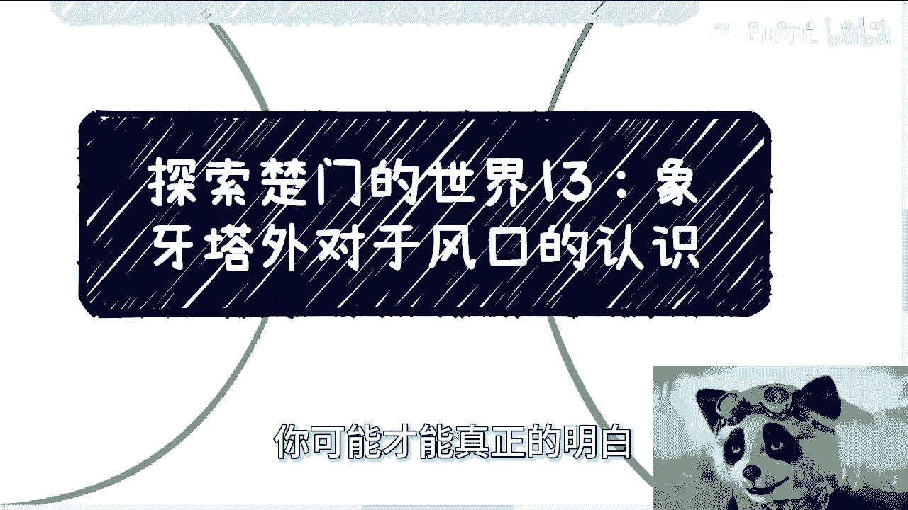

# 探索楚门的世界 13：象牙塔外对于风口的认识 🚀

在本节课中，我们将探讨象牙塔外的人如何看待和把握“风口”。我们将分析他们与象牙塔内人群在认知上的核心差异，并学习如何识别、参与甚至创造属于自己的机会。

---

## 课程概述与活动通知 📅

上海与北京的活动时间已确定。上海活动在本月24日，北京活动在本月30日。活动详情与报名请通过私信咨询。

需要明确的是，本节讨论的“风口”泛指各种**赚钱的机会**与**业务模式**，即那些能让参与者迅速获得成功的市场窗口。它并不仅限于投资领域，切忌将“风口”简单等同于“投资”并盲目投入。

---

## 回顾：象牙塔内的风口认知 🏛️

上一节我们介绍了象牙塔内人群对风口的普遍看法。本节中，我们来看看象牙塔外的视角有何不同。

象牙塔内的小伙伴对风口的认识通常存在以下局限：
1.  **认知局限于自身专业领域**：这种局限往往源于当初选择的志愿或专业，而非个人真正的擅长或兴趣。
2.  **普遍存在自我或外界PUA**：常认为风口与自身无关。
3.  **对风口的定义模糊**：许多人误以为风口仅指投资机会。

然而，真正的风口包含大量可实际操作的可能性。象牙塔外人群的看法与之有根本性差异。

---

## 核心差异：资源匹配 vs. 专业绑定 🔄

象牙塔内外认知最根本的差别在于：**象牙塔外的人关注自身资源与风口的匹配度，而象牙塔内的人则常被专业方向所束缚**。

对于塔外的人而言，任何风口都可以参与。他们评估的核心是：自己手上有哪些“牌”可以打。这些“牌”通常是通用能力，例如：
*   **营销**
*   **运营**
*   **产品开发**
*   **商务关系**

这些能力并不与特定行业强绑定。而塔内的人往往只看自己的专业方向是否与风口直接相关，甚至不去盘点自己拥有的通用“牌”。这种思维差异导致了机会捕捉能力的天壤之别。

---

## 风口的参与形式：不止于创业 🛠️

理解了核心差异后，我们来看看具体如何参与风口。以去年3月兴起的人工智能（AI）风口为例，参与方式远不止创立一家AI公司。

以下是AI风口下可操作的多种形式：
*   **面向消费者（C端）的知识付费课程**
*   **面向政府、企业的AI培训服务**
*   **在高校开设AI相关的公开课、选修课或必修课**
*   **申报AI领域的创新项目**
*   **组织面向大学生或社会的AI竞赛**

你可能会觉得这些机会难以接触。关键在于，所需的核心能力（如营销、销售、商务关系）应在**日常积累**，而非风口出现时才临时学习。关系只是关系，AI、区块链、元宇宙等不过是其中的变量。今天做AI培训，明天也可以做云计算培训，核心在于你已积累的通用资源和能力。

---

## 提前布局与团队组建 🤝

无论个人当前水平如何，市场上总存在相似水平的个人或机构。大家本质上都是“草台班子”，都有积累和成长的空间。

你可以通过以下方式提前布局：
1.  预先注册公司，积累法律实体。
2.  积累潜在的合伙人及各方合作资源。
3.  维护好各类人脉关系。

当时机来临时，你便能迅速拉起团队行动。这远比看到风口后才开始了解、学习要高效得多。总有人与你水平相当，关键在于是否提前做好了准备。

---

## 学会“造势”：主动创造机会 🌪️

除了抓住风口，更高阶的玩法是学会“造势”，即主动创造或放大某个细分领域的机会。“造势”可以从两个角度进行：

**1. 日常痕迹留存**
通过以下方式持续曝光，留下网络痕迹：
*   举办或参与线上线下活动、直播连线。
*   经营朋友圈、自媒体账号。
*   发表出版物、行业观点。

核心目的是在搜索引擎和媒体上留下你与某个领域（如AI）的关联痕迹，尤其是你与知名机构（如高校、大企业）的合作痕迹。这能逐步建立你在该领域的认知度。

**2. 持续内容输出与观点宣扬**
不断向你的受众传递特定领域的价值：
*   阐述AI等技术的优势与发展。
*   分析其在各领域的结合应用。
*   通过朋友圈、公众号等渠道，塑造自己在该细分领域的“专家”或深度观察者形象。

从商业逻辑看，这种“造势”本质上是为目标客户（受众）进行营销铺垫，最终是为了销售产品或服务。它在商业上是可行的路径。

---

## 总结与核心要点 🎯

本节课我们一起学习了象牙塔外人群对风口的认知与行动方法。

我们来总结一下核心要点：
*   **风口是时间窗口**：它本身只是一个周期性的机会，关键在于你能否利用它。如同学历，不懂得利用就毫无价值。
*   **思想差异是根本**：塔内的人常想“如何自己做”，而塔外的人则想“如何利用那些想自己做的人来赚钱”。这是商业思维上的本质差异。
*   **关注细分风口**：我们可能无法创造“AI”这样的大风口，但可以在其下创造“知识变现”、“地方项目融资”等细分风口。例如，将一线城市的成功案例复制到二三线城市，就是一种“造势”。
*   **实践出真知**：上述思维差异和操作手法，仅靠观看或阅读难以真正领悟，必须通过亲身实践才能融会贯通。

希望本课内容能帮助你转换视角，更主动地识别和创造属于自己的商业机会。

---

如有关于职业发展、商业规划、股权融资或产品方向的问题，可以整理好具体问题后私信我预约时间详谈。