# 探索楚门的世界13：象牙塔外对于风口的认识 - P1 - 赏味不足 - BV1Wp421U78e

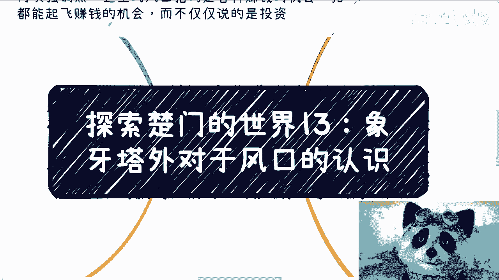

好大家好啊，我们今天继续来讲探索楚门的世界，13啊，就是昨天的姐妹篇啊，象牙塔外对于风口的认知，由于我昨天只睡了四个小时。

我现在脑子可能不太清楚啊，待会讲的时候没有逻辑性，你们原谅一下啊。

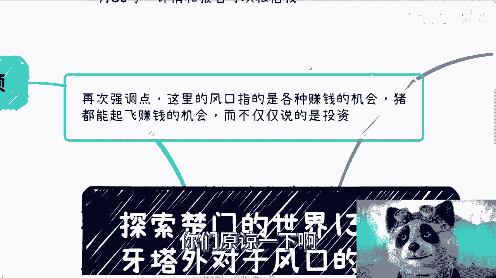

首先那个上海跟北京活动定了对吧，上海是本月24号，北京是本月30号。

详情跟报名可以继续私信我，然后再次强调一点啊，这里的风口指的是各种赚钱的机会啊，就是各种业务模式啊，猪都能起飞的那种赚钱机会。

而不是说仅仅说的是投资啊，不要听到风口就觉得就是投资就all in梭哈，对吧啊，那么首先先回顾一下昨天的视频啊。

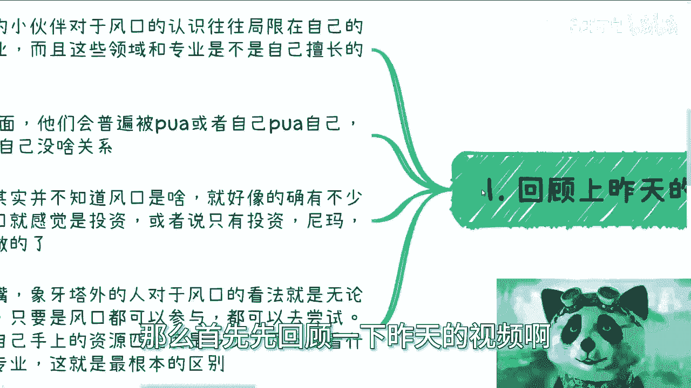

就是象牙塔内的小伙伴呢，对于风口的认识呢，往往局限在自己的领域跟专业，而且这些领域跟专业呢是不是自己擅长的，其实他们也不知道啊，只不过是因为他们当时报了这么一个志愿啊。

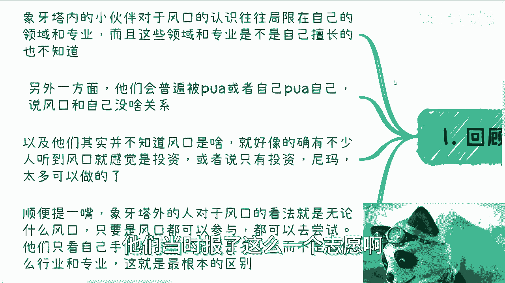

或者来说报了这么一个专业啊，那么另外一方面呢，他们会普遍的P被PUA或者自己PUA，自己说风口跟自己没有关系啊，这是第二点，第三点呢以及他们其实并不知道风口是什么啊。

这就好像的确有不少人听到风口就感觉是投资，或者说只是只有投资啊，那么但是呢，其实真正的风口里面有很多是可以做的啊，那么最后一点呢就顺便提一嘴啊，就是象牙塔外的人呢，其实对于风口的看法。

跟这个昨天我们说的象牙塔内的人，对于风口看法他有一个巨大的差别，就在于什么呢，就是对于象牙塔外面的人来讲，风口是无论什么风口，只要是风口都是可以参与的，呃，呃他们只看他自己手上的资源匹配度有多高。

就说难听点，就是说直白点，就是看自己手上的牌到底有哪些可以打，因为很多牌是通用的，就比如说什么营销啦，运营啦，产品啦，开发啦对吧，包括有些什么广告公司啊，它都是有通用度的啊，而不是说只看自己这个团队啊。

或者是资源方啊，是什么行业，什么专业，我觉得这就是最根本的区别，就是说他们是外面的人是只看这些牌的匹配度，而里面的人呢甚至牌都不看，他只看专业跟自己的这个方向，那其实它本质上差别就很大很大啊。

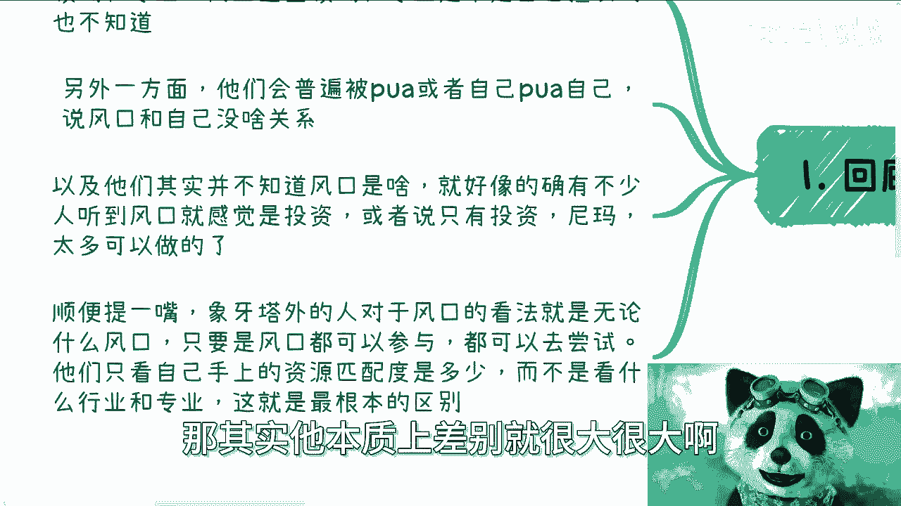

那么第二点对于像塔外来讲啊，风口可以做什么，我们来举个例子，比如说今天啊去年3月份人工智能很火对吧，开始这个到处都在说GPT对吧好，那么你可以去做C端的知识付费，你可以去做政府啊。

这种这种企业的AI的课程，你可以去做高校的公开课，选修课，必修课啊，你可以去做一些AI的这种创新项目的申报，你可以去做AI的这个大学生，包括社会层面的竞赛，巴拉巴拉巴拉这些很多对吧，这些其实都是风口啊。

不是说你今天必须创业一家AI公司才叫风口，那么当然大家又要觉得很难对吧，他说啊这个你说的这些我们接触不到对吧，我们怎么样怎么样，但是你要这么想啊，不是说今天有这个风口，你去接触的，因为你仔细想想啊。

你做C端的知识付费，你更多的是接触什么，接触营销，接触分销，接触这些知识付费的平台怎么用，你不要到了风口，然后你看到了，你说好，我先去学了，我先去积累，这他妈怎么来得及呢，对吧。

你比如说你说做政企的AI的课程，那你要的是政企的这些对接业务的这些销售，和对接业务的这些商务，那A是不是AI对他们来讲无所谓嘛，什么时代做什么事情吗对吧，也就是说你要的是日常去积累，这些关系。

而不是说你到了AI的时候再去积累这些关系，你你之所以这么觉得，是因为你认为那些关系跟AI强绑定，但是其实关系只是关系，AI也好，区块链也好，元宇宙也好，大数据也好，像云计算也好。

不都是里面的一个变量而已，今天做什么不是做。

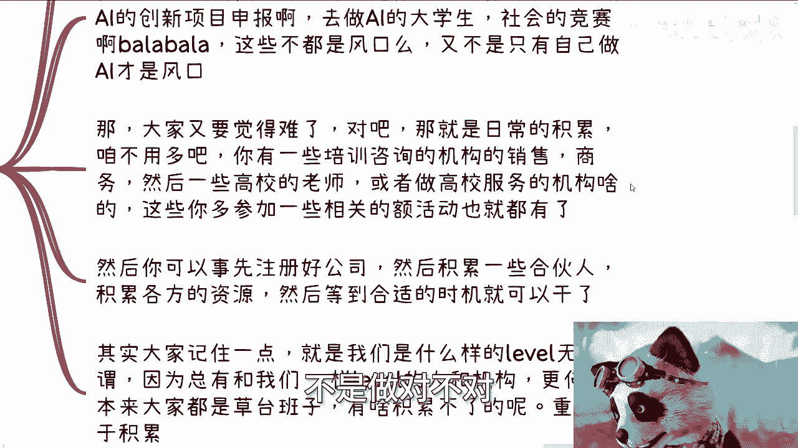

对不对，有什么区别，你跟核心根本原因是在于日常没有积累啊对吧，然后你也可以事先注册好公司，然后积累一些合伙人，积累各方的一些呃，不是合伙人啊，积累一些合作资源，然后积累各方的一些这关系。

然后等到合适的时机，你就可以拉团队起来干，当然你说能不能干得起来，咱们再说嘛对吧，总比你就说今天发现一个风口，你说好，大家都对这个东西很感兴趣好，然后呢我要开始去了解了，要命了，这他妈你抓得住个屁。

对不对，所以说其实大家记住一点，就是我们是怎么样的level，无所谓，因为无论你今天是怎么样的label，总有人是跟我们一样的对吧，总有人总有机构是跟我们一样的，更何况本来大家都是草台班子。

有啥积累不了的呢，你不要就是感觉好像哎呦哎陈老师，我现在我现在这种感觉label很低对吧，或者说我积累不到，你怎么滴了啊，我的，整个市场上面就你level低。

大家level都高吗，你觉得会不啦，对不对，我觉得这种问题用膝盖想想就知道不会呀。

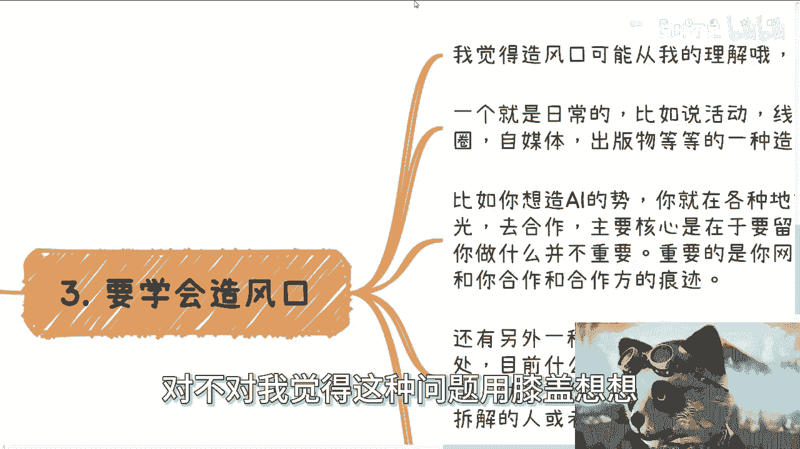

啊那么第三要学会造风口。

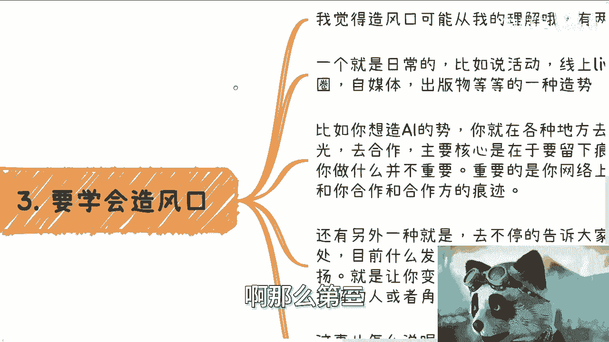

哎我就跟你讲这个东西是很奥妙的，就是我觉得造风口啊。

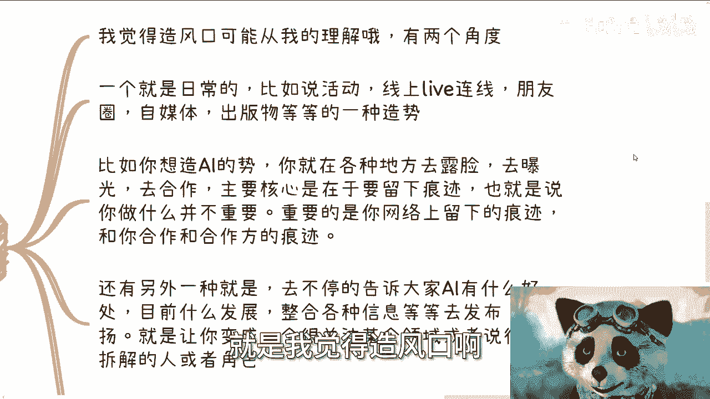

就是从我的理解，因为我不知道，我也没想出来，怎么很好的跟大家去描述这个问题啊，我觉得有两个角度，第一个呢就是说日常的，比如说活动啊啊线上的一些live的连线啊，啊，朋友圈啊，自媒体啊，出版物啊等等等。

就是你可以通过这种东西去造势。

比如说你想造一个AI的事，你可以在各种地方去露脸，去曝光，去做topic，去合作，然后主要的核心目的是为了留下痕迹，也就是为了留下，比如说网络媒体啊，媒体的一些报道啊，呃呃留下一些自媒体的痕迹啊。

就是更多的能够让搜索引擎能够搜索的出来啊，那么重要的是你留下来这个痕迹，以及你和你与合作方的痕迹，就是你你一个人肯定不行嘛对吧，你比如说你跟交大合作，明天跟跟跟微软合作，或者跟谁合作，你得留下痕迹。

你知道吗啊，那我不知道这样表达你们能不能理解啊，就是这个是也是呃造势的一部分，然后还有一种呢就是说你要不停的去告诉大家，比如说啊AI有什么好处对吧，AI比如说目前的发展怎么样。

AI在各种领域可能怎么结合的啊，然后去宣扬，去发朋友圈，去发公众号，去发各种各样的东西啊，能够让你变成一个呃呃呃关注某个领域，或者说很细分拆解的这么一个呃人或者角色，甚至大家说的专家啊。

呃但是这个事怎么说呢，就是你们现在听下来，可能啊，我觉得你们这个感觉，可能就像以前什么微商卖货造势啊，就发朋刷朋友圈那种对吧，或者说可能就是一种PUA，甚至是一种洗脑，但是你们想想看啊，仔细想想看。

我们讲的是商业，我们今天不是来讲用爱发电的，对不对，也就是说如果我们真的从商业来讲，我你们仔细想想，这逻辑没有毛病啊，因为你你从个体来讲，你从一个就是说大家一起赚钱角度来讲，你们的朋友圈。

你们的所有的这种媒体，所有的案例展现出来，不就是展现给你的受众的嘛，对不对，也就是说你为了赚钱，你先去造势，那这个造势你们想想，造势这个词可能可能还还褒义词一点，对吧。

但是你们自己想想看造势的目的是什么，是为了卖货，是为了赚钱，是为了最终卖服务，你可以把这件事情理解为PUA我我我，我觉得没什么问题，但是你也要客观的理解，就是这件事情在商业逻辑上他是走得通的。

你觉得他走不通，只是因为你觉得自己在道德层面上走不通，你明白吧，不是就这就这件事情没有任何法律上的问题，那你说他而且这个事情也不像，就是说有很多人说什么我抄袭对吧，我去抄我这个我不认可的啊。

我我是很抵制那种，就是说什么没有版权意识，没有产权意识的，但是这件事情你说怎么说呢，你说我认可吧，你从我的良心来讲，我不认可，但你从商业来讲没毛病啊。

是不是啊，所以我觉得总结一下啊，就是我觉得核心在于风口啊，他只是个时间窗口跟周期，但是呢你得懂得利用它，就像我们以前就像我以前一直说的，就是说硕士跟博士，他只是一个学历，但是你要懂得怎么利用它。

你不懂的，他就是NO nothing对吧，你就这样，我魏晨说的，比如说现在他里面的人什么都想着自己做，但是象牙塔外面的人，他都第一时间想着怎么利用，那些想着自己去做的人去赚钱。

这其实就是思想上本质上的差异，你说孰对孰错，这没法判断对吧，然后另外就是风口，这个东西，很多时候呢就是有大风口跟下面的细分，就像我们刚刚说的，去年比如说大风口是AI对吧，但是我们说的知识变现啊。

项目融资啊，政府KPI啊对吧，符合政府导向啊，建立什么产业园啊，这些都是属于大风口上的细分，那你说我们今天造势是造不了大风口的，但是下面这些细分我们可以造啊，怎么不能造呢，你说知识变现好。

我们造出来一个案例说哦这个东西很赚钱，这不就是造吗对吧，项目融资，我们可以拿着一线城市的这种融资到二线城市，到三线融资，而三线城市去去跟资方说，哎你看我们已经安利了对吧，就是说这些是可以造势的。

你知道吗，但是你说我我们能不能在全国，在哎在甚至全球领域把AI造出来，那我觉得这可能不太现实，或者说把某个大的呃呃呃呃这个这个风口造车，这个我觉得不太现实啊，所以说你们仔细想想看啊。

因为我我我我不知道我讲的你们能不能理解啊，但是你们仔细想看，还有其他方面，就不单单是风口这个方面。

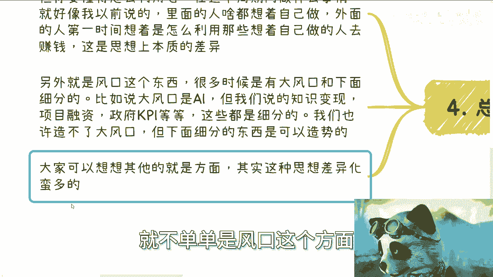

还有其他方面，其实本质上是在于思想上的差异，而且这个思想上的差异绝对不是说啊。

你们看一个视频或者说看一本书能get到的，你们必须是实践过才能get到，你才能融会贯通哦，哦或者说你可能才能真正的明白。

我想表达的这个这个背后的这个意思，而不是说就现在。

比如说这个这个表面上的东西啊。

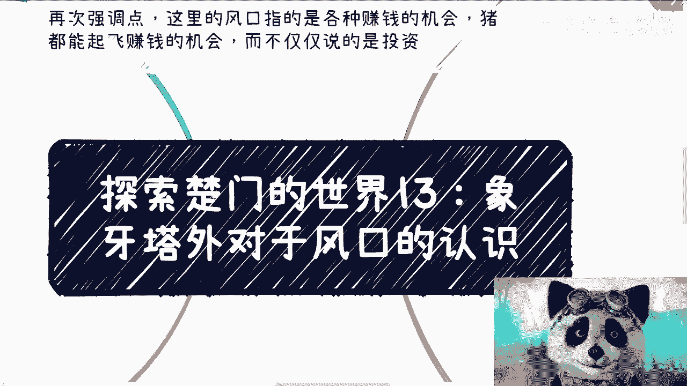

好好好就这样好吧，然后一样的好吧，那个活动的话，这个详情报名或者私信哦，详情或者报名都可以私信我，然后就是呃职业啊，商业啊对吧，然后股权融资啊啊产品啊，或者你们这个想根据自己的情况。

做更好的一些规划啊对吧，那你们可以整理好问题，然后再私信我，我们再约时间好吧行。

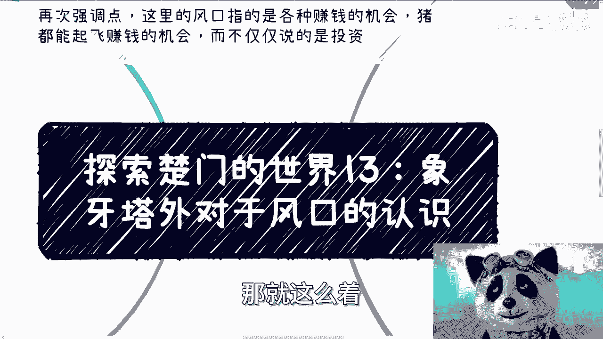