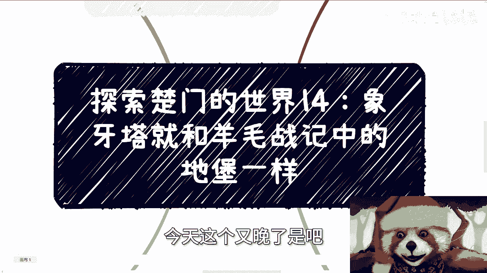
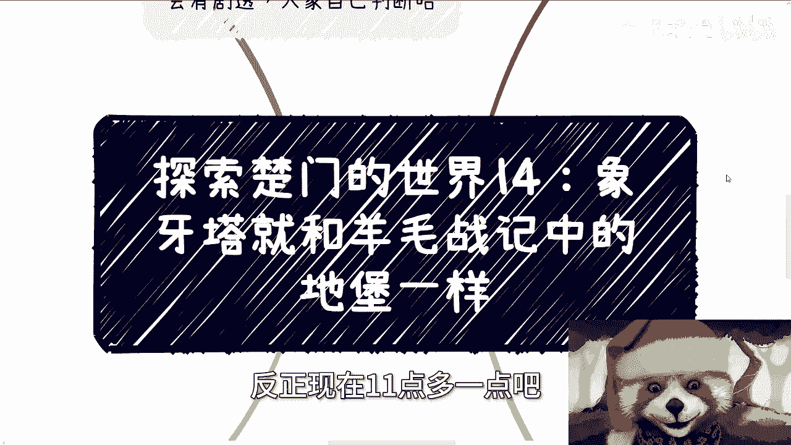
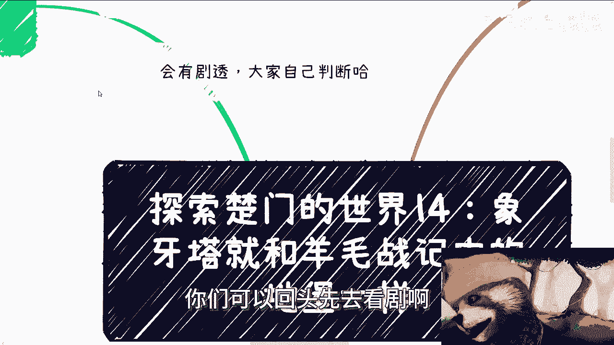

# 探索楚门的世界14：象牙塔就和羊毛战记中的地堡一样 - P1 - 赏味不足 - BV1Ep421U7e7

哈喽大家好，今天又晚了是吧。

我都不知道你们看到这个视频是几点钟，反正现在11点多一点吧啊。

呃首先上海跟北京活动定了啊，上海活动24号在人广附近，北京活动30号在微软这边都要刷身份证的啊，都要刷身份证的，所以说详情跟报名可以私信我。

嗯然后今天我们讲的呢。

嗯因为为什么，因为我今天早上在看那个视频呢，我又看到了那个羊毛战记，所以我就想了一下呢，我就觉得这个象牙塔呢跟羊毛战记当中。

这个地堡啊其实是一样的，呃那么会有剧透啊，会有剧透，如果大家觉得呃就比较在意的话，那你们可以不看啊，你们可以回头去看智啊。

回头再滚回来看，呃，首先呢今天早上我又刷到了羊毛战绩啊。

我仔细想了一下，其实一模一样啊，我来跟你们说一下啊，呃首先在他的那个概况里面呢，就是说人类一出生就是在地堡里面啊，那么就说白了你是不知道外面什么样子的，你的所有的认知是来自来自于地堡内的啊。

那包括来自于地堡内的书籍，地堡内的那个就是你的父母，包括你的认识的朋友啊，那么从小呢你就知道，比如说出去啊，比如说自由啊对吧，比如说什么东西啊啊那么呃在阳光战记里面呢，就是说那在地堡的那个社会里面啊。

就是说啊说了这些词汇，就是哪怕你只是说啊写啊，那偷偷都是属于违法的，都是需要处置的，那么当然啊地堡本身会有一个向外的摄像头啊，那么呃会告诉内部的所有的人，外面现在是什么样子的啊，那么内部摄像头呢。

其实告诉你外面呢是没有任何生命体的，同时外面呢也是有很厚的那种雾霾，就是你整个看上去会灰蒙蒙的，然后也也没有植物，也没有什么东西啊，那当然你可能也不会这么质，也不会有什么质疑，因为从小到大都这个样子啊。

呃随后在你的成长过程当中呢，你总归会看到一些违法的人出现对吧，或者乱纪的人出现，然后这些人呢会受到处罚，那么每次处罚的时候啊，整个地堡都会进行全网的直播啊，那么这个处罚跟你们想的那种可能不太一样啊。

在羊毛战记里面，所谓的处罚，就是让这些违反规定的人穿着防护服，然后送出地堡啊，因为他不是要出去嘛对吧，就送出地堡，但是大家会发现一个很神奇的现象，就是每个人出去都会用羊毛擦擦呃，地堡的摄像头啊。

因为在出去之前会给他穿好防护服嘛，然后就出去嘛啊，那么出去呢都会擦一下摄像头，然后再往外走啊，就继续往外走，因为呃就是为了为了寻找自由嘛，就出去了嘛，但是走了没几步就死了啊，那么呃你们想想看，如果来说。

我们说地堡跟我们之前所描述的象牙塔，是一样的话，那么如果啊你们走出了地堡，同时又想跟地堡里的人去传达信息，那么你们想想看有多少人愿意相信啊，先不说你你走出去就是挂不挂嘛对吧。

因为因为羊毛战记里面走出去挂了嘛啊，呃不管刮不刮，但是你想想看能有多少人相信，因为信息差是根深蒂固的，你从小就活在那个地方，那么在地堡的每个人的心里面，他是就是不会改变的，因为大家就是这么长大的。

你让他怎么改的，对不对啊，好那么我们来看第二部分，那么我们就来说地堡外啊，那么首先先来说啊，每个人出去为什么会擦擦镜头啊，是因为他们出去之后，发现，他们所看到的世界跟地堡里面。

摄像头所看到的外面的灰蒙蒙的呃，这种雾霾的世界的样子是不一样的哦，所以他们每个人下意识潜意识的反应都会觉得，是不是说那个摄像头长期裸露在外所导致的，就是说这种呃这个不清晰啊，那么按照地堡内的说法啊。

外面已经不适合人类生存的，到处都是毒气，所以不适合出去好，那么接下来就来说啊，此剧第一季最终对于这个地堡，还有整个的就是上面这些悬念的一些解解释啊，首先你说外面有没有毒气，有的啊，解释是有的，这是事实。

但为什么穿着防护服出去的人还是死了啊，还是死了，那么按照剧里的事实来讲啊，其实防护服本身是能防护住的，不是不能防护，因为每次穿着防护服服出去，人死了，他都给地堡人传达一种信息。

就是说这个防护防护服本身是没有用的，但其实问题并不在防护服身上，而在于防护服本身，每一个就是手套与衣服啊，或者其他与与就连接之处，它有漏洞，也就是说这个防护并不是密封的，但是不是密封的。

这件事情是地堡里面的人故意为之的，也就是说是故地堡里面的人，上层故意为之的，知道这个信息的人，也就是那么些人啊，并且那么多年都是如此，那么既然如此，我估计上面所说擦摄像头这件事情。

你们多多少少也能猜得出来，那么摄像头自然是经过处理的，就外面的样子肯定跟地堡里面，摄影摄像头里面所印出来的样子是不一样的，这没毛病啊，那为什么那些出去的人会看到不一样的样子，是因为他们的防护服的头盔。

里面的显示器也是被做过处理的，所以他们看到的样子，跟真实的地堡里面所看到的样子是不一样的啊，好那么但到这里其实逻辑是不通的，因为如果外面真的不适合人类生存，其实就算他想出去，那就直接扔出去哦。

那么不过有的人可能会觉得，比如说穿防护服啊，可能是有些人性化的操作啊对吧，或者说是有就是就是就是，比如说一些人性化的处罚啊，那问题就来了，如果是人性化的处罚，那为什么要弄漏洞呢对吧。

也就是说你你你你你你何必多此一举呢，就是说你要你要让他死，你就把它直接扔出去，结束了，你要不让他死，你为什么要在这上面，就是就是只是要去做一些人性化的操作，他没有必要，所以说其实在你们看这部剧的时候呢。

很多时候他最早的呃，很多点他就会告诉你一种伏笔，那么最终剧里面所给出的事实是什么呢，就是世界它是适合人类生存的啊，当然是不是适合可能不知道，但是至少啊他不是说都是毒气，而且地球上地堡很多。

也不是说只有你所活在的那个地堡里面，仅谨慎这些人类并不是啊，那么外面有毒吗，有的，故意在地堡周围放的，那么只要你能走出这个毒的半径范围，外面就是适合生存的，或者至少这么说，你到达半径万米以外。

你就不可能死啊，这个是一个问题好，那么所以说啊你们三呢，哦我写错了，这里是三，这里是三啊，所以说啊我们说映射我们这个真实的世界，哦不对不对不对，是散，我没写错，那比如说第三个是不是与我们现实很像啊。

那么很多人其实不愿意去为自己赚钱，因为他们恐惧他们所得到的教育，就是告诉他们，你们只有学历，只有考公，只有考编，没有别的，你跟他讲别的别的就跟思路是一样的，这就好像你想你告诉他，你要走出这个地堡。

他死活不愿意，因为他告诉你，我看到过无数人走出去都死了对吧，但象牙塔也就是地堡外，真的这么危险吗，也许是危险的，但其实这个是社会本身的样子，你明白吗，就是说在剧中之所以危险，是因为防护服是漏风的。

但漏风是人为的，并不是说这个毒气本身可以穿透，或者这个毒气永远都在地堡外面，你无论怎么走都走不出去，并不是就是太多的人对于社会，对于象象牙塔外的世界，对于自己就是想要去闯，或者想要往前往外面去走。

很多的恐惧，它是与生俱来的吗，是你生下来就有的吗，不是其实是你活在这个地堡里面，人为造成的恐惧，也就是我们所说的PUA，而象牙塔外的人想要传达信息，就比如说你今天走出去，你走出了这个毒的半径。

然后呢我就问，然后呢你你你跟地堡那些人去说，他怎么相信呢，他会相信你活着是侥幸，怎么相信，你想想看，你换而言之，如果你在地堡里面，你会相信吗，你会用你的命去搏吗，不会这就是现在的样子对吧。

就比如说你想走出去，你也许也许会放空你自己，也许会通过社交，通过合作，通过案例，通过跟我或者跟其他有一些啊，这个愿意跟大家讲的这些人走出这个毒圈啊，克服自己的恐惧之后走出去。

但你有没有想过你会传达信息给低保内的人吗，或者说你是那个能发现防护服有漏洞的人吗，明白吗，因为你就算游泳去走出去，你但凡发现不了有漏洞，你但凡解决不了这个问题，你还是会死在外面，就是也许我跟你讲。

你想过呃，也许你想过，但是你会发现啊，就算你真正的走出了这个毒的半径，这也是第一步，你走出地堡之后，你走出这个毒圈之后，然后呢，就像我们刚刚说的，你说在外面你也是新的战斗，因为什么。

因为你还需要在外面一片荒芜的这种地方，学会生存，你在这些荒芜的地方，你依然会碰到新的人，人类对吧，你还需要面对更多的人，而且每一个不同的地方，比如说地堡内和地堡位都一样的，你碰到很多人，有的人是朋友。

也有很多人是敌人对吧，但是你还要不停地朝前走，你觉得你还有多少机会或者多少的余力，吃根地保利的人再去传达信息，你自己想想看，如果你自己想看，如果设身就是你把你自己换位思考，你已经走出去了。

你花了九牛二虎之力，冒着生命危险走出去了，然后你还想着给低保利传达信息，你一边还得想着自己怎么生存，你有多少余力，更何况低保里的人根本就不相信你，就是我的，你想想看啊，我到现在为止这么多的视频。

其实归根结底也只能抛砖引玉的去帮助大家，从就是说思想上，或者从一些这个实际案例上告诉大家，你们是能走出去的，但是不是能有勇气走出去，以及能不能成功的堵住这个防护服的漏洞，生存活着走出去。

这得看大家自己对吧。

哦所以就是就是其实仔细想想看一样的哦，一样的，当然这个话可能不能说再明了对吧，再往下说就哼就不合适了是吧，但是你们你们仔细想想看，是不是这么一个道理，就是如果今天我们从小到大在地堡里面。

我们所受的教育一直是如此的，突然有一天跟你说，哎外面有新的世界，然后你说哦不对的，我也我看着有有有，从小到大看着走出去的人都死在外面的，我怎么相信你啊，我凭什么相信你，对吧。

那当然就像我们说的象牙塔内的，或者地堡内的这种这种嗯，你说割韭菜也好，或者说这种嗯怎么说呢，这种PUA也好，其实也有很多，就是他不一定会鼓励你出去，但是他会给你很多希望，就跟你说啊，你看啊这个这个未来。

比如说10年20年后啊，这个未来我们就能出去了啊，或者怎么样子，那么他会让你现在去做准备，为这虚假的一些东西去做准备，然后你还会负担付给他钱或者怎么样子，其实这个就是本质上的区别，但是可惜的是分。

可惜的是这地堡里的人分不清楚对吧，你跟他说真的假的，谁知道呢，是吧啊行，反正这个就当一个转折点吧，这个就当一个转折点吧，后面嗯，我到时候再看看有哪些就是细节，操作上面有些差异化的啊。

我会再跟你们在可以再说一下，好吧行，那就这么着啊，那个报名的可以继续报好吧。

然后那个商业化的职业规划的股权融资的啊，或者你们现在不知道未来怎么走的，你们手上有什么牌啊，我会根据你们的实际情况，根据这个中国海内外的这个实际情况，来给你们做个做一下职业规划啊。

嗯啊或者说就其实职业规划也没啥好做的，做的就是那个赚钱的规划，好吧行，那就这么着吧啊。

