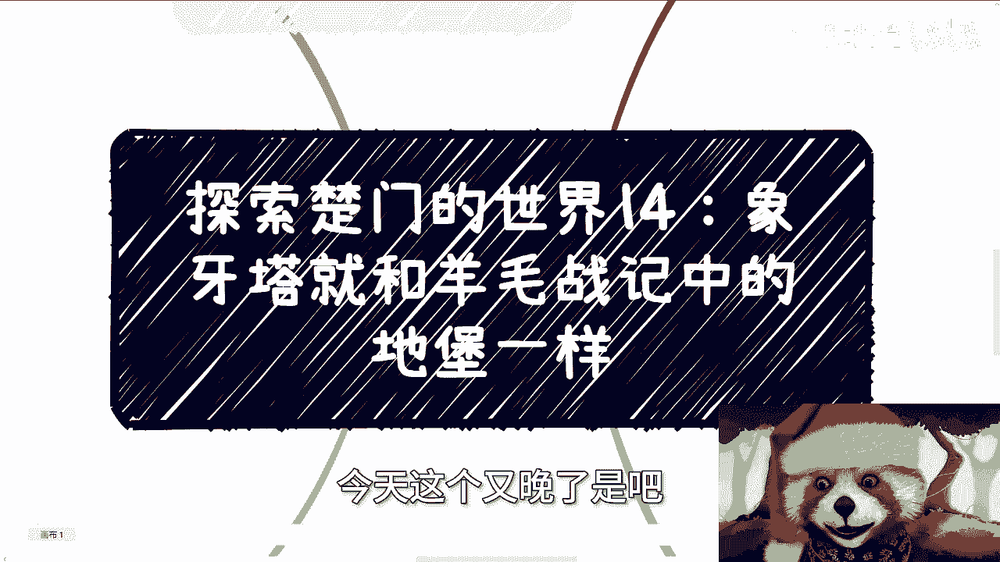
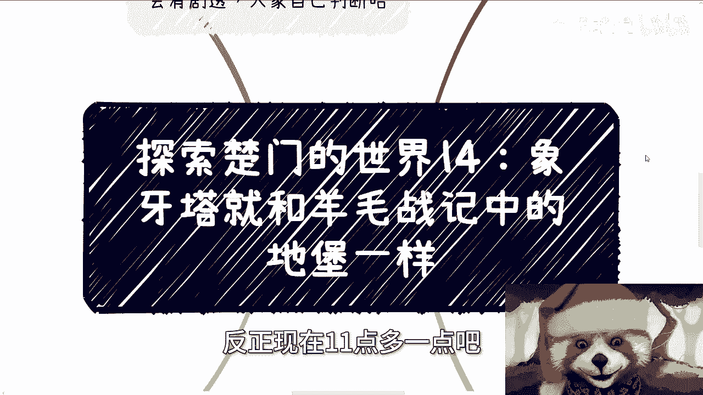
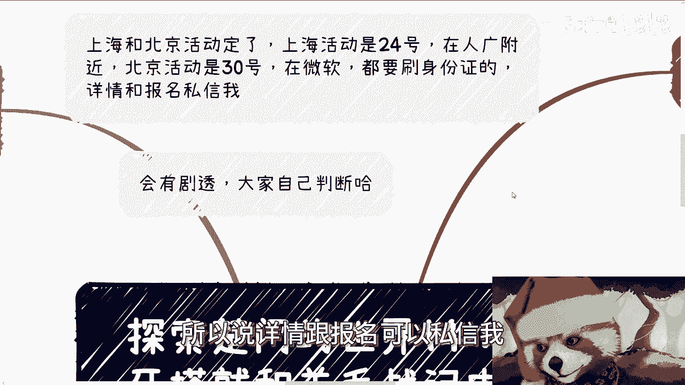
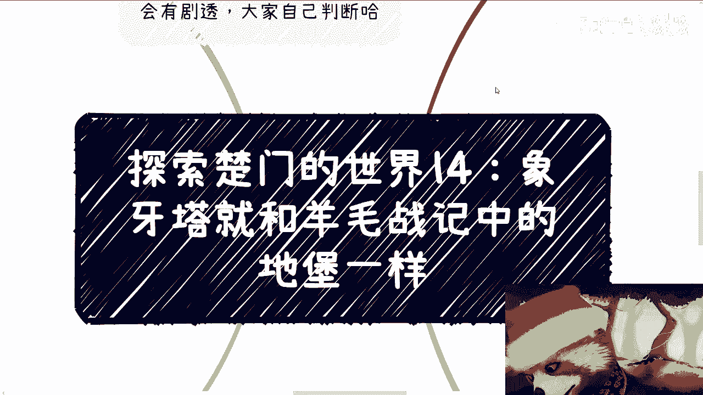
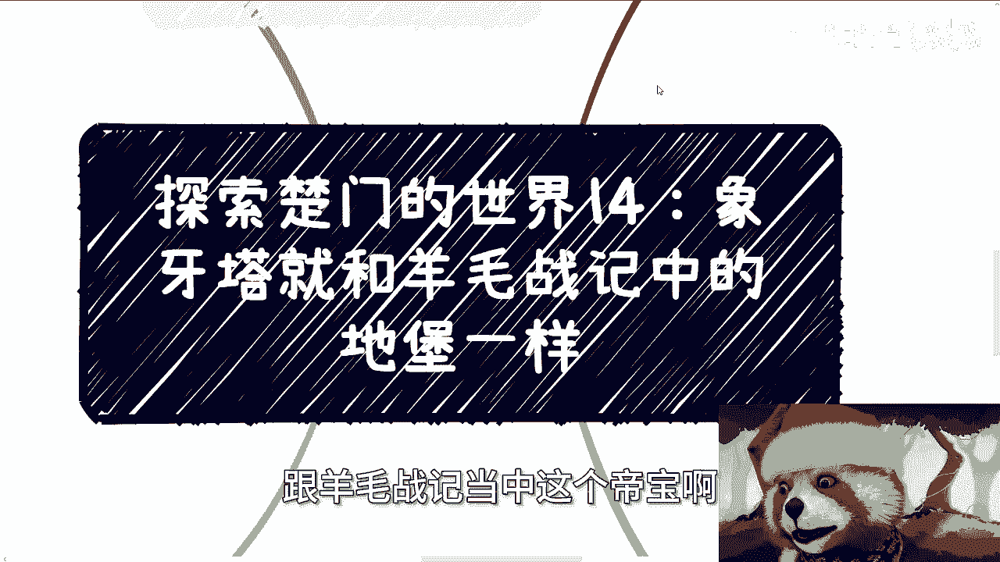
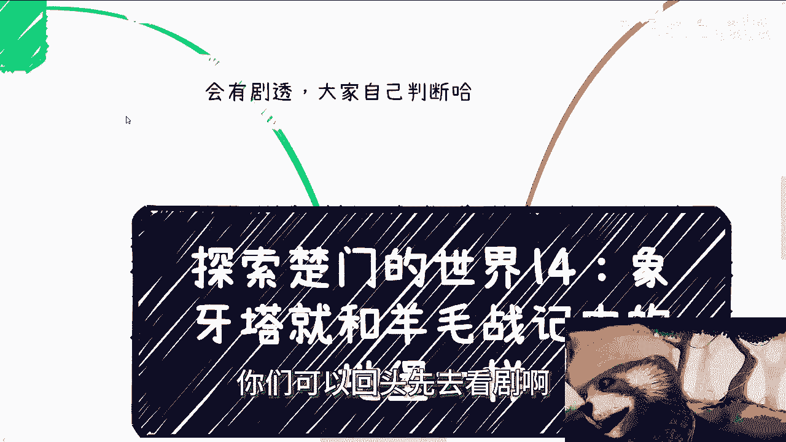
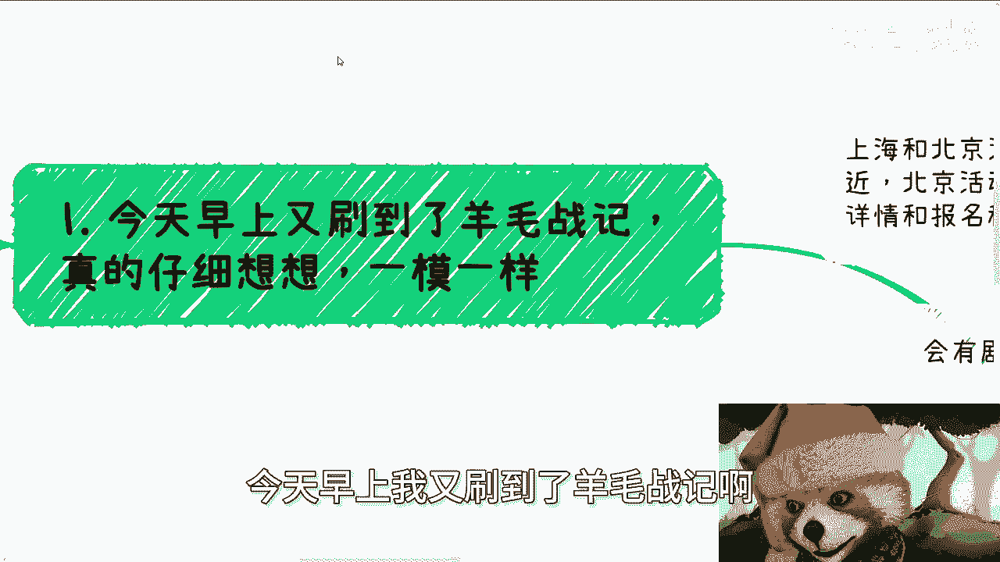
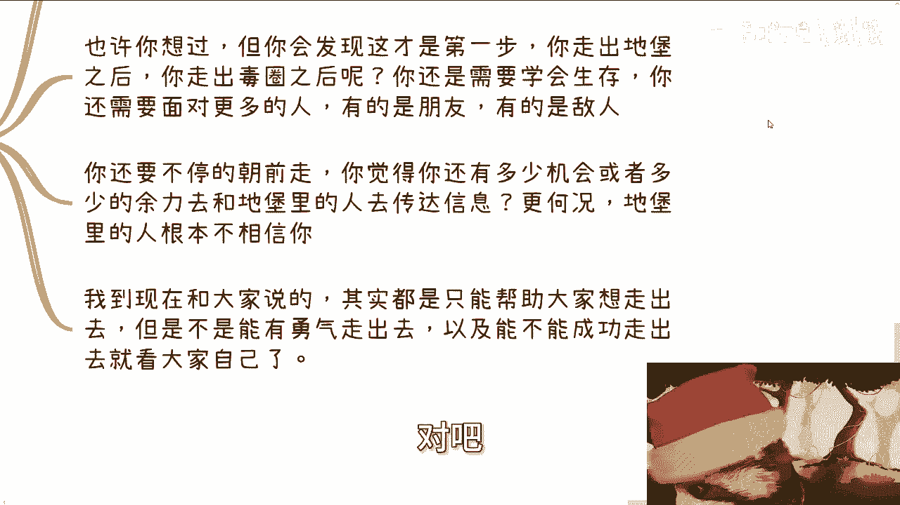
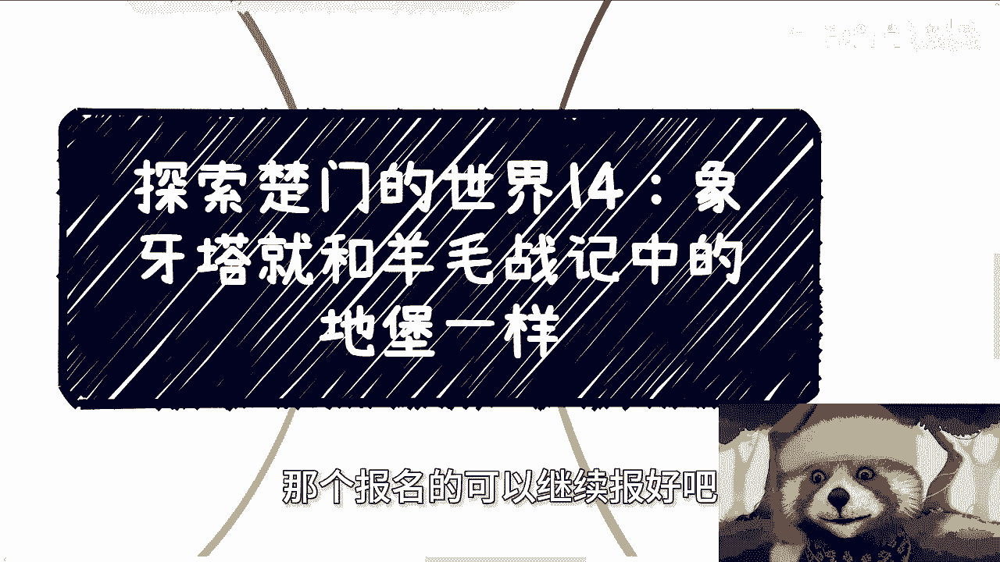
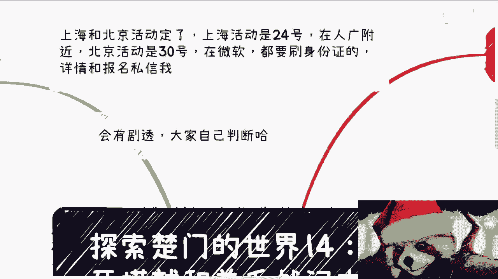

# 探索楚门的世界 14：象牙塔与《羊毛战记》中的地堡 🏰🔒

## 概述

在本节课中，我们将通过对比分析《羊毛战记》中的“地堡”设定，来探讨现实世界中的“象牙塔”现象。我们将揭示两者在信息控制、认知塑造以及对未知世界的恐惧等方面的惊人相似性，并思考个体如何识别并突破这些无形的壁垒。

---

## 第一部分：地堡内的世界——被塑造的认知

上一节我们探讨了信息环境对个体的影响，本节中我们来看看一个虚构却极具隐喻性的场景。

在《羊毛战记》的设定中，人类自出生起就生活在一个巨大的地下堡垒——“地堡”里。地堡构成了居民认知的全部边界。

以下是地堡内社会运行的核心规则：

1.  **信息源单一**：居民对外部世界的所有认知，都来源于地堡内部。这包括地堡内流传的书籍、长辈的教诲以及社交圈内的共识。
2.  **词汇禁忌**：诸如“外面”、“自由”等词汇被严格禁止。即使只是书写或私下谈论，也属于违法行为。
3.  **官方视角**：地堡通过一个对外的摄像头，向所有居民直播外部世界的景象。画面中永远是灰蒙蒙的、毫无生命迹象的致命雾霾。
4.  **公开惩戒**：对于违反规定、渴望外出的“罪犯”，惩罚方式是让他们穿上防护服，被送出地堡。这一过程会向全地堡直播。一个诡异的现象是，每个被放逐者走出地堡后，都会用羊毛擦拭那个对外摄像头，然后没走几步便会倒地身亡。

这种持续的视觉呈现和公开的“失败案例”，在地堡居民心中根深蒂固地塑造了一个信念：**外面是死亡之地，出去等于自杀**。即使有个别走出去的人想传递信息，地堡内的人也几乎不可能相信，因为信息差已经成为了他们世界观的基础。

---

## 第二部分：地堡外的真相——被掩盖的现实

了解了地堡内的规则后，我们不禁要问：外面究竟是什么样的？那些被放逐者为何会有那些奇怪的举动？

《羊毛战记》第一季最终揭示了背后的真相，这与我们之前描述的“象牙塔”机制形成了巧妙的映射。

以下是地堡外真相的逐层解析：

1.  **“毒气”存在，但范围有限**：地堡周围确实存在有毒气体，这是事实。但毒气并非覆盖全球，只要走出一定半径（剧中约为万米），便是可生存的环境。
2.  **防护服的“漏洞”**：放逐者穿着的防护服本身能防毒，但其手套、接缝等连接处被人为设置了漏洞。**防护服漏风是地堡上层故意为之**，目的是确保所有外出者有去无回，以此强化“外面必死”的谎言。
3.  **被处理的视觉系统**：地堡居民看到的灰蒙蒙的外部影像，以及放逐者头盔显示器里看到的景象，都是经过处理的。**真实的外部世界并非一片死寂**。
4.  **世界的全貌**：地球上存在许多类似的地堡，人类并未灭绝。地堡外的世界适合生存，并且存在着其他人类社群。

那么，映射到我们的现实世界呢？许多人不敢为自己的人生和财富去冒险，因为他们接受的教育体系不断强调：**只有高学历、考公务员、进入编制内才是唯一正确的、安全的路**。任何其他选择都被描绘成充满风险的“歧途”。

这就像地堡居民坚信“出去就会死”一样。象牙塔外的世界（真实社会）真的如此危险吗？或许有挑战，但这就是社会的本来面貌。剧中最大的危险并非来自环境，而是来自**那件被人为弄破的防护服**——即那些被灌输的、人为制造的恐惧。

---

## 第三部分：突破壁垒——勇气、洞察与生存

即使有人指出了出路，突破“地堡”或“象牙塔”的束缚也绝非易事。这需要一连串的努力。

以下是成功“走出去”并生存下来所需的关键步骤：

1.  **克服灌输性恐惧**：首要任务是识别并克服那些并非与生俱来，而是被环境长期PUA所植入的恐惧。你需要意识到，对未知的过度恐惧可能是被刻意维持的。
2.  **发现“防护服的漏洞”**：这指的是识别出现行体系（如教育路径、职业观念）中存在的根本缺陷或谎言。仅仅有走出去的愿望不够，必须找到那个导致“失败”的关键问题所在。
3.  **成功走出“毒圈半径”**：这意味着通过实际行动（如学习新技能、建立有效社交、尝试合作与创业），真正踏入那个被描绘为“危险”但实则充满机会的外部世界，并初步站稳脚跟。
4.  **面对新的生存挑战**：走出第一步后，挑战并未结束。就像剧中外面的荒芜世界，你需要学习全新的生存规则，会遇到盟友，也会遇到竞争者。这是一个持续学习和适应的过程。

完成以上步骤已经耗费了巨大的心力。此时，再想回过头向“地堡”内的人传递信息，往往会面临两个困境：一是自身生存发展的压力让你无暇他顾；二是地堡内的人基于根深蒂固的认知，根本不会相信你的话。

**因此，所有的引导和案例（包括本系列内容），其核心作用在于“抛砖引玉”**。它们只能在思想和案例上告诉大家“路是存在的，有人走通了”，但最终是否有勇气走出去，是否能敏锐地发现并堵住“防护服的漏洞”，从而活着走出去并生存下去，完全取决于每个人自己。

---

## 总结

本节课中，我们一起学习了如何通过《羊毛战记》的“地堡”隐喻来理解现实中的“象牙塔”现象。我们分析了地堡内如何通过控制信息、制造恐惧来塑造居民的认知，揭示了地堡外被掩盖的真相，并探讨了突破这一无形壁垒所需的勇气、洞察力和持续生存的能力。

两者的核心相似性在于：**一个封闭系统通过控制信息输入和展示“失败”案例，来维持内部稳定并抑制个体对外探索的冲动**。识别这一机制，是迈向更广阔世界的第一步。未来的课程中，我们将继续探讨在“走出去”之后，可能遇到的具体挑战与应对策略。