# 探索楚门的世界15-象牙塔外互联网红利期发生的若干事---P1---赏味不足---BV13K421v

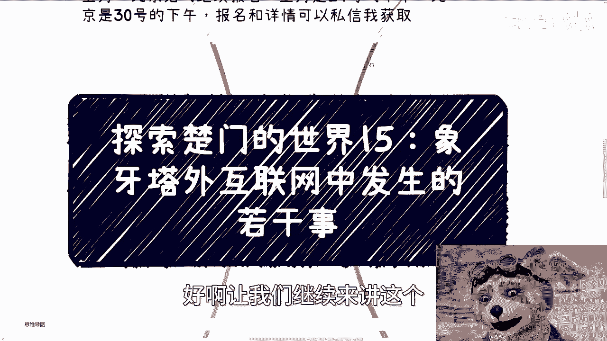

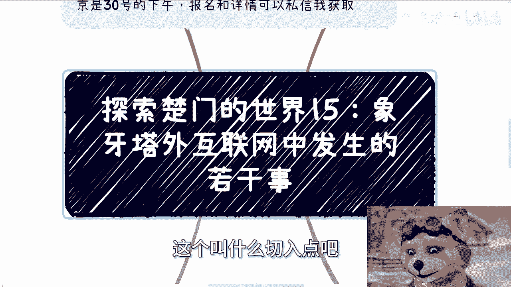

在本节课中，我们将一起探索互联网行业高速发展时期，象牙塔（学术界）之外的真实世界是如何运作的。我们将剖析资本、创业者、高校、政府与企业等多个角色在红利期的行为逻辑，帮助你理解表面繁荣背后的固定模式与内核。

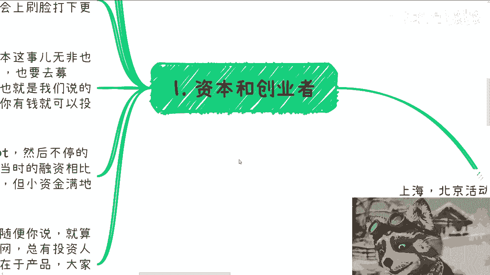

---

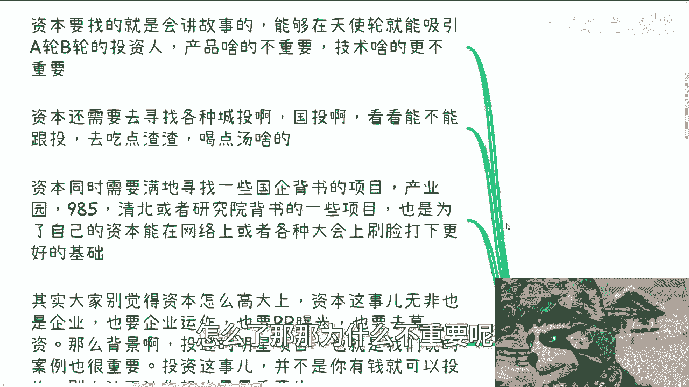

## 资本与创业者 💰🤝

上一节我们概述了课程主题，本节中我们来看看资本与创业者这对核心角色的互动逻辑。

资本寻找的是会讲故事、能在早期融资轮次（如天使轮、A轮、B轮）就吸引后续投资的创业者。产品与技术本身并不重要，因为当时行业内真正懂行的人很少，大家的核心关注点在于**如何赚钱**以及**项目能否找到下一轮接盘者**。

以下是资本的具体行为模式：

*   **寻找背书**：资本需要寻找各类城投、国投进行跟投，以“喝汤”并借助其背景为自己背书。
*   **追逐光环**：资本热衷于投资那些有国企、985高校、清北或研究院背书的项目，目的是为自己的品牌在网络上或行业大会上“刷脸”，奠定更好的募资基础。
*   **运作企业化**：资本（VC）本身也是企业化运作，需要公关曝光、募集资金。其背景和投资过的明星项目（案例）是核心资产。投资权并非有钱即可获得，往往设有门槛，例如只接受特定顶级基金的投资。

对于创业者而言，当时的融资环境远比现在宽松。以下是他们的典型状态：

*   **核心任务**：满地奔波，抓紧撰写商业计划书（PPT），在各种场合寻找投资人。
*   **环境宽松**：当时资金充裕，小额融资遍地都是。创业者提出的需求即使是“伪需求”也无所谓，因为投资人采取的是广撒网策略。
*   **投资逻辑**：投资人的心态是“投十个项目，只要其中一个成功并能退出，就能覆盖成本并盈利”。因此，他们更关注项目是否贴合当下风口，而非需求或产品的真实性。

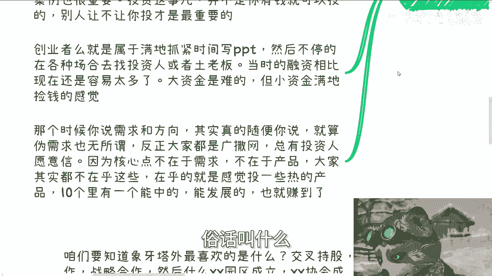

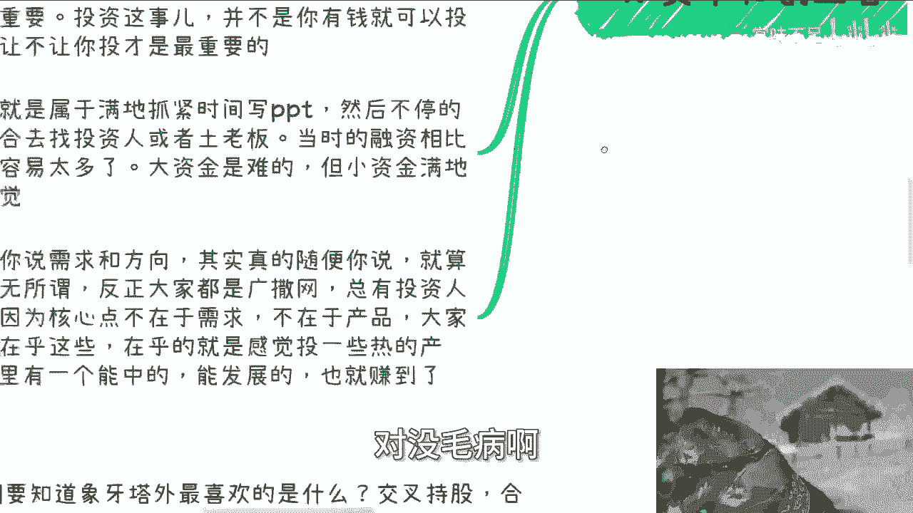

---

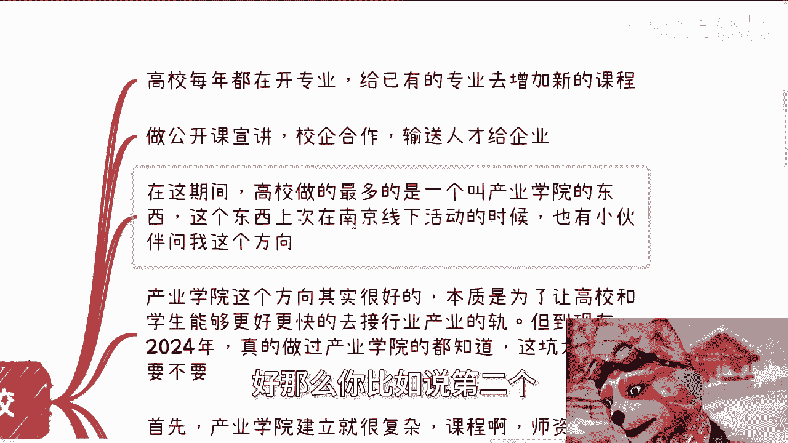

## 高校的切入与合作 🎓🔗

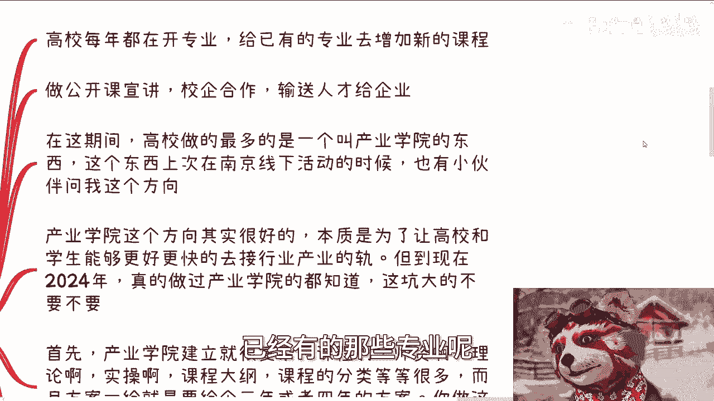

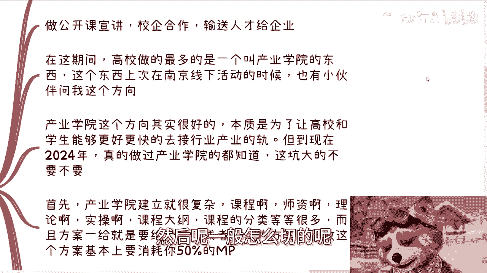

了解了市场端的资本游戏后，我们来看看作为人才输送源头的高校，是如何参与这场红利盛宴的。

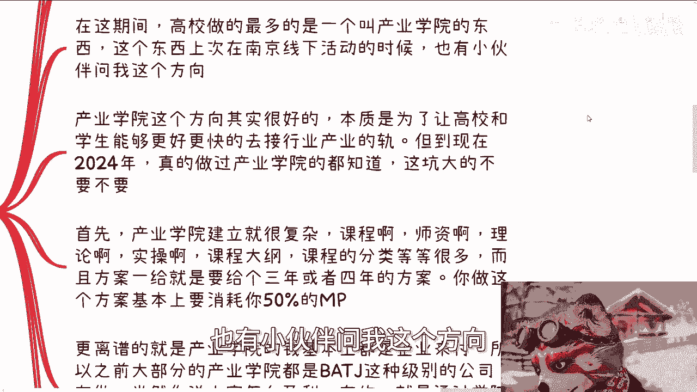

高校每年都会开设新专业或为现有专业增设课程。它们通常通过举办公开课宣讲、进行校企合作来为企业输送人才。在互联网红利期，高校最流行且非常重要的一项举措是建立“产业学院”。

产业学院的初衷很好，旨在促进高校与产业接轨，让学生更快适应行业。但到2024年的今天，其实际运作存在巨大问题。

以下是产业学院面临的主要挑战：

*   **方案复杂**：建立产业学院的方案极其复杂，需详细规划未来3-4年的课程、师资、理论、实操、大纲等，撰写耗时耗力。
*   **出资方错位**：产业学院的费用多由企业承担，学校常表示没有预算。因此，早期多为京东等大型公司在推动。
*   **落地困难**：落地时，企业协助招生心有余而力不足，学校则往往放手不管（上海话称“SANTA”，即双手脱把）。这导致项目无限期亏损，鲜有成功盈利的案例。

---

## 政府与企业的互动逻辑 🏛️🤝

看完了高校的尝试，我们再将视角转向推动产业发展的另一股重要力量——政府与企业。

政府与企业在合作上，永远遵循“培训先行”的逻辑。培训由专门的部门或人员负责，这些人通常不懂具体技术内容，只关注表面的案例和头衔。因为不可能要求培训负责人随着热点（如大数据、元宇宙）变化而频繁变换专业。

培训与咨询内容会随着行业发展呈现“过山车式”的演变：**宏观 → 技术细节 → 宏观**。

*   **初期（宏观）**：行业初期，各方都不懂，需要宏观层面的科普。
*   **中期（技术细节）**：技术相对成熟，部分政企需要落地，因此聚焦技术培训。
*   **后期（宏观）**：行业接近尾声，热点消退，内容再次回归宏观。

此外，政企合作还涉及大量指标，如人才培养指标、专利指标、投资指标、招投标指标、活动大会指标、专家智库指标等。许多参与方的核心目的是完成指标，而非真正发展产业。各地园区投资后烂尾的项目比比皆是。

这揭示了一个固定逻辑：无论热点是元宇宙、大数据还是云计算，其运作模式的内核是相同的。学习应聚焦于内核，而非追逐表面行业风向。

---

## 无处不在的宣传与包装 📢🎭

最后，我们来剖析象牙塔外最热衷的一件事：宣传与包装。

象牙塔外崇尚“假大空”与“务虚”，具体体现在热衷于**交叉持股、签署战略合作、成立园区/协会/委员会/中心、举办揭牌仪式**等各类形式上。

很多人认为策划宣传是苦力活，但在象牙塔外，优秀的宣传（PR）本身就能创造价值。PR主要发挥三个作用：

1.  **树立形象**：事情做不做、落不落地不重要，先把“逼格”树立起来。
2.  **满足汇报**：为各级领导的绩效提供汇报材料。在缺乏实质性成果时，只能汇报这些活动、合作、成立仪式。
3.  **积累资本**：留下痕迹，为未来的融资、合作、背书积累素材。

那么，钱从哪里来？逻辑很简单：
宣传合作的对象是政府、500强企业、985/211高校。PR的内容往往是围绕热点（如元宇宙）建立协会、中心、产业园。然后，拿着这些“虚”的成果，去向政府和资本申请资金支持——既然有了协会和中心，那下一步就需要产业园、展厅、招商引资，自然需要批钱。

整个过程需要材料齐全，包括解决方案、PR稿、照片、历史新闻稿等，形成完整的链条才能去申请资金。

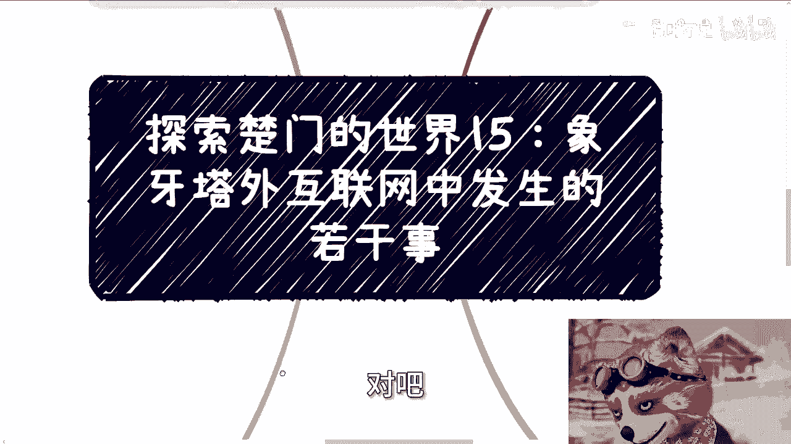

---

## 核心总结 📝

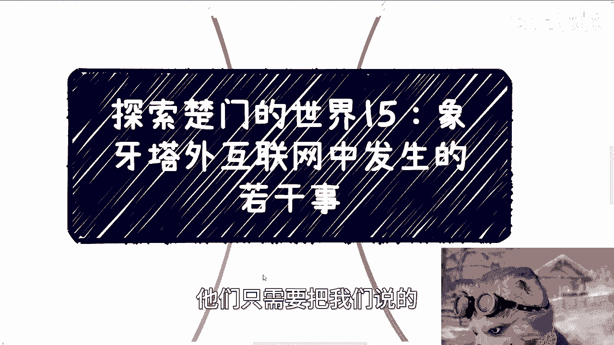

本节课中，我们一起学习了互联网红利期象牙塔外的四类典型现象：

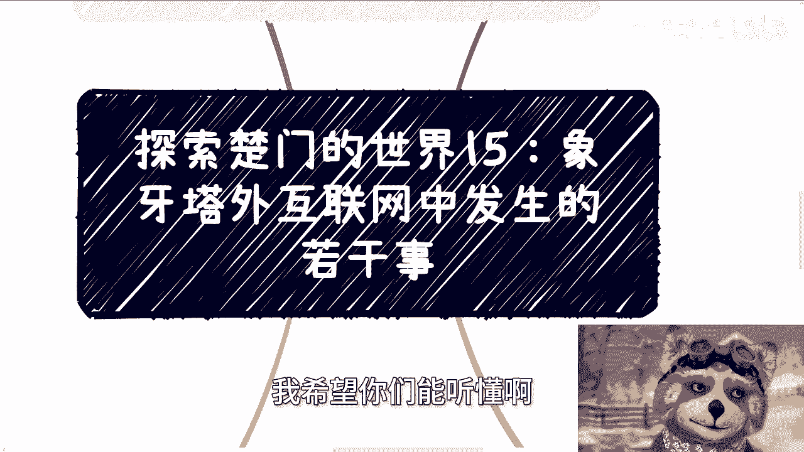

1.  **资本与创业者**：围绕“讲故事”和“找接盘”运作，产品与技术退居次位。
2.  **高校的产业学院**：理想丰满，但常因出资、落地难题而陷入亏损，难以持续。
3.  **政府与企业合作**：遵循“培训先行”和指标驱动模式，内容随行业周期变化，内核逻辑固定。
4.  **宣传与包装**：通过务虚的形式主义（成立各类组织、仪式）进行包装，目的是树立形象、完成汇报并最终获取资源。

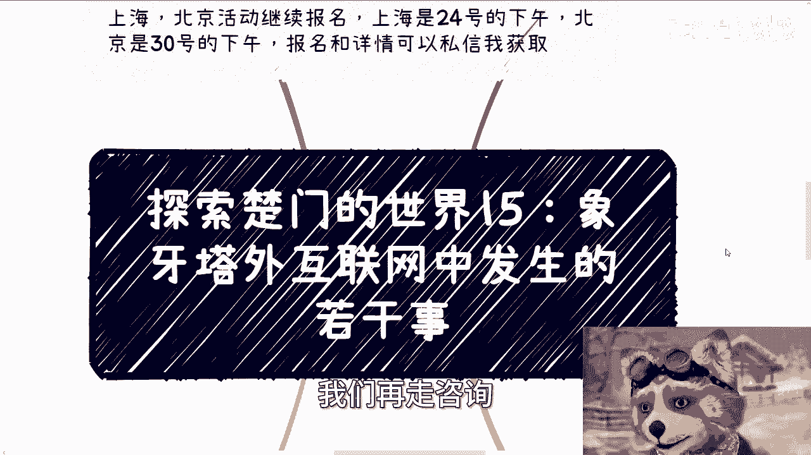

关键在于，**象牙塔内的人（学生、求职者）在拼命学习技术、找工作、跳槽，深受行业起伏的影响；而象牙塔外的人，只需将上述固定模式中的行业关键词（如“互联网”）替换为下一个热点（如“人工智能”），便可继续运作，几乎不受行业变迁的影响**。理解这种不变的“内核”模式，比追逐多变的“行业”风向更为重要。