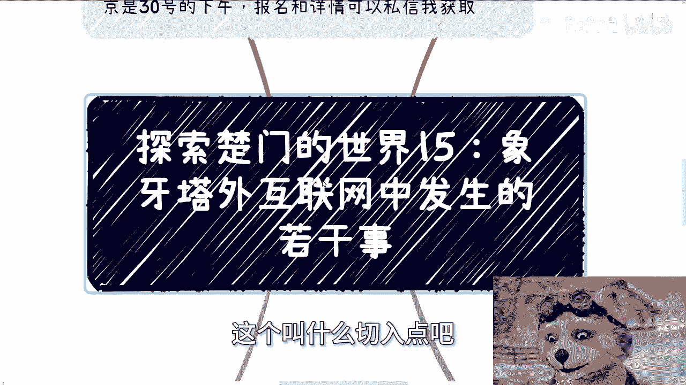
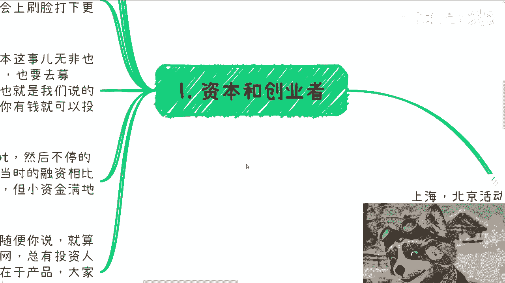
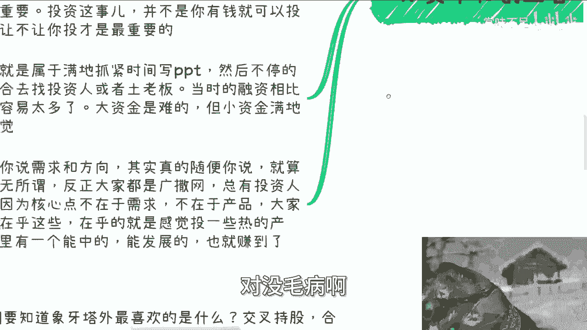
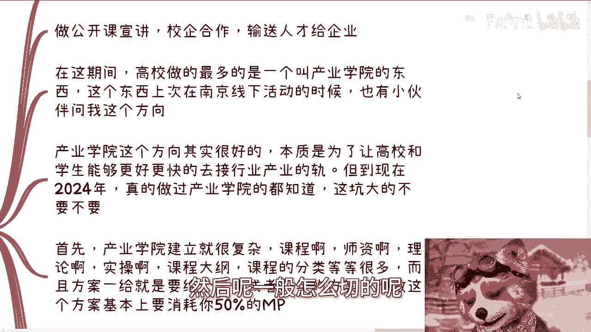
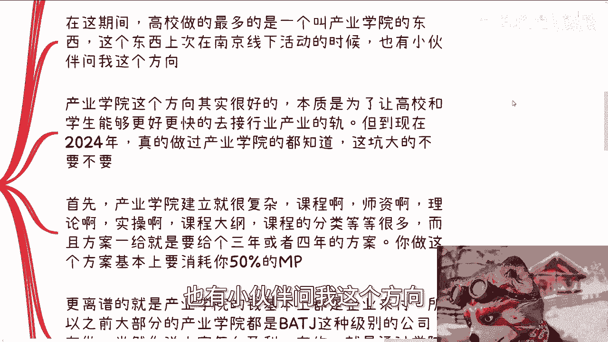
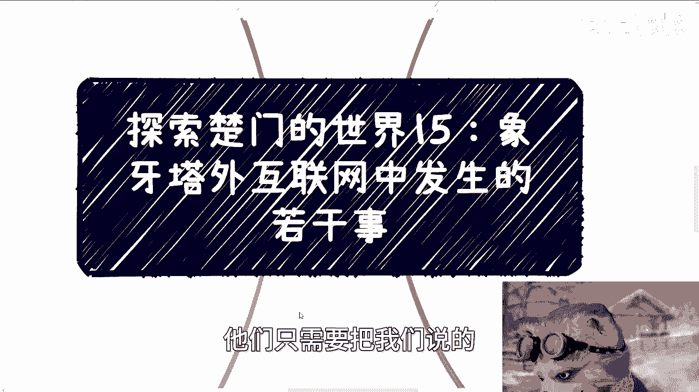
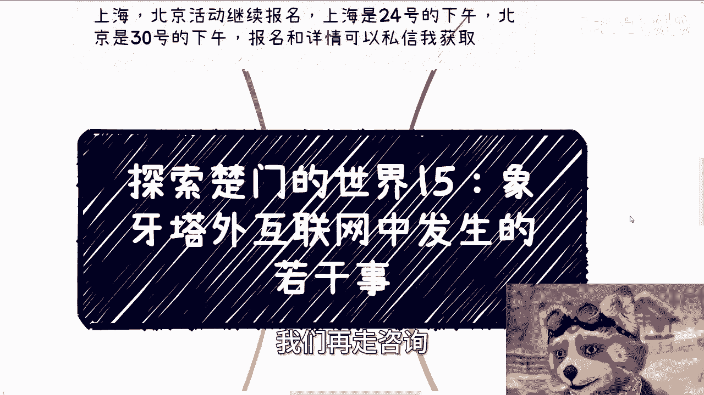

# 探索楚门的世界15：象牙塔外互联网红利期发生的若干事 - P1 - 赏味不足 - BV13K421v7oG

好啊，让我们继续来讲这个探索楚门的世界15啊。

呃首先那个上海北京活动区域报名啊，这个报名详情和具体的这个情况啊，和报名本身可以私信我啊，那么这一期呢跟今天的这个免费视频啊，他也是一对的，就是我会在就是以互联网为为，这个叫什么切入点吧。

在下二塔外也可以跟大家说一下，发根的发生的若干个事情。

首先第一个就是资本跟创业者，我们先来看啊，资本要找的呢就是会讲故事的，能够在天使轮就吸引到，比如说A轮B轮C轮的这种，那么产品什么的并不重要啊，技术啥的也不重要，怎么那那为什么不重要呢。

因为没人懂啊，有啥好重要的呢对吧，你关心这个东西有啥用呢，大家只关心怎么赚钱，那么资本还需要去寻找各种城投国投啊，看看能不能去跟投，所谓跟头就说去吃点渣渣，喝点汤啊，然后呢也顺便背个书。

那么资本同时需要满地的去寻找一些国企，背书的项目，老程序员啊啊这个985啊，高校啊，清北啊或者研究院背书的一些项目，也是为了自己的资本能够在网络上，或者来说各种大会上刷脸啊，这个打下更好的基础。

呃其实我跟你们说，你们别觉得资本怎么高大上啊，听到VC好像牛逼啊，资本这事儿呢其实无非也是企业，也是企业化运作的，也是需要pr曝曝光的啊，pr这边我就就再解释一下，这个就是所谓的宣传。

所谓的这个网络上新闻稿啊，我们都整个宣传营销都称之为pr，那么也要去募资对吧，那么背景啊，投过的明星项目啊，也就是我们所说的案例也很重要，所以说投资这个事啊，并不是你有钱就可以投的啊。

而是说别人让不让你投才是最重要的，我们历史上有非常多的这个好的项目，你就算有钱，别人不会让你投，因为你没有，你不过这个门槛，比如说人家我们只接受，比如说十大天使融资对吧。

我们只接受那种红杉这种level的对吧，你剩下这种私募基金我们都不去，不不接的啊，那么创业者呢属于满地抓紧写PPT啊，然后不停的在各个场合去找呃，投资人或者土老板，那当时的融资相比现在要容易太多太多啊。

因为当时满地都是钱啊，大家也不在乎这点钱，大资金虽然是男的，但是小资金满地都是呃，而且那个时候啊，你说需求跟方向其实真的随便，你说因为什么，因为你说出来的需求就算是伪需求也无所谓。

因为因为那为什么委屈也无所谓，因为大家在乎的是这件事情能不能赚钱，大家在乎的是有没有人来接盘，大家在乎的是这件这个东西能不能往后去走，至于你说你反正大家都广撒网，说难听点，总有投资人会愿意信。

总有愿意信，因为核心点并不在于需求，也不在于产品，大家根本不在乎这些，在乎的只是说投一些跟当下这个风口，或者跟当下这个行业热的产品呃，以前投资人有句俗话叫什么叫我投十个里面。

只要能中一个能发展，我就能赚到了，但没毛病了啊。

好那么你比如说第二个。

我们从高校切入啊，高校每年都会在都会开专业，然后给那已经有的那些专业呢去增加新的课程。

必修课或选修课，然后呢一般怎么切的呢。

做公开课宣讲啊，校企合作输送人才给企业啊，那么在这个期间，就是我说的在这个互联网的这种红利期间啊，高校最多的做的一件事情，而且是非常的一件事情，上传叫做产品学院，而不是产品学院，产业学院啊。

那么这个东西啊，上次在南京线下活动的时候，也有小伙伴问我这个方向。

我跟你们这么讲，产业学院这个方向其实很好，因为什么，因为本质是为了让高校跟呃企业，它能够就是接轨啊，然后让高校的学生能够更好，更快的去接整个行业产业的这个轨，但是到现在2024年，我跟你讲。

真的做过产业学院，或者来说呃跟我一样，就是就是在里面参与过的，我跟你们讲，懂得都懂啊，就这坑大的不要不要的，首先为什么产业前学院这个东西啊，建立它就很复杂呃，你们大部分人没有写过产业学院的那个方案啊。

我跟你们这么说，产业学院的方案里面课程啊，师资啊，理论啊，实操啊，课程大纲，课程分类啊等等，全部要很详细的，而且方案一给就是给个3年四年，你想想看，我现在让你们写，你们会写吗，你们怎么写，对不对啊。

我就这么说，你按我说法，你做这个方案，如果你是一个非常经验老道的人，他也得耗掉你半管MP是吧，你把你至少耗魔得耗掉1万啊，那更离谱的是什么呢，产业学院的钱呢基本上都是以企业来付的啊。

就是说学校呢会跟你说学校没有钱，所以之前大部分的产业学院呢都是像那个BT啊，京东这种级别的公司在做的，当然你说大家怎么盈利，有的啊，就是通过产业学院的招生，但是你们仔细想想看，为什么最后没有没有落地啊。

是因为真的落地的时候，你会发现企业呢帮助招生呢心有余力不足，对不对，学校呢基本上属于两手一摊，我们上海话叫什么叫SANTA啊，什么叫SANTA，就是就是你骑自行车两只手都都都拖把啊。

那那那那那就是完全不管对吧，那我们为什么说坑大呢，就是因为本质上它根本就是在无限的亏钱，你说这件事情做了有没有用，有用的，但是哪家企业愿意一直无限亏钱呢，你要说赚钱，我反正我跟你讲。

在我所看到的视野范围内，跟我所参与的案例里面，我是没有看到过赚过钱的啊，你说有没有赚钱，我不知道，反正我是没见过啊，然后第三个呢就是政府跟企业，我们来看啊，政府跟企业的逻辑啊，永远都是培训先行。

然后培训呢是专门的部门或者人员负责的，也就是说呃这些人员肯定是不懂内容的，他只懂表面的东西，比如说你的案例，你的title为什么，因为很简单啊，你们有没有想过一个问题，那难道说今天比如说大数据是热点好。

我们那个培训部门的人，或者相关的这种人员负责人，变成一个大数据专业的哦，明天什么元宇宙是热门的啊，我们换成元宇宙转运的，你看到哪个企业怎么运作的，你看到哪个政府这样运作的，没有的呀，对不对。

那么培训的内容随着行业的发展啊，时间的推移，一般啊它是一个过山车式的，就是培训的内容和咨询内容，一般是先从宏观变宏观，然后变成技术细节，然后再变成宏观，为什么，因为最早的宏观是因为整个行业。

整个政企大家都不懂，所以需要科普啊，所以需要宏观，那么到了中间状态呢，就是技术相对比较成熟了，那么就是到了技术细节呃，那么其中的部分企业跟政府是要落地的，所以需要技术的培训，那最后为什么又变成宏观呢。

我告诉你为什么会变成宏观，就是因为这个行业快要完了，哼就这么简单啊，就这么简单好，当然啊不仅仅只有这些，还有什么人才培养指标啊，专利指标啊，投资指标，招投标指标啊，啊对吧，还有什么活动大会指标。

专家智库指标，反正很多指标就说白了大家是为了完成指标，大家不是为了来发展这个产业的，你明白吗，就是你说有没有有的，但比例不高啊，那么各个园区咱就不去说他了，反正投钱的，然后投了烂尾的一大堆，对吧啊。

所以你们发现没有，这就是我说的固定逻辑，就是说今天什么狗屁元宇宙，什么大数据，什么云计算，什么互联网啊，什么狗东西，你们有没有发现我管它是什么东西，模式都是一样的，对不对，这就是我经常说的，要学习。

要去学习其内核，你不要老是去看什么行业，看方向，没啥好看的啊，好然后第四点叫做不停的宣传啊，我跟你讲啊，咱们要知道啊，象牙塔外最喜欢的事情是什么，是假大空是虚啊，那么甲状腺跟虚体现在哪里。

体现在比如说交叉持股啊，啊战略合作啊，啊园区成立啊，协会成立委员会成立啊，中心成立啊，然后几个人揭牌对吧，什么东西还反正很喜欢啊，我跟你们讲啊，你们别看宣传其实是一个很大的工程，你放下塔内。

很多人觉得策划活动宣传是苦力活，但为什么，比如说我对你说，陈老师一天到晚在说P啊，一天到晚在说宣传啊，我跟你们讲，为什么啊，因为pr有没有钱，pr本身没有钱，你说pr能不能赚到钱，我告诉你很牛逼。

在象牙塔外pr是能赚到钱的，我告诉你为什么第一pr一共有三个作用，第一个就是装逼事儿，做不做东西落不落不重要，B先装了啊，这是第一个，第二个P2就是为了各种领导的绩效，从下到上，从左到右需要汇报。

那我就问你汇报点啥啊，汇报点啥，你能汇报点啥，你汇报的出来啥对吧，那你最终只能汇报这些啊，什么活动啊，什么合作啊，成员成立啊，你还能汇报啥，你你你你难道你不会跟我说啊，我们要做出个什么东西，看到过啊。

哼你看到过政企这边有什么新兴领域，做出过什么东西，真正什么东西能值得宣传的，不被人喷死吗，对吧啊，第三个就是所谓的留下痕迹，未来可以整理起来，去融资，去忽悠，去合作，去背书好了，我们来讲啊，钱从哪里来。

简单的很，你们想想看我们宣传和对象是谁，合作的对象是谁，汇报的对象是谁，政府500强企业高校98521清北对吧，好pr的内容是什么，比如说什么是元宇宙啊，就是比如说连什么是元宇宙都没搞明白。

比如说连什么是互联网都没搞明白，弄协会弄中心，弄产业园，弄合作那么简单吗，拿着拿着这些所谓的虚的皮啊，去找政府和资本讨钱啊对吧，也就是说你看啊，我们今天已经弄了个协会了，要弄了个中心了。

那不得有个产业园吗，禅院有了不得有个展厅吗，展厅有了不得要招上影子，招商引资不得楼吗对吧，那你批钱啊，对不对，就是说白了啊，就是大家都懂得做事情的方式和规律，要的是所有的材料齐全啊。

包括里面包括里面包括解决方案，包括pr啊，包括照片，包括历史的文，那个新闻稿对吧，你该有的都得有，然后这些东西你才能拿着去批钱。

那我就问你，你觉得有没有用吗对吧。

所以说你们仔细想想看，象牙塔外跟象牙塔内它发生的事情是一样的吗，里面的人大家是拼了命的在学习技术，大家拼了命的在找工作啊，大家拼了命的在跳槽，外面的人who care啊，是不是你们想想看是吧。

而且而且你会发现当一个行业，比如说互联网现在不行了，201617年就有迹象不行了，开始走下坡路，象牙塔内的人，影响是最大的，为什么，因为他们很难去掉头，但象牙塔外的人你看到没有影响吗，一点都不影响。

他们。

只需要把我们说的就是模式里面的，这个互联网相关的关键字换掉，等下次热点是什么再换进去就好了，你们想想看对吧，世界怎么变，环境怎么变重要吗啊行业怎么变，产业怎么变重要吗，对不对啊，行啊。

我希望我希望你们能听懂啊。

希望能听懂好吧，然后那个活动啊继续报名，然后呃什么融资啊，股股份啊对吧，这个产业职业规划啊对吧，包括你们手上有什么牌，觉得不知道怎么打的对吧，或者说这个这个未来的走向或者怎么样子的，好吧。

你们可以整理好问题，我们再走咨询嗯。

