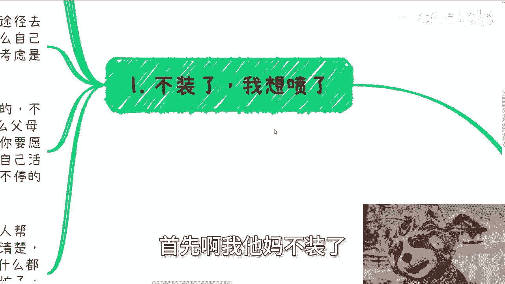
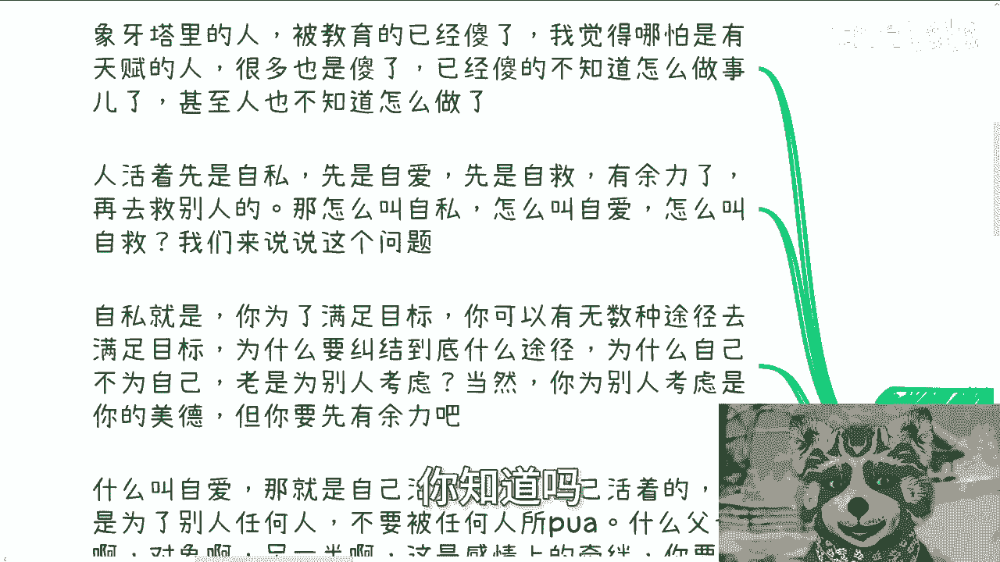
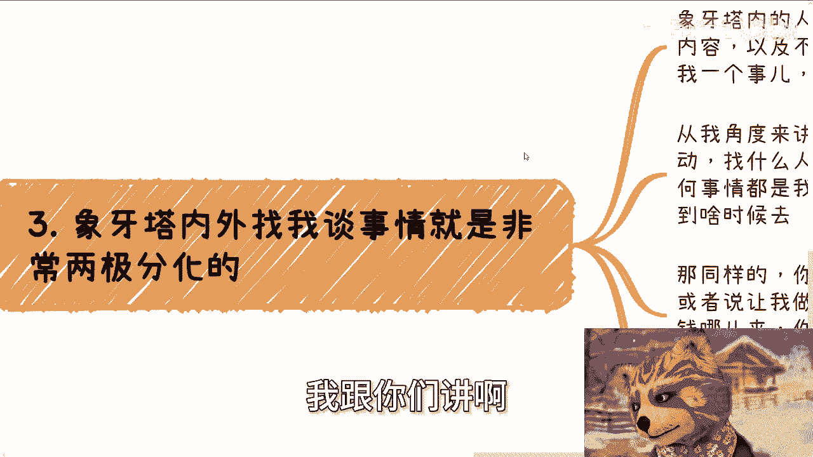
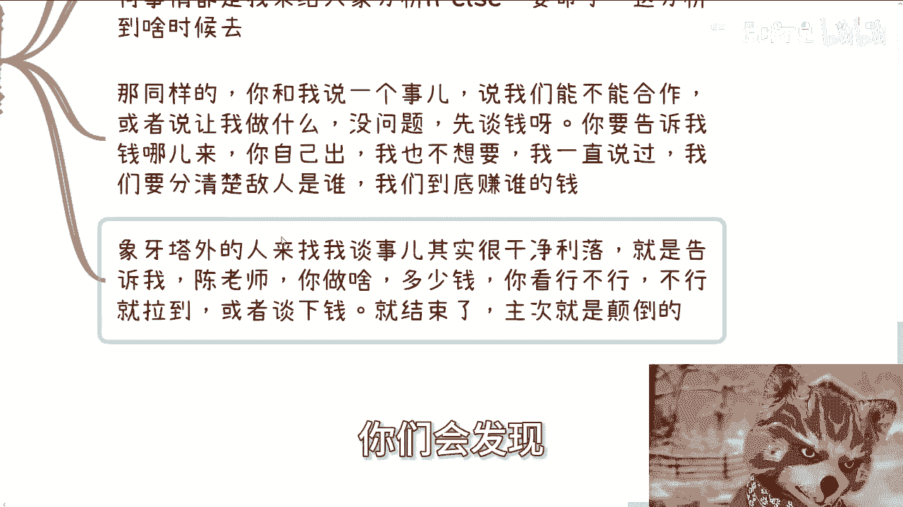
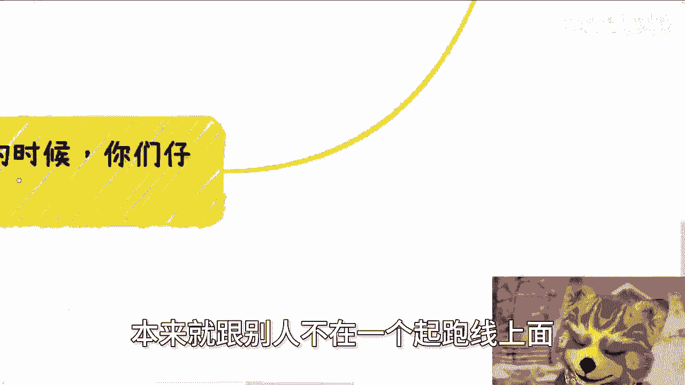
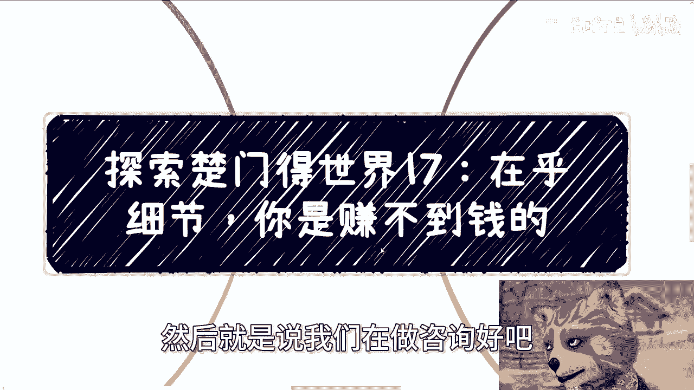

# 探索楚门的世界 17：象牙塔内外找我合作的差异 - P1 🏛️➡️🌍

在本节课中，我们将要学习一个核心观点：**过度在乎细节，可能会阻碍你赚钱**。我们将通过对比象牙塔内外人群在寻求合作时的思维与行为差异，来理解为什么务实、目标导向的思维方式在现实世界中更为重要。

---

## 主题：在乎细节，赚不到钱 💰

为什么会有这个主题？首先，我不再掩饰我的观点。我观察到，象牙塔内的人，绝大多数已经被教育得脱离了现实。我认为，即使是有天赋的人才，也常常陷入这种困境。他们甚至不知道如何像正常人一样行事和生活。

人活着首先要自私、自爱、自救。有余力之后，再去帮助他人。

*   **自私**：意味着优先满足自己的目标。你可以通过无数种途径实现目标，不必纠结于具体方式。所有行动都应服务于自己，而不是优先考虑他人。在你自身生存都有问题的时候，过度为他人考虑没有意义。
*   **自爱**：意味着你为自己而活，而不是为他人。虽然会有感情牵绊，但你的生命属于你自己。如果过去一直活在别人的束缚中，剩下的时间更应该为自己而活。
*   **自救**：意味着无论打工、求助还是合作，你都需要自己先把事情摸清楚。在你能力范围内，给出你的方案（A/B/C/D/E），而不是做伸手党。例如，找我咨询时，你可以提出自己的想法，哪怕不成熟，但不能两手一摊，直接问“我该走什么路”。

很多人虽然已经成年，但做事和思考问题的方式，却还停留在小学或初中阶段。

---

## 困境的本质与应对 🧗

我为什么把这个视频放在充电内容里？因为我担心有人会说我的观点不正。例如，很多人问我如何参加活动、寻求合作时遇到的困境。

所谓的困境和阻碍，往往只是不知道如何宣传、没有公司主体、没有项目计划书、缺乏背景背书等。

那么问题来了：这些真的困难吗？**写个方案、找个计划书模板修改一下，很难吗？** 你的目的是参加活动或认识人，如果连这些过程障碍都无法跨越，那说明你可能不具备赚钱所需的能力。

有人可能会指责这是在教人“骗”或“忽悠”。但作为普通人，当对方要求这些而我们暂时不具备时，该怎么办？有能力就去注册公司、写计划书；没能力，难道就止步不前吗？事情并非如此死板。

你要明白，**事、人和未来的成功是相辅相成的**。如果你在学校里把思维读僵化了，还怎么赚钱？

---

## 合作洽谈的思维差异 🤝

象牙塔内外的人找我谈事情，呈现出两极分化的状态。

以下是两者的典型对比：

*   **象牙塔内的人**：
    1.  描述问题不清楚。
    2.  **从不谈钱**。例如，只问“在活动上怎么跟人沟通”，却不说明具体活动、目标人物和自身目的。
    3.  提出合作时，不明确具体事项和报酬。如果不清楚我能做什么、我能拿多少钱，说明你自己还没想明白。

*   **象牙塔外的人**：
    1.  沟通干净利落。
    2.  直接说明需要我做什么（例如站台、出方案）、愿意付多少钱、需要多少时间。
    3.  行就行，不行再议，效率极高。

你会发现，谈事情的主次是颠倒的。谈合作的核心是明确**做什么**和**报酬多少**。如果这两点都不清楚，说明准备工作没到位。

---

## 重新评估问题与目标导向 🎯

当你们碰到问题时，请仔细想想：这些问题真的是无法跨越的高门槛吗？

例如，要求你必须有清华全日制本科学历，这是高门槛。但如果只是需要一个公司抬头、一份商业计划书，这很难吗？**这并不难，只是你们不去做，并在行动前就放弃了。**

很多人做事情都在纠结过程，而忘了目的。例如，总在说“我没有主体”、“我不懂这个”。**这不重要，重要的是你的目标。** 你不懂，可以去找资源来补足。人的一生很短，不可能什么都懂。

所有合作，最终都是为了**赚钱**这个目标服务的。我们的一切行动都应服务于目标，而不是纠结于过程。

有人说这是不是太急功近利。我想说，对于普通老百姓而言，没有太多选择。**你不目标明确，不采用一些非常规手段，怎么向上爬？** 等到你觉悟时，可能已经来不及了。在这件事上，我的观点对普通人就是一刀切的。

---

## 总结 📝

本节课中我们一起学习了：

1.  **核心心态**：人应先自私、自爱、自救，优先满足自身目标。
2.  **破除幻象**：许多所谓的“困境”并非真正的高门槛，而是缺乏行动力和变通思维。
3.  **思维差异**：象牙塔内外的人在合作洽谈中，最大的区别在于是否**目标清晰、直接务实、敢于谈钱**。
4.  **行动准则**：做任何事都应**以终为始**，明确最终目标（通常是赚钱），并让一切过程和资源为该目标服务，过程中遇到问题就寻找解决方案，而非纠结或放弃。

记住公式：**成功 ≈ 明确的目标 + 务实的行动（资源整合） - 无谓的细节纠结**

如果你在商业规划、职业发展、融资或如何打好手中牌方面需要更具体的建议，可以在整理好自己的情况后，寻找适当的时机进行咨询。