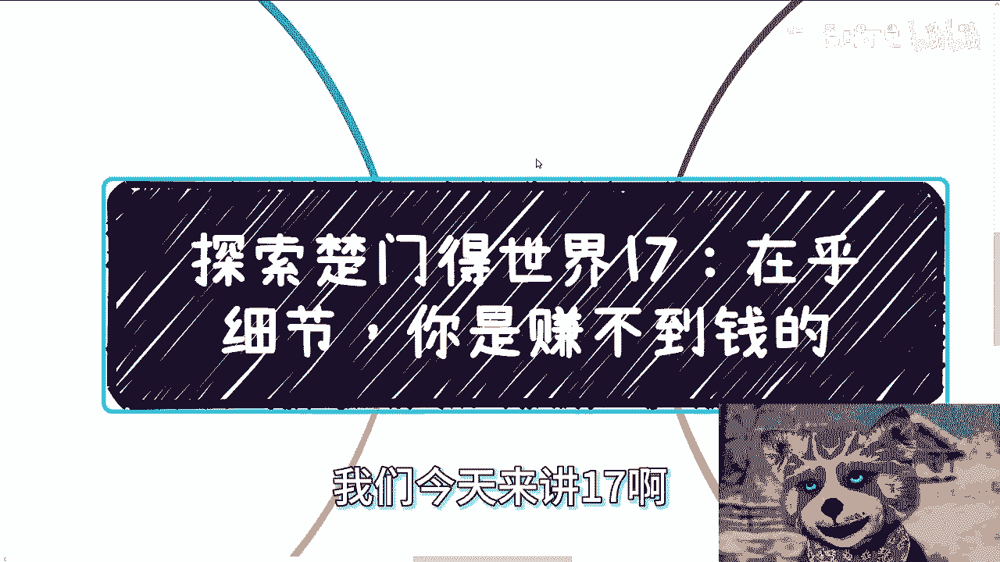
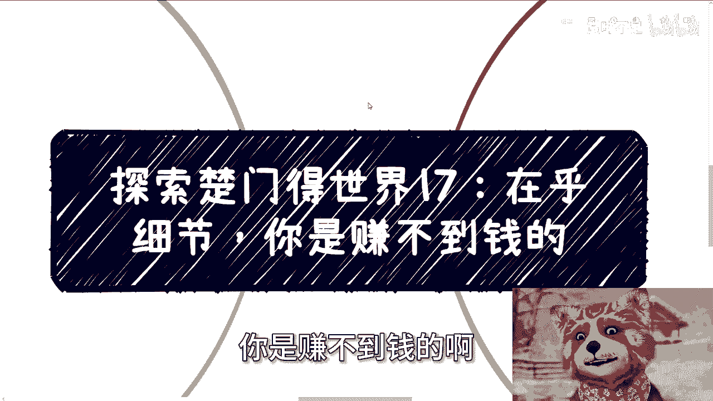
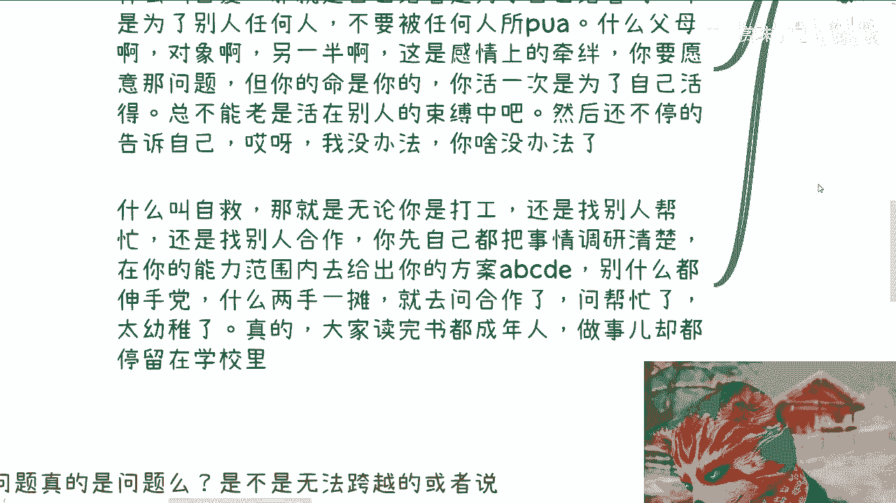
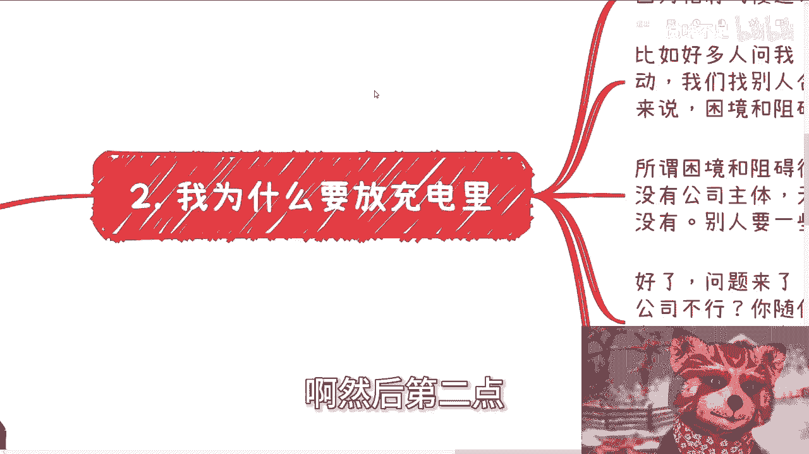
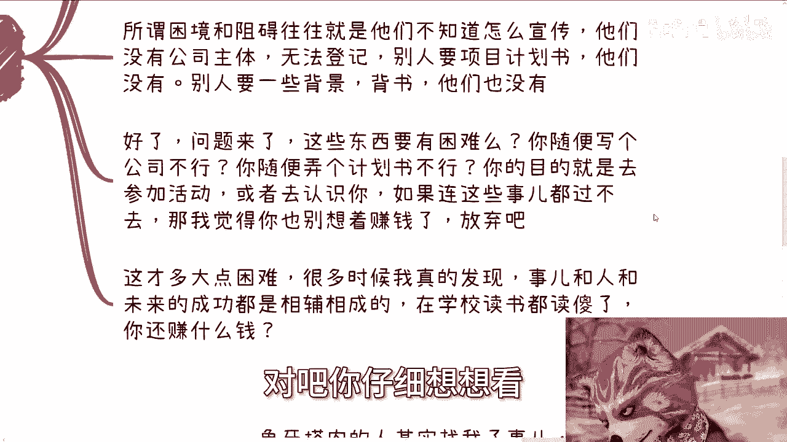
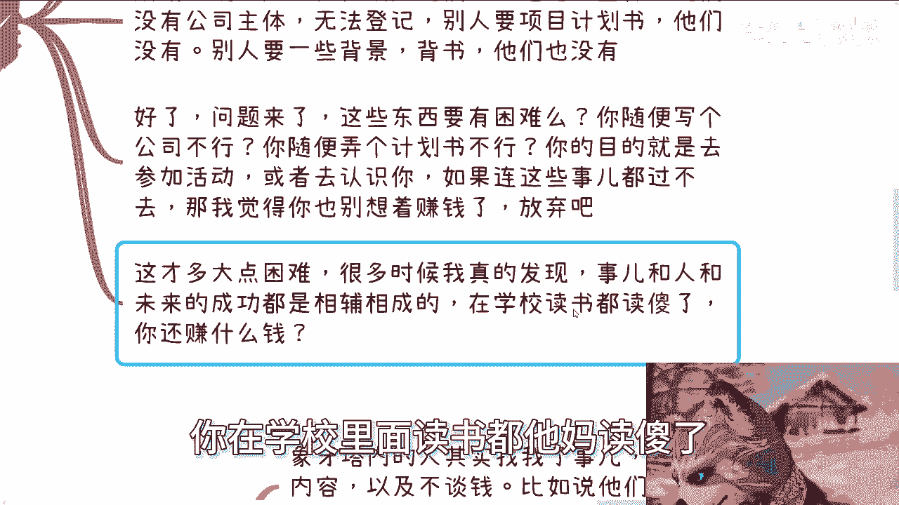
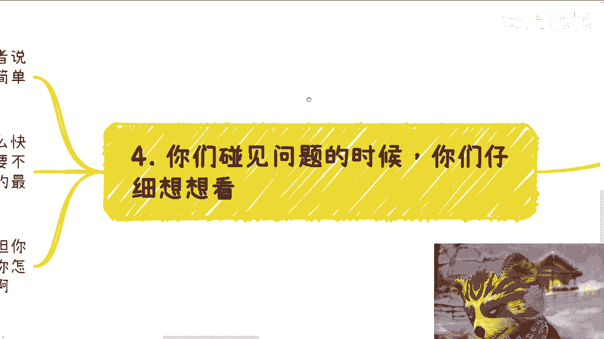

# 探索楚门的世界17：象牙塔内外找我合作的差异 - P1 - 赏味不足 - BV1au4m1T7vp

好大家好啊咳咳，我们今天来讲17啊。

呃这个主题呢我取的叫做在乎细节，你是赚不到钱的啊。

为什么会有这个主题啊，我跟你们讲啊，首先啊我他妈不装了。

那我真的要喷了啊，就他妈就喷了，不管了啊，就是我跟你们讲啊，象牙塔里的人，我觉得已经被教育的傻了，就是100个人里面99。9个人就是傻的，那我觉得哪怕因为我现在咨询下来。

我就发现哪怕有很多人其实很有天赋的，然后我个人觉得真的是那种人才，你知道吗。

也他妈傻了，就是已经傻的不知道怎么做事情了，就是我觉得甚至他连人怎么做都不知道了，就这么简单，他哪里是活的像个人啊，那活着他妈的就是个皮囊啊，他哪里像个人啊，像个正常人啊对吧，我觉得是这样子的啊。

人活着先要自私，先要自爱，先要自救，你有余力了，你再去救别人对吧，那怎么叫自私，怎么叫自爱，怎么叫自救啊，我跟你们讲啊，首先你自私就是什么，就是你要先满足你自己的目标，你可以有无数种途径去满足这个目标。

你不要去纠结什么途径，你你你所有的事情是为了你自己的，你不要为别人考虑，就是你要不要为别人考虑，要但是前提是你先满足你自己对吧，你翅膀硬了，你再去考虑别人，你现在自己很多人生存都有问题对吧。

然后就说你自己吃都不厌，你一天到晚考虑别人，那你这辈子就这样过去了，那我不知道意义在什么地方对吧，我还是那句话，你为别人考虑是美德，但你得心有余力是吧，这是第一点，第二点，什么叫自爱。

就是你活着是为了你自己活的，他不是为了别人啊，呃你父母，你对象，你的另一半，所有感情，感情上，感情上的牵绊，你要愿意，那是你的问题，但是你的命是你的，你活这一次是为是你自己的。

那你总不能老是活在别人的束缚当中吧，我觉得如果啊就是大家比如说以前的家庭对吧，以前的这个生存或者以前很多东西，你活在别人束缚当中，那我觉得你们应该换个思考考换个想法考虑。

就是我已经20年30年活在别人当中了，那我为什么剩下时间还得活在别人当中呢，为什么呢对吧，然后你不但要活在别人的束缚当中，然后不停的告诉自己，哎呀我没办法，我就普通人，你怎么没办法呢，你没办法。

都是你自己给你自己说的，那你怎么会没有办法呢，你又不是缺胳膊少腿，你怎么会没办法呢对吧，然后什么叫自救，就是无论你是打工还是帮别人找，还是找别人帮忙，还是找别人合作，你都得自己先把事情摸清楚吧。

在你能力范围内是给出你的方案，ABCDE对吧，你别什么东西都收伸手党，你比如说你比如说找我咨询演示的，你可以给出你的想法，你哪怕我我跟很多人都说，就是你哪怕你的想法很宏观，不细节也没问题。

但你不能两手一摊，你就来问我，你说陈老师，我什么都没有诶，你给我讲讲有什么路，我怎么知道有什么路啊。

对吧哦，就是说我觉得大家读完书基本上已经都成年了，但是做事情的方式，思考问题方式还停留在哼，我都不敢说，高等教育还停留在初中，还停留在小学，我就这种感觉你们明白吗，然后第二点。

我为什么要把这个视频放在充电里面，因为我怕有说我三观不正，为什么，因为你比如说啊好多人问我，他说哎陈老师啊啊我们做活动啊，我们参加活动，我们找别人怎么合作啊，碰到很多问题，困境和阻碍我们就来说哦。

哦我就这么跟你们讲，我们就来说困境和阻碍是什么，所谓困境和阻碍往往是他们不知道怎么宣传，他们没有公司主体，人家做活动的，问他们说哎你你主体是什么对吧，你你你项目计划书有没有啊，然后他们就说哎呀我没有。

哎，陈老师，我们没有公司主题，没有项目计划书对吧，别人要一些背景背书，他们也没有，那好了，问题来了，我就问这些东西困难吗，你仔细想想看困难吗，你随便写个公式不行吗，你随便弄个计划书不行吗，啊卧槽。

网上计划书多了去了，你随便弄个模板，把里面通用的文字改一下不行吗，你是懒，你还是不愿意做对吧，就是说你的目的是过去参加活动，或者你要去认识人，但是如果你连过程当中这些事都过不去。

那我觉得你也别想着赚钱了，你没这个能力，你明白吗，我为什么说有我怕人。

有说我三观不正，就是他们可能会说啊，陈老师，你叫人家要去骗对吧。

你叫人家要去忽悠，要去怎么样子，但问题是诶，我就问你们，你们作为普通人，我作为普通人，我们没有东西，他要这个东西怎么办呢，对吧，我跟你们讲了，你们可以去注册公司，你们也可以自己去写计划实务。

但你们有能力吗，有的人有能力的没能力，那如果没能力怎么办呢，哦我跟他说不行。

你就不要走，你不是这么死板的呀对吧。

你仔细想想这些事情才多大点困难啊，啊就你要明白很多时候啊，事儿人和未来的成功，他是相辅相成的，你在学校里面读书都读傻了。

你还赚什么钱啊，我就问你们，你还赚什么钱对吧，你就像你你知道吗，你就像很多人啊，还跟我说什么说哎陈老师，我学校里面有很多同学哦，我去什么勾搭一下，我去社交一下，我说大哥，LV0级对吧。

你学校里面跟你同样的也最多也就LV0级，Lv0。5，你你同样都是乌合之众，你跟他们社交有卵用啊，对啊第三我跟你们讲啊。

象牙塔内外找我谈事情的真的是两极分化，你知道吗，真的是两极分化，就是象牙塔内的人找我啊，一般这样子的，他描述问题描述不清楚的，以及他们从来不弹琴，哎很奇怪的，从来不谈钱，就比如说他们跟我说哎陈老师合作。

或者说问我一个事对吧，比如说他问我，他说哎陈老师，我在活动上面找个人应该怎么沟通，你仔细想想看啊，你从我角度来讲，我听到这两个问题，你问我活动上找人怎么沟通，那什么活动呢，找什么人呢。

你的目的又是什么呢，你说清楚啊，是吧哦你就问我陈老师，我要到火车站找个人怎么沟通，尼玛那他妈我怎么知道呢，我我我要跟你去分析，我不能笼统给你分析，这违背我做生产方式，对不对啊。

然后呢我就给你分析f else啊，比如说你在展会上啊，你在那种呃这个私董会上，你在那种比如说什么营销大会上对吧，然后找的是什么人，要命了，我他妈给你分析到什么时候去啊，对不对。

然后同样的你跟我说一个事儿，说我们能不能合作，或者让我做什么没问题啊，你跟我讲的同时，你跟我把钱谈好啊，对不对，而且你告诉我钱从哪来不，我不要你出这个钱，我也不想赚你这个钱，因为我一直说过。

我们要分清楚敌人是谁，我们到底要去赚谁的钱对吧，这种事情我碰到太多了啊，然后而另外一方面，现在塔外的人其实找我谈事很干净利落，我跟你讲啊，他甚至背景都不用跟我说的，他只要告诉我，这是你做什么事。

你是来站台还是给我出个东西，多少钱，你看行不行，你大概大概多久，比如说一个小时半个小时对吧，不行拉倒或者我们再谈一下钱就结束了呀，你们会发现谈事情的主次是颠倒的。

你知道吗，就象牙塔内的人，我不是说要红包，要这种啊，而是说你们谈一个东西，比如说我们合作什么东西，你要告诉我我做什么，然后你还得告诉我我能拿多少钱，对不对，你如果告诉不了我这个东西，就说明你还不清楚。

你不清楚，你就去你去聊啊，你该做的东西没做到位啊，那你来找我干嘛呢，你觉得我像那种会给你们打白工的人吗，不可能啊，对不对啊。

然后另外一点第四点就是你们碰到问题的时候，你们仔细想想看啊，真的就是你们碰到问题的时候，你们仔细想想看，这些问题真的是不是问题，他是不是无法跨越或者门槛很高，比如说我今天跟你说。

必须给我去考一个清华的本科，清华的学历，而且是必须是不能是那种呃非全日制，必须全日制的，有没有这种门槛，如果仅仅只是说哦，我要你一个title，我要你一个有个公司主体，我要你有个商业计划书，这很难吗。

诶我就奇了怪，这很难吗，你们仔细想想看，包括就是说我今天想让你们做个软件，这很难吗，你到外面去找不就遍地都是啊，很多时候这些问题并不是那种跨不过去的，只是你们不去做，而且没不做的情况下就放弃了。

然后自己跟自己说哦，这个东西很难对吧，然后还来问我老师，你说我今天要做个软件，我又没人，大哥我也没人啊，但是他妈的没关系啊，对不对，而且你明目标明确之后，过程都是怎么快怎么来的。

因为所有的人做事情都是为了目的服务的，不是为了过程服务的，你明白吗，哎所有人来合作，谁不是为了赚钱啊，谁不是温柔赚钱，无论我就这么说吧，你们跟我讲，无论你们想学习还是怎么样子，你们的内心都是想赚钱的。

因为人就是这样子，我没必要藏着掖着对吧，那么也就意味着，我们所有事情都是为了这个目标服务的，不是为了这个过程服务的，然后那大家所有大部分的人做事情，都是在纠结过程啊，问我说哎，陈老师。

我我我我这个主体没有，哎我这个课程没有，哎，我这个这个东西我不懂，重要的啦，不重要，你没有不需要你懂啊，你去找资源来给你补啊，你说到归根结底不还是一个social吗，对不对，你一辈子才多久。

什么东西你都懂，你懂得了吗，你懂得了，是普通人吗对吧，然后你说啊，陈老师，你这样子是不是太急功近利或者啥的，我就这么跟你们讲好，我在充电视频里面，我可以跟你们讲的很清楚，老百姓没别的选择，你不急攻击力。

你怎么往上爬啊，你不旁门左道，你不你不去剑走偏锋，你怎么往上爬，你奇了怪了哦，你本硕博走独木桥，你往上爬，你爬给我看看是不是对吧，你要明白，我们我们本来就跟别人不在一个起跑线上面。

你不做你，你目标不明确，你没有一些小的手段，你怎么往上爬，等你觉得到时候等到你觉悟了，哪一天觉得爬不动了，你来得及吗，没了，就这么简单就这么简单，我给你讲普通人在这件事情上面，我就是一刀切的。

你但凡不是一刀切，就不是普通人，就这么简单，好吧啊行，那就这么着吧，那个呃剩下的好吧，商业规划，职业规划，然后融资啊，投投资啊，股权啊对吧，包括就是说你们现在手上有什么牌，不知道怎么打的啊。

不知道未来自己的规划怎么做的，你们可以找一个适当的时机，你们觉得诶我我总结的差不多了好吧，你们在这找我啊。

