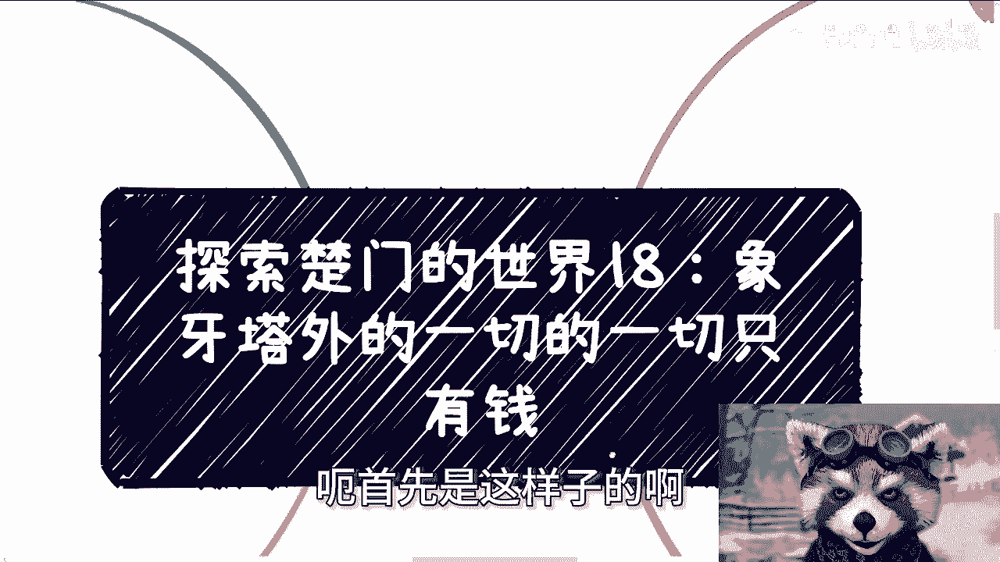
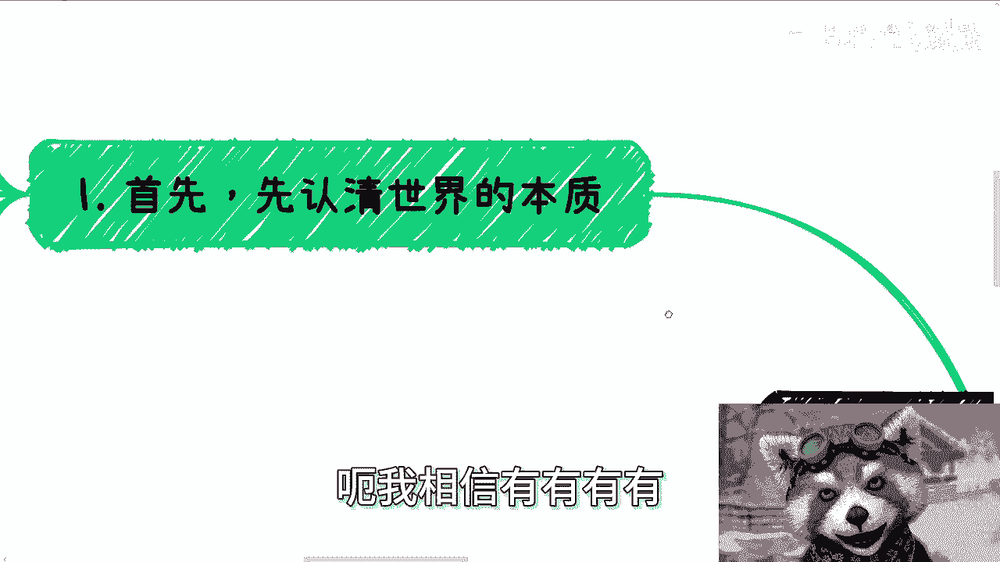
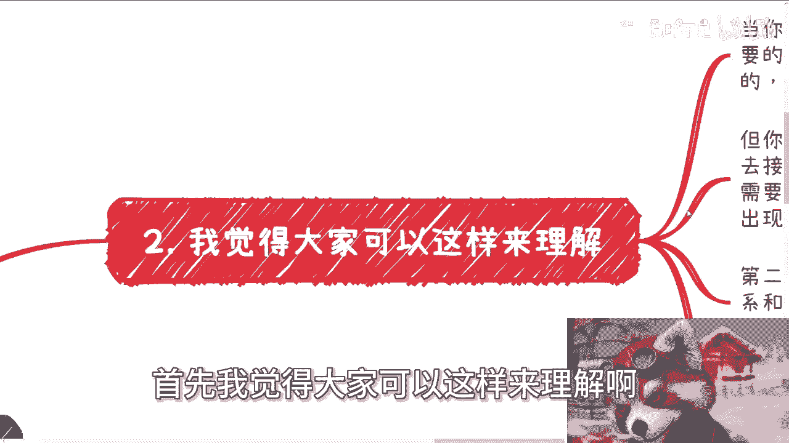
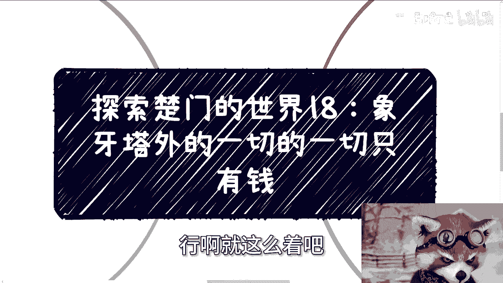

# 探索楚门的世界18：象牙塔外的一切本质只有钱 💰

在本节课中，我们将要学习如何理解现实社会的运作本质。我们将探讨为什么在“象牙塔”之外，金钱是驱动几乎所有社会活动的核心力量，并分析这种认知对个人职业与商业规划的重要性。

## 概述：认清世界的本质

首先，我们需要认清人类世界的本质。这个本质就是**金钱**。当你思考任何事物背后是否有更深层的原因时，你会发现那大多是概率性问题。然而，无论概率多大，都大不过金钱的决定性作用。

例如，当你与成千上万的人沟通时，你不可能与每个人都谈感情或理想。除了谈论金钱，你几乎无法进行其他有效的沟通。谈论其他内容往往徒劳无功。

## 社会地位与金钱的关系

越是有社会地位的人，其背后往往越看重金钱。他们可能表现出对其他事物的关心，但那通常是表象或伪装。当然，世界上存在愿意踏实做事的人，但前提是**金钱报酬必须到位**。报酬不到位，任何事情都难以推进。

在象牙塔内，人们或许还能谈论一些感情和理想，对金钱也未必极度关心。但一旦走出象牙塔，你就不能对此抱有任何幻想。

## 社会化运作的核心：金钱

社会化的运作，在绝大多数情况下，背后都是金钱在起作用。你看到的许多表面现象和人际关系是一回事，但实际能推动事情发展的，往往是你能支付多少钱。

以下是一个核心的思考模式公式：

**个人目标 = 赚钱优先**

如果你想实现个人价值或成就某事，这与赚钱并无直接因果关系。若想赚钱，就必须将赚钱置于首位。你的个人价值体现和想做的事情，应服务于“如何变现”这个核心目标。这才是符合象牙塔外现实的思维方式。

## 理解现实的三层结构

为了更清晰地理解，我们可以将走出象牙塔后需要面对的现实分为三层。

以下是理解现实社会运作的三个层次：

1.  **建立关系**：认识关键人物或团队非常重要，这通常是第一步。
2.  **维护关系**：认识之后，需要投入大量精力甚至资源去维护关系，很多时候普通人连“维护”的资格都没有。
3.  **金钱交易**：这是最底层也是最核心的一层。无论前两层做得如何，最终决定事情成败的，往往是直接的金钱交易。

## 实例分析：竞价排名的本质

上一节我们介绍了现实的三层结构，本节中我们来看看具体的例子。

例如，申报一个项目时，人们通常关心是否认识相关负责人、申报文件是否完美。但实际上，这些往往不是决定因素。目标单位真正关心的，是你是否交钱以及交多少钱。这本质上是一种**竞价排名**。

另一个例子是参加活动或项目。即使通过熟人介绍，相谈甚欢，最终也会落到“你给多少钱”的问题上。给钱就有位置，不给钱就免谈。

在象牙塔外，无论你看到什么，其背后几乎都是金钱在驱动。所谓的“实力”在此环境中定义模糊，因为这里的规则通常是：**政治 > 关系 > 金钱 > 其他一切**。

## 思维模式的转变

最后，说点实际的观察。很多人仍用象牙塔内的思维行事，例如不断发送消息却不愿为咨询付费，或随意推荐“可以聊聊”的人和事。这种思维无法在现实社会中有效运作。

所以，我们必须明白，世界运作有A面和B面。

*   **A面**：是为了做面子，展示给外界看的规则和说辞。
*   **B面**：是为了赚钱，是实际驱动决策和行动的核心逻辑。

这才是社会的本质，国内外皆然，因为其背后是金融和利益在驱动。没有利益，一切社会活动都难以持续。

## 总结与行动建议

本节课中，我们一起学习了象牙塔外社会的核心运作逻辑——**一切的本质在于金钱**。我们从认清本质、分析社会结构、列举实例到转变思维，系统地探讨了这一现实。

如果你在职业规划、商业发展、融资股权等方面有问题，并希望从这一现实视角进行探讨，可以进行整理，然后通过专业的咨询来寻求解决方案。

**记住核心公式：目标 = 赚钱优先。** 你的个人价值实现应服务于这个核心目标，才能在现实社会中有效前行。