# 探索楚门的世界 19：象牙塔外最擅长的就是无中生有 🏛️➡️🌍

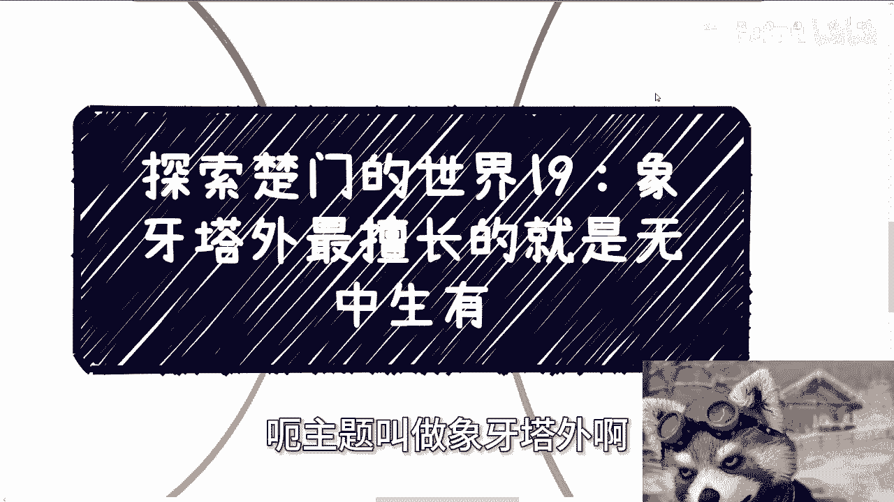

在本节课中，我们将探讨象牙塔内外思维模式的差异，并重点分析象牙塔外如何通过“无中生有”的策略创造机会与价值。我们将通过具体案例，帮助你理解并掌握这种开放、主动的思维方式。

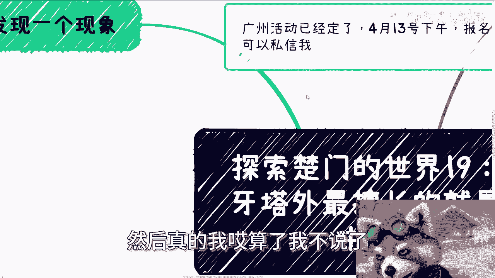

---

## 课程概述

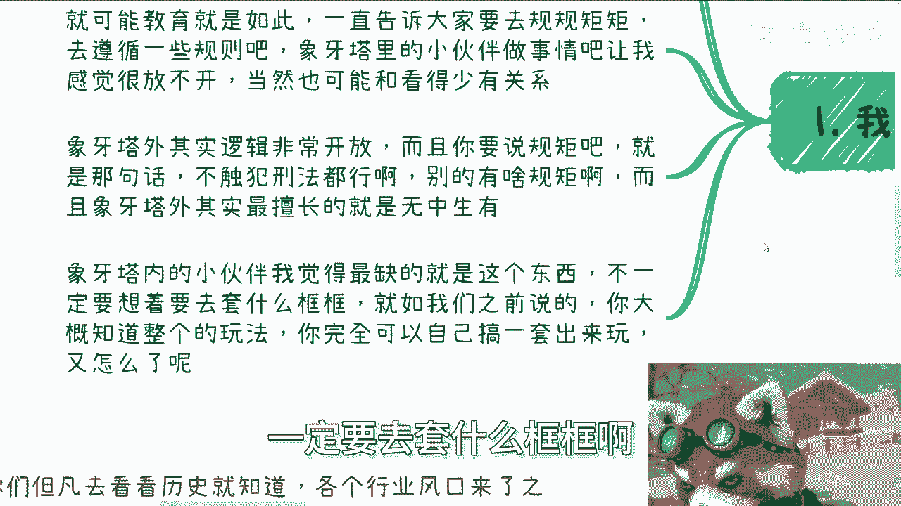

上一节我们讨论了外部世界的复杂性，本节我们将聚焦于象牙塔内外的一个核心差异：想象力与规则意识。象牙塔内往往强调遵循既定规则，而象牙塔外则擅长打破框架，从无到有地创造规则和机会。

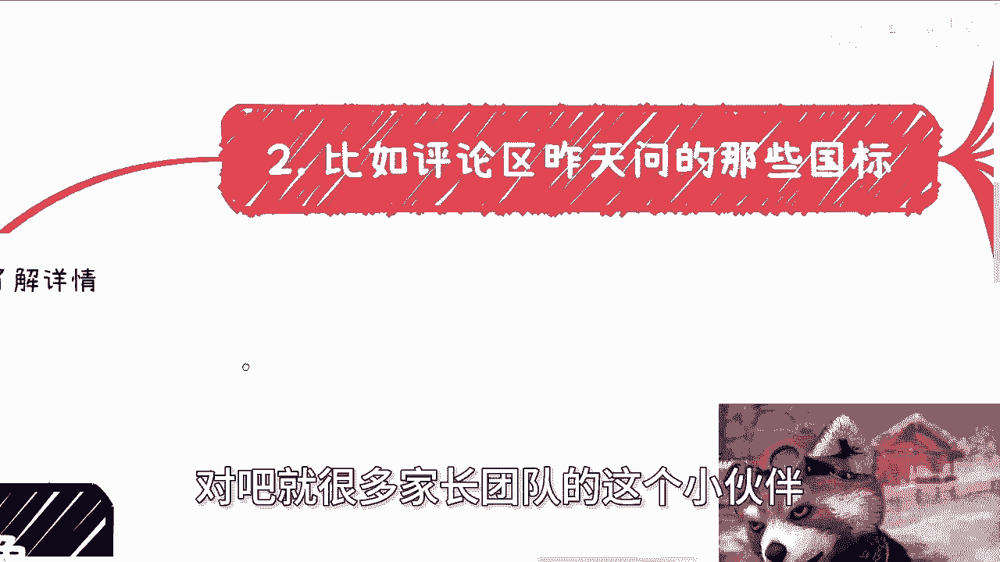

## 象牙塔内外的思维差异

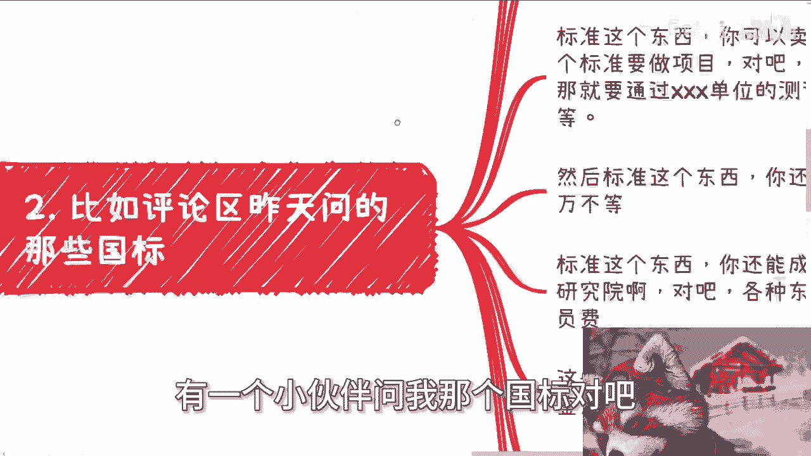

象牙塔内的小伙伴常常缺乏想象力，并倾向于用不存在的规则束缚自己。这可能是长期教育强调规矩和遵循的结果，导致思维不够开放，行动受限。

相比之下，象牙塔外的逻辑非常开放。其核心原则是：只要不触犯刑法，不涉及黄赌毒，几乎没有什么不可为的规矩。象牙塔外最擅长的，正是“无中生有”地创造价值。

## “无中生有”的实战案例

以下是几个“无中生有”策略的具体应用，它们展示了如何在没有现成路径的情况下创造商业或影响力模式。

### 案例一：围绕“标准”创造价值

以“国标”（国家标准）为例。看到标准，想象力匮乏的人可能只想到遵守。但我们可以打开思路，围绕标准创造一系列业务：

*   **卖测评**：企业需要证明产品符合标准，即可提供付费测评服务。
*   **做培训和咨询**：为需要应用标准的企业提供培训和咨询服务。
*   **成立联盟或委员会**：围绕标准成立组织，收取会员费、理事会费等。
*   **项目站台与借鉴费**：标准被项目采用后，可以收取费用或作为专家站台。

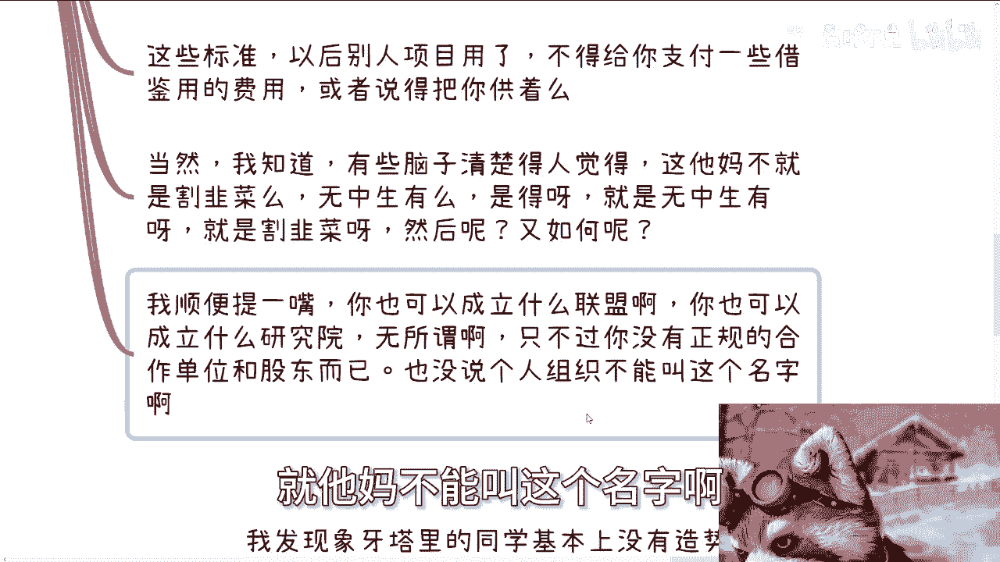

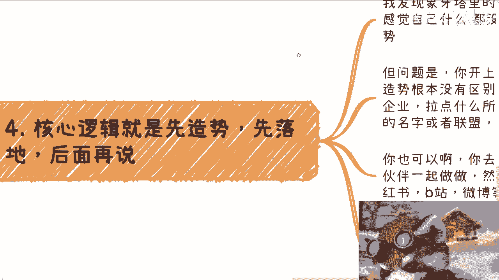

**核心逻辑**：标准制定方（镰刀A）与项目招标方（镰刀B）可能形成利益共同体，共同推动标准的应用，从而创造收割机会。这本质上是一种“无中生有”的创造。

### 案例二：创造“证书”与“人才培养”

观察国内许多官方或半官方组织，每当一个新行业风口出现，最先涌现的往往是相关的“人才培养”和“证书”。

*   这些组织真的专业吗？证书真的有用吗？答案可能存疑。
*   但这正是“无中生有”的体现：一个新兴领域，迅速“变出”对应的培训和认证体系。
*   甚至可以在国家职业大典没有相应岗位时，自己创造一个新的职业名称和认证。

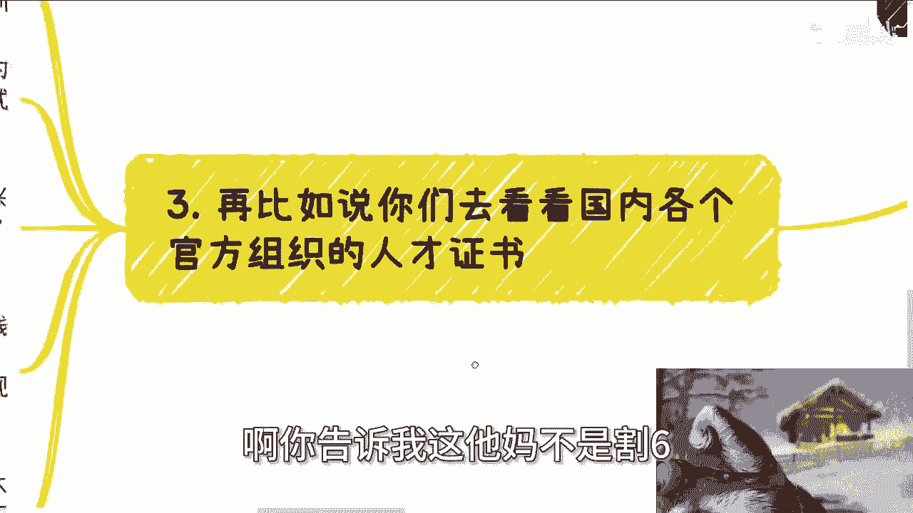

**核心逻辑**：利用信息差和公众对权威的信任，创造需求并满足它。成本极低（主要是发证和书本费），但利润可观。

## 如何实践“无中生有”：造势与落地

象牙塔内的同学常觉得自己“什么都没有”（nobody），因此无法造势。但关键在于方法。

**造势的核心是行动，而非等待权威背书。**

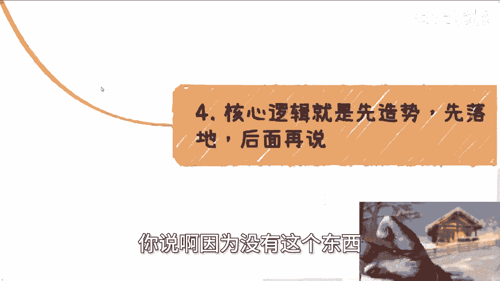

以下是你可以立即开始的步骤：

1.  **聚集资源**：在线下活动或线上社群中，寻找志同道合的小企业或个人。
2.  **塑造名头**：共同成立一个听起来有影响力的组织，例如“XX产业联盟”、“XX创新中心”。
3.  **设计形象**：设计Logo、制作宣传海报、撰写有吸引力的文案。
4.  **广泛宣传**：在小红书、B站、微博等平台进行传播。
5.  **设计盈利模式**：例如，设置“创始会员”、“理事单位”等层级，收取相应的会员费。

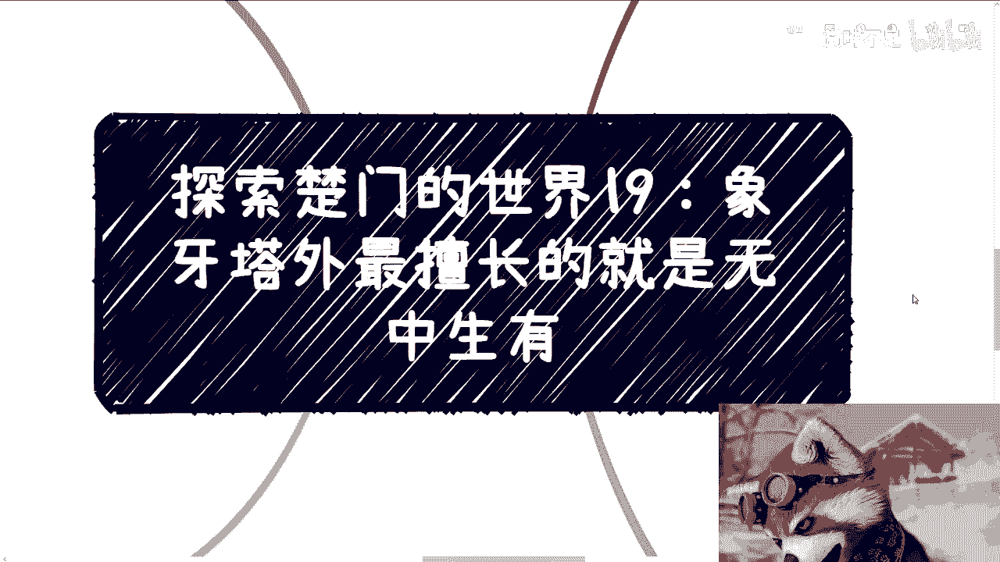

**关键点**：民间组织同样可以起一个响亮的名字。区别在于营销话术、包装水平和执行力，而不在于是否拥有官方的硬性背书。做沙龙、办活动的目的之一，正是为了造势和积累这种“无中生有”的资本。

## 课程总结

本节课我们一起学习了象牙塔内外思维的关键差异。象牙塔内习惯被规则定义，而象牙塔外擅长定义规则，其核心能力是“无中生有”。

我们通过“标准运营”和“证书创造”两个案例，剖析了如何从零到一创造价值点。最后，我们探讨了“造势”的具体方法：即通过主动聚集资源、包装形象和广泛宣传，在没有传统背书的情况下，创造出影响力和商业机会。

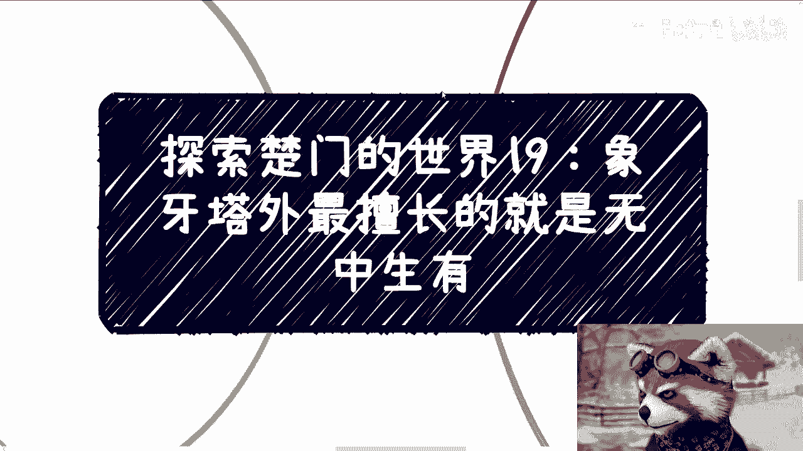

记住，限制往往来自内心而非外界。在合法合规的前提下，大胆地去创造、去连接、去“无中生有”，是象牙塔外世界最重要的生存与发展技能之一。

---
**附：活动与咨询通知**
*   广州活动已定于4月13日下午。报名及了解详情请私信。
*   关于职业规划、商业、融资股权等议题，若希望从我的视角获得分析，请整理好个人背景与具体问题列表后进行咨询。