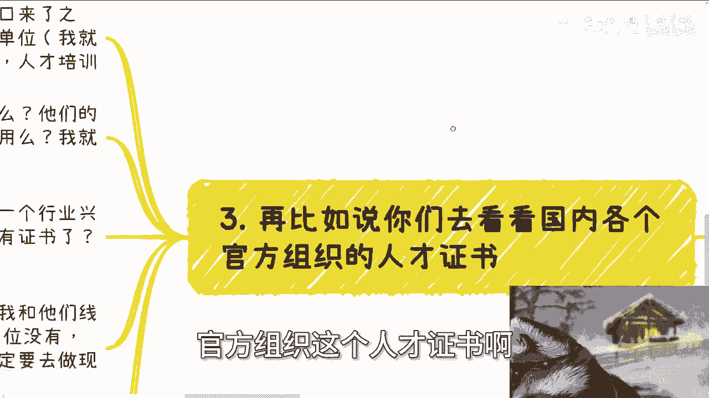
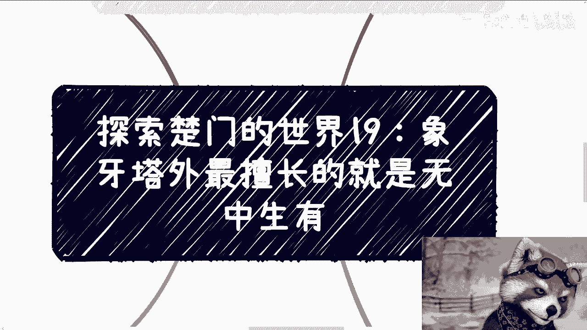
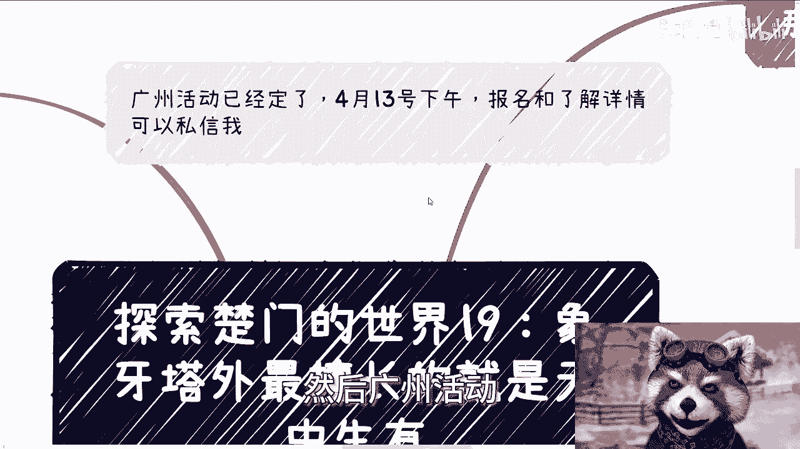

# 探索楚门的世界19：象牙塔外最擅长的就是无中生有 - P1 - 赏味不足 - BV1nK421h7MP

哈喽大家好，今天我们继续来讲这个探索楚门的世界。

19啊，呃主题叫做象牙塔外啊。

最擅长的就是无中生有啊，那么首先呢广州活动我已经订了，4月13号下午啊，我没有想到跟他妈的广交会会重合，我的这价格贵成狗啊。

然后那个报名跟了解详情的可以私信我啊，然后真的我唉算了。

我不说了，回头再说吧，首先第一点啊，我最近发现一个现象，就是象牙塔内外啊，还有个很大的差异，就是象牙塔内的小伙伴啊，我说实话我觉得大家很缺乏想象力，很缺乏想象力，而且喜欢去追求一些所谓的规则啊。

就是说明明没有那种规则去框住你们，你们非要喜欢去用那些规则去框住自己，这也是非常神奇的一件事情啊，那就我最终总结下来，只能认为就是说教育可能就是如此，一直告诉大家要去啊规规矩矩对吧，去遵循一些规则对吧。

或者怎么样子啊，所以说象牙塔里面的这个小伙伴，让我就有种什么感觉呢，就是说很放不开啊，当然也可能跟自己了解的少有关系，那么香香塔外呢其实逻辑非常开放，而且你要说规矩吧，就还是那句话，你不触犯刑法啊。

不是黄赌毒你都行啊，别的有啥规矩啊，没有啊，而且加拿大Y其实最擅长的就是无中生有啊，这个东西我今天也会跟你们讲，香港台内的小伙伴呢，我觉得缺的也就是这个东西，就不一定要想着一定要去套什么框框啊。

或者说就如我们之前说的呃，你大概呢其实知道一个整个的一个玩法，你完全可以自己搞出来一套文，那又怎么样呢，对吧，就很多象牙塔内的这个小伙伴。

觉得自己搞不出来，但我跟你讲，你觉得你搞不出来，仅仅只是因为你觉得你搞不出来，或者你放不开去搞啊，那么比如说啊，昨天评论区有一个小伙伴问我那个国标对吧。

就昨天那个充电视频里面有个小伙伴问我，国标啊，昨天我也是没忍住对吧，我他妈的评论区我就直接点名，就他妈骂了，是因为啊，的确是个，当然也无所谓啊，其实我觉得行业混久了也都知道一些单位，大家都知道啊。

我也不怕得罪他们，完全撸死人啊，你看啊象牙塔里面的小伙伴呢，看到一些标准啊，或者一些所谓的规范，我觉得在我看来想象力就很匮乏，真的很匮乏，我来给你们打开一下思路啊，你比如说国标对吧。

这种标准类的东西你可以怎么做，你可以卖评测评，什么叫测评，就说哎你说现在有国标了啊，那么各个企业你们要不要某些证书啊对吧，要不要来证明自己的东西符不符合标准啊，对吧好，那么就可以卖测评。

所谓的测评是什么，就是一些测试啊，就是根据一些测试标准去测试，那比如说大家要遵循这个标准要做项目了，对吧啊，那么要遵循这个标准去招投标了对吧等等等，拉巴拉巴拉巴拉啊，然后呢你要遵循嘛。

那你就要通过叉叉单位的测评啊，一次呢反正十几万到十几万到几10万不等啊，那么然后标准这个东西呢，你还要做培训和咨询啊，你你可以做啊，几万到十几万不等对吧，那标准这个东西呢你还能成立联盟啊，什么委员会啊。

研究院啊对吧，各种各样的什么玩意儿啊，随便你成立啊，然后收所谓的会员费，理事会单位啊或者等等等啊，那么这些标准呢以后别人项目用了啊，他不得给你支支支付一些什么借鉴费用啊，啊或者说他妈把你供着啊。

把每次叫过去站个台啊，对吧啊，那当然我知道啊，有些脑子不清楚的人啊，我先说不清楚的啊，就有些脑子不清楚的人就要说了，他说那这些东西你说什么招投标啊，你说什么什么评测啊，那人家为什么要来评呢对吧。

那招投标为什么要用你这个标准呢，别的标准不用呢对吧，那很简单啊，给钱吧对吧，什么意思啊，蛇鼠一窝呗，你说什么意思，对不对，就说难听点，就是他啊某某某这出标准的这个是镰刀。

那个让你们啊要去招投标的某一个部门，也他妈是镰刀，人家联合起来割你们就这么简单一回事，对不对，你觉得有好人吗啊哪来的好人，只有认钱的，不会认人的啊，懂不啊，那么当然啊我就回到说啊，有些脑子不清啊。

就清楚的人呢就会觉得这他妈不就是割韭菜吗，不就是无中生有吗，就比如说一个标准以前没有对吧，我现在好像出来一个啊开始割，是的呀，是的呀，我就问你，那又如何呢，又怎么样呢，你能把他们怎么样，对不对。

那我顺便提一嘴啊，你也可以成立什么联盟啊，你也可以成立什么研究员，无所谓啊，只不过你没有正规的合作单位或者股东啊，你没有正规的背书啊，但是并没有人说过没有正规背书，就他妈不能叫这个名字。

怎么样了呢，对不对。

好咦怎么这也就四了啊，你要再比如说啊，你们去看看国内各个官方组织对吧，我就不点名了，哪些官方组织官方组织这个人才证书啊。

我跟你们讲，你们但凡去看看，往前翻10年啊，你去看看历史，各个行业风口来了之后，最优先出来的是什么人才培养，人才培训证书啊，咱就这么说啊，咱就这么说，他们真的懂吗，他们真的专业吗。

他们的人才培养真的有用吗，他们的证书真的有用吗，啊你们自己判断啊，我就不说了对吧，但问题是什么，这些东西不他妈就是无中生有的吗，哦一个行业刚刚兴起，一个风口刚刚出来哦，就他妈人才培养就有了啊。

这书就有了，哪来的变出来的，是的确是变出来的对吧，我告诉你们香港塔，我就是这么做事情的，就比如我之前跟你们说的职业竞争等级，我跟他们现在讨论的是什么，如果某个行业跟职业大典里面没有这个岗位。

那我们又做出来一个有什么关系呢，没有我们创一个出来怎么了呢，啊为什么一定要去做县城呢，我告诉你们，包括中国一直到今天为止，有非常多的野鸡证书，这些野鸡证书不要太赚钱了啊。

你们去翻翻哪个野鸡证书不他妈不是无中生，有的不都是无中生有的对吧，说白了组织都是不变的，无非都是证书里面的名字坏坏，今天叫AI，明天就大数据，后天就叫双碳啊，他他妈就给你一个11111个一个书本费。

有什么用啊，啊有成本吗，啊你告诉我这他妈不是割裂。

不是不是割韭菜是什么啊，第四我告诉你们核心逻辑是什么。

就是先造势，先落地，后面再说啊，我发现现在他里面的同学呢，基本上他没有这个造势的思维啊，就是他会感觉自己什么都没有，或者自己nobody对吧，什么都不是，就不能造势，但问题来了。

你今天你比如说你跟着我开一个上帝视角，来看一下这个事情，象牙塔内外造势有什么区别啊，啊外面做事也是造势，比如说拉点企业，拉点所谓的专家，然后自己起一个很牛逼的名字或者联盟，然后就开干开歌，你也可以啊。

你不行吗，你怎么不行了呢，你去线下活动找点小企业，你去线下活动找点小伙伴一起做做对吧，然后套点名头，称称自己是专家，然后你自己起个很牛逼的名字，然后你在小红书，B站微博等等，你全部来一遍。

怎么了呢怎么了呢，哎我就奇了，怪，策马了呢，不能干吗，对吧，我跟你讲，还是那句话啊，真的你该做的都做了，该找的都找了，该有的都有了，你是造不起来，我他妈是不信的对吧，你造不起来，很有可能不是因为你。

不是因为就是说这个逻辑不对，而是因为你的确做的不够好，比如说你的营销话术不够牛逼，你的海报做的不够传销，你人不够包装，名字不够牛逼对吧，但绝对不会因为你缺少什么，象牙塔内没有的一些硬性的东西，你说哦。

因为没有这个东西做不起来。

不存在的，你知道吗对吧，我承认他，你要说你不能跟那些所谓的什么什么，某某某国家的研究院比，我也承认的，但是你要明白，除了这些所谓的官方组织机构以外，往下走的各种鸡鸡毛证书多了去了，卧槽普遍都是遍地都是。

那为什么他们能做得起，你做不起来呢，有什么区别，我就问对吧，没有区别的，只不过他营销的好，你营销的不好，对老百姓来讲，他懂个屁呀。

啊你明白吗，就是说就是说你今天真的做点什么，你像你像我一直跟你们说，做沙龙也好，做活动也好，本身是什么目的啊，本身就是为了造势，我随便我再随便提一嘴哈，比如说你们做了一些活动，你们参加了一些活动。

你认识的一些人，你把他们组织起来，比如说弄那么七八个人组成一个团，组成一个团队，然后说我们今天发起个联盟，怎么了呢，不行吗，谁他妈说民间组织不能起联盟呢，对不对，你再写一个，你再设计个logo。

你再做张海报，这不就牛逼了吗，唉我真奇了怪了，就是我们做事情为什么不是为了赚钱吗，那你为了什么，为了慈善对吧，你为了赚钱什么意思，为了赚钱就是我已经付出了努力，我既然我当然要把这个影响力大到最大对吧。

那你说你今天找一些人，大家合伙合起来做个联盟，有什么成本吗，没有啊，你甚至都他妈没有组织，你甚至都没有主体，你要什么成本啊对吧，但是联盟这个东西你从行业里面，你从民间来讲，它听上去就很有号召力。

很有传销能力，对不对，那你到时候再去说，哎你看我们几个人，我们几家企业就是就是创世单位对吧，然后下面就是什么会员单位，一家单位交5000，交1万怎么了，那这不是赚钱吗，诶我就奇了怪了，对吧。

就这种类型的case比比皆是，啊行好吧。

就这么着啊，然后广州活动好吧。

你们要来的，你们就叫什么，就是私信跟我报名好吧。

然后剩下的话就是呃职业商业啊，融资股权对吧，或者来说什么个人规划啊，以我的这个视角，你们希望通过我的视角来给你们做一点，这个方向发展的啊，或者怎么样的，你们可以整理好对应的这个背景跟问题列表啊。

