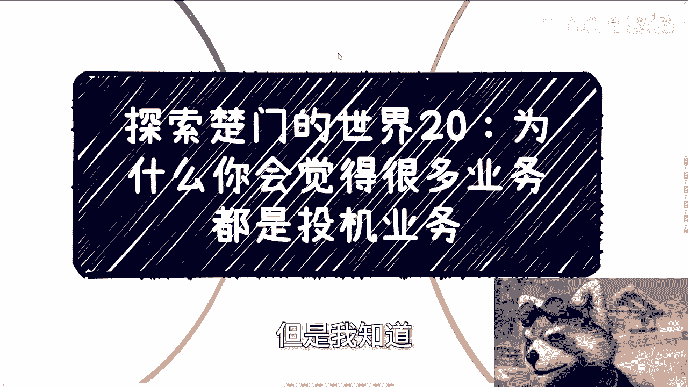
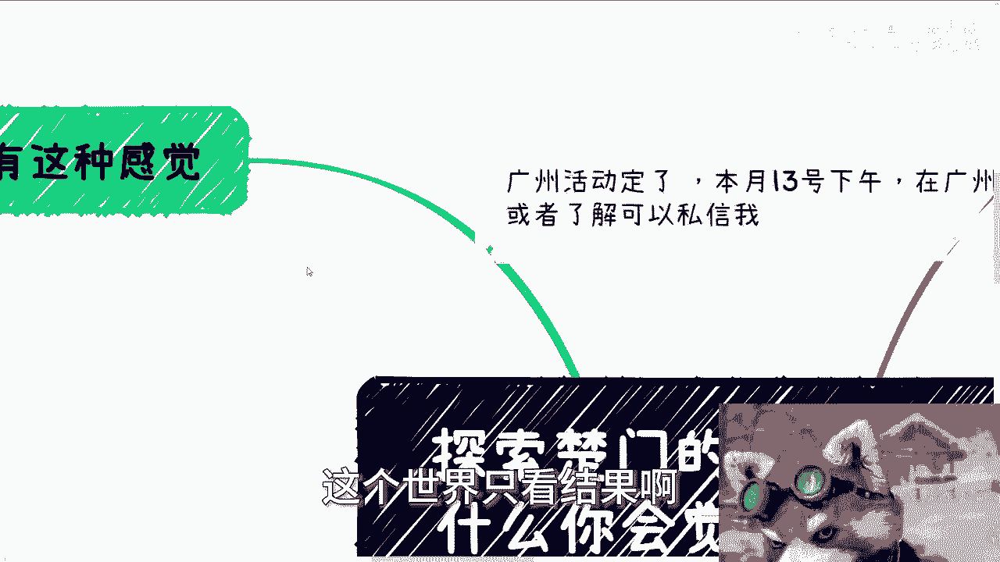
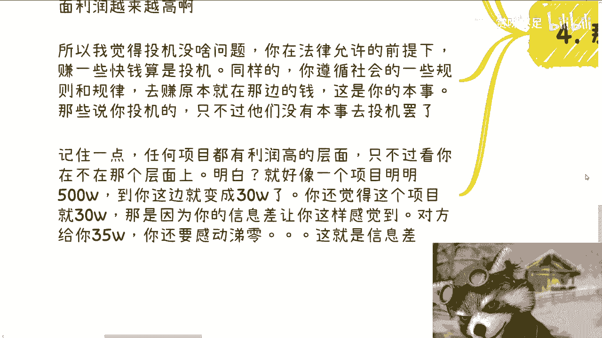

# 探索楚门的世界20：为什么你会觉得很多业务是投机业务 - P1 - 赏味不足 - BV1TH4y1M7rA

好大家好，今天终于不是凌晨来给你们录东西了啊，呃广州活动定了好吧，本月13号也就是下周，下周礼拜几礼拜礼拜六啊。

在那个广东广东番禺，广州番禺好吧，报名的或者了解详情的，可以私信我啊，那么今天我们来讲探索的楚门的世界，20，卧槽这个系列他妈能到20，我的妈我也觉得我自己很吊啊，嗯20是什么呢。

就是为什么你会觉得很多业务都是投机倒把，因为前两天我看到那个评论区有蛮多人提到，这个事其实也不多，但是我知道你们心里肯定也会这么想啊。

哼就我相信很多人会有这种感觉啊，就是呢他会觉得呢，与自己9年制义务教育受到的教育和高等教育，受到的传统教育是相悖的啊，那么这个时候呢就会有一个疑问啊，就是说可能你们也也想过，但是你们没有开口问我啊。

我来回答这个问题，就是就是你们会会不会有一种想法，就是说是不是所有业务都是这样投机倒把，我跟你们讲，答案肯定是不是对吧，虽然答案是不是的，但是为什么啊，你们想想看啊，但问题在于为什么我们知道的。

或者说你们从我这边知道的，或者说你们从别的地方知道的很多业务，感觉都是投机倒把，那我告诉你这个很简单，第一普通人也只能投机倒把，对不对，你能怎么样，你告诉我你能怎么样对吧。

另外一个就是说也只有我们称之为有那种，就让大众感觉投机倒把业务，当然并不是说他就是投机倒把的啊，只是让大众觉得，或者让象牙塔内的人觉得，投机倒把业务是有钱赚的，因为你仔细想想看啊，世界上的业务千千万啊。

有辛苦的，有不辛苦的啊，有特别辛苦的啊，那那没有，其实没有不辛苦的，就只有辛苦跟特别辛苦的对吧，那么你做了吗对吧。

你想想啊，你做的是辛苦的还是非常辛苦的，还是一般辛苦的，那你想想看啊，怎么来定义辛不辛苦不辛苦，并不是你觉得苦不苦来定义的，而是说你今天付出了多少努力，产生了多少价值对吧。

你就好比我今天打工打了22天对吧，一个月打了22天，我只拿500，你辛不辛苦辛苦，那你要拿50万呢，辛苦吗，不辛苦，对不对，你做的事情是一样的，为什么，因为你所产生的价值不一样好，那么我们就说啊。

辛苦的多了去了，你不做你做不做，我不知道啊，但是由于信息差被拿来当做知识付费的啊，会让你觉得貌似很赚钱的，其实实操下来很苦很累，根本赚不到钱的，他妈的多了去了对吧。

所以啊这个时候你会听到外面有非常多的声音，有的人觉得你投机，有的人觉得你在走歪路，有的人觉得你想赚快钱，对不对，但这不重要，就如我说的，这个世界只看结果好。

那么我们来讲到正题啊，我们来举一些例子呃，你比如说同样是实体行业啊，比如说装修啊，设计啊对吧，你在做传统行业，我就问你，你们现在做土木的或者做别的东西，再再比如说设计院的，不用我说。

你们或者你问问你身边的同学，你们自己去问问他们，一个项目的利润能有多少啊，能有多长，他做一个项目周期是多长，你一年能他妈做几个项目，对不对啊，但是同样的你如果换个思路啊，比如说中国各地方的研究院成员。

各种新增的那种政府内政府的那种机构啊，总会有一层是用来做展览的，你们去了解了解，包括博物馆很多很多，但是一样的，你想想看展览这个东西，它是一个物理世界的东西，也就是说它一样需要装装饰，一样需要装修。

一样需要就是说你给他套明啊，就是你给他套套套噱头啊，但这种展厅在当年，或者说每个行业真正封口的时候，它拥有非常高的预算，那当然就是我们说的你每个时间段，每个时间周期，某一个时间窗口都有风口啊对吧。

你过去你没赶上，那未来呢你敢不敢呢对吧，那我们就说同样在这种风口的那个时间窗口里，你同样去做装修装饰对吧，这种东西啊，你至少比你在同行业付出同样的成本，有着高几倍甚至十几倍的利润好。

那么我给你们举个例子，比如说之前的METAVERSE元宇宙NFT数字藏品，大数据，云计算等等等等等，这些其实都有，包括你看杭州那边，他妈的还有什么人工智能小镇，那么人工智能小镇他妈的多少年前的事，对吧。

哦我跟你们讲啊，我们身边以前有很多团队，他专门就是做这种展厅的哦，就是同一套设计，同一套装修，就说白了他妈的就是同一套模板啊，什么都不改的，然后到不同的地方，不同的研究院，不同的政府。

不同的这个这个这个这个叫什么机构去落地，你说这是投机倒把吗，哎我就问了，你觉得是投机倒把吗，或者你去问那些他们觉得我们在投机倒把的人，你问问他们说，他们觉得这算投机倒把吗，哦那么在传统行业看来。

你可能在乱报价，比如说你一个明明明明，比如说三四十万能做下来的东西，就往三四百万保对吧，两三百万保，那么他觉得你在投机倒把，你在薅羊毛，但问题是什么，问题是世界上所谓赚钱不就是赚信息差吗，你没有信息差。

你怎么赚钱啊，哦那按照这个说法，转身一下都叫投机啊，那你那那我还是那句话，你说个不投机的，我看看你对吧，你你你让他说一个不投机的能赚钱的，我听听有吗啊啊这第一第二个，第三我们再来说一些数字化服务啊。

我就这样说啊，中国这片土地上面的这个软件服务，你们看到很多很多，我可以说你往前看啊，就是八九十%都是一个标品，然后换层皮到处卖，而且我跟你们讲，这是没有问题啊，我觉得这是一点问题都没有，怎么了呢。

你从商业角度来讲，需要的是利益最大化，一个产品标品来讲就是投入最低的，怎么了呢，哦一定要定制啊，哦你一个标品能卖给不同的地方，那也是非常正常的一个逻辑，哪条法律说不能卖标品，哪条法律说要定制化了啊。

哪条法律说标品卖的时候价格要一样了，跟我说说看有吗，艾玛奇了怪了没有啊，那没有，我为什么不能卖呢，对吧，而且我就这样说，数字化也好，别的服务也罢，我跟你们说都是这样的逻辑，那我就问这算不算投机倒把。

那可能就有的人说哎也是投机，但问题来了，那如果这算投机的话，那么我就问你们平时吃饭，你们平时呃电商那个那个那个网络电商对吧，包括你做别的买，买一些东西，那大家不都是标品吗，他妈的他卖你一份炸鸡饭。

跟卖我一份炸鸡饭，他妈的不一样啊，那怎么了呢，不能卖，那我那我还说呢，那我还说中国的制造业很多地方都是流流水花，那不是割我们吗，你都流水化了，你凭什么这么贵，没道理呀。

你这你这个不成你这个因果关系不成立的对吧，那你想看为什么不同地方能卖，为什么能卖不同价格，不就是因为有需求，有信息差嘛对吧，你比如说上海卖一个东西，他卖20万，你卖到山西可能就他妈卖50万对吧。

你可能卖200万，谁知道呢，但是他为什么能卖呢，那不就是因为有需求，有信息差吗，怎么了，那不能卖吗，啊谁规定我在上海这边卖20万到山西，他妈只能就一定20万，谁说的那奇了怪了，对吧好。

那我觉得我们来讲一下本质啊，我觉得这个问题应该在于这样看啊，所谓有着信息巨大的信息差，被压榨的底层，他是最不投机的，因为他们的付出跟得到基本上是同等的，甚至付出是小于得到呃，呃付出是大于得到的。

那么他们就不觉得投机问题，为什么，问题是什么，问题是他们本来投入产出比，是就是一个就是就是完全天平就是平等的，甚至是负数，而且本质上他们是在帮资本家投机，也就是说他虽然自己投不了机。

但是他他的劳动在帮别人投机，那么所有的项目从底层往上数，它就有无数层的信息差，那这个时候我跟你讲，按照那些的说法，你只要投入产出比高的就都都是他妈投机的话，那商人都在投机啊，为什么。

因为上面的利润越来越高对吧，那是不是这样吗，那你要告诉我上面都在投机，那我就告诉整个世界都他妈在投机，怎么了呢，怎么了呢啊啊，所以我觉得投机没啥问题，你在法律允许的前提之下赚一些快钱算投机。

那同样的你遵循社会的一些规律，蛇这个这个金融的一些规律去赚，原本就在那边的钱，也是你的本事，怎么了呢对吧，那我觉得如果这种行为被说成投机的话，那我只能认为那些说你的人，他没有本事去投机好。

那我告诉你记住一点，任何项目的利润高的层面，就是任何项目他都有利润高的层面，只不过就是你看不看得到，明白吧啊，这就好像一个项目明明有500万，到你这边就变成30万了，什么意思呢，就是说你做这个项目。

你知道哦，我可能拿30万，但是你并不知道，这个项目真正的预算只有500万，真正批下来有500万，因为470万，被你看不到的那些人疯掉了对吧，你还觉得这个项目整个就30万，那是因为你的信息差。

让你那你让你这样认知的对吧，甚至对方给你35万，还得感动T0，还得他妈跪下来舔，那为什么这就是信息差呀，那你怎么说呢，你能怎么说呢，哦你说我的，你们他妈太黑了啊啊，那把我妈另外470万坑掉了。

那大哥你有没有想过没有他们，你哪来这30万，对不对，一样的道理啊。

啊所以说你说啊这个投机不投机，我觉得逻辑很简单，在商业层面没有什么投机不投机的，商业层面只有性价比高跟性价比低，那我们就这么说，所有的那些不赚钱的，赚辛苦钱的就是没性价比，比如说打工对吧。

你真的性价比高的，你同样付出，比如说一个月付出半个月的时间，一个月付出一个礼拜的时间，你能赚100万，那没问题啊，那就说明性价比高啊，性价比高意味着什么，意味着你拥有别人没有的信息差，就这么简单，没了。

有什么投机不投机的，诶，莫名其妙了对吧，你真的你要说你要碰我身上，我就说那你投给我看看，你投呗，有人拦着你投吗啊你投呗，你投不到，你来说我干嘛呢，对不对啊。

好吧，OK那就这么着吧好吧，然后那个广州活动要报名的，继续报啊，然后这个叫什么，就是商业啊啊啊职业啊，包括其他的一些呃这个融资啊，股权啊等等啊，包括各种东西，反正你们要是有需求的好吧。

你们可以这个整理好问题。

然后我们再约个咨询。