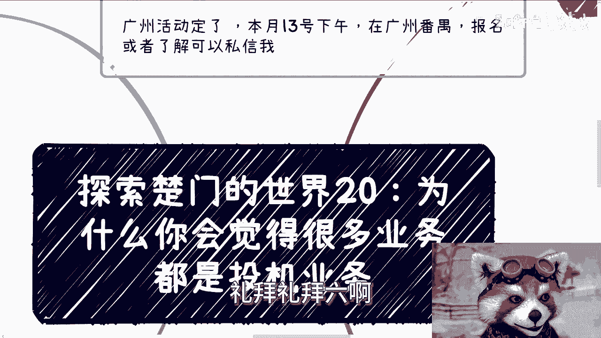
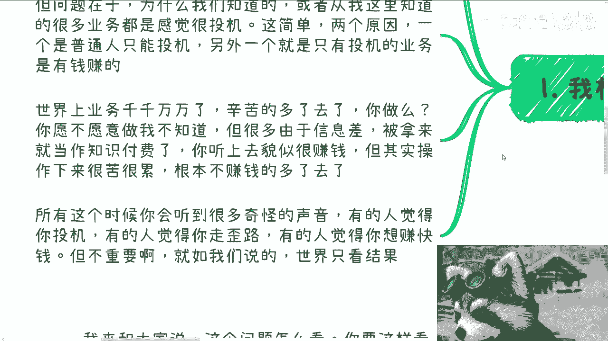
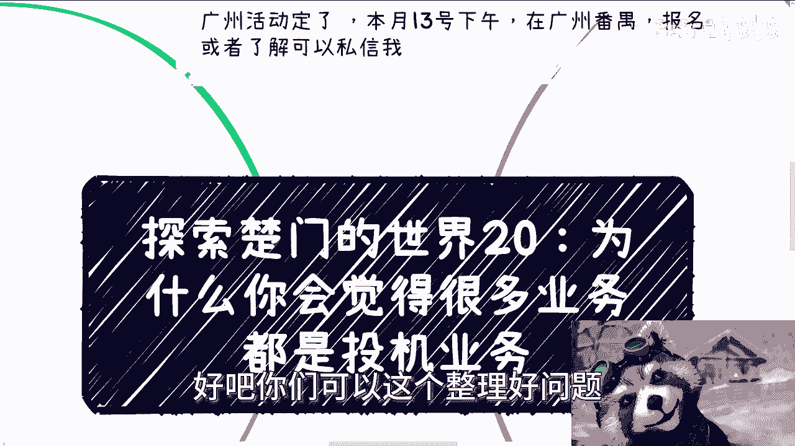

# 探索楚门的世界 第20课：为什么你会觉得很多业务是投机业务？ 💰



在本节课中，我们将探讨一个常见的困惑：为什么许多看起来能赚钱的业务，总给人一种“投机倒把”的感觉？我们将从商业本质、信息差和价值创造的角度来分析这一现象，帮助你理解其背后的逻辑。

---


## 课程概述

很多人接受过传统教育后，会发现社会上的一些赚钱方式与自己认知中的“正经工作”相悖，从而产生“这些业务是否都是投机”的疑问。本节课程将解释这种感觉的来源，并通过实例说明商业世界中“性价比”与“信息差”的核心作用。

---

## 一、 感觉的源头：传统教育与现实商业的碰撞

这种感觉的产生，往往源于我们接受的9年制义务教育及高等教育所灌输的传统观念，与现实商业操作之间存在差异。



许多人因此产生疑问：是否所有业务都如此？答案是否定的。但问题在于，为什么我们接触到或听说过的许多业务，都给人一种投机取把的印象？

---

## 二、 核心原因分析

以下是造成这种印象的几个关键原因。


### 1. 普通人的现实选择
对于普通人而言，能够接触并参与的业务选项本身有限。“投机倒把”式的业务往往是可见的、似乎有机会的路径。

### 2. “高利润”业务的可见性
只有那些让大众（尤其是身处“象牙塔”中的人）感觉是“投机倒把”的业务，才显得有利可图。世界上业务种类繁多，有辛苦的，有特别辛苦的。你是否在做，以及做哪一种，取决于你创造的价值。

**价值公式**可以简单理解为：
`个人收入 ≈ 创造的价值 - 信息损耗`

辛苦程度并非由主观感受定义，而是由“付出努力”与“产生价值”的比率决定。例如，同样工作22天，月薪500元很辛苦，月薪50万元则感觉不辛苦，因为创造的价值天差地别。

### 3. 信息差的筛选作用
市场上充斥着大量因信息差而被包装成“知识付费”的项目。它们听起来赚钱，但实操起来又苦又累，且根本赚不到钱。因此，那些最终能被你听到、并且似乎可行的项目，自然就偏向于利用信息差获利的模式。

外界对此会有各种评价，有人认为这是投机，有人认为这是走歪路。但正如商业世界常说的：**这个世界只看结果**。

---

## 三、 实例剖析：是“投机”还是“商业智慧”？

上一节我们分析了感觉产生的原因，本节我们通过具体例子来看看，这些被贴上“投机”标签的业务，其本质究竟是什么。

### 案例一：传统行业 vs. 风口行业
以实体行业中的装修设计为例。

*   **传统路径**：在设计院或土木工程领域，一个项目周期长、利润薄。从业者一年做不了几个项目。
*   **风口路径**：同样是装修装饰，如果服务于特定风口下的需求，利润可能高出数倍甚至十几倍。
    *   **举例**：各地政府机构、研究院、博物馆常需要建设展厅。在元宇宙、NFT、人工智能等概念成为风口时，这类展厅拥有极高预算。
    *   **现实情况**：曾有团队用**同一套设计模板**，稍作修改后，就在不同地方政府或机构落地项目。这算投机倒把吗？

在传统行业看来，这可能是在“乱报价”（例如将成本30万的项目报价300万）。但商业的本质之一就是**赚取信息差**。如果没有信息差，利润从何而来？

### 案例二：数字化服务与标品销售
在中国，大量的软件服务都是一个标品换层皮，就销售给不同的客户。

从商业角度追求利益最大化，将**投入最低的标品**反复销售，是完全合理的逻辑。没有法律规定必须定制化，也没有法律规定标品售价必须统一。

**商业逻辑代码化**：
```python
# 标品销售的简化模型
def sell_standard_product(base_cost, info_gap_factor, demand_factor):
    # base_cost: 基础成本
    # info_gap_factor: 信息差系数，不同客户认知不同
    # demand_factor: 需求紧迫度系数
    price = base_cost * info_gap_factor * demand_factor
    return price

# 对客户A（信息差小，需求一般）
price_A = sell_standard_product(100000, 1.2, 1.0) # 售价12万
# 对客户B（信息差大，需求迫切）
price_B = sell_standard_product(100000, 3.0, 2.0) # 售价60万
```
这算投机倒把吗？如果算，那么日常消费的电商产品、标准化制造的工业品，是否也都是“投机”？显然，这个因果关系不成立。不同地点、不同价格能成立，核心在于**需求**和**信息差**。

---

## 四、 问题的本质：价值链与性价比

我们分析了具体案例，现在让我们深入本质。问题的关键或许在于视角。

*   **底层劳动者**：处于信息链末端，付出与所得基本持平甚至“入不敷出”。他们不觉得自己在投机，因为其投入产出比近乎平等或为负。但实际上，他们的劳动在帮助“资本家”完成所谓的“投机”。
*   **价值链上层**：从底层往上，每一层都叠加了一层信息差，利润被逐层抽取。如果一个项目的总预算是500万，到了最底层的执行者手中可能只剩30万。那470万的差价，就被上层利用信息差分配了。

执行者可能感激这30万的机会，却不知道项目的全貌。这完全是**信息差**导致的认知差异。

所以，在商业层面讨论“投机”没有意义。商业层面只有**性价比**的高低。

*   **低性价比**：付出大量时间，换取微薄收入（例如某些形式的打工）。
*   **高性价比**：付出较少时间，换取高额回报。

**高性价比的本质，就是你掌握了别人没有的信息差**。仅此而已。

如果有人指责这是“投机”，不妨反问：法律是否禁止？如果机会明确，对方为何不参与？往往是因为对方**没有能力抓住**这种信息差。

---

## 五、 核心总结


本节课我们一起学习了为何许多业务显得像“投机倒把”。

1.  **感觉源于认知差**：传统教育塑造的价值观与现实的商业获利模式存在冲突。
2.  **可见性偏差**：你能接触到的“可行”方案，多是利用了信息差的模式。
3.  **商业核心是信息差与性价比**：所有高利润环节都存在于信息差之中。赚钱的本质是提供价值并获取相应的回报，而回报率的高低取决于你掌握的信息差大小。
4.  **重新定义“投机”**：在法律框架内，利用信息差和商业规律获取利润，是商业能力的体现，而非简单的道德批判。关键在于你能否发现并进入那个“高性价比”的价值层。

记住：**任何项目都有利润丰厚的层面，区别只在于你是否看得到、进得去。**


---

> 广州线下活动已定于本月13日（周六）在番禺举行。如需报名或了解详情，可私信咨询。
> 关于商业、职业、融资、股权等其他问题，可整理好后预约咨询。



---