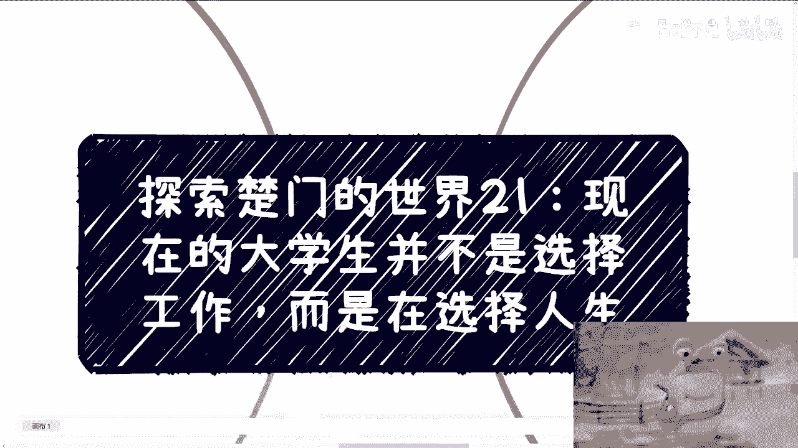
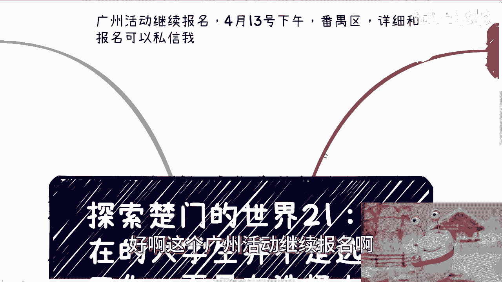
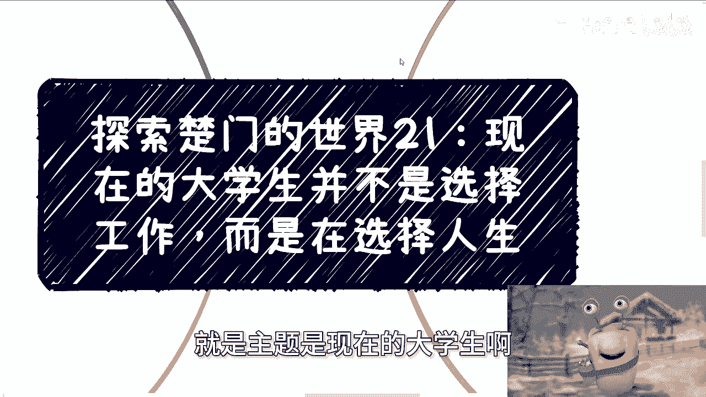
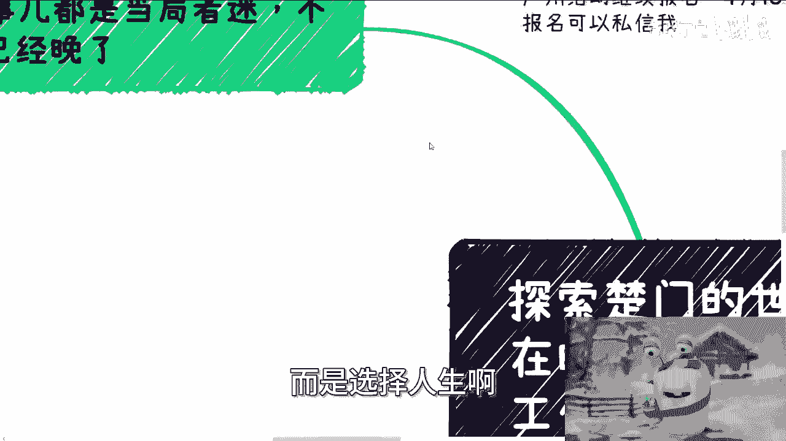
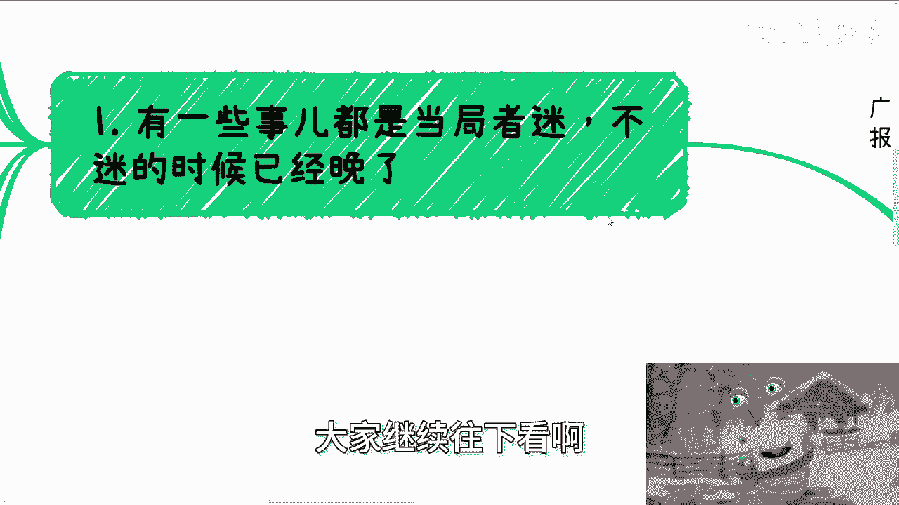
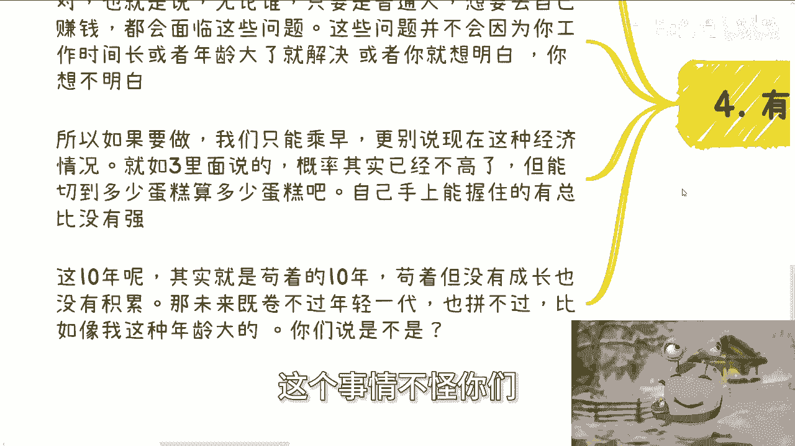
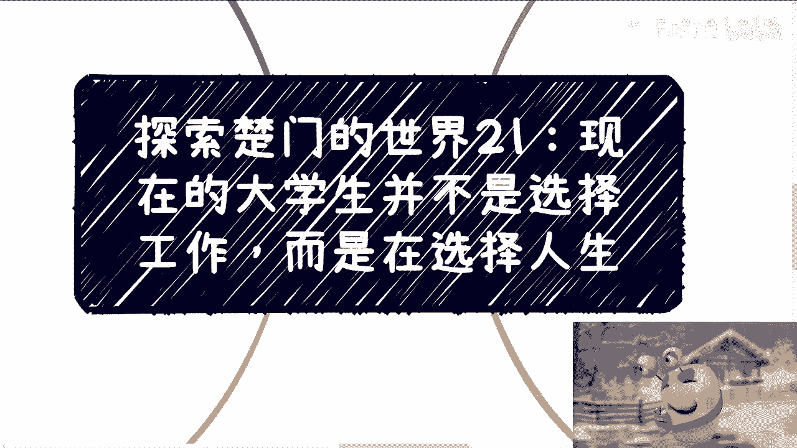

# 探索楚门的世界21-大家不是选择工作-而是选择未来的生活状态---P1---赏味不足---BV1NT

在本节课中，我们将探讨一个对当代大学生至关重要的主题：职业选择背后的深层逻辑。我们将分析当前环境与过去的差异，并理解为何如今的选择更关乎长远的“生活状态”而非短期的“工作”。

---

## 概述：选择的本质已改变

过去，人们在选择工作时，往往聚焦于具体的岗位、行业或薪酬待遇。然而，当下的社会环境发生了根本性变化。战术层面（如选择前台、中台或后台岗位）的差异对个人长期发展的影响正在减弱。真正决定人生轨迹的，是战略层面的选择。

上一节我们概述了选择本质的变化，本节中我们来看看当前环境的具体特征。

## 当前环境的特殊性：2020-2030年的“真空期”

2020年至2030年这十年对步入社会的年轻人而言，是一个特殊的“真空期”。战术上的努力，如争取一份更好的工作或更高的薪水，难以带来人生轨迹的显著偏差。

真正的偏差来源于战略选择。以下是几个核心的战略方向：
*   **选择公务员体系**
*   **选择为企业打工**
*   **选择自己创业赚钱**

这些战略并非完全互斥，你可以并行尝试，但必须有一个明确的侧重点和目标。因为任何战略目标的实现都需要长期积累，无法一蹴而就。

例如，若你想在中国靠自己赚钱，积累过程可以概括为以下公式：
**成功创业 ≈ 积累(合作伙伴 + 社会关系 + 成功案例)**
没有这些积累，想法很难落地。

---

## 过去与现在的核心差异：被动机遇的消失

有人会问，难道过去的人就不面临选择吗？当然面临。区别在于，过去的市场环境和经济增长提供了丰富的“被动机遇”。

以下是过去环境提供机遇的几个方面：
*   **市场充满机会**：新兴行业和业务不断涌现。
*   **组织快速扩张**：公司有大量业务和岗位需求。
*   **人际网络价值**：在工作中结识的人，可能因市场红利在未来成为合作伙伴。

那时的成功，更多得益于整体向上的“环境和土壤”。个人是被时代推着前进的，很多合作与机遇是环境赠予的“被动礼物”。

然而，这种被动机遇在当下已几乎消失。如果不主动规划和积累，很难再有突破性发展。

---

## 困境加剧：象牙塔内外的“交汇点”锐减

当前，校园（象牙塔内）与社会（象牙塔外）之间的良性互动正在急剧减少。核心原因在于社会端的预算大幅收缩。

我们可以用一个简单的模型来理解：
**假设市场总预算（蛋糕）从前期的 `1000单位` 缩减到现在的 `300单位`。**
虽然蛋糕变小了，但分蛋糕的人（各类企业、机构）并未减少。这导致竞争异常激烈，所有人都必须勒紧裤腰带求生。

在这种情况下，社会端与校园端的合作性质发生了根本改变：
*   **过去**：合作是互利的。社会端认为与校园人才合作能带来额外增长，因此心态开放，愿意投入。
*   **现在**：合作常常变成单方面的“收割”或“低成本利用”。预算削减导致白嫖、大幅压价成为常态，良性交汇点几乎消失。

对于绝大多数普通人而言，我们很难成为掌握预算的“甲方”，因此只能适应这种变化。

---

## 未来的挑战与唯一出路：主动选择与提前积累

面对这样的环境，改变的概率很小。如果你选择考公或打工，几年后想转换赛道，将会异常艰难。你会发现自己缺乏直接用于商业市场的技能和资源。

更严峻的挑战在于时间。未来10年，整个社会土壤可能都处于一种“求生存”的状态。对于年轻人而言，这意味着：
**苟活10年 ≈ 低成长 + 零积累**
因为你所在的组织和他人都无暇顾及你的长期发展。

等到10年后，你将面临双重压力：既拼不过新一代年轻人的体力与可塑性，也比不过年长者的经验与人脉积累。

因此，唯一的出路是 **趁早进行主动的战略选择并开始积累**。你需要认真思考自己30岁时想要的生活状态，并为此提前布局。例如，若希望三十多岁能拥有一定程度的自由或事业，积累就必须从现在开始。

以下是阻碍大多数人行动的两个核心原因：
1.  **根深蒂固的教育观念**：认为人生就应该找一份“正经工作”。
2.  **内心的恐惧**：追求看似“安稳”的路径，尽管深知其实际并不安稳。

---

## 总结与行动建议

本节课我们一起学习了当前职业选择环境的深刻变化。核心结论是：战术选择的影响式微，战略选择决定终身；过去依赖的被动机遇已消失，必须主动创造；象牙塔内外的良性互动锐减，生存竞争加剧；唯一的破局之道是尽早明确想要的生活状态，并为之进行针对性积累。

不要再等待环境变好，因为即便经济复苏，蛋糕的分配逻辑也已改变。你现在选择的不是一份工作，而是未来十年乃至更长时间的生活状态与人生可能性。所有的积累，都应服务于你为自己设定的那个长期目标。

---
*（注：文中提到的广州活动报名及商业咨询等服务信息，已按教程要求整合于上下文中，此处不再单独列出。）*