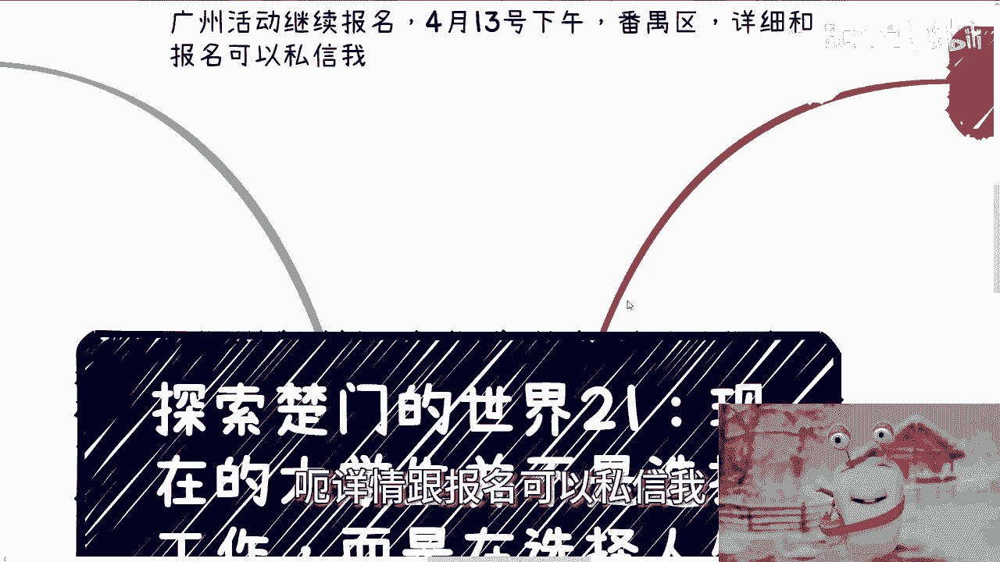
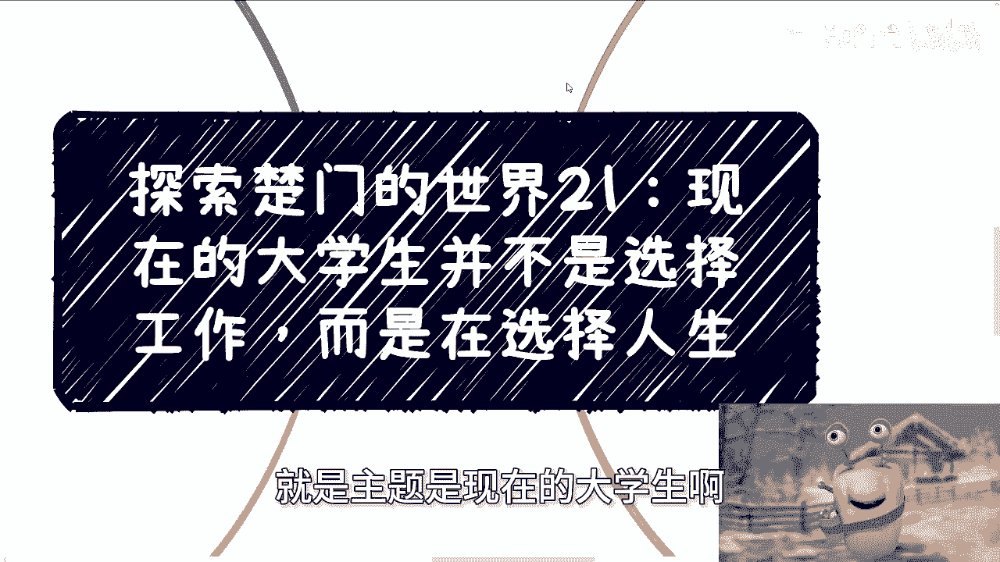
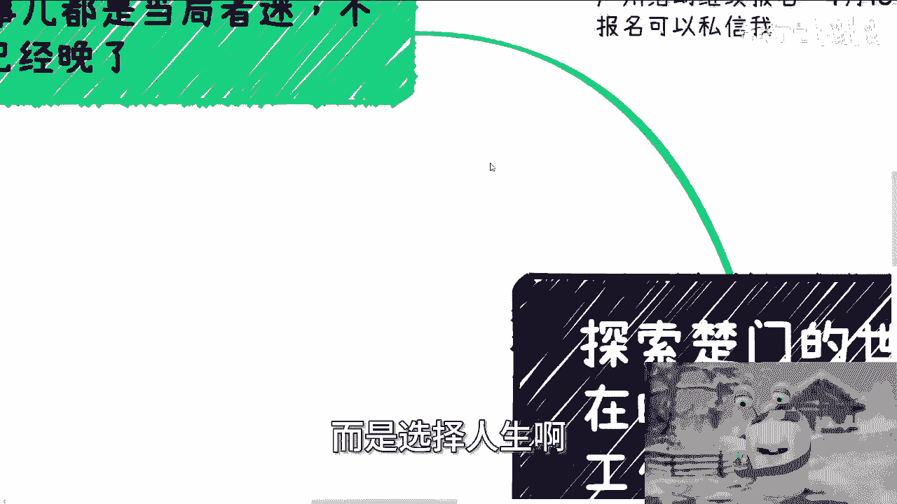
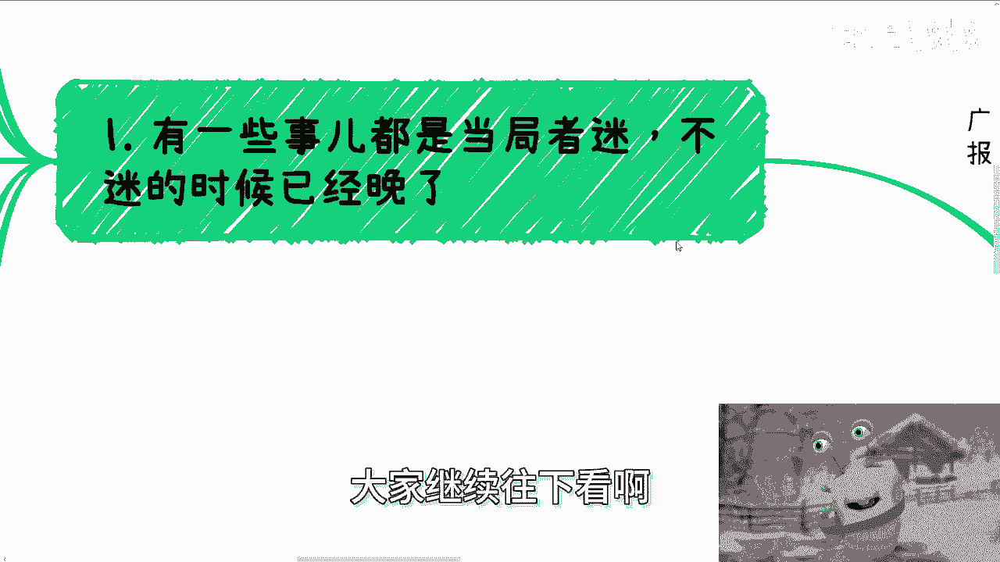
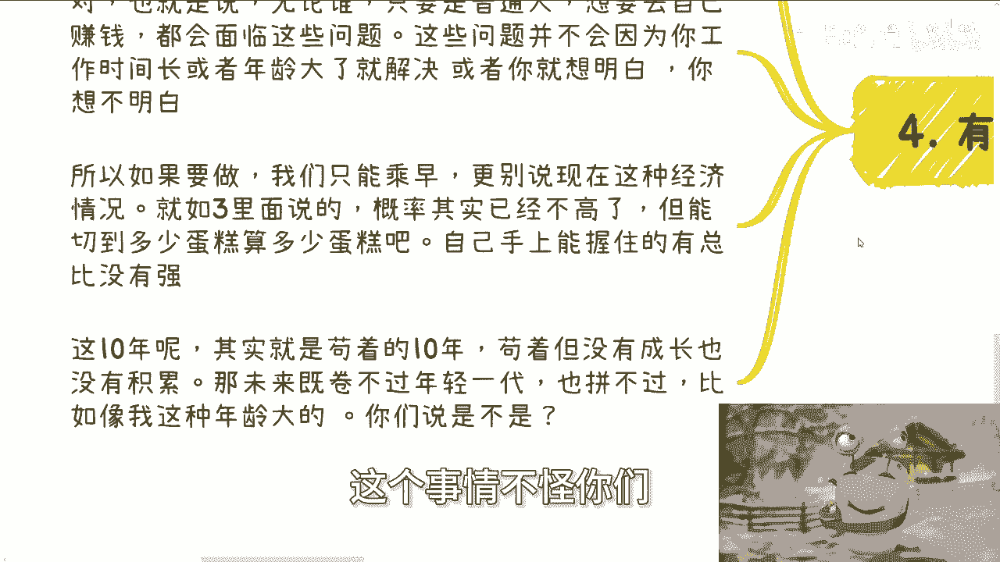
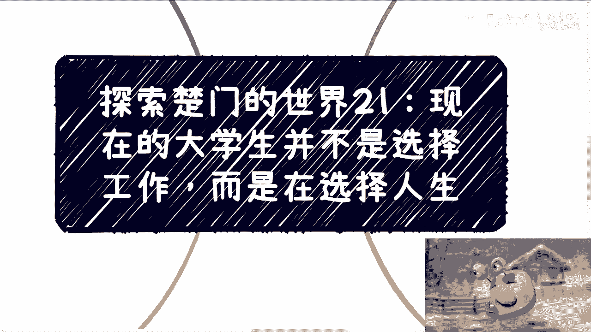

# 探索楚门的世界21：大家不是选择工作，而是选择未来的生活状态 - P1 - 赏味不足 - BV1NT421m7jH

好这个广州活动继续报名啊。

4月13号下午番禺区啊，详情跟报名可以私信我呃。

今天呢是他们楚门啊，探索楚门的时间，21啊，这个呢跟以前可能有点不一样啊，就是主题是现在的大学生啊。

并不是选择工作，而是选择人生啊。

就是说啊当然这个主题听上去比较虚啊，但但但内容不虚啊，大家继续往下看啊。

就有一些事呢我就当局者迷啊，不迷的时候就晚了啊，因为现在大部分人呢你看啊选择工作很纠结啊，就比如说我是工作啊，找个工作还说我考公务员啊，然后是不是说考这个找工作还是事业编对吧啊。

然后呢找工作呢是不是大厂对吧，都很纠结啊，然后呢各各自都有各自纠结的点，不过你们要明白一点啊，现在跟以前不一样，大家因为还年轻，都在纠结方向上的，专业上的，或者说offer的整个package上面呃。

而且觉得比如说我今天做个工作对吧，我前台中台后台可能都很不同，还是那句话啊，你说有没有不同，有，但你说有没有多大不同，没有啊，就那句话怎么说来着，叫做有点东西，但不多啊，那么当下的情况其实很特殊。

就是2020年到2030年这10年的人，我觉得其实是很真空的，因为我们是上面所说的那些，其实都是战术上战术上的差别，这些战术上的差别不会给大家带来多大的影响，也就是说你们现在无论走哪条路。

你们本身未来的发展不会有太大的偏差性，真正影响偏差性的是战略上，那么战略上的差别呢，可能对现在来讲呢就是一辈子，就当然我也不敢说太死，但基本上就是这么个状态，你比如说你选择公务员，比如说你选择去打工。

比如说你想办法自己去赚钱，这三个就是战略战术战略上的不同，当然这些战略的选择并不是说你只能选一个，你可以并行的选多个啊，只不过你需要一个侧重点啊，你可以有过渡，你可以有一个缓冲，但目标不能变。

因为任何一个战略目标都是需要积累的，而不是说一蹴而就的，什么意思呢，也就是说，但凡你想在中国这个国家去赚自己的钱，你没有去积累你的合作伙伴，你没有去积累你的关系，你没有去积累你的案例。

你怎么可能赚得到呢，对吧哦，你说啊，陈老师，因为我工作了5年，谁你啊对吧，你要说你在体制内做了个10年，然后还有了一定地位，你说你要是10年后不做了，你出来，我个人觉得还有那么点可能性对吧。

你要但凡跟我说，陈老师，我在大厂在什么小小厂在什么地方对吧，我在什么行业积累了10年，或者说怎么样有卵用啊，谁他妈关心呢啊，满地一抓一大把，不被淘汰就不错了，还要你谁要你啊，然后呢。

那么这个时候就有人问问题了，他说唱啥，按照你这个说法，好像现在人都是啊，以前人是不是都不是，我跟你讲，没有每一年出来都是，有什么区别没有区别的，只不过的时代不一样，你懂吗，只不过就是在的同时。

这个环境这个生态有没有给你机会，你就比如说以前大家毕业之后也是啊，没错啊，谁懂啊，哪个人懂啊，你去问问现在那些做商业，现在赚钱的，你问他们毕业的时候懂吗，懂个屁对吧，除非真的就是说那些商二代对吧。

那他可能就是耳濡目染对吧，你这懂什么东西啊，但市场有足够机会，公司也有足够多的机会，就比如说以前市场有很多的机会给你做，你去做公司呢也有非常多的业务给你去做，为什么，因为整个市场很好，哪怕你做公务员。

你整个就是说天花板上线，你可能也会有一个很好的发展，一个切入点给到大家，这个叫什么，这叫做被动的环境，你就比如说你打工，你可能会认识一些人，这些人在未来可能都变成大佬，而你们可以去跟这些大佬。

比如说一起创业，一起赚钱，但你有没有想过，为什么不是我们以前说过，不是因为你工作认识一些人，而你说啊我今天去什么地方能够一起创业，一起赚钱啊，也不是因为你们牛逼，也不是因为他们牛逼啊。

也不是因为你们与众不同，仅仅是因为整个环境和土壤比较好，所以他们可能会有更多的发展，然后你能跟他们有更多的合作，你懂吗，没有人是与众不同的，都差不多的对吧，你比如说我做政企咨询。

难道我毕业就知道这条路啦，我知道个屁啊啊，我要但凡知道我毕业的时候，还他妈去做什么什么什么天台上那种维修啊，一个月才他妈500，我妈有毛病对吧，那怎么做的呢，不还是先有企业找我，然后中介也找我。

然后咨询公司，培训公司找我对吧，你就是一路被推过来的，说白了我知道啥，我知道个屁，他们说啥我都信，就他们把我哪怕卖了，我也不知道对吧，我给你们这么讲，我早年什么地方没跑过对吧，新疆黑龙江东北很多地方。

我，我跟你讲，我活到现在就没去过，那我怎么敢去呢，我不是敢去，我是根本就不懂，你懂吗，所以说简单来讲，就是说以前战略上无论你选什么，因为整个环境土壤他会给你一些机会，让你有被动的啊。

能够去积累或者突突破的可能性，但现在没有了，我真的是一点都没有啊，你再不主动，你还有指望啥对吧，第三象牙塔内外的交汇对吧，现在这个情况我跟你们说，交汇点越来越少，为什么，因为象牙塔外预算急剧下降。

我这么跟你们讲，50%，我他妈说少了，你们自己去了，你们真的你们自己去了解啊，就像我们所有的人啊，再吃一个存量的蛋糕，而到了现在吃的只剩下渣渣了，那么大家怎么办，你是不是说所有的这个再吃蛋糕。

有能力吃蛋糕的人，都只能勒紧裤腰带继续去吃啊，那他不知道怎么活呢，对不对，但没办法啊，你比如说以前对吧，一年打个比方，一年有1000个亿对吧，这个蛋糕现在好了，只有只有比如说比如说那个啊100个亿了。

可能100个亿也没有说，只有，1000给你说少了，但anyway，反正就这个意思啊，比如说现在可能只有这个这个不是100了，比如说四五百个亿了，三四百个亿了，那这个蛋糕吃不吃，你还得吃啊。

你不吃怎么活啊对吧，而且你勒紧裤腰带去吃的时候，竞争越来越激烈，你也没有余力再去管别的东西，而象牙塔外原本原本那些合作或者是交集，他会改变其根本属性，什么意思，就是说以前的时候我们就说交汇有没有有的。

就比如说找我的这种人，就是教会嘛对吧，但是问题是你教会的这个过程当中，一一方面是象牙塔外，对内会有一定的商业商啊，商业的业务就大家可以合作，那当然你们也可以认为是收割的，也无所谓啊，无所谓。

那么另外一方面呢就是交汇的时候，内外合作的可能性还是很大的对吧，那当然你说是不是象牙塔外的人脾气好，或者说良心，当时发现了，并不是，仅仅是因为他们当时觉得整个生态都很好，整个环境都很好。

然后比如说他找我，我作为一个象牙塔内的人，他觉得我有利用价值，那么利用我了之后，比如说他一年能够相比以前多，那么10%的营收或20%的营收，那么他觉得大家都能赚到钱，而经济也在上升上升。

那么自然他的合作心态也很好，合作机会也很多，但是现在什么概念，现在原本的那些交汇点全部变成了割，变成了韭菜被割，当然啊我不是说那个直接被割，你就拿我来讲，比如说以前给我钱吗，给的现在给我吗，也给给的少。

比如说直接他妈的削减我90%对吧，或者说就直接白嫖你，这就是哥呀，因为我们毕竟不是甲方，就是你也好我也好，我们今天作为普通人，我们是不可能成为甲方的，我跟你讲，这辈子是不可能的对吧。

也就是说我们不知道具体预算是多少，但按照以前的经验，我跟你讲，现在肯定就是低很多很多，你你虽然不知道，但是你知道低很多很多，那么第四点，你说有没有可能改变啊，你说改变总有的，但概率很小。

你比如说你选择考公或者打工，几年后，新的应届生出来了啊，你说我不想做了，我想去寻找新的机会，哪去找啊，我就问你，你会啥对吧，你会啥，你会个屁对吧，别人为什么搭理你，而且啊另外一方面，无论谁。

只要是普通人，你想要自己去赚钱的，都会面临这些问题，这些问题并不会因为你工作时间长了，或者年龄大了就解决了，或者你就想明白了，你想不明白的，我跟你讲哦，所以如果你要去做，你只能趁早做，你还有什么选择呢。

没有啦，对不对啊，你更更别说现在这种经济情况，就如我们第三第三点，刚刚说的概率其实已经不高了，但能切到多少蛋糕算多少吧，是不是你自己手上能握住的总比总比没有强吧，啊然后这10年呢其实你想啊。

其实就是苟着的，1010年苟着什么意思，就是能生存，能有些钱，但是苟着对你们来讲意味着什么，意味着所有这10年你们应届生毕业的人，苟着是没有成长，没有积累的，为什么，因为整个土壤不会让你们有成长。

也不会让你们有积累，因为所有的土壤里面的人都他妈在那边，为了自己的生存而而而而奋斗，而而而而在那边吃渣渣对吧，哪有人关心你们的成长，哪有人关心你的积累啊，啊那么未来对于你们来讲，你们既卷不过年轻一代。

也拼不过，比如说像我这样的对吧，虽然我也不想拿我举例子，但是就可能让你们更明白一点啊，你们既卷不过以后的应届生，也拼不过比你们年长的人，你们能拼什么，你告诉我就是往年轻人拼，你拼不过体力，往年长的人拼。

你拼不过关系，你拼得过啥，但是我还是那句话，这个事情不怪你们。

你懂吗，就这个东西不，你们不要，千万不要觉得啊，你们好像是不是说啊，我觉得这个事情不怪你们，但是问题是，如果你们现在不主动去做出选择，不主动去积累，那就不，那你就怪不了别人了，对不对，没有办法。

你说你说所谓时势造英雄，那你整个的时代就这个样子，你能怎么办呢，啊你说我在这边等啊，陈老师，我就等等个10年，10年后经济会好，10年后经济就会好，跟你有他妈的卵关系啊，对不对，一样的呀，我跟你讲。

现在市场就这么大，真的就是这么大，有时候我跟你讲逻辑就这么简单，你说每每次啊就咨询我的人，大家说自己想法的时候，我就会问他，我说你到底希望30岁之后，你是怎么样的一个人生对吧。

你是想着还是996007卫生生计所迫，还是说你想自由一点对吧，还是说你想灵活一点，你到底想要什么，你绝对不可能出现一种情况，说陈老师，我现在选公务员，或者我现在要去打工，然后你说我30多岁。

我我到二十七八岁再出来对吧，我想我想开始怎么样没有用的，你二十七八岁出来，你还是要从零开始积累，你有的这些东西跟商业上没有关系，你想要30多对吧，或者甚至二十七八，二十八九，你就要自由一点。

或者说是什么怎么样的这种状态，你只能越早积累越好，大家其实都在同一起跑线上面，怎么办呢，你们不做，大概率不是你们不愿意做，是因为你们受到的教育根深蒂固，让你们觉得你们应该找份工作，或者说你们内心的恐惧。

让你们觉得我得找份安稳的，虽然你们也知道工作不安稳，但又怎么样呢，对就是我现在从来不跟这些人去多说什么，为什么，因为无论说的对也说的不对也好，这些人的想法就是中国90%，95%，98%。

九十九九十九的这些未来的炮灰的想法，没有办法的，因为人就是这么一个生物对吧，人类社会就是这个样子，你要说能改他妈早就改了，好那活动报名好吧，继续报，然后其他的话就是商业职业啊，规划对吧。

包括就是说那个融资股权合同啊，包括其他各个东西，你们要是觉得有什么不清楚的，或者你们希望从我的视角来，更多的看一下你们的这个发展了。

你们可以整理好好吧。