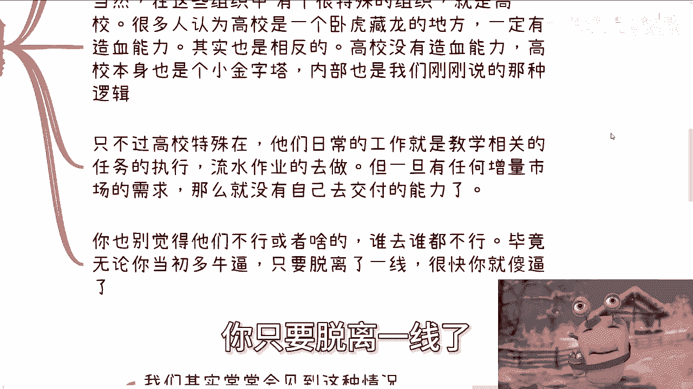
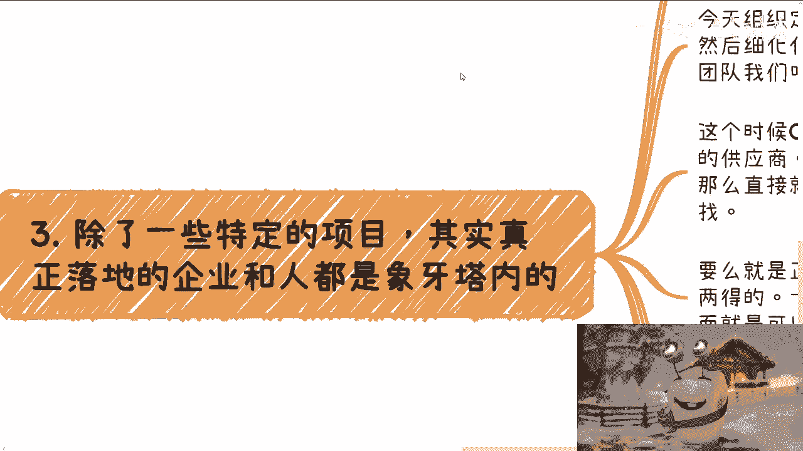
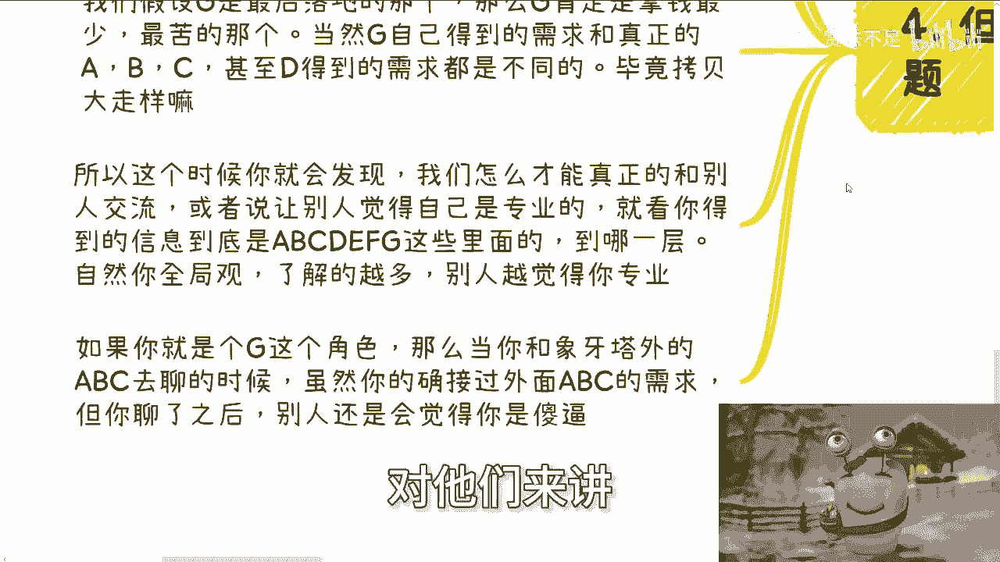
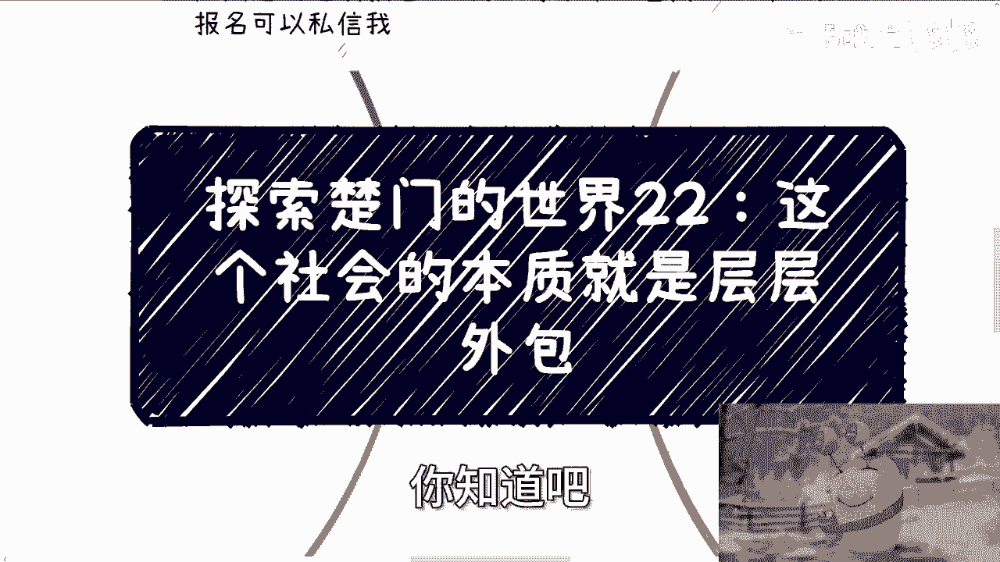
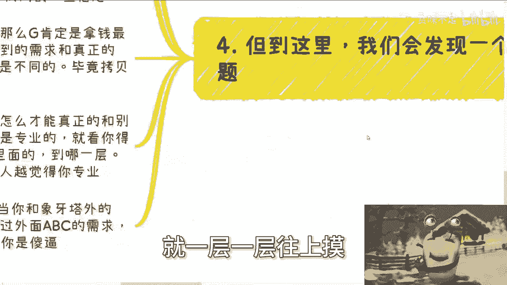

# 探索楚门的世界 22：社会的本质就是层层外包 🏗️

在本节课中，我们将要学习一个关于社会运作的核心观点：现代复杂社会的本质是“层层外包”。我们将通过分析大型组织的管理结构，来理解为什么这种模式是必然的，以及作为个体，我们如何在这个体系中定位和发展。

## 课程目标重申 🎯

首先需要重申我们的核心目标：**为了赚钱**。因此，我们无需纠结于“外包”、“中介”、“甲方”或“乙方”这些标签本身。重要的是理解其背后的运作逻辑，并找到我们的机会。

## 为什么需要层层外包？ 🤔

上一节我们明确了目标，本节中我们来看看为什么“层层外包”会成为普遍现象。假设你有一个宏伟的事业需要管理，你不可能亲力亲为。这时，组建团队是必然选择。

然而，这个团队结构不可能是扁平的，它必然是金字塔型的。随着业务范围扩大，这个金字塔会变得越来越复杂。例如，如果你的业务同时涉及人工智能、农业、金融、互联网和土木工程，你不可能精通所有领域。因此，管理结构必须多元化、复杂化。

一旦结构复杂，就会出现分工极度细化或管理不到位（例如有人“摸鱼”）的情况。为了解决这个问题，多层管理结构应运而生。

我们可以将这种多层结构粗糙地理解为三个层级：
*   **任务制定层 (A)**：负责制定最顶层的战略。
*   **任务细化层 (B)**：负责将战略转化为可执行的方案。
*   **任务执行交付层 (C)**：负责最终落地执行。

由于顶层管理者（A）不可能精通所有业务，他们必须将“任务制定”的部分工作外包给懂行的人（新的A）。同理，B层会将细化工作外包，C层会将执行工作外包。**这种“层层外包”的模式是管理复杂业务的必然结果，无法避开。**

## 金字塔的“造血能力”缺失 🩸

上一节我们介绍了金字塔结构如何形成，本节我们来探讨这个结构的一个关键特性。金字塔内的组织（A、B、C）**本身缺乏“造血能力”**，即真正的落地实践能力。

他们的核心任务是制定方向、细化方案和管理执行，而非亲自下场干活。假设他们拥有交付能力，面对各行各业、不同时期（如2000年至今）所需的不同知识、技能和团队，他们根本无法有效更新和维持这种能力。这就像给你500亿，你也无法凭空组建并运营所有领域的顶尖团队。

高校常被认为是“造血”基地，但本质上，高校也是金字塔内的一个特殊小金字塔。它的核心任务是教学（一种特定的任务执行），并已形成流水线作业。然而，面对增量市场的新需求（如一个新实验室、一个新专业），高校通常没有独立完成的能力，必须通过“校企合作”（产学研）或外部采购来实现。谁能长期脱离一线，谁就会迅速与现实脱节。

## 落地执行的“寻源”链条 🔗

既然金字塔（A、B、C）没有落地能力，那么当需要执行具体项目时，他们就必须向外寻找供应商。这个过程形成了一个复杂的寻源链条。

假设C层需要寻找最终的执行方（G），常见的路径有以下几种：

1.  **硬性门槛路径**：直接寻找符合资质的国央企或500强企业。这条路径与普通老百姓关系不大。
2.  **招投标路径**：通过公开招投标广撒网。此举一箭双雕：既能寻找中标方，也能白嫖大量方案（ID）。
3.  **关系路径**：通过人际关系网络寻找供应商。这是最常见的方式。

在关系路径中，情况会变得非常复杂。C可能通过关系找到D，D搞不定又找E，E再找F，F最后找到G。D、E、F、G可能都是游离于象牙塔（正式组织）内外、依靠关系网络生存的个体或团体。

## 信息衰减与专业壁垒 📉

在漫长的外包链条（A -> B -> C -> D -> E -> F -> G）中，一个严重的问题是**信息衰减**。

每一层在传递任务时，都可能因为自身利益（小算盘）或理解偏差而阉割、扭曲部分信息。最终落地方G拿到手的“需求”，与最初A制定的“真实需求”可能已相去甚远。G却往往认为从F那里得到的需求就是“甲方”的全部要求。

这就引出了一个关键点：**如何让别人觉得你专业？**

答案在于你的**信息层级和全局观**。如果你始终处于链条末端的G角色，只接触被层层过滤后的需求，那么当你与链条前端的A、B、C角色交流时，你会因缺乏对项目全貌的了解而被视为“只是一个执行层”，而非值得对话的“合作方”。

## 普通人的出路：从G到A的攀登 🧗

综上所述，对于普通人而言，在这个“层层外包”的社会中，几乎不存在直接进入核心圈（A、B、C）的捷径。

唯一的现实路径是：**先成为G**（最底层的执行者），然后凭借出色的执行力和人际网络，逐步向上渗透。从G摸到F，再从F联系到E，一层一层向上，逐步接近信息源和决策中心。这是一个缓慢但切实可行的过程。

## 总结 📚

本节课我们一起学习了“社会的本质就是层层外包”这一观点。我们分析了复杂组织必然形成金字塔结构和外包模式的原因，指出了金字塔内部缺乏直接“造血能力”的特性，描绘了项目落地时复杂的“寻源”链条及其导致的信息衰减问题。最后，我们明确了在这个体系中，普通人需要通过从执行层（G）开始，逐步向上攀登来寻求发展。记住，我们的最终目标始终是**赚钱**，理解这套规则是为了更好地在其中找到自己的位置。