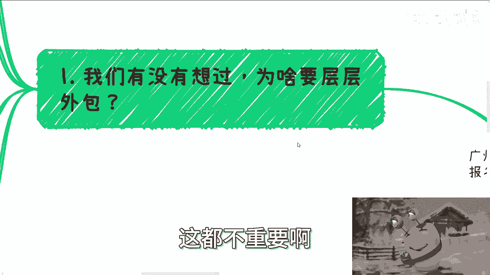
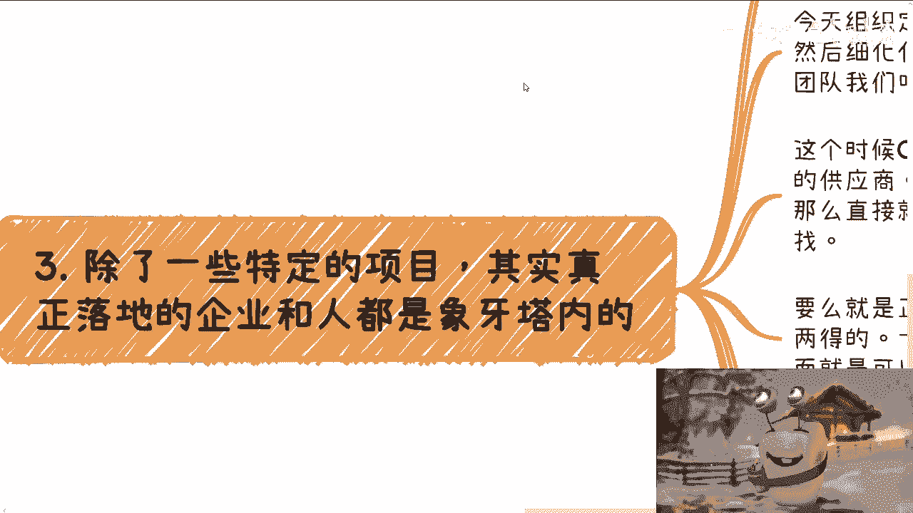

# 探索楚门的世界22：这个社会的本质就是层层外包 - P1 - 赏味不足 - BV1dm411z75P

哈喽大家好啊，呃广州活动继续报名好吧，本周六下午啊，番禺区好吧，详情的话那个呃报名都可以私信我啊，那么本期呢是探索楚门的世界22啊，那么这个主题呢是社会的本质就是层层外包啊，呃我觉得是这样子的。

就是一开始我觉得我可能还得重申一下那个点，就是我们的目标就是为了赚钱，不要去纠结外包也好，中介也罢啊，包括我们上次说的甲方乙方，这都不重要啊。

那么我们来说一下本质啊，就是我们有没有想过为什么要层层外包，那我们假设啊你有一个非常大的组织啊，今天你有个宏伟的事业对吧，你要管理啊，那么你怎么做，你有没有想过你亲力亲，我也肯定不可能，对不对。

你没有这个时间，那么组建团队来管理可不可以可以，但是这个团队不可能扁平化对吧，一定是金字塔型的，而且这个金字塔形你越做会越复杂，为什么，因为你管的面足够大，你管的面足够多，就像今天如果你单纯打个比方啊。

比如说今天你只做人工智能，可能就比较简单对吧，那如果比如说你会发现哦，我又有人工智能，又有农业，又有金融，又有互联网，又又有各种各样的东西，土木对吧等等等，那你你你管得过来吗，或者说你懂吗，你懂个屁。

对不对，所以说你这时候你就会发现，你的金字塔其实是一个多元化的，一个复杂性的结构，那么一旦结构复杂之后，那么它就会出现分工太细化的情况，或者来说就会出现你管不到的情况对吧，就我们说的有人摸鱼啊。

那么多层结构当中呢，我们可以非常粗糙的理解为啊，比如说有任务制定对吧，就是制定最上层战略的啊，然后有任务细化啊，就是把这个战略啊往下再细化一点啊，能够执行的，那再往下呢就是执行交付对吧，这么几个。

啊那么你会发现啊，就是由于你要管理的业务实在过于广泛，那么任务制定的这个团队，也不可能是你来制定吧对吧，就像我说的，你懂吗，你不懂，那么你说你有几个，打个比方，你有几个合伙人对吧，你能你能懂吗。

对合伙人懂吗，也不懂对吧，所以说这个时候你就会发现，首先任务制定这些就会变成你的外包，对不对，而任务细化呢就会变成了制，就是任务制定的那些人的外包啊，那么任务执行交付又会变成了细化，这个团队的外包。

就是他必须一层一层往外包，为什么，因为做不了啊，太复杂了，怎么做呢，对吧啊，这就像这就像我们说啊，这就像我们说今天比如说哎，你们会发现这个国内有很多大厂对吧，那我就问你们觉得一个产品可能很简单。

那为什么这大厂要他妈几万人，为什么呢，对不对，就是你说在这个当中有没有人摸鱼对吧，有没有人划水，我不知道，但是你从本质上来讲，这个当中就是细化的程度太多了啊，那么当然你会发现也许大家地位是平等的。

但是由于需要管理，就跟我该系列呃，第一期还是第二期，就是就是最早的那几期里面讲的，就是他是有身份区别的，也就是说有些人他就是有权的，有实权的，有些人是虚的，也许他有权，但是虚的。

那么你会发现有了这么一个金字塔之后呢，然后由于业务很复杂，所以就必须多层结构，那么这种看似层层外包的模式是避不开的，否则你想想看你怎么发展，对不对对啊，那么第二那么金字塔本身呢，我跟你讲啊。

他是没有造血能力的，就是说我们刚刚说的金字塔里面，你们就这么想啊，这些相关的组织本身没有造血能力，这里的造血能力指的是什么，就是指的真正的落地能力，它是没有的，因为他们的任务就是制定任务宏观方向。

然后细化任务，然后落地去执行对吧，这是他们的目标啊，那么他们没有造血能力是必然的，为什么，因为我们假设他们有交付能力，假设啊，我们假设他们有交付能力，你怎么交付法，就是你会发现哦，你不但是各行各业。

各个不同的行业需要的知识不同，然后你需要的落地的技能也不同，需要落地的团队也不同，然后你随着时间发展，比如说2000年到现在发展20多年对吧，你发的这个这个这个这个技术也不同。

你告诉我这个金字塔能落地怎么落，卧槽怎么落，你我我我我我假设啊，我给你，我就给你500个亿，你觉得你能落吗，你也落不了，大哥，你知道吗，根本落不了，没有这种可能性的对吧，就像我们说的。

你如何去更新这些团队的钱又从哪里来呢，对不对，你不可能的，那当然在这些组织当中，有些很特殊的组织就是高校啊，那么很多人认为高校是一个卧虎藏龙的地方，一定是有造血能力的，但其实我告诉你们。

高校也没有造血能力，因为高校本身它就是一个，在金字塔这个层级里面的一个小的金字塔，就内部就是我们刚刚说的那种逻辑啊，只不过就是说高校呢它是一个特殊的存在，因为他是一个负责教育的一个地方。

那么他们日常的工作呢是教学相关的，这个任务的执行，那么你会发现整个不管是小学初中高中对吧，大学这么一个任务执行，它已经进入了一个流水化作业的一个模式啊，但是你会发现一旦有任何增量市场的需求。

他们有能力做吗，他们没有能力做的，你知道吗，就我们随便打比方，你们仔细想看啊，我们今天说有个增量市场的实验室，你有看到过哪个高校自己有能力做的吗，没有的，他一定是校企合作的，你知道吗。

就一定是所谓的产学研啊，你说他单纯高效，自己做不现实的，因为不好意思，他没这个能力啊，包括是什么，包括就是你们看到那些新的专业，新的专业是自己做的吗，也不是新的专业，是他会从老的专业里面。

每个专业去抠几个，然后做一个缝合怪，或者来说去外部采购一部分的课程，他自己有能力做吗，没有啊，或者我们退1万步来讲，他有能力做的是什么，是学术类，或者说理论类的，但是有任何产业类的实践类的东西吗，没有。

因为高校没有这个能力啊，那么你也别觉得他们不行，或者什么，我跟你讲，谁去谁都不行，为什么，因为无论你当初多牛逼，你只要脱离一线了。

很快你就是个，我跟你讲，不需要两三年一年，你就是个啊，第三除了一些特定项目啊。

其实真正落地的企业根源都是象牙塔内的，就我们来讲啊，就是你比如说常常见到这种情况，我跟你讲，第三跟第四点可能比较绕啊，就是今天比如说组织，就整个金字塔这个组织对吧，定了一个新的目标。

制定目标的团队我们称之为A啊，然后细化任务的团队，我们称之为B啊，然后要开始执行跟交付的团队，我们称之为C，那么这个时候C呢，因为他没有造血能力，他没有这个能没有这个落地能力，那么开始寻找所谓的供应商。

那么寻找的过程呢无非那么几种，第一种是什么，就是如果有一些硬性的门槛，那么直接就是去找国央企，或者找一些500强对吧，也就是说找那些符合要求的企业，那么这种企业相对来讲，跟我们这种老百姓就没有关系。

对不对，好，那么第二种呢就是正常的招投标，进行广撒网的模式，那么这一举动呢属于一箭双雕，为什么招投标这件事情，一方面能够找到合适的中标单位啊，当然也有可能找不到对。

那另外一方面呢就是说可以白嫖非常非常多的，ID啊，好，那么最后一个也是我们目前来讲最常见的那种，就是寻求关系来找到合适的供应商，那么这个时候你就会发现，他的关系的分支非常的多，比如说亲戚，比如说朋友。

比如说同学，比如说同事，比如说任何任何关系啊等等等，那么我们我们可以统称啊，这些关系不管他走哪个分支，我们都认为是D啊，D那么这个时候我们就这么说，D可能搞不定，然后找EE，然后搞不定，然后找F啊。

然后F搞不定，可能找G对吧，一层一层往下找，那么他有可能是直接来对接，他有可能是组饭局，比如说D搞不定，他不一定找得到E啊，他可能找得到无数个亿啊，比如说我组个饭局来了十个亿。

然后我在这E里面再去寻找哪个E是比较合适，我的对吧，大家都是这么找的啊，好那么弹道发展到这个地方，你会发现一个问题，什么问题呢，就是除了金字塔内的ABC以外，剩下的DEFG等等。

理论上他可能都是象牙塔内的，或者来说是迂回于象牙塔内外的这些人，因为攀登他们毕竟有点关系，我先不说他们关系多么硬啊，但问题来了，你会发现从D开始，其可能他其实已经可能就不知道，这个项目的真正需求是什么。

也不知道这个项目的预算是多少，他已经不知道了哦，包括这个方，包括这个项目的发展是什么，他也不知道啊，因为D他只知道C它所传达的东西，而C其实已经经过了层层外包，下面下来的内容。

而且往往你要明白所谓外包是什么意思，就是或者说任务分配是什么意思，就是往往B和C他还有自己的小算盘啊，那么它可能还会阉割一部分的信息，那么我们假设G是最后落地那个，那么G可能是肯定是拿钱最少的。

而且是最苦的那个，这个在我们上一期的那个内容我也讲过对吧，当然极易可能觉得他自己得到的需求，是真正的需求，就是他认为他对接的甲方，比如说ABCDFGAF对吧，比如说他对接的F他认为F是甲方啊。

然后他从F这边得到需求，他就认为是真的需求，但是呢从我们开上帝视角来讲，G自己得到的需求，跟真正的ABC，甚至D所得到的需求都是不同的，毕竟就我们就说嘛，就是人这个生物或者组织这种形态。

他一旦任务往下派了之后，他就会靠背大走样，你们参考疫情对不对，所以这个时候你就会发现，我们怎么才能真正的和别人交流，或者说让别人觉得自己是专业的，那就看你得到的信息，到底是在ABCDEFG这里面哪一层。

你明白吗，就是说如果你的全局观了解的越多，别人自然而然觉得你越专业，你想想看啊，今天也许你是一个做过各种单子的，做过象牙塔外单子的人，但是如果你只是记这个角色，那么当你跟象牙塔外的ABC这种角色的人。

去聊的时候，虽然你也许接过他们的需求，但是你跟别人一聊，别人还是会觉得你是个，为什么，因为你指你说出来的需求，跟他们的需求其实还是差很远，同时呢你没有全局观，那么对他们来讲，就是我一早就说了。

对他们来讲。

他们就会认为你只是一个执行层，他不会认为你是个合作方。

你懂吗啊，所以说就是说就是我们在这里面，你说这么多人一直想的问题，就是说我能不能去做对吧，或者说我作为一个普通人有没有可能去做，我就告诉你们吧，我这句话说了无数遍了，就是没机，真正的你们去看啊。

真正的就是说很多机构，基本上是没有造血能力的，就是他们里面有没有全职的人，有的，但是这些全职的人无非是为了维，就是维持这个这个这个组织的一个运营，维持这个组织的一个发展。

但是你要让他真的去完成一些KPI，完成一些这个这个叫什么，就是我们称之为真正的一些，能够需要落地的东西，他没有能力的啊，当然这个时候对他来讲，他的方式方法很多，就是不一定说他要他一定指外包企业嘛对吧。

他可以外包给企业，企业在外包给企业，他可以外包给那个人对吧，他也可以外包给，比如说一些组织，就他有很多种方式，把这个钱想办法怎么去花，但是本质上他的逻辑还是外包，你知道吧，所以说在这个里面。

就是我们其实更多的就就就这个逻辑怎么说，我们更多的就是说我们得要先成为G，然后我们再慢慢从F这边去摸摸呢，再摸到EE这边再摸到D，然后D这边再摸到C就一层一层往上摸。

这只就是这个对对，就是这个对老百姓来说是唯一的一条出路，没有别的可能性的啊，其实是这么一个逻辑，好吧行，那么这期就讲到这吧，然后活动的话反正大家继续报名好吧，然后剩下的话反正就是说呃职业规划。

商业规划你们要有有什么问题吗，反正就整理好。

