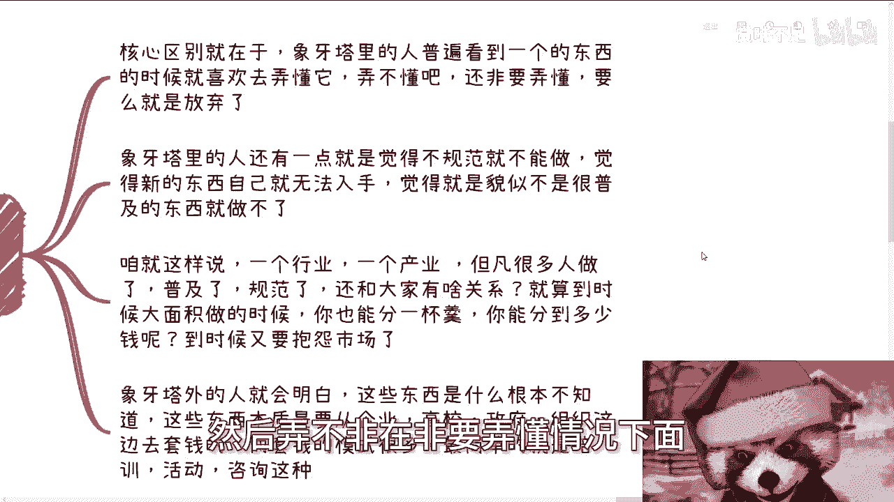

# 探索楚门的世界23：就拿现在的数据要素，新质生产力来看下外面的世界吧 - P1 - 赏味不足 - BV19f421D7mu

好啊，我们来讲这个充电视频啊，今天我们来讲的呢是探索楚门的世界，23啊，来看一下外面的世界呃，就像我刚刚那个视频说的啊，我精神状态非常的美丽啊，这个我我尽量控制一下啊，那么本次活动在成都好吧。

6月16号啊，下午01：30到六点，场地已经定了，在青羊区啊，神谷科医院附近好吧，然后要了解详情或者报名的，你们可以继续私信我啊。

首先啊我们先来说楚门里的世界啊，楚门里的小伙伴是怎么看待，我今天的写的这个主题的啊，他们往往是这么想的啊，比如说什么玩意啊。

我也不懂啊，和我无关啊，这是第一种态度，第二种态度呢就是我想去接触啊，我想看看怎么赚钱的啊，看了之后呢，发现这玩意太虚。

我也不知道怎么切，第三种呢就开始大面积学习啊，开始他妈的啊，就是就是也不跟外界沟通啊，然后自己的妈到YOUTUBE上面各个地方，还大面积学习啊，花大量时间去学习，然后发现学习完了。

他妈还是不知道什么玩意啊。

然后第四呢就是数字经济啊，数据要素啊，数据资产性质生产力，有的看了之后呢，他发现诶这些东西下面呢可能有分支啊，分支是AIGC区块链啊，数据资产化等等等啊。

然后呢开始进入什么AIGC区块链的学习啊，好然后呢。

还有一类呢就是跟身边小伙伴聊了一圈啊，发现我不但自己不懂啊，身边人也不懂啊。

然后发现没什么切呃，没什么好的切那个切入点啊，那那就随之就放弃了，好吧啊，这个就是目前叫什么，就是象牙塔里内小伙伴啊，这个哼最多的想法对吧嗯。

第二啊我来回顾一下。

我们来回顾一下象牙塔内外的核心的区别啊，核心区别就在于象牙塔里面的人啊。

容易很喜欢啊，普遍的看到一个一个东西的时候，我就喜欢去弄懂它啊，就搞好像就非常有这个自信，觉得能弄懂它啊，人弄不懂吧，还他妈非要弄懂啊，然弄不非在非要弄懂情况下面弄不懂吧。

他妈就放弃啊，然后现在它里面人呢还有一点就觉得不规范啊，不能做啊，就比如说啊这个东西好像没有大面积铺开啊，然后呢好像也不是说特别的普及啊，然后就觉得他妈的自己就无法入手啊，觉得貌似不是很普及的东西呢。

就做不了啊，我也不知道这种定式定，就这种思维定是哪里来的啊，第三啊，我就跟你们这么讲啊，一个行业你们往前去翻一个行业，一个产业，但凡做的人多了，普及了，规范了，跟你们还他妈有什么关系。

跟我他妈还有什么吊关系对吧，就算到时候大面积做了，你能分一杯羹，我能分一杯羹，我们又能分多少钱呢，啊，到时候你们那大部分这个夏尔塔，那个小伙伴又要抱怨了，哎呀这竞争力太激烈了对吧，市场不好啊，怎么样子。

那他妈市场好的时候。

你们在干嘛呢对吧，下一塔外的人就会明白，这些东西根本就不用知道是什么，这些东西的本质就是个工具，你知道吗，就是个翘板，也就就是个撬棍，你可以理解啊，就是它的作用就是现在就可以从企业。

高校政府组织这边去撬出钱，而且敲之前的模式很多，最简单的就是我们一直说的培训活动咨询，就他就是个工具。

你不用去弄懂它，你弄懂它干嘛呢，对吧，诶你的目的到底是赚钱还是弄懂它，我他妈搞不明白呢啊，然后我们来看看现在的情况啊。

从去年下半年到现在，跟数据要做活动已经很多很多了，主要集中在大数据中心，产业园大数据局啊，律师行业，律师协会，律师，律师产业，各种EMBAEMEMBANMBA的课程里面。

当然同时主要还是以北上广深一线为主的，活动比较多，技术行业很少很少。

非常的少，别的领域就更少了，为什么，很简单，第一我们所说的大数据呃，产业园大数据局啊，或者大数据中心，或者跟大数据有关，这些地方，跟我们说出数据要素是最贴近的啊，那么自然而然也是怎么说呢。

就是跟风功能最快的，那么律师的话呢可能很多人就不了解了，但是律师的话的确也很有关联，为什么，因为数据要素，数据入库录表，数据资产里面有非常重要的一环，就是所谓的合规啊，那么合规谁来做呢，律师来做。

那非常的合情合理对吧，make sense啊，那么包括数据资产化等切入点就比较直接，那么由律师这边，律师协会这边来做NBA，NBA这种东西纯粹就是追热点啊，就是为了更好招生，哪个地方哪个东西。

新他妈的做哪个东西就这么简单啊，那当然为什么，同时以北上广深这些一线城市活动比较多呢，就是因为他是一个特别性的东西，目前来讲能赚到钱，再跟风的也只有一线城市，这就是整个中国的一个发展规律，你不用去管它。

为什么你往前推任何一个行业都是这样子的，你难道每个行业都去问他一遍，为什么吗对吧。

当然啊，客户的话主要是想尽快切这呃，就是来到我指的是付钱的客户，一方面是主要想尽快切这块领域的散户啊，包括企业，包括完成政治命令的那些国企，央企，还有一些地方的协会，商会等各种组织。

就是这么简单对吧好，那么我们继续来看啊。

第四点，其实你会发现对于大家来讲就是这么矛盾，就是大家觉得自己不懂，然后找不到切入点，然后根据我说的三啊，就三就我刚刚说的这个这个当下的这个情况啊。

对吧啊，然后根据我这边说了算，大家也都觉得哎呀貌似很难切入啊，张老师说了啊，但是我听上去貌似很难切入，但是我就问你，你你觉得难在哪呢，他们会说啊很难去找到关系，比如说你说大数据局我怎么找呢对吧。

那很难找到合作点啊，但其实我就问嘛，你们找过吗啊，一个城市有多少数据相关的地方，有多少产业园，有多少中心，你们找过吗，你们去找过对应的商务聊过吗，你们他妈上来就跟我说，我们找不到切入点对吧。

你单纯一个区下面就有好多个，你找过我啦，没找过，你接触过不啦，没有啊，你上来就跟我说，我接触不到，那他妈还连你还做个屁啊对吧，然后他们还说哎那去了呀，自己也没什么可以提供的东西呀。

那你就先去找可以提供的人或者公司啊，对不对，比如我对吧，比如说已经你们在线上能够找到，你们在网上已经找到，或者开过数据资产的这些律所或者这些协会，网上一搜肯定是有的，你去联系联系又不要钱。

你有你联系不啦，永远不做，然后跟我说爱称说我们接触不了对吧。

哎你们自己想想看当下这个情况是什么。

明明这种时候机会是最多或者竞争力是最少的，对而不是竞争力，就竞争这个这个相对来讲还没有到白热化，大部分的人都在打退堂鼓。

而且打退堂鼓的逻辑是他们根本没有去做，这他妈就是最割裂的地方啊对吧。

真的就就这么神奇，你包括你包括就是说他们他们那个前两天咨询，还有人问我说哎，陈老师，你觉得这个行业什么时候变好对吧，或者整个市场什么时候变好或者怎么样子，我说好不好，你不用去管他呀，你今天做医疗也好。

做做做呃，农业也好，做金融也好，做计算机也好，做互联网也好，做别的东西也好，所有中国从中央到各地方做事情的方式，都是一套逻辑呀，你要去你要去通过case落地的，摸索的本质是要摸索到这个逻辑的本身。

而不是说这个行业你跟任何行业没有关系，你今天只要摸索到这个本质，摸索到这个运作逻辑的一丁半点，你去任何行业都是一套运作逻辑啊，你们明白吗，就这个东西已经讲了无数遍了，就是就是说白了就是说今天啊。

你们比如说我们呃，比如说你们已经跟高校已经合作过了，你们已经明白如何跟高校人打交道，你们也已经明白高校如果切入的话，大概怎么切法对吧，那么你们给高校合作的东西，到底是金融还是心智生产力，还是数据要素。

还是以前的大数据还是什么东西，以重要不啦，不重要呀，因为你们已经掌握了其合作的本质，其运作的模式，那么你们无论到中国各个哪个城市，哪个运作方式都是一样的，你问我，这大大家为什么还要再去纠结。

我到底在哪个行业呢，他妈一点都不重要啊，哪个行业能让你摸到里面的一些一丁半，一星半点的东西，你就去做啊，对不对，好吧对吧，那你说你说楚门的世界，这个这个里外他看问题方式是不一样。

但看看问题做法可能也不一样，但是本质上没有人阻碍你们去探索啊，对不对，好吧哦我我我希望我能讲明白了啊，好吧行，然后那个呃呃活动好吧，活动成都的活动继续报名，然后剩下的话就是说呃那个职业规划，商业规划啊。

包括你们的额，比如说碰到一些问题，比如说什么合同啊，期权啊，股权啊啊分润啊，分红啊对吧，包括你们那个项目计划书啊，白皮书啊等等等啊，你们觉得这个喷呃，如果有些什么问题的或者详细问题的。

你们可以整理好相关的问题和个人背景啊，我我我们再来详细做咨询啊，同样的就是说你们希望从我从我的这个角度啊，从我的这个视野能够给你们一些，更贴近于未来发展的一些呃规划的话，那么你们也可以啊。

这个整理好对应的东西好吧，然后另外一方面呢，就是说呃如果啊你们指望着这个咨询本身啊，能给你们带来财务自由，或者带来一些这个这个质一样的变化啊，或者说怎么样子啊，那你们就别来找我了，你们找别人去啊。

我没这个能力，你们该该把这个钱被谁骗就被谁骗了。